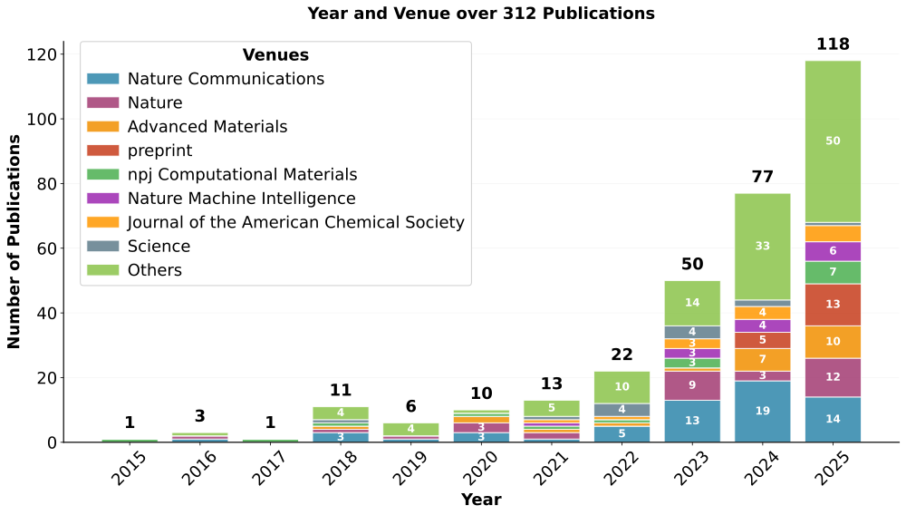

<h1>MatVerse AI4(M)S Paper Collection</h1> 
<h3>Update Time: 2025-09-18 22:20:41</h3>

---

This is a regularly updated paper collection about AI for science, with a specific focus on materials science.

## 📈 Publication Timeline

---

## 📚 Venue Index

This section provides a quick overview of papers organized by publication venues for easy navigation.

### ACS Applied Materials & Interfaces (1 papers)

- [69. Machine Learning-Assisted Synthesis of Two-Dimensional Materials](#69-machine-learning-assisted-synthesis-of-two-dimensional-materials) *(January 11, 2023)*

### Acta Materialia (6 papers)

- [362. Accelerated multi-objective alloy discovery through efficient bayesian methods: Application to the FCC high entropy alloy space](#362-accelerated-multi-objective-alloy-discovery-through-efficient-bayesian-methods-application-to-the-fcc-high-entropy-alloy-space) *(September 15, 2025)*
- [340. Generalizable descriptors for automatic titanium alloys design by learning from texts via large language model](#340-generalizable-descriptors-for-automatic-titanium-alloys-design-by-learning-from-texts-via-large-language-model) *(September 01, 2025)*
- [267. A novel training-free approach to efficiently extracting material microstructures via visual large model](#267-a-novel-training-free-approach-to-efficiently-extracting-material-microstructures-via-visual-large-model) *(May 15, 2025)*
- [234. Developing novel low-density high-entropy superalloys with high strength and superior creep resistance guided by automated machine learning](#234-developing-novel-low-density-high-entropy-superalloys-with-high-strength-and-superior-creep-resistance-guided-by-automated-machine-learning) *(February 15, 2025)*
- [215. Topological data analysis assisted machine learning for polar topological structures in oxide superlattices](#215-topological-data-analysis-assisted-machine-learning-for-polar-topological-structures-in-oxide-superlattices) *(January 01, 2025)*
- [167. Compositional design of multicomponent alloys using reinforcement learning](#167-compositional-design-of-multicomponent-alloys-using-reinforcement-learning) *(August 01, 2024)*

### Advanced Functional Materials (4 papers)

- [266. Interpretable Machine Learning Applications: A Promising Prospect of AI for Materials](#266-interpretable-machine-learning-applications-a-promising-prospect-of-ai-for-materials) *(May 13, 2025)*
- [140. Machine-Learning Assisted Screening Proton Conducting Co/Fe based Oxide for the Air Electrode of Protonic Solid Oxide Cell](#140-machine-learning-assisted-screening-proton-conducting-co/fe-based-oxide-for-the-air-electrode-of-protonic-solid-oxide-cell) *(March 18, 2024)*
- [47. Innovative Materials Science via Machine Learning](#47-innovative-materials-science-via-machine-learning) *(February 03, 2022)*
- [45. Applied Machine Learning for Developing Next-Generation Functional Materials](#45-applied-machine-learning-for-developing-next-generation-functional-materials) *(December 16, 2021)*

### Advanced Materials (23 papers)

- [348. AI-Driven Defect Engineering for Advanced Thermoelectric Materials](#348-ai-driven-defect-engineering-for-advanced-thermoelectric-materials) *(September 04, 2025)*
- [347. Artificial Intelligence-Driven Approaches in Semiconductor Research](#347-artificial-intelligence-driven-approaches-in-semiconductor-research) *(September 04, 2025)*
- [322. Empowering Generalist Material Intelligence with Large Language Models](#322-empowering-generalist-material-intelligence-with-large-language-models) *(August 14, 2025)*
- [306. Biomimetic Intelligent Thermal Management Materials: From Nature-Inspired Design to Machine-Learning-Driven Discovery](#306-biomimetic-intelligent-thermal-management-materials-from-nature-inspired-design-to-machine-learning-driven-discovery) *(July 29, 2025)*
- [292. Self-Evolving Discovery of Carrier Biomaterials with Ultra-Low Nonspecific Protein Adsorption for Single Cell Analysis](#292-self-evolving-discovery-of-carrier-biomaterials-with-ultra-low-nonspecific-protein-adsorption-for-single-cell-analysis) *(July 02, 2025)*
- [275. SciAgents: Automating Scientific Discovery Through Bioinspired Multi-Agent Intelligent Graph Reasoning](#275-sciagents-automating-scientific-discovery-through-bioinspired-multi-agent-intelligent-graph-reasoning) *(June 05, 2025)*
- [242. Artificial Intelligence and Multiscale Modeling for Sustainable Biopolymers and Bioinspired Materials](#242-artificial-intelligence-and-multiscale-modeling-for-sustainable-biopolymers-and-bioinspired-materials) *(March 10, 2025)*
- [233. Machine Learning in Solid-State Hydrogen Storage Materials: Challenges and Perspectives](#233-machine-learning-in-solid-state-hydrogen-storage-materials-challenges-and-perspectives) *(February 12, 2025)*
- [232. Machine Learning in Polymer Research](#232-machine-learning-in-polymer-research) *(February 09, 2025)*
- [218. Synthesis Strategies for High Entropy Nanoparticles](#218-synthesis-strategies-for-high-entropy-nanoparticles) *(January 08, 2025)*
- [193. A Machine Learning Study on High Thermal Conductivity Assisted to Discover Chalcogenides with Balanced Infrared Nonlinear Optical Performance](#193-a-machine-learning-study-on-high-thermal-conductivity-assisted-to-discover-chalcogenides-with-balanced-infrared-nonlinear-optical-performance) *(November 06, 2024)*
- [186. MatGPT: A Vane of Materials Informatics from Past, Present, to Future](#186-matgpt-a-vane-of-materials-informatics-from-past-present-to-future) *(October 09, 2024)*
- [156. Closed-Loop Multi-Objective Optimization for Cu–Sb–S Photo-Electrocatalytic Materials’ Discovery](#156-closed-loop-multi-objective-optimization-for-cu–sb–s-photo-electrocatalytic-materials’-discovery) *(June 04, 2024)*
- [151. High-Entropy Photothermal Materials](#151-high-entropy-photothermal-materials) *(June 2024)*
- [149. Large-Language-Model-Based AI Agent for Organic Semiconductor Device Research](#149-large-language-model-based-ai-agent-for-organic-semiconductor-device-research) *(May 30, 2024)*
- [133. Data-Driven Design for Metamaterials and Multiscale Systems: A Review](#133-data-driven-design-for-metamaterials-and-multiscale-systems-a-review) *(February 22, 2024)*
- [126. Expanding the Horizons of Machine Learning in Nanomaterials to Chiral Nanostructures](#126-expanding-the-horizons-of-machine-learning-in-nanomaterials-to-chiral-nanostructures) *(January 19, 2024)*
- [70. A Materials Acceleration Platform for Organic Laser Discovery](#70-a-materials-acceleration-platform-for-organic-laser-discovery) *(February 09, 2023)*
- [59. Data-Driven Materials Innovation and Applications](#59-data-driven-materials-innovation-and-applications) *(September 08, 2022)*
- [34. Digital Transformation in Materials Science: A Paradigm Change in Material's Development](#34-digital-transformation-in-materials-science-a-paradigm-change-in-material's-development) *(February 24, 2021)*
- [28. Deep-Learning-Enabled Fast Optical Identification and Characterization of 2D Materials](#28-deep-learning-enabled-fast-optical-identification-and-characterization-of-2d-materials) *(June 09, 2020)*
- [27. Artificial Chemist: An Autonomous Quantum Dot Synthesis Bot](#27-artificial-chemist-an-autonomous-quantum-dot-synthesis-bot) *(June 04, 2020)*
- [6. Accelerated Discovery of Large Electrostrains in BaTiO3-Based Piezoelectrics Using Active Learning](#6-accelerated-discovery-of-large-electrostrains-in-batio3-based-piezoelectrics-using-active-learning) *(January 08, 2018)*

### Advanced Science (4 papers)

- [268. Data-Driven Design of Mechanically Hard Soft Magnetic High-Entropy Alloys](#268-data-driven-design-of-mechanically-hard-soft-magnetic-high-entropy-alloys) *(May 22, 2025)*
- [192. Physics-Informed Inverse Design of Programmable Metasurfaces](#192-physics-informed-inverse-design-of-programmable-metasurfaces) *(November 06, 2024)*
- [94. Machine Learning Descriptors for Data-Driven Catalysis Study](#94-machine-learning-descriptors-for-data-driven-catalysis-study) *(August 04, 2023)*
- [21. Data-Driven Materials Science: Status, Challenges, and Perspectives](#21-data-driven-materials-science-status-challenges-and-perspectives) *(September 01, 2019)*

### Advances in Neural Information Processing Systems (4 papers)

- [208. Poseidon: Efficient Foundation Models for PDEs](#208-poseidon-efficient-foundation-models-for-pdes) *(December 16, 2024)*
- [207. Navigating Chemical Space with Latent Flows](#207-navigating-chemical-space-with-latent-flows) *(December 16, 2024)*
- [206. Generative Hierarchical Materials Search](#206-generative-hierarchical-materials-search) *(December 16, 2024)*
- [205. Invariant Tokenization of Crystalline Materials for Language Model Enabled Generation](#205-invariant-tokenization-of-crystalline-materials-for-language-model-enabled-generation) *(December 16, 2024)*

### Angewandte Chemie (2 papers)

- [303. Uni-Electrolyte: An Artificial Intelligence Platform for Designing Electrolyte Molecules for Rechargeable Batteries](#303-uni-electrolyte-an-artificial-intelligence-platform-for-designing-electrolyte-molecules-for-rechargeable-batteries) *(July 21, 2025)*
- [228. Exploration of Chemical Space Through Automated Reasoning](#228-exploration-of-chemical-space-through-automated-reasoning) *(February 03, 2025)*

### Cell (1 papers)

- [350. AI mirrors experimental science to uncover a mechanism of gene transfer crucial to bacterial evolution](#350-ai-mirrors-experimental-science-to-uncover-a-mechanism-of-gene-transfer-crucial-to-bacterial-evolution) *(September 09, 2025)*

### Chemical Science (1 papers)

- [321. SAGERank: inductive learning of protein–protein interaction from antibody–antigen recognition](#321-sagerank-inductive-learning-of-protein–protein-interaction-from-antibody–antigen-recognition) *(August 12, 2025)*

### Chemical Society Reviews (1 papers)

- [227. From text to insight: large language models for chemical data extraction](#227-from-text-to-insight-large-language-models-for-chemical-data-extraction) *(February 03, 2025)*

### Communications Chemistry (1 papers)

- [130. A generative artificial intelligence framework based on a molecular diffusion model for the design of metal-organic frameworks for carbon capture](#130-a-generative-artificial-intelligence-framework-based-on-a-molecular-diffusion-model-for-the-design-of-metal-organic-frameworks-for-carbon-capture) *(February 14, 2024)*

### Communications Materials (2 papers)

- [221. Probing out-of-distribution generalization in machine learning for materials](#221-probing-out-of-distribution-generalization-in-machine-learning-for-materials) *(January 11, 2025)*
- [210. Data extraction from polymer literature using large language models](#210-data-extraction-from-polymer-literature-using-large-language-models) *(December 19, 2024)*

### Communications Physics (1 papers)

- [255. Towards AI-driven autonomous growth of 2D materials based on a graphene case study](#255-towards-ai-driven-autonomous-growth-of-2d-materials-based-on-a-graphene-case-study) *(April 25, 2025)*

### Computational Materials Science (1 papers)

- [260. Large language model-driven database for thermoelectric materials](#260-large-language-model-driven-database-for-thermoelectric-materials) *(May 01, 2025)*

### Computer Methods in Applied Mechanics and Engineering (1 papers)

- [240. The deep finite element method: A deep learning framework integrating the physics-informed neural networks with the finite element method](#240-the-deep-finite-element-method-a-deep-learning-framework-integrating-the-physics-informed-neural-networks-with-the-finite-element-method) *(March 01, 2025)*

### International Conference on Learning Representations (2 papers)

- [112. Fine-Tuned Language Models Generate Stable Inorganic Materials as Text](#112-fine-tuned-language-models-generate-stable-inorganic-materials-as-text) *(October 13, 2023)*
- [111. Scalable Diffusion for Materials Generation](#111-scalable-diffusion-for-materials-generation) *(October 13, 2023)*

### International Conference on Machine Learning (1 papers)

- [279. All-atom Diffusion Transformers: Unified generative modelling of molecules and materials](#279-all-atom-diffusion-transformers-unified-generative-modelling-of-molecules-and-materials) *(June 18, 2025)*

### Journal of Molecular Biology (1 papers)

- [360. Structural Insights into Autophagy in the AlphaFold Era](#360-structural-insights-into-autophagy-in-the-alphafold-era) *(September 15, 2025)*

### Journal of the American Chemical Society (16 papers)

- [368. Modeling-Making-Modulating High-Entropy Alloy with Activated Water-Dissociation Centers for Superior Electrocatalysis](#368-modeling-making-modulating-high-entropy-alloy-with-activated-water-dissociation-centers-for-superior-electrocatalysis) *(September 17, 2025)*
- [319. Designing Pb-Free High-Entropy Relaxor Ferroelectrics with Machine Learning Assistance for High Energy Storage](#319-designing-pb-free-high-entropy-relaxor-ferroelectrics-with-machine-learning-assistance-for-high-energy-storage) *(August 06, 2025)*
- [295. Artificial Intelligence Paradigms for Next-Generation Metal–Organic Framework Research](#295-artificial-intelligence-paradigms-for-next-generation-metal–organic-framework-research) *(July 09, 2025)*
- [293. Natural-Language-Interfaced Robotic Synthesis for AI-Copilot-Assisted Exploration of Inorganic Materials](#293-natural-language-interfaced-robotic-synthesis-for-ai-copilot-assisted-exploration-of-inorganic-materials) *(July 02, 2025)*
- [278. Data-Driven Design of Random Heteropolypeptides as Synthetic Polyclonal Antibodies](#278-data-driven-design-of-random-heteropolypeptides-as-synthetic-polyclonal-antibodies) *(June 18, 2025)*
- [251. A Multiagent-Driven Robotic AI Chemist Enabling Autonomous Chemical Research On Demand](#251-a-multiagent-driven-robotic-ai-chemist-enabling-autonomous-chemical-research-on-demand) *(April 16, 2025)*
- [230. Harnessing Large Language Models to Collect and Analyze Metal–Organic Framework Property Data Set](#230-harnessing-large-language-models-to-collect-and-analyze-metal–organic-framework-property-data-set) *(February 05, 2025)*
- [194. Crystal Structure Determination from Powder Diffraction Patterns with Generative Machine Learning](#194-crystal-structure-determination-from-powder-diffraction-patterns-with-generative-machine-learning) *(November 06, 2024)*
- [189. Efficient Exploratory Synthesis of Quaternary Cesium Chlorides Guided by In Silico Predictions](#189-efficient-exploratory-synthesis-of-quaternary-cesium-chlorides-guided-by-in-silico-predictions) *(October 30, 2024)*
- [166. Large Language Models for Inorganic Synthesis Predictions](#166-large-language-models-for-inorganic-synthesis-predictions) *(July 24, 2024)*
- [141. Crystal Structure Assignment for Unknown Compounds from X-ray Diffraction Patterns with Deep Learning](#141-crystal-structure-assignment-for-unknown-compounds-from-x-ray-diffraction-patterns-with-deep-learning) *(March 27, 2024)*
- [109. In Pursuit of the Exceptional: Research Directions for Machine Learning in Chemical and Materials Science](#109-in-pursuit-of-the-exceptional-research-directions-for-machine-learning-in-chemical-and-materials-science) *(October 11, 2023)*
- [97. ChatGPT Chemistry Assistant for Text Mining and the Prediction of MOF Synthesis](#97-chatgpt-chemistry-assistant-for-text-mining-and-the-prediction-of-mof-synthesis) *(August 16, 2023)*
- [78. Generative Models as an Emerging Paradigm in the Chemical Sciences](#78-generative-models-as-an-emerging-paradigm-in-the-chemical-sciences) *(April 26, 2023)*
- [64. Into the Unknown: How Computation Can Help Explore Uncharted Material Space](#64-into-the-unknown-how-computation-can-help-explore-uncharted-material-space) *(October 19, 2022)*
- [43. Machine Learning Driven Synthesis of Few-Layered WTe2 with Geometrical Control](#43-machine-learning-driven-synthesis-of-few-layered-wte2-with-geometrical-control) *(November 03, 2021)*

### Matter (11 papers)

- [345. Machine learning in X-ray diffraction for materials discovery and characterization](#345-machine-learning-in-x-ray-diffraction-for-materials-discovery-and-characterization) *(September 03, 2025)*
- [291. El Agente: An autonomous agent for quantum chemistry](#291-el-agente-an-autonomous-agent-for-quantum-chemistry) *(July 02, 2025)*
- [274. A data-driven platform for automated characterization of polymer electrolytes](#274-a-data-driven-platform-for-automated-characterization-of-polymer-electrolytes) *(June 04, 2025)*
- [246. Physics-informed, dual-objective optimization of high-entropy-alloy nanozymes by a robotic AI chemist](#246-physics-informed-dual-objective-optimization-of-high-entropy-alloy-nanozymes-by-a-robotic-ai-chemist) *(April 02, 2025)*
- [231. ORGANA: A robotic assistant for automated chemistry experimentation and characterization](#231-organa-a-robotic-assistant-for-automated-chemistry-experimentation-and-characterization) *(February 05, 2025)*
- [219. Transforming the synthesis of carbon nanotubes with machine learning models and automation](#219-transforming-the-synthesis-of-carbon-nanotubes-with-machine-learning-models-and-automation) *(January 08, 2025)*
- [178. ChemOS 2.0: An orchestration architecture for chemical self-driving laboratories](#178-chemos-20-an-orchestration-architecture-for-chemical-self-driving-laboratories) *(September 04, 2024)*
- [165. Autonomous chemistry: Navigating self-driving labs in chemical and material sciences](#165-autonomous-chemistry-navigating-self-driving-labs-in-chemical-and-material-sciences) *(July 03, 2024)*
- [164. Has generative artificial intelligence solved inverse materials design?](#164-has-generative-artificial-intelligence-solved-inverse-materials-design?) *(July 03, 2024)*
- [80. A database of ultrastable MOFs reassembled from stable fragments with machine learning models](#80-a-database-of-ultrastable-mofs-reassembled-from-stable-fragments-with-machine-learning-models) *(May 03, 2023)*
- [46. An invertible crystallographic representation for general inverse design of inorganic crystals with targeted properties](#46-an-invertible-crystallographic-representation-for-general-inverse-design-of-inorganic-crystals-with-targeted-properties) *(January 05, 2022)*

### Nature (34 papers)

- [370. DeepSeek-R1 incentivizes reasoning in LLMs through reinforcement learning](#370-deepseek-r1-incentivizes-reasoning-in-llms-through-reinforcement-learning) *(September 17, 2025)*
- [367. Learning the natural history of human disease with generative transformers](#367-learning-the-natural-history-of-human-disease-with-generative-transformers) *(September 17, 2025)*
- [346. Supervised learning in DNA neural networks](#346-supervised-learning-in-dna-neural-networks) *(September 03, 2025)*
- [341. Electron flow matching for generative reaction mechanism prediction](#341-electron-flow-matching-for-generative-reaction-mechanism-prediction) *(September 2025)*
- [335. One-shot design of functional protein binders with BindCraft](#335-one-shot-design-of-functional-protein-binders-with-bindcraft) *(August 27, 2025)*
- [315. Data-driven de novo design of super-adhesive hydrogels](#315-data-driven-de-novo-design-of-super-adhesive-hydrogels) *(August 2025)*
- [308. The Virtual Lab of AI agents designs new SARS-CoV-2 nanobodies](#308-the-virtual-lab-of-ai-agents-designs-new-sars-cov-2-nanobodies) *(July 29, 2025)*
- [286. Machine-learning design of ductile FeNiCoAlTa alloys with high strength](#286-machine-learning-design-of-ductile-fenicoalta-alloys-with-high-strength) *(July 2025)*
- [284. Ultrabroadband and band-selective thermal meta-emitters by machine learning](#284-ultrabroadband-and-band-selective-thermal-meta-emitters-by-machine-learning) *(July 2025)*
- [262. End-to-end data-driven weather prediction](#262-end-to-end-data-driven-weather-prediction) *(May 2025)*
- [245. Towards multimodal foundation models in molecular cell biology](#245-towards-multimodal-foundation-models-in-molecular-cell-biology) *(April 2025)*
- [239. A generative model for inorganic materials design](#239-a-generative-model-for-inorganic-materials-design) *(March 2025)*
- [213. Computational microscopy with coherent diffractive imaging and ptychography](#213-computational-microscopy-with-coherent-diffractive-imaging-and-ptychography) *(January 2025)*
- [212. Probabilistic weather forecasting with machine learning](#212-probabilistic-weather-forecasting-with-machine-learning) *(January 2025)*
- [190. Autonomous mobile robots for exploratory synthetic chemistry](#190-autonomous-mobile-robots-for-exploratory-synthetic-chemistry) *(November 2024)*
- [177. Closed-loop transfer enables artificial intelligence to yield chemical knowledge](#177-closed-loop-transfer-enables-artificial-intelligence-to-yield-chemical-knowledge) *(September 2024)*
- [154. Accurate structure prediction of biomolecular interactions with AlphaFold 3](#154-accurate-structure-prediction-of-biomolecular-interactions-with-alphafold-3) *(June 2024)*
- [119. Autonomous chemical research with large language models](#119-autonomous-chemical-research-with-large-language-models) *(December 2023)*
- [118. Scaling deep learning for materials discovery](#118-scaling-deep-learning-for-materials-discovery) *(December 2023)*
- [117. An autonomous laboratory for the accelerated synthesis of novel materials](#117-an-autonomous-laboratory-for-the-accelerated-synthesis-of-novel-materials) *(December 2023)*
- [115. Vision-controlled jetting for composite systems and robots](#115-vision-controlled-jetting-for-composite-systems-and-robots) *(November 2023)*
- [104. A foundation model for generalizable disease detection from retinal images](#104-a-foundation-model-for-generalizable-disease-detection-from-retinal-images) *(October 2023)*
- [99. Learning heterogeneous reaction kinetics from X-ray videos pixel by pixel](#99-learning-heterogeneous-reaction-kinetics-from-x-ray-videos-pixel-by-pixel) *(September 2023)*
- [92. Scientific discovery in the age of artificial intelligence](#92-scientific-discovery-in-the-age-of-artificial-intelligence) *(August 2023)*
- [89. Skilful nowcasting of extreme precipitation with NowcastNet](#89-skilful-nowcasting-of-extreme-precipitation-with-nowcastnet) *(July 2023)*
- [79. High-throughput printing of combinatorial materials from aerosols](#79-high-throughput-printing-of-combinatorial-materials-from-aerosols) *(May 2023)*
- [40. Highly accurate protein structure prediction with AlphaFold](#40-highly-accurate-protein-structure-prediction-with-alphafold) *(August 2021)*
- [33. Bayesian reaction optimization as a tool for chemical synthesis](#33-bayesian-reaction-optimization-as-a-tool-for-chemical-synthesis) *(February 2021)*
- [29. A mobile robotic chemist](#29-a-mobile-robotic-chemist) *(July 2020)*
- [24. Accelerated discovery of CO2 electrocatalysts using active machine learning](#24-accelerated-discovery-of-co2-electrocatalysts-using-active-machine-learning) *(May 2020)*
- [23. Improved protein structure prediction using potentials from deep learning](#23-improved-protein-structure-prediction-using-potentials-from-deep-learning) *(January 2020)*
- [20. Unsupervised word embeddings capture latent knowledge from materials science literature](#20-unsupervised-word-embeddings-capture-latent-knowledge-from-materials-science-literature) *(July 2019)*
- [10. Machine learning for molecular and materials science](#10-machine-learning-for-molecular-and-materials-science) *(July 2018)*
- [3. Machine-learning-assisted materials discovery using failed experiments](#3-machine-learning-assisted-materials-discovery-using-failed-experiments) *(May 2016)*

### Nature Aging (1 papers)

- [83. Discovering small-molecule senolytics with deep neural networks](#83-discovering-small-molecule-senolytics-with-deep-neural-networks) *(June 2023)*

### Nature Biomedical Engineering (2 papers)

- [344. A generalizable pathology foundation model using a unified knowledge distillation pretraining framework](#344-a-generalizable-pathology-foundation-model-using-a-unified-knowledge-distillation-pretraining-framework) *(September 02, 2025)*
- [309. Accelerating primer design for amplicon sequencing using large language model-powered agents](#309-accelerating-primer-design-for-amplicon-sequencing-using-large-language-model-powered-agents) *(July 30, 2025)*

### Nature Catalysis (1 papers)

- [211. Role of the human-in-the-loop in emerging self-driving laboratories for heterogeneous catalysis](#211-role-of-the-human-in-the-loop-in-emerging-self-driving-laboratories-for-heterogeneous-catalysis) *(January 2025)*

### Nature Chemical Biology (2 papers)

- [342. Protein evolution as a complex system](#342-protein-evolution-as-a-complex-system) *(September 2025)*
- [171. The power and pitfalls of AlphaFold2 for structure prediction beyond rigid globular proteins](#171-the-power-and-pitfalls-of-alphafold2-for-structure-prediction-beyond-rigid-globular-proteins) *(August 2024)*

### Nature Chemical Engineering (6 papers)

- [261. Engineering principles for self-driving laboratories](#261-engineering-principles-for-self-driving-laboratories) *(May 2025)*
- [258. Automated processing and transfer of two-dimensional materials with robotics](#258-automated-processing-and-transfer-of-two-dimensional-materials-with-robotics) *(May 2025)*
- [257. Self-driving nanoparticle synthesis](#257-self-driving-nanoparticle-synthesis) *(May 2025)*
- [139. Autonomous reaction Pareto-front mapping with a self-driving catalysis laboratory](#139-autonomous-reaction-pareto-front-mapping-with-a-self-driving-catalysis-laboratory) *(March 2024)*
- [129. Autonomous execution of highly reactive chemical transformations in the Schlenkputer](#129-autonomous-execution-of-highly-reactive-chemical-transformations-in-the-schlenkputer) *(February 2024)*
- [123. Self-driving laboratories to autonomously navigate the protein fitness landscape](#123-self-driving-laboratories-to-autonomously-navigate-the-protein-fitness-landscape) *(January 2024)*

### Nature Chemistry (3 papers)

- [316. Navigating protein landscapes with a machine-learned transferable coarse-grained model](#316-navigating-protein-landscapes-with-a-machine-learned-transferable-coarse-grained-model) *(August 2025)*
- [288. A framework for evaluating the chemical knowledge and reasoning abilities of large language models against the expertise of chemists](#288-a-framework-for-evaluating-the-chemical-knowledge-and-reasoning-abilities-of-large-language-models-against-the-expertise-of-chemists) *(July 2025)*
- [168. Sequential closed-loop Bayesian optimization as a guide for organic molecular metallophotocatalyst formulation discovery](#168-sequential-closed-loop-bayesian-optimization-as-a-guide-for-organic-molecular-metallophotocatalyst-formulation-discovery) *(August 2024)*

### Nature Communications (64 papers)

- [331. Machine learning-assisted Ru-N bond regulation for ammonia synthesis](#331-machine-learning-assisted-ru-n-bond-regulation-for-ammonia-synthesis) *(August 21, 2025)*
- [326. An automated framework for exploring and learning potential-energy surfaces](#326-an-automated-framework-for-exploring-and-learning-potential-energy-surfaces) *(August 18, 2025)*
- [318. PreMode predicts mode-of-action of missense variants by deep graph representation learning of protein sequence and structural context](#318-premode-predicts-mode-of-action-of-missense-variants-by-deep-graph-representation-learning-of-protein-sequence-and-structural-context) *(August 05, 2025)*
- [317. Modeling protein conformational ensembles by guiding AlphaFold2 with Double Electron Electron Resonance (DEER) distance distributions](#317-modeling-protein-conformational-ensembles-by-guiding-alphafold2-with-double-electron-electron-resonance-deer-distance-distributions) *(August 02, 2025)*
- [300. Accurate prediction of synthesizability and precursors of 3D crystal structures via large language models](#300-accurate-prediction-of-synthesizability-and-precursors-of-3d-crystal-structures-via-large-language-models) *(July 15, 2025)*
- [299. Generative AI enables medical image segmentation in ultra low-data regimes](#299-generative-ai-enables-medical-image-segmentation-in-ultra-low-data-regimes) *(July 14, 2025)*
- [290. Zero shot molecular generation via similarity kernels](#290-zero-shot-molecular-generation-via-similarity-kernels) *(July 01, 2025)*
- [287. A generalized platform for artificial intelligence-powered autonomous enzyme engineering](#287-a-generalized-platform-for-artificial-intelligence-powered-autonomous-enzyme-engineering) *(July 01, 2025)*
- [273. IvoryOS: an interoperable web interface for orchestrating Python-based self-driving laboratories](#273-ivoryos-an-interoperable-web-interface-for-orchestrating-python-based-self-driving-laboratories) *(June 04, 2025)*
- [265. Exploration of crystal chemical space using text-guided generative artificial intelligence](#265-exploration-of-crystal-chemical-space-using-text-guided-generative-artificial-intelligence) *(May 12, 2025)*
- [264. Using GNN property predictors as molecule generators](#264-using-gnn-property-predictors-as-molecule-generators) *(May 08, 2025)*
- [254. Science acceleration and accessibility with self-driving labs](#254-science-acceleration-and-accessibility-with-self-driving-labs) *(April 24, 2025)*
- [252. Harnessing database-supported high-throughput screening for the design of stable interlayers in halide-based all-solid-state batteries](#252-harnessing-database-supported-high-throughput-screening-for-the-design-of-stable-interlayers-in-halide-based-all-solid-state-batteries) *(April 17, 2025)*
- [235. Autonomous platform for solution processing of electronic polymers](#235-autonomous-platform-for-solution-processing-of-electronic-polymers) *(February 17, 2025)*
- [223. A guidance to intelligent metamaterials and metamaterials intelligence](#223-a-guidance-to-intelligent-metamaterials-and-metamaterials-intelligence) *(January 29, 2025)*
- [220. Integrating artificial intelligence with mechanistic epidemiological modeling: a scoping review of opportunities and challenges](#220-integrating-artificial-intelligence-with-mechanistic-epidemiological-modeling-a-scoping-review-of-opportunities-and-challenges) *(January 10, 2025)*
- [217. Development and validation of a real-time prediction model for acute kidney injury in hospitalized patients](#217-development-and-validation-of-a-real-time-prediction-model-for-acute-kidney-injury-in-hospitalized-patients) *(January 02, 2025)*
- [204. Crystal structure generation with autoregressive large language modeling](#204-crystal-structure-generation-with-autoregressive-large-language-modeling) *(December 06, 2024)*
- [198. An automatic end-to-end chemical synthesis development platform powered by large language models](#198-an-automatic-end-to-end-chemical-synthesis-development-platform-powered-by-large-language-models) *(November 23, 2024)*
- [180. Scalable crystal structure relaxation using an iteration-free deep generative model with uncertainty quantification](#180-scalable-crystal-structure-relaxation-using-an-iteration-free-deep-generative-model-with-uncertainty-quantification) *(September 17, 2024)*
- [175. Fine-tuning protein language models boosts predictions across diverse tasks](#175-fine-tuning-protein-language-models-boosts-predictions-across-diverse-tasks) *(August 28, 2024)*
- [174. Machine learning enables the discovery of 2D Invar and anti-Invar monolayers](#174-machine-learning-enables-the-discovery-of-2d-invar-and-anti-invar-monolayers) *(August 14, 2024)*
- [173. Accurate prediction of protein function using statistics-informed graph networks](#173-accurate-prediction-of-protein-function-using-statistics-informed-graph-networks) *(August 04, 2024)*
- [172. Accelerated discovery of perovskite solid solutions through automated materials synthesis and characterization](#172-accelerated-discovery-of-perovskite-solid-solutions-through-automated-materials-synthesis-and-characterization) *(August 02, 2024)*
- [161. From bulk effective mass to 2D carrier mobility accurate prediction via adversarial transfer learning](#161-from-bulk-effective-mass-to-2d-carrier-mobility-accurate-prediction-via-adversarial-transfer-learning) *(June 25, 2024)*
- [158. Generative learning facilitated discovery of high-entropy ceramic dielectrics for capacitive energy storage](#158-generative-learning-facilitated-discovery-of-high-entropy-ceramic-dielectrics-for-capacitive-energy-storage) *(June 10, 2024)*
- [157. Machine learning-guided realization of full-color high-quantum-yield carbon quantum dots](#157-machine-learning-guided-realization-of-full-color-high-quantum-yield-carbon-quantum-dots) *(June 06, 2024)*
- [155. ChatMOF: an artificial intelligence system for predicting and generating metal-organic frameworks using large language models](#155-chatmof-an-artificial-intelligence-system-for-predicting-and-generating-metal-organic-frameworks-using-large-language-models) *(June 03, 2024)*
- [150. Diffusion-based deep learning method for augmenting ultrastructural imaging and volume electron microscopy](#150-diffusion-based-deep-learning-method-for-augmenting-ultrastructural-imaging-and-volume-electron-microscopy) *(June 01, 2024)*
- [148. Physics-informed neural network for lithium-ion battery degradation stable modeling and prognosis](#148-physics-informed-neural-network-for-lithium-ion-battery-degradation-stable-modeling-and-prognosis) *(May 21, 2024)*
- [142. Autonomous closed-loop mechanistic investigation of molecular electrochemistry via automation](#142-autonomous-closed-loop-mechanistic-investigation-of-molecular-electrochemistry-via-automation) *(March 30, 2024)*
- [135. A comprehensive transformer-based approach for high-accuracy gas adsorption predictions in metal-organic frameworks](#135-a-comprehensive-transformer-based-approach-for-high-accuracy-gas-adsorption-predictions-in-metal-organic-frameworks) *(March 01, 2024)*
- [132. Extracting accurate materials data from research papers with conversational language models and prompt engineering](#132-extracting-accurate-materials-data-from-research-papers-with-conversational-language-models-and-prompt-engineering) *(February 21, 2024)*
- [131. Structured information extraction from scientific text with large language models](#131-structured-information-extraction-from-scientific-text-with-large-language-models) *(February 15, 2024)*
- [127. A dynamic knowledge graph approach to distributed self-driving laboratories](#127-a-dynamic-knowledge-graph-approach-to-distributed-self-driving-laboratories) *(January 23, 2024)*
- [125. Universal machine learning aided synthesis approach of two-dimensional perovskites in a typical laboratory](#125-universal-machine-learning-aided-synthesis-approach-of-two-dimensional-perovskites-in-a-typical-laboratory) *(January 02, 2024)*
- [113. Machine learning-enabled constrained multi-objective design of architected materials](#113-machine-learning-enabled-constrained-multi-objective-design-of-architected-materials) *(October 19, 2023)*
- [110. Universal machine learning for the response of atomistic systems to external fields](#110-universal-machine-learning-for-the-response-of-atomistic-systems-to-external-fields) *(October 12, 2023)*
- [107. Inverse design of chiral functional films by a robotic AI-guided system](#107-inverse-design-of-chiral-functional-films-by-a-robotic-ai-guided-system) *(October 04, 2023)*
- [106. Retrosynthesis prediction with an interpretable deep-learning framework based on molecular assembly tasks](#106-retrosynthesis-prediction-with-an-interpretable-deep-learning-framework-based-on-molecular-assembly-tasks) *(October 03, 2023)*
- [103. Accelerated discovery of multi-elemental reverse water-gas shift catalysts using extrapolative machine learning approach](#103-accelerated-discovery-of-multi-elemental-reverse-water-gas-shift-catalysts-using-extrapolative-machine-learning-approach) *(September 21, 2023)*
- [101. Demonstration of an AI-driven workflow for autonomous high-resolution scanning microscopy](#101-demonstration-of-an-ai-driven-workflow-for-autonomous-high-resolution-scanning-microscopy) *(September 07, 2023)*
- [98. Material symmetry recognition and property prediction accomplished by crystal capsule representation](#98-material-symmetry-recognition-and-property-prediction-accomplished-by-crystal-capsule-representation) *(August 25, 2023)*
- [95. Applied machine learning as a driver for polymeric biomaterials design](#95-applied-machine-learning-as-a-driver-for-polymeric-biomaterials-design) *(August 10, 2023)*
- [93. Machine-learning-assisted material discovery of oxygen-rich highly porous carbon active materials for aqueous supercapacitors](#93-machine-learning-assisted-material-discovery-of-oxygen-rich-highly-porous-carbon-active-materials-for-aqueous-supercapacitors) *(August 01, 2023)*
- [88. Using a physics-informed neural network and fault zone acoustic monitoring to predict lab earthquakes](#88-using-a-physics-informed-neural-network-and-fault-zone-acoustic-monitoring-to-predict-lab-earthquakes) *(June 21, 2023)*
- [87. Discovery of senolytics using machine learning](#87-discovery-of-senolytics-using-machine-learning) *(June 10, 2023)*
- [81. Data-driven design of new chiral carboxylic acid for construction of indoles with C-central and C–N axial chirality via cobalt catalysis](#81-data-driven-design-of-new-chiral-carboxylic-acid-for-construction-of-indoles-with-c-central-and-c–n-axial-chirality-via-cobalt-catalysis) *(May 31, 2023)*
- [75. AlphaFlow: autonomous discovery and optimization of multi-step chemistry using a self-driven fluidic lab guided by reinforcement learning](#75-alphaflow-autonomous-discovery-and-optimization-of-multi-step-chemistry-using-a-self-driven-fluidic-lab-guided-by-reinforcement-learning) *(March 14, 2023)*
- [68. Toward the design of ultrahigh-entropy alloys via mining six million texts](#68-toward-the-design-of-ultrahigh-entropy-alloys-via-mining-six-million-texts) *(January 04, 2023)*
- [60. Autonomous optimization of non-aqueous Li-ion battery electrolytes via robotic experimentation and machine learning coupling](#60-autonomous-optimization-of-non-aqueous-li-ion-battery-electrolytes-via-robotic-experimentation-and-machine-learning-coupling) *(September 27, 2022)*
- [51. Autonomous platforms for data-driven organic synthesis](#51-autonomous-platforms-for-data-driven-organic-synthesis) *(February 28, 2022)*
- [50. A self-driving laboratory advances the Pareto front for material properties](#50-a-self-driving-laboratory-advances-the-pareto-front-for-material-properties) *(February 22, 2022)*
- [49. Density of states prediction for materials discovery via contrastive learning from probabilistic embeddings](#49-density-of-states-prediction-for-materials-discovery-via-contrastive-learning-from-probabilistic-embeddings) *(February 17, 2022)*
- [48. Data-driven modeling and prediction of non-linearizable dynamics via spectral submanifolds](#48-data-driven-modeling-and-prediction-of-non-linearizable-dynamics-via-spectral-submanifolds) *(February 15, 2022)*
- [37. Democratising deep learning for microscopy with ZeroCostDL4Mic](#37-democratising-deep-learning-for-microscopy-with-zerocostdl4mic) *(April 15, 2021)*
- [32. On-the-fly closed-loop materials discovery via Bayesian active learning](#32-on-the-fly-closed-loop-materials-discovery-via-bayesian-active-learning) *(November 24, 2020)*
- [31. Identifying domains of applicability of machine learning models for materials science](#31-identifying-domains-of-applicability-of-machine-learning-models-for-materials-science) *(September 04, 2020)*
- [30. Simple descriptor derived from symbolic regression accelerating the discovery of new perovskite catalysts](#30-simple-descriptor-derived-from-symbolic-regression-accelerating-the-discovery-of-new-perovskite-catalysts) *(July 14, 2020)*
- [17. Capturing chemical intuition in synthesis of metal-organic frameworks](#17-capturing-chemical-intuition-in-synthesis-of-metal-organic-frameworks) *(February 01, 2019)*
- [14. Deep neural networks for accurate predictions of crystal stability](#14-deep-neural-networks-for-accurate-predictions-of-crystal-stability) *(September 18, 2018)*
- [13. Accelerated discovery of stable lead-free hybrid organic-inorganic perovskites via machine learning](#13-accelerated-discovery-of-stable-lead-free-hybrid-organic-inorganic-perovskites-via-machine-learning) *(August 24, 2018)*
- [11. Insightful classification of crystal structures using deep learning](#11-insightful-classification-of-crystal-structures-using-deep-learning) *(July 17, 2018)*
- [2. Accelerated search for materials with targeted properties by adaptive design](#2-accelerated-search-for-materials-with-targeted-properties-by-adaptive-design) *(April 15, 2016)*

### Nature Computational Science (13 papers)

- [334. Digital Twin for Chemical Science: a case study on water interactions on the Ag(111) surface](#334-digital-twin-for-chemical-science-a-case-study-on-water-interactions-on-the-ag111-surface) *(August 27, 2025)*
- [320. Probing the limitations of multimodal language models for chemistry and materials research](#320-probing-the-limitations-of-multimodal-language-models-for-chemistry-and-materials-research) *(August 11, 2025)*
- [281. Rethinking chemical research in the age of large language models](#281-rethinking-chemical-research-in-the-age-of-large-language-models) *(June 24, 2025)*
- [259. Leveraging generative models with periodicity-aware, invertible and invariant representations for crystalline materials design](#259-leveraging-generative-models-with-periodicity-aware-invertible-and-invariant-representations-for-crystalline-materials-design) *(May 2025)*
- [226. Balancing autonomy and expertise in autonomous synthesis laboratories](#226-balancing-autonomy-and-expertise-in-autonomous-synthesis-laboratories) *(February 2025)*
- [163. Promising directions of machine learning for partial differential equations](#163-promising-directions-of-machine-learning-for-partial-differential-equations) *(July 2024)*
- [144. Designing semiconductor materials and devices in the post-Moore era by tackling computational challenges with data-driven strategies](#144-designing-semiconductor-materials-and-devices-in-the-post-moore-era-by-tackling-computational-challenges-with-data-driven-strategies) *(May 2024)*
- [138. Digital twins in mechanical and aerospace engineering](#138-digital-twins-in-mechanical-and-aerospace-engineering) *(March 2024)*
- [137. Digital twins in medicine](#137-digital-twins-in-medicine) *(March 2024)*
- [72. Accelerating the design of compositionally complex materials via physics-informed artificial intelligence](#72-accelerating-the-design-of-compositionally-complex-materials-via-physics-informed-artificial-intelligence) *(March 2023)*
- [65. A universal graph deep learning interatomic potential for the periodic table](#65-a-universal-graph-deep-learning-interatomic-potential-for-the-periodic-table) *(November 2022)*
- [55. Enhancing computational fluid dynamics with machine learning](#55-enhancing-computational-fluid-dynamics-with-machine-learning) *(June 2022)*
- [36. Crystallography companion agent for high-throughput materials discovery](#36-crystallography-companion-agent-for-high-throughput-materials-discovery) *(April 2021)*

### Nature Energy (1 papers)

- [312. An actor–critic algorithm to maximize the power delivered from direct methanol fuel cells](#312-an-actor–critic-algorithm-to-maximize-the-power-delivered-from-direct-methanol-fuel-cells) *(August 2025)*

### Nature Human Behaviour (2 papers)

- [203. Quantifying the use and potential benefits of artificial intelligence in scientific research](#203-quantifying-the-use-and-potential-benefits-of-artificial-intelligence-in-scientific-research) *(December 2024)*
- [105. Accelerating science with human-aware artificial intelligence](#105-accelerating-science-with-human-aware-artificial-intelligence) *(October 2023)*

### Nature Machine Intelligence (16 papers)

- [353. Towards agentic science for advancing scientific discovery](#353-towards-agentic-science-for-advancing-scientific-discovery) *(September 10, 2025)*
- [328. A unified pre-trained deep learning framework for cross-task reaction performance prediction and synthesis planning](#328-a-unified-pre-trained-deep-learning-framework-for-cross-task-reaction-performance-prediction-and-synthesis-planning) *(August 19, 2025)*
- [314. Electron-density-informed effective and reliable de novo molecular design and optimization with ED2Mol](#314-electron-density-informed-effective-and-reliable-de-novo-molecular-design-and-optimization-with-ed2mol) *(August 2025)*
- [313. Kolmogorov–Arnold graph neural networks for molecular property prediction](#313-kolmogorov–arnold-graph-neural-networks-for-molecular-property-prediction) *(August 2025)*
- [289. Enabling large language models for real-world materials discovery](#289-enabling-large-language-models-for-real-world-materials-discovery) *(July 2025)*
- [283. Large language models to accelerate organic chemistry synthesis](#283-large-language-models-to-accelerate-organic-chemistry-synthesis) *(July 2025)*
- [241. Transformers and genome language models](#241-transformers-and-genome-language-models) *(March 2025)*
- [224. Battery lifetime prediction across diverse ageing conditions with inter-cell deep learning](#224-battery-lifetime-prediction-across-diverse-ageing-conditions-with-inter-cell-deep-learning) *(February 2025)*
- [201. Learning spatiotemporal dynamics with a pretrained generative model](#201-learning-spatiotemporal-dynamics-with-a-pretrained-generative-model) *(December 2024)*
- [185. Machine learning for data-centric epidemic forecasting](#185-machine-learning-for-data-centric-epidemic-forecasting) *(October 2024)*
- [152. Machine learning-aided generative molecular design](#152-machine-learning-aided-generative-molecular-design) *(June 2024)*
- [136. Generative AI for designing and validating easily synthesizable and structurally novel antibiotics](#136-generative-ai-for-designing-and-validating-easily-synthesizable-and-structurally-novel-antibiotics) *(March 2024)*
- [90. Encoding physics to learn reaction–diffusion processes](#90-encoding-physics-to-learn-reaction–diffusion-processes) *(July 2023)*
- [73. A multi-modal pre-training transformer for universal transfer learning in metal–organic frameworks](#73-a-multi-modal-pre-training-transformer-for-universal-transfer-learning-in-metal–organic-frameworks) *(March 2023)*
- [71. Biological research and self-driving labs in deep space supported by artificial intelligence](#71-biological-research-and-self-driving-labs-in-deep-space-supported-by-artificial-intelligence) *(March 2023)*
- [42. Automating crystal-structure phase mapping by combining deep learning with constraint reasoning](#42-automating-crystal-structure-phase-mapping-by-combining-deep-learning-with-constraint-reasoning) *(September 2021)*

### Nature Materials (5 papers)

- [294. Accelerated data-driven materials science with the Materials Project](#294-accelerated-data-driven-materials-science-with-the-materials-project) *(July 03, 2025)*
- [162. Prediction of DNA origami shape using graph neural network](#162-prediction-of-dna-origami-shape-using-graph-neural-network) *(July 2024)*
- [124. Active learning guides discovery of a champion four-metal perovskite oxide for oxygen evolution electrocatalysis](#124-active-learning-guides-discovery-of-a-champion-four-metal-perovskite-oxide-for-oxygen-evolution-electrocatalysis) *(January 2024)*
- [66. A data-science approach to predict the heat capacity of nanoporous materials](#66-a-data-science-approach-to-predict-the-heat-capacity-of-nanoporous-materials) *(December 2022)*
- [4. Design of efficient molecular organic light-emitting diodes by a high-throughput virtual screening and experimental approach](#4-design-of-efficient-molecular-organic-light-emitting-diodes-by-a-high-throughput-virtual-screening-and-experimental-approach) *(October 2016)*

### Nature Methods (11 papers)

- [364. MSnLib: efficient generation of open multi-stage fragmentation mass spectral libraries](#364-msnlib-efficient-generation-of-open-multi-stage-fragmentation-mass-spectral-libraries) *(September 15, 2025)*
- [363. Spatial gene expression at single-cell resolution from histology using deep learning with GHIST](#363-spatial-gene-expression-at-single-cell-resolution-from-histology-using-deep-learning-with-ghist) *(September 15, 2025)*
- [361. Bridging histology and spatial gene expression across scales](#361-bridging-histology-and-spatial-gene-expression-across-scales) *(September 15, 2025)*
- [359. Scaling up spatial transcriptomics for large-sized tissues: uncovering cellular-level tissue architecture beyond conventional platforms with iSCALE](#359-scaling-up-spatial-transcriptomics-for-large-sized-tissues-uncovering-cellular-level-tissue-architecture-beyond-conventional-platforms-with-iscale) *(September 15, 2025)*
- [358. Integrating diverse experimental information to assist protein complex structure prediction by GRASP](#358-integrating-diverse-experimental-information-to-assist-protein-complex-structure-prediction-by-grasp) *(September 15, 2025)*
- [357. De novo discovery of conserved gene clusters in microbial genomes with Spacedust](#357-de-novo-discovery-of-conserved-gene-clusters-in-microbial-genomes-with-spacedust) *(September 15, 2025)*
- [356. MIFA: Metadata, Incentives, Formats and Accessibility guidelines to improve the reuse of AI datasets for bioimage analysis](#356-mifa-metadata-incentives-formats-and-accessibility-guidelines-to-improve-the-reuse-of-ai-datasets-for-bioimage-analysis) *(September 15, 2025)*
- [354. Biophysics-based protein language models for protein engineering](#354-biophysics-based-protein-language-models-for-protein-engineering) *(September 11, 2025)*
- [170. OpenFold: retraining AlphaFold2 yields new insights into its learning mechanisms and capacity for generalization](#170-openfold-retraining-alphafold2-yields-new-insights-into-its-learning-mechanisms-and-capacity-for-generalization) *(August 2024)*
- [169. Large-scale foundation model on single-cell transcriptomics](#169-large-scale-foundation-model-on-single-cell-transcriptomics) *(August 2024)*
- [116. Uncovering developmental time and tempo using deep learning](#116-uncovering-developmental-time-and-tempo-using-deep-learning) *(December 2023)*

### Nature Nanotechnology (2 papers)

- [153. Machine intelligence-accelerated discovery of all-natural plastic substitutes](#153-machine-intelligence-accelerated-discovery-of-all-natural-plastic-substitutes) *(June 2024)*
- [7. Two-dimensional materials from high-throughput computational exfoliation of experimentally known compounds](#7-two-dimensional-materials-from-high-throughput-computational-exfoliation-of-experimentally-known-compounds) *(March 2018)*

### Nature Physics (1 papers)

- [58. Imaging and computing with disorder](#58-imaging-and-computing-with-disorder) *(September 2022)*

### Nature Reviews Chemistry (2 papers)

- [343. Developing machine learning for heterogeneous catalysis with experimental and computational data](#343-developing-machine-learning-for-heterogeneous-catalysis-with-experimental-and-computational-data) *(September 2025)*
- [327. Steering towards safe self-driving laboratories](#327-steering-towards-safe-self-driving-laboratories) *(August 18, 2025)*

### Nature Reviews Materials (6 papers)

- [349. High-throughput platforms for machine learning-guided lipid nanoparticle design](#349-high-throughput-platforms-for-machine-learning-guided-lipid-nanoparticle-design) *(September 08, 2025)*
- [202. Multifunctional high-entropy materials](#202-multifunctional-high-entropy-materials) *(December 2024)*
- [200. Towards the holistic design of alloys with large language models](#200-towards-the-holistic-design-of-alloys-with-large-language-models) *(December 2024)*
- [39. Nanoparticle synthesis assisted by machine learning](#39-nanoparticle-synthesis-assisted-by-machine-learning) *(August 2021)*
- [35. Materials design by synthetic biology](#35-materials-design-by-synthetic-biology) *(April 2021)*
- [18. Structure prediction drives materials discovery](#18-structure-prediction-drives-materials-discovery) *(May 2019)*

### Nature Reviews Methods Primers (1 papers)

- [108. Finite-difference time-domain methods](#108-finite-difference-time-domain-methods) *(October 05, 2023)*

### Nature Reviews Physics (5 papers)

- [216. Machine learning for the physics of climate](#216-machine-learning-for-the-physics-of-climate) *(January 2025)*
- [176. AI-driven research in pure mathematics and theoretical physics](#176-ai-driven-research-in-pure-mathematics-and-theoretical-physics) *(September 2024)*
- [67. On scientific understanding with artificial intelligence](#67-on-scientific-understanding-with-artificial-intelligence) *(December 2022)*
- [56. Machine learning in the search for new fundamental physics](#56-machine-learning-in-the-search-for-new-fundamental-physics) *(June 2022)*
- [38. Physics-informed machine learning](#38-physics-informed-machine-learning) *(June 2021)*

### Nature Synthesis (10 papers)

- [352. Molecular-dynamics-simulation-guided directed evolution of flavoenzymes for atroposelective desaturation](#352-molecular-dynamics-simulation-guided-directed-evolution-of-flavoenzymes-for-atroposelective-desaturation) *(September 10, 2025)*
- [199. Synthesis of high-entropy materials](#199-synthesis-of-high-entropy-materials) *(December 2024)*
- [191. Reproducibility in automated chemistry laboratories using computer science abstractions](#191-reproducibility-in-automated-chemistry-laboratories-using-computer-science-abstractions) *(November 2024)*
- [146. Robotic synthesis decoded through phase diagram mastery](#146-robotic-synthesis-decoded-through-phase-diagram-mastery) *(May 2024)*
- [145. Navigating phase diagram complexity to guide robotic inorganic materials synthesis](#145-navigating-phase-diagram-complexity-to-guide-robotic-inorganic-materials-synthesis) *(May 2024)*
- [143. Universal chemical programming language for robotic synthesis repeatability](#143-universal-chemical-programming-language-for-robotic-synthesis-repeatability) *(April 2024)*
- [134. Automated synthesis of oxygen-producing catalysts from Martian meteorites by a robotic AI chemist](#134-automated-synthesis-of-oxygen-producing-catalysts-from-martian-meteorites-by-a-robotic-ai-chemist) *(March 2024)*
- [85. The rise of self-driving labs in chemical and materials sciences](#85-the-rise-of-self-driving-labs-in-chemical-and-materials-sciences) *(June 2023)*
- [84. Combinatorial synthesis for AI-driven materials discovery](#84-combinatorial-synthesis-for-ai-driven-materials-discovery) *(June 2023)*
- [82. A robotic platform for the synthesis of colloidal nanocrystals](#82-a-robotic-platform-for-the-synthesis-of-colloidal-nanocrystals) *(June 2023)*

### Neuron (1 papers)

- [15. Molecular Dynamics Simulation for All](#15-molecular-dynamics-simulation-for-all) *(September 19, 2018)*

### Preprint (30 papers)

- [369. Generative design of novel bacteriophages with genome language models](#369-generative-design-of-novel-bacteriophages-with-genome-language-models) *(September 17, 2025)*
- [366. Automated and modular protein binder design with BinderFlow](#366-automated-and-modular-protein-binder-design-with-binderflow) *(September 16, 2025)*
- [365. A Generative Foundation Model for Antibody Design](#365-a-generative-foundation-model-for-antibody-design) *(September 16, 2025)*
- [355. Guided multi-agent AI invents highly accurate, uncertainty-aware transcriptomic aging clocks](#355-guided-multi-agent-ai-invents-highly-accurate-uncertainty-aware-transcriptomic-aging-clocks) *(September 12, 2025)*
- [351. RoboChemist: Long-Horizon and Safety-Compliant Robotic Chemical Experimentation](#351-robochemist-long-horizon-and-safety-compliant-robotic-chemical-experimentation) *(September 10, 2025)*
- [339. From Automation to Autonomy: A Survey on Large Language Models in Scientific Discovery](#339-from-automation-to-autonomy-a-survey-on-large-language-models-in-scientific-discovery) *(August 30, 2025)*
- [338. A Survey of Scientific Large Language Models: From Data Foundations to Agent Frontiers](#338-a-survey-of-scientific-large-language-models-from-data-foundations-to-agent-frontiers) *(August 28, 2025)*
- [323. Chem3DLLM: 3D Multimodal Large Language Models for Chemistry](#323-chem3dllm-3d-multimodal-large-language-models-for-chemistry) *(August 14, 2025)*
- [311. GenoMAS: A Multi-Agent Framework for Scientific Discovery via Code-Driven Gene Expression Analysis](#311-genomas-a-multi-agent-framework-for-scientific-discovery-via-code-driven-gene-expression-analysis) *(July 31, 2025)*
- [305. Atomistic Generative Diffusion for Materials Modeling](#305-atomistic-generative-diffusion-for-materials-modeling) *(July 24, 2025)*
- [302. AutoMAT: A Hierarchical Framework for Autonomous Alloy Discovery](#302-automat-a-hierarchical-framework-for-autonomous-alloy-discovery) *(July 21, 2025)*
- [301. DiffuMeta: Algebraic Language Models for Inverse Design of Metamaterials via Diffusion Transformers](#301-diffumeta-algebraic-language-models-for-inverse-design-of-metamaterials-via-diffusion-transformers) *(July 21, 2025)*
- [298. La-Proteina: Atomistic Protein Generation via Partially Latent Flow Matching](#298-la-proteina-atomistic-protein-generation-via-partially-latent-flow-matching) *(July 13, 2025)*
- [297. AlphaGenome: advancing regulatory variant effect prediction with a unified DNA sequence model](#297-alphagenome-advancing-regulatory-variant-effect-prediction-with-a-unified-dna-sequence-model) *(July 11, 2025)*
- [282. UMA: A Family of Universal Models for Atoms](#282-uma-a-family-of-universal-models-for-atoms) *(June 30, 2025)*
- [276. Agents for self-driving laboratories applied to quantum computing](#276-agents-for-self-driving-laboratories-applied-to-quantum-computing) *(June 05, 2025)*
- [271. Biomni: A General-Purpose Biomedical AI Agent](#271-biomni-a-general-purpose-biomedical-ai-agent) *(June 02, 2025)*
- [256. MatterChat: A Multi-Modal LLM for Material Science](#256-matterchat-a-multi-modal-llm-for-material-science) *(April 26, 2025)*
- [253. Learning Smooth and Expressive Interatomic Potentials for Physical Property Prediction](#253-learning-smooth-and-expressive-interatomic-potentials-for-physical-property-prediction) *(April 23, 2025)*
- [249. Electronic Structure Guided Inverse Design Using Generative Models](#249-electronic-structure-guided-inverse-design-using-generative-models) *(April 08, 2025)*
- [238. CrystalFlow: A Flow-Based Generative Model for Crystalline Materials](#238-crystalflow-a-flow-based-generative-model-for-crystalline-materials) *(February 24, 2025)*
- [237. Genome modeling and design across all domains of life with Evo 2](#237-genome-modeling-and-design-across-all-domains-of-life-with-evo-2) *(February 21, 2025)*
- [222. InterPLM: Discovering Interpretable Features in Protein Language Models via Sparse Autoencoders](#222-interplm-discovering-interpretable-features-in-protein-language-models-via-sparse-autoencoders) *(January 28, 2025)*
- [187. Open Materials 2024 (OMat24) Inorganic Materials Dataset and Models](#187-open-materials-2024-omat24-inorganic-materials-dataset-and-models) *(October 16, 2024)*
- [184. Generative deep learning for the inverse design of materials](#184-generative-deep-learning-for-the-inverse-design-of-materials) *(September 27, 2024)*
- [183. Stable diffusion for the inverse design of microstructures](#183-stable-diffusion-for-the-inverse-design-of-microstructures) *(September 27, 2024)*
- [182. Are LLMs Ready for Real-World Materials Discovery?](#182-are-llms-ready-for-real-world-materials-discovery?) *(September 25, 2024)*
- [179. De novo design of high-affinity protein binders with AlphaProteo](#179-de-novo-design-of-high-affinity-protein-binders-with-alphaproteo) *(September 12, 2024)*
- [160. LLMatDesign: Autonomous Materials Discovery with Large Language Models](#160-llmatdesign-autonomous-materials-discovery-with-large-language-models) *(June 19, 2024)*
- [147. MatterSim: A Deep Learning Atomistic Model Across Elements, Temperatures and Pressures](#147-mattersim-a-deep-learning-atomistic-model-across-elements-temperatures-and-pressures) *(May 10, 2024)*

### Proceedings of the National Academy of Sciences (3 papers)

- [304. Decoding nature’s grammar with DNA language models](#304-decoding-nature’s-grammar-with-dna-language-models) *(July 22, 2025)*
- [229. Automating the practice of science: Opportunities, challenges, and implications](#229-automating-the-practice-of-science-opportunities-challenges-and-implications) *(February 04, 2025)*
- [159. Deep learning probability flows and entropy production rates in active matter](#159-deep-learning-probability-flows-and-entropy-production-rates-in-active-matter) *(June 18, 2024)*

### Review of Materials Research (2 papers)

- [225. Knowledge-guided large language model for material science](#225-knowledge-guided-large-language-model-for-material-science) *(February 01, 2025)*
- [214. AI4Materials: Transforming the landscape of materials science and enigneering](#214-ai4materials-transforming-the-landscape-of-materials-science-and-enigneering) *(January 01, 2025)*

### Reviews of Modern Physics (1 papers)

- [22. Machine learning and the physical sciences](#22-machine-learning-and-the-physical-sciences) *(December 06, 2019)*

### Science (15 papers)

- [296. Scalable emulation of protein equilibrium ensembles with generative deep learning](#296-scalable-emulation-of-protein-equilibrium-ensembles-with-generative-deep-learning) *(July 10, 2025)*
- [270. Predicting expression-altering promoter mutations with deep learning](#270-predicting-expression-altering-promoter-mutations-with-deep-learning) *(May 29, 2025)*
- [197. Sequence modeling and design from molecular to genome scale with Evo](#197-sequence-modeling-and-design-from-molecular-to-genome-scale-with-evo) *(November 15, 2024)*
- [196. Learning the language of DNA](#196-learning-the-language-of-dna) *(November 15, 2024)*
- [128. Automated self-optimization, intensification, and scale-up of photocatalysis in flow](#128-automated-self-optimization-intensification-and-scale-up-of-photocatalysis-in-flow) *(January 26, 2024)*
- [122. Learning skillful medium-range global weather forecasting](#122-learning-skillful-medium-range-global-weather-forecasting) *(December 22, 2023)*
- [102. Accurate proteome-wide missense variant effect prediction with AlphaMissense](#102-accurate-proteome-wide-missense-variant-effect-prediction-with-alphamissense) *(September 19, 2023)*
- [100. A principal odor map unifies diverse tasks in olfactory perception](#100-a-principal-odor-map-unifies-diverse-tasks-in-olfactory-perception) *(September 2023)*
- [76. Evolutionary-scale prediction of atomic-level protein structure with a language model](#76-evolutionary-scale-prediction-of-atomic-level-protein-structure-with-a-language-model) *(March 17, 2023)*
- [63. The endless search for better alloys](#63-the-endless-search-for-better-alloys) *(October 07, 2022)*
- [61. Machine learning–enabled high-entropy alloy discovery](#61-machine-learning–enabled-high-entropy-alloy-discovery) *(October 07, 2022)*
- [57. Deep-learning seismology](#57-deep-learning-seismology) *(August 12, 2022)*
- [53. High-entropy nanoparticles: Synthesis-structure-property relationships and data-driven discovery](#53-high-entropy-nanoparticles-synthesis-structure-property-relationships-and-data-driven-discovery) *(April 08, 2022)*
- [41. Accurate prediction of protein structures and interactions using a three-track neural network](#41-accurate-prediction-of-protein-structures-and-interactions-using-a-three-track-neural-network) *(August 20, 2021)*
- [12. Inverse molecular design using machine learning: Generative models for matter engineering](#12-inverse-molecular-design-using-machine-learning-generative-models-for-matter-engineering) *(July 27, 2018)*

### Science Advances (12 papers)

- [329. Bayesian learning-assisted catalyst discovery for efficient iridium utilization in electrochemical water splitting](#329-bayesian-learning-assisted-catalyst-discovery-for-efficient-iridium-utilization-in-electrochemical-water-splitting) *(August 20, 2025)*
- [325. Functional and epitope specific monoclonal antibody discovery directly from immune sera using cryo-EM](#325-functional-and-epitope-specific-monoclonal-antibody-discovery-directly-from-immune-sera-using-cryo-em) *(August 15, 2025)*
- [324. Accelerated design of gold nanoparticles with enhanced plasmonic performance](#324-accelerated-design-of-gold-nanoparticles-with-enhanced-plasmonic-performance) *(August 15, 2025)*
- [248. Leveraging data mining, active learning, and domain adaptation for efficient discovery of advanced oxygen evolution electrocatalysts](#248-leveraging-data-mining-active-learning-and-domain-adaptation-for-efficient-discovery-of-advanced-oxygen-evolution-electrocatalysts) *(April 04, 2025)*
- [247. A high-throughput experimentation platform for data-driven discovery in electrochemistry](#247-a-high-throughput-experimentation-platform-for-data-driven-discovery-in-electrochemistry) *(April 04, 2025)*
- [181. Electronic descriptors for dislocation deformation behavior and intrinsic ductility in bcc high-entropy alloys](#181-electronic-descriptors-for-dislocation-deformation-behavior-and-intrinsic-ductility-in-bcc-high-entropy-alloys) *(September 20, 2024)*
- [114. AI-driven robotic chemist for autonomous synthesis of organic molecules](#114-ai-driven-robotic-chemist-for-autonomous-synthesis-of-organic-molecules) *(November 2023)*
- [96. Enhancing corrosion-resistant alloy design through natural language processing and deep learning](#96-enhancing-corrosion-resistant-alloy-design-through-natural-language-processing-and-deep-learning) *(August 11, 2023)*
- [86. Precursor recommendation for inorganic synthesis by machine learning materials similarity from scientific literature](#86-precursor-recommendation-for-inorganic-synthesis-by-machine-learning-materials-similarity-from-scientific-literature) *(June 09, 2023)*
- [62. An artificial intelligence enabled chemical synthesis robot for exploration and optimization of nanomaterials](#62-an-artificial-intelligence-enabled-chemical-synthesis-robot-for-exploration-and-optimization-of-nanomaterials) *(October 07, 2022)*
- [25. Self-driving laboratory for accelerated discovery of thin-film materials](#25-self-driving-laboratory-for-accelerated-discovery-of-thin-film-materials) *(May 13, 2020)*
- [8. Accelerated discovery of metallic glasses through iteration of machine learning and high-throughput experiments](#8-accelerated-discovery-of-metallic-glasses-through-iteration-of-machine-learning-and-high-throughput-experiments) *(April 13, 2018)*

### Science Robotics (2 papers)

- [188. Transforming science labs into automated factories of discovery](#188-transforming-science-labs-into-automated-factories-of-discovery) *(October 23, 2024)*
- [9. ChemOS: Orchestrating autonomous experimentation](#9-chemos-orchestrating-autonomous-experimentation) *(June 20, 2018)*

### Scientific Data (4 papers)

- [337. High-power lithium-ion battery characterization dataset for stochastic battery modeling](#337-high-power-lithium-ion-battery-characterization-dataset-for-stochastic-battery-modeling) *(August 28, 2025)*
- [91. Fatigue database of complex metallic alloys](#91-fatigue-database-of-complex-metallic-alloys) *(July 12, 2023)*
- [54. Dataset of solution-based inorganic materials synthesis procedures extracted from the scientific literature](#54-dataset-of-solution-based-inorganic-materials-synthesis-procedures-extracted-from-the-scientific-literature) *(May 25, 2022)*
- [19. 2DMatPedia, an open computational database of two-dimensional materials from top-down and bottom-up approaches](#19-2dmatpedia-an-open-computational-database-of-two-dimensional-materials-from-top-down-and-bottom-up-approaches) *(June 12, 2019)*

### Scientific Reports (4 papers)

- [310. Deep learning for property prediction of natural fiber polymer composites](#310-deep-learning-for-property-prediction-of-natural-fiber-polymer-composites) *(July 30, 2025)*
- [307. Geographic-style maps with a local novelty distance help navigate in the materials space](#307-geographic-style-maps-with-a-local-novelty-distance-help-navigate-in-the-materials-space) *(July 29, 2025)*
- [285. Tracking 35 years of progress in metallic materials for extreme environments via text mining](#285-tracking-35-years-of-progress-in-metallic-materials-for-extreme-environments-via-text-mining) *(July 01, 2025)*
- [121. Data-driven analysis and prediction of stable phases for high-entropy alloy design](#121-data-driven-analysis-and-prediction-of-stable-phases-for-high-entropy-alloy-design) *(December 18, 2023)*

### Small (1 papers)

- [263. Discovery of Sustainable Energy Materials Via the Machine-Learned Material Space](#263-discovery-of-sustainable-energy-materials-via-the-machine-learned-material-space) *(May 05, 2025)*

### npj Computational Materials (23 papers)

- [336. Graph attention networks decode conductive network mechanism and accelerate design of polymer nanocomposites](#336-graph-attention-networks-decode-conductive-network-mechanism-and-accelerate-design-of-polymer-nanocomposites) *(August 28, 2025)*
- [333. A versatile multimodal learning framework bridging multiscale knowledge for material design](#333-a-versatile-multimodal-learning-framework-bridging-multiscale-knowledge-for-material-design) *(August 25, 2025)*
- [332. Capturing short-range order in high-entropy alloys with machine learning potentials](#332-capturing-short-range-order-in-high-entropy-alloys-with-machine-learning-potentials) *(August 21, 2025)*
- [330. Revealing nanostructures in high-entropy alloys via machine-learning accelerated scalable Monte Carlo simulation](#330-revealing-nanostructures-in-high-entropy-alloys-via-machine-learning-accelerated-scalable-monte-carlo-simulation) *(August 20, 2025)*
- [280. Agent-based multimodal information extraction for nanomaterials](#280-agent-based-multimodal-information-extraction-for-nanomaterials) *(June 23, 2025)*
- [277. Novel machine learning driven design strategy for high strength Zn Alloys optimization with multiple constraints](#277-novel-machine-learning-driven-design-strategy-for-high-strength-zn-alloys-optimization-with-multiple-constraints) *(June 06, 2025)*
- [272. An unsupervised machine learning based approach to identify efficient spin-orbit torque materials](#272-an-unsupervised-machine-learning-based-approach-to-identify-efficient-spin-orbit-torque-materials) *(June 03, 2025)*
- [269. Probabilistic phase labeling and lattice refinement for autonomous materials research](#269-probabilistic-phase-labeling-and-lattice-refinement-for-autonomous-materials-research) *(May 24, 2025)*
- [250. Generative deep learning for predicting ultrahigh lattice thermal conductivity materials](#250-generative-deep-learning-for-predicting-ultrahigh-lattice-thermal-conductivity-materials) *(April 11, 2025)*
- [244. Applications of natural language processing and large language models in materials discovery](#244-applications-of-natural-language-processing-and-large-language-models-in-materials-discovery) *(March 24, 2025)*
- [243. Elemental numerical descriptions to enhance classification and regression model performance for high-entropy alloys](#243-elemental-numerical-descriptions-to-enhance-classification-and-regression-model-performance-for-high-entropy-alloys) *(March 18, 2025)*
- [236. Accelerating crystal structure search through active learning with neural networks for rapid relaxations](#236-accelerating-crystal-structure-search-through-active-learning-with-neural-networks-for-rapid-relaxations) *(February 20, 2025)*
- [209. De novo design of polymer electrolytes using GPT-based and diffusion-based generative models](#209-de-novo-design-of-polymer-electrolytes-using-gpt-based-and-diffusion-based-generative-models) *(December 19, 2024)*
- [195. Deep learning generative model for crystal structure prediction](#195-deep-learning-generative-model-for-crystal-structure-prediction) *(November 12, 2024)*
- [120. Automated classification of big X-ray diffraction data using deep learning models](#120-automated-classification-of-big-x-ray-diffraction-data-using-deep-learning-models) *(December 04, 2023)*
- [77. A general-purpose material property data extraction pipeline from large polymer corpora using natural language processing](#77-a-general-purpose-material-property-data-extraction-pipeline-from-large-polymer-corpora-using-natural-language-processing) *(April 05, 2023)*
- [74. Adaptively driven X-ray diffraction guided by machine learning for autonomous phase identification](#74-adaptively-driven-x-ray-diffraction-guided-by-machine-learning-for-autonomous-phase-identification) *(March 02, 2023)*
- [52. Distributed representations of atoms and materials for machine learning](#52-distributed-representations-of-atoms-and-materials-for-machine-learning) *(March 18, 2022)*
- [44. Inverse design of two-dimensional materials with invertible neural networks](#44-inverse-design-of-two-dimensional-materials-with-invertible-neural-networks) *(December 09, 2021)*
- [26. Coevolutionary search for optimal materials in the space of all possible compounds](#26-coevolutionary-search-for-optimal-materials-in-the-space-of-all-possible-compounds) *(May 14, 2020)*
- [16. Active learning for accelerated design of layered materials](#16-active-learning-for-accelerated-design-of-layered-materials) *(December 10, 2018)*
- [5. Virtual screening of inorganic materials synthesis parameters with deep learning](#5-virtual-screening-of-inorganic-materials-synthesis-parameters-with-deep-learning) *(December 01, 2017)*
- [1. The Open Quantum Materials Database (OQMD): assessing the accuracy of DFT formation energies](#1-the-open-quantum-materials-database-oqmd-assessing-the-accuracy-of-dft-formation-energies) *(December 11, 2015)*

---

## 📑 Papers (Chronological Order)

## 370. DeepSeek-R1 incentivizes reasoning in LLMs through reinforcement learning

**Authors:** Daya Guo, Dejian Yang, Haowei Zhang, Junxiao Song, Peiyi Wang, Qihao Zhu, Runxin Xu, Ruoyu Zhang, Shirong Ma, Xiao Bi, Xiaokang Zhang, Xingkai Yu, Yu Wu, Z. F. Wu, Zhibin Gou, Zhihong Shao, Zhuoshu Li, Ziyi Gao, Aixin Liu, Bing Xue, Bingxuan Wang, Bochao Wu, Bei Feng, Chengda Lu, Chenggang Zhao, Chengqi Deng, Chong Ruan, Damai Dai, Deli Chen, Dongjie Ji, Erhang Li, Fangyun Lin, Fucong Dai, Fuli Luo, Guangbo Hao, Guanting Chen, Guowei Li, H. Zhang, Hanwei Xu, Honghui Ding, Huazuo Gao, Hui Qu, Hui Li, Jianzhong Guo, Jiashi Li, Jingchang Chen, Jingyang Yuan, Jinhao Tu, Junjie Qiu, Junlong Li, J. L. Cai, Jiaqi Ni, Jian Liang, Jin Chen, Kai Dong, Kai Hu, Kaichao You, Kaige Gao, Kang Guan, Kexin Huang, Kuai Yu, Lean Wang, Lecong Zhang, Liang Zhao, Litong Wang, Liyue Zhang, Lei Xu, Leyi Xia, Mingchuan Zhang, Minghua Zhang, Minghui Tang, Mingxu Zhou, Meng Li, Miaojun Wang, Mingming Li, Ning Tian, Panpan Huang, Peng Zhang, Qiancheng Wang, Qinyu Chen, Qiushi Du, Ruiqi Ge, Ruisong Zhang, Ruizhe Pan, Runji Wang, R. J. Chen, R. L. Jin, Ruyi Chen, Shanghao Lu, Shangyan Zhou, Shanhuang Chen, Shengfeng Ye, Shiyu Wang, Shuiping Yu, Shunfeng Zhou, Shuting Pan, S. S. Li, Shuang Zhou, Shaoqing Wu, Tao Yun, Tian Pei, Tianyu Sun, T. Wang, Wangding Zeng, Wen Liu, Wenfeng Liang, Wenjun Gao, Wenqin Yu, Wentao Zhang, W. L. Xiao, Wei An, Xiaodong Liu, Xiaohan Wang, Xiaokang Chen, Xiaotao Nie, Xin Cheng, Xin Liu, Xin Xie, Xingchao Liu, Xinyu Yang, Xinyuan Li, Xuecheng Su, Xuheng Lin, X. Q. Li, Xiangyue Jin, Xiaojin Shen, Xiaosha Chen, Xiaowen Sun, Xiaoxiang Wang, Xinnan Song, Xinyi Zhou, Xianzu Wang, Xinxia Shan, Y. K. Li, Y. Q. Wang, Y. X. Wei, Yang Zhang, Yanhong Xu, Yao Li, Yao Zhao, Yaofeng Sun, Yaohui Wang, Yi Yu, Yichao Zhang, Yifan Shi, Yiliang Xiong, Ying He, Yishi Piao, Yisong Wang, Yixuan Tan, Yiyang Ma, Yiyuan Liu, Yongqiang Guo, Yuan Ou, Yuduan Wang, Yue Gong, Yuheng Zou, Yujia He, Yunfan Xiong, Yuxiang Luo, Yuxiang You, Yuxuan Liu, Yuyang Zhou, Y. X. Zhu, Yanping Huang, Yaohui Li, Yi Zheng, Yuchen Zhu, Yunxian Ma, Ying Tang, Yukun Zha, Yuting Yan, Z. Z. Ren, Zehui Ren, Zhangli Sha, Zhe Fu, Zhean Xu, Zhenda Xie, Zhengyan Zhang, Zhewen Hao, Zhicheng Ma, Zhigang Yan, Zhiyu Wu, Zihui Gu, Zijia Zhu, Zijun Liu, Zilin Li, Ziwei Xie, Ziyang Song, Zizheng Pan, Zhen Huang, Zhipeng Xu, Zhongyu Zhang, Zhen Zhang

**Venue:** Nature

**Publication Date:** September 17, 2025

**Volume & Issue:** Volume 645, Issue 8081

**Pages:** 633-638

**DOI:** https://doi.org/10.1038/s41586-025-09422-z

**Abstract:**
General reasoning represents a long-standing and formidable challenge in artificial intelligence (AI). Recent breakthroughs, exemplified by large language models (LLMs)1,2 and chain-of-thought (CoT) prompting3, have achieved considerable success on foundational reasoning tasks. However, this success is heavily contingent on extensive human-annotated demonstrations and the capabilities of models are still insufficient for more complex problems. Here we show that the reasoning abilities of LLMs can be incentivized through pure reinforcement learning (RL), obviating the need for human-labelled reasoning trajectories. The proposed RL framework facilitates the emergent development of advanced reasoning patterns, such as self-reflection, verification and dynamic strategy adaptation. Consequently, the trained model achieves superior performance on verifiable tasks such as mathematics, coding competitions and STEM fields, surpassing its counterparts trained through conventional supervised learning on human demonstrations. Moreover, the emergent reasoning patterns exhibited by these large-scale models can be systematically used to guide and enhance the reasoning capabilities of smaller models.

**Tags:** Computer science, Electrical and electronic engineering

---

## 369. Generative design of novel bacteriophages with genome language models

**Authors:** Samuel H. King, Claudia L. Driscoll, David B. Li, Daniel Guo, Aditi T. Merchant, Garyk Brixi, Max E. Wilkinson, Brian L. Hie

**Venue:** Preprint

**Publication Date:** September 17, 2025

**DOI:** https://doi.org/10.1101/2025.09.12.675911

**Abstract:**
Many important biological functions arise not from single genes, but from complex interactions encoded by entire genomes. Genome language models have emerged as a promising strategy for designing biological systems, but their ability to generate functional sequences at the scale of whole genomes has remained untested. Here, we report the first generative design of viable bacteriophage genomes. We leveraged frontier genome language models, Evo 1 and Evo 2, to generate whole-genome sequences with realistic genetic architectures and desirable host tropism, using the lytic phage ΦX174 as our design template. Experimental testing of AI-generated genomes yielded 16 viable phages with substantial evolutionary novelty. Cryo-electron microscopy revealed that one of the generated phages utilizes an evolutionarily distant DNA packaging protein within its capsid. Multiple phages demonstrate higher fitness than ΦX174 in growth competitions and in their lysis kinetics. A cocktail of the generated phages rapidly overcomes ΦX174-resistance in three E. coli strains, demonstrating the potential utility of our approach for designing phage therapies against rapidly evolving bacterial pathogens. This work provides a blueprint for the design of diverse synthetic bacteriophages and, more broadly, lays a foundation for the generative design of useful living systems at the genome scale.

**Tags:** None

---

## 368. Modeling-Making-Modulating High-Entropy Alloy with Activated Water-Dissociation Centers for Superior Electrocatalysis

**Authors:** Ho Ngoc Nam, Ravi Nandan, Lei Fu, Yingji Zhao, Yunqing Kang, Tetsuya Fukushima, Kazunori Sato, Yusuke Asakura, Ovidiu Cretu, Jun Kikkawa, Joel Henzie, Jonathan P. Hill, Takeshi Yanai, Quan Manh Phung, Yusuke Yamauchi

**Venue:** Journal of the American Chemical Society

**Publication Date:** September 17, 2025

**Volume & Issue:** Volume 147, Issue 37

**Pages:** 33545-33558

**DOI:** https://doi.org/10.1021/jacs.5c08012

**Abstract:**
High-entropy alloys (HEAs) have recently emerged as promising electrocatalysts for complex reactions owing to their tunable electronic structures and diverse, unique binding sites. However, their vast compositional space, in terms of both elemental variety and atomic ratios, presents a major challenge to the rational design of high-performance catalysts, as experimental efforts are often hindered by ambiguous element selection and inefficient trial-and-error methods. In this work, a bottom-up research strategy using machine learning-assisted first-principles calculations was applied to accelerate the design of quinary HEAs toward efficient multielectron transfer reactions. Here, we report the design of PtPdRhRuMo, which exhibits key physicochemical properties favoring the methanol oxidation reaction. Notably, the incorporation of Mo as the fifth element significantly activates specific binding sites on HEA surfaces, enhancing methanol adsorption and, in particular, the water dissociation ability. This facilitates hydroxyl species formation, which effectively mitigates CO intermediate adherence while promoting the complete oxidation of CH3OH to CO2 via alternative reaction pathways. Guided by theoretical predictions, experimental samples with different morphologies of mesoporous PtPdRhRuMo catalyst (m-HEANP(Mo) nanoparticles and m-HEAF(Mo) thin film) were then synthesized, demonstrating superior electrocatalysis with a large current density of up to 18.20 mA cm–2 and a mass activity of 9.89 A mgPt–1, alongside the long-term durability for efficient methanol electrooxidation applications.

**Tags:** None

---

## 367. Learning the natural history of human disease with generative transformers

**Authors:** Artem Shmatko, Alexander Wolfgang Jung, Kumar Gaurav, Søren Brunak, Laust Hvas Mortensen, Ewan Birney, Tom Fitzgerald, Moritz Gerstung

**Venue:** Nature

**Publication Date:** September 17, 2025

**Pages:** 1-9

**DOI:** https://doi.org/10.1038/s41586-025-09529-3

**Abstract:**
Decision-making in healthcare relies on understanding patients’ past and current health states to predict and, ultimately, change their future course1–3. Artificial intelligence (AI) methods promise to aid this task by learning patterns of disease progression from large corpora of health records4,5. However, their potential has not been fully investigated at scale. Here we modify the GPT6 (generative pretrained transformer) architecture to model the progression and competing nature of human diseases. We train this model, Delphi-2M, on data from 0.4 million UK Biobank participants and validate it using external data from 1.9 million Danish individuals with no change in parameters. Delphi-2M predicts the rates of more than 1,000 diseases, conditional on each individual’s past disease history, with accuracy comparable to that of existing single-disease models. Delphi-2M’s generative nature also enables sampling of synthetic future health trajectories, providing meaningful estimates of potential disease burden for up to 20 years, and enabling the training of AI models that have never seen actual data. Explainable AI methods7 provide insights into Delphi-2M’s predictions, revealing clusters of co-morbidities within and across disease chapters and their time-dependent consequences on future health, but also highlight biases learnt from training data. In summary, transformer-based models appear to be well suited for predictive and generative health-related tasks, are applicable to population-scale datasets and provide insights into temporal dependencies between disease events, potentially improving the understanding of personalized health risks and informing precision medicine approaches.

**Tags:** Computational science, Diseases, Risk factors

---

## 366. Automated and modular protein binder design with BinderFlow

**Authors:** Carlos Chacon-Sanchez, Nayim Gonzalez-Rodriguez, Oscar Llorca, Rafael Fernandez-Leiro

**Venue:** Preprint

**Publication Date:** September 16, 2025

**DOI:** https://doi.org/10.1101/2025.09.10.675490

**Abstract:**
Deep learning has revolutionised de novo protein design, with new models achieving unprecedented success in creating novel proteins with specific functions, including artificial protein binders. However, current methods remain computationally demanding and challenging to operate without specialised infrastructure and expertise. To overcome these limitations, we developed BinderFlow, a structured and parallelised pipeline for protein binder design. Its batch-based nature enables live monitoring of design campaigns, seamless coexistence with other GPU-intensive processes, and reduces human intervention. Furthermore, BinderFlow's modular structure enables straightforward modifications to the design pipeline to incorporate new models and tools or to implement alternative design strategies. Complementing this, we developed BFmonitor, a web-based dashboard that simplifies campaign monitoring, design evaluation, and hit selection. Together, these tools lower the entry barrier for non-specialised users and streamline expert workflows, making generative protein design more accessible, scalable and practical for both exploratory and production-level research.

**Tags:** None

---

## 365. A Generative Foundation Model for Antibody Design

**Authors:** Rubo Wang, Fandi Wu, Jiale Shi, Yidong Song, Yu Kong, Jian Ma, Bing He, Qihong Yan, Tianlei Ying, Xingyu Gao, Peilin Zhao, Jianhua Yao

**Venue:** Preprint

**Publication Date:** September 16, 2025

**DOI:** https://doi.org/10.1101/2025.09.12.675771

**Abstract:**
Antibodies are indispensable components of the immune system, yet the design of high-affinity antibodies remains a time-consuming and experimentally intensive process. To address this challenge, we present IgGM, a novel generative foundation model designed to accelerate high-affinity antibody engineering. IgGM learns the complex relationships underlying the binding interactions between antigens and antibodies, as well as the mapping between antibody sequences and structures. By conditioning on different inputs, IgGM supports a wide range of antibody design tasks, including complex structure prediction, inverse design, affinity maturation, framework optimization, humanization, and de novo antibody design. It is compatible with both conventional antibodies and nanobodies, and allows user-defined CDR loop lengths for flexible design. To prioritize candidates, we introduce a frequency-based computational screening strategy that enhances design efficiency. Extensive evaluation through both in silico benchmarks and in vitro experiments across diverse antigens such as PD-L1, Protein A, TNF-alpha, IL-33, SARS-CoV-2 RBD and its variants demonstrates that IgGM consistently generates antibodies or nanobodies with high measured affinity. These results underscore IgGM's versatility and effectiveness as a powerful tool for next-generation antibody discovery and optimization.

**Tags:** None

---

## 364. MSnLib: efficient generation of open multi-stage fragmentation mass spectral libraries

**Authors:** Corinna Brungs, Robin Schmid, Steffen Heuckeroth, Aninda Mazumdar, Matúš Drexler, Pavel Šácha, Pieter C. Dorrestein, Daniel Petras, Louis-Felix Nothias, Václav Veverka, Radim Nencka, Zdeněk Kameník, Tomáš Pluskal

**Venue:** Nature Methods

**Publication Date:** September 15, 2025

**Pages:** 1-4

**DOI:** https://doi.org/10.1038/s41592-025-02813-0

**Abstract:**
Untargeted high-resolution mass spectrometry is a key tool in clinical metabolomics, natural product discovery and exposomics, with compound identification remaining the major bottleneck. Currently, the standard workflow applies spectral library matching against tandem mass spectrometry (MS2) fragmentation data. Multi-stage fragmentation (MSn) yields more profound insights into substructures, enabling validation of fragmentation pathways; however, the community lacks open MSn reference data of diverse natural products and other chemicals. Here we describe MSnLib, a machine learning-ready open resource of >2 million spectra in MSn trees of 30,008 unique small molecules, built with a high-throughput data acquisition and processing pipeline in the open-source software mzmine.

**Tags:** Mass spectrometry, Metabolomics

---

## 363. Spatial gene expression at single-cell resolution from histology using deep learning with GHIST

**Authors:** Xiaohang Fu, Yue Cao, Beilei Bian, Chuhan Wang, Dinny Graham, Nirmala Pathmanathan, Ellis Patrick, Jinman Kim, Jean Yee Hwa Yang

**Venue:** Nature Methods

**Publication Date:** September 15, 2025

**Pages:** 1-11

**DOI:** https://doi.org/10.1038/s41592-025-02795-z

**Abstract:**
The increased use of spatially resolved transcriptomics provides new biological insights into disease mechanisms. However, the high cost and complexity of these methods are barriers to broader application. Consequently, methods have been created to predict spot-based gene expression from routinely collected histology images. Recent benchmarking showed that current methodologies have limited accuracy and spatial resolution, constraining translational capacity. Here, we introduce GHIST, a deep learning-based framework that predicts spatial gene expression at single-cell resolution by leveraging subcellular spatial transcriptomics and synergistic relationships between multiple layers of biological information. We validated GHIST using public datasets and The Cancer Genome Atlas data, demonstrating its flexibility across different spatial resolutions and superior performance. Our results underscore the utility of in silico generation of single-cell spatial gene expression measurements and the capacity to enrich existing datasets with a spatially resolved omics modality, paving the way for scalable multi-omics analysis and biomarker identification.

**Tags:** Computational models, Functional genomics, Gene expression, Image processing, Machine learning

---

## 362. Accelerated multi-objective alloy discovery through efficient bayesian methods: Application to the FCC high entropy alloy space

**Authors:** Trevor Hastings, Mrinalini Mulukutla, Danial Khatamsaz, Daniel Salas, Wenle Xu, Daniel Lewis, Nicole Person, Matthew Skokan, Braden Miller, James Paramore, Brady Butler, Douglas Allaire, Vahid Attari, Ibrahim Karaman, George Pharr, Ankit Srivastava, Raymundo Arróyave

**Venue:** Acta Materialia

**Publication Date:** September 15, 2025

**Volume & Issue:** Volume 297

**Pages:** 121173

**DOI:** https://doi.org/10.1016/j.actamat.2025.121173

**Abstract:**
This study introduces BIRDSHOT, an integrated Bayesian materials discovery framework designed to efficiently explore complex compositional spaces while optimizing multiple material properties. We applied this framework to the CoCrFeNiVAl FCC high entropy alloy (HEA) system, targeting three key performance objectives: ultimate tensile strength/yield strength ratio, hardness, and strain rate sensitivity. The experimental campaign employed an integrated cyber-physical approach that combined vacuum arc melting (VAM) for alloy synthesis with advanced mechanical testing, including tensile and high-strain-rate nanoindentation testing. By incorporating batch Bayesian optimization schemes that allowed the parallel exploration of the alloy space, we completed five iterative design-make-test-learn loops, identifying a non-trivial three-objective Pareto set in a high-dimensional alloy space. Notably, this was achieved by exploring only 0.15 % of the feasible design space, representing a significant acceleration in discovery rate relative to traditional methods. This work demonstrates the capability of BIRDSHOT to navigate complex, multi-objective optimization challenges and highlights its potential for broader application in accelerating materials discovery.

**Tags:** Bayesian optimization, High-throughput, Machine learning, Materials discovery, Multi-objective optimization

---

## 361. Bridging histology and spatial gene expression across scales

**Authors:** Ying Ma

**Venue:** Nature Methods

**Publication Date:** September 15, 2025

**Pages:** 1-3

**DOI:** https://doi.org/10.1038/s41592-025-02806-z

**Abstract:**
Two deep-learning frameworks — GHIST and iSCALE — turn routine histology images into a rich molecular resource, and predict spatial gene expression at single-cell resolution (GHIST) and at super-resolution across large tissue sections (iSCALE), for scalable, data-driven tissue biology.

**Tags:** None

---

## 360. Structural Insights into Autophagy in the AlphaFold Era

**Authors:** Tatsuro Maruyama, Nobuo N. Noda

**Venue:** Journal of Molecular Biology

**Publication Date:** September 15, 2025

**Volume & Issue:** Volume 437, Issue 18

**Pages:** 169235

**DOI:** https://doi.org/10.1016/j.jmb.2025.169235

**Abstract:**
Autophagy, a lysosomal intracellular degradation system, is characterized by the de novo biogenesis of autophagosomes. This biogenesis is mediated by approximately 20 core Atg proteins, exhibiting a high degree of conservation from yeast to humans. Over the preceding two decades, the structural biology of autophagy has been investigated predominantly through X-ray crystallography, NMR spectroscopy, and, more recently, cryo-electron microscopy, collectively contributing to the elucidation of the structural basis of core Atg proteins. The recent introduction of AlphaFold has significantly improved the precision of structure prediction and is transforming structural biology research. In this review, we aim to synthesize the structural basis of the operational mechanisms of the core Atg proteins, employing structures predicted by AlphaFold, and to discuss the molecular mechanisms that drive autophagosome biogenesis.

**Tags:** AlphaFold, AlphaFold2, AlphaFold3, autophagosome formation, autophagy

---

## 359. Scaling up spatial transcriptomics for large-sized tissues: uncovering cellular-level tissue architecture beyond conventional platforms with iSCALE

**Authors:** Amelia Schroeder, Melanie L. Loth, Chunyu Luo, Sicong Yao, Hanying Yan, Daiwei Zhang, Sarbottam Piya, Edward Plowey, Wenxing Hu, Jean R. Clemenceau, Inyeop Jang, Minji Kim, Isabel Barnfather, Su Jing Chan, Taylor L. Reynolds, Thomas Carlile, Patrick Cullen, Ji-Youn Sung, Hui-Hsin Tsai, Jeong Hwan Park, Tae Hyun Hwang, Baohong Zhang, Mingyao Li

**Venue:** Nature Methods

**Publication Date:** September 15, 2025

**Pages:** 1-12

**DOI:** https://doi.org/10.1038/s41592-025-02770-8

**Abstract:**
Recent advances in spatial transcriptomics (ST) technologies have transformed our ability to profile gene expression while preserving crucial spatial context within tissues. However, existing ST platforms are constrained by high costs, long turnaround times, low resolution, limited gene coverage and inherently small tissue capture areas, which hinder their broad applications. Here we present iSCALE, a method that reconstructs large-scale, super-resolution gene expression landscapes and automatically annotates cellular-level tissue architecture in samples exceeding capture areas of current ST platforms. The performance of iSCALE was assessed by comprehensive evaluations involving benchmarking experiments, immunohistochemistry staining and manual annotations by pathologists. When applied to multiple sclerosis human brain samples, iSCALE uncovered lesion-associated cellular characteristics undetectable by conventional ST experiments. Our results demonstrate the utility of iSCALE in analyzing large tissues by enabling unbiased annotation, resolving cell type composition, mapping cellular microenvironments and revealing spatial features beyond the reach of standard ST analysis or routine histopathological assessment.

**Tags:** Gene expression analysis, Machine learning, RNA sequencing, Transcriptomics

---

## 358. Integrating diverse experimental information to assist protein complex structure prediction by GRASP

**Authors:** Yuhao Xie, Chengwei Zhang, Shimian Li, Xinyu Du, Yanjiao Lu, Min Wang, Yingtong Hu, Zhenyu Chen, Sirui Liu, Yi Qin Gao

**Venue:** Nature Methods

**Publication Date:** September 15, 2025

**Pages:** 1-13

**DOI:** https://doi.org/10.1038/s41592-025-02820-1

**Abstract:**
GRASP is a protein complex structure prediction model that integrates diverse forms of simulated and real-world experimental restraints, including those from crosslinking, covalent labeling, chemical shift perturbation and deep mutational scanning.

**Tags:** None

---

## 357. De novo discovery of conserved gene clusters in microbial genomes with Spacedust

**Authors:** Ruoshi Zhang, Milot Mirdita, Johannes Söding

**Venue:** Nature Methods

**Publication Date:** September 15, 2025

**Pages:** 1-9

**DOI:** https://doi.org/10.1038/s41592-025-02816-x

**Abstract:**
Metagenomics has revolutionized environmental and human-associated microbiome studies. However, the limited fraction of proteins with known biological processes and molecular functions presents a major bottleneck. In prokaryotes and viruses, evolution favors keeping genes participating in the same biological processes colocalized as conserved gene clusters. Conversely, conservation of gene neighborhood indicates functional association. Here we present Spacedust, a tool for systematic, de novo discovery of conserved gene clusters. To find homologous protein matches, Spacedust uses fast and sensitive structure comparison with Foldseek. Partially conserved clusters are detected using novel clustering and order conservation P values. We demonstrate Spacedust’s sensitivity with an all-versus-all analysis of 1,308 bacterial genomes, identifying 72,843 conserved gene clusters containing 58% of the 4.2 million genes. It recovered 95% of antiviral defense system clusters annotated by the specialized tool PADLOC. Spacedust’s high sensitivity and speed will facilitate the annotation of large numbers of sequenced bacterial, archaeal and viral genomes.

**Tags:** Genome informatics, Metagenomics, Software

---

## 356. MIFA: Metadata, Incentives, Formats and Accessibility guidelines to improve the reuse of AI datasets for bioimage analysis

**Authors:** Teresa Zulueta-Coarasa, Florian Jug, Aastha Mathur, Josh Moore, Arrate Muñoz-Barrutia, Liviu Anita, Kolawole Babalola, Peter Bankhead, Perrine Gilloteaux, Nodar Gogoberidze, Martin L. Jones, Gerard J. Kleywegt, Paul Korir, Anna Kreshuk, Aybüke Küpcü Yoldaş, Luca Marconato, Kedar Narayan, Nils Norlin, Bugra Oezdemir, Jessica L. Riesterer, Craig Russell, Norman Rzepka, Ugis Sarkans, Beatriz Serrano-Solano, Christian Tischer, Virginie Uhlmann, Vladimír Ulman, Matthew Hartley

**Venue:** Nature Methods

**Publication Date:** September 15, 2025

**Pages:** 1-8

**DOI:** https://doi.org/10.1038/s41592-025-02835-8

**Abstract:**
This Perspective discusses challenges associated with sharing annotated image datasets and offers specific guidance to improve the reuse of bioimages and annotations for AI applications.

**Tags:** Data publication and archiving, Image processing, Standards

---

## 355. Guided multi-agent AI invents highly accurate, uncertainty-aware transcriptomic aging clocks

**Authors:** Vinayak Agarwal, Orion Li, Christopher A. Petty, Timothy Kassis, Paul W.K.Rothemund, David A. Sinclair, Ashwin Gopinath

**Venue:** Preprint

**Publication Date:** September 12, 2025

**DOI:** https://doi.org/10.1101/2025.09.08.674588

**Abstract:**
Scientific discovery has long relied on human creativity, with computation limited to analysis. Here we report an AI-guided system, K-Dense, that accelerates hypothesis testing and delivers robust scientific discoveries. Trained on ARCHS4 (57,584 samples, 28 tissues, 1,039 cohorts, ages 1–114), the unified ensemble clock achieved R2 = 0.854 and MAE = 4.26 years—while uniquely providing calibrated confidence intervals. This self-aware design flags predictions made at transitional or extreme ages, where biological heterogeneity peaks, suggesting clinical utility for uncertainty itself. Development revealed stage-specific markers, including CDKN2A/p16 (senescence), AMPD3 (muscle wasting), MIR29B2CHG (progeroid traits), and SEPTIN3 (neurodegeneration resistance). Sliding-window analysis across 85 overlapping ranges uncovered wave-like shifts in gene importance, showing that transcriptomic aging signatures evolve continuously, not discretely. By transforming biological age assessment from static point estimates to calibrated predictions with explicit uncertainty, this approach establishes reliable and interpretable clocks. Beyond the clock itself, K-Dense demonstrates how guided AI can compress months of exploration into weeks, pointing toward a scalable framework for accelerated scientific discovery.

**Tags:** None

---

## 354. Biophysics-based protein language models for protein engineering

**Authors:** Sam Gelman, Bryce Johnson, Chase R. Freschlin, Arnav Sharma, Sameer D’Costa, John Peters, Anthony Gitter, Philip A. Romero

**Venue:** Nature Methods

**Publication Date:** September 11, 2025

**Pages:** 1-12

**DOI:** https://doi.org/10.1038/s41592-025-02776-2

**Abstract:**
Protein language models trained on evolutionary data have emerged as powerful tools for predictive problems involving protein sequence, structure and function. However, these models overlook decades of research into biophysical factors governing protein function. We propose mutational effect transfer learning (METL), a protein language model framework that unites advanced machine learning and biophysical modeling. Using the METL framework, we pretrain transformer-based neural networks on biophysical simulation data to capture fundamental relationships between protein sequence, structure and energetics. We fine-tune METL on experimental sequence–function data to harness these biophysical signals and apply them when predicting protein properties like thermostability, catalytic activity and fluorescence. METL excels in challenging protein engineering tasks like generalizing from small training sets and position extrapolation, although existing methods that train on evolutionary signals remain powerful for many types of experimental assays. We demonstrate METL’s ability to design functional green fluorescent protein variants when trained on only 64 examples, showcasing the potential of biophysics-based protein language models for protein engineering.

**Tags:** Machine learning, Protein design

---

## 353. Towards agentic science for advancing scientific discovery

**Authors:** Hongliang Xin, John R. Kitchin, Heather J. Kulik

**Venue:** Nature Machine Intelligence

**Publication Date:** September 10, 2025

**Pages:** 1-3

**DOI:** https://doi.org/10.1038/s42256-025-01110-x

**Abstract:**
Artificial intelligence is transforming scientific discovery through (semi-)autonomous agents capable of reasoning, planning, and interacting with digital and physical environments. This Comment explores the foundations and frontiers of agentic science, outlining its emerging directions, current limitations, and the pathways for responsible integration into scientific practice.

**Tags:** None

---

## 352. Molecular-dynamics-simulation-guided directed evolution of flavoenzymes for atroposelective desaturation

**Authors:** Hong-Ning Yin, Zhao Chen, Xiang Zhao, Zihan Liu, Feng Yu, Sanduo Zheng, Niu Huang, Zhen Liu

**Venue:** Nature Synthesis

**Publication Date:** September 10, 2025

**Pages:** 1-9

**DOI:** https://doi.org/10.1038/s44160-025-00882-9

**Abstract:**
Molecular-dynamics-simulation-guided evolution of flavoenzymes produces efficient catalysts for non-C2-symmetric biaryl synthesis with excellent atroposelectivity, offering promise for natural product synthesis and pharmaceutical applications.

**Tags:** None

---

## 351. RoboChemist: Long-Horizon and Safety-Compliant Robotic Chemical Experimentation

**Authors:** Zongzheng Zhang, Chenghao Yue, Haobo Xu, Minwen Liao, Xianglin Qi, Huan-ang Gao, Ziwei Wang, Hao Zhao

**Venue:** Preprint

**Publication Date:** September 10, 2025

**DOI:** https://doi.org/10.48550/arXiv.2509.08820

**Abstract:**
Robotic chemists promise to both liberate human experts from repetitive tasks and accelerate scientific discovery, yet remain in their infancy. Chemical experiments involve long-horizon procedures over hazardous and deformable substances, where success requires not only task completion but also strict compliance with experimental norms. To address these challenges, we propose \textit{RoboChemist}, a dual-loop framework that integrates Vision-Language Models (VLMs) with Vision-Language-Action (VLA) models. Unlike prior VLM-based systems (e.g., VoxPoser, ReKep) that rely on depth perception and struggle with transparent labware, and existing VLA systems (e.g., RDT, pi0) that lack semantic-level feedback for complex tasks, our method leverages a VLM to serve as (1) a planner to decompose tasks into primitive actions, (2) a visual prompt generator to guide VLA models, and (3) a monitor to assess task success and regulatory compliance. Notably, we introduce a VLA interface that accepts image-based visual targets from the VLM, enabling precise, goal-conditioned control. Our system successfully executes both primitive actions and complete multi-step chemistry protocols. Results show 23.57% higher average success rate and a 0.298 average increase in compliance rate over state-of-the-art VLA baselines, while also demonstrating strong generalization to objects and tasks.

**Tags:** Computer Science - Robotics

---

## 350. AI mirrors experimental science to uncover a mechanism of gene transfer crucial to bacterial evolution

**Authors:** José R. Penadés, Juraj Gottweis, Lingchen He, Jonasz B. Patkowski, Alexander Daryin, Wei-Hung Weng, Tao Tu, Anil Palepu, Artiom Myaskovsky, Annalisa Pawlosky, Vivek Natarajan, Alan Karthikesalingam, Tiago R. D. Costa

**Venue:** Cell

**Publication Date:** September 09, 2025

**Volume & Issue:** Volume 0, Issue 0

**DOI:** https://doi.org/10.1016/j.cell.2025.08.018

**Abstract:**
No abstract available

**Tags:** AI-driven discovery, bacterial evolution, cf-PICIs, gene transfer, inter-species transfer, large language models, tail hijacking

---

## 349. High-throughput platforms for machine learning-guided lipid nanoparticle design

**Authors:** Andrew R. Hanna, David A. Issadore, Michael J. Mitchell

**Venue:** Nature Reviews Materials

**Publication Date:** September 08, 2025

**Pages:** 1-15

**DOI:** https://doi.org/10.1038/s41578-025-00831-0

**Abstract:**
Discovering lipid nanoparticles for unmet clinical needs relies heavily on the screening of unique formulations incorporating distinct lipids and nucleic acid cargos. This Perspective highlights how automation and parallelization have accelerated the rate of lipid nanoparticle discovery and discusses how coupling these advances with machine learning enable the predictive design of new therapeutic candidates.

**Tags:** None

---

## 348. AI-Driven Defect Engineering for Advanced Thermoelectric Materials

**Authors:** Chu-Liang Fu, Mouyang Cheng, Nguyen Tuan Hung, Eunbi Rha, Zhantao Chen, Ryotaro Okabe, Denisse Córdova Carrizales, Manasi Mandal, Yongqiang Cheng, Mingda Li

**Venue:** Advanced Materials

**Publication Date:** September 04, 2025

**Volume & Issue:** Volume 37, Issue 35

**Pages:** 2505642

**DOI:** https://doi.org/10.1002/adma.202505642

**Abstract:**
Thermoelectric materials offer a promising pathway to directly convert waste heat to electricity. However, achieving high performance remains challenging due to intrinsic trade-offs between electrical conductivity, the Seebeck coefficient, and thermal conductivity, which are further complicated by the presence of defects. This review explores how artificial intelligence (AI) and machine learning (ML) are transforming thermoelectric materials design. Advanced ML approaches including deep neural networks, graph-based models, and transformer architectures, integrated with high-throughput simulations and growing databases, effectively capture structure-property relationships in a complex multiscale defect space and overcome the “curse of dimensionality”. This review discusses AI-enhanced defect engineering strategies such as composition optimization, entropy and dislocation engineering, and grain boundary design, along with emerging inverse design techniques for generating materials with targeted properties. Finally, it outlines future opportunities in novel physics mechanisms and sustainability, highlighting the critical role of AI in accelerating the discovery of thermoelectric materials.

**Tags:** artificial intelligence, defect engineering, machine learning, thermoelectrics

---

## 347. Artificial Intelligence-Driven Approaches in Semiconductor Research

**Authors:** Yiqiang Zheng, Hao Xu, Zhexin Li, Linlin Li, Yongchao Yu, Pengfei Jiang, Yanmeng Shi, Jing Zhang, Yuqing Huang, Qing Luo, Zheng Lou, Lili Wang

**Venue:** Advanced Materials

**Publication Date:** September 04, 2025

**Volume & Issue:** Volume 37, Issue 35

**Pages:** 2504378

**DOI:** https://doi.org/10.1002/adma.202504378

**Abstract:**
To address the persistent challenges of scaling and power consumption in integrated circuits and chips, recent research has focused on exploring novel semiconductor materials beyond silicon and designing new device architectures. The vastness of the material and parameter space poses significant challenges in terms of cost and efficiency for traditional experimental and computational methods. The rise of artificial intelligence (AI) offers a highly promising avenue for accelerating semiconductor technology development. AI-driven methods demonstrate significant advantages in analyzing and interpreting large datasets, potentially freeing researchers to focus on more creative endeavors. This review provides a detailed and timely overview of how AI-driven approaches are assisting researchers across the entire semiconductor research pipeline, encompassing materials discovery, semiconductor screening, synthesis, characterization, and device performance optimization, highlighting how their integration facilitates a holistic understanding of the entire processing-structure-property-performance (PSPP) relationship. Remain challenges related to dataset quality, model generalizability, and autonomous experimentation, as well as the under-application of AI to critical needs are discussed in the semiconductor field, such as wafer-scale growth of high-quality, single-crystal semiconductor thin films beyond silicon. Addressing these challenges requires collaborative efforts from researchers across various organizations and disciplines, and represents a key focus for future research.

**Tags:** artificial intelligence, autonomous laboratory, high-throughput, machine learning, semiconductors

---

## 346. Supervised learning in DNA neural networks

**Authors:** Kevin M. Cherry, Lulu Qian

**Venue:** Nature

**Publication Date:** September 03, 2025

**Pages:** 1-9

**DOI:** https://doi.org/10.1038/s41586-025-09479-w

**Abstract:**
Learning enables biological organisms to begin life simple yet develop immensely diverse and complex behaviours. Understanding learning principles in engineered molecular systems could enable us to endow non-living physical systems with similar capabilities. Inspired by how the brain processes information, the principles of neural computation have been developed over the past 80 years1, forming the foundation of modern machine learning. More than four decades ago, connections between neural computation and physical systems were established2. More recently, synthetic molecular systems, including nucleic acid and protein circuits, have been investigated for their abilities to implement neural computation3–7. However, in these systems, learning of molecular parameters such as concentrations and reaction rates was performed in silico to generate desired input–output functions. Here we show that DNA molecules can be programmed to autonomously carry out supervised learning in vitro, with the system learning to perform pattern classification from molecular examples of inputs and desired responses. We demonstrate a DNA neural network trained to classify three different sets of 100-bit patterns, integrating training data directly into memories of molecular concentrations and using these memories to process subsequent test data. Our work suggests that molecular circuits can learn tasks more complex than simple adaptive behaviours. This opens the door to molecular machines capable of embedded learning and decision-making in a wide range of physical systems, from biomedicine to soft materials.

**Tags:** DNA computing, Synthetic biology

---

## 345. Machine learning in X-ray diffraction for materials discovery and characterization

**Authors:** Connor Davel, Nazanin Bassiri-Gharb, Juan-Pablo Correa-Baena

**Venue:** Matter

**Publication Date:** September 03, 2025

**Volume & Issue:** Volume 8, Issue 9

**DOI:** https://doi.org/10.1016/j.matt.2025.102272

**Abstract:**
No abstract available

**Tags:** autonomous materials characterization, combinatorial characterization, machine learning, X-ray diffraction

---

## 344. A generalizable pathology foundation model using a unified knowledge distillation pretraining framework

**Authors:** Jiabo Ma, Zhengrui Guo, Fengtao Zhou, Yihui Wang, Yingxue Xu, Jinbang Li, Fang Yan, Yu Cai, Zhengjie Zhu, Cheng Jin, Yi Lin, Xinrui Jiang, Chenglong Zhao, Danyi Li, Anjia Han, Zhenhui Li, Ronald Cheong Kin Chan, Jiguang Wang, Peng Fei, Kwang-Ting Cheng, Shaoting Zhang, Li Liang, Hao Chen

**Venue:** Nature Biomedical Engineering

**Publication Date:** September 02, 2025

**Pages:** 1-20

**DOI:** https://doi.org/10.1038/s41551-025-01488-4

**Abstract:**
Generalizable Pathology Foundation Model (GPFM) consolidates expertise from a variety of existing models for use in a broad spectrum of computational pathology tasks.

**Tags:** None

---

## 343. Developing machine learning for heterogeneous catalysis with experimental and computational data

**Authors:** Carlota Bozal-Ginesta, Sergio Pablo-García, Changhyeok Choi, Albert Tarancón, Alán Aspuru-Guzik

**Venue:** Nature Reviews Chemistry

**Publication Date:** September 2025

**Volume & Issue:** Volume 9, Issue 9

**Pages:** 601-616

**DOI:** https://doi.org/10.1038/s41570-025-00740-4

**Abstract:**
Machine learning aids heterogeneous catalysis research by linking performance to physicochemical controllable properties. This Review discusses experimental and computational high-throughput and machine learning approaches, comparing them by modelling method, features, dataset size, accuracy and reaction type.

**Tags:** None

---

## 342. Protein evolution as a complex system

**Authors:** Barnabas Gall, Sacha B. Pulsford, Dana S. Matthews, Matthew A. Spence, Joe A. Kaczmarski, John Chen, Mahakaran Sandhu, Eric A. Stone, James Nichols, Colin J. Jackson

**Venue:** Nature Chemical Biology

**Publication Date:** September 2025

**Volume & Issue:** Volume 21, Issue 9

**Pages:** 1293-1299

**DOI:** https://doi.org/10.1038/s41589-025-01977-2

**Abstract:**
Viewing protein evolution through the lens of complex systems theory may offer new insights into the principles driving biological adaptation. In this Comment we explore how characteristics such as sensitivity to initial conditions and self-organization are observed in protein evolution and discuss how machine learning can help model these dynamics to guide protein engineering.

**Tags:** None

---

## 341. Electron flow matching for generative reaction mechanism prediction

**Authors:** Joonyoung F. Joung, Mun Hong Fong, Nicholas Casetti, Jordan P. Liles, Ne S. Dassanayake, Connor W. Coley

**Venue:** Nature

**Publication Date:** September 2025

**Volume & Issue:** Volume 645, Issue 8079

**Pages:** 115-123

**DOI:** https://doi.org/10.1038/s41586-025-09426-9

**Abstract:**
A new tool based on generative machine learning called FlowER uses flow matching to model reactions as the redistribution of electrons between reactants and products, enabling the enforcement of mass conservation in reaction prediction.

**Tags:** None

---

## 340. Generalizable descriptors for automatic titanium alloys design by learning from texts via large language model

**Authors:** Ping Wang, Yuan Jiang, Weijie Liao, Rong Wang, Minjie Lai, Hongchao Kou, Xiubing Liang, Jinshan Li, Turab Lookman, Ruihao Yuan

**Venue:** Acta Materialia

**Publication Date:** September 01, 2025

**Volume & Issue:** Volume 296

**Pages:** 121275

**DOI:** https://doi.org/10.1016/j.actamat.2025.121275

**Abstract:**
Descriptors are essential prerequisites for the success of machine learning-based materials design. However, the automatic construction of generalizable descriptors for various properties, together with their integration with design criteria, remains a long-standing challenge. Here, we overcome this obstacle by devising a framework that integrates large language model, domain theory constraints ([Mo]eq and d-electron theory), and multi-objective global optimization. This framework fuses structured (tabular composition/processing) and unstructured (texts) data to obtain enriched descriptors and facilitate materials design. Using titanium alloys as model case, we first automatically achieve descriptors that generalize well across a variety of properties for optimized prediction models. With which a design pipeline is proposed, several alloys with high promise for enhanced competing properties are identified from a vast chemical and processing space, and their reliability is validated via experimental synthesis. It is revealed that the enriched descriptors, learned from ∼ 50,000 texts without apparent physics, capture expertise related to phase stability, alloying rules for specific properties, and more. Our proposed approach can be applied to the design of other materials where descriptors are currently inadequate and structured data availability is limited.

**Tags:** Descriptors, Large language model, Natural language processing, Titanium alloy

---

## 339. From Automation to Autonomy: A Survey on Large Language Models in Scientific Discovery

**Authors:** Tianshi Zheng, Zheye Deng, Hong Ting Tsang, Weiqi Wang, Jiaxin Bai, Zihao Wang, Yangqiu Song

**Venue:** Preprint

**Publication Date:** August 30, 2025

**DOI:** https://doi.org/10.48550/arXiv.2505.13259

**Abstract:**
Large Language Models (LLMs) are catalyzing a paradigm shift in scientific discovery, evolving from task-specific automation tools into increasingly autonomous agents and fundamentally redefining research processes and human-AI collaboration. This survey systematically charts this burgeoning field, placing a central focus on the changing roles and escalating capabilities of LLMs in science. Through the lens of the scientific method, we introduce a foundational three-level taxonomy-Tool, Analyst, and Scientist-to delineate their escalating autonomy and evolving responsibilities within the research lifecycle. We further identify pivotal challenges and future research trajectories such as robotic automation, self-improvement, and ethical governance. Overall, this survey provides a conceptual architecture and strategic foresight to navigate and shape the future of AI-driven scientific discovery, fostering both rapid innovation and responsible advancement. Github Repository: https://github.com/HKUST-KnowComp/Awesome-LLM-Scientific-Discovery.

**Tags:** Computer Science - Computation and Language

---

## 338. A Survey of Scientific Large Language Models: From Data Foundations to Agent Frontiers

**Authors:** Ming Hu, Chenglong Ma, Wei Li, Wanghan Xu, Jiamin Wu, Jucheng Hu, Tianbin Li, Guohang Zhuang, Jiaqi Liu, Yingzhou Lu, Ying Chen, Chaoyang Zhang, Cheng Tan, Jie Ying, Guocheng Wu, Shujian Gao, Pengcheng Chen, Jiashi Lin, Haitao Wu, Lulu Chen, Fengxiang Wang, Yuanyuan Zhang, Xiangyu Zhao, Feilong Tang, Encheng Su, Junzhi Ning, Xinyao Liu, Ye Du, Changkai Ji, Cheng Tang, Huihui Xu, Ziyang Chen, Ziyan Huang, Jiyao Liu, Pengfei Jiang, Yizhou Wang, Chen Tang, Jianyu Wu, Yuchen Ren, Siyuan Yan, Zhonghua Wang, Zhongxing Xu, Shiyan Su, Shangquan Sun, Runkai Zhao, Zhisheng Zhang, Yu Liu, Fudi Wang, Yuanfeng Ji, Yanzhou Su, Hongming Shan, Chunmei Feng, Jiahao Xu, Jiangtao Yan, Wenhao Tang, Diping Song, Lihao Liu, Yanyan Huang, Lequan Yu, Bin Fu, Shujun Wang, Xiaomeng Li, Xiaowei Hu, Yun Gu, Ben Fei, Zhongying Deng, Benyou Wang, Yuewen Cao, Minjie Shen, Haodong Duan, Jie Xu, Yirong Chen, Fang Yan, Hongxia Hao, Jielan Li, Jiajun Du, Yanbo Wang, Imran Razzak, Chi Zhang, Lijun Wu, Conghui He, Zhaohui Lu, Jinhai Huang, Yihao Liu, Fenghua Ling, Yuqiang Li, Aoran Wang, Qihao Zheng, Nanqing Dong, Tianfan Fu, Dongzhan Zhou, Yan Lu, Wenlong Zhang, Jin Ye, Jianfei Cai, Wanli Ouyang, Yu Qiao, Zongyuan Ge, Shixiang Tang, Junjun He, Chunfeng Song, Lei Bai, Bowen Zhou

**Venue:** Preprint

**Publication Date:** August 28, 2025

**DOI:** https://doi.org/10.48550/arXiv.2508.21148

**Abstract:**
Scientific Large Language Models (Sci-LLMs) are transforming how knowledge is represented, integrated, and applied in scientific research, yet their progress is shaped by the complex nature of scientific data. This survey presents a comprehensive, data-centric synthesis that reframes the development of Sci-LLMs as a co-evolution between models and their underlying data substrate. We formulate a unified taxonomy of scientific data and a hierarchical model of scientific knowledge, emphasizing the multimodal, cross-scale, and domain-specific challenges that differentiate scientific corpora from general natural language processing datasets. We systematically review recent Sci-LLMs, from general-purpose foundations to specialized models across diverse scientific disciplines, alongside an extensive analysis of over 270 pre-/post-training datasets, showing why Sci-LLMs pose distinct demands -- heterogeneous, multi-scale, uncertainty-laden corpora that require representations preserving domain invariance and enabling cross-modal reasoning. On evaluation, we examine over 190 benchmark datasets and trace a shift from static exams toward process- and discovery-oriented assessments with advanced evaluation protocols. These data-centric analyses highlight persistent issues in scientific data development and discuss emerging solutions involving semi-automated annotation pipelines and expert validation. Finally, we outline a paradigm shift toward closed-loop systems where autonomous agents based on Sci-LLMs actively experiment, validate, and contribute to a living, evolving knowledge base. Collectively, this work provides a roadmap for building trustworthy, continually evolving artificial intelligence (AI) systems that function as a true partner in accelerating scientific discovery.

**Tags:** Computer Science - Artificial Intelligence, Computer Science - Computation and Language

---

## 337. High-power lithium-ion battery characterization dataset for stochastic battery modeling

**Authors:** Muhammad Aadil Khan, Sai Thatipamula, Luigi Tresca, Le Xu, Amalie Trewartha, Simona Onori

**Venue:** Scientific Data

**Publication Date:** August 28, 2025

**Volume & Issue:** Volume 12, Issue 1

**Pages:** 1506

**DOI:** https://doi.org/10.1038/s41597-025-05725-y

**Abstract:**
High-power lithium-ion battery (LIB) applications, such as electric racing cars and electric vertical take-off and landing (eVTOL) aircrafts, are growing rapidly. Degradation in LIBs such as lithium plating, particle cracking, and SEI breakdown is accelerated at high C-rate at different temperatures and depth-of-discharges (DOD); however, high-power cells are designed to better withstand these operating conditions as compared to high-energy cells. Despite this, publicly available datasets of high-power batteries are limited. In this work, we present a characterization dataset of 12 high-power NMC cells which includes capacity tests, high C-rate pulse tests, and impedance tests, all of which are conducted at temperature set points of 5 °C, 25 °C, and 40 °C. Additionally, the dataset captures cell-to-cell variations, enabling the development of stochastic battery models that account for parameter uncertainty and its impact on the cell terminal voltage.

**Tags:** Batteries, Energy efficiency

---

## 336. Graph attention networks decode conductive network mechanism and accelerate design of polymer nanocomposites

**Authors:** Tang Sui, Shaolong Liu, Bihui Cong, Xiaoke Xu, Dongjing Shan, Giuseppe Milano, Ying Zhao, Shuang Xu, Jiashun Mao

**Venue:** npj Computational Materials

**Publication Date:** August 28, 2025

**Volume & Issue:** Volume 11, Issue 1

**Pages:** 280

**DOI:** https://doi.org/10.1038/s41524-025-01773-5

**Abstract:**
Conductive polymer nanocomposites have emerged as essential materials for wearable devices. In this study, we propose a novel approach that combines graph attention networks (GAT) with an improved global pooling strategy and incremental learning. We train the GAT model on homopolymer/carbon nanotube (CNT) nanocomposite data simulated by hybrid particle-field molecular dynamics (hPF-MD) method within the CNT concentration range of 1–8%. We further analyze the conductive network structure by integrating the resistor network approach with the GAT’s attention scores, revealing optimal connectivity at a 7% concentration. The comparative analysis of trained data and the reconstructed network, based on the attention scores, underscores the GAT model’s ability in learning network structural representations. This work not only validates the efficacy of the GAT model in property prediction and interpretable network structure analysis of polymer nanocomposites but also lays a cornerstone for the reverse engineering of polymer composites.

**Tags:** Carbon nanotubes and fullerenes, Electronic properties and materials, Graphene, Molecular self-assembly, Nanoparticles, Self-assembly

---

## 335. One-shot design of functional protein binders with BindCraft

**Authors:** Martin Pacesa, Lennart Nickel, Christian Schellhaas, Joseph Schmidt, Ekaterina Pyatova, Lucas Kissling, Patrick Barendse, Jagrity Choudhury, Srajan Kapoor, Ana Alcaraz-Serna, Yehlin Cho, Kourosh H. Ghamary, Laura Vinué, Brahm J. Yachnin, Andrew M. Wollacott, Stephen Buckley, Adrie H. Westphal, Simon Lindhoud, Sandrine Georgeon, Casper A. Goverde, Georgios N. Hatzopoulos, Pierre Gönczy, Yannick D. Muller, Gerald Schwank, Daan C. Swarts, Alex J. Vecchio, Bernard L. Schneider, Sergey Ovchinnikov, Bruno E. Correia

**Venue:** Nature

**Publication Date:** August 27, 2025

**Pages:** 1-10

**DOI:** https://doi.org/10.1038/s41586-025-09429-6

**Abstract:**
Protein–protein interactions are at the core of all key biological processes. However, the complexity of the structural features that determine protein–protein interactions makes their design challenging. Here we present BindCraft, an open-source and automated pipeline for de novo protein binder design with experimental success rates of 10–100%. BindCraft leverages the weights of AlphaFold2 (ref. 1) to generate binders with nanomolar affinity without the need for high-throughput screening or experimental optimization, even in the absence of known binding sites. We successfully designed binders against a diverse set of challenging targets, including cell-surface receptors, common allergens, de novo designed proteins and multi-domain nucleases, such as CRISPR–Cas9. We showcase the functional and therapeutic potential of designed binders by reducing IgE binding to birch allergen in patient-derived samples, modulating Cas9 gene editing activity and reducing the cytotoxicity of a foodborne bacterial enterotoxin. Last, we use cell-surface-receptor-specific binders to redirect adeno-associated virus capsids for targeted gene delivery. This work represents a significant advancement towards a ‘one design-one binder’ approach in computational design, with immense potential in therapeutics, diagnostics and biotechnology.

**Tags:** Biochemistry, Protein design

---

## 334. Digital Twin for Chemical Science: a case study on water interactions on the Ag(111) surface

**Authors:** Jin Qian, Asmita Jana, Siddarth Menon, Andrew E. Bogdan, Rebecca Hamlyn, Johannes Mahl, Ethan J. Crumlin

**Venue:** Nature Computational Science

**Publication Date:** August 27, 2025

**Pages:** 1-8

**DOI:** https://doi.org/10.1038/s43588-025-00857-y

**Abstract:**
Directly visualizing chemical trajectories offers insights into catalysis, gas-phase reactions and photoinduced dynamics. Tracking the transformation of chemical species is best achieved by coupling theory and experiment. Here we developed Digital Twin for Chemical Science (DTCS) v.01, which integrates theory, experiment and their bidirectional feedback loops into a unified platform for chemical characterization. DTCS addresses a core question: given a set of experimental conditions, what is the expected outcome and why? It consists of a forward solver that takes a chemical reaction network and predicts spectra under experimental conditions, and an inverse solver that infers kinetics from measured spectra. We applied DTCS to ambient-pressure X-ray photoelectron spectroscopy measurements of the Ag–H2O interface as an example. This approach enables real-time knowledge extraction and guides experiments until a stopping condition is met based on accuracy and degeneracy. As a step toward autonomous chemical characterization, DTCS provides mechanistic knowledge in a verified, standardized manner.

**Tags:** Chemistry, Energy and society, Materials science

---

## 333. A versatile multimodal learning framework bridging multiscale knowledge for material design

**Authors:** Yuhui Wu, Minmin Ding, Haonan He, Qijun Wu, Shaohua Jiang, Peng Zhang, Jian Ji

**Venue:** npj Computational Materials

**Publication Date:** August 25, 2025

**Volume & Issue:** Volume 11, Issue 1

**Pages:** 276

**DOI:** https://doi.org/10.1038/s41524-025-01767-3

**Abstract:**
Artificial intelligence has achieved remarkable success in materials science, accelerating novel material design. However, real-world material systems exhibit multiscale complexity—spanning composition, processing, structure, and properties—posing significant challenges for modeling. While some approaches fuse multiscale features to improve prediction, important modalities such as microstructure are often missing due to high acquisition costs. Existing methods struggle with incomplete data and lack a framework to bridge multiscale material knowledge. To address this, we propose MatMCL, a structure-guided multimodal learning framework that jointly analyzes multiscale material information and enables robust property prediction with incomplete modalities. Using a self-constructed multimodal dataset of electrospun nanofibers, we demonstrate that MatMCL improves mechanical property prediction without structural information, generates microstructures from processing parameters, and enables cross-modal retrieval. We further extend it via multi-stage learning and apply it to nanofiber-reinforced composite design. MatMCL uncovers processing-structure-property relationships, suggesting its promise as a generalizable approach for AI-driven material design.

**Tags:** Materials science, Theory and computation

---

## 332. Capturing short-range order in high-entropy alloys with machine learning potentials

**Authors:** Yifan Cao, Killian Sheriff, Rodrigo Freitas

**Venue:** npj Computational Materials

**Publication Date:** August 21, 2025

**Volume & Issue:** Volume 11, Issue 1

**Pages:** 268

**DOI:** https://doi.org/10.1038/s41524-025-01722-2

**Abstract:**
Chemical short-range order (SRO) affects the distribution of elements throughout the solid-solution phase of metallic alloys, thereby modifying the background against which microstructural evolution occurs. Investigating such chemistry–microstructure relationships requires atomistic models that act at the appropriate length scales while capturing the intricacies of chemical bonds leading to SRO. Here, we consider various approaches for the construction of training data sets for machine learning potentials (MLPs) for CrCoNi and evaluate their performance in capturing SRO and its effects on materials quantities of relevance for mechanical properties, such as stacking-fault energy and phase stability. It is demonstrated that energy accuracy on test sets often does not correlate with accuracy in capturing material properties, which is fundamental in enabling large-scale atomistic simulations of metallic alloys with high physical fidelity. Based on this analysis, we systematically derive design principles for the rational construction of MLPs that capture SRO in the crystal and liquid phases of alloys.

**Tags:** Structural materials, Theory and computation

---

## 331. Machine learning-assisted Ru-N bond regulation for ammonia synthesis

**Authors:** Zichuang Li, Mingxin Zhang, Xiaozhi Su, Yangfan Lu, Jiang Li, Qing Zhang, Wenqian Li, Kailong Qian, Xiaojun Lu, Bo Dai, Hideo Hosono, Yanpeng Qi, Miao Xu, Renzhong Tai, Jie-Sheng Chen, Tian-Nan Ye

**Venue:** Nature Communications

**Publication Date:** August 21, 2025

**Volume & Issue:** Volume 16, Issue 1

**Pages:** 7818

**DOI:** https://doi.org/10.1038/s41467-025-63064-3

**Abstract:**
Ruthenium-bearing intermetallics (Ru-IMCs) featured with well-defined structures and variable compositions offer new opportunities to develop ammonia synthesis catalysts under mild conditions. However, their complex phase nature and the numerous controlling parameters pose major challenges for catalyst design and exploration. Herein, we demonstrate that a combination of machine learning (ML) and model mining techniques can effectively address these challenges. Based on the combination techniques, we generate a two-dimensional activity volcano plot with adsorption energies of N2 and N, and identify the radius of atom coordinating to Ru as a key parameter. The well-designed Sc1/8Nd7/8Ru2 reaches as high as 8.18 mmol m−2 h−1 at 0.1 MPa and 400 °C. Density functional theory (DFT) calculations combined with N2-TPD and FT-IR studies reveal that Ru‒N interaction is controlled by the d-p orbital hybridization between Ru and N. These findings underscore the importance of ML towards material design on exploring IMCs for ammonia synthesis.

**Tags:** Catalyst synthesis, Chemical engineering, Heterogeneous catalysis

---

## 330. Revealing nanostructures in high-entropy alloys via machine-learning accelerated scalable Monte Carlo simulation

**Authors:** Xianglin Liu, Kai Yang, Yongxiang Liu, Fanli Zhou, Dengdong Fan, Zongrui Pei, Pengxiang Xu, Yonghong Tian

**Venue:** npj Computational Materials

**Publication Date:** August 20, 2025

**Volume & Issue:** Volume 11, Issue 1

**Pages:** 267

**DOI:** https://doi.org/10.1038/s41524-025-01762-8

**Abstract:**
First-principles Monte Carlo (MC) simulations at finite temperatures are computationally prohibitive for large systems due to the high cost of quantum calculations and poor parallelizability of sequential Markov chains in MC algorithms. We introduce scalable Monte Carlo at eXtreme (SMC-X), a generalized checkerboard algorithm designed to accelerate MC simulation with arbitrary short-range interactions, including machine learning potentials, on modern accelerator hardware. The GPU implementation, SMC-GPU, harnesses massive parallelism to enable billion-atom simulations when combined with machine-learning surrogates of density functional theory (DFT). We apply SMC-GPU to explore nanostructure evolution in two high-entropy alloys, FeCoNiAlTi and MoNbTaW, revealing diverse morphologies including nanoparticles, 3D-connected NPs, and disorder-stabilized phases. We quantify their size, composition, and morphology, and simulate an atom-probe tomography (APT) specimen for direct comparison with experiments. Our results highlight the potential of large-scale, data-driven MC simulations in exploring nanostructure evolution in complex materials, opening new avenues for computationally guided alloy design.

**Tags:** Materials science, Structural materials, Theory and computation

---

## 329. Bayesian learning-assisted catalyst discovery for efficient iridium utilization in electrochemical water splitting

**Authors:** Xiangfu Niu, Yanjun Chen, Mingze Sun, Satoshi Nagao, Yuki Aoki, Zhiqiang Niu, Liang Zhang

**Venue:** Science Advances

**Publication Date:** August 20, 2025

**Volume & Issue:** Volume 11, Issue 34

**Pages:** eadw0894

**DOI:** https://doi.org/10.1126/sciadv.adw0894

**Abstract:**
Reducing noble metal dependence in oxygen evolution reaction (OER) catalysts is essential for achieving sustainable and scalable green hydrogen production. Bimetallic oxides, with their potential for high catalytic performance and reduced noble metal content, represent promising alternatives to traditional IrO2-based OER catalysts. However, optimizing these materials remains challenging due to the complex interplay of elemental selection, composition, and chemical ordering. In this study, we integrate density functional theory (DFT) calculations with Bayesian learning to accelerate the discovery of high-performance, low-Ir bimetallic oxides, identifying surface Ir-doped TiO2 as an optimal catalyst. Guided by theoretically optimized surface compositions and oxygen vacancies, we synthesized atomically dispersed Ir on TiO2, achieving a 23-fold increase in Ir mass-specific activity and a 115-millivolt reduction in overpotential compared to commercial IrO2. This work exemplifies a sustainable, data-driven pathway for electrocatalyst design that minimizes noble metal usage while maximizing efficiency, advancing scalable solutions in renewable energy and hydrogen production.

**Tags:** None

---

## 328. A unified pre-trained deep learning framework for cross-task reaction performance prediction and synthesis planning

**Authors:** Li-Cheng Xu, Miao-Jiong Tang, Junyi An, Fenglei Cao, Yuan Qi

**Venue:** Nature Machine Intelligence

**Publication Date:** August 19, 2025

**Pages:** 1-11

**DOI:** https://doi.org/10.1038/s42256-025-01098-4

**Abstract:**
Xu et al. present RXNGraphormer, a pre-trained model that learns bond transformation patterns from over 13 million reactions, achieving state-of-the-art accuracy in reaction performance prediction and synthesis planning.

**Tags:** None

---

## 327. Steering towards safe self-driving laboratories

**Authors:** Shi Xuan Leong, Caleb E. Griesbach, Rui Zhang, Kourosh Darvish, Yuchi Zhao, Abhijoy Mandal, Yunheng Zou, Han Hao, Varinia Bernales, Alán Aspuru-Guzik

**Venue:** Nature Reviews Chemistry

**Publication Date:** August 18, 2025

**Pages:** 1-16

**DOI:** https://doi.org/10.1038/s41570-025-00747-x

**Abstract:**
Self-driving laboratories promise accelerated discovery. As the scope of chemical processes and level of autonomy in these laboratories expand, a comprehensive safety framework is essential. We discuss here the safety development trajectory of SDLs, identifying opportunities for innovation to shape this rapidly evolving landscape.

**Tags:** None

---

## 326. An automated framework for exploring and learning potential-energy surfaces

**Authors:** Yuanbin Liu, Joe D. Morrow, Christina Ertural, Natascia L. Fragapane, John L. A. Gardner, Aakash A. Naik, Yuxing Zhou, Janine George, Volker L. Deringer

**Venue:** Nature Communications

**Publication Date:** August 18, 2025

**Volume & Issue:** Volume 16, Issue 1

**Pages:** 7666

**DOI:** https://doi.org/10.1038/s41467-025-62510-6

**Abstract:**
Machine learning has become ubiquitous in materials modelling and now routinely enables large-scale atomistic simulations with quantum-mechanical accuracy. However, developing machine-learned interatomic potentials requires high-quality training data, and the manual generation and curation of such data can be a major bottleneck. Here, we introduce an automated framework for the exploration and fitting of potential-energy surfaces, implemented in an openly available software package that we call autoplex (‘automatic potential-landscape explorer’). We discuss design choices, particularly the interoperability with existing software architectures, and the ability for the end user to easily use the computational workflows provided. We show wide-ranging capability demonstrations: for the titanium–oxygen system, SiO2, crystalline and liquid water, as well as phase-change memory materials. More generally, our study illustrates how automation can speed up atomistic machine learning in computational materials science.

**Tags:** Atomistic models, Computational chemistry, Computational methods

---

## 325. Functional and epitope specific monoclonal antibody discovery directly from immune sera using cryo-EM

**Authors:** James A. Ferguson, Sai Sundar Rajan Raghavan, Garazi Peña Alzua, Disha Bhavsar, Jiachen Huang, Alesandra J. Rodriguez, Jonathan L. Torres, Maria Bottermann, Julianna Han, Florian Krammer, Facundo D. Batista, Andrew B. Ward

**Venue:** Science Advances

**Publication Date:** August 15, 2025

**Volume & Issue:** Volume 11, Issue 33

**Pages:** eadv8257

**DOI:** https://doi.org/10.1126/sciadv.adv8257

**Abstract:**
Antibodies are crucial therapeutics, comprising a substantial portion of approved drugs due to their safety and clinical efficacy. Traditional antibody discovery methods are labor-intensive, limiting scalability and high-throughput analysis. Here, we improved upon our streamlined approach combining structural analysis and bioinformatics to infer heavy and light chain sequences from cryo-EM (cryo–electron microscopy) maps of serum-derived polyclonal antibodies (pAbs) bound to antigens. Using ModelAngelo, an automated structure-building tool, we accelerated pAb sequence determination and identified sequence matches in B cell repertoires via ModelAngelo-derived hidden Markov models (HMMs) associated with pAb structures. Benchmarking against results from a nonhuman primate HIV vaccine trial, our pipeline reduced analysis time from weeks to under a day with higher precision. Validation with murine immune sera from influenza vaccination revealed multiple protective antibodies. This workflow enhances antibody discovery, enabling faster, more accurate mapping of polyclonal responses with broad applications in vaccine development and therapeutic antibody discovery.

**Tags:** None

---

## 324. Accelerated design of gold nanoparticles with enhanced plasmonic performance

**Authors:** José Luis Montaño-Priede, Anish Rao, Ana Sánchez-Iglesias, Marek Grzelczak

**Venue:** Science Advances

**Publication Date:** August 15, 2025

**Volume & Issue:** Volume 11, Issue 33

**Pages:** eadx2299

**DOI:** https://doi.org/10.1126/sciadv.adx2299

**Abstract:**
Finding the optimal dimensions of metal nanoparticles to maximize their plasmonic performance in targeted applications is a complex and time-consuming process that typically requires a trial-and-error approach. Here, we propose a universal pipeline that integrates Bayesian optimization with electrodynamics simulations to find dimensions of gold bipyramids with superior plasmonic performance in photothermal efficiency, enhancement of Raman scattering and photoluminescence, strong coupling between plasmon and exciton, and aggregation-induced color difference. Our workflow is a straightforward tool for plasmonic nanoparticle design, setting their optimal dimensions for targeted applications.

**Tags:** None

---

## 323. Chem3DLLM: 3D Multimodal Large Language Models for Chemistry

**Authors:** Lei Jiang, Shuzhou Sun, Biqing Qi, Yuchen Fu, Xiaohua Xu, Yuqiang Li, Dongzhan Zhou, Tianfan Fu

**Venue:** Preprint

**Publication Date:** August 14, 2025

**DOI:** https://doi.org/10.48550/arXiv.2508.10696

**Abstract:**
In the real world, a molecule is a 3D geometric structure. Compared to 1D SMILES sequences and 2D molecular graphs, 3D molecules represent the most informative molecular modality. Despite the rapid progress of autoregressive-based language models, they cannot handle the generation of 3D molecular conformation due to several challenges: 1) 3D molecular structures are incompatible with LLMs' discrete token space, 2) integrating heterogeneous inputs like proteins, ligands, and text remains difficult within a unified model, and 3) LLMs lack essential scientific priors, hindering the enforcement of physical and chemical constraints during generation. To tackle these issues, we present Chem3DLLM, a unified protein-conditioned multimodal large language model. Our approach designs a novel reversible text encoding for 3D molecular structures using run-length compression, achieving 3x size reduction while preserving complete structural information. This enables seamless integration of molecular geometry with protein pocket features in a single LLM architecture. We employ reinforcement learning with stability-based rewards to optimize chemical validity and incorporate a lightweight protein embedding projector for end-to-end training. Experimental results on structure-based drug design demonstrate state-of-the-art performance with a Vina score of -7.21, validating our unified multimodal approach for practical drug discovery applications.

**Tags:** Computer Science - Computational Engineering, Finance, and Science

---

## 322. Empowering Generalist Material Intelligence with Large Language Models

**Authors:** Wenhao Yuan, Guangyao Chen, Zhilong Wang, Fengqi You

**Venue:** Advanced Materials

**Publication Date:** August 14, 2025

**Volume & Issue:** Volume 37, Issue 32

**Pages:** 2502771

**DOI:** https://doi.org/10.1002/adma.202502771

**Abstract:**
Large language models (LLMs) are steering the development of generalist materials intelligence (GMI), a unified framework integrating conceptual reasoning, computational modeling, and experimental validation. Central to this framework is the agent-in-the-loop paradigm, where LLM-based agents function as dynamic orchestrators, synthesizing multimodal knowledge, specialized models, and experimental robotics to enable fully autonomous discovery. Drawing from a comprehensive review of LLMs’ transformative impact across representative applications in materials science, including data extraction, property prediction, structure generation, synthesis planning, and self-driven labs, this study underscores how LLMs are revolutionizing traditional tasks, catalyzing the agent-in-the-loop paradigm, and bridging the ontology-concept-computation-experiment continuum. Then the unique challenges of scaling up LLM adoption are discussed, particularly those arising from the misalignment of foundation LLMs with materials-specific knowledge, emphasizing the need to enhance adaptability, efficiency, sustainability, interpretability, and trustworthiness in the pursuit of GMI. Nonetheless, it is important to recognize that LLMs are not universally efficient. Their substantial resource demands and inconsistent performance call for careful deployment based on demonstrated task suitability. To address these realities, actionable strategies and a progressive roadmap for equitably and democratically implementing materials-aware LLMs in real-world practices are proposed.

**Tags:** autonomous agents, generative artificial intelligence, large language models, material intelligence

---

## 321. SAGERank: inductive learning of protein–protein interaction from antibody–antigen recognition

**Authors:** Chuance Sun, Xiangyi Li, Honglin Xu, Yike Tang, Ganggang Bai, Yanjing Wang, Buyong Ma

**Venue:** Chemical Science

**Publication Date:** August 12, 2025

**DOI:** https://doi.org/10.1039/D5SC03707G

**Abstract:**
Predicting Antibody–Antigen (Ab–Ag) docking and structure-based design represent significant long-term and therapeutically important challenges in computational biology. We present SAGERank, a general, configurable deep learning framework for antibody design using Graph Sample and Aggregate Networks. SAGERank successfully predicted the majority of epitopes in a cancer target dataset. In nanobody–antigen structure prediction, SAGERank, coupled with a protein dynamics structure prediction algorithm, slightly outperforms Alphafold3. Most importantly, our study demonstrates the real potential of inductive deep learning to overcome the small dataset problem in molecular science. The SAGERank models trained for antibody–antigen docking can be used to examine general protein–protein interaction tasks, such as T Cell Receptor-peptide-Major Histocompatibility Complex (TCR-pMHC) recognition, classification of biological versus crystal interfaces, and prediction of ternary complexes of molecular glues. In the cases of ranking docking decoys and identifying biological interfaces, SAGERank is competitive with or outperforms state-of-the-art methods.

**Tags:** None

---

## 320. Probing the limitations of multimodal language models for chemistry and materials research

**Authors:** Nawaf Alampara, Mara Schilling-Wilhelmi, Martiño Ríos-García, Indrajeet Mandal, Pranav Khetarpal, Hargun Singh Grover, N. M. Anoop Krishnan, Kevin Maik Jablonka

**Venue:** Nature Computational Science

**Publication Date:** August 11, 2025

**Pages:** 1-10

**DOI:** https://doi.org/10.1038/s43588-025-00836-3

**Abstract:**
Recent advancements in artificial intelligence have sparked interest in scientific assistants that could support researchers across the full spectrum of scientific workflows, from literature review to experimental design and data analysis. A key capability for such systems is the ability to process and reason about scientific information in both visual and textual forms—from interpreting spectroscopic data to understanding laboratory set-ups. Here we introduce MaCBench, a comprehensive benchmark for evaluating how vision language models handle real-world chemistry and materials science tasks across three core aspects: data extraction, experimental execution and results interpretation. Through a systematic evaluation of leading models, we find that although these systems show promising capabilities in basic perception tasks—achieving near-perfect performance in equipment identification and standardized data extraction—they exhibit fundamental limitations in spatial reasoning, cross-modal information synthesis and multi-step logical inference. Our insights have implications beyond chemistry and materials science, suggesting that developing reliable multimodal AI scientific assistants may require advances in curating suitable training data and approaches to training those models.

**Tags:** Chemistry, Materials science

---

## 319. Designing Pb-Free High-Entropy Relaxor Ferroelectrics with Machine Learning Assistance for High Energy Storage

**Authors:** Banghua Zhu, Xingcheng Wang, Ji Zhang, Huajie Luo, Laijun Liu, Joerg C. Neuefeind, Hui Liu, Jun Chen

**Venue:** Journal of the American Chemical Society

**Publication Date:** August 06, 2025

**Volume & Issue:** Volume 147, Issue 31

**Pages:** 27912-27921

**DOI:** https://doi.org/10.1021/jacs.5c07213

**Abstract:**
High-entropy tactics present exceptional promise in advancing the dielectric energy storage of relaxor ferroelectrics, thereby benefiting various pulsed-power electronic systems. However, their vast composition space poses challenges in the rational design of a high-performance system. Herein, we present a machine learning-supplemented strategy to design high-entropy relaxors, demonstrating an ultrahigh energy-storage density of 17.2 J cm–3 and high efficiency of 87% at a high breakdown strength of 79 kV mm–1. By integrating six A-site and one B-site critical intrinsic features of constituent ions, deduced from a constructed random forest regression model, the (Bi2/5Na1/5K1/5Ba1/5)(Ti,Hf)O3 high-entropy system is identified. Atomic-level local structural analysis reveals that incorporating these certified cations, with diverse local polar and lattice construction characteristics, results in a highly fluctuating local polarization structure. This favorable structure is characterized by pronounced orientation disorder and a broadly distributed length of unit-cell polarization vectors within the expanded lattice framework. Macroscopically, the optimized relaxor displays high dielectric susceptibility and large resistance. Moreover, a large discharge energy density of 5.8 J cm–3 and power energy density of 447 MW cm–3, along with outstanding operational stability, are achieved. This study presents a data-driven model to explore complex intrinsic features and facilitate the design of high-performance relaxors.

**Tags:** None

---

## 318. PreMode predicts mode-of-action of missense variants by deep graph representation learning of protein sequence and structural context

**Authors:** Guojie Zhong, Yige Zhao, Demi Zhuang, Wendy K. Chung, Yufeng Shen

**Venue:** Nature Communications

**Publication Date:** August 05, 2025

**Volume & Issue:** Volume 16, Issue 1

**Pages:** 7189

**DOI:** https://doi.org/10.1038/s41467-025-62318-4

**Abstract:**
Accurate prediction of the functional impact of missense variants is important for disease gene discovery, clinical genetic diagnostics, therapeutic strategies, and protein engineering. Previous efforts have focused on predicting a binary pathogenicity classification, but the functional impact of missense variants is multi-dimensional. Pathogenic missense variants in the same gene may act through different modes of action (i.e., gain/loss-of-function) by affecting different aspects of protein function. They may result in distinct clinical conditions that require different treatments. We develop a new method, PreMode, to perform gene-specific mode-of-action predictions. PreMode models effects of coding sequence variants using SE(3)-equivariant graph neural networks on protein sequences and structures. Using the largest-to-date set of missense variants with known modes of action, we show that PreMode reaches state-of-the-art performance in multiple types of mode-of-action predictions by efficient transfer-learning. Additionally, PreMode’s prediction of G/LoF variants in a kinase is consistent with inactive-active conformation transition energy changes. Finally, we show that PreMode enables efficient study design of deep mutational scans and can be expanded to fitness optimization of non-human proteins with active learning.

**Tags:** Computational models, Disease genetics

---

## 317. Modeling protein conformational ensembles by guiding AlphaFold2 with Double Electron Electron Resonance (DEER) distance distributions

**Authors:** Tianqi Wu, Richard A. Stein, Te-Yu Kao, Benjamin Brown, Hassane S. Mchaourab

**Venue:** Nature Communications

**Publication Date:** August 02, 2025

**Volume & Issue:** Volume 16, Issue 1

**Pages:** 7107

**DOI:** https://doi.org/10.1038/s41467-025-62582-4

**Abstract:**
We describe a modified version of AlphaFold2 that incorporates experimental distance distributions into the network architecture for protein structure prediction. Harnessing the OpenFold platform, we fine-tune AlphaFold2 on structurally dissimilar proteins to explicitly model distance distributions between spin labels determined from Double Electron-Electron Resonance (DEER) spectroscopy. We benchmark the performance of the modified AlphaFold2, refer to as DEERFold, in switching the predicted conformations of a set of membrane transporters using experimental DEER distance distributions. Guided by sparse sets of simulated distance distributions, we showcase the generality of DEERFold in predicting conformational ensembles on a large benchmark set of water soluble and membrane proteins. We find that the intrinsic performance of AlphaFold2 substantially reduces the number of required distributions and the accuracy of their widths needed to drive conformational selection thereby increasing the experimental throughput. The blueprint of DEERFold can be generalized to other experimental methods where distance constraints can be represented by distributions.

**Tags:** Biochemistry, Biophysics, Machine learning, Protein structure predictions, Structural biology

---

## 316. Navigating protein landscapes with a machine-learned transferable coarse-grained model

**Authors:** Nicholas E. Charron, Klara Bonneau, Aldo S. Pasos-Trejo, Andrea Guljas, Yaoyi Chen, Félix Musil, Jacopo Venturin, Daria Gusew, Iryna Zaporozhets, Andreas Krämer, Clark Templeton, Atharva Kelkar, Aleksander E. P. Durumeric, Simon Olsson, Adrià Pérez, Maciej Majewski, Brooke E. Husic, Ankit Patel, Gianni De Fabritiis, Frank Noé, Cecilia Clementi

**Venue:** Nature Chemistry

**Publication Date:** August 2025

**Volume & Issue:** Volume 17, Issue 8

**Pages:** 1284-1292

**DOI:** https://doi.org/10.1038/s41557-025-01874-0

**Abstract:**
The most popular and universally predictive protein simulation models employ all-atom molecular dynamics, but they come at extreme computational cost. The development of a universal, computationally efficient coarse-grained (CG) model with similar prediction performance has been a long-standing challenge. By combining recent deep-learning methods with a large and diverse training set of all-atom protein simulations, we here develop a bottom–up CG force field with chemical transferability, which can be used for extrapolative molecular dynamics on new sequences not used during model parameterization. We demonstrate that the model successfully predicts metastable states of folded, unfolded and intermediate structures, the fluctuations of intrinsically disordered proteins and relative folding free energies of protein mutants, while being several orders of magnitude faster than an all-atom model. This showcases the feasibility of a universal and computationally efficient machine-learned CG model for proteins.

**Tags:** Computational biophysics, Computational chemistry

---

## 315. Data-driven de novo design of super-adhesive hydrogels

**Authors:** Hongguang Liao, Sheng Hu, Hu Yang, Lei Wang, Shinya Tanaka, Ichigaku Takigawa, Wei Li, Hailong Fan, Jian Ping Gong

**Venue:** Nature

**Publication Date:** August 2025

**Volume & Issue:** Volume 644, Issue 8075

**Pages:** 89-95

**DOI:** https://doi.org/10.1038/s41586-025-09269-4

**Abstract:**
Data-driven methodologies have transformed the discovery and prediction of hard materials with well-defined atomic structures by leveraging standardized datasets, enabling accurate property predictions and facilitating efficient exploration of design spaces1–3. However, their application to soft materials remains challenging because of complex, multiscale structure–property relationships4–6. Here we present a data-driven approach that integrates data mining, experimentation and machine learning to design high-performance adhesive hydrogels from scratch, tailored for demanding underwater environments. By leveraging protein databases, we developed a descriptor strategy to statistically replicate protein sequence patterns in polymer strands by ideal random copolymerization, enabling targeted hydrogel design and dataset construction. Using machine learning, we optimized hydrogel formulations from an initial dataset of 180 bioinspired hydrogels, achieving remarkable improvements in adhesive strength, with a maximum value exceeding 1 MPa. These super-adhesive hydrogels hold immense potential across diverse applications, from biomedical engineering to deep-sea exploration, marking a notable advancement in data-driven innovation for soft materials.

**Tags:** Cheminformatics, Gels and hydrogels

---

## 314. Electron-density-informed effective and reliable de novo molecular design and optimization with ED2Mol

**Authors:** Mingyu Li, Kun Song, Jixiao He, Mingzhu Zhao, Gengshu You, Jie Zhong, Mengxi Zhao, Arong Li, Yu Chen, Guobin Li, Ying Kong, Jiacheng Wei, Zhaofu Wang, Jiamin Zhou, Hongbing Yang, Shichao Ma, Hailong Zhang, Irakoze Loïca Mélita, Weidong Lin, Yuhang Lu, Zhengtian Yu, Xun Lu, Yujun Zhao, Jian Zhang

**Venue:** Nature Machine Intelligence

**Publication Date:** August 2025

**Volume & Issue:** Volume 7, Issue 8

**Pages:** 1355-1368

**DOI:** https://doi.org/10.1038/s42256-025-01095-7

**Abstract:**
A deep generative model is developed for de novo molecular design and optimization by leveraging electron density. Wet-laboratory assays validated its reliability to generate diverse bioactive molecules—orthosteric and allosteric, inhibitors and activators.

**Tags:** None

---

## 313. Kolmogorov–Arnold graph neural networks for molecular property prediction

**Authors:** Longlong Li, Yipeng Zhang, Guanghui Wang, Kelin Xia

**Venue:** Nature Machine Intelligence

**Publication Date:** August 2025

**Volume & Issue:** Volume 7, Issue 8

**Pages:** 1346-1354

**DOI:** https://doi.org/10.1038/s42256-025-01087-7

**Abstract:**
Graph neural networks (GNNs) have shown remarkable success in molecular property prediction as key models in geometric deep learning. Meanwhile, Kolmogorov–Arnold networks (KANs) have emerged as powerful alternatives to multi-layer perceptrons, offering improved expressivity, parameter efficiency and interpretability. To combine the strengths of both frameworks, we propose Kolmogorov–Arnold GNNs (KA-GNNs), which integrate KAN modules into the three fundamental components of GNNs: node embedding, message passing and readout. We further introduce Fourier-series-based univariate functions within KAN to enhance function approximation and provide theoretical analysis to support their expressiveness. Two architectural variants, KA-graph convolutional networks and KA-augmented graph attention networks, are developed and evaluated across seven molecular benchmarks. Experimental results show that KA-GNNs consistently outperform conventional GNNs in terms of both prediction accuracy and computational efficiency. Moreover, our models exhibit improved interpretability by highlighting chemically meaningful substructures. These findings demonstrate that KA-GNNs offer a powerful and generalizable framework for molecular data modelling, drug discovery and beyond.

**Tags:** Applied mathematics, Computational models

---

## 312. An actor–critic algorithm to maximize the power delivered from direct methanol fuel cells

**Authors:** Hongbin Xu, Yang Jeong Park, Zhichu Ren, Daniel J. Zheng, Davide Menga, Haojun Jia, Chenru Duan, Guanzhou Zhu, Yuriy Román-Leshkov, Yang Shao-Horn, Ju Li

**Venue:** Nature Energy

**Publication Date:** August 2025

**Volume & Issue:** Volume 10, Issue 8

**Pages:** 951-961

**DOI:** https://doi.org/10.1038/s41560-025-01804-x

**Abstract:**
Direct methanol fuel cells offer high energy densities but face challenges including catalyst degradation and surface fouling, which reduce performance over time. Here the authors introduce a control system inspired by reinforcement learning to optimize the power output and mitigate degradation of direct methanol fuel cells by dynamically adjusting the voltage.

**Tags:** None

---

## 311. GenoMAS: A Multi-Agent Framework for Scientific Discovery via Code-Driven Gene Expression Analysis

**Authors:** Haoyang Liu, Yijiang Li, Haohan Wang

**Venue:** Preprint

**Publication Date:** July 31, 2025

**DOI:** https://doi.org/10.48550/arXiv.2507.21035

**Abstract:**
Gene expression analysis holds the key to many biomedical discoveries, yet extracting insights from raw transcriptomic data remains formidable due to the complexity of multiple large, semi-structured files and the need for extensive domain expertise. Current automation approaches are often limited by either inflexible workflows that break down in edge cases or by fully autonomous agents that lack the necessary precision for rigorous scientific inquiry. GenoMAS charts a different course by presenting a team of LLM-based scientists that integrates the reliability of structured workflows with the adaptability of autonomous agents. GenoMAS orchestrates six specialized LLM agents through typed message-passing protocols, each contributing complementary strengths to a shared analytic canvas. At the heart of GenoMAS lies a guided-planning framework: programming agents unfold high-level task guidelines into Action Units and, at each juncture, elect to advance, revise, bypass, or backtrack, thereby maintaining logical coherence while bending gracefully to the idiosyncrasies of genomic data. On the GenoTEX benchmark, GenoMAS reaches a Composite Similarity Correlation of 89.13% for data preprocessing and an F$_1$ of 60.48% for gene identification, surpassing the best prior art by 10.61% and 16.85% respectively. Beyond metrics, GenoMAS surfaces biologically plausible gene-phenotype associations corroborated by the literature, all while adjusting for latent confounders. Code is available at https://github.com/Liu-Hy/GenoMAS.

**Tags:** Computer Science - Artificial Intelligence, Computer Science - Machine Learning, Computer Science - Multiagent Systems, Quantitative Biology - Genomics

---

## 310. Deep learning for property prediction of natural fiber polymer composites

**Authors:** Ivan P. Malashin, Dmitry Martysyuk, Vladimir Nelyub, Aleksei Borodulin, Andrei Gantimurov, Vadim Tynchenko

**Venue:** Scientific Reports

**Publication Date:** July 30, 2025

**Volume & Issue:** Volume 15, Issue 1

**Pages:** 27837

**DOI:** https://doi.org/10.1038/s41598-025-10841-1

**Abstract:**
The increasing availability of diverse experimental and computational data has accelerated the application of deep learning (DL) techniques for predicting polymer properties. A literature review was conducted to show recent advances in DL applied to this field. For example, Li et al. (2023) achieved an $$R^2>0.96$$for predicting stiffness tensors of carbon fiber composites using a hybrid CNN–MLP model trained on microstructure images and two-point statistics. Aligning with this approach, Xue et al. (2023) compared DNN performance with genetic programming and minimax probability machine regression in predicting the lateral confinement coefficient for CFRP-wrapped RC columns, showing competitive predictive capability. These studies demonstrate that specialized architectures, including hybrid CNN–MLP models, feedforward ANNs, graph convolutional networks, and DNNs, provide high accuracy in predicting mechanical, thermal, and chemical properties of polymer composites and biodegradable plastics. Among these, DNNs have consistently shown superior performance in capturing complex nonlinear relationships within heterogeneous datasets, highlighting their suitability for materials characterization and optimization tasks. Building on these insights, this study investigates the effects of four natural fibers (flax, cotton, sisal, hemp) with densities around 1.48–1.54 g/cm$$^3$$, incorporated at 30 wt.% into three polymer matrices (PLA, PP, epoxy resin) with varying surface treatments (untreated, alkaline, silane). Samples were prepared via extrusion and injection molding (or casting for epoxy) under controlled processing conditions. Mechanical properties (tensile strength, modulus, elongation at break, impact toughness) were measured per ASTM standards, and density was determined by Archimedes’ method. Using 180 experimental samples, augmented up to 1500 using bootstrap technique, several regression models–linear, random forest, gradient boosting, DNNs–were developed to predict mechanical behavior. Best DNN model architecture (four hidden layers (128–64–32–16 neurons), ReLU activation, 20% dropout, a batch size of 64, and the AdamW optimizer with a learning rate of $$10^{-3}$$) obtained through hyperparameter optimization using Optuna, delivered the best performance (R$$^2$$up to 0.89) and MAE reductions of 9–12% compared to gradient boosting, driven by the DNN’s ability to capture nonlinear synergies between fiber-matrix interactions, surface treatments, and processing parameters while aligning architectural complexity with multiscale material behavior.

**Tags:** Mechanical engineering, Mechanical properties, Scientific data

---

## 309. Accelerating primer design for amplicon sequencing using large language model-powered agents

**Authors:** Yi Wang, Yuejie Hou, Lin Yang, Shisen Li, Weiting Tang, Hui Tang, Qiushun He, Siyuan Lin, Yanyan Zhang, Xingyu Li, Shiwen Chen, Yusheng Huang, Lingsong Kong, Huijun Zhang, Duncan Yu, Feng Mu, Huanming Yang, Jian Wang, Nattiya Hirankarn, Meng Yang

**Venue:** Nature Biomedical Engineering

**Publication Date:** July 30, 2025

**Pages:** 1-16

**DOI:** https://doi.org/10.1038/s41551-025-01455-z

**Abstract:**
The PrimeGen framework is a multi-agent large language model system used to navigate intricate primer design workflows for amplicon sequencing.

**Tags:** None

---

## 308. The Virtual Lab of AI agents designs new SARS-CoV-2 nanobodies

**Authors:** Kyle Swanson, Wesley Wu, Nash L. Bulaong, John E. Pak, James Zou

**Venue:** Nature

**Publication Date:** July 29, 2025

**Pages:** 1-8

**DOI:** https://doi.org/10.1038/s41586-025-09442-9

**Abstract:**
Human collaboration with a team of artificial intelligence (AI) agents powered by large language models was used to efficiently design a complex interdisciplinary research project leading to the design of novel nanobodies against SARS-CoV-2 spike protein.

**Tags:** None

---

## 307. Geographic-style maps with a local novelty distance help navigate in the materials space

**Authors:** Daniel Widdowson, Vitaliy Kurlin

**Venue:** Scientific Reports

**Publication Date:** July 29, 2025

**Volume & Issue:** Volume 15, Issue 1

**Pages:** 27588

**DOI:** https://doi.org/10.1038/s41598-025-10672-0

**Abstract:**
With the advent of self-driving labs promising to synthesize large numbers of new materials, new automated tools are required for checking potential duplicates in existing structural databases before a material can be claimed as novel. To avoid duplication, we rigorously define the novelty metric of any periodic material as the smallest distance to its nearest neighbor among already known materials. Using ultra-fast structural invariants, all such nearest neighbors can be found within seconds on a typical computer even if a given crystal is disguised by changing a unit cell, perturbing atoms, or replacing chemical elements. This real-time novelty check is demonstrated by finding near-duplicates of the 43 materials produced by Berkeley’s A-lab in the world’s largest collections of inorganic structures, the Inorganic Crystal Structure Database and the Materials Project. To help future self-driving labs successfully identify novel materials, we propose navigation maps of the materials space where any new structure can be quickly located by its invariant descriptors similar to a geographic location on Earth.

**Tags:** Mathematics and computing, Structure of solids and liquids

---

## 306. Biomimetic Intelligent Thermal Management Materials: From Nature-Inspired Design to Machine-Learning-Driven Discovery

**Authors:** Heng Zhang, Qingxia He, Fei Zhang, Yanshuai Duan, Mengmeng Qin, Wei Feng

**Venue:** Advanced Materials

**Publication Date:** July 29, 2025

**Volume & Issue:** Volume 37, Issue 30

**Pages:** 2503140

**DOI:** https://doi.org/10.1002/adma.202503140

**Abstract:**
The development of biomimetic intelligent thermal management materials (BITMs) is essential for tackling thermal management challenges in electronics and aerospace applications. These materials possess not only exceptional thermal conductivity but also environmental compatibility. However, developing such materials necessitates overcoming intricate challenges, such as precise control over the material structure and optimization of the material's properties and stability. This review comprehensively overviews the research progress of BITMs, emphasizing the synergy between biomimetic design principles and artificial-intelligence-driven methodologies to enhance their performance. The unique nature-inspired structures are explored and valuable insights are provided into adaptive thermal management strategies, which can be further enhanced through data analytics and machine learning (ML). This review offers insights into overcoming design challenges and outlines future prospects for advanced BITMs by integrating ML and biomimetic design principles.

**Tags:** artificial intelligence, biomimetic, machine learning, thermal conductivity, thermal management materials

---

## 305. Atomistic Generative Diffusion for Materials Modeling

**Authors:** Nikolaj Rønne, Bjørk Hammer

**Venue:** Preprint

**Publication Date:** July 24, 2025

**DOI:** https://doi.org/10.48550/arXiv.2507.18314

**Abstract:**
We present a generative modeling framework for atomistic systems that combines score-based diffusion for atomic positions with a novel continuous-time discrete diffusion process for atomic types. This approach enables flexible and physically grounded generation of atomic structures across chemical and structural domains. Applied to metallic clusters and two-dimensional materials using the QCD and C2DB datasets, our models achieve strong performance in fidelity and diversity, evaluated using precision-recall metrics against synthetic baselines. We demonstrate atomic type interpolation for generating bimetallic clusters beyond the training distribution, and use classifier-free guidance to steer sampling toward specific crystallographic symmetries in two-dimensional materials. These capabilities are implemented in Atomistic Generative Diffusion (AGeDi), an open-source, extensible software package for atomistic generative diffusion modeling.

**Tags:** Physics - Computational Physics

---

## 304. Decoding nature’s grammar with DNA language models

**Authors:** Peter L. Morrell, Serguei V. Pakhomov

**Venue:** Proceedings of the National Academy of Sciences

**Publication Date:** July 22, 2025

**Volume & Issue:** Volume 122, Issue 29

**Pages:** e2512889122

**DOI:** https://doi.org/10.1073/pnas.2512889122

**Abstract:**
No abstract available

**Tags:** None

---

## 303. Uni-Electrolyte: An Artificial Intelligence Platform for Designing Electrolyte Molecules for Rechargeable Batteries

**Authors:** Xiang Chen, Mingkang Liu, Shiqiu Yin, Yu-Chen Gao, Nan Yao, Qiang Zhang

**Venue:** Angewandte Chemie

**Publication Date:** July 21, 2025

**Volume & Issue:** Volume 137, Issue 30

**Pages:** e202503105

**DOI:** https://doi.org/10.1002/ange.202503105

**Abstract:**
Electrolytes are an essential part of rechargeable batteries, such as lithium batteries. However, electrolyte innovation is facing grand challenges due to the complicated solution chemistry and infinite molecular space (>1060 for small molecules). This work reported an artificial intelligence (AI) platform, namely Uni-Electrolyte, for designing advanced electrolyte molecules, which mainly includes three parts, i.e., EMolCurator, EMolForger, and EMolNetKnittor. New molecules can be designed by combining high-throughput screening and generative AI models from more than 100 million alternative molecules in the EMolCurator module. The molecular properties, including frontier molecular orbital information, formation energy, binding energy with a Li ion, viscosity, and dielectric constant, can be adopted as the screening parameters. The EMolForger and EMolNetKnittor modules can predict the retrosynthesis pathway and solid electrolyte interphase (SEI) formation mechanism for a given molecule, respectively. With the assistance of advanced AI methods, the Uni-Electrolyte is strongly supposed to discover new electrolyte molecules and chemical principles, promoting the practical application of next-generation rechargeable batteries.

**Tags:** Artificial intelligence, Electrolyte molecules, High-throughput design, Machine learning, Rechargeable batteries

---

## 302. AutoMAT: A Hierarchical Framework for Autonomous Alloy Discovery

**Authors:** Penghui Yang, Chendong Zhao, Bijun Tang, Zhonghan Zhang, Xinrun Wang, Yanchen Deng, Yuhao Lu, Cuntai Guan, Zheng Liu, Bo An

**Venue:** Preprint

**Publication Date:** July 21, 2025

**DOI:** https://doi.org/10.48550/arXiv.2507.16005

**Abstract:**
Alloy discovery is central to advancing modern industry but remains hindered by the vastness of compositional design space and the costly validation. Here, we present AutoMAT, a hierarchical and autonomous framework grounded in and validated by experiments, which integrates large language models, automated CALPHAD-based simulations, and AI-driven search to accelerate alloy design. Spanning the entire pipeline from ideation to validation, AutoMAT achieves high efficiency, accuracy, and interpretability without the need for manually curated large datasets. In a case study targeting a lightweight, high-strength alloy, AutoMAT identifies a titanium alloy with 8.1% lower density and comparable yield strength relative to the state-of-the-art reference, achieving the highest specific strength among all comparisons. In a second case targeting high-yield-strength high-entropy alloys, AutoMAT achieves a 28.2% improvement in yield strength over the base alloy. In both cases, AutoMAT reduces the discovery timeline from years to weeks, illustrating its potential as a scalable and versatile platform for next-generation alloy design.

**Tags:** Computer Science - Artificial Intelligence, Computer Science - Machine Learning, Condensed Matter - Materials Science

---

## 301. DiffuMeta: Algebraic Language Models for Inverse Design of Metamaterials via Diffusion Transformers

**Authors:** Li Zheng, Siddhant Kumar, Dennis M. Kochmann

**Venue:** Preprint

**Publication Date:** July 21, 2025

**DOI:** https://doi.org/10.48550/arXiv.2507.15753

**Abstract:**
Generative machine learning models have revolutionized material discovery by capturing complex structure-property relationships, yet extending these approaches to the inverse design of three-dimensional metamaterials remains limited by computational complexity and underexplored design spaces due to the lack of expressive representations. Here, we present DiffuMeta, a generative framework integrating diffusion transformers with a novel algebraic language representation, encoding 3D geometries as mathematical sentences. This compact, unified parameterization spans diverse topologies while enabling direct application of transformers to structural design. DiffuMeta leverages diffusion models to generate novel shell structures with precisely targeted stress-strain responses under large deformations, accounting for buckling and contact while addressing the inherent one-to-many mapping by producing diverse solutions. Uniquely, our approach enables simultaneous control over multiple mechanical objectives, including linear and nonlinear responses beyond training domains. Experimental validation of fabricated structures further confirms the efficacy of our approach for accelerated design of metamaterials and structures with tailored properties.

**Tags:** Computer Science - Artificial Intelligence, Computer Science - Computational Engineering, Finance, and Science

---

## 300. Accurate prediction of synthesizability and precursors of 3D crystal structures via large language models

**Authors:** Zhilong Song, Shuaihua Lu, Minggang Ju, Qionghua Zhou, Jinlan Wang

**Venue:** Nature Communications

**Publication Date:** July 15, 2025

**Volume & Issue:** Volume 16, Issue 1

**Pages:** 6530

**DOI:** https://doi.org/10.1038/s41467-025-61778-y

**Abstract:**
Accessing the synthesizability of crystal structures is crucial for transforming theoretical materials into real-world applications. Nevertheless, there is a significant gap between actual synthesizability and thermodynamic or kinetic stability commonly used to screen synthesizable structures. Herein, we develop the Crystal Synthesis Large Language Models (CSLLM) framework, which utilizes three specialized LLMs to predict the synthesizability of arbitrary 3D crystal structures, possible synthetic methods, and suitable precursors, respectively. We construct a comprehensive dataset including synthesizable/non-synthesizable crystal structures and develop an efficient text representation for crystal structures to fine-tune LLMs. Our Synthesizability LLM achieves state-of-the-art accuracy (98.6%), significantly outperforming traditional synthesizability screening based on thermodynamic and kinetic stability. Its outstanding generalization ability is further demonstrated in experimental structures with complexity considerably exceeding that of the training data. Furthermore, both the Method and Precursor LLMs exceed 90% accuracy in classifying possible synthetic methods and identifying solid-state synthetic precursors for common binary and ternary compounds, respectively. Leveraging CSLLM, tens of thousands of synthesizable theoretical structures are successfully identified, with their 23 key properties predicted using accurate graph neural network models.

**Tags:** Computational methods, Method development

---

## 299. Generative AI enables medical image segmentation in ultra low-data regimes

**Authors:** Li Zhang, Basu Jindal, Ahmed Alaa, Robert Weinreb, David Wilson, Eran Segal, James Zou, Pengtao Xie

**Venue:** Nature Communications

**Publication Date:** July 14, 2025

**Volume & Issue:** Volume 16, Issue 1

**Pages:** 6486

**DOI:** https://doi.org/10.1038/s41467-025-61754-6

**Abstract:**
Semantic segmentation of medical images is pivotal in applications like disease diagnosis and treatment planning. While deep learning automates this task effectively, it struggles in ultra low-data regimes for the scarcity of annotated segmentation masks. To address this, we propose a generative deep learning framework that produces high-quality image-mask pairs as auxiliary training data. Unlike traditional generative models that separate data generation from model training, ours uses multi-level optimization for end-to-end data generation. This allows segmentation performance to guide the generation process, producing data tailored to improve segmentation outcomes. Our method demonstrates strong generalization across 11 medical image segmentation tasks and 19 datasets, covering various diseases, organs, and modalities. It improves performance by 10–20% (absolute) in both same- and out-of-domain settings and requires 8–20 times less training data than existing approaches. This greatly enhances the feasibility and cost-effectiveness of deep learning in data-limited medical imaging scenarios.

**Tags:** Cancer imaging, Machine learning, Medical imaging, Software

---

## 298. La-Proteina: Atomistic Protein Generation via Partially Latent Flow Matching

**Authors:** Tomas Geffner, Kieran Didi, Zhonglin Cao, Danny Reidenbach, Zuobai Zhang, Christian Dallago, Emine Kucukbenli, Karsten Kreis, Arash Vahdat

**Venue:** Preprint

**Publication Date:** July 13, 2025

**DOI:** https://doi.org/10.48550/arXiv.2507.09466

**Abstract:**
Recently, many generative models for de novo protein structure design have emerged. Yet, only few tackle the difficult task of directly generating fully atomistic structures jointly with the underlying amino acid sequence. This is challenging, for instance, because the model must reason over side chains that change in length during generation. We introduce La-Proteina for atomistic protein design based on a novel partially latent protein representation: coarse backbone structure is modeled explicitly, while sequence and atomistic details are captured via per-residue latent variables of fixed dimensionality, thereby effectively side-stepping challenges of explicit side-chain representations. Flow matching in this partially latent space then models the joint distribution over sequences and full-atom structures. La-Proteina achieves state-of-the-art performance on multiple generation benchmarks, including all-atom co-designability, diversity, and structural validity, as confirmed through detailed structural analyses and evaluations. Notably, La-Proteina also surpasses previous models in atomistic motif scaffolding performance, unlocking critical atomistic structure-conditioned protein design tasks. Moreover, La-Proteina is able to generate co-designable proteins of up to 800 residues, a regime where most baselines collapse and fail to produce valid samples, demonstrating La-Proteina's scalability and robustness.

**Tags:** Computer Science - Machine Learning, Quantitative Biology - Quantitative Methods

---

## 297. AlphaGenome: advancing regulatory variant effect prediction with a unified DNA sequence model

**Authors:** Žiga Avsec, Natasha Latysheva, Jun Cheng, Guido Novati, Kyle R. Taylor, Tom Ward, Clare Bycroft, Lauren Nicolaisen, Eirini Arvaniti, Joshua Pan, Raina Thomas, Vincent Dutordoir, Matteo Perino, Soham De, Alexander Karollus, Adam Gayoso, Toby Sargeant, Anne Mottram, Lai Hong Wong, Pavol Drotár, Adam Kosiorek, Andrew Senior, Richard Tanburn, Taylor Applebaum, Souradeep Basu, Demis Hassabis, Pushmeet Kohli

**Venue:** Preprint

**Publication Date:** July 11, 2025

**DOI:** https://doi.org/10.1101/2025.06.25.661532

**Abstract:**
Deep learning models that predict functional genomic measurements from DNA sequence are powerful tools for deciphering the genetic regulatory code. Existing methods trade off between input sequence length and prediction resolution, thereby limiting their modality scope and performance. We present AlphaGenome, which takes as input 1 megabase of DNA sequence and predicts thousands of functional genomic tracks up to single base pair resolution across diverse modalities – including gene expression, transcription initiation, chromatin accessibility, histone modifications, transcription factor binding, chro- matin contact maps, splice site usage, and splice junction coordinates and strength. Trained on human and mouse genomes, AlphaGenome matches or exceeds the strongest respective available external models on 24 out of 26 evaluations on variant effect prediction. AlphaGenome’s ability to simultaneously score variant effects across all modalities accurately recapitulates the mechanisms of clinically-relevant variants near the TAL1 oncogene. To facilitate broader use, we provide tools for making genome track and variant effect predictions from sequence.

**Tags:** None

---

## 296. Scalable emulation of protein equilibrium ensembles with generative deep learning

**Authors:** Sarah Lewis, Tim Hempel, José Jiménez-Luna, Michael Gastegger, Yu Xie, Andrew Y. K. Foong, Victor García Satorras, Osama Abdin, Bastiaan S. Veeling, Iryna Zaporozhets, Yaoyi Chen, Soojung Yang, Adam E. Foster, Arne Schneuing, Jigyasa Nigam, Federico Barbero, Vincent Stimper, Andrew Campbell, Jason Yim, Marten Lienen, Yu Shi, Shuxin Zheng, Hannes Schulz, Usman Munir, Roberto Sordillo, Ryota Tomioka, Cecilia Clementi, Frank Noé

**Venue:** Science

**Publication Date:** July 10, 2025

**Volume & Issue:** Volume 389, Issue 6761

**Pages:** eadv9817

**DOI:** https://doi.org/10.1126/science.adv9817

**Abstract:**
Following the sequence and structure revolutions, predicting functionally relevant protein structure changes at scale remains an outstanding challenge. We introduce BioEmu, a deep learning system that emulates protein equilibrium ensembles by generating thousands of statistically independent structures per hour on a single graphics processing unit (GPU). BioEmu integrates more than 200 milliseconds of molecular dynamics (MD) simulations, static structures, and experimental protein stabilities using new training algorithms. It captures diverse functional motions—including cryptic pocket formation, local unfolding, and domain rearrangements—and predicts relative free energies with 1 kilocalorie per mole accuracy compared with millisecond-scale MD and experimental data. BioEmu provides mechanistic insights by jointly modeling structural ensembles and thermodynamic properties. This approach amortizes the cost of MD and experimental data generation, demonstrating a scalable path toward understanding and designing protein function.

**Tags:** None

---

## 295. Artificial Intelligence Paradigms for Next-Generation Metal–Organic Framework Research

**Authors:** Aydin Ozcan, François-Xavier Coudert, Sven M. J. Rogge, Greta Heydenrych, Dong Fan, Antonios P. Sarikas, Seda Keskin, Guillaume Maurin, George E. Froudakis, Stefan Wuttke, Ilknur Erucar

**Venue:** Journal of the American Chemical Society

**Publication Date:** July 09, 2025

**Volume & Issue:** Volume 147, Issue 27

**Pages:** 23367-23380

**DOI:** https://doi.org/10.1021/jacs.5c08214

**Abstract:**
After the development of the famous “Transformer” network architecture and the meteoric rise of artificial intelligence (AI)-powered chatbots, large language models (LLMs) have become an indispensable part of our daily activities. In this rapidly evolving era, “all we need is attention” as Google’s famous transformer paper’s title [Vaswani et al., Adv. Neural Inf. Process. Syst. 2017, 30] implies: We need to focus on and give “attention” to what we have at hand, then consider what we can do further. What can LLMs offer for immediate short-term adaptation? Currently, the most common applications in metal–organic framework (MOF) research include automating literature reviews and data extraction to accelerate the material discovery process. In this perspective, we discuss the latest developments in machine-learning and deep-learning research on MOF materials and reflect on how their utilization has evolved within the LLM domain from this standpoint. We finally explore future benefits to accelerate and automate materials development research.

**Tags:** None

---

## 294. Accelerated data-driven materials science with the Materials Project

**Authors:** Matthew K. Horton, Patrick Huck, Ruo Xi Yang, Jason M. Munro, Shyam Dwaraknath, Alex M. Ganose, Ryan S. Kingsbury, Mingjian Wen, Jimmy X. Shen, Tyler S. Mathis, Aaron D. Kaplan, Karlo Berket, Janosh Riebesell, Janine George, Andrew S. Rosen, Evan W. C. Spotte-Smith, Matthew J. McDermott, Orion A. Cohen, Alex Dunn, Matthew C. Kuner, Gian-Marco Rignanese, Guido Petretto, David Waroquiers, Sinead M. Griffin, Jeffrey B. Neaton, Daryl C. Chrzan, Mark Asta, Geoffroy Hautier, Shreyas Cholia, Gerbrand Ceder, Shyue Ping Ong, Anubhav Jain, Kristin A. Persson

**Venue:** Nature Materials

**Publication Date:** July 03, 2025

**Pages:** 1-11

**DOI:** https://doi.org/10.1038/s41563-025-02272-0

**Abstract:**
Materials design and informatics have become increasingly prominent over the past several decades. Using the Materials Project as an example, this Perspective discusses how properties are calculated and curated, how this knowledge can be used for materials discovery, and the challenges in modelling complex material systems or managing software architecture.

**Tags:** None

---

## 293. Natural-Language-Interfaced Robotic Synthesis for AI-Copilot-Assisted Exploration of Inorganic Materials

**Authors:** Lin Huang, Chao Zhang, Yun Fu, Yibin Jiang, Enyu He, Ming-Qiang Qi, Ming-Hao Du, Xiang-Jian Kong, Jun Cheng, Leroy Cronin, Cheng Wang

**Venue:** Journal of the American Chemical Society

**Publication Date:** July 02, 2025

**Volume & Issue:** Volume 147, Issue 26

**Pages:** 23014-23025

**DOI:** https://doi.org/10.1021/jacs.5c05916

**Abstract:**
The automation of chemical synthesis presents opportunities to enhance experimental reproducibility and accelerate discovery. Traditional closed-loop approaches, while effective in specific domains, are often constrained by rigid workflows and the requirement for specialized expertise. Here, we introduce a chemical robotic explorer integrated with an artificial intelligence (AI) copilot to enable a more flexible and adaptive synthesis, simplifying the process from inspiration to experimentation. This modular platform uses a large language model (LLM) to map natural language synthetic descriptions to executable unit operations, including temperature control, stirring, liquid and solid handling, filtration, etc. By integrating AI-driven literature searches, real-time experimental design, conversational human–AI interaction, and feedback-based optimization, we demonstrate the capabilities of AI in successfully synthesizing 13 compounds across four distinct classes of inorganic materials: coordination complexes, metal–organic frameworks, nanoparticles, and polyoxometalates. Notably, this approach enabled the discovery of a previously unreported family of Mn–W polyoxometalate clusters, showing the potential of AI-enhanced robotics as a generalizable and adaptable platform for material innovation.

**Tags:** None

---

## 292. Self-Evolving Discovery of Carrier Biomaterials with Ultra-Low Nonspecific Protein Adsorption for Single Cell Analysis

**Authors:** Songtao Hu, Wenhui Lu, Xijia Ding, Yingying Xue, Congcong Liu, Tian Xie, Yinjun Deng, Haoran Li, Zhuocheng Gong, Yanming Xia, Peishen He, Lingliao Zeng, Zhong Wang, Jian Jin, Zhi Luo, Xi Shi, Zhike Peng, Tao Xu, Xiaobao Cao

**Venue:** Advanced Materials

**Publication Date:** July 02, 2025

**Volume & Issue:** Volume n/a, Issue n/a

**Pages:** 2506243

**DOI:** https://doi.org/10.1002/adma.202506243

**Abstract:**
Carrier biomaterials used in single-cell analysis face a bottleneck in protein detection sensitivity, primarily attributed to elevated false positives caused by nonspecific protein adsorption. Toward carrier biomaterials with ultra-low nonspecific protein adsorption, a self-evolving discovery is developed to address the challenge of high-dimensional parameter spaces. Automation across nine self-developed or modified workstations is integrated to achieve a “can-do” capability, and develop a synergy-enhanced Bayesian optimization algorithm as the artificial intelligence brain to enable a “can-think” capability for small-data problems inherent to time-consuming biological experiments, thereby establishing a self-evolving discovery for carrier biomaterials. Through this approach, carrier biomaterials with an ultra-low nonspecific protein adsorption index of 0.2537 are successfully discovered, representing an over 80% decrease, while achieving a 10 000-fold reduction in experiment workload. Furthermore, the discovered biomaterials are fabricated into microfluidic-used carriers for protein-analysis applications, showing a 9-fold enhancement in detection sensitivity compared to conventional carriers. This is the very demonstration of a self-evolving discovery for carrier biomaterials, paving the way for advancements in single-cell protein analysis and further its integration with genomics and transcriptomics.

**Tags:** artificial intelligence, automated experiments, biomaterials, single-cell analysis

---

## 291. El Agente: An autonomous agent for quantum chemistry

**Authors:** Yunheng Zou, Austin H. Cheng, Abdulrahman Aldossary, Jiaru Bai, Shi Xuan Leong, Jorge Arturo Campos-Gonzalez-Angulo, Changhyeok Choi, Cher Tian Ser, Gary Tom, Andrew Wang, Zijian Zhang, Ilya Yakavets, Han Hao, Chris Crebolder, Varinia Bernales, Alán Aspuru-Guzik

**Venue:** Matter

**Publication Date:** July 02, 2025

**Volume & Issue:** Volume 8, Issue 7

**DOI:** https://doi.org/10.1016/j.matt.2025.102263

**Abstract:**
No abstract available

**Tags:** agentic systems, artificial intelligence, density functional theory, foundation models, large language models, MAP 4: Demonstrate, quantum computational chemistry, time-dependent density functional theory

---

## 290. Zero shot molecular generation via similarity kernels

**Authors:** Rokas Elijošius, Fabian Zills, Ilyes Batatia, Sam Walton Norwood, Dávid Péter Kovács, Christian Holm, Gábor Csányi

**Venue:** Nature Communications

**Publication Date:** July 01, 2025

**Volume & Issue:** Volume 16, Issue 1

**Pages:** 5991

**DOI:** https://doi.org/10.1038/s41467-025-60963-3

**Abstract:**
Generative modelling aims to accelerate the discovery of novel chemicals by directly proposing structures with desirable properties. Recently, score-based, or diffusion, generative models have significantly outperformed previous approaches. Key to their success is the close relationship between the score and physical force, allowing the use of powerful equivariant neural networks. However, the behaviour of the learnt score is not yet well understood. Here, we analyse the score by training an energy-based diffusion model for molecular generation. We find that during the generation the score resembles a restorative potential initially and a quantum-mechanical force at the end, exhibiting special properties in between that enable the building of large molecules. Building upon these insights, we present Similarity-based Molecular Generation (SiMGen), a new zero-shot molecular generation method. SiMGen combines a time-dependent similarity kernel with local many-body descriptors to generate molecules without any further training. Our approach allows shape control via point cloud priors. Importantly, it can also act as guidance for existing trained models, enabling fragment-biased generation. We also release an interactive web tool, ZnDraw, for online SiMGen generation (https://zndraw.icp.uni-stuttgart.de).

**Tags:** Cheminformatics, Computational science

---

## 289. Enabling large language models for real-world materials discovery

**Authors:** Santiago Miret, N. M. Anoop Krishnan

**Venue:** Nature Machine Intelligence

**Publication Date:** July 2025

**Volume & Issue:** Volume 7, Issue 7

**Pages:** 991-998

**DOI:** https://doi.org/10.1038/s42256-025-01058-y

**Abstract:**
Miret and Krishnan discuss the promise of large language models (LLMs) to revolutionize materials discovery via automated processing of complex, interconnected, multimodal materials data. They also consider critical limitations and research opportunities needed to unblock LLMs for breakthroughs in materials science.

**Tags:** None

---

## 288. A framework for evaluating the chemical knowledge and reasoning abilities of large language models against the expertise of chemists

**Authors:** Adrian Mirza, Nawaf Alampara, Sreekanth Kunchapu, Martiño Ríos-García, Benedict Emoekabu, Aswanth Krishnan, Tanya Gupta, Mara Schilling-Wilhelmi, Macjonathan Okereke, Anagha Aneesh, Mehrdad Asgari, Juliane Eberhardt, Amir Mohammad Elahi, Hani M. Elbeheiry, María Victoria Gil, Christina Glaubitz, Maximilian Greiner, Caroline T. Holick, Tim Hoffmann, Abdelrahman Ibrahim, Lea C. Klepsch, Yannik Köster, Fabian Alexander Kreth, Jakob Meyer, Santiago Miret, Jan Matthias Peschel, Michael Ringleb, Nicole C. Roesner, Johanna Schreiber, Ulrich S. Schubert, Leanne M. Stafast, A. D. Dinga Wonanke, Michael Pieler, Philippe Schwaller, Kevin Maik Jablonka

**Venue:** Nature Chemistry

**Publication Date:** July 2025

**Volume & Issue:** Volume 17, Issue 7

**Pages:** 1027-1034

**DOI:** https://doi.org/10.1038/s41557-025-01815-x

**Abstract:**
Large language models (LLMs) have gained widespread interest owing to their ability to process human language and perform tasks on which they have not been explicitly trained. However, we possess only a limited systematic understanding of the chemical capabilities of LLMs, which would be required to improve models and mitigate potential harm. Here we introduce ChemBench, an automated framework for evaluating the chemical knowledge and reasoning abilities of state-of-the-art LLMs against the expertise of chemists. We curated more than 2,700 question–answer pairs, evaluated leading open- and closed-source LLMs and found that the best models, on average, outperformed the best human chemists in our study. However, the models struggle with some basic tasks and provide overconfident predictions. These findings reveal LLMs’ impressive chemical capabilities while emphasizing the need for further research to improve their safety and usefulness. They also suggest adapting chemistry education and show the value of benchmarking frameworks for evaluating LLMs in specific domains.

**Tags:** Chemical safety, Cheminformatics

---

## 287. A generalized platform for artificial intelligence-powered autonomous enzyme engineering

**Authors:** Nilmani Singh, Stephan Lane, Tianhao Yu, Jingxia Lu, Adrianna Ramos, Haiyang Cui, Huimin Zhao

**Venue:** Nature Communications

**Publication Date:** July 01, 2025

**Volume & Issue:** Volume 16, Issue 1

**Pages:** 5648

**DOI:** https://doi.org/10.1038/s41467-025-61209-y

**Abstract:**
Proteins are the molecular machines of life with numerous applications in energy, health, and sustainability. However, engineering proteins with desired functions for practical applications remains slow, expensive, and specialist-dependent. Here we report a generally applicable platform for autonomous enzyme engineering that integrates machine learning and large language models with biofoundry automation to eliminate the need for human intervention, judgement, and domain expertise. Requiring only an input protein sequence and a quantifiable way to measure fitness, this automated platform can be applied to engineer a wide array of proteins. As a proof of concept, we engineer Arabidopsis thaliana halide methyltransferase (AtHMT) for a 90-fold improvement in substrate preference and 16-fold improvement in ethyltransferase activity, along with developing a Yersinia mollaretii phytase (YmPhytase) variant with 26-fold improvement in activity at neutral pH. This is accomplished in four rounds over 4 weeks, while requiring construction and characterization of fewer than 500 variants for each enzyme. This platform for autonomous experimentation paves the way for rapid advancements across diverse industries, from medicine and biotechnology to renewable energy and sustainable chemistry.

**Tags:** Biocatalysis, Machine learning, Protein design, Synthetic biology

---

## 286. Machine-learning design of ductile FeNiCoAlTa alloys with high strength

**Authors:** Yasir Sohail, Chongle Zhang, Dezhen Xue, Jinyu Zhang, Dongdong Zhang, Shaohua Gao, Yang Yang, Xiaoxuan Fan, Hang Zhang, Gang Liu, Jun Sun, En Ma

**Venue:** Nature

**Publication Date:** July 2025

**Volume & Issue:** Volume 643, Issue 8070

**Pages:** 119-124

**DOI:** https://doi.org/10.1038/s41586-025-09160-2

**Abstract:**
The pursuit of strong yet ductile alloys has been ongoing for centuries. However, for all alloys developed thus far, including recent high-entropy alloys, those possessing good tensile ductility rarely approach 2-GPa yield strength at room temperature. The few that do are mostly ultra-strong steels1–3; however, their stress–strain curves exhibit plateaus and serrations because their tensile flow suffers from plastic instability (such as Lüders strains)1–4, and the elongation is pseudo-uniform at best. Here we report that a group of carefully engineered multi-principal-element alloys, with a composition of Fe35Ni29Co21Al12Ta3 designed by means of domain knowledge-informed machine learning, can be processed to reach an unprecedented range of simultaneously high strength and ductility. An example of this synergy delivers 1.8-GPa yield strength combined with 25% truly uniform elongation. We achieved strengthening by pushing microstructural heterogeneities to the extreme through unusually large volume fractions of not only coherent L12 nanoprecipitates but also incoherent B2 microparticles. The latter, being multicomponent with a reduced chemical ordering energy, is a deformable phase that accumulates dislocations inside to help sustain a high strain hardening rate that prolongs uniform elongation.

**Tags:** Materials science, Metals and alloys

---

## 285. Tracking 35 years of progress in metallic materials for extreme environments via text mining

**Authors:** Xin Wang, Anshu Raj, Yanqing Su, Shuozhi Xu, Kun Lu

**Venue:** Scientific Reports

**Publication Date:** July 01, 2025

**Volume & Issue:** Volume 15, Issue 1

**Pages:** 21219

**DOI:** https://doi.org/10.1038/s41598-025-08356-w

**Abstract:**
As global energy demands rise, the advancement of new energy technologies increasingly relies on the development of metals that can endure extreme pressures, temperatures, and fluxes of energetic particles and photons, as well as aggressive chemical reactions. One way to assist in the design and manufacturing of metals for the future is by learning from their past. Here we track the progress of metallic materials for extreme environments in the past 35 years using the text mining method, which allows us to discover patterns from a large scale of literature in the field. Specifically, we leverage transfer learning and dynamic word embeddings. Approximately one million relevant abstracts ranging from 1989 to 2023 were collected from the Web of Science. The literature was then mapped to a 200-dimensional vector space, generating time-series word embeddings across six time periods. Subsequent orthogonal Procrustes analysis was employed to align and compare vectors across these periods, overcoming challenges posed by training randomness and the non-uniqueness of singular value decomposition. This enabled the comparison of the semantic evolution of terms related to metals under extreme conditions. The model’s performance was evaluated using inputs categorized into materials, properties, and applications, demonstrating its ability to identify relevant metallic materials to the three input categories. The study also revealed the temporal changes in keyword associations, indicating shifts in research focus or industrial interest towards high-performance alloys for applications in aerospace and biomedical engineering, among others. This showcases the model’s capability to track the progress in metallic materials for extreme environments over time.

**Tags:** Information technology, Materials science

---

## 284. Ultrabroadband and band-selective thermal meta-emitters by machine learning

**Authors:** Chengyu Xiao, Mengqi Liu, Kan Yao, Yifan Zhang, Mengqi Zhang, Max Yan, Ya Sun, Xianghui Liu, Xuanyu Cui, Tongxiang Fan, Changying Zhao, Wansu Hua, Yinqiao Ying, Yuebing Zheng, Di Zhang, Cheng-Wei Qiu, Han Zhou

**Venue:** Nature

**Publication Date:** July 2025

**Volume & Issue:** Volume 643, Issue 8070

**Pages:** 80-88

**DOI:** https://doi.org/10.1038/s41586-025-09102-y

**Abstract:**
An unconventional&nbsp;machine learning-based inverse design framework enables the generation of ultrabroadband and band-selective thermal meta-emitters with complex 3D architectures and diverse material compositions.

**Tags:** None

---

## 283. Large language models to accelerate organic chemistry synthesis

**Authors:** Yu Zhang, Yang Han, Shuai Chen, Ruijie Yu, Xin Zhao, Xianbin Liu, Kaipeng Zeng, Mengdi Yu, Jidong Tian, Feng Zhu, Xiaokang Yang, Yaohui Jin, Yanyan Xu

**Venue:** Nature Machine Intelligence

**Publication Date:** July 2025

**Volume & Issue:** Volume 7, Issue 7

**Pages:** 1010-1022

**DOI:** https://doi.org/10.1038/s42256-025-01066-y

**Abstract:**
Large language models (LLMs) can be useful tools for science, but they often lack expert understanding of complex domains that they were not trained on. Zhang and colleagues fine-tuned a LLaMA-2-7b-based LLM with questions on organic chemistry reactions.

**Tags:** None

---

## 282. UMA: A Family of Universal Models for Atoms

**Authors:** Brandon M. Wood, Misko Dzamba, Xiang Fu, Meng Gao, Muhammed Shuaibi, Luis Barroso-Luque, Kareem Abdelmaqsoud, Vahe Gharakhanyan, John R. Kitchin, Daniel S. Levine, Kyle Michel, Anuroop Sriram, Taco Cohen, Abhishek Das, Ammar Rizvi, Sushree Jagriti Sahoo, Zachary W. Ulissi, C. Lawrence Zitnick

**Venue:** Preprint

**Publication Date:** June 30, 2025

**DOI:** https://doi.org/10.48550/arXiv.2506.23971

**Abstract:**
The ability to quickly and accurately compute properties from atomic simulations is critical for advancing a large number of applications in chemistry and materials science including drug discovery, energy storage, and semiconductor manufacturing. To address this need, Meta FAIR presents a family of Universal Models for Atoms (UMA), designed to push the frontier of speed, accuracy, and generalization. UMA models are trained on half a billion unique 3D atomic structures (the largest training runs to date) by compiling data across multiple chemical domains, e.g. molecules, materials, and catalysts. We develop empirical scaling laws to help understand how to increase model capacity alongside dataset size to achieve the best accuracy. The UMA small and medium models utilize a novel architectural design we refer to as mixture of linear experts that enables increasing model capacity without sacrificing speed. For example, UMA-medium has 1.4B parameters but only ~50M active parameters per atomic structure. We evaluate UMA models on a diverse set of applications across multiple domains and find that, remarkably, a single model without any fine-tuning can perform similarly or better than specialized models. We are releasing the UMA code, weights, and associated data to accelerate computational workflows and enable the community to continue to build increasingly capable AI models.

**Tags:** Computer Science - Machine Learning

---

## 281. Rethinking chemical research in the age of large language models

**Authors:** Robert MacKnight, Daniil A. Boiko, Jose Emilio Regio, Liliana C. Gallegos, Théo A. Neukomm, Gabe Gomes

**Venue:** Nature Computational Science

**Publication Date:** June 24, 2025

**Pages:** 1-12

**DOI:** https://doi.org/10.1038/s43588-025-00811-y

**Abstract:**
This Perspective highlights the potential integrations of large language models (LLMs) in chemical research and provides guidance on the effective use of LLMs as research partners, noting the ethical and performance-based challenges that must be addressed moving forward.

**Tags:** None

---

## 280. Agent-based multimodal information extraction for nanomaterials

**Authors:** R. Odobesku, K. Romanova, S. Mirzaeva, O. Zagorulko, R. Sim, R. Khakimullin, J. Razlivina, A. Dmitrenko, V. Vinogradov

**Venue:** npj Computational Materials

**Publication Date:** June 23, 2025

**Volume & Issue:** Volume 11, Issue 1

**Pages:** 194

**DOI:** https://doi.org/10.1038/s41524-025-01674-7

**Abstract:**
Automating structured data extraction from scientific literature is a critical challenge with broad implications across domains. We introduce nanoMINER, a multi-agent system combining large language models and multimodal analysis to extract essential information from scientific research articles on nanomaterials. This system processes documents end-to-end, utilizing tools such as YOLO for visual data extraction and GPT-4o for linking textual and visual information. At its core, the ReAct agent orchestrates specialized agents to ensure comprehensive data extraction. We demonstrate the efficacy of the system by automating the assembly of nanomaterial and nanozyme datasets previously manually curated by domain experts. NanoMINER achieves high precision in extracting nanomaterial properties like chemical formulas, crystal systems, and surface characteristics. For nanozymes, we obtain near-perfect precision (0.98) for kinetic parameters and essential features such as Cmin and Cmax. To benchmark the system performance, we also compare nanoMINER to several baseline LLMs, including the most recent multimodal GPT-4.1, and show consistently higher extraction precision and recall. Our approach is extensible to other domains of materials science and fields like biomedicine, advancing data-driven research methodologies and automated knowledge extraction.

**Tags:** Heterogeneous catalysis, Nanoscale materials

---

## 279. All-atom Diffusion Transformers: Unified generative modelling of molecules and materials

**Authors:** Chaitanya K. Joshi, Xiang Fu, Yi-Lun Liao, Vahe Gharakhanyan, Benjamin Kurt Miller, Anuroop Sriram, Zachary Ward Ulissi

**Venue:** International Conference on Machine Learning

**Publication Date:** June 18, 2025

**Abstract:**
Diffusion models are the standard toolkit for generative modelling of 3D atomic systems. However, for different types of atomic systems -- such as molecules and materials -- the generative processes are usually highly specific to the target system despite the underlying physics being the same. We introduce the All-atom Diffusion Transformer (ADiT), a unified latent diffusion framework for jointly generating both periodic materials and non-periodic molecular systems using the same model: (1) An autoencoder maps a unified, all-atom representations of molecules and materials to a shared latent embedding space; and (2) A diffusion model is trained to generate new latent embeddings that the autoencoder can decode to sample new molecules or materials. Experiments on MP20, QM9 and GEOM-DRUGS datasets demonstrate that jointly trained ADiT generates realistic and valid molecules as well as materials, obtaining state-of-the-art results on par with molecule and crystal-specific models. ADiT uses standard Transformers with minimal inductive biases for both the autoencoder and diffusion model, resulting in significant speedups during training and inference compared to equivariant diffusion models. Scaling ADiT up to half a billion parameters predictably improves performance, representing a step towards broadly generalizable foundation models for generative chemistry. Open source code: https://github.com/facebookresearch/all-atom-diffusion-transformer

**Tags:** None

---

## 278. Data-Driven Design of Random Heteropolypeptides as Synthetic Polyclonal Antibodies

**Authors:** Haisen Zhou, Guangqi Wu, Zuo Zhang, Zhen Zhu, Tanfeng Zhao, Qiankang Zhou, Haolin Chen, Zhenzhong Zhao, Yuanhao Dai, Xiaodong Jing, Wei Ji, Xuehai Yan, Lijiang Yang, Yiqin Gao, Huan Wang, Hua Lu

**Venue:** Journal of the American Chemical Society

**Publication Date:** June 18, 2025

**Volume & Issue:** Volume 147, Issue 24

**Pages:** 21077-21088

**DOI:** https://doi.org/10.1021/jacs.5c06240

**Abstract:**
Antibodies are indispensable in biomedicine. However, conventional antibody development faces challenges, including high costs and lengthy production timelines spanning months. Here, we present a data-driven workflow for engineering random heteropolypeptides (RHPs) as synthetic polyclonal antibodies (SpAbs) with programmable binding properties. By combining high-throughput synthesis of selenopolypeptide derivatives with algorithm-assisted optimization, we rapidly identified SpAbs targeting human interferon-α (IFN) and tumor necrosis factor-α (TNF-α) within 2 weeks. The SpAbs exhibited binding affinities comparable to natural antibodies, with the top candidate achieving a dissociation constant of 7.9 nM for TNF-α and 418-fold selectivity over human serum albumin, effectively neutralizing TNF-α-induced cytotoxicity. Liquid-phase electron microscopy revealed flexible, intrinsically disordered protein-like conformations and folding-upon-binding dynamics. This study establishes a robust framework for SpAb discovery, demonstrating that sequence-independent RHPs can serve as functional antibody mimics with tunable binding properties, rapid optimization, and broad potential in diagnostics and therapeutics.

**Tags:** None

---

## 277. Novel machine learning driven design strategy for high strength Zn Alloys optimization with multiple constraints

**Authors:** Chenfeng Pan, Wenwen Lin, Jianxing Zhou, Wei Jian, Ka Chun Chan, Yuk Lun Chan, Lu Ren

**Venue:** npj Computational Materials

**Publication Date:** June 06, 2025

**Volume & Issue:** Volume 11, Issue 1

**Pages:** 169

**DOI:** https://doi.org/10.1038/s41524-025-01666-7

**Abstract:**
Zinc (Zn) alloys offer advantages such as abundant resources and low cost. Nevertheless, their current mechanical properties limit application in more advanced fields. Due to the lack of clear compositional design methods, the development of high-performance Zn alloys is urgently needed. To this end, this work proposes a fast and effective design strategy for Zn alloys based on machine learning (ML). The prediction models for the ultimate tensile strength, elongation, and hardness were successfully developed, with accuracies exceeding 90%. Interpretability analysis of the models was performed using the SHAP method with particle swarm optimization (PSO). Furthermore, a ML-based Zn alloy composition design system (ZACDS) was proposed by integrating the Bayesian optimization algorithm. A novel high-strength Zn alloy was successfully designed using ZACDS, demonstrating good agreement between predicted and experimental mechanical properties. This approach offers a new strategy for Zn alloy design under different compositional constraints and performance requirements.

**Tags:** Computational methods, Materials science

---

## 276. Agents for self-driving laboratories applied to quantum computing

**Authors:** Shuxiang Cao, Zijian Zhang, Mohammed Alghadeer, Simone D. Fasciati, Michele Piscitelli, Mustafa Bakr, Peter Leek, Alán Aspuru-Guzik

**Venue:** Preprint

**Publication Date:** June 05, 2025

**DOI:** https://doi.org/10.48550/arXiv.2412.07978

**Abstract:**
Fully automated self-driving laboratories are promising to enable high-throughput and large-scale scientific discovery by reducing repetitive labour. However, effective automation requires deep integration of laboratory knowledge, which is often unstructured, multimodal, and difficult to incorporate into current AI systems. This paper introduces the k-agents framework, designed to support experimentalists in organizing laboratory knowledge and automating experiments with agents. Our framework employs large language model-based agents to encapsulate laboratory knowledge including available laboratory operations and methods for analyzing experiment results. To automate experiments, we introduce execution agents that break multi-step experimental procedures into agent-based state machines, interact with other agents to execute each step and analyze the experiment results. The analyzed results are then utilized to drive state transitions, enabling closed-loop feedback control. To demonstrate its capabilities, we applied the agents to calibrate and operate a superconducting quantum processor, where they autonomously planned and executed experiments for hours, successfully producing and characterizing entangled quantum states at the level achieved by human scientists. Our knowledge-based agent system opens up new possibilities for managing laboratory knowledge and accelerating scientific discovery.

**Tags:** Computer Science - Artificial Intelligence, Quantum Physics

---

## 275. SciAgents: Automating Scientific Discovery Through Bioinspired Multi-Agent Intelligent Graph Reasoning

**Authors:** Alireza Ghafarollahi, Markus J. Buehler

**Venue:** Advanced Materials

**Publication Date:** June 05, 2025

**Volume & Issue:** Volume 37, Issue 22

**Pages:** 2413523

**DOI:** https://doi.org/10.1002/adma.202413523

**Abstract:**
A key challenge in artificial intelligence (AI) is the creation of systems capable of autonomously advancing scientific understanding by exploring novel domains, identifying complex patterns, and uncovering previously unseen connections in vast scientific data. In this work, SciAgents, an approach that leverages three core concepts is presented: (1) large-scale ontological knowledge graphs to organize and interconnect diverse scientific concepts, (2) a suite of large language models (LLMs) and data retrieval tools, and (3) multi-agent systems with in-situ learning capabilities. Applied to biologically inspired materials, SciAgents reveals hidden interdisciplinary relationships that were previously considered unrelated, achieving a scale, precision, and exploratory power that surpasses human research methods. The framework autonomously generates and refines research hypotheses, elucidating underlying mechanisms, design principles, and unexpected material properties. By integrating these capabilities in a modular fashion, the system yields material discoveries, critiques and improves existing hypotheses, retrieves up-to-date data about existing research, and highlights strengths and limitations. This is achieved by harnessing a “swarm of intelligence” similar to biological systems, providing new avenues for discovery. How this model accelerates the development of advanced materials by unlocking Nature's design principles, resulting in a new biocomposite with enhanced mechanical properties and improved sustainability through energy-efficient production is shown.

**Tags:** bio-inspired materials, biological design, knowledge graph, large language model, materials design, multi-agent system, natural language processing, scientific AI

---

## 274. A data-driven platform for automated characterization of polymer electrolytes

**Authors:** Michael A. Stolberg, Jeffrey Lopez, Sawyer D. Cawthern, Abraham Herzog-Arbeitman, Ha-Kyung Kwon, Daniel Schweigert, Abraham Anapolosky, Brian D. Storey, Jeremiah A. Johnson, Yang Shao-Horn

**Venue:** Matter

**Publication Date:** June 04, 2025

**Volume & Issue:** Volume 8, Issue 6

**DOI:** https://doi.org/10.1016/j.matt.2025.102129

**Abstract:**
No abstract available

**Tags:** data-driven materials, high-throughput, ionic conductivity, MAP 2: Benchmark, polymer electrolyte

---

## 273. IvoryOS: an interoperable web interface for orchestrating Python-based self-driving laboratories

**Authors:** Wenyu Zhang, Lucy Hao, Veronica Lai, Ryan Corkery, Jacob Jessiman, Jiayu Zhang, Junliang Liu, Yusuke Sato, Maria Politi, Matthew E. Reish, Rebekah Greenwood, Noah Depner, Jiyoon Min, Rama El-khawaldeh, Paloma Prieto, Ekaterina Trushina, Jason E. Hein

**Venue:** Nature Communications

**Publication Date:** June 04, 2025

**Volume & Issue:** Volume 16, Issue 1

**Pages:** 5182

**DOI:** https://doi.org/10.1038/s41467-025-60514-w

**Abstract:**
Self-driving laboratories (SDLs), powered by robotics, automation and artificial intelligence, accelerate scientific discoveries through autonomous experimentation. However, their adoption and transferability are limited by the lack of standardized software across diverse SDLs. In this work, we introduce IvoryOS – an open-source orchestrator that automatically generates web interfaces for Python-based SDLs. It ensures interoperability by dynamically updating the user interfaces with the plugged components and their functionalities. The interfaces enable users to directly control SDLs and design workflows through a drag-and-drop user interface. Additionally, the workflow manager provides no-code configuration for iterative execution, supporting both human-in-the-loop and closed-loop experimentation. We demonstrate the integration of IvoryOS with six SDLs across two institutes, showcasing its adaptability and utility across platforms at various development stages. The plug-and-play and low-code feature of IvoryOS addresses the rapidly evolving demands of SDL development and significantly lowers the barrier to entry for building and managing SDLs.

**Tags:** Automation, Cheminformatics

---

## 272. An unsupervised machine learning based approach to identify efficient spin-orbit torque materials

**Authors:** Shehrin Sayed, Hannah Calzi Kleidermacher, Giulianna Hashemi-Asasi, Cheng-Hsiang Hsu, Sayeef Salahuddin

**Venue:** npj Computational Materials

**Publication Date:** June 03, 2025

**Volume & Issue:** Volume 11, Issue 1

**Pages:** 167

**DOI:** https://doi.org/10.1038/s41524-025-01626-1

**Abstract:**
Materials with large spin–orbit torque (SOT) hold considerable significance for many spintronic applications because of their potential for energy-efficient magnetization switching. Unfortunately, most of the existing materials exhibit an SOT efficiency factor that is much less than unity, requiring a large current for magnetization switching. The search for new materials that can exhibit an SOT efficiency much greater than unity is a topic of active research, and only a few such materials have been identified using conventional approaches. In this paper, we present a machine learning-based approach using a word embedding model that can identify new results by deciphering non-trivial correlations among various items in a specialized scientific text corpus. We show that such a model can be used to identify materials likely to exhibit high SOT and rank them according to their expected SOT strengths. The model captured the essential spintronics knowledge embedded in scientific abstracts within various materials science, physics, and engineering journals and identified 97 new materials to exhibit high SOT. Among them, 16 candidate materials are expected to exhibit an SOT efficiency greater than unity, and one of them has recently been confirmed with experiments with quantitative agreement with the model prediction.

**Tags:** Electrical and electronic engineering, Electronic devices, Spintronics

---

## 271. Biomni: A General-Purpose Biomedical AI Agent

**Authors:** Kexin Huang, Serena Zhang, Hanchen Wang, Yuanhao Qu, Yingzhou Lu, Yusuf Roohani, Ryan Li, Lin Qiu, Gavin Li, Junze Zhang, Di Yin, Shruti Marwaha, Jennefer N. Carter, Xin Zhou, Matthew Wheeler, Jonathan A. Bernstein, Mengdi Wang, Peng He, Jingtian Zhou, Michael Snyder, Le Cong, Aviv Regev, Jure Leskovec

**Venue:** Preprint

**Publication Date:** June 02, 2025

**DOI:** https://doi.org/10.1101/2025.05.30.656746

**Abstract:**
Biomedical research underpins progress in our understanding of human health and disease, drug discovery, and clinical care. However, with the growth of complex lab experiments, large datasets, many analytical tools, and expansive literature, biomedical research is increasingly constrained by repetitive and fragmented workflows that slow discovery and limit innovation, underscoring the need for a fundamentally new way to scale scientific expertise. Here, we introduce Biomni, a general-purpose biomedical AI agent designed to autonomously execute a wide spectrum of research tasks across diverse biomedical subfields. To systematically map the biomedical action space, Biomni first employs an action discovery agent to create the first unified agentic environment – mining essential tools, databases, and protocols from tens of thousands of publications across 25 biomedical domains. Built on this foundation, Biomni features a generalist agentic architecture that integrates large language model (LLM) reasoning with retrieval-augmented planning and code-based execution, enabling it to dynamically compose and carry out complex biomedical workflows – entirely without relying on predefined templates or rigid task flows. Systematic benchmarking demonstrates that Biomni achieves strong generalization across heterogeneous biomedical tasks – including causal gene prioritization, drug repurposing, rare disease diagnosis, micro-biome analysis, and molecular cloning – without any task-specific prompt tuning. Real-world case studies further showcase Biomni’s ability to interpret complex, multi-modal biomedical datasets and autonomously generate experimentally testable protocols. Biomni envisions a future where virtual AI biologists operate alongside and augment human scientists to dramatically enhance research productivity, clinical insight, and healthcare. Biomni is ready to use at https://biomni.stanford.edu, and we invite scientists to explore its capabilities, stress-test its limits, and co-create the next era of biomedical discoveries.

**Tags:** None

---

## 270. Predicting expression-altering promoter mutations with deep learning

**Authors:** Kishore Jaganathan, Nicole Ersaro, Gherman Novakovsky, Yuchuan Wang, Terena James, Jeremy Schwartzentruber, Petko Fiziev, Irfahan Kassam, Fan Cao, Johann Hawe, Henry Cavanagh, Ashley Lim, Grace Png, Jeremy McRae, Abhimanyu Banerjee, Arvind Kumar, Jacob Ulirsch, Yan Zhang, Francois Aguet, Pierrick Wainschtein, Laksshman Sundaram, Adriana Salcedo, Sofia Kyriazopoulou Panagiotopoulou, Delasa Aghamirzaie, Evin Padhi, Ziming Weng, Shan Dong, Damian Smedley, Mark Caulfield, Anne O’Donnell-Luria, Heidi L. Rehm, Stephan J. Sanders, Anshul Kundaje, Stephen B. Montgomery, Mark T. Ross, Kyle Kai-How Farh

**Venue:** Science

**Publication Date:** May 29, 2025

**Volume & Issue:** Volume 389, Issue 6760

**Pages:** eads7373

**DOI:** https://doi.org/10.1126/science.ads7373

**Abstract:**
Only a minority of patients with rare genetic diseases are presently diagnosed by exome sequencing, suggesting that additional unrecognized pathogenic variants may reside in noncoding sequence. In this work, we describe PromoterAI, a deep neural network that accurately identifies noncoding promoter variants that dysregulate gene expression. We show that promoter variants with predicted expression-altering consequences produce outlier expression at both the RNA and protein levels in thousands of individuals and that these variants experience strong negative selection in human populations. We observed that clinically relevant genes in patients with rare diseases are enriched for such variants and validated their functional impact through reporter assays. Our estimates suggest that promoter variation accounts for 6% of the genetic burden associated with rare diseases.

**Tags:** None

---

## 269. Probabilistic phase labeling and lattice refinement for autonomous materials research

**Authors:** Ming-Chiang Chang, Sebastian Ament, Maximilian Amsler, Duncan R. Sutherland, Lan Zhou, John M. Gregoire, Carla P. Gomes, R. Bruce van Dover, Michael O. Thompson

**Venue:** npj Computational Materials

**Publication Date:** May 24, 2025

**Volume & Issue:** Volume 11, Issue 1

**Pages:** 1-13

**DOI:** https://doi.org/10.1038/s41524-025-01627-0

**Abstract:**
X-ray diffraction (XRD) is a powerful method for determining a material’s crystal structure in high-throughput experimentation, and is widely being incorporated in artificially intelligent agents for autonomous scientific discovery. However, rapid, automated, and reliable analysis of XRD data at rates that match the pace of experimental measurements at a synchrotron source remains a major challenge. To address these issues, we developed CrystalShift for rapid and efficient probabilistic XRD phase labeling employing symmetry-constrained optimization, best-first tree search, and Bayesian model comparison. The algorithm estimates probabilities for phase combinations without requiring additional phase space information or training. We demonstrate that CrystalShift provides robust probability estimates, outperforming existing methods on synthetic and experimental datasets, and can be readily integrated into high-throughput experimental workflows. In addition to efficient phase labeling, CrystalShift offers quantitative insights into materials’ structural parameters, which facilitate both expert evaluation and AI-based modeling of the phase space, ultimately accelerating materials identification and discovery.

**Tags:** None

---

## 268. Data-Driven Design of Mechanically Hard Soft Magnetic High-Entropy Alloys

**Authors:** Mian Dai, Yixuan Zhang, Xiaoqing Li, Stephan Schönecker, Liuliu Han, Ruiwen Xie, Chen Shen, Hongbin Zhang

**Venue:** Advanced Science

**Publication Date:** May 22, 2025

**Volume & Issue:** Volume 12, Issue 19

**Pages:** 2500867

**DOI:** https://doi.org/10.1002/advs.202500867

**Abstract:**
The design and optimization of mechanically hard soft magnetic materials, which combine high hardness with magnetically soft properties, represent a critical frontier in materials science for advanced technological applications. To address this challenge, a data-driven framework is presented for exploring the vast compositional space of high-entropy alloys (HEAs) and identifying candidates optimized for multifunctionality. The study employs a comprehensive dataset of 1 842 628 density functional theory calculations, comprising 45 886 quaternary and 414 771 quinary equimolar HEAs derived from 42 elements. Using ensemble learning, predictive models are integrated to capture the relationships between composition, crystal structure, mechanical, and magnetic properties. This framework offers a robust pathway for accelerating the discovery of next-generation alloys with high hardness and magnetic softness, highlighting the transformative impact of data-driven strategies in material design.

**Tags:** density functional theory, high-entropy alloys, high-throughput calculations, machine learning, mechanically hard soft magnets

---

## 267. A novel training-free approach to efficiently extracting material microstructures via visual large model

**Authors:** Changtai Li, Xu Han, Chao Yao, Yu Guo, Zixin Li, Lei Jiang, Wei Liu, Haiyou Huang, Huadong Fu, Xiaojuan Ban

**Venue:** Acta Materialia

**Publication Date:** May 15, 2025

**Volume & Issue:** Volume 290

**Pages:** 120962

**DOI:** https://doi.org/10.1016/j.actamat.2025.120962

**Abstract:**
The precise quantitative description of material microstructures is essential for deeply exploring the relationship between material composition and property. This significant understanding efficiently enables composition design, process optimization, and property enhancement. Traditionally, the analysis of material microstructures has relied heavily on professional expertise. Even with machine /deep learning (ML/DL)-based analysis methods, substantial expert annotation is required for training, and the trained models often suffer from weak generalizability and poor recognition of new images. This study proposed MatSAM (Materials Segment Anything Model), a novel training-free approach for efficient material microstructure extraction based on the Segment Anything Model (SAM), a type of visual large model (VLM). Integrating region marking and microscopy-adapted points, an automated point-based prompt strategy was developed to achieve accurate and efficient material microstructure recognition. Without any manual annotations, MatSAM precisely identified 11 kinds of metallic material microstructures obtained through various characterization methods. Compared to optimal conventional rule-based methods that do not involve a learning process (non-ML/DL), MatSAM achieved an average relative improvement of 35.4 % in metrics combining the adjusted Rand index (ARI) and Intersection over Union (IoU), outperforming the original SAM by an average of 13.9 %. On four public microstructure segmentation datasets, the IoU of MatSAM showed an average improvement of 7.5 % over corresponding specialist deep models requiring annotations. Meanwhile, MatSAM satisfied the generalization capability of a single model for various microstructures, including grain boundaries, phases, and defects. This approach significantly reduces the labor and computational costs of quantitatively characterizing material microstructures, further accelerating the development of advanced materials.

**Tags:** Deep learning, Image recognition, Material microstructure, Visual large model

---

## 266. Interpretable Machine Learning Applications: A Promising Prospect of AI for Materials

**Authors:** Xue Jiang, Huadong Fu, Yang Bai, Lei Jiang, Hongtao Zhang, Weiren Wang, Peiwen Yun, Jingjin He, Dezhen Xue, Turab Lookman, Yanjing Su, Jianxin Xie

**Venue:** Advanced Functional Materials

**Publication Date:** May 13, 2025

**Volume & Issue:** Volume n/a, Issue n/a

**Pages:** 2507734

**DOI:** https://doi.org/10.1002/adfm.202507734

**Abstract:**
In recent years, data-driven machine learning has significantly advanced the design of new materials and transformed the research and development landscape. However, its heavy reliance on data and the “black-box” nature of its model-mapping mechanisms have hindered its application in materials science research. Integrating material knowledge with machine learning to enhance model generalization and prediction accuracy remains an important objective. Such integration can deepen the understanding of material mechanisms by screening physical and chemical features to uncover explicit intrinsic relationships. Thus, it promotes the advancement of materials science, representing a promising avenue for artificial intelligence (AI) applications in this field. In this review, the algorithms, functionalities, and applications in materials underlying interpretable machine learning approaches are summarized and analyzed. The impact of composition and microstructure on material properties is explored and mathematical expressions for intrinsic relationships of materials are developed. In addition, recent advancements in data- and knowledge-driven strategies for new material discovery, key property enhancement, multi-objective design trade-offs, and optimizing the entire preparation and processing workflow are reviewed. Finally, the future prospects and challenges associated with applying AI in materials science and its broader implications for the field are discussed.

**Tags:** AI for materials, data- and knowledge-driven approaches, interpretable machine learning

---

## 265. Exploration of crystal chemical space using text-guided generative artificial intelligence

**Authors:** Hyunsoo Park, Anthony Onwuli, Aron Walsh

**Venue:** Nature Communications

**Publication Date:** May 12, 2025

**Volume & Issue:** Volume 16, Issue 1

**Pages:** 4379

**DOI:** https://doi.org/10.1038/s41467-025-59636-y

**Abstract:**
The vastness of chemical space presents a long-standing challenge for the exploration of new compounds with pre-determined properties. In materials science, crystal structure prediction has become a mature tool for mapping from composition to structure based on global optimisation techniques. Generative artificial intelligence now offers the means to efficiently navigate larger regions of crystal chemical space informed by structure-property datasets of materials. Here, we introduce a model, named Chemeleon, designed to generate chemical compositions and crystal structures by learning from both textual descriptions and three-dimensional structural data. The model employs denoising diffusion techniques for compound generation using textual inputs aligned with structural data via cross-modal contrastive learning. The potential of this approach is demonstrated for multi-component compound generation, including the Zn-Ti-O ternary space, and the prediction of stable phases in the Li-P-S-Cl quaternary space of relevance to solid-state batteries.

**Tags:** Atomistic models, Computational chemistry

---

## 264. Using GNN property predictors as molecule generators

**Authors:** Félix Therrien, Edward H. Sargent, Oleksandr Voznyy

**Venue:** Nature Communications

**Publication Date:** May 08, 2025

**Volume & Issue:** Volume 16, Issue 1

**Pages:** 4301

**DOI:** https://doi.org/10.1038/s41467-025-59439-1

**Abstract:**
Graph neural networks (GNNs) have emerged as powerful tools to accurately predict materials and molecular properties in computational and automated discovery pipelines. In this article, we exploit the invertible nature of these neural networks to directly generate molecular structures with desired electronic properties. Starting from a random graph or an existing molecule, we perform a gradient ascent while holding the GNN weights fixed in order to optimize its input, the molecular graph, towards the target property. Valence rules are enforced strictly through a judicious graph construction. The method relies entirely on the property predictor; no additional training is required on molecular structures. We demonstrate the application of this method by generating molecules with specific energy gaps verified with density functional theory (DFT) and with specific octanol-water partition coefficients (logP). Our approach hits target properties with rates comparable to or better than state-of-the-art generative models while consistently generating more diverse molecules. Moreover, while validating our framework we created a dataset of 1617 new molecules and their corresponding DFT-calculated properties that could serve as an out-of-distribution test set for QM9-trained models.

**Tags:** Cheminformatics, Computational science

---

## 263. Discovery of Sustainable Energy Materials Via the Machine-Learned Material Space

**Authors:** Malte Grunert, Max Großmann, Erich Runge

**Venue:** Small

**Publication Date:** May 05, 2025

**Volume & Issue:** Volume n/a, Issue n/a

**Pages:** 2412519

**DOI:** https://doi.org/10.1002/smll.202412519

**Abstract:**
Does a machine learning (ML) model capture the intrinsic structure of the material space? The example of the OptiMate model, a graph attention network trained to predict the optical properties of semiconductors and insulators, provides an affirmative answer. By applying the UMAP dimensionality reduction technique to its latent embeddings, it is demonstrated that the model captures a nuanced and interpretable representation of the materials space, reflecting chemical and physical principles, without any user-induced bias. This enables clustering of almost 10,000 materials based on optical properties and chemical similarities. Furthermore, it is shown how the learned material space can be used to identify more sustainable alternatives to critical materials in energy-related technologies, such as photovoltaics. These findings demonstrate the dual utility of ML models in materials science: Accurately predicting material properties while providing insights into the underlying materials space. The approach demonstrates the broader potential of leveraging learned materials spaces for the discovery and design of materials for diverse applications, and is easily applicable to any state-of-the-art ML model.

**Tags:** energy materials, machine learning, material space, optical materials, sustainability

---

## 262. End-to-end data-driven weather prediction

**Authors:** Anna Allen, Stratis Markou, Will Tebbutt, James Requeima, Wessel P. Bruinsma, Tom R. Andersson, Michael Herzog, Nicholas D. Lane, Matthew Chantry, J. Scott Hosking, Richard E. Turner

**Venue:** Nature

**Publication Date:** May 2025

**Volume & Issue:** Volume 641, Issue 8065

**Pages:** 1172-1179

**DOI:** https://doi.org/10.1038/s41586-025-08897-0

**Abstract:**
Weather prediction is critical for a range of human activities, including transportation, agriculture and industry, as well as for the safety of the general public. Machine learning transforms numerical weather prediction (NWP) by replacing the numerical solver with neural networks, improving the speed and accuracy of the forecasting component of the prediction pipeline1–6. However, current models rely on numerical systems at initialization and to produce local forecasts, thereby limiting their achievable gains. Here we show that a single machine learning model can replace the entire NWP pipeline. Aardvark Weather, an end-to-end data-driven weather prediction system, ingests observations and produces global gridded forecasts and local station forecasts. The global forecasts outperform an operational NWP baseline for several variables and lead times. The local station forecasts are skilful for up to ten days of lead time, competing with a post-processed global NWP baseline and a state-of-the-art end-to-end forecasting system with input from human forecasters. End-to-end tuning further improves the accuracy of local forecasts. Our results show that skilful forecasting is possible without relying on NWP at deployment time, which will enable the realization of the full speed and accuracy benefits of data-driven models. We believe that Aardvark Weather will be the starting point for a new generation of end-to-end models that will reduce computational costs by orders of magnitude and enable the rapid, affordable creation of customized models for a range of end users.

**Tags:** Atmospheric science, Computer science, Environmental sciences, Natural hazards

---

## 261. Engineering principles for self-driving laboratories

**Authors:** Fernando Delgado-Licona, Daniel Addington, Abdulrahman Alsaiari, Milad Abolhasani

**Venue:** Nature Chemical Engineering

**Publication Date:** May 2025

**Volume & Issue:** Volume 2, Issue 5

**Pages:** 277-280

**DOI:** https://doi.org/10.1038/s44286-025-00217-7

**Abstract:**
The chemical engineering field stands at a pivotal moment of transformation, driven in part by the convergence of process automation, robotics and artificial intelligence into self-driving laboratories (SDLs) to accelerate scientific discoveries. This Comment explores how process intensification principles can guide the development of SDLs to accelerate innovation while ensuring efficient use of resources across the multiscale chemical domain.

**Tags:** None

---

## 260. Large language model-driven database for thermoelectric materials

**Authors:** Suman Itani, Yibo Zhang, Jiadong Zang

**Venue:** Computational Materials Science

**Publication Date:** May 01, 2025

**Volume & Issue:** Volume 253

**Pages:** 113855

**DOI:** https://doi.org/10.1016/j.commatsci.2025.113855

**Abstract:**
Thermoelectric materials have the ability to convert waste heat into electricity, offering a valuable solution for energy harvesting. However, their widespread use is hindered by low conversion efficiency, the reliance on expensive rare earth elements, and the environmental and regulatory concerns associated with lead-based materials. A fast and cost-effective way to identify highly efficient thermoelectric materials is through data-driven methods. These approaches rely on robust and comprehensive datasets to train models. Although there are several databases on thermoelectric materials, there is still a need to collect and integrate experimental data from peer-reviewed research articles to capture diverse compositions and properties of materials. Here we developed a comprehensive database of 7,123 thermoelectric compounds, containing key information such as chemical composition, structural detail, seebeck coefficient, electrical and thermal conductivity, power factor, and figure of merit (ZT). We used the GPTArticleExtractor workflow, powered by large language models (LLM), to extract and curate data automatically from the scientific literature published in Elsevier journals. This process enabled the creation of a structured database that addresses the challenges of manual data collection. The open access database could stimulate data-driven research and advance thermoelectric material analysis and discovery.

**Tags:** Database, Large language model, Thermoelectric materials

---

## 259. Leveraging generative models with periodicity-aware, invertible and invariant representations for crystalline materials design

**Authors:** Zhilong Wang, Fengqi You

**Venue:** Nature Computational Science

**Publication Date:** May 2025

**Volume & Issue:** Volume 5, Issue 5

**Pages:** 365-376

**DOI:** https://doi.org/10.1038/s43588-025-00797-7

**Abstract:**
The inverse design of functional crystalline materials via generative models is a rapidly growing field, but one that faces challenges in representation and generation architectures. This Perspective systematically examines these limitations and explores strategies for future improvement.

**Tags:** None

---

## 258. Automated processing and transfer of two-dimensional materials with robotics

**Authors:** Yixuan Zhao, Junhao Liao, Saiyu Bu, Zhaoning Hu, Jingyi Hu, Qi Lu, Mingpeng Shang, Bingbing Guo, Ge Chen, Qian Zhao, Kaicheng Jia, Guorui Wang, Ethan Errington, Qin Xie, Yanfeng Zhang, Miao Guo, Boyang Mao, Li Lin, Zhongfan Liu

**Venue:** Nature Chemical Engineering

**Publication Date:** May 2025

**Volume & Issue:** Volume 2, Issue 5

**Pages:** 296-308

**DOI:** https://doi.org/10.1038/s44286-025-00227-5

**Abstract:**
Robust, high-throughput processing of two-dimensional materials produced by chemical vapor deposition requires a reliable and scalable technique to transfer the materials to a target substrate. An automated system for transferring chemical-vapor-deposited two-dimensional materials using robotics is developed, demonstrating high production capability with uniformity and repeatability of the transferred materials.

**Tags:** None

---

## 257. Self-driving nanoparticle synthesis

**Authors:** Tong Zhao, Yan Zeng

**Venue:** Nature Chemical Engineering

**Publication Date:** May 2025

**Volume & Issue:** Volume 2, Issue 5

**Pages:** 290-291

**DOI:** https://doi.org/10.1038/s44286-025-00225-7

**Abstract:**
The multidimensional chemical parameter space for nanoparticle synthesis is too extensive for traditional exploration, but integrating robotic automation, microfluidics and machine learning can accelerate discovery and improve synthesis controllability.

**Tags:** None

---

## 256. MatterChat: A Multi-Modal LLM for Material Science

**Authors:** Yingheng Tang, Wenbin Xu, Jie Cao, Weilu Gao, Steve Farrell, Benjamin Erichson, Michael W. Mahoney, Andy Nonaka, Zhi Yao

**Venue:** Preprint

**Publication Date:** April 26, 2025

**DOI:** https://doi.org/10.48550/arXiv.2502.13107

**Abstract:**
Understanding and predicting the properties of inorganic materials is crucial for accelerating advancements in materials science and driving applications in energy, electronics, and beyond. Integrating material structure data with language-based information through multi-modal large language models (LLMs) offers great potential to support these efforts by enhancing human-AI interaction. However, a key challenge lies in integrating atomic structures at full resolution into LLMs. In this work, we introduce MatterChat, a versatile structure-aware multi-modal LLM that unifies material structural data and textual inputs into a single cohesive model. MatterChat employs a bridging module to effectively align a pretrained machine learning interatomic potential with a pretrained LLM, reducing training costs and enhancing flexibility. Our results demonstrate that MatterChat significantly improves performance in material property prediction and human-AI interaction, surpassing general-purpose LLMs such as GPT-4. We also demonstrate its usefulness in applications such as more advanced scientific reasoning and step-by-step material synthesis.

**Tags:** Computer Science - Artificial Intelligence, Computer Science - Machine Learning

---

## 255. Towards AI-driven autonomous growth of 2D materials based on a graphene case study

**Authors:** Leonardo Sabattini, Annalisa Coriolano, Corneel Casert, Stiven Forti, Edward S. Barnard, Fabio Beltram, Massimiliano Pontil, Stephen Whitelam, Camilla Coletti, Antonio Rossi

**Venue:** Communications Physics

**Publication Date:** April 25, 2025

**Volume & Issue:** Volume 8, Issue 1

**Pages:** 180

**DOI:** https://doi.org/10.1038/s42005-025-02086-1

**Abstract:**
The scalable synthesis of two-dimensional (2D) materials remains a key challenge for their integration into solid-state technology. While exfoliation techniques have driven much of the scientific progress, they are impractical for large-scale applications. Advances in artificial intelligence (AI) now offer new strategies for materials synthesis. This study explores the use of an artificial neural network (ANN) trained via evolutionary methods to optimize graphene growth. The ANN autonomously refines a time-dependent synthesis protocol without prior knowledge of effective recipes. The evaluation is based on Raman spectroscopy, where outcomes resembling monolayer graphene receive higher scores. This feedback mechanism enables iterative improvements in synthesis conditions, progressively enhancing sample quality. By integrating AI-driven optimization into material synthesis, this work contributes to the development of scalable approaches for 2D materials, demonstrating the potential of machine learning in guiding experimental processes.

**Tags:** Condensed-matter physics, Synthesis of graphene

---

## 254. Science acceleration and accessibility with self-driving labs

**Authors:** Richard B. Canty, Jeffrey A. Bennett, Keith A. Brown, Tonio Buonassisi, Sergei V. Kalinin, John R. Kitchin, Benji Maruyama, Robert G. Moore, Joshua Schrier, Martin Seifrid, Shijing Sun, Tejs Vegge, Milad Abolhasani

**Venue:** Nature Communications

**Publication Date:** April 24, 2025

**Volume & Issue:** Volume 16, Issue 1

**Pages:** 3856

**DOI:** https://doi.org/10.1038/s41467-025-59231-1

**Abstract:**
In the evolving landscape of scientific research, the complexity of global challenges demands innovative approaches to experimental planning and execution. Self-Driving Laboratories (SDLs) automate experimental tasks in chemical and materials sciences and the design and selection of experiments to optimize research processes and reduce material usage. This perspective explores improving access to SDLs via centralized facilities and distributed networks. We discuss the technical and collaborative challenges in realizing SDLs’ potential to enhance human–machine and human–human collaboration, ultimately fostering a more inclusive research community and facilitating previously untenable research projects.

**Tags:** Education, Research management, Techniques and instrumentation

---

## 253. Learning Smooth and Expressive Interatomic Potentials for Physical Property Prediction

**Authors:** Xiang Fu, Brandon M. Wood, Luis Barroso-Luque, Daniel S. Levine, Meng Gao, Misko Dzamba, C. Lawrence Zitnick

**Venue:** Preprint

**Publication Date:** April 23, 2025

**DOI:** https://doi.org/10.48550/arXiv.2502.12147

**Abstract:**
Machine learning interatomic potentials (MLIPs) have become increasingly effective at approximating quantum mechanical calculations at a fraction of the computational cost. However, lower errors on held out test sets do not always translate to improved results on downstream physical property prediction tasks. In this paper, we propose testing MLIPs on their practical ability to conserve energy during molecular dynamic simulations. If passed, improved correlations are found between test errors and their performance on physical property prediction tasks. We identify choices which may lead to models failing this test, and use these observations to improve upon highly-expressive models. The resulting model, eSEN, provides state-of-the-art results on a range of physical property prediction tasks, including materials stability prediction, thermal conductivity prediction, and phonon calculations.

**Tags:** Computer Science - Machine Learning, Physics - Computational Physics

---

## 252. Harnessing database-supported high-throughput screening for the design of stable interlayers in halide-based all-solid-state batteries

**Authors:** Longyun Shen, Zilong Wang, Shengjun Xu, Ho Mei Law, Yanguang Zhou, Francesco Ciucci

**Venue:** Nature Communications

**Publication Date:** April 17, 2025

**Volume & Issue:** Volume 16, Issue 1

**Pages:** 3687

**DOI:** https://doi.org/10.1038/s41467-025-58522-x

**Abstract:**
All-solid-state Li metal batteries (ASSLMBs) promise superior safety and energy density compared to conventional Li-ion batteries. However, their widespread adoption is hindered by detrimental interfacial reactions between solid-state electrolytes (SSEs) and the Li negative electrode, compromising long-term cycling stability. The challenges in directly observing these interfaces impede a comprehensive understanding of reaction mechanisms, necessitating first-principle simulations for designing novel interlayer materials. To overcome these limitations, we develop a database-supported high-throughput screening (DSHTS) framework for identifying stable interlayer materials compatible with both Li and SSEs. Using Li3InCl6 as a model SSE, we identify Li3OCl as a potential interlayer material. Experimental validation demonstrates significantly improved electrochemical performance in both symmetric- and full-cell configurations. A Li|Li3OCl|Li3InCl6|LiCoO2 cell exhibits an initial discharge capacity of 154.4 mAh/g (1.09 mA/cm2, 2.5–4.2 V vs. Li/Li+, 303 K) with 76.36% capacity retention after 1000 cycles. Notably, a cell with a conventional In-Li6PS5Cl interlayer delivers only 132.4 mAh/g and fails after 760 cycles. An additional interlayer-containing battery with Li(Ni0.8Co0.1Mn0.1)O2 as the positive electrode achieves an initial discharge capacity of 151.3 mAh/g (3.84 mA/cm2, 2.5–4.2 V vs. Li/Li+, 303 K), maintaining stable operation over 1650 cycles. The results demonstrate the promise of the DSHTS framework for identifying interlayer materials.

**Tags:** Batteries

---

## 251. A Multiagent-Driven Robotic AI Chemist Enabling Autonomous Chemical Research On Demand

**Authors:** Tao Song, Man Luo, Xiaolong Zhang, Linjiang Chen, Yan Huang, Jiaqi Cao, Qing Zhu, Daobin Liu, Baicheng Zhang, Gang Zou, Guoqing Zhang, Fei Zhang, Weiwei Shang, Yao Fu, Jun Jiang, Yi Luo

**Venue:** Journal of the American Chemical Society

**Publication Date:** April 16, 2025

**Volume & Issue:** Volume 147, Issue 15

**Pages:** 12534-12545

**DOI:** https://doi.org/10.1021/jacs.4c17738

**Abstract:**
The successful integration of large language models (LLMs) into laboratory workflows has demonstrated robust capabilities in natural language processing, autonomous task execution, and collaborative problem-solving. This offers an exciting opportunity to realize the dream of autonomous chemical research on demand. Here, we report a robotic AI chemist powered by a hierarchical multiagent system, ChemAgents, based on an on-board Llama-3.1-70B LLM, capable of executing complex, multistep experiments with minimal human intervention. It operates through a Task Manager agent that interacts with human researchers and coordinates four role-specific agents─Literature Reader, Experiment Designer, Computation Performer, and Robot Operator─each leveraging one of four foundational resources: a comprehensive Literature Database, an extensive Protocol Library, a versatile Model Library, and a state-of-the-art Automated Lab. We demonstrate its versatility and efficacy through six experimental tasks of varying complexity, ranging from straightforward synthesis and characterization to more complex exploration and screening of experimental parameters, culminating in the discovery and optimization of functional materials. Additionally, we introduce a seventh task, where ChemAgents is deployed in a new robotic chemistry lab environment to autonomously perform photocatalytic organic reactions, highlighting ChemAgents’s scalability and adaptability. Our multiagent-driven robotic AI chemist showcases the potential of on-demand autonomous chemical research to accelerate discovery and democratize access to advanced experimental capabilities across academic disciplines and industries.

**Tags:** None

---

## 250. Generative deep learning for predicting ultrahigh lattice thermal conductivity materials

**Authors:** Liben Guo, Yuanbin Liu, Zekun Chen, Hongao Yang, Davide Donadio, Bingyang Cao

**Venue:** npj Computational Materials

**Publication Date:** April 11, 2025

**Volume & Issue:** Volume 11, Issue 1

**Pages:** 97

**DOI:** https://doi.org/10.1038/s41524-025-01592-8

**Abstract:**
Developing materials with ultrahigh thermal conductivity is crucial for thermal management and energy conversion. The recent development of generative models and machine learning (ML) holds great promise for predicting new functional materials. However, these data-driven methods are not tailored to identifying energetically stable structures and accurately predicting their thermal properties, as they lack physical constraints and information about the complexity of atomic many-body interactions. Here, we show how combining deep generative models of crystal structures with quantum-accurate, fast ML interatomic potentials can accelerate the prediction of materials with ultrahigh lattice thermal conductivity while ensuring energy optimality. We exploit structural symmetry and similarity metrics derived from atomic coordination environments to enable fast exploration of the structural space produced by the generative model. Additionally, we propose an active-learning-based protocol for the on-the-fly training of ML potentials to achieve high-fidelity predictions of stability and lattice thermal conductivity in prospective materials. Applying this method to carbon materials, we screen 100,000 candidates and identify 34 carbon polymorphs, approximately a quarter of which had not been previously predicted, to have lattice thermal conductivity above 800 W m−1 K−1, reaching up to 2,400 W m−1 K−1 aside from diamond. These findings provide a viable pathway toward the ML-assisted prediction of periodic materials with exceptional thermal properties.

**Tags:** Design, Materials science, synthesis and processing

---

## 249. Electronic Structure Guided Inverse Design Using Generative Models

**Authors:** Shuyi Jia, Panchapakesan Ganesh, Victor Fung

**Venue:** Preprint

**Publication Date:** April 08, 2025

**DOI:** https://doi.org/10.48550/arXiv.2504.06249

**Abstract:**
The electronic structure of a material fundamentally determines its underlying physical, and by extension, its functional properties. Consequently, the ability to identify or generate materials with desired electronic properties would enable the design of tailored functional materials. Traditional approaches relying on human intuition or exhaustive computational screening of known materials remain inefficient and resource-prohibitive for this task. Here, we introduce DOSMatGen, the first instance of a machine learning method which generates crystal structures that match a given desired electronic density of states. DOSMatGen is an E(3)-equivariant joint diffusion framework, and utilizes classifier-free guidance to accurately condition the generated materials on the density of states. Our experiments find this approach can successfully yield materials which are both stable and match closely with the desired density of states. Furthermore, this method is highly flexible and allows for finely controlled generation which can target specific templates or even individual sites within a material. This method enables a more physics-driven approach to designing new materials for applications including catalysts, photovoltaics, and superconductors.

**Tags:** Condensed Matter - Materials Science

---

## 248. Leveraging data mining, active learning, and domain adaptation for efficient discovery of advanced oxygen evolution electrocatalysts

**Authors:** Rui Ding, Jianguo Liu, Kang Hua, Xuebin Wang, Xiaoben Zhang, Minhua Shao, Yuxin Chen, Junhong Chen

**Venue:** Science Advances

**Publication Date:** April 04, 2025

**Volume & Issue:** Volume 11, Issue 14

**Pages:** eadr9038

**DOI:** https://doi.org/10.1126/sciadv.adr9038

**Abstract:**
Developing advanced catalysts for acidic oxygen evolution reaction (OER) is crucial for sustainable hydrogen production. This study presents a multistage machine learning (ML) approach to streamline the discovery and optimization of complex multimetallic catalysts. Our method integrates data mining, active learning, and domain adaptation throughout the materials discovery process. Unlike traditional trial-and-error methods, this approach systematically narrows the exploration space using domain knowledge with minimized reliance on subjective intuition. Then, the active learning module efficiently refines element composition and synthesis conditions through iterative experimental feedback. The process culminated in the discovery of a promising Ru-Mn-Ca-Pr oxide catalyst. Our workflow also enhances theoretical simulations with domain adaptation strategy, providing deeper mechanistic insights aligned with experimental findings. By leveraging diverse data sources and multiple ML strategies, we demonstrate an efficient pathway for electrocatalyst discovery and optimization. This comprehensive, data-driven approach represents a paradigm shift and potentially benchmark in electrocatalysts research.

**Tags:** None

---

## 247. A high-throughput experimentation platform for data-driven discovery in electrochemistry

**Authors:** Dian-Zhao Lin, Kai-Jui Pan, Yuyin Li, Lingyu Zhang, Krish N. Jayarapu, Tianchen Li, Jasmine Vy Tran, William A. Goddard, Zhengtang Luo, Yayuan Liu

**Venue:** Science Advances

**Publication Date:** April 04, 2025

**Volume & Issue:** Volume 11, Issue 14

**Pages:** eadu4391

**DOI:** https://doi.org/10.1126/sciadv.adu4391

**Abstract:**
Automating electrochemical analyses combined with artificial intelligence is poised to accelerate discoveries in renewable energy sciences and technologies. This study presents an automated high-throughput electrochemical characterization (AHTech) platform as a cost-effective and versatile tool for rapidly assessing liquid analytes. The Python-controlled platform combines a liquid handling robot, potentiostat, and customizable microelectrode bundles for diverse, reproducible electrochemical measurements in microtiter plates, minimizing chemical consumption and manual effort. To showcase the capability of AHTech, we screened a library of 180 small molecules as electrolyte additives for aqueous zinc metal batteries, generating data for training machine learning models to predict Coulombic efficiencies. Key molecular features governing additive performance were elucidated using Shapley Additive exPlanations and Spearman’s correlation, pinpointing high-performance candidates like cis-4-hydroxy-d-proline, which achieved an average Coulombic efficiency of 99.52% over 200 cycles. The workflow established herein is highly adaptable, offering a powerful framework for accelerating the exploration and optimization of extensive chemical spaces across diverse energy storage and conversion fields.

**Tags:** None

---

## 246. Physics-informed, dual-objective optimization of high-entropy-alloy nanozymes by a robotic AI chemist

**Authors:** Man Luo, Zikai Xie, Huirong Li, Baicheng Zhang, Jiaqi Cao, Yan Huang, Hang Qu, Qing Zhu, Linjiang Chen, Jun Jiang, Yi Luo

**Venue:** Matter

**Publication Date:** April 02, 2025

**Volume & Issue:** Volume 8, Issue 4

**DOI:** https://doi.org/10.1016/j.matt.2025.102009

**Abstract:**
No abstract available

**Tags:** autonomous chemistry, high-entropy alloys, large language model, MAP 2: Benchmark, multi-objective optimization, nanozymes, robotic chemist

---

## 245. Towards multimodal foundation models in molecular cell biology

**Authors:** Haotian Cui, Alejandro Tejada-Lapuerta, Maria Brbić, Julio Saez-Rodriguez, Simona Cristea, Hani Goodarzi, Mohammad Lotfollahi, Fabian J. Theis, Bo Wang

**Venue:** Nature

**Publication Date:** April 2025

**Volume & Issue:** Volume 640, Issue 8059

**Pages:** 623-633

**DOI:** https://doi.org/10.1038/s41586-025-08710-y

**Abstract:**
The development of multimodal foundation models, pretrained on diverse omics datasets, to unravel the intricate complexities of molecular cell biology is envisioned.

**Tags:** None

---

## 244. Applications of natural language processing and large language models in materials discovery

**Authors:** Xue Jiang, Weiren Wang, Shaohan Tian, Hao Wang, Turab Lookman, Yanjing Su

**Venue:** npj Computational Materials

**Publication Date:** March 24, 2025

**Volume & Issue:** Volume 11, Issue 1

**Pages:** 79

**DOI:** https://doi.org/10.1038/s41524-025-01554-0

**Abstract:**
The transformative impact of artificial intelligence (AI) technologies on materials science has revolutionized the study of materials problems. By leveraging well-characterized datasets derived from the scientific literature, AI-powered tools such as Natural Language Processing (NLP) have opened new avenues to accelerate materials research. The advances in NLP techniques and the development of large language models (LLMs) facilitate the efficient extraction and utilization of information. This review explores the application of NLP tools in materials science, focusing on automatic data extraction, materials discovery, and autonomous research. We also discuss the challenges and opportunities associated with utilizing LLMs and outline the prospects and advancements that will propel the field forward.

**Tags:** Techniques and instrumentation, Theory and computation

---

## 243. Elemental numerical descriptions to enhance classification and regression model performance for high-entropy alloys

**Authors:** Yan Zhang, Cheng Wen, Pengfei Dang, Xue Jiang, Dezhen Xue, Yanjing Su

**Venue:** npj Computational Materials

**Publication Date:** March 18, 2025

**Volume & Issue:** Volume 11, Issue 1

**Pages:** 75

**DOI:** https://doi.org/10.1038/s41524-025-01560-2

**Abstract:**
The machine learning-assisted design of new alloy compositions often relies on the physical and chemical properties of elements to describe the materials. In the present study, we propose a strategy based on an evolutionary algorithm to generate new elemental numerical descriptions for high-entropy alloys (HEAs). These newly defined descriptions significantly enhance classification accuracy, increasing it from 77% to ~97% for recognizing FCC, BCC, and dual phases, compared to traditional empirical features. Our experimental validation demonstrates that our classification model, utilizing these new elemental numerical descriptions, successfully predicted the phases of 8 out of 9 randomly selected alloys, outperforming the same model based on traditional empirical features, which correctly predicted 4 out of 9. By incorporating these descriptions derived from a simple logistic regression model, the performance of various classifiers improved by at least 15%. Moreover, these new numerical descriptions for phase classification can be directly applied to regression model predictions of HEAs, reducing the error by 22% and improving the R2 value from 0.79 to 0.88 in hardness prediction. Testing on six different materials datasets, including ceramics and functional alloys, demonstrated that the obtained numerical descriptions achieved higher prediction precision across various properties, indicating the broad applicability of our strategy.

**Tags:** Computational methods, Mechanical properties, Metals and alloys

---

## 242. Artificial Intelligence and Multiscale Modeling for Sustainable Biopolymers and Bioinspired Materials

**Authors:** Xing Quan Wang, Zeqing Jin, Dharneedar Ravichandran, Grace X. Gu

**Venue:** Advanced Materials

**Publication Date:** March 10, 2025

**Volume & Issue:** Volume 37, Issue 22

**Pages:** 2416901

**DOI:** https://doi.org/10.1002/adma.202416901

**Abstract:**
Biopolymers and bioinspired materials contribute to the construction of intricate hierarchical structures that exhibit advanced properties. The remarkable toughness and damage tolerance of such multilevel materials are conferred through the hierarchical assembly of their multiscale (i.e., atomistic to macroscale) components and architectures. Here, the functionality and mechanisms of biopolymers and bio-inspired materials at multilength scales are explored and summarized, focusing on biopolymer nanofibril configurations, biocompatible synthetic biopolymers, and bio-inspired composites. Their modeling methods with theoretical basis at multiple lengths and time scales are reviewed for biopolymer applications. Additionally, the exploration of artificial intelligence-powered methodologies is emphasized to realize improvements in these biopolymers from functionality, biodegradability, and sustainability to their characterization, fabrication process, and superior designs. Ultimately, a promising future for these versatile materials in the manufacturing of advanced materials across wider applications and greater lifecycle impacts is foreseen.

**Tags:** artificial intelligence, bioinspired materials, biopolymer, computational mechanics, machine learning, multiscale modeling

---

## 241. Transformers and genome language models

**Authors:** Micaela E. Consens, Cameron Dufault, Michael Wainberg, Duncan Forster, Mehran Karimzadeh, Hani Goodarzi, Fabian J. Theis, Alan Moses, Bo Wang

**Venue:** Nature Machine Intelligence

**Publication Date:** March 2025

**Volume & Issue:** Volume 7, Issue 3

**Pages:** 346-362

**DOI:** https://doi.org/10.1038/s42256-025-01007-9

**Abstract:**
Micaela Consens et al. discuss and review the recent rise of transformer-based and large language models in genomics. They also highlight promising directions for genome language models beyond the transformer architecture.

**Tags:** None

---

## 240. The deep finite element method: A deep learning framework integrating the physics-informed neural networks with the finite element method

**Authors:** Wei Xiong, Xiangyun Long, Stéphane P. A. Bordas, Chao Jiang

**Venue:** Computer Methods in Applied Mechanics and Engineering

**Publication Date:** March 01, 2025

**Volume & Issue:** Volume 436

**Pages:** 117681

**DOI:** https://doi.org/10.1016/j.cma.2024.117681

**Abstract:**
This paper proposes a deep finite element method (DFEM), which integrates physics-informed neural networks (PINNs) with the finite element method (FEM). The DFEM provides a versatile and robust framework that seamlessly combines observational data with physical laws. In this method, the outputs of the deep neural networks are utilized for approximating the displacements of grid nodes, while shape functions are used to construct trial functions within elements. A loss function is then designed by combining deep neural networks with stiffness matrices, avoiding the high-order derivative terms. Furthermore, the theoretical convergence stability of the proposed DFEM is analyzed. Finally, the training stability and predictive accuracy of the DFEM are validated through numerical examples. The results demonstrate that the proposed method greatly reduces the relative error compared to the deep energy method (DEM). Moreover, by integrating pre-training, the DFEM experiences a significant enhancement in training efficiency, reducing computation time by up to 7/8 compared to the FEM. This makes it a promising tool for fast computations and digital twin applications.

**Tags:** Deep energy method, Deep finite element method, Physics-informed neural networks, Solid elasticity mechanics, Three-dimensional structures

---

## 239. A generative model for inorganic materials design

**Authors:** Claudio Zeni, Robert Pinsler, Daniel Zügner, Andrew Fowler, Matthew Horton, Xiang Fu, Zilong Wang, Aliaksandra Shysheya, Jonathan Crabbé, Shoko Ueda, Roberto Sordillo, Lixin Sun, Jake Smith, Bichlien Nguyen, Hannes Schulz, Sarah Lewis, Chin-Wei Huang, Ziheng Lu, Yichi Zhou, Han Yang, Hongxia Hao, Jielan Li, Chunlei Yang, Wenjie Li, Ryota Tomioka, Tian Xie

**Venue:** Nature

**Publication Date:** March 2025

**Volume & Issue:** Volume 639, Issue 8055

**Pages:** 624-632

**DOI:** https://doi.org/10.1038/s41586-025-08628-5

**Abstract:**
The design of functional materials with desired properties is essential in driving technological advances in areas such as energy storage, catalysis and carbon capture1–3. Generative models accelerate materials design by directly generating new materials given desired property constraints, but current methods have a low success rate in proposing stable crystals or can satisfy only a limited set of property constraints4–11. Here we present MatterGen, a model that generates stable, diverse inorganic materials across the periodic table and can further be fine-tuned to steer the generation towards a broad range of property constraints. Compared with previous generative models4,12, structures produced by MatterGen are more than twice as likely to be new and stable, and more than ten times closer to the local energy minimum. After fine-tuning, MatterGen successfully generates stable, new materials with desired chemistry, symmetry and mechanical, electronic and magnetic properties. As a proof of concept, we synthesize one of the generated structures and measure its property value to be within 20% of our target. We believe that the quality of generated materials and the breadth of abilities of MatterGen represent an important advancement towards creating a foundational generative model for materials design.

**Tags:** Computer science, Theory and computation

---

## 238. CrystalFlow: A Flow-Based Generative Model for Crystalline Materials

**Authors:** Xiaoshan Luo, Zhenyu Wang, Qingchang Wang, Jian Lv, Lei Wang, Yanchao Wang, Yanming Ma

**Venue:** Preprint

**Publication Date:** February 24, 2025

**DOI:** https://doi.org/10.48550/arXiv.2412.11693

**Abstract:**
Deep learning-based generative models have emerged as powerful tools for modeling complex data distributions and generating high-fidelity samples, offering a transformative approach to efficiently explore the configuration space of crystalline materials. In this work, we present CrystalFlow, a flow-based generative model specifically developed for the generation of crystalline materials. CrystalFlow constructs Continuous Normalizing Flows to model lattice parameters, atomic coordinates, and/or atom types, which are trained using Conditional Flow Matching techniques. Through an appropriate choice of data representation and the integration of a graph-based equivariant neural network, the model effectively captures the fundamental symmetries of crystalline materials, which ensures data-efficient learning and enables high-quality sampling. Our experiments demonstrate that CrystalFlow achieves state-of-the-art performance across standard generation benchmarks, and exhibits versatile conditional generation capabilities including producing structures optimized for specific external pressures or desired material properties. These features highlight the model's potential to address realistic crystal structure prediction challenges, offering a robust and efficient framework for advancing data-driven research in condensed matter physics and material science.

**Tags:** Condensed Matter - Materials Science, Physics - Computational Physics

---

## 237. Genome modeling and design across all domains of life with Evo 2

**Authors:** Garyk Brixi, Matthew G. Durrant, Jerome Ku, Michael Poli, Greg Brockman, Daniel Chang, Gabriel A. Gonzalez, Samuel H. King, David B. Li, Aditi T. Merchant, Mohsen Naghipourfar, Eric Nguyen, Chiara Ricci-Tam, David W. Romero, Gwanggyu Sun, Ali Taghibakshi, Anton Vorontsov, Brandon Yang, Myra Deng, Liv Gorton, Nam Nguyen, Nicholas K. Wang, Etowah Adams, Stephen A. Baccus, Steven Dillmann, Stefano Ermon, Daniel Guo, Rajesh Ilango, Ken Janik, Amy X. Lu, Reshma Mehta, Mohammad R. K. Mofrad, Madelena Y. Ng, Jaspreet Pannu, Christopher Ré, Jonathan C. Schmok, John St John, Jeremy Sullivan, Kevin Zhu, Greg Zynda, Daniel Balsam, Patrick Collison, Anthony B. Costa, Tina Hernandez-Boussard, Eric Ho, Ming-Yu Liu, Thomas McGrath, Kimberly Powell, Dave P. Burke, Hani Goodarzi, Patrick D. Hsu, Brian L. Hie

**Venue:** Preprint

**Publication Date:** February 21, 2025

**DOI:** https://doi.org/10.1101/2025.02.18.638918

**Abstract:**
All of life encodes information with DNA. While tools for sequencing, synthesis, and editing of genomic code have transformed biological research, intelligently composing new biological systems would also require a deep understanding of the immense complexity encoded by genomes. We introduce Evo 2, a biological foundation model trained on 9.3 trillion DNA base pairs from a highly curated genomic atlas spanning all domains of life. We train Evo 2 with 7B and 40B parameters to have an unprecedented 1 million token context window with single-nucleotide resolution. Evo 2 learns from DNA sequence alone to accurately predict the functional impacts of genetic variation—from noncoding pathogenic mutations to clinically significant BRCA1 variants—without task-specific finetuning. Applying mechanistic interpretability analyses, we reveal that Evo 2 autonomously learns a breadth of biological features, including exon–intron boundaries, transcription factor binding sites, protein structural elements, and prophage genomic regions. Beyond its predictive capabilities, Evo 2 generates mitochondrial, prokaryotic, and eukaryotic sequences at genome scale with greater naturalness and coherence than previous methods. Guiding Evo 2 via inference-time search enables controllable generation of epigenomic structure, for which we demonstrate the first inference-time scaling results in biology. We make Evo 2 fully open, including model parameters, training code, inference code, and the OpenGenome2 dataset, to accelerate the exploration and design of biological complexity.

**Tags:** None

---

## 236. Accelerating crystal structure search through active learning with neural networks for rapid relaxations

**Authors:** Stefaan S. P. Hessmann, Kristof T. Schütt, Niklas W. A. Gebauer, Michael Gastegger, Tamio Oguchi, Tomoki Yamashita

**Venue:** npj Computational Materials

**Publication Date:** February 20, 2025

**Volume & Issue:** Volume 11, Issue 1

**Pages:** 44

**DOI:** https://doi.org/10.1038/s41524-025-01523-7

**Abstract:**
Global optimization of crystal compositions is a significant yet computationally intensive method to identify stable structures within chemical space. The specific physical properties linked to a three-dimensional atomic arrangement make this an essential task in the development of new materials. We present a method that efficiently uses active learning of neural network force fields for structure relaxation, minimizing the required number of steps in the process. This is achieved by neural network force fields equipped with uncertainty estimation, which iteratively guide a pool of randomly generated candidates toward their respective local minima. Using this approach, we are able to effectively identify the most promising candidates for further evaluation using density functional theory (DFT). Our method not only reliably reduces computational costs by up to two orders of magnitude across the benchmark systems Si16, Na8Cl8, Ga8As8 and Al4O6 but also excels in finding the most stable minimum for the unseen, more complex systems Si46 and Al16O24. Moreover, we demonstrate at the example of Si16 that our method can find multiple relevant local minima while only adding minor computational effort.

**Tags:** Atomistic models, Computational methods

---

## 235. Autonomous platform for solution processing of electronic polymers

**Authors:** Chengshi Wang, Yeon-Ju Kim, Aikaterini Vriza, Rohit Batra, Arun Baskaran, Naisong Shan, Nan Li, Pierre Darancet, Logan Ward, Yuzi Liu, Maria K. Y. Chan, Subramanian K. R. S. Sankaranarayanan, H. Christopher Fry, C. Suzanne Miller, Henry Chan, Jie Xu

**Venue:** Nature Communications

**Publication Date:** February 17, 2025

**Volume & Issue:** Volume 16, Issue 1

**Pages:** 1498

**DOI:** https://doi.org/10.1038/s41467-024-55655-3

**Abstract:**
The manipulation of electronic polymers’ solid-state properties through processing is crucial in electronics and energy research. Yet, efficiently processing electronic polymer solutions into thin films with specific properties remains a formidable challenge. We introduce Polybot, an artificial intelligence (AI) driven automated material laboratory designed to autonomously explore processing pathways for achieving high-conductivity, low-defect electronic polymers films. Leveraging importance-guided Bayesian optimization, Polybot efficiently navigates a complex 7-dimensional processing space. In particular, the automated workflow and algorithms effectively explore the search space, mitigate biases, employ statistical methods to ensure data repeatability, and concurrently optimize multiple objectives with precision. The experimental campaign yields scale-up fabrication recipes, producing transparent conductive thin films with averaged conductivity exceeding 4500 S/cm. Feature importance analysis and morphological characterizations reveal key design factors. This work signifies a significant step towards transforming the manufacturing of electronic polymers, highlighting the potential of AI-driven automation in material science.

**Tags:** Chemical engineering, Electronic devices

---

## 234. Developing novel low-density high-entropy superalloys with high strength and superior creep resistance guided by automated machine learning

**Authors:** Yancheng Li, Jingyu Pang, Zhen Li, Qing Wang, Zhenhua Wang, Jinlin Li, Hongwei Zhang, Zengbao Jiao, Chuang Dong, Peter K. Liaw

**Venue:** Acta Materialia

**Publication Date:** February 15, 2025

**Volume & Issue:** Volume 285

**Pages:** 120656

**DOI:** https://doi.org/10.1016/j.actamat.2024.120656

**Abstract:**
Design of novel superalloys with low density, high strength, and great microstructural stability is a big challenge. This work used an automated machine learning (ML) model to explore high-entropy superalloys (HESAs) with coherent γ' nanoprecipitates in the FCC-γ matrix. The database samples were firstly preprocessed via the domain-knowledge before ML. Both autogluon and genetic algorithm methods were applied to establish the relationship between the alloy composition and yield strength and to deal with the optimization problem in ML. Thus, the ML model cannot only predict the strength with a high accuracy (R2 > 95 %), but also design compositions efficiently with desired property in multi-component systems. Novel HESAs with targeted strengths and densities were predicted by ML and then validated by a series of experiments. It is found that the experimental results are well consistent with the predicted properties, as evidenced by the fact that the designed Ni-5.82Fe-15.34Co-2.53Al-2.99Ti-2.90Nb-15.97Cr-2.50Mo (wt.%) HESA has a yield strength of 1346 MPa at room temperature and 1061 MPa at 1023 K and a density of 7.98 g/cm3. Moreover, it exhibits superior creep resistance with a rupture lifetime of 149 h under 480 MPa at 1023 K, outperforming most conventional wrought superalloys. Additionally, the coarsening rate of γ' nanoprecipitates in these alloys is extremely slow at 1023 K, showing a prominent microstructural stability. The strengthening and deformation mechanisms were further discussed. This framework provides a new pathway to realize the property-oriented composition design for high-performance complex alloys via ML.

**Tags:** Deformation mechanisms, High-entropy superalloys, Machine learning, Mechanical mechanisms, γ/γ' microstructural stability

---

## 233. Machine Learning in Solid-State Hydrogen Storage Materials: Challenges and Perspectives

**Authors:** Panpan Zhou, Qianwen Zhou, Xuezhang Xiao, Xiulin Fan, Yongjin Zou, Lixian Sun, Jinghua Jiang, Dan Song, Lixin Chen

**Venue:** Advanced Materials

**Publication Date:** February 12, 2025

**Volume & Issue:** Volume 37, Issue 6

**Pages:** 2413430

**DOI:** https://doi.org/10.1002/adma.202413430

**Abstract:**
Machine learning (ML) has emerged as a pioneering tool in advancing the research application of high-performance solid-state hydrogen storage materials (HSMs). This review summarizes the state-of-the-art research of ML in resolving crucial issues such as low hydrogen storage capacity and unfavorable de-/hydrogenation cycling conditions. First, the datasets, feature descriptors, and prevalent ML models tailored for HSMs are described. Specific examples include the successful application of ML in titanium-based, rare-earth-based, solid solution, magnesium-based, and complex HSMs, showcasing its role in exploiting composition–structure–property relationships and designing novel HSMs for specific applications. One of the representative ML works is the single-phase Ti-based HSM with superior cost-effective and comprehensive properties, tailored to fuel cell hydrogen feeding system at ambient temperature and pressure through high-throughput composition-performance scanning. More importantly, this review also identifies and critically analyzes the key challenges faced by ML in this domain, including poor data quality and availability, and the balance between model interpretability and accuracy, together with feasible countermeasures suggested to ameliorate these problems. In summary, this work outlines a roadmap for enhancing ML's utilization in solid-state hydrogen storage research, promoting more efficient and sustainable energy storage solutions.

**Tags:** high-throughput material design, hydrogen storage materials, machine learning, mechanism mining

---

## 232. Machine Learning in Polymer Research

**Authors:** Wei Ge, Ramindu De Silva, Yanan Fan, Scott A. Sisson, Martina H. Stenzel

**Venue:** Advanced Materials

**Publication Date:** February 09, 2025

**Volume & Issue:** Volume 37, Issue 11

**Pages:** 2413695

**DOI:** https://doi.org/10.1002/adma.202413695

**Abstract:**
Machine learning is increasingly being applied in polymer chemistry to link chemical structures to macroscopic properties of polymers and to identify chemical patterns in the polymer structures that help improve specific properties. To facilitate this, a chemical dataset needs to be translated into machine readable descriptors. However, limited and inadequately curated datasets, broad molecular weight distributions, and irregular polymer configurations pose significant challenges. Most off the shelf mathematical models often need refinement for specific applications. Addressing these challenges demand a close collaboration between chemists and mathematicians as chemists must formulate research questions in mathematical terms while mathematicians are required to refine models for specific applications. This review unites both disciplines to address dataset curation hurdles and highlight advances in polymer synthesis and modeling that enhance data availability. It then surveys ML approaches used to predict solid-state properties, solution behavior, composite performance, and emerging applications such as drug delivery and the polymer–biology interface. A perspective of the field is concluded and the importance of FAIR (findability, accessibility, interoperability, and reusability) data and the integration of polymer theory and data are discussed, and the thoughts on the machine–human interface are shared.

**Tags:** chemical descriptors, FAIR data, machine learning, polymers

---

## 231. ORGANA: A robotic assistant for automated chemistry experimentation and characterization

**Authors:** Kourosh Darvish, Marta Skreta, Yuchi Zhao, Naruki Yoshikawa, Sagnik Som, Miroslav Bogdanovic, Yang Cao, Han Hao, Haoping Xu, Alán Aspuru-Guzik, Animesh Garg, Florian Shkurti

**Venue:** Matter

**Publication Date:** February 05, 2025

**Volume & Issue:** Volume 8, Issue 2

**Pages:** 101897

**DOI:** https://doi.org/10.1016/j.matt.2024.10.015

**Abstract:**
Chemistry experiments can be resource- and labor-intensive, often requiring manual tasks like polishing electrodes in electrochemistry. Traditional lab automation infrastructure faces challenges adapting to new experiments. To address this, we introduce ORGANA, an assistive robotic system that automates diverse chemistry experiments using decision-making and perception tools. It makes decisions with chemists in the loop to control robots and lab devices. ORGANA interacts with chemists using large language models (LLMs) to derive experiment goals, handle disambiguation, and provide experiment logs. ORGANA plans and executes complex tasks with visual feedback while supporting scheduling and parallel task execution. We demonstrate ORGANA’s capabilities in solubility, pH measurement, recrystallization, and electrochemistry experiments. In electrochemistry, it executes a 19-step plan in parallel to characterize quinone derivatives for flow batteries. Our user study shows ORGANA reduces frustration and physical demand by over 50%, with users saving an average of 80.3% of their time when using it.

**Tags:** assistive robotics, automatic report generation, computer vision, electrochemistry, large language models, self-driving labs, task and motion planning with scheduling

---

## 230. Harnessing Large Language Models to Collect and Analyze Metal–Organic Framework Property Data Set

**Authors:** Yeonghun Kang, Wonseok Lee, Taeun Bae, Seunghee Han, Huiwon Jang, Jihan Kim

**Venue:** Journal of the American Chemical Society

**Publication Date:** February 05, 2025

**Volume & Issue:** Volume 147, Issue 5

**Pages:** 3943-3958

**DOI:** https://doi.org/10.1021/jacs.4c11085

**Abstract:**
This research focused on the efficient collection of experimental metal–organic framework (MOF) data from scientific literature to address the challenges of accessing hard-to-find data and improving the quality of information available for machine learning studies in materials science. Utilizing a chain of advanced large language models (LLMs), we developed a systematic approach to extract and organize MOF data into a structured format. Our methodology successfully compiled information from more than 40,000 research articles, creating a comprehensive and ready-to-use data set. Specifically, data regarding MOF synthesis conditions and properties were extracted from both tables and text and then analyzed. Subsequently, we utilized the curated database to analyze the relationships between synthesis conditions, properties, and structure. Through machine learning, we identified the existence of a gap between simulation data and experimental data, and further analysis revealed the factors contributing to this discrepancy. Additionally, we leveraged the extracted synthesis condition data to develop a synthesis condition recommender system. This system suggests optimal synthesis conditions based on the provided precursors, offering a practical tool to refine synthesis strategies. This underscores the importance of experimental datasets in advancing MOF research.

**Tags:** None

---

## 229. Automating the practice of science: Opportunities, challenges, and implications

**Authors:** Sebastian Musslick, Laura K. Bartlett, Suyog H. Chandramouli, Marina Dubova, Fernand Gobet, Thomas L. Griffiths, Jessica Hullman, Ross D. King, J. Nathan Kutz, Christopher G. Lucas, Suhas Mahesh, Franco Pestilli, Sabina J. Sloman, William R. Holmes

**Venue:** Proceedings of the National Academy of Sciences

**Publication Date:** February 04, 2025

**Volume & Issue:** Volume 122, Issue 5

**Pages:** e2401238121

**DOI:** https://doi.org/10.1073/pnas.2401238121

**Abstract:**
Automation transformed various aspects of our human civilization, revolutionizing industries and streamlining processes. In the domain of scientific inquiry, automated approaches emerged as powerful tools, holding promise for accelerating discovery, enhancing reproducibility, and overcoming the traditional impediments to scientific progress. This article evaluates the scope of automation within scientific practice and assesses recent approaches. Furthermore, it discusses different perspectives to the following questions: where do the greatest opportunities lie for automation in scientific practice?; What are the current bottlenecks of automating scientific practice?; and What are significant ethical and practical consequences of automating scientific practice? By discussing the motivations behind automated science, analyzing the hurdles encountered, and examining its implications, this article invites researchers, policymakers, and stakeholders to navigate the rapidly evolving frontier of automated scientific practice.

**Tags:** None

---

## 228. Exploration of Chemical Space Through Automated Reasoning

**Authors:** Judith Clymo, Christopher M. Collins, Katie Atkinson, Matthew S. Dyer, Michael W. Gaultois, Vladimir V. Gusev, Matthew J. Rosseinsky, Sven Schewe

**Venue:** Angewandte Chemie

**Publication Date:** February 03, 2025

**Volume & Issue:** Volume 137, Issue 6

**Pages:** e202417657

**DOI:** https://doi.org/10.1002/ange.202417657

**Abstract:**
The vast size of composition space poses a significant challenge for materials chemistry: exhaustive enumeration of potentially interesting compositions is typically infeasible, hindering assessment of important criteria ranging from novelty and stability to cost and performance. We report a tool, Comgen, for the efficient exploration of composition space, which makes use of logical methods from computer science used for proving theorems. We demonstrate how these techniques, which have not previously been applied to materials discovery, can enable reasoning about scientific domain knowledge provided by human experts. Comgen accepts a variety of user-specified criteria, converts these into an abstract form, and utilises a powerful automated reasoning algorithm to identify compositions that satisfy these user requirements, or prove that the requirements cannot be simultaneously satisfied. In contrast to machine learning techniques, explicitly reasoning about domain knowledge, rather than making inferences from data, ensures that Comgen's outputs are fully interpretable and provably correct. Users interact with Comgen through a high-level Python interface. We illustrate use of the tool with several case studies focused on the search for new ionic conductors. Further, we demonstrate the integration of Comgen into an end-to-end automated workflow to propose and evaluate candidate compositions quantitatively, prior to experimental investigation. This highlights the potential of automated formal reasoning in materials chemistry.

**Tags:** Artificial intelligence, automated reasoning, explainable models, materials chemistry, materials discovery

---

## 227. From text to insight: large language models for chemical data extraction

**Authors:** Mara Schilling-Wilhelmi, Martiño Ríos-García, Sherjeel Shabih, María Victoria Gil, Santiago Miret, Christoph T. Koch, José A. Márquez, Kevin Maik Jablonka

**Venue:** Chemical Society Reviews

**Publication Date:** February 03, 2025

**DOI:** https://doi.org/10.1039/D4CS00913D

**Abstract:**
No abstract available

**Tags:** None

---

## 226. Balancing autonomy and expertise in autonomous synthesis laboratories

**Authors:** Xiaozhao Liu, Bin Ouyang, Yan Zeng

**Venue:** Nature Computational Science

**Publication Date:** February 2025

**Volume & Issue:** Volume 5, Issue 2

**Pages:** 92-94

**DOI:** https://doi.org/10.1038/s43588-025-00769-x

**Abstract:**
Autonomous synthesis laboratories promise to streamline the plan–make–measure–analyze iteration loop. Here, we comment on the barriers in the field, the promise of a human on-the-loop approach, and strategies for optimizing accessibility, accuracy, and efficiency of autonomous laboratories.

**Tags:** None

---

## 225. Knowledge-guided large language model for material science

**Authors:** Guanjie Wang, Jingjing Hu, Jian Zhou, Sen Liu, Qingjiang Li, Zhimei Sun

**Venue:** Review of Materials Research

**Publication Date:** February 01, 2025

**Volume & Issue:** Volume 1, Issue 2

**Pages:** 100007

**DOI:** https://doi.org/10.1016/j.revmat.2025.100007

**Abstract:**
With ChatGPT starting a storm of transformative applications worldwide, the advent of large language models (LLMs) has revolutionized the paradigm of scientific research, shifting from data-driven methods to AI-driven science. While LLMs have demonstrated significant promise in many fields of science, the development of material knowledge-guided, domain-specific LLMs remains challenges. In this review, the key milestones of LLMs are discussed, and guidelines for building LLMs are provided, including determining objectives, designing model architectures, data curation, and establishing training and evaluation frameworks. Furthermore, methodologies for creating domain-specific models through fine-tuning, retrieval-augmented generation, prompt engineering, and AI agents are explored. Additionally, the applications of LLMs in materials science are investigated, ranging from structured information extraction and property prediction to autonomous laboratories and robotics. Finally, challenges such as resource demands, dataset quality, benchmarking, hallucination mitigation, and AI safety are reported alongside emerging opportunities, positioning LLMs as a pivotal tool in advancing materials discovery and innovation.

**Tags:** AI agent, AI for science, Autonomous laboratory, Large language model, Materials science

---

## 224. Battery lifetime prediction across diverse ageing conditions with inter-cell deep learning

**Authors:** Han Zhang, Yuqi Li, Shun Zheng, Ziheng Lu, Xiaofan Gui, Wei Xu, Jiang Bian

**Venue:** Nature Machine Intelligence

**Publication Date:** February 2025

**Volume & Issue:** Volume 7, Issue 2

**Pages:** 270-277

**DOI:** https://doi.org/10.1038/s42256-024-00972-x

**Abstract:**
Accurately predicting battery lifetime in early cycles holds tremendous value in real-world applications. However, this task poses significant challenges due to diverse factors influencing complex battery capacity degradation, such as cycling protocols, ambient temperatures and electrode materials. Moreover, cycling under specific conditions is both resource-intensive and time-consuming. Existing predictive models, primarily developed and validated within a restricted set of ageing conditions, thus raise doubts regarding their extensive applicability. Here we introduce BatLiNet, a deep learning framework tailored to predict battery lifetime reliably across a variety of ageing conditions. The distinctive design is integrating an inter-cell learning mechanism to predict the lifetime differences between two battery cells. This mechanism, when combined with conventional single-cell learning, enhances the stability of lifetime predictions for a target cell under varied ageing conditions. Our experimental results, derived from a broad spectrum of ageing conditions, demonstrate BatLiNet’s superior accuracy and robustness compared to existing models. BatLiNet also exhibits transferring capabilities across different battery chemistries, benefitting scenarios with limited resources. We expect this study could promote exploration of cross-cell insights and facilitate battery research across comprehensive ageing factors.

**Tags:** Batteries, Computer science

---

## 223. A guidance to intelligent metamaterials and metamaterials intelligence

**Authors:** Chao Qian, Ido Kaminer, Hongsheng Chen

**Venue:** Nature Communications

**Publication Date:** January 29, 2025

**Volume & Issue:** Volume 16, Issue 1

**Pages:** 1154

**DOI:** https://doi.org/10.1038/s41467-025-56122-3

**Abstract:**
The bidirectional interactions between metamaterials and artificial intelligence have recently attracted immense interest to motivate scientists to revisit respective communities, giving rise to the proliferation of intelligent metamaterials and metamaterials intelligence. Owning to the strong nonlinear fitting and generalization ability, artificial intelligence is poised to serve as a materials-savvy surrogate electromagnetic simulator and a high-speed computing nucleus that drives numerous self-driving metamaterial applications, such as invisibility cloak, imaging, detection, and wireless communication. In turn, metamaterials create a versatile electromagnetic manipulator for wave-based analogue computing to be complementary with conventional electronic computing. In this Review, we stand from a unified perspective to review the recent advancements in these two nascent fields. For intelligent metamaterials, we discuss how artificial intelligence, exemplified by deep learning, streamline the photonic design, foster independent working manner, and unearth latent physics. For metamaterials intelligence, we particularly unfold three canonical categories, i.e., wave-based neural network, mathematical operation, and logic operation, all of which directly execute computation, detection, and inference task in physical space. Finally, future challenges and perspectives are pinpointed, including data curation, knowledge migration, and imminent practice-oriented issues, with a great vision of ushering in the free management of entire electromagnetic space.

**Tags:** Materials for optics, Optical materials and structures

---

## 222. InterPLM: Discovering Interpretable Features in Protein Language Models via Sparse Autoencoders

**Authors:** Elana Simon, James Zou

**Venue:** Preprint

**Publication Date:** January 28, 2025

**DOI:** https://doi.org/10.1101/2024.11.14.623630

**Abstract:**
Protein language models (PLMs) have demonstrated remarkable success in protein modeling and design, yet their internal mechanisms for predicting structure and function remain poorly understood. Here we present a systematic approach to extract and analyze interpretable features from PLMs using sparse autoencoders (SAEs). By training SAEs on embeddings from the PLM ESM-2, we identify thousands of human-interpretable latent features per layer that highlight hundreds of known biological concepts such as binding sites, structural motifs, and functional domains. In contrast, examining individual neurons in ESM-2 reveals significantly less conceptual alignment, suggesting that PLMs represent most concepts in superposition. We further demonstrate that a larger PLM (ESM-2 with 650M parameters) captures substantially more interpretable concepts than a smaller PLM (ESM-2 with 8M parameters). Beyond capturing known annotations, we show that ESM-2 learns coherent concepts that do not map onto existing annotations and propose a pipeline using language models to automatically interpret novel latent features learned by the SAEs. As practical applications, we demonstrate how these latent features can fill in missing annotations in protein databases and enable targeted steering of protein sequence generation. Our results demonstrate that PLMs encode rich, interpretable representations of protein biology and we propose a systematic framework to uncover and understand these latent features. In the process, we recover both known biology and potentially new protein motifs. As community resources, we introduce InterPLM (interPLM.ai), an interactive visualization platform for investigating learned PLM features, and release code for training and analysis at github.com/ElanaPearl/interPLM.

**Tags:** None

---

## 221. Probing out-of-distribution generalization in machine learning for materials

**Authors:** Kangming Li, Andre Niyongabo Rubungo, Xiangyun Lei, Daniel Persaud, Kamal Choudhary, Brian DeCost, Adji Bousso Dieng, Jason Hattrick-Simpers

**Venue:** Communications Materials

**Publication Date:** January 11, 2025

**Volume & Issue:** Volume 6, Issue 1

**Pages:** 9

**DOI:** https://doi.org/10.1038/s43246-024-00731-w

**Abstract:**
Scientific machine learning (ML) aims to develop generalizable models, yet assessments of generalizability often rely on heuristics. Here, we demonstrate in the materials science setting that heuristic evaluations lead to biased conclusions of ML generalizability and benefits of neural scaling, through evaluations of out-of-distribution (OOD) tasks involving unseen chemistry or structural symmetries. Surprisingly, many tasks demonstrate good performance across models, including boosted trees. However, analysis of the materials representation space shows that most test data reside within regions well-covered by training data, while poorly-performing tasks involve data outside the training domain. For these challenging tasks, increasing training size or time yields limited or adverse effects, contrary to traditional neural scaling trends. Our findings highlight that most OOD tests reflect interpolation, not true extrapolation, leading to overestimations of generalizability and scaling benefits. This emphasizes the need for rigorously challenging OOD benchmarks.

**Tags:** Chemistry, Materials science

---

## 220. Integrating artificial intelligence with mechanistic epidemiological modeling: a scoping review of opportunities and challenges

**Authors:** Yang Ye, Abhishek Pandey, Carolyn Bawden, Dewan Md Sumsuzzman, Rimpi Rajput, Affan Shoukat, Burton H. Singer, Seyed M. Moghadas, Alison P. Galvani

**Venue:** Nature Communications

**Publication Date:** January 10, 2025

**Volume & Issue:** Volume 16, Issue 1

**Pages:** 581

**DOI:** https://doi.org/10.1038/s41467-024-55461-x

**Abstract:**
Integrating prior epidemiological knowledge embedded within mechanistic models with the data-mining capabilities of artificial intelligence (AI) offers transformative potential for epidemiological modeling. While the fusion of AI and traditional mechanistic approaches is rapidly advancing, efforts remain fragmented. This scoping review provides a comprehensive overview of emerging integrated models applied across the spectrum of infectious diseases. Through systematic search strategies, we identified 245 eligible studies from 15,460 records. Our review highlights the practical value of integrated models, including advances in disease forecasting, model parameterization, and calibration. However, key research gaps remain. These include the need for better incorporation of realistic decision-making considerations, expanded exploration of diverse datasets, and further investigation into biological and socio-behavioral mechanisms. Addressing these gaps will unlock the synergistic potential of AI and mechanistic modeling to enhance understanding of disease dynamics and support more effective public health planning and response.

**Tags:** Computational models, Epidemiology, Infectious diseases

---

## 219. Transforming the synthesis of carbon nanotubes with machine learning models and automation

**Authors:** Yue Li, Shurui Wang, Zhou Lv, Zhaoji Wang, Yunbiao Zhao, Ying Xie, Yang Xu, Liu Qian, Yaodong Yang, Ziqiang Zhao, Jin Zhang

**Venue:** Matter

**Publication Date:** January 08, 2025

**Volume & Issue:** Volume 8, Issue 1

**DOI:** https://doi.org/10.1016/j.matt.2024.11.007

**Abstract:**
No abstract available

**Tags:** artificial intelligence, carbon nanotubes, catalyst design, controlled synthesis, experimental automation, machine learning, MAP 5: Improvement

---

## 218. Synthesis Strategies for High Entropy Nanoparticles

**Authors:** Linlin Yang, Ren He, Jiali Chai, Xueqiang Qi, Qian Xue, Xiaoyu Bi, Jing Yu, Zixu Sun, Lu Xia, Kaiwen Wang, Nilotpal Kapuria, Junshan Li, Ahmad Ostovari Moghaddam, Andreu Cabot

**Venue:** Advanced Materials

**Publication Date:** January 08, 2025

**Volume & Issue:** Volume 37, Issue 1

**Pages:** 2412337

**DOI:** https://doi.org/10.1002/adma.202412337

**Abstract:**
Nanoparticles (NPs) of high entropy materials (HEMs) have attracted significant attention due to their versatility and wide range of applications. HEM NPs can be synthesized by fragmenting bulk HEMs or disintegrating and recrystallizing them. Alternatively, directly producing HEMs in NP form from atomic/ionic/molecular precursors presents a significant challenge. A widely adopted strategy involves thermodynamically driving HEM NP formation by leveraging the entropic contribution but incorporating strategies to limit NP growth at the elevated temperatures used for maximizing entropy. A second approach is to kinetically drive HEM NP formation by promoting rapid reactions of homogeneous reactant mixtures or using highly diluted precursor dissolutions. Additionally, experimental evidence suggests that enthalpy plays a significant role in driving HEM NP formation processes at moderate temperatures, with the high energy cost of generating additional surfaces and interfaces at the nanoscale stabilizing the HEM phase. This review critically assesses the various synthesis strategies developed for HEM NP preparation, highlighting key illustrative examples and offering insights into the underlying formation mechanisms. Such insights are critical for fine-tuning experimental conditions to achieve specific outcomes, ultimately enabling the effective synthesis of optimized generations of these advanced materials for both current and emerging applications across various scientific and technological fields.

**Tags:** high entropy alloy, high entropy materials, nanocrystals, nanoparticles

---

## 217. Development and validation of a real-time prediction model for acute kidney injury in hospitalized patients

**Authors:** Yuhui Zhang, Damin Xu, Jianwei Gao, Ruiguo Wang, Kun Yan, Hong Liang, Juan Xu, Youlu Zhao, Xizi Zheng, Lingyi Xu, Jinwei Wang, Fude Zhou, Guopeng Zhou, Qingqing Zhou, Zhao Yang, Xiaoli Chen, Yulan Shen, Tianrong Ji, Yunlin Feng, Ping Wang, Jundong Jiao, Li Wang, Jicheng Lv, Li Yang

**Venue:** Nature Communications

**Publication Date:** January 02, 2025

**Volume & Issue:** Volume 16, Issue 1

**Pages:** 68

**DOI:** https://doi.org/10.1038/s41467-024-55629-5

**Abstract:**
Early prediction of acute kidney injury (AKI) may provide a crucial opportunity for AKI prevention. To date, no prediction model targeting AKI among general hospitalized patients in developing countries has been published. Here we show a simple, real-time, interpretable AKI prediction model for general hospitalized patients developed from a large tertiary hospital in China, which has been validated across five independent, geographically distinct, different tiered hospitals. The model containing 20 readily available variables demonstrates consistent, high levels of predictive discrimination in validation cohort, with AUCs for serum creatinine-based AKI and severe AKI within 48 h ranging from 0.74–0.85 and 0.83–0.90 for transported models and from 0.81–0.90 and 0.88–0.95 for refitted models, respectively. With optimal probability cutoffs, the refitted model could predict AKI at a median of 72 (24–198) hours in advance in internal validation, and 54–90 h in advance in external validation. Broad application of the model in the future may provide an effective, convenient and cost-effective approach for AKI prevention.

**Tags:** Acute kidney injury, Disease prevention, Risk factors

---

## 216. Machine learning for the physics of climate

**Authors:** Annalisa Bracco, Julien Brajard, Henk A. Dijkstra, Pedram Hassanzadeh, Christian Lessig, Claire Monteleoni

**Venue:** Nature Reviews Physics

**Publication Date:** January 2025

**Volume & Issue:** Volume 7, Issue 1

**Pages:** 6-20

**DOI:** https://doi.org/10.1038/s42254-024-00776-3

**Abstract:**
Artificial intelligence techniques, specifically machine learning, are being increasingly applied to climate physics owing to the growing availability of big data and increasing computational power. This Review focuses on key results obtained with machine learning in reconstruction, sub-grid-scale parameterization, and weather or climate prediction.

**Tags:** None

---

## 215. Topological data analysis assisted machine learning for polar topological structures in oxide superlattices

**Authors:** Guanshihan Du, Linming Zhou, Yuhui Huang, Yongjun Wu, Zijian Hong

**Venue:** Acta Materialia

**Publication Date:** January 01, 2025

**Volume & Issue:** Volume 282

**Pages:** 120467

**DOI:** https://doi.org/10.1016/j.actamat.2024.120467

**Abstract:**
Ferroelectric topological phases and phase transitions have been extensively investigated recently due to the rich physical insights and potential applications in next-generation electronic devices. However, precisely predicting the topological phase transitions under different internal and external conditions in polar oxide superlattice systems is challenging due to the complex energy competitions and highly nonlinear kinetics involved. Herein, we adopted a state-of-the-art mathematical concept called “persistent homology” from topological data analysis to extract the essential topological features for the polarization data in various topological structures. By implementing the persistent image as the descriptor, support vector regression (SVR) based convolutional neural network (CNN) models are developed for the automated and high precision classification and regression of topological states based on high-dimensional phase-field simulation data of the PTO/STO superlattice. Using this method, we can automatically construct the strain and electric field phase diagrams in seconds with high throughput phase-field data. We hope to spur further interest in the integration of state-of-the-art mathematical tools, machine learning algorithms, and condensed matter physics for predictions of topological phase transitions.

**Tags:** Machine learning, Persistent homology, Polar topological structures, Topological data analysis

---

## 214. AI4Materials: Transforming the landscape of materials science and enigneering

**Authors:** Xue Jiang, Dezhen Xue, Yang Bai, William Yi Wang, Jianjun Liu, Mingli Yang, Yanjing Su

**Venue:** Review of Materials Research

**Publication Date:** January 01, 2025

**Volume & Issue:** Volume 1, Issue 1

**Pages:** 100010

**DOI:** https://doi.org/10.1016/j.revmat.2025.100010

**Abstract:**
New materials, crucial for economic and technological progress, are prioritized globally with strategies to accelerate their advancement through big data and AI. AI for Materials (AI4Mater) serves as an overall framework for integrating AI into Materials Science and Engineering, which is structured around three main elements: materials data infrastructure, AI4Mater techniques, and applications. This article reviews the development procedure and recent innovations in materials data infrastructure, machine learning in materials, autonomous experiment, intelligent computation, and intelligent manufacture. These efforts aim to foster open access to AI resources and enhance the collective advancement of materials science, ultimately accelerating breakthroughs and elevating the engineering application of new materials in a sustainable manner.

**Tags:** Autonomous experiment, Intelligent computation, Intelligent manufacture, Machine learning, Materials data infrastructure

---

## 213. Computational microscopy with coherent diffractive imaging and ptychography

**Authors:** Jianwei Miao

**Venue:** Nature

**Publication Date:** January 2025

**Volume & Issue:** Volume 637, Issue 8045

**Pages:** 281-295

**DOI:** https://doi.org/10.1038/s41586-024-08278-z

**Abstract:**
This review highlights transformative advancements in&nbsp;computational microscopy, encompassing coherent diffractive imaging and ptychography,&nbsp;which unify microscopy and crystallography to achieve unparalleled resolution, precision, and large fields of view, enabling diverse applications and driving breakthroughs across multidisciplinary sciences.

**Tags:** None

---

## 212. Probabilistic weather forecasting with machine learning

**Authors:** Ilan Price, Alvaro Sanchez-Gonzalez, Ferran Alet, Tom R. Andersson, Andrew El-Kadi, Dominic Masters, Timo Ewalds, Jacklynn Stott, Shakir Mohamed, Peter Battaglia, Remi Lam, Matthew Willson

**Venue:** Nature

**Publication Date:** January 2025

**Volume & Issue:** Volume 637, Issue 8044

**Pages:** 84-90

**DOI:** https://doi.org/10.1038/s41586-024-08252-9

**Abstract:**
Weather forecasts are fundamentally uncertain, so predicting the range of probable weather scenarios is crucial for important decisions, from warning the public about hazardous weather to planning renewable energy use. Traditionally, weather forecasts have been based on numerical weather prediction (NWP)1, which relies on physics-based simulations of the atmosphere. Recent advances in machine learning (ML)-based weather prediction (MLWP) have produced ML-based models with less forecast error than single NWP simulations2,3. However, these advances have focused primarily on single, deterministic forecasts that fail to represent uncertainty and estimate risk. Overall, MLWP has remained less accurate and reliable than state-of-the-art NWP ensemble forecasts. Here we introduce GenCast, a probabilistic weather model with greater skill and speed than the top operational medium-range weather forecast in the world, ENS, the ensemble forecast of the European Centre for Medium-Range Weather Forecasts4. GenCast is an ML weather prediction method, trained on decades of reanalysis data. GenCast generates an ensemble of stochastic 15-day global forecasts, at 12-h steps and 0.25° latitude–longitude resolution, for more than 80 surface and atmospheric variables, in 8 min. It has greater skill than ENS on 97.2% of 1,320 targets we evaluated and better predicts extreme weather, tropical cyclone tracks and wind power production. This work helps open the next chapter in operational weather forecasting, in which crucial weather-dependent decisions are made more accurately and efficiently.

**Tags:** Atmospheric dynamics, Computer science, Natural hazards

---

## 211. Role of the human-in-the-loop in emerging self-driving laboratories for heterogeneous catalysis

**Authors:** Christoph Scheurer, Karsten Reuter

**Venue:** Nature Catalysis

**Publication Date:** January 2025

**Volume & Issue:** Volume 8, Issue 1

**Pages:** 13-19

**DOI:** https://doi.org/10.1038/s41929-024-01275-5

**Abstract:**
Uses of machine learning and automation are increasing and these techniques are becoming popular in catalysis research. This Perspective discusses how active learning workflows and human intervention should be optimized to ensure the most efficient progress for emerging self-driving laboratories performing heterogeneous catalysis research.

**Tags:** None

---

## 210. Data extraction from polymer literature using large language models

**Authors:** Sonakshi Gupta, Akhlak Mahmood, Pranav Shetty, Aishat Adeboye, Rampi Ramprasad

**Venue:** Communications Materials

**Publication Date:** December 19, 2024

**Volume & Issue:** Volume 5, Issue 1

**Pages:** 269

**DOI:** https://doi.org/10.1038/s43246-024-00708-9

**Abstract:**
Automated data extraction from materials science literature at scale using artificial intelligence and natural language processing techniques is critical to advance materials discovery. However, this process for large spans of text continues to be a challenge due to the specific nature and styles of scientific manuscripts. In this study, we present a framework to automatically extract polymer-property data from full-text journal articles using commercially available (GPT-3.5) and open-source (LlaMa 2) large language models (LLM), in tandem with the named entity recognition (NER)-based MaterialsBERT model. Leveraging a corpus of ~ 2.4 million full text articles, our method successfully identified and processed around 681,000 polymer-related articles, resulting in the extraction of over one million records corresponding to 24 properties of over 106,000 unique polymers. We additionally conducted an extensive evaluation of the performance and associated costs of the LLMs used for data extraction, compared to the NER model. We suggest methodologies to optimize costs, provide insights on effective inference via in-context few-shots learning, and illuminate gaps and opportunities for future studies utilizing LLMs for natural language processing in polymer science. The extracted polymer-property data has been made publicly available for the wider scientific community via the Polymer Scholar website.

**Tags:** Databases, Polymers

---

## 209. De novo design of polymer electrolytes using GPT-based and diffusion-based generative models

**Authors:** Zhenze Yang, Weike Ye, Xiangyun Lei, Daniel Schweigert, Ha-Kyung Kwon, Arash Khajeh

**Venue:** npj Computational Materials

**Publication Date:** December 19, 2024

**Volume & Issue:** Volume 10, Issue 1

**Pages:** 296

**DOI:** https://doi.org/10.1038/s41524-024-01470-9

**Abstract:**
Solid polymer electrolytes offer promising advancements for next-generation batteries, boasting superior safety, enhanced specific energy, and extended lifespans over liquid electrolytes. However, low ionic conductivity and the vast polymer space hinder commercialization. This study leverages generative AI for de novo polymer electrolyte design, comparing GPT-based and diffusion-based models with extensive hyperparameter tuning. We evaluate these models using various metrics and full-atom molecular dynamics simulations. Among 46 candidates tested, 17 exhibit superior ionic conductivity, surpassing existing polymers in our database, with some doubling the conductivity values. Additionally, by adopting pretraining and fine-tuning methodologies, we significantly enhance our generative models, achieving quicker convergence, better performance with limited data, and greater diversity. Our method efficiently generates a large number of novel, diverse, and valid polymers, with a high likelihood of synthesizability, enabling the identification of promising candidates with markedly improved efficiency and effectiveness for practical applications.

**Tags:** Computational methods, Polymers

---

## 208. Poseidon: Efficient Foundation Models for PDEs

**Authors:** Maximilian Herde, Bogdan Raonić, Tobias Rohner, Roger Käppeli, Roberto Molinaro, Emmanuel de Bézenac, Siddhartha Mishra

**Venue:** Advances in Neural Information Processing Systems

**Publication Date:** December 16, 2024

**Volume & Issue:** Volume 37

**Pages:** 72525-72624

**Abstract:**
No abstract available

**Tags:** None

---

## 207. Navigating Chemical Space with Latent Flows

**Authors:** Guanghao Wei, Yining Huang, Chenru Duan, Yue Song, Yuanqi Du

**Venue:** Advances in Neural Information Processing Systems

**Publication Date:** December 16, 2024

**Volume & Issue:** Volume 37

**Pages:** 58663-58697

**Abstract:**
No abstract available

**Tags:** None

---

## 206. Generative Hierarchical Materials Search

**Authors:** Sherry Yang, Simon Batzner, Ruiqi Gao, Muratahan Aykol, Alexander Gaunt, Brendan McMorrow, Danilo Rezende, Dale Schuurmans, Igor Mordatch, Ekin D. Cubuk

**Venue:** Advances in Neural Information Processing Systems

**Publication Date:** December 16, 2024

**Volume & Issue:** Volume 37

**Pages:** 38799-38819

**Abstract:**
No abstract available

**Tags:** None

---

## 205. Invariant Tokenization of Crystalline Materials for Language Model Enabled Generation

**Authors:** Keqiang Yan, Xiner Li, Hongyi Ling, Kenna Ashen, Carl Edwards, Raymundo Arróyave, Marinka Zitnik, Heng Ji, Xiaofeng Qian, Xiaoning Qian, Shuiwang Ji

**Venue:** Advances in Neural Information Processing Systems

**Publication Date:** December 16, 2024

**Volume & Issue:** Volume 37

**Pages:** 125050-125072

**Abstract:**
No abstract available

**Tags:** None

---

## 204. Crystal structure generation with autoregressive large language modeling

**Authors:** Luis M. Antunes, Keith T. Butler, Ricardo Grau-Crespo

**Venue:** Nature Communications

**Publication Date:** December 06, 2024

**Volume & Issue:** Volume 15, Issue 1

**Pages:** 10570

**DOI:** https://doi.org/10.1038/s41467-024-54639-7

**Abstract:**
The generation of plausible crystal structures is often the first step in predicting the structure and properties of a material from its chemical composition. However, most current methods for crystal structure prediction are computationally expensive, slowing the pace of innovation. Seeding structure prediction algorithms with quality generated candidates can overcome a major bottleneck. Here, we introduce CrystaLLM, a methodology for the versatile generation of crystal structures, based on the autoregressive large language modeling (LLM) of the Crystallographic Information File (CIF) format. Trained on millions of CIF files, CrystaLLM focuses on modeling crystal structures through text. CrystaLLM can produce plausible crystal structures for a wide range of inorganic compounds unseen in training, as demonstrated by ab initio simulations. Our approach challenges conventional representations of crystals, and demonstrates the potential of LLMs for learning effective models of crystal chemistry, which will lead to accelerated discovery and innovation in materials science.

**Tags:** Computational methods, Method development, Solid-state chemistry

---

## 203. Quantifying the use and potential benefits of artificial intelligence in scientific research

**Authors:** Jian Gao, Dashun Wang

**Venue:** Nature Human Behaviour

**Publication Date:** December 2024

**Volume & Issue:** Volume 8, Issue 12

**Pages:** 2281-2292

**DOI:** https://doi.org/10.1038/s41562-024-02020-5

**Abstract:**
Gao and Wang develop a measurement framework that demonstrates the widespread use and benefits of AI in science. Nonetheless, there is a substantial gap between AI education and application across disciplines.

**Tags:** None

---

## 202. Multifunctional high-entropy materials

**Authors:** Liuliu Han, Shuya Zhu, Ziyuan Rao, Christina Scheu, Dirk Ponge, Alfred Ludwig, Hongbin Zhang, Oliver Gutfleisch, Horst Hahn, Zhiming Li, Dierk Raabe

**Venue:** Nature Reviews Materials

**Publication Date:** December 2024

**Volume & Issue:** Volume 9, Issue 12

**Pages:** 846-865

**DOI:** https://doi.org/10.1038/s41578-024-00720-y

**Abstract:**
Entropy-related phase stabilization can allow compositionally complex solid solutions of multiple principal elements. The massive mixing approach was originally introduced for metals and has recently been extended to ionic, semiconductor, polymer and low-dimensional materials. Multielement mixing can leverage new types of random, weakly ordered clustering and precipitation states in bulk materials as well as at interfaces and dislocations. The many possible atomic configurations offer opportunities to discover and exploit new functionalities, as well as to create new local symmetry features, ordering phenomena and interstitial configurations. This opens up a huge chemical and structural space in which uncharted phase states, defect chemistries, mechanisms and properties, some previously thought to be mutually exclusive, can be reconciled in one material. Earlier research concentrated on mechanical properties such as strength, toughness, fatigue and ductility. This Review shifts the focus towards multifunctional property profiles, including electronic, electrochemical, mechanical, magnetic, catalytic, hydrogen-related, Invar and caloric characteristics. Disruptive design opportunities lie in combining several of these features, rendering high-entropy materials multifunctional without sacrificing their unique mechanical properties.

**Tags:** Materials for energy and catalysis, Metals and alloys

---

## 201. Learning spatiotemporal dynamics with a pretrained generative model

**Authors:** Zeyu Li, Wang Han, Yue Zhang, Qingfei Fu, Jingxuan Li, Lizi Qin, Ruoyu Dong, Hao Sun, Yue Deng, Lijun Yang

**Venue:** Nature Machine Intelligence

**Publication Date:** December 2024

**Volume & Issue:** Volume 6, Issue 12

**Pages:** 1566-1579

**DOI:** https://doi.org/10.1038/s42256-024-00938-z

**Abstract:**
Reconstructing and predicting spatiotemporal dynamics from sparse sensor data is challenging, especially with limited sensors. Li et al. address this by using self-supervised pretraining of a generative model, improving accuracy and generalization.

**Tags:** None

---

## 200. Towards the holistic design of alloys with large language models

**Authors:** Zongrui Pei, Junqi Yin, Jörg Neugebauer, Anubhav Jain

**Venue:** Nature Reviews Materials

**Publication Date:** December 2024

**Volume & Issue:** Volume 9, Issue 12

**Pages:** 840-841

**DOI:** https://doi.org/10.1038/s41578-024-00726-6

**Abstract:**
Large language models are very effective at solving general tasks, but can also be useful in materials design and extracting and using information from the scientific literature and unstructured corpora. In the domain of alloy design and manufacturing, they can expedite the materials design process and enable the inclusion of holistic criteria.

**Tags:** Metals and alloys, Theory and computation

---

## 199. Synthesis of high-entropy materials

**Authors:** Yifan Sun, Sheng Dai

**Venue:** Nature Synthesis

**Publication Date:** December 2024

**Volume & Issue:** Volume 3, Issue 12

**Pages:** 1457-1470

**DOI:** https://doi.org/10.1038/s44160-024-00690-7

**Abstract:**
The emergence of high-entropy materials affords opportunities to harmonize precision and disorder for materials design. This Review highlights the synthesis principles and strategies towards controllable and predictive fabrication of high-entropy materials with complex chemical compositions, engineered microstructures and tailored atomic configurations.

**Tags:** None

---

## 198. An automatic end-to-end chemical synthesis development platform powered by large language models

**Authors:** Yixiang Ruan, Chenyin Lu, Ning Xu, Yuchen He, Yixin Chen, Jian Zhang, Jun Xuan, Jianzhang Pan, Qun Fang, Hanyu Gao, Xiaodong Shen, Ning Ye, Qiang Zhang, Yiming Mo

**Venue:** Nature Communications

**Publication Date:** November 23, 2024

**Volume & Issue:** Volume 15, Issue 1

**Pages:** 10160

**DOI:** https://doi.org/10.1038/s41467-024-54457-x

**Abstract:**
The rapid emergence of large language model (LLM) technology presents promising opportunities to facilitate the development of synthetic reactions. In this work, we leveraged the power of GPT-4 to build an LLM-based reaction development framework (LLM-RDF) to handle fundamental tasks involved throughout the chemical synthesis development. LLM-RDF comprises six specialized LLM-based agents, including Literature Scouter, Experiment Designer, Hardware Executor, Spectrum Analyzer, Separation Instructor, and Result Interpreter, which are pre-prompted to accomplish the designated tasks. A web application with LLM-RDF as the backend was built to allow chemist users to interact with automated experimental platforms and analyze results via natural language, thus, eliminating the need for coding skills and ensuring accessibility for all chemists. We demonstrated the capabilities of LLM-RDF in guiding the end-to-end synthesis development process for the copper/TEMPO catalyzed aerobic alcohol oxidation to aldehyde reaction, including literature search and information extraction, substrate scope and condition screening, reaction kinetics study, reaction condition optimization, reaction scale-up and product purification. Furthermore, LLM-RDF’s broader applicability and versability was validated on various synthesis tasks of three distinct reactions (SNAr reaction, photoredox C-C cross-coupling reaction, and heterogeneous photoelectrochemical reaction).

**Tags:** Automation, Chemical engineering, Process chemistry

---

## 197. Sequence modeling and design from molecular to genome scale with Evo

**Authors:** Eric Nguyen, Michael Poli, Matthew G. Durrant, Brian Kang, Dhruva Katrekar, David B. Li, Liam J. Bartie, Armin W. Thomas, Samuel H. King, Garyk Brixi, Jeremy Sullivan, Madelena Y. Ng, Ashley Lewis, Aaron Lou, Stefano Ermon, Stephen A. Baccus, Tina Hernandez-Boussard, Christopher Ré, Patrick D. Hsu, Brian L. Hie

**Venue:** Science

**Publication Date:** November 15, 2024

**Volume & Issue:** Volume 386, Issue 6723

**Pages:** eado9336

**DOI:** https://doi.org/10.1126/science.ado9336

**Abstract:**
The genome is a sequence that encodes the DNA, RNA, and proteins that orchestrate an organism’s function. We present Evo, a long-context genomic foundation model with a frontier architecture trained on millions of prokaryotic and phage genomes, and report scaling laws on DNA to complement observations in language and vision. Evo generalizes across DNA, RNA, and proteins, enabling zero-shot function prediction competitive with domain-specific language models and the generation of functional CRISPR-Cas and transposon systems, representing the first examples of protein-RNA and protein-DNA codesign with a language model. Evo also learns how small mutations affect whole-organism fitness and generates megabase-scale sequences with plausible genomic architecture. These prediction and generation capabilities span molecular to genomic scales of complexity, advancing our understanding and control of biology.

**Tags:** None

---

## 196. Learning the language of DNA

**Authors:** Christina V. Theodoris

**Venue:** Science

**Publication Date:** November 15, 2024

**Volume & Issue:** Volume 386, Issue 6723

**Pages:** 729-730

**DOI:** https://doi.org/10.1126/science.adt3007

**Abstract:**
No abstract available

**Tags:** None

---

## 195. Deep learning generative model for crystal structure prediction

**Authors:** Xiaoshan Luo, Zhenyu Wang, Pengyue Gao, Jian Lv, Yanchao Wang, Changfeng Chen, Yanming Ma

**Venue:** npj Computational Materials

**Publication Date:** November 12, 2024

**Volume & Issue:** Volume 10, Issue 1

**Pages:** 254

**DOI:** https://doi.org/10.1038/s41524-024-01443-y

**Abstract:**
Recent advances in deep learning generative models (GMs) have created high capabilities in accessing and assessing complex high-dimensional data, allowing superior efficiency in navigating vast material configuration space in search of viable structures. Coupling such capabilities with physically significant data to construct trained models for materials discovery is crucial to moving this emerging field forward. Here, we present a universal GM for crystal structure prediction (CSP) via a conditional crystal diffusion variational autoencoder (Cond-CDVAE) approach, which is tailored to allow user-defined material and physical parameters such as composition and pressure. This model is trained on an expansive dataset containing over 670,000 local minimum structures, including a rich spectrum of high-pressure structures, along with ambient-pressure structures in Materials Project database. We demonstrate that the Cond-CDVAE model can generate physically plausible structures with high fidelity under diverse pressure conditions without necessitating local optimization, accurately predicting 59.3% of the 3547 unseen ambient-pressure experimental structures within 800 structure samplings, with the accuracy rate climbing to 83.2% for structures comprising fewer than 20 atoms per unit cell. These results meet or exceed those achieved via conventional CSP methods based on global optimization. The present findings showcase substantial potential of GMs in the realm of CSP.

**Tags:** Computational methods, Structure of solids and liquids

---

## 194. Crystal Structure Determination from Powder Diffraction Patterns with Generative Machine Learning

**Authors:** Eric A. Riesel, Tsach Mackey, Hamed Nilforoshan, Minkai Xu, Catherine K. Badding, Alison B. Altman, Jure Leskovec, Danna E. Freedman

**Venue:** Journal of the American Chemical Society

**Publication Date:** November 06, 2024

**Volume & Issue:** Volume 146, Issue 44

**Pages:** 30340-30348

**DOI:** https://doi.org/10.1021/jacs.4c10244

**Abstract:**
Powder X-ray diffraction (PXRD) is a cornerstone technique in materials characterization. However, complete structure determination from PXRD patterns alone remains time-consuming and is often intractable, especially for novel materials. Current machine learning (ML) approaches to PXRD analysis predict only a subset of the total information that comprises a crystal structure. We developed a pioneering generative ML model designed to solve crystal structures from real-world experimental PXRD data. In addition to strong performance on simulated diffraction patterns, we demonstrate full structure solutions over a large set of experimental diffraction patterns. Benchmarking our model, we predicted the structure for 134 experimental patterns from the RRUFF database and thousands of simulated patterns from the Materials Project on which our model achieves state-of-the-art 42 and 67% match rate, respectively. Further, we applied our model to determine the unreported structures of materials such as NaCu2P2, Ca2MnTeO6, ZrGe6Ni6, LuOF, and HoNdV2O8 from the Powder Diffraction File database. We extended this methodology to new materials created in our lab at high pressure with previously unsolved structures and found the new binary compounds Rh3Bi, RuBi2, and KBi3. We expect that our model will open avenues toward materials discovery under conditions which preclude single crystal growth and toward automated materials discovery pipelines, opening the door to new domains of chemistry.

**Tags:** None

---

## 193. A Machine Learning Study on High Thermal Conductivity Assisted to Discover Chalcogenides with Balanced Infrared Nonlinear Optical Performance

**Authors:** Qingchen Wu, Lei Kang, Zheshuai Lin

**Venue:** Advanced Materials

**Publication Date:** November 06, 2024

**Volume & Issue:** Volume 36, Issue 6

**Pages:** 2309675

**DOI:** https://doi.org/10.1002/adma.202309675

**Abstract:**
Exploration of novel nonlinear optical (NLO) chalcogenides with high laser-induced damage thresholds (LIDT) is critical for mid-infrared (mid-IR) solid-state laser applications. High lattice thermal conductivity (κL) is crucial to increasing LIDT yet often neglected in the search for NLO crystals due to lack of accurate κL data. A machine learning (ML) approach to predict κL for over 6000 chalcogenides is hereby proposed. Combining ML-generated κL data and first-principles calculation, a high-throughput screening route is initiated, and ten new potential mid-IR NLO chalcogenides with optimal bandgap, NLO coefficients, and thermal conductivity are discovered, in which Li2SiS3 and AlZnGaS4 are highlighted. Big-data analysis on structural chemistry proves that the chalcogenides having dense and simple lattice structures with low anisotropy, light atoms, and strong covalent bonds are likely to possess higher κL. The four-coordinated motifs in which central cations show the bond valence sum of +2 to +3 and are from IIIA, IVA, VA, and IIB groups, such as those in diamond-like defect-chalcopyrite chalcogenides, are preferred to fulfill the desired structural chemistry conditions for balanced NLO and thermal properties. This work provides not only an efficient strategy but also interpretable research directions in the search for NLO crystals with high thermal conductivity.

**Tags:** balanced infrared nonlinear optical performance, high-throughput screening, machine learning, nonlinear optical chalcogenides, thermal conductivity

---

## 192. Physics-Informed Inverse Design of Programmable Metasurfaces

**Authors:** Yucheng Xu, Jia-Qi Yang, Kebin Fan, Sheng Wang, Jingbo Wu, Caihong Zhang, De-Chuan Zhan, Willie J. Padilla, Biaobing Jin, Jian Chen, Peiheng Wu

**Venue:** Advanced Science

**Publication Date:** November 06, 2024

**Volume & Issue:** Volume 11, Issue 41

**Pages:** 2406878

**DOI:** https://doi.org/10.1002/advs.202406878

**Abstract:**
Emerging reconfigurable metasurfaces offer various possibilities for programmatically manipulating electromagnetic waves across spatial, spectral, and temporal domains, showcasing great potential for enhancing terahertz applications. However, they are hindered by limited tunability, particularly evident in relatively small phase tuning over 270°, due to the design constraints with time-intensive forward design methodologies. Here, a multi-bit programmable metasurface is demonstrated capable of terahertz beam steering facilitated by a developed physics-informed inverse design (PIID) approach. Through integrating a modified coupled mode theory (MCMT) into residual neural networks, the PIID algorithm not only significantly increases the design accuracy compared to conventional neural networks but also elucidates the intricate physical relations between the geometry and the modes. Without decreasing the reflection intensity, the method achieves the enhanced phase tuning as large as 300°. Additionally, the inverse-designed programmable beam steering metasurface is experimentally validated, which is adaptable across 1-bit, 2-bit, and tri-state coding schemes, yielding a deflection angle up to 68° and broadened steering coverage. The demonstration provides a promising pathway for rapidly exploring advanced metasurface devices, with potentially great impact on communication and imaging technologies.

**Tags:** beam steering, deep learning, inverse design, programmable metasurfaces

---

## 191. Reproducibility in automated chemistry laboratories using computer science abstractions

**Authors:** Richard B. Canty, Milad Abolhasani

**Venue:** Nature Synthesis

**Publication Date:** November 2024

**Volume & Issue:** Volume 3, Issue 11

**Pages:** 1327-1339

**DOI:** https://doi.org/10.1038/s44160-024-00649-8

**Abstract:**
Digital workflow representations in automated and autonomous chemistry laboratories can achieve transferability by using abstract concepts. However, such abstractions must abide by certain rules to ensure reproducibility. Lessons learned from computer science for responsible abstraction are translated into an automated chemistry laboratory context to guide digital workflow development towards reproducibility.

**Tags:** None

---

## 190. Autonomous mobile robots for exploratory synthetic chemistry

**Authors:** Tianwei Dai, Sriram Vijayakrishnan, Filip T. Szczypiński, Jean-François Ayme, Ehsan Simaei, Thomas Fellowes, Rob Clowes, Lyubomir Kotopanov, Caitlin E. Shields, Zhengxue Zhou, John W. Ward, Andrew I. Cooper

**Venue:** Nature

**Publication Date:** November 2024

**Volume & Issue:** Volume 635, Issue 8040

**Pages:** 890-897

**DOI:** https://doi.org/10.1038/s41586-024-08173-7

**Abstract:**
Autonomous laboratories can accelerate discoveries in chemical synthesis, but this requires automated measurements coupled with reliable decision-making1,2. Most autonomous laboratories involve bespoke automated equipment3–6, and reaction outcomes are often assessed using a single, hard-wired characterization technique7. Any decision-making algorithms8 must then operate using this narrow range of characterization data9,10. By contrast, manual experiments tend to draw on a wider range of instruments to characterize reaction products, and decisions are rarely taken based on one measurement alone. Here we show that a synthesis laboratory can be integrated into an autonomous laboratory by using mobile robots11–13 that operate equipment and make decisions in a human-like way. Our modular workflow combines mobile robots, an automated synthesis platform, a liquid chromatography–mass spectrometer and a benchtop nuclear magnetic resonance spectrometer. This allows robots to share existing laboratory equipment with human researchers without monopolizing it or requiring extensive redesign. A heuristic decision-maker processes the orthogonal measurement data, selecting successful reactions to take forward and automatically checking the reproducibility of any screening hits. We exemplify this approach in the three areas of structural diversification chemistry, supramolecular host–guest chemistry and photochemical synthesis. This strategy is particularly suited to exploratory chemistry that can yield multiple potential products, as for supramolecular assemblies, where we also extend the method to an autonomous function assay by evaluating host–guest binding properties.

**Tags:** Chemical synthesis, Supramolecular chemistry

---

## 189. Efficient Exploratory Synthesis of Quaternary Cesium Chlorides Guided by In Silico Predictions

**Authors:** Akira Miura, Muratahan Aykol, Shumma Kozaki, Chikako Moriyoshi, Shintaro Kobayashi, Shogo Kawaguchi, Chul-Ho Lee, Yongming Wang, Amil Merchant, Simon Batzner, Hiroshi Kageyama, Kiyoharu Tadanaga, Pushmeet Kohli, Ekin Dogus Cubuk

**Venue:** Journal of the American Chemical Society

**Publication Date:** October 30, 2024

**Volume & Issue:** Volume 146, Issue 43

**Pages:** 29637-29644

**DOI:** https://doi.org/10.1021/jacs.4c10294

**Abstract:**
Exploratory synthesis of solids is essential for the advancement of materials science but is also highly time- and resource-intensive. Here, we demonstrate an efficient strategy to explore solid-state synthesis of quaternary cesium chlorides in the search space of CsnAIBCl6 (n = 2 or 3, A = Li, Na or K, and B = d or p-block metal), where the target compositions are selected from a pool of candidates based on computationally predicted stabilities and availability of viable precursor powders. Synthesizability of the targets is assessed by observing the evolution of starting phases upon heating under in situ synchrotron X-ray diffraction. Laboratory synthesis is attempted for promising targets, and resulting materials are characterized by powder X-ray and neutron diffraction and subsequent Rietveld refinement. We focus on how computational predictions can be bridged to experimental characterizations in exploratory synthesis and report on successful and failed synthesis attempts for compounds of type Cs2AIBIIICl6, revealing underexplored variants including new polymorphs of Cs2LiCrCl6 and Cs2LiRuCl6, and a new compound Cs2LiIrCl6.

**Tags:** None

---

## 188. Transforming science labs into automated factories of discovery

**Authors:** Angelos Angelopoulos, James F. Cahoon, Ron Alterovitz

**Venue:** Science Robotics

**Publication Date:** October 23, 2024

**Volume & Issue:** Volume 9, Issue 95

**Pages:** eadm6991

**DOI:** https://doi.org/10.1126/scirobotics.adm6991

**Abstract:**
Laboratories in chemistry, biochemistry, and materials science are at the leading edge of technology, discovering molecules and materials to unlock capabilities in energy, catalysis, biotechnology, sustainability, electronics, and more. Yet, most modern laboratories resemble factories from generations past, with a large reliance on humans manually performing synthesis and characterization tasks. Robotics and automation can enable scientific experiments to be conducted faster, more safely, more accurately, and with greater reproducibility, allowing scientists to tackle large societal problems in domains such as health and energy on a shorter timescale. We define five levels of laboratory automation, from laboratory assistance to full automation. We also introduce robotics research challenges that arise when increasing levels of automation and when increasing the generality of tasks within the laboratory. Robots are poised to transform science labs into automated factories of discovery that accelerate scientific progress.

**Tags:** None

---

## 187. Open Materials 2024 (OMat24) Inorganic Materials Dataset and Models

**Authors:** Luis Barroso-Luque, Muhammed Shuaibi, Xiang Fu, Brandon M. Wood, Misko Dzamba, Meng Gao, Ammar Rizvi, C. Lawrence Zitnick, Zachary W. Ulissi

**Venue:** Preprint

**Publication Date:** October 16, 2024

**DOI:** https://doi.org/10.48550/arXiv.2410.12771

**Abstract:**
The ability to discover new materials with desirable properties is critical for numerous applications from helping mitigate climate change to advances in next generation computing hardware. AI has the potential to accelerate materials discovery and design by more effectively exploring the chemical space compared to other computational methods or by trial-and-error. While substantial progress has been made on AI for materials data, benchmarks, and models, a barrier that has emerged is the lack of publicly available training data and open pre-trained models. To address this, we present a Meta FAIR release of the Open Materials 2024 (OMat24) large-scale open dataset and an accompanying set of pre-trained models. OMat24 contains over 110 million density functional theory (DFT) calculations focused on structural and compositional diversity. Our EquiformerV2 models achieve state-of-the-art performance on the Matbench Discovery leaderboard and are capable of predicting ground-state stability and formation energies to an F1 score above 0.9 and an accuracy of 20 meV/atom, respectively. We explore the impact of model size, auxiliary denoising objectives, and fine-tuning on performance across a range of datasets including OMat24, MPtraj, and Alexandria. The open release of the OMat24 dataset and models enables the research community to build upon our efforts and drive further advancements in AI-assisted materials science.

**Tags:** Computer Science - Artificial Intelligence, Condensed Matter - Materials Science, Physics - Computational Physics

---

## 186. MatGPT: A Vane of Materials Informatics from Past, Present, to Future

**Authors:** Zhilong Wang, An Chen, Kehao Tao, Yanqiang Han, Jinjin Li

**Venue:** Advanced Materials

**Publication Date:** October 09, 2024

**Volume & Issue:** Volume 36, Issue 6

**Pages:** 2306733

**DOI:** https://doi.org/10.1002/adma.202306733

**Abstract:**
Combining materials science, artificial intelligence (AI), physical chemistry, and other disciplines, materials informatics is continuously accelerating the vigorous development of new materials. The emergence of “GPT (Generative Pre-trained Transformer) AI” shows that the scientific research field has entered the era of intelligent civilization with “data” as the basic factor and “algorithm + computing power” as the core productivity. The continuous innovation of AI will impact the cognitive laws and scientific methods, and reconstruct the knowledge and wisdom system. This leads to think more about materials informatics. Here, a comprehensive discussion of AI models and materials infrastructures is provided, and the advances in the discovery and design of new materials are reviewed. With the rise of new research paradigms triggered by “AI for Science”, the vane of materials informatics: “MatGPT”, is proposed and the technical path planning from the aspects of data, descriptors, generative models, pretraining models, directed design models, collaborative training, experimental robots, as well as the efforts and preparations needed to develop a new generation of materials informatics, is carried out. Finally, the challenges and constraints faced by materials informatics are discussed, in order to achieve a more digital, intelligent, and automated construction of materials informatics with the joint efforts of more interdisciplinary scientists.

**Tags:** AI for Science, artificial intelligence, materials informatics, materials science

---

## 185. Machine learning for data-centric epidemic forecasting

**Authors:** Alexander Rodríguez, Harshavardhan Kamarthi, Pulak Agarwal, Javen Ho, Mira Patel, Suchet Sapre, B. Aditya Prakash

**Venue:** Nature Machine Intelligence

**Publication Date:** October 2024

**Volume & Issue:** Volume 6, Issue 10

**Pages:** 1122-1131

**DOI:** https://doi.org/10.1038/s42256-024-00895-7

**Abstract:**
Forecasting epidemic progression is a complex task influenced by various factors, including human behaviour, pathogen dynamics and environmental conditions. Rodríguez, Kamarthi and colleagues provide a review of machine learning methods for epidemic forecasting from a data-centric computational perspective.

**Tags:** None

---

## 184. Generative deep learning for the inverse design of materials

**Authors:** Teng Long, Yixuan Zhang, Hongbin Zhang

**Venue:** Preprint

**Publication Date:** September 27, 2024

**DOI:** https://doi.org/10.48550/arXiv.2409.19124

**Abstract:**
In addition to the forward inference of materials properties using machine learning, generative deep learning techniques applied on materials science allow the inverse design of materials, i.e., assessing the composition-processing-(micro-)structure-property relationships in a reversed way. In this review, we focus on the (micro-)structure-property mapping, i.e., crystal structure-intrinsic property and microstructure-extrinsic property, and summarize comprehensively how generative deep learning can be performed. Three key elements, i.e., the construction of latent spaces for both the crystal structures and microstructures, generative learning approaches, and property constraints, are discussed in detail. A perspective is given outlining the challenges of the existing methods in terms of computational resource consumption, data compatibility, and yield of generation.

**Tags:** Condensed Matter - Materials Science, Physics - Computational Physics

---

## 183. Stable diffusion for the inverse design of microstructures

**Authors:** Yixuan Zhang, Teng Long, Hongbin Zhang

**Venue:** Preprint

**Publication Date:** September 27, 2024

**DOI:** https://doi.org/10.48550/arXiv.2409.19133

**Abstract:**
In materials science, microstructures and their associated extrinsic properties are critical for engineering advanced structural and functional materials, yet their robust reconstruction and generation remain significant challenges. In this work, we developed a microstructure generation model based on the Stable Diffusion (SD) model, training it on a dataset of 576,000 2D synthetic microstructures containing both phase and grain orientation information. This model was applied to a range of tasks, including microstructure reconstruction, interpolation, inpainting, and generation. Experimental results demonstrate that our image-based approach can analyze and generate complex microstructural features with exceptional statistical and morphological fidelity. Additionally, by integrating the ControlNet fine-tuning model, we achieved the inverse design of microstructures based on specific properties. Compared to conventional methods, our approach offers greater accuracy, efficiency, and versatility, showcasing its generative potential in exploring previously uncharted microstructures and paving the way for data-driven development of advanced materials with tailored properties.

**Tags:** Condensed Matter - Materials Science, Physics - Data Analysis, Statistics and Probability

---

## 182. Are LLMs Ready for Real-World Materials Discovery?

**Authors:** Santiago Miret, N. M. Anoop Krishnan

**Venue:** Preprint

**Publication Date:** September 25, 2024

**DOI:** https://doi.org/10.48550/arXiv.2402.05200

**Abstract:**
Large Language Models (LLMs) create exciting possibilities for powerful language processing tools to accelerate research in materials science. While LLMs have great potential to accelerate materials understanding and discovery, they currently fall short in being practical materials science tools. In this position paper, we show relevant failure cases of LLMs in materials science that reveal current limitations of LLMs related to comprehending and reasoning over complex, interconnected materials science knowledge. Given those shortcomings, we outline a framework for developing Materials Science LLMs (MatSci-LLMs) that are grounded in materials science knowledge and hypothesis generation followed by hypothesis testing. The path to attaining performant MatSci-LLMs rests in large part on building high-quality, multi-modal datasets sourced from scientific literature where various information extraction challenges persist. As such, we describe key materials science information extraction challenges which need to be overcome in order to build large-scale, multi-modal datasets that capture valuable materials science knowledge. Finally, we outline a roadmap for applying future MatSci-LLMs for real-world materials discovery via: 1. Automated Knowledge Base Generation; 2. Automated In-Silico Material Design; and 3. MatSci-LLM Integrated Self-Driving Materials Laboratories.

**Tags:** Computer Science - Artificial Intelligence, Computer Science - Computation and Language, Computer Science - Machine Learning, Condensed Matter - Materials Science

---

## 181. Electronic descriptors for dislocation deformation behavior and intrinsic ductility in bcc high-entropy alloys

**Authors:** Pedro P. P. O. Borges, Robert O. Ritchie, Mark Asta

**Venue:** Science Advances

**Publication Date:** September 20, 2024

**Volume & Issue:** Volume 10, Issue 38

**Pages:** eadp7670

**DOI:** https://doi.org/10.1126/sciadv.adp7670

**Abstract:**
Controlling the balance between strength and damage tolerance in high-entropy alloys (HEAs) is central to their application as structural materials. Materials discovery efforts for HEAs are therefore impeded by an incomplete understanding of the chemical factors governing this balance. Through first-principles calculations, this study explores factors governing intrinsic ductility of a crucial subset of HEAs—those with a body-centered cubic (bcc) crystal structure. Analyses of three sets of bcc HEAs comprising nine different compositions reveal that alloy chemistry profoundly influences screw dislocation core structure, dislocation vibrational properties, and intrinsic ductility parameters derived from unstable stacking fault and surface energies. Key features in the electronic structure are identified that correlate with these properties: the fraction of occupied bonding states and bimodality of the d-orbital density of states. The findings enhance the fundamental understanding of the origins of intrinsic ductility and establish an electronic structure–based framework for computationally accelerated materials discovery and design.

**Tags:** None

---

## 180. Scalable crystal structure relaxation using an iteration-free deep generative model with uncertainty quantification

**Authors:** Ziduo Yang, Yi-Ming Zhao, Xian Wang, Xiaoqing Liu, Xiuying Zhang, Yifan Li, Qiujie Lv, Calvin Yu-Chian Chen, Lei Shen

**Venue:** Nature Communications

**Publication Date:** September 17, 2024

**Volume & Issue:** Volume 15, Issue 1

**Pages:** 8148

**DOI:** https://doi.org/10.1038/s41467-024-52378-3

**Abstract:**
In computational molecular and materials science, determining equilibrium structures is the crucial first step for accurate subsequent property calculations. However, the recent discovery of millions of new crystals and super large twisted structures has challenged traditional computational methods, both ab initio and machine-learning-based, due to their computationally intensive iterative processes. To address these scalability issues, here we introduce DeepRelax, a deep generative model capable of performing geometric crystal structure relaxation rapidly and without iterations. DeepRelax learns the equilibrium structural distribution, enabling it to predict relaxed structures directly from their unrelaxed ones. The ability to perform structural relaxation at the millisecond level per structure, combined with the scalability of parallel processing, makes DeepRelax particularly useful for large-scale virtual screening. We demonstrate DeepRelax’s reliability and robustness by applying it to five diverse databases, including oxides, Materials Project, two-dimensional materials, van der Waals crystals, and crystals with point defects. DeepRelax consistently shows high accuracy and efficiency, validated by density functional theory calculations. Finally, we enhance its trustworthiness by integrating uncertainty quantification. This work significantly accelerates computational workflows, offering a robust and trustworthy machine-learning method for material discovery and advancing the application of AI for science.

**Tags:** Computational science, Method development, Structure of solids and liquids, Theory and computation

---

## 179. De novo design of high-affinity protein binders with AlphaProteo

**Authors:** Vinicius Zambaldi, David La, Alexander E. Chu, Harshnira Patani, Amy E. Danson, Tristan O. C. Kwan, Thomas Frerix, Rosalia G. Schneider, David Saxton, Ashok Thillaisundaram, Zachary Wu, Isabel Moraes, Oskar Lange, Eliseo Papa, Gabriella Stanton, Victor Martin, Sukhdeep Singh, Lai H. Wong, Russ Bates, Simon A. Kohl, Josh Abramson, Andrew W. Senior, Yilmaz Alguel, Mary Y. Wu, Irene M. Aspalter, Katie Bentley, David L. V. Bauer, Peter Cherepanov, Demis Hassabis, Pushmeet Kohli, Rob Fergus, Jue Wang

**Venue:** Preprint

**Publication Date:** September 12, 2024

**DOI:** https://doi.org/10.48550/arXiv.2409.08022

**Abstract:**
Computational design of protein-binding proteins is a fundamental capability with broad utility in biomedical research and biotechnology. Recent methods have made strides against some target proteins, but on-demand creation of high-affinity binders without multiple rounds of experimental testing remains an unsolved challenge. This technical report introduces AlphaProteo, a family of machine learning models for protein design, and details its performance on the de novo binder design problem. With AlphaProteo, we achieve 3- to 300-fold better binding affinities and higher experimental success rates than the best existing methods on seven target proteins. Our results suggest that AlphaProteo can generate binders "ready-to-use" for many research applications using only one round of medium-throughput screening and no further optimization.

**Tags:** Quantitative Biology - Biomolecules

---

## 178. ChemOS 2.0: An orchestration architecture for chemical self-driving laboratories

**Authors:** Malcolm Sim, Mohammad Ghazi Vakili, Felix Strieth-Kalthoff, Han Hao, Riley J. Hickman, Santiago Miret, Sergio Pablo-García, Alán Aspuru-Guzik

**Venue:** Matter

**Publication Date:** September 04, 2024

**Volume & Issue:** Volume 7, Issue 9

**Pages:** 2959-2977

**DOI:** https://doi.org/10.1016/j.matt.2024.04.022

**Abstract:**
No abstract available

**Tags:** automation, MAP 4: Demonstrate, materials discovery, orchestration, self-driving laboratories

---

## 177. Closed-loop transfer enables artificial intelligence to yield chemical knowledge

**Authors:** Nicholas H. Angello, David M. Friday, Changhyun Hwang, Seungjoo Yi, Austin H. Cheng, Tiara C. Torres-Flores, Edward R. Jira, Wesley Wang, Alán Aspuru-Guzik, Martin D. Burke, Charles M. Schroeder, Ying Diao, Nicholas E. Jackson

**Venue:** Nature

**Publication Date:** September 2024

**Volume & Issue:** Volume 633, Issue 8029

**Pages:** 351-358

**DOI:** https://doi.org/10.1038/s41586-024-07892-1

**Abstract:**
Integration of closed-loop experiments with physics-based feature selection and supervised learning, denoted as closed-loop transfer, yields chemical insights in parallel with optimization of objective functions.

**Tags:** None

---

## 176. AI-driven research in pure mathematics and theoretical physics

**Authors:** Yang-Hui He

**Venue:** Nature Reviews Physics

**Publication Date:** September 2024

**Volume & Issue:** Volume 6, Issue 9

**Pages:** 546-553

**DOI:** https://doi.org/10.1038/s42254-024-00740-1

**Abstract:**
Advances in artificial-intelligence-assisted mathematical investigations suggest that human–machine collaboration will be an integral part of future theoretical research.

**Tags:** None

---

## 175. Fine-tuning protein language models boosts predictions across diverse tasks

**Authors:** Robert Schmirler, Michael Heinzinger, Burkhard Rost

**Venue:** Nature Communications

**Publication Date:** August 28, 2024

**Volume & Issue:** Volume 15, Issue 1

**Pages:** 7407

**DOI:** https://doi.org/10.1038/s41467-024-51844-2

**Abstract:**
Prediction methods inputting embeddings from protein language models have reached or even surpassed state-of-the-art performance on many protein prediction tasks. In natural language processing fine-tuning large language models has become the de facto standard. In contrast, most protein language model-based protein predictions do not back-propagate to the language model. Here, we compare the fine-tuning of three state-of-the-art models (ESM2, ProtT5, Ankh) on eight different tasks. Two results stand out. Firstly, task-specific supervised fine-tuning almost always improves downstream predictions. Secondly, parameter-efficient fine-tuning can reach similar improvements consuming substantially fewer resources at up to 4.5-fold acceleration of training over fine-tuning full models. Our results suggest to always try fine-tuning, in particular for problems with small datasets, such as for fitness landscape predictions of a single protein. For ease of adaptability, we provide easy-to-use notebooks to fine-tune all models used during this work for per-protein (pooling) and per-residue prediction tasks.

**Tags:** Computational models, Machine learning, Protein function predictions

---

## 174. Machine learning enables the discovery of 2D Invar and anti-Invar monolayers

**Authors:** Shun Tian, Ke Zhou, Wanjian Yin, Yilun Liu

**Venue:** Nature Communications

**Publication Date:** August 14, 2024

**Volume & Issue:** Volume 15, Issue 1

**Pages:** 6977

**DOI:** https://doi.org/10.1038/s41467-024-51379-6

**Abstract:**
Materials demonstrating positive thermal expansion (PTE) or negative thermal expansion (NTE) are quite common, whereas those exhibiting zero thermal expansion (ZTE) are notably scarce. In this work, we identify the mechanical descriptors, namely in-plane tensile stiffness and out-of-plane bending stiffness, that can effectively classify PTE and NTE 2D crystals. By utilizing high throughput calculations and the state-of-the-art symbolic regression method, these descriptors aid in the discovery of ZTE or 2D Invar monolayers with the linear thermal expansion coefficient (LTEC) within ±2 × 10−6 K−1 in the middle range of temperatures. Additionally, the descriptors assist the discovery of large PTE and NTE 2D monolayers with the LTEC larger than ±15 × 10−6 K−1, which are so-called 2D anti-Invar monolayers. Advancing our understanding of materials with exceptionally low or high thermal expansion is of substantial scientific and technological interest, particularly in the development of next-generation electronics at the nanometer or even Ångstrom scale.

**Tags:** Structure of solids and liquids, Two-dimensional materials

---

## 173. Accurate prediction of protein function using statistics-informed graph networks

**Authors:** Yaan J. Jang, Qi-Qi Qin, Si-Yu Huang, Arun T. John Peter, Xue-Ming Ding, Benoît Kornmann

**Venue:** Nature Communications

**Publication Date:** August 04, 2024

**Volume & Issue:** Volume 15, Issue 1

**Pages:** 6601

**DOI:** https://doi.org/10.1038/s41467-024-50955-0

**Abstract:**
Understanding protein function is pivotal in comprehending the intricate mechanisms that underlie many crucial biological activities, with far-reaching implications in the fields of medicine, biotechnology, and drug development. However, more than 200 million proteins remain uncharacterized, and computational efforts heavily rely on protein structural information to predict annotations of varying quality. Here, we present a method that utilizes statistics-informed graph networks to predict protein functions solely from its sequence. Our method inherently characterizes evolutionary signatures, allowing for a quantitative assessment of the significance of residues that carry out specific functions. PhiGnet not only demonstrates superior performance compared to alternative approaches but also narrows the sequence-function gap, even in the absence of structural information. Our findings indicate that applying deep learning to evolutionary data can highlight functional sites at the residue level, providing valuable support for interpreting both existing properties and new functionalities of proteins in research and biomedicine.

**Tags:** Bioinformatics, Computational models, Machine learning, Protein function predictions, Protein sequencing

---

## 172. Accelerated discovery of perovskite solid solutions through automated materials synthesis and characterization

**Authors:** Mojan Omidvar, Hangfeng Zhang, Achintha Avin Ihalage, Theo Graves Saunders, Henry Giddens, Michael Forrester, Sajad Haq, Yang Hao

**Venue:** Nature Communications

**Publication Date:** August 02, 2024

**Volume & Issue:** Volume 15, Issue 1

**Pages:** 6554

**DOI:** https://doi.org/10.1038/s41467-024-50884-y

**Abstract:**
Accelerating perovskite solid solution discovery and sustainable synthesis is crucial for addressing challenges in wireless communication and biosensors. However, the vast array of chemical compositions and their dependence on factors such as crystal structure, and sintering temperature require time-consuming manual processes. To overcome these constraints, we introduce an automated materials discovery approach encompassing machine learning (ML) assisted material screening, robotic synthesis, and high-throughput characterization. Our proposed platform for rapid sintering and dielectric analysis streamlines the characterization of perovskites and the discovery of disordered materials. The setup has been successfully validated, demonstrating processing materials within minutes, in stark contrast to conventional procedures that can take hours or days. Following setup validation with established samples, we showcase synthesizing single-phase solid solutions within the barium family, such as (BaxSr1-x)CeO3, identified through ML-guided chemistry.

**Tags:** Characterization and analytical techniques, Design, Electronic devices, synthesis and processing

---

## 171. The power and pitfalls of AlphaFold2 for structure prediction beyond rigid globular proteins

**Authors:** Vinayak Agarwal, Andrew C. McShan

**Venue:** Nature Chemical Biology

**Publication Date:** August 2024

**Volume & Issue:** Volume 20, Issue 8

**Pages:** 950-959

**DOI:** https://doi.org/10.1038/s41589-024-01638-w

**Abstract:**
This Perspective proposes practical guidance to the application of AlphaFold2 for structure prediction of different classes of proteins including rigid globular proteins, intrinsically disordered proteins and alternative conformational states. The use of evaluation metrics to predict reliability of the resulting models and their integration with experimental data are also discussed.

**Tags:** None

---

## 170. OpenFold: retraining AlphaFold2 yields new insights into its learning mechanisms and capacity for generalization

**Authors:** Gustaf Ahdritz, Nazim Bouatta, Christina Floristean, Sachin Kadyan, Qinghui Xia, William Gerecke, Timothy J. O’Donnell, Daniel Berenberg, Ian Fisk, Niccolò Zanichelli, Bo Zhang, Arkadiusz Nowaczynski, Bei Wang, Marta M. Stepniewska-Dziubinska, Shang Zhang, Adegoke Ojewole, Murat Efe Guney, Stella Biderman, Andrew M. Watkins, Stephen Ra, Pablo Ribalta Lorenzo, Lucas Nivon, Brian Weitzner, Yih-En Andrew Ban, Shiyang Chen, Minjia Zhang, Conglong Li, Shuaiwen Leon Song, Yuxiong He, Peter K. Sorger, Emad Mostaque, Zhao Zhang, Richard Bonneau, Mohammed AlQuraishi

**Venue:** Nature Methods

**Publication Date:** August 2024

**Volume & Issue:** Volume 21, Issue 8

**Pages:** 1514-1524

**DOI:** https://doi.org/10.1038/s41592-024-02272-z

**Abstract:**
OpenFold is a trainable open-source implementation of AlphaFold2. It is fast and memory efficient, and the code and training data are available under a permissive license.

**Tags:** None

---

## 169. Large-scale foundation model on single-cell transcriptomics

**Authors:** Minsheng Hao, Jing Gong, Xin Zeng, Chiming Liu, Yucheng Guo, Xingyi Cheng, Taifeng Wang, Jianzhu Ma, Xuegong Zhang, Le Song

**Venue:** Nature Methods

**Publication Date:** August 2024

**Volume & Issue:** Volume 21, Issue 8

**Pages:** 1481-1491

**DOI:** https://doi.org/10.1038/s41592-024-02305-7

**Abstract:**
scFoundation, with 100 million parameters covering about 20,000 genes, pretrained on over 50 million single-cell transcriptomics profiles, is a foundation model for diverse tasks of single-cell analysis.

**Tags:** None

---

## 168. Sequential closed-loop Bayesian optimization as a guide for organic molecular metallophotocatalyst formulation discovery

**Authors:** Xiaobo Li, Yu Che, Linjiang Chen, Tao Liu, Kewei Wang, Lunjie Liu, Haofan Yang, Edward O. Pyzer-Knapp, Andrew I. Cooper

**Venue:** Nature Chemistry

**Publication Date:** August 2024

**Volume & Issue:** Volume 16, Issue 8

**Pages:** 1286-1294

**DOI:** https://doi.org/10.1038/s41557-024-01546-5

**Abstract:**
Conjugated organic photoredox catalysts (OPCs) can promote a wide range of chemical transformations. It is challenging to predict the catalytic activities of OPCs from first principles, either by expert knowledge or by using a priori calculations, as catalyst activity depends on a complex range of interrelated properties. Organic photocatalysts and other catalyst systems have often been discovered by a mixture of design and trial and error. Here we report a two-step data-driven approach to the targeted synthesis of OPCs and the subsequent reaction optimization for metallophotocatalysis, demonstrated for decarboxylative sp3–sp2 cross-coupling of amino acids with aryl halides. Our approach uses a Bayesian optimization strategy coupled with encoding of key physical properties using molecular descriptors to identify promising OPCs from a virtual library of 560 candidate molecules. This led to OPC formulations that are competitive with iridium catalysts by exploring just 2.4% of the available catalyst formulation space (107 of 4,500 possible reaction conditions).

**Tags:** Cheminformatics, Computational chemistry, Organocatalysis, Photocatalysis

---

## 167. Compositional design of multicomponent alloys using reinforcement learning

**Authors:** Yuehui Xian, Pengfei Dang, Yuan Tian, Xue Jiang, Yumei Zhou, Xiangdong Ding, Jun Sun, Turab Lookman, Dezhen Xue

**Venue:** Acta Materialia

**Publication Date:** August 01, 2024

**Volume & Issue:** Volume 274

**Pages:** 120017

**DOI:** https://doi.org/10.1016/j.actamat.2024.120017

**Abstract:**
The design of alloys has typically involved adaptive experimental synthesis and characterization guided by machine learning models fitted to available data. A bottleneck for sequential design, be it for self-driven or manual synthesis, by Bayesian Global Optimization (BGO) for example, is that the search space becomes intractable as the number of alloy elements and its compositions exceed a threshold. Here we investigate how reinforcement learning (RL) performs in the compositional design of alloys within a closed loop with manual synthesis and characterization. We demonstrate this strategy by designing a phase change multicomponent alloy (Ti27.2Ni47Hf13.8Zr12) with the highest transformation enthalpy (ΔH) -37.1 J/g (-39.0 J/g with further calibration) within the TiNi-based family of alloys from a space of over 2 × 108 candidates, although the initial training is only on a compact dataset of 112 alloys. We show how the training efficiency is increased by employing acquisition functions containing uncertainties, such as expected improvement (EI), as the reward itself. Existing alloy data is often limited, however, if the agent is pretrained on experimental results prior to the training process, it can access regions of higher reward values more frequently. In addition, the experimental feedback enables the agent to gradually explore new regions with higher rewards, compositionally different from the initial dataset. Our approach directly applies to processing conditions where the actions would be performed in a given order. We also compare RL performance to BGO and the genetic algorithm on several test functions to gain insight on their relative strengths in materials design.

**Tags:** Compositional design, Multicomponent alloys, Phase change materials, Reinforcement learning, Transformational enthalpy

---

## 166. Large Language Models for Inorganic Synthesis Predictions

**Authors:** Seongmin Kim, Yousung Jung, Joshua Schrier

**Venue:** Journal of the American Chemical Society

**Publication Date:** July 24, 2024

**Volume & Issue:** Volume 146, Issue 29

**Pages:** 19654-19659

**DOI:** https://doi.org/10.1021/jacs.4c05840

**Abstract:**
We evaluate the effectiveness of pretrained and fine-tuned large language models (LLMs) for predicting the synthesizability of inorganic compounds and the selection of precursors needed to perform inorganic synthesis. The predictions of fine-tuned LLMs are comparable to─and sometimes better than─recent bespoke machine learning models for these tasks but require only minimal user expertise, cost, and time to develop. Therefore, this strategy can serve both as an effective and strong baseline for future machine learning studies of various chemical applications and as a practical tool for experimental chemists.

**Tags:** None

---

## 165. Autonomous chemistry: Navigating self-driving labs in chemical and material sciences

**Authors:** Oliver Bayley, Elia Savino, Aidan Slattery, Timothy Noël

**Venue:** Matter

**Publication Date:** July 03, 2024

**Volume & Issue:** Volume 7, Issue 7

**Pages:** 2382-2398

**DOI:** https://doi.org/10.1016/j.matt.2024.06.003

**Abstract:**
No abstract available

**Tags:** AI, automation, machine learning, robotic synthesis, SDL, self-driving labs

---

## 164. Has generative artificial intelligence solved inverse materials design?

**Authors:** Hyunsoo Park, Zhenzhu Li, Aron Walsh

**Venue:** Matter

**Publication Date:** July 03, 2024

**Volume & Issue:** Volume 7, Issue 7

**Pages:** 2355-2367

**DOI:** https://doi.org/10.1016/j.matt.2024.05.017

**Abstract:**
<h2>Summary</h2>
The directed design and discovery of compounds with pre-determined properties is a long-standing challenge in materials research. We provide a perspective on progress toward achieving this goal using generative models for chemical compositions and crystal structures based on a set of powerful statistical techniques drawn from the artificial intelligence community. We introduce the central concepts underpinning generative models of crystalline materials. Coverage is provided of early implementations for inorganic crystals based on generative adversarial networks and variational autoencoders through to ongoing progress involving autoregressive and diffusion models. The influence of the choice of chemical representation and the generative architecture is discussed, along with metrics for quantifying the quality of the hypothetical compounds produced. While further developments are required to enable realistic predictions drawn from richer structure and property datasets, generative artificial intelligence is already proving to be complementary to traditional materials design strategies.

**Tags:** None

---

## 163. Promising directions of machine learning for partial differential equations

**Authors:** Steven L. Brunton, J. Nathan Kutz

**Venue:** Nature Computational Science

**Publication Date:** July 2024

**Volume & Issue:** Volume 4, Issue 7

**Pages:** 483-494

**DOI:** https://doi.org/10.1038/s43588-024-00643-2

**Abstract:**
Machine learning has enabled major advances in the field of partial differential equations. This Review discusses some of these efforts and other ongoing challenges and opportunities for development.

**Tags:** None

---

## 162. Prediction of DNA origami shape using graph neural network

**Authors:** Chien Truong-Quoc, Jae Young Lee, Kyung Soo Kim, Do-Nyun Kim

**Venue:** Nature Materials

**Publication Date:** July 2024

**Volume & Issue:** Volume 23, Issue 7

**Pages:** 984-992

**DOI:** https://doi.org/10.1038/s41563-024-01846-8

**Abstract:**
Limited datasets hinder the accurate prediction of DNA origami structures. A data-driven and physics-informed approach for model training is presented using a graph neural network to facilitate the rapid virtual prototyping of DNA-based nanostructures.

**Tags:** None

---

## 161. From bulk effective mass to 2D carrier mobility accurate prediction via adversarial transfer learning

**Authors:** Xinyu Chen, Shuaihua Lu, Qian Chen, Qionghua Zhou, Jinlan Wang

**Venue:** Nature Communications

**Publication Date:** June 25, 2024

**Volume & Issue:** Volume 15, Issue 1

**Pages:** 5391

**DOI:** https://doi.org/10.1038/s41467-024-49686-z

**Abstract:**
Data scarcity is one of the critical bottlenecks to utilizing machine learning in material discovery. Transfer learning can use existing big data to assist property prediction on small data sets, but the premise is that there must be a strong correlation between large and small data sets. To extend its applicability in scenarios with different properties and materials, here we develop a hybrid framework combining adversarial transfer learning and expert knowledge, which enables the direct prediction of carrier mobility of two-dimensional (2D) materials using the knowledge learned from bulk effective mass. Specifically, adversarial training ensures that only common knowledge between bulk and 2D materials is extracted while expert knowledge is incorporated to further improve the prediction accuracy and generalizability. Successfully, 2D carrier mobilities are predicted with the accuracy over 90% from only crystal structure, and 21 2D semiconductors with carrier mobilities far exceeding silicon and suitable bandgap are successfully screened out. This work enables transfer learning in simultaneous cross-property and cross-material scenarios, providing an effective tool to predict intricate material properties with limited data.

**Tags:** Computational methods, Two-dimensional materials

---

## 160. LLMatDesign: Autonomous Materials Discovery with Large Language Models

**Authors:** Shuyi Jia, Chao Zhang, Victor Fung

**Venue:** Preprint

**Publication Date:** June 19, 2024

**DOI:** https://doi.org/10.48550/arXiv.2406.13163

**Abstract:**
Discovering new materials can have significant scientific and technological implications but remains a challenging problem today due to the enormity of the chemical space. Recent advances in machine learning have enabled data-driven methods to rapidly screen or generate promising materials, but these methods still depend heavily on very large quantities of training data and often lack the flexibility and chemical understanding often desired in materials discovery. We introduce LLMatDesign, a novel language-based framework for interpretable materials design powered by large language models (LLMs). LLMatDesign utilizes LLM agents to translate human instructions, apply modifications to materials, and evaluate outcomes using provided tools. By incorporating self-reflection on its previous decisions, LLMatDesign adapts rapidly to new tasks and conditions in a zero-shot manner. A systematic evaluation of LLMatDesign on several materials design tasks, in silico, validates LLMatDesign's effectiveness in developing new materials with user-defined target properties in the small data regime. Our framework demonstrates the remarkable potential of autonomous LLM-guided materials discovery in the computational setting and towards self-driving laboratories in the future.

**Tags:** Computer Science - Artificial Intelligence, Computer Science - Computation and Language, Condensed Matter - Materials Science

---

## 159. Deep learning probability flows and entropy production rates in active matter

**Authors:** Nicholas M. Boffi, Eric Vanden-Eijnden

**Venue:** Proceedings of the National Academy of Sciences

**Publication Date:** June 18, 2024

**Volume & Issue:** Volume 121, Issue 25

**Pages:** e2318106121

**DOI:** https://doi.org/10.1073/pnas.2318106121

**Abstract:**
Active matter systems, from self-propelled colloids to motile bacteria, are characterized by the conversion of free energy into useful work at the microscopic scale. They involve physics beyond the reach of equilibrium statistical mechanics, and a persistent challenge has been to understand the nature of their nonequilibrium states. The entropy production rate and the probability current provide quantitative ways to do so by measuring the breakdown of time-reversal symmetry. Yet, their efficient computation has remained elusive, as they depend on the system’s unknown and high-dimensional probability density. Here, building upon recent advances in generative modeling, we develop a deep learning framework to estimate the score of this density. We show that the score, together with the microscopic equations of motion, gives access to the entropy production rate, the probability current, and their decomposition into local contributions from individual particles. To represent the score, we introduce a spatially local transformer network architecture that learns high-order interactions between particles while respecting their underlying permutation symmetry. We demonstrate the broad utility and scalability of the method by applying it to several high-dimensional systems of active particles undergoing motility-induced phase separation (MIPS). We show that a single network trained on a system of 4,096 particles at one packing fraction can generalize to other regions of the phase diagram, including to systems with as many as 32,768 particles. We use this observation to quantify the spatial structure of the departure from equilibrium in MIPS as a function of the number of particles and the packing fraction.

**Tags:** None

---

## 158. Generative learning facilitated discovery of high-entropy ceramic dielectrics for capacitive energy storage

**Authors:** Wei Li, Zhong-Hui Shen, Run-Lin Liu, Xiao-Xiao Chen, Meng-Fan Guo, Jin-Ming Guo, Hua Hao, Yang Shen, Han-Xing Liu, Long-Qing Chen, Ce-Wen Nan

**Venue:** Nature Communications

**Publication Date:** June 10, 2024

**Volume & Issue:** Volume 15, Issue 1

**Pages:** 4940

**DOI:** https://doi.org/10.1038/s41467-024-49170-8

**Abstract:**
Dielectric capacitors offer great potential for advanced electronics due to their high power densities, but their energy density still needs to be further improved. High-entropy strategy has emerged as an effective method for improving energy storage performance, however, discovering new high-entropy systems within a high-dimensional composition space is a daunting challenge for traditional trial-and-error experiments. Here, based on phase-field simulations and limited experimental data, we propose a generative learning approach to accelerate the discovery of high-entropy dielectrics in a practically infinite exploration space of over 1011 combinations. By encoding-decoding latent space regularities to facilitate data sampling and forward inference, we employ inverse design to screen out the most promising combinations via a ranking strategy. Through only 5 sets of targeted experiments, we successfully obtain a Bi(Mg0.5Ti0.5)O3-based high-entropy dielectric film with a significantly improved energy density of 156 J cm−3 at an electric field of 5104 kV cm−1, surpassing the pristine film by more than eight-fold. This work introduces an effective and innovative avenue for designing high-entropy dielectrics with drastically reduced experimental cycles, which could be also extended to expedite the design of other multicomponent material systems with desired properties.

**Tags:** Energy storage, Ferroelectrics and multiferroics

---

## 157. Machine learning-guided realization of full-color high-quantum-yield carbon quantum dots

**Authors:** Huazhang Guo, Yuhao Lu, Zhendong Lei, Hong Bao, Mingwan Zhang, Zeming Wang, Cuntai Guan, Bijun Tang, Zheng Liu, Liang Wang

**Venue:** Nature Communications

**Publication Date:** June 06, 2024

**Volume & Issue:** Volume 15, Issue 1

**Pages:** 4843

**DOI:** https://doi.org/10.1038/s41467-024-49172-6

**Abstract:**
Carbon quantum dots (CQDs) have versatile applications in luminescence, whereas identifying optimal synthesis conditions has been challenging due to numerous synthesis parameters and multiple desired outcomes, creating an enormous search space. In this study, we present a novel multi-objective optimization strategy utilizing a machine learning (ML) algorithm to intelligently guide the hydrothermal synthesis of CQDs. Our closed-loop approach learns from limited and sparse data, greatly reducing the research cycle and surpassing traditional trial-and-error methods. Moreover, it also reveals the intricate links between synthesis parameters and target properties and unifies the objective function to optimize multiple desired properties like full-color photoluminescence (PL) wavelength and high PL quantum yields (PLQY). With only 63 experiments, we achieve the synthesis of full-color fluorescent CQDs with high PLQY exceeding 60% across all colors. Our study represents a significant advancement in ML-guided CQDs synthesis, setting the stage for developing new materials with multiple desired properties.

**Tags:** Computational methods, Materials chemistry, Quantum dots, Theoretical chemistry

---

## 156. Closed-Loop Multi-Objective Optimization for Cu–Sb–S Photo-Electrocatalytic Materials’ Discovery

**Authors:** Yang Bai, Zi Hui Jonathan Khoo, Riko I Made, Huiqing Xie, Carina Yi Jing Lim, Albertus Denny Handoko, Vijila Chellappan, Jianwei Jayce Cheng, Fengxia Wei, Yee-Fun Lim, Kedar Hippalgaonkar

**Venue:** Advanced Materials

**Publication Date:** June 04, 2024

**Volume & Issue:** Volume 36, Issue 2

**Pages:** 2304269

**DOI:** https://doi.org/10.1002/adma.202304269

**Abstract:**
Copper antimony sulfides are regarded as promising catalysts for photo-electrochemical water splitting because of their earth abundance and broad light absorption. The unique photoactivity of copper antimony sulfides is dependent on their various crystalline structures and atomic compositions. Here, a closed-loop workflow is built, which explores Cu–Sb–S compositional space to optimize its photo-electrocatalytic hydrogen evolution from water, by integrating a high-throughput robotic platform, characterization techniques, and machine learning (ML) optimization workflow. The multi-objective optimization model discovers optimum experimental conditions after only nine cycles of integrated experiments–machine learning loop. Photocurrent testing at 0 V versus reversible hydrogen electrode (RHE) confirms the expected correlation between the materials’ properties and photocurrent. An optimum photocurrent of −186 µA cm−2 is observed on Cu–Sb–S in the ratio of 9:45:46 in the form of single-layer coating on F-doped SnO2 (FTO) glass with a corresponding bandgap of 1.85 eV and 63.2% Cu1+/Cu species content. The targeted intelligent search reveals a nonobvious CuSbS composition that exhibits 2.3 times greater activity than baseline results from random sampling.

**Tags:** high-throughput experiments, machine learning, photo-electrochemical water splitting

---

## 155. ChatMOF: an artificial intelligence system for predicting and generating metal-organic frameworks using large language models

**Authors:** Yeonghun Kang, Jihan Kim

**Venue:** Nature Communications

**Publication Date:** June 03, 2024

**Volume & Issue:** Volume 15, Issue 1

**Pages:** 4705

**DOI:** https://doi.org/10.1038/s41467-024-48998-4

**Abstract:**
ChatMOF is an artificial intelligence (AI) system that is built to predict and generate metal-organic frameworks (MOFs). By leveraging a large-scale language model (GPT-4, GPT-3.5-turbo, and GPT-3.5-turbo-16k), ChatMOF extracts key details from textual inputs and delivers appropriate responses, thus eliminating the necessity for rigid and formal structured queries. The system is comprised of three core components (i.e., an agent, a toolkit, and an evaluator) and it forms a robust pipeline that manages a variety of tasks, including data retrieval, property prediction, and structure generations. ChatMOF shows high accuracy rates of 96.9% for searching, 95.7% for predicting, and 87.5% for generating tasks with GPT-4. Additionally, it successfully creates materials with user-desired properties from natural language. The study further explores the merits and constraints of utilizing large language models (LLMs) in combination with database and machine learning in material sciences and showcases its transformative potential for future advancements.

**Tags:** Computational methods, Metal–organic frameworks, Structure prediction

---

## 154. Accurate structure prediction of biomolecular interactions with AlphaFold 3

**Authors:** Josh Abramson, Jonas Adler, Jack Dunger, Richard Evans, Tim Green, Alexander Pritzel, Olaf Ronneberger, Lindsay Willmore, Andrew J. Ballard, Joshua Bambrick, Sebastian W. Bodenstein, David A. Evans, Chia-Chun Hung, Michael O’Neill, David Reiman, Kathryn Tunyasuvunakool, Zachary Wu, Akvilė Žemgulytė, Eirini Arvaniti, Charles Beattie, Ottavia Bertolli, Alex Bridgland, Alexey Cherepanov, Miles Congreve, Alexander I. Cowen-Rivers, Andrew Cowie, Michael Figurnov, Fabian B. Fuchs, Hannah Gladman, Rishub Jain, Yousuf A. Khan, Caroline M. R. Low, Kuba Perlin, Anna Potapenko, Pascal Savy, Sukhdeep Singh, Adrian Stecula, Ashok Thillaisundaram, Catherine Tong, Sergei Yakneen, Ellen D. Zhong, Michal Zielinski, Augustin Žídek, Victor Bapst, Pushmeet Kohli, Max Jaderberg, Demis Hassabis, John M. Jumper

**Venue:** Nature

**Publication Date:** June 2024

**Volume & Issue:** Volume 630, Issue 8016

**Pages:** 493-500

**DOI:** https://doi.org/10.1038/s41586-024-07487-w

**Abstract:**
The introduction of AlphaFold 21 has spurred a revolution in modelling the structure of proteins and their interactions, enabling a huge range of applications in protein modelling and design2–6. Here we describe our AlphaFold 3 model with a substantially updated diffusion-based architecture that is capable of predicting the joint structure of complexes including proteins, nucleic acids, small molecules, ions and modified residues. The new AlphaFold model demonstrates substantially improved accuracy over many previous specialized tools: far greater accuracy for protein–ligand interactions compared with state-of-the-art docking tools, much higher accuracy for protein–nucleic acid interactions compared with nucleic-acid-specific predictors and substantially higher antibody–antigen prediction accuracy compared with AlphaFold-Multimer v.2.37,8. Together, these results show that high-accuracy modelling across biomolecular space is possible within a single unified deep-learning framework.

**Tags:** Drug discovery, Machine learning, Protein structure predictions, Structural biology

---

## 153. Machine intelligence-accelerated discovery of all-natural plastic substitutes

**Authors:** Tianle Chen, Zhenqian Pang, Shuaiming He, Yang Li, Snehi Shrestha, Joshua M. Little, Haochen Yang, Tsai-Chun Chung, Jiayue Sun, Hayden Christopher Whitley, I.-Chi Lee, Taylor J. Woehl, Teng Li, Liangbing Hu, Po-Yen Chen

**Venue:** Nature Nanotechnology

**Publication Date:** June 2024

**Volume & Issue:** Volume 19, Issue 6

**Pages:** 782-791

**DOI:** https://doi.org/10.1038/s41565-024-01635-z

**Abstract:**
One possible solution against the accumulation of petrochemical plastics in natural environments is to develop biodegradable plastic substitutes using natural components. However, discovering all-natural alternatives that meet specific properties, such as optical transparency, fire retardancy and mechanical resilience, which have made petrochemical plastics successful, remains challenging. Current approaches still rely on iterative optimization experiments. Here we show an integrated workflow that combines robotics and machine learning to accelerate the discovery of all-natural plastic substitutes with programmable optical, thermal and mechanical properties. First, an automated pipetting robot is commanded to prepare 286 nanocomposite films with various properties to train a support-vector machine classifier. Next, through 14 active learning loops with data augmentation, 135 all-natural nanocomposites are fabricated stagewise, establishing an artificial neural network prediction model. We demonstrate that the prediction model can conduct a two-way design task: (1) predicting the physicochemical properties of an all-natural nanocomposite from its composition and (2) automating the inverse design of biodegradable plastic substitutes that fulfils various user-specific requirements. By harnessing the model’s prediction capabilities, we prepare several all-natural substitutes, that could replace non-biodegradable counterparts as exhibiting analogous properties. Our methodology integrates robot-assisted experiments, machine intelligence and simulation tools to accelerate the discovery and design of eco-friendly plastic substitutes starting from building blocks taken from the generally-recognized-as-safe database.

**Tags:** Composites, Design, synthesis and processing

---

## 152. Machine learning-aided generative molecular design

**Authors:** Yuanqi Du, Arian R. Jamasb, Jeff Guo, Tianfan Fu, Charles Harris, Yingheng Wang, Chenru Duan, Pietro Liò, Philippe Schwaller, Tom L. Blundell

**Venue:** Nature Machine Intelligence

**Publication Date:** June 2024

**Volume & Issue:** Volume 6, Issue 6

**Pages:** 589-604

**DOI:** https://doi.org/10.1038/s42256-024-00843-5

**Abstract:**
Data-driven generative methods have the potential to greatly facilitate molecular design tasks for drug design.

**Tags:** None

---

## 151. High-Entropy Photothermal Materials

**Authors:** Cheng-Yu He, Yang Li, Zhuo-Hao Zhou, Bao-Hua Liu, Xiang-Hu Gao

**Venue:** Advanced Materials

**Publication Date:** June 2024

**Volume & Issue:** Volume 36, Issue 24

**Pages:** 2400920

**DOI:** https://doi.org/10.1002/adma.202400920

**Abstract:**
Abstract High-entropy (HE) materials, celebrated for their extraordinary chemical and physical properties, have garnered increasing attention for their broad applications across diverse disciplines. The expansive compositional range of these materials allows for nuanced tuning of their properties and innovative structural designs. Recent advances have been centered on their versatile photothermal conversion capabilities, effective across the full solar spectrum (300?2500 nm). The HE effect, coupled with hysteresis diffusion, imparts these materials with desirable thermal and chemical stability. These attributes position HE materials as a revolutionary alternative to traditional photothermal materials, signifying a transformative shift in photothermal technology. This review delivers a comprehensive summary of the current state of knowledge regarding HE photothermal materials, emphasizing the intricate relationship between their compositions, structures, light-absorbing mechanisms, and optical properties. Furthermore, the review outlines the notable advances in HE photothermal materials, emphasizing their contributions to areas, such as solar water evaporation, personal thermal management, solar thermoelectric generation, catalysis, and biomedical applications. The review culminates in presenting a roadmap that outlines prospective directions for future research in this burgeoning field, and also outlines fruitful ways to develop advanced HE photothermal materials and to expand their promising applications.

**Tags:** bandgap, high-entropy materials, photothermal applications, photothermal conversion, stability

---

## 150. Diffusion-based deep learning method for augmenting ultrastructural imaging and volume electron microscopy

**Authors:** Chixiang Lu, Kai Chen, Heng Qiu, Xiaojun Chen, Gu Chen, Xiaojuan Qi, Haibo Jiang

**Venue:** Nature Communications

**Publication Date:** June 01, 2024

**Volume & Issue:** Volume 15, Issue 1

**Pages:** 4677

**DOI:** https://doi.org/10.1038/s41467-024-49125-z

**Abstract:**
Electron microscopy (EM) revolutionized the way to visualize cellular ultrastructure. Volume EM (vEM) has further broadened its three-dimensional nanoscale imaging capacity. However, intrinsic trade-offs between imaging speed and quality of EM restrict the attainable imaging area and volume. Isotropic imaging with vEM for large biological volumes remains unachievable. Here, we developed EMDiffuse, a suite of algorithms designed to enhance EM and vEM capabilities, leveraging the cutting-edge image generation diffusion model. EMDiffuse generates realistic predictions with high resolution ultrastructural details and exhibits robust transferability by taking only one pair of images of 3 megapixels to fine-tune in denoising and super-resolution tasks. EMDiffuse also demonstrated proficiency in the isotropic vEM reconstruction task, generating isotropic volume even in the absence of isotropic training data. We demonstrated the robustness of EMDiffuse by generating isotropic volumes from seven public datasets obtained from different vEM techniques and instruments. The generated isotropic volume enables accurate three-dimensional nanoscale ultrastructure analysis. EMDiffuse also features self-assessment functionalities on predictions’ reliability. We envision EMDiffuse to pave the way for investigations of the intricate subcellular nanoscale ultrastructure within large volumes of biological systems.

**Tags:** Imaging, Microscopy, Software

---

## 149. Large-Language-Model-Based AI Agent for Organic Semiconductor Device Research

**Authors:** Qian Zhang, Yongxu Hu, Jiaxin Yan, Hengyue Zhang, Xinyi Xie, Jie Zhu, Huchao Li, Xinxin Niu, Liqiang Li, Yajing Sun, Wenping Hu

**Venue:** Advanced Materials

**Publication Date:** May 30, 2024

**Volume & Issue:** Volume 36, Issue 32

**Pages:** 2405163

**DOI:** https://doi.org/10.1002/adma.202405163

**Abstract:**
Large language models (LLMs) have attracted widespread attention recently, however, their application in specialized scientific fields still requires deep adaptation. Here, an artificial intelligence (AI) agent for organic field-effect transistors (OFETs) is designed by integrating the generative pre-trained transformer 4 (GPT-4) model with well-trained machine learning (ML) algorithms. It can efficiently extract the experimental parameters of OFETs from scientific literature and reshape them into a structured database, achieving precision and recall rates both exceeding 92%. Combined with well-trained ML models, this AI agent can further provide targeted guidance and suggestions for device design. With prompt engineering and human-in-loop strategies, the agent extracts sufficient information of 709 OFETs from 277 research articles across different publishers and gathers them into a standardized database containing more than 10 000 device parameters. Using this database, a ML model based on Extreme Gradient Boosting is trained for device performance judgment. Combined with the interpretation of the high-precision model, the agent has provided a feasible optimization scheme that has tripled the charge transport properties of 2,6-diphenyldithieno[3,2-b:2′,3′-d]thiophene OFETs. This work is an effective practice of LLMs in the field of organic optoelectronic devices and expands the research paradigm of organic optoelectronic materials and devices.

**Tags:** accelerated design, large language models, machine learning, organic field-effect transistors

---

## 148. Physics-informed neural network for lithium-ion battery degradation stable modeling and prognosis

**Authors:** Fujin Wang, Zhi Zhai, Zhibin Zhao, Yi Di, Xuefeng Chen

**Venue:** Nature Communications

**Publication Date:** May 21, 2024

**Volume & Issue:** Volume 15, Issue 1

**Pages:** 4332

**DOI:** https://doi.org/10.1038/s41467-024-48779-z

**Abstract:**
Accurate state-of-health (SOH) estimation is critical for reliable and safe operation of lithium-ion batteries. However, reliable and stable battery SOH estimation remains challenging due to diverse battery types and operating conditions. In this paper, we propose a physics-informed neural network (PINN) for accurate and stable estimation of battery SOH. Specifically, we model the attributes that affect the battery degradation from the perspective of empirical degradation and state space equations, and utilize neural networks to capture battery degradation dynamics. A general feature extraction method is designed to extract statistical features from a short period of data before the battery is fully charged, enabling our method applicable to different battery types and charge/discharge protocols. Additionally, we generate a comprehensive dataset consisting of 55 lithium-nickel-cobalt-manganese-oxide (NCM) batteries. Combined with three other datasets from different manufacturers, we use a total of 387 batteries with 310,705 samples to validate our method. The mean absolute percentage error (MAPE) is 0.87%. Our proposed PINN has demonstrated remarkable performance in regular experiments, small sample experiments, and transfer experiments when compared to alternative neural networks. This study highlights the promise of physics-informed machine learning for battery degradation modeling and SOH estimation.

**Tags:** Batteries

---

## 147. MatterSim: A Deep Learning Atomistic Model Across Elements, Temperatures and Pressures

**Authors:** Han Yang, Chenxi Hu, Yichi Zhou, Xixian Liu, Yu Shi, Jielan Li, Guanzhi Li, Zekun Chen, Shuizhou Chen, Claudio Zeni, Matthew Horton, Robert Pinsler, Andrew Fowler, Daniel Zügner, Tian Xie, Jake Smith, Lixin Sun, Qian Wang, Lingyu Kong, Chang Liu, Hongxia Hao, Ziheng Lu

**Venue:** Preprint

**Publication Date:** May 10, 2024

**DOI:** https://doi.org/10.48550/arXiv.2405.04967

**Abstract:**
Accurate and fast prediction of materials properties is central to the digital transformation of materials design. However, the vast design space and diverse operating conditions pose significant challenges for accurately modeling arbitrary material candidates and forecasting their properties. We present MatterSim, a deep learning model actively learned from large-scale first-principles computations, for efficient atomistic simulations at first-principles level and accurate prediction of broad material properties across the periodic table, spanning temperatures from 0 to 5000 K and pressures up to 1000 GPa. Out-of-the-box, the model serves as a machine learning force field, and shows remarkable capabilities not only in predicting ground-state material structures and energetics, but also in simulating their behavior under realistic temperatures and pressures, signifying an up to ten-fold enhancement in precision compared to the prior best-in-class. This enables MatterSim to compute materials' lattice dynamics, mechanical and thermodynamic properties, and beyond, to an accuracy comparable with first-principles methods. Specifically, MatterSim predicts Gibbs free energies for a wide range of inorganic solids with near-first-principles accuracy and achieves a 15 meV/atom resolution for temperatures up to 1000K compared with experiments. This opens an opportunity to predict experimental phase diagrams of materials at minimal computational cost. Moreover, MatterSim also serves as a platform for continuous learning and customization by integrating domain-specific data. The model can be fine-tuned for atomistic simulations at a desired level of theory or for direct structure-to-property predictions, achieving high data efficiency with a reduction in data requirements by up to 97%.

**Tags:** Condensed Matter - Materials Science

---

## 146. Robotic synthesis decoded through phase diagram mastery

**Authors:** Jeffrey A. Bennett, Milad Abolhasani

**Venue:** Nature Synthesis

**Publication Date:** May 2024

**Volume & Issue:** Volume 3, Issue 5

**Pages:** 565-567

**DOI:** https://doi.org/10.1038/s44160-024-00500-0

**Abstract:**
Selection principles for precursors are decoded from phase diagrams and applied to the synthesis of inorganic oxide materials.

**Tags:** None

---

## 145. Navigating phase diagram complexity to guide robotic inorganic materials synthesis

**Authors:** Jiadong Chen, Samuel R. Cross, Lincoln J. Miara, Jeong-Ju Cho, Yan Wang, Wenhao Sun

**Venue:** Nature Synthesis

**Publication Date:** May 2024

**Volume & Issue:** Volume 3, Issue 5

**Pages:** 606-614

**DOI:** https://doi.org/10.1038/s44160-024-00502-y

**Abstract:**
Efficient synthesis recipes are needed to streamline the manufacturing of complex materials and to accelerate the realization of theoretically predicted materials. Often, the solid-state synthesis of multicomponent oxides is impeded by undesired by-product phases, which can kinetically trap reactions in an incomplete non-equilibrium state. Here we report a thermodynamic strategy to navigate high-dimensional phase diagrams in search of precursors that circumvent low-energy, competing by-products, while maximizing the reaction energy to drive fast phase transformation kinetics. Using a robotic inorganic materials synthesis laboratory, we perform a large-scale experimental validation of our precursor selection principles. For a set of 35 target quaternary oxides, with chemistries representative of intercalation battery cathodes and solid-state electrolytes, our robot performs 224 reactions spanning 27 elements with 28 unique precursors, operated by 1 human experimentalist. Our predicted precursors frequently yield target materials with higher phase purity than traditional precursors. Robotic laboratories offer an exciting platform for data-driven experimental synthesis science, from which we can develop fundamental insights to guide both human and robotic chemists.

**Tags:** Computational methods, Design, synthesis and processing

---

## 144. Designing semiconductor materials and devices in the post-Moore era by tackling computational challenges with data-driven strategies

**Authors:** Jiahao Xie, Yansong Zhou, Muhammad Faizan, Zewei Li, Tianshu Li, Yuhao Fu, Xinjiang Wang, Lijun Zhang

**Venue:** Nature Computational Science

**Publication Date:** May 2024

**Volume & Issue:** Volume 4, Issue 5

**Pages:** 322-333

**DOI:** https://doi.org/10.1038/s43588-024-00632-5

**Abstract:**
Discovering improved semiconductor materials is essential for optimal device fabrication. In this Perspective, data-driven computational frameworks for semiconductor discovery and device development are discussed, including the challenges and opportunities moving forward.

**Tags:** None

---

## 143. Universal chemical programming language for robotic synthesis repeatability

**Authors:** Robert Rauschen, Mason Guy, Jason E. Hein, Leroy Cronin

**Venue:** Nature Synthesis

**Publication Date:** April 2024

**Volume & Issue:** Volume 3, Issue 4

**Pages:** 488-496

**DOI:** https://doi.org/10.1038/s44160-023-00473-6

**Abstract:**
The use of a universal chemical programming language (χDL) to encode and execute synthesis procedures for a variety of chemical reactions is reported, including reductive amination, ring formation, esterification, carbon–carbon bond formation and amide coupling. These procedures are validated and repeated in two international laboratories and on three independent robots.

**Tags:** None

---

## 142. Autonomous closed-loop mechanistic investigation of molecular electrochemistry via automation

**Authors:** Hongyuan Sheng, Jingwen Sun, Oliver Rodríguez, Benjamin B. Hoar, Weitong Zhang, Danlei Xiang, Tianhua Tang, Avijit Hazra, Daniel S. Min, Abigail G. Doyle, Matthew S. Sigman, Cyrille Costentin, Quanquan Gu, Joaquín Rodríguez-López, Chong Liu

**Venue:** Nature Communications

**Publication Date:** March 30, 2024

**Volume & Issue:** Volume 15, Issue 1

**Pages:** 2781

**DOI:** https://doi.org/10.1038/s41467-024-47210-x

**Abstract:**
Electrochemical research often requires stringent combinations of experimental parameters that are demanding to manually locate. Recent advances in automated instrumentation and machine-learning algorithms unlock the possibility for accelerated studies of electrochemical fundamentals via high-throughput, online decision-making. Here we report an autonomous electrochemical platform that implements an adaptive, closed-loop workflow for mechanistic investigation of molecular electrochemistry. As a proof-of-concept, this platform autonomously identifies and investigates an EC mechanism, an interfacial electron transfer (E step) followed by a solution reaction (C step), for cobalt tetraphenylporphyrin exposed to a library of organohalide electrophiles. The generally applicable workflow accurately discerns the EC mechanism’s presence amid negative controls and outliers, adaptively designs desired experimental conditions, and quantitatively extracts kinetic information of the C step spanning over 7 orders of magnitude, from which mechanistic insights into oxidative addition pathways are gained. This work opens opportunities for autonomous mechanistic discoveries in self-driving electrochemistry laboratories without manual intervention.

**Tags:** Analytical chemistry, Electrochemistry

---

## 141. Crystal Structure Assignment for Unknown Compounds from X-ray Diffraction Patterns with Deep Learning

**Authors:** Litao Chen, Bingxu Wang, Wentao Zhang, Shisheng Zheng, Zhefeng Chen, Mingzheng Zhang, Cheng Dong, Feng Pan, Shunning Li

**Venue:** Journal of the American Chemical Society

**Publication Date:** March 27, 2024

**Volume & Issue:** Volume 146, Issue 12

**Pages:** 8098-8109

**DOI:** https://doi.org/10.1021/jacs.3c11852

**Abstract:**
Determining the structures of previously unseen compounds from experimental characterizations is a crucial part of materials science. It requires a step of searching for the structure type that conforms to the lattice of the unknown compound, which enables the pattern matching process for characterization data, such as X-ray diffraction (XRD) patterns. However, this procedure typically places a high demand on domain expertise, thus creating an obstacle for computer-driven automation. Here, we address this challenge by leveraging a deep-learning model composed of a union of convolutional residual neural networks. The accuracy of the model is demonstrated on a dataset of over 60,000 different compounds for 100 structure types, and additional categories can be integrated without the need to retrain the existing networks. We also unravel the operation of the deep-learning black box and highlight the way in which the resemblance between the unknown compound and a structure type is quantified based on both local and global characteristics in XRD patterns. This computational tool opens new avenues for automating structure analysis on materials unearthed in high-throughput experimentation.

**Tags:** None

---

## 140. Machine-Learning Assisted Screening Proton Conducting Co/Fe based Oxide for the Air Electrode of Protonic Solid Oxide Cell

**Authors:** Ning Wang, Baoyin Yuan, Fangyuan Zheng, Shanyun Mo, Xiaohan Zhang, Lei Du, Lixin Xing, Ling Meng, Lei Zhao, Yoshitaka Aoki, Chunmei Tang, Siyu Ye

**Venue:** Advanced Functional Materials

**Publication Date:** March 18, 2024

**Volume & Issue:** Volume 34, Issue 12

**Pages:** 2309855

**DOI:** https://doi.org/10.1002/adfm.202309855

**Abstract:**
Proton-conducting solid oxide cells (P-SOCs) as energy conversion devices for power generation and hydrogen production have attracted increasing attention recently. The lack of efficient proton-conducting air electrodes is a huge obstacle to developing high-performance P-SOCs. The currently widely used air electrode material is Co/Fe based perovskite oxide, however, there is still no systematic research on studying and comparing the roles of diversiform elements at the B site for Co/Fe based perovskite oxide. Here, a machine learning (ML) model with eXtreme Gradient Boosting (XGBoost) algorithm is built to quickly and accurately predict the proton absorption amount of Co/Fe based perovskite oxides with 27 elements dopant at B site. Hereafter, La(Co0.9Ni0.1)O3 (LCN91) is screened by a combination of the ML model and the density functional theory calculation. Finally, LCN91 is applied to the air electrode of P-SOC, and the cell exhibits excellent electrochemical performances in fuel cell and electrolysis modes. The current study not only provides a useful model for screening air electrodes of P-SOC, but also extends the application of ML in exploring the key materials for P-SOCs and other fuel cells/electrolyzers.

**Tags:** air electrode, Co/Fe based oxide, machine learning, protonic solid oxide cell, XGBoost

---

## 139. Autonomous reaction Pareto-front mapping with a self-driving catalysis laboratory

**Authors:** J. A. Bennett, N. Orouji, M. Khan, S. Sadeghi, J. Rodgers, M. Abolhasani

**Venue:** Nature Chemical Engineering

**Publication Date:** March 2024

**Volume & Issue:** Volume 1, Issue 3

**Pages:** 240-250

**DOI:** https://doi.org/10.1038/s44286-024-00033-5

**Abstract:**
A self-driving catalysis laboratory, Fast-Cat, is presented for efficient high-throughput screening of high-pressure, high-temperature, gas–liquid reaction conditions using rhodium-catalyzed hydroformylation as a case study. Fast-Cat is used to Pareto map the reaction space and investigate the varying performance of several phosphorus-based hydroformylation ligands.

**Tags:** None

---

## 138. Digital twins in mechanical and aerospace engineering

**Authors:** Alberto Ferrari, Karen Willcox

**Venue:** Nature Computational Science

**Publication Date:** March 2024

**Volume & Issue:** Volume 4, Issue 3

**Pages:** 178-183

**DOI:** https://doi.org/10.1038/s43588-024-00613-8

**Abstract:**
Digital twins bring value to mechanical and aerospace systems by speeding up development, reducing risk, predicting issues and reducing sustainment costs. Realizing these benefits at scale requires a structured and intentional approach to digital twin conception, design, development, operation and sustainment. To bring maximal value, a digital twin does not need to be an exquisite virtual replica but instead must be envisioned to be fit for purpose, where the determination of fitness depends on the capability needs and the cost–benefit trade-offs.

**Tags:** Aerospace engineering, Applied mathematics, Computational science, Mechanical engineering

---

## 137. Digital twins in medicine

**Authors:** R. Laubenbacher, B. Mehrad, I. Shmulevich, N. Trayanova

**Venue:** Nature Computational Science

**Publication Date:** March 2024

**Volume & Issue:** Volume 4, Issue 3

**Pages:** 184-191

**DOI:** https://doi.org/10.1038/s43588-024-00607-6

**Abstract:**
The digital twin concept, while initially formulated and developed in industry and engineering, has compelling potential applications in medicine. There are, however, major challenges that need to be overcome to fully embrace digital twin technology in the medical context.

**Tags:** None

---

## 136. Generative AI for designing and validating easily synthesizable and structurally novel antibiotics

**Authors:** Kyle Swanson, Gary Liu, Denise B. Catacutan, Autumn Arnold, James Zou, Jonathan M. Stokes

**Venue:** Nature Machine Intelligence

**Publication Date:** March 2024

**Volume & Issue:** Volume 6, Issue 3

**Pages:** 338-353

**DOI:** https://doi.org/10.1038/s42256-024-00809-7

**Abstract:**
AI methods can discover new antibiotics but existing methods have limitations. Swanson et al. develop a generative AI model that learns to design molecules that are easy to synthesize. The authors apply the model to design and validate novel antibiotics against the bacterial pathogen Acinetobacter baumannii.

**Tags:** None

---

## 135. A comprehensive transformer-based approach for high-accuracy gas adsorption predictions in metal-organic frameworks

**Authors:** Jingqi Wang, Jiapeng Liu, Hongshuai Wang, Musen Zhou, Guolin Ke, Linfeng Zhang, Jianzhong Wu, Zhifeng Gao, Diannan Lu

**Venue:** Nature Communications

**Publication Date:** March 01, 2024

**Volume & Issue:** Volume 15, Issue 1

**Pages:** 1904

**DOI:** https://doi.org/10.1038/s41467-024-46276-x

**Abstract:**
Gas separation is crucial for industrial production and environmental protection, with metal-organic frameworks (MOFs) offering a promising solution due to their tunable structural properties and chemical compositions. Traditional simulation approaches, such as molecular dynamics, are complex and computationally demanding. Although feature engineering-based machine learning methods perform better, they are susceptible to overfitting because of limited labeled data. Furthermore, these methods are typically designed for single tasks, such as predicting gas adsorption capacity under specific conditions, which restricts the utilization of comprehensive datasets including all adsorption capacities. To address these challenges, we propose Uni-MOF, an innovative framework for large-scale, three-dimensional MOF representation learning, designed for multi-purpose gas prediction. Specifically, Uni-MOF serves as a versatile gas adsorption estimator for MOF materials, employing pure three-dimensional representations learned from over 631,000 collected MOF and COF structures. Our experimental results show that Uni-MOF can automatically extract structural representations and predict adsorption capacities under various operating conditions using a single model. For simulated data, Uni-MOF exhibits remarkably high predictive accuracy across all datasets. Additionally, the values predicted by Uni-MOF correspond with the outcomes of adsorption experiments. Furthermore, Uni-MOF demonstrates considerable potential for broad applicability in predicting a wide array of other properties.

**Tags:** Computational methods, Scientific data

---

## 134. Automated synthesis of oxygen-producing catalysts from Martian meteorites by a robotic AI chemist

**Authors:** Qing Zhu, Yan Huang, Donglai Zhou, Luyuan Zhao, Lulu Guo, Ruyu Yang, Zixu Sun, Man Luo, Fei Zhang, Hengyu Xiao, Xinsheng Tang, Xuchun Zhang, Tao Song, Xiang Li, Baochen Chong, Junyi Zhou, Yihan Zhang, Baicheng Zhang, Jiaqi Cao, Guozhen Zhang, Song Wang, Guilin Ye, Wanjun Zhang, Haitao Zhao, Shuang Cong, Huirong Li, Li-Li Ling, Zhe Zhang, Weiwei Shang, Jun Jiang, Yi Luo

**Venue:** Nature Synthesis

**Publication Date:** March 2024

**Volume & Issue:** Volume 3, Issue 3

**Pages:** 319-328

**DOI:** https://doi.org/10.1038/s44160-023-00424-1

**Abstract:**
Sustained Mars exploration requires in situ synthesis of vital chemicals such as oxygen. Now a data-driven platform for synthesizing oxygen-producing electrocatalysts from Martian meteorites using robotics and artificial intelligence is developed, allowing automated screening of the optimal catalyst formula. This approach demonstrates materials discovery under challenging circumstances and without human intervention.

**Tags:** None

---

## 133. Data-Driven Design for Metamaterials and Multiscale Systems: A Review

**Authors:** Doksoo Lee, Wei (Wayne) Chen, Liwei Wang, Yu-Chin Chan, Wei Chen

**Venue:** Advanced Materials

**Publication Date:** February 22, 2024

**Volume & Issue:** Volume 36, Issue 8

**Pages:** 2305254

**DOI:** https://doi.org/10.1002/adma.202305254

**Abstract:**
Metamaterials are artificial materials designed to exhibit effective material parameters that go beyond those found in nature. Composed of unit cells with rich designability that are assembled into multiscale systems, they hold great promise for realizing next-generation devices with exceptional, often exotic, functionalities. However, the vast design space and intricate structure–property relationships pose significant challenges in their design. A compelling paradigm that could bring the full potential of metamaterials to fruition is emerging: data-driven design. This review provides a holistic overview of this rapidly evolving field, emphasizing the general methodology instead of specific domains and deployment contexts. Existing research is organized into data-driven modules, encompassing data acquisition, machine learning-based unit cell design, and data-driven multiscale optimization. The approaches are further categorized within each module based on shared principles, analyze and compare strengths and applicability, explore connections between different modules, and identify open research questions and opportunities.

**Tags:** data-driven design, machine learning, metamaterial, multiscale design, topology optimization

---

## 132. Extracting accurate materials data from research papers with conversational language models and prompt engineering

**Authors:** Maciej P. Polak, Dane Morgan

**Venue:** Nature Communications

**Publication Date:** February 21, 2024

**Volume & Issue:** Volume 15, Issue 1

**Pages:** 1569

**DOI:** https://doi.org/10.1038/s41467-024-45914-8

**Abstract:**
There has been a growing effort to replace manual extraction of data from research papers with automated data extraction based on natural language processing, language models, and recently, large language models (LLMs). Although these methods enable efficient extraction of data from large sets of research papers, they require a significant amount of up-front effort, expertise, and coding. In this work, we propose the ChatExtract method that can fully automate very accurate data extraction with minimal initial effort and background, using an advanced conversational LLM. ChatExtract consists of a set of engineered prompts applied to a conversational LLM that both identify sentences with data, extract that data, and assure the data’s correctness through a series of follow-up questions. These follow-up questions largely overcome known issues with LLMs providing factually inaccurate responses. ChatExtract can be applied with any conversational LLMs and yields very high quality data extraction. In tests on materials data, we find precision and recall both close to 90% from the best conversational LLMs, like GPT-4. We demonstrate that the exceptional performance is enabled by the information retention in a conversational model combined with purposeful redundancy and introducing uncertainty through follow-up prompts. These results suggest that approaches similar to ChatExtract, due to their simplicity, transferability, and accuracy are likely to become powerful tools for data extraction in the near future. Finally, databases for critical cooling rates of metallic glasses and yield strengths of high entropy alloys are developed using ChatExtract.

**Tags:** Databases, Theory and computation

---

## 131. Structured information extraction from scientific text with large language models

**Authors:** John Dagdelen, Alexander Dunn, Sanghoon Lee, Nicholas Walker, Andrew S. Rosen, Gerbrand Ceder, Kristin A. Persson, Anubhav Jain

**Venue:** Nature Communications

**Publication Date:** February 15, 2024

**Volume & Issue:** Volume 15, Issue 1

**Pages:** 1418

**DOI:** https://doi.org/10.1038/s41467-024-45563-x

**Abstract:**
Extracting structured knowledge from scientific text remains a challenging task for machine learning models. Here, we present a simple approach to joint named entity recognition and relation extraction and demonstrate how pretrained large language models (GPT-3, Llama-2) can be fine-tuned to extract useful records of complex scientific knowledge. We test three representative tasks in materials chemistry: linking dopants and host materials, cataloging metal-organic frameworks, and general composition/phase/morphology/application information extraction. Records are extracted from single sentences or entire paragraphs, and the output can be returned as simple English sentences or a more structured format such as a list of JSON objects. This approach represents a simple, accessible, and highly flexible route to obtaining large databases of structured specialized scientific knowledge extracted from research papers.

**Tags:** Databases, Materials science, Scientific data, Theory and computation

---

## 130. A generative artificial intelligence framework based on a molecular diffusion model for the design of metal-organic frameworks for carbon capture

**Authors:** Hyun Park, Xiaoli Yan, Ruijie Zhu, Eliu A. Huerta, Santanu Chaudhuri, Donny Cooper, Ian Foster, Emad Tajkhorshid

**Venue:** Communications Chemistry

**Publication Date:** February 14, 2024

**Volume & Issue:** Volume 7, Issue 1

**Pages:** 21

**DOI:** https://doi.org/10.1038/s42004-023-01090-2

**Abstract:**
Metal-organic frameworks (MOFs) exhibit great promise for CO2 capture. However, finding the best performing materials poses computational and experimental grand challenges in view of the vast chemical space of potential building blocks. Here, we introduce GHP-MOFassemble, a generative artificial intelligence (AI), high performance framework for the rational and accelerated design of MOFs with high CO2 adsorption capacity and synthesizable linkers. GHP-MOFassemble generates novel linkers, assembled with one of three pre-selected metal nodes (Cu paddlewheel, Zn paddlewheel, Zn tetramer) into MOFs in a primitive cubic topology. GHP-MOFassemble screens and validates AI-generated MOFs for uniqueness, synthesizability, structural validity, uses molecular dynamics simulations to study their stability and chemical consistency, and crystal graph neural networks and Grand Canonical Monte Carlo simulations to quantify their CO2 adsorption capacities. We present the top six AI-generated MOFs with CO2 capacities greater than 2m mol g−1, i.e., higher than 96.9% of structures in the hypothetical MOF dataset.

**Tags:** Carbon capture and storage, Computational chemistry, Computational methods, Metal–organic frameworks

---

## 129. Autonomous execution of highly reactive chemical transformations in the Schlenkputer

**Authors:** Nicola L. Bell, Florian Boser, Andrius Bubliauskas, Dominic R. Willcox, Victor Sandoval Luna, Leroy Cronin

**Venue:** Nature Chemical Engineering

**Publication Date:** February 2024

**Volume & Issue:** Volume 1, Issue 2

**Pages:** 180-189

**DOI:** https://doi.org/10.1038/s44286-023-00024-y

**Abstract:**
We design a modular programmable inert-atmosphere Schlenkputer (Schlenk-line computer) for the synthesis and manipulation of highly reactive compounds, including those that are air and moisture sensitive or pyrophoric. Here, to do this, we constructed a programmable Schlenk line using the Chemputer architecture for the inertization of glassware that can achieve a vacuum line pressure of 1.5 × 10−3 mbar, and integrated a range of automated Schlenk glassware for the handling, storage and isolation of reactive compounds at sub-ppm levels of O2 and H2O. This has enabled automation of a range of common organometallic reaction types for the synthesis of four highly reactive compounds: [Cp2TiIII(MeCN)2]+, CeIII{N(SiMe3)2}3, B(C6F5)3 and {DippNacNacMgI}2, which are variously sensitive to temperature, pressure, water and oxygen. Automated crystallization, filtration and sublimation are demonstrated, along with analysis using inline nuclear magnetic resonance or reaction sampling for ultraviolet–visible spectroscopy. Finally, we demonstrate low-temperature reactivity down to −90 °C as well as safe handling and quenching of alkali metal reagents using dynamic feedback from an in situ temperature probe.

**Tags:** Chemical engineering, Organometallic chemistry

---

## 128. Automated self-optimization, intensification, and scale-up of photocatalysis in flow

**Authors:** Aidan Slattery, Zhenghui Wen, Pauline Tenblad, Jesús Sanjosé-Orduna, Diego Pintossi, Tim den Hartog, Timothy Noël

**Venue:** Science

**Publication Date:** January 26, 2024

**Volume & Issue:** Volume 383, Issue 6681

**Pages:** eadj1817

**DOI:** https://doi.org/10.1126/science.adj1817

**Abstract:**
The optimization, intensification, and scale-up of photochemical processes constitute a particular challenge in a manufacturing environment geared primarily toward thermal chemistry. In this work, we present a versatile flow-based robotic platform to address these challenges through the integration of readily available hardware and custom software. Our open-source platform combines a liquid handler, syringe pumps, a tunable continuous-flow photoreactor, inexpensive Internet of Things devices, and an in-line benchtop nuclear magnetic resonance spectrometer to enable automated, data-rich optimization with a closed-loop Bayesian optimization strategy. A user-friendly graphical interface allows chemists without programming or machine learning expertise to easily monitor, analyze, and improve photocatalytic reactions with respect to both continuous and discrete variables. The system's effectiveness was demonstrated by increasing overall reaction yields and improving space-time yields compared with those of previously reported processes.

**Tags:** None

---

## 127. A dynamic knowledge graph approach to distributed self-driving laboratories

**Authors:** Jiaru Bai, Sebastian Mosbach, Connor J. Taylor, Dogancan Karan, Kok Foong Lee, Simon D. Rihm, Jethro Akroyd, Alexei A. Lapkin, Markus Kraft

**Venue:** Nature Communications

**Publication Date:** January 23, 2024

**Volume & Issue:** Volume 15, Issue 1

**Pages:** 462

**DOI:** https://doi.org/10.1038/s41467-023-44599-9

**Abstract:**
The ability to integrate resources and share knowledge across organisations empowers scientists to expedite the scientific discovery process. This is especially crucial in addressing emerging global challenges that require global solutions. In this work, we develop an architecture for distributed self-driving laboratories within The World Avatar project, which seeks to create an all-encompassing digital twin based on a dynamic knowledge graph. We employ ontologies to capture data and material flows in design-make-test-analyse cycles, utilising autonomous agents as executable knowledge components to carry out the experimentation workflow. Data provenance is recorded to ensure its findability, accessibility, interoperability, and reusability. We demonstrate the practical application of our framework by linking two robots in Cambridge and Singapore for a collaborative closed-loop optimisation for a pharmaceutically-relevant aldol condensation reaction in real-time. The knowledge graph autonomously evolves toward the scientist’s research goals, with the two robots effectively generating a Pareto front for cost-yield optimisation in three days.

**Tags:** Chemical engineering, Information technology, Software

---

## 126. Expanding the Horizons of Machine Learning in Nanomaterials to Chiral Nanostructures

**Authors:** Vera Kuznetsova, Áine Coogan, Dmitry Botov, Yulia Gromova, Elena V. Ushakova, Yurii K. Gun'ko

**Venue:** Advanced Materials

**Publication Date:** January 19, 2024

**Volume & Issue:** Volume 36, Issue 18

**Pages:** 2308912

**DOI:** https://doi.org/10.1002/adma.202308912

**Abstract:**
Machine learning holds significant research potential in the field of nanotechnology, enabling nanomaterial structure and property predictions, facilitating materials design and discovery, and reducing the need for time-consuming and labor-intensive experiments and simulations. In contrast to their achiral counterparts, the application of machine learning for chiral nanomaterials is still in its infancy, with a limited number of publications to date. This is despite the great potential of machine learning to advance the development of new sustainable chiral materials with high values of optical activity, circularly polarized luminescence, and enantioselectivity, as well as for the analysis of structural chirality by electron microscopy. In this review, an analysis of machine learning methods used for studying achiral nanomaterials is provided, subsequently offering guidance on adapting and extending this work to chiral nanomaterials. An overview of chiral nanomaterials within the framework of synthesis–structure–property–application relationships is presented and insights on how to leverage machine learning for the study of these highly complex relationships are provided. Some key recent publications are reviewed and discussed on the application of machine learning for chiral nanomaterials. Finally, the review captures the key achievements, ongoing challenges, and the prospective outlook for this very important research field.

**Tags:** artificial intelligence, chirality, machine learning, nanomaterials, nanoparticles

---

## 125. Universal machine learning aided synthesis approach of two-dimensional perovskites in a typical laboratory

**Authors:** Yilei Wu, Chang-Feng Wang, Ming-Gang Ju, Qiangqiang Jia, Qionghua Zhou, Shuaihua Lu, Xinying Gao, Yi Zhang, Jinlan Wang

**Venue:** Nature Communications

**Publication Date:** January 02, 2024

**Volume & Issue:** Volume 15, Issue 1

**Pages:** 138

**DOI:** https://doi.org/10.1038/s41467-023-44236-5

**Abstract:**
The past decade has witnessed the significant efforts in novel material discovery in the use of data-driven techniques, in particular, machine learning (ML). However, since it needs to consider the precursors, experimental conditions, and availability of reactants, material synthesis is generally much more complex than property and structure prediction, and very few computational predictions are experimentally realized. To solve these challenges, a universal framework that integrates high-throughput experiments, a priori knowledge of chemistry, and ML techniques such as subgroup discovery and support vector machine is proposed to guide the experimental synthesis of materials, which is capable of disclosing structure-property relationship hidden in high-throughput experiments and rapidly screening out materials with high synthesis feasibility from vast chemical space. Through application of our approach to challenging and consequential synthesis problem of 2D silver/bismuth organic-inorganic hybrid perovskites, we have increased the success rate of the synthesis feasibility by a factor of four relative to traditional approaches. This study provides a practical route for solving multidimensional chemical acceleration problems with small dataset from typical laboratory with limited experimental resources available.

**Tags:** Energy, Materials for energy and catalysis

---

## 124. Active learning guides discovery of a champion four-metal perovskite oxide for oxygen evolution electrocatalysis

**Authors:** Junseok Moon, Wiktor Beker, Marta Siek, Jiheon Kim, Hyeon Seok Lee, Taeghwan Hyeon, Bartosz A. Grzybowski

**Venue:** Nature Materials

**Publication Date:** January 2024

**Volume & Issue:** Volume 23, Issue 1

**Pages:** 108-115

**DOI:** https://doi.org/10.1038/s41563-023-01707-w

**Abstract:**
Multi-metal and perovskite oxides are attractive as oxygen evolution electrocatalysts, and thus far the most promising candidates have emerged from experimental methodologies. Active-learning models supplemented by structural-characterization data and closed-loop experimentation can now identify a perovskite oxide with outstanding performance.

**Tags:** None

---

## 123. Self-driving laboratories to autonomously navigate the protein fitness landscape

**Authors:** Jacob T. Rapp, Bennett J. Bremer, Philip A. Romero

**Venue:** Nature Chemical Engineering

**Publication Date:** January 2024

**Volume & Issue:** Volume 1, Issue 1

**Pages:** 97-107

**DOI:** https://doi.org/10.1038/s44286-023-00002-4

**Abstract:**
Protein engineering has nearly limitless applications across chemistry, energy and medicine, but creating new proteins with improved or novel functions remains slow, labor-intensive and inefficient. Here we present the Self-driving Autonomous Machines for Protein Landscape Exploration (SAMPLE) platform for fully autonomous protein engineering. SAMPLE is driven by an intelligent agent that learns protein sequence–function relationships, designs new proteins and sends designs to a fully automated robotic system that experimentally tests the designed proteins and provides feedback to improve the agent’s understanding of the system. We deploy four SAMPLE agents with the goal of engineering glycoside hydrolase enzymes with enhanced thermal tolerance. Despite showing individual differences in their search behavior, all four agents quickly converge on thermostable enzymes. Self-driving laboratories automate and accelerate the scientific discovery process and hold great potential for the fields of protein engineering and synthetic biology.

**Tags:** Biotechnology, Protein design

---

## 122. Learning skillful medium-range global weather forecasting

**Authors:** Remi Lam, Alvaro Sanchez-Gonzalez, Matthew Willson, Peter Wirnsberger, Meire Fortunato, Ferran Alet, Suman Ravuri, Timo Ewalds, Zach Eaton-Rosen, Weihua Hu, Alexander Merose, Stephan Hoyer, George Holland, Oriol Vinyals, Jacklynn Stott, Alexander Pritzel, Shakir Mohamed, Peter Battaglia

**Venue:** Science

**Publication Date:** December 22, 2023

**Volume & Issue:** Volume 382, Issue 6677

**Pages:** 1416-1421

**DOI:** https://doi.org/10.1126/science.adi2336

**Abstract:**
Global medium-range weather forecasting is critical to decision-making across many social and economic domains. Traditional numerical weather prediction uses increased compute resources to improve forecast accuracy but does not directly use historical weather data to improve the underlying model. Here, we introduce GraphCast, a machine learning–based method trained directly from reanalysis data. It predicts hundreds of weather variables for the next 10 days at 0.25° resolution globally in under 1 minute. GraphCast significantly outperforms the most accurate operational deterministic systems on 90% of 1380 verification targets, and its forecasts support better severe event prediction, including tropical cyclone tracking, atmospheric rivers, and extreme temperatures. GraphCast is a key advance in accurate and efficient weather forecasting and helps realize the promise of machine learning for modeling complex dynamical systems.

**Tags:** None

---

## 121. Data-driven analysis and prediction of stable phases for high-entropy alloy design

**Authors:** Iman Peivaste, Ericmoore Jossou, Ahmed A. Tiamiyu

**Venue:** Scientific Reports

**Publication Date:** December 18, 2023

**Volume & Issue:** Volume 13, Issue 1

**Pages:** 22556

**DOI:** https://doi.org/10.1038/s41598-023-50044-0

**Abstract:**
High-entropy alloys (HEAs) represent a promising class of materials with exceptional structural and functional properties. However, their design and optimization pose challenges due to the large composition-phase space coupled with the complex and diverse nature of the phase formation dynamics. In this study, a data-driven approach that utilizes machine learning (ML) techniques to predict HEA phases and their composition-dependent phases is proposed. By employing a comprehensive dataset comprising 5692 experimental records encompassing 50 elements and 11 phase categories, we compare the performance of various ML models. Our analysis identifies the most influential features for accurate phase prediction. Furthermore, the class imbalance is addressed by employing data augmentation methods, raising the number of records to 1500 in each category, and ensuring a balanced representation of phase categories. The results show that XGBoost and Random Forest consistently outperform the other models, achieving 86% accuracy in predicting all phases. Additionally, this work provides an extensive analysis of HEA phase formers, showing the contributions of elements and features to the presence of specific phases. We also examine the impact of including different phases on ML model accuracy and feature significance. Notably, the findings underscore the need for ML model selection based on specific applications and desired predictions, as feature importance varies across models and phases. This study significantly advances the understanding of HEA phase formation, enabling targeted alloy design and fostering progress in the field of materials science.

**Tags:** Computational methods, Materials science

---

## 120. Automated classification of big X-ray diffraction data using deep learning models

**Authors:** Jerardo E. Salgado, Samuel Lerman, Zhaotong Du, Chenliang Xu, Niaz Abdolrahim

**Venue:** npj Computational Materials

**Publication Date:** December 04, 2023

**Volume & Issue:** Volume 9, Issue 1

**Pages:** 1-12

**DOI:** https://doi.org/10.1038/s41524-023-01164-8

**Abstract:**
In current in situ X-ray diffraction (XRD) techniques, data generation surpasses human analytical capabilities, potentially leading to the loss of insights. Automated techniques require human intervention, and lack the performance and adaptability required for material exploration. Given the critical need for high-throughput automated XRD pattern analysis, we present a generalized deep learning model to classify a diverse set of materials’ crystal systems and space groups. In our approach, we generate training data with a holistic representation of patterns that emerge from varying experimental conditions and crystal properties. We also employ an expedited learning technique to refine our model’s expertise to experimental conditions. In addition, we optimize model architecture to elicit classification based on Bragg’s Law and use evaluation data to interpret our model’s decision-making. We evaluate our models using experimental data, materials unseen in training, and altered cubic crystals, where we observe state-of-the-art performance and even greater advances in space group classification.

**Tags:** None

---

## 119. Autonomous chemical research with large language models

**Authors:** Daniil A. Boiko, Robert MacKnight, Ben Kline, Gabe Gomes

**Venue:** Nature

**Publication Date:** December 2023

**Volume & Issue:** Volume 624, Issue 7992

**Pages:** 570-578

**DOI:** https://doi.org/10.1038/s41586-023-06792-0

**Abstract:**
Transformer-based large language models are making significant strides in various fields, such as natural language processing1–5, biology6,7, chemistry8–10 and computer programming11,12. Here, we show the development and capabilities of Coscientist, an artificial intelligence system driven by GPT-4 that autonomously designs, plans and performs complex experiments by incorporating large language models empowered by tools such as internet and documentation search, code execution and experimental automation. Coscientist showcases its potential for accelerating research across six diverse tasks, including the successful reaction optimization of palladium-catalysed cross-couplings, while exhibiting advanced capabilities for (semi-)autonomous experimental design and execution. Our findings demonstrate the versatility, efficacy and explainability of artificial intelligence systems like Coscientist in advancing research.

**Tags:** Chemistry, Computer science

---

## 118. Scaling deep learning for materials discovery

**Authors:** Amil Merchant, Simon Batzner, Samuel S. Schoenholz, Muratahan Aykol, Gowoon Cheon, Ekin Dogus Cubuk

**Venue:** Nature

**Publication Date:** December 2023

**Volume & Issue:** Volume 624, Issue 7990

**Pages:** 80-85

**DOI:** https://doi.org/10.1038/s41586-023-06735-9

**Abstract:**
Novel functional materials enable fundamental breakthroughs across technological applications from clean energy to information processing1–11. From microchips to batteries and photovoltaics, discovery of inorganic crystals has been bottlenecked by expensive trial-and-error approaches. Concurrently, deep-learning models for language, vision and biology have showcased emergent predictive capabilities with increasing data and computation12–14. Here we show that graph networks trained at scale can reach unprecedented levels of generalization, improving the efficiency of materials discovery by an order of magnitude. Building on 48,000 stable crystals identified in continuing studies15–17, improved efficiency enables the discovery of 2.2 million structures below the current convex hull, many of which escaped previous human chemical intuition. Our work represents an order-of-magnitude expansion in stable materials known to humanity. Stable discoveries that are on the final convex hull will be made available to screen for technological applications, as we demonstrate for layered materials and solid-electrolyte candidates. Of the stable structures, 736 have already been independently experimentally realized. The scale and diversity of hundreds of millions of first-principles calculations also unlock modelling capabilities for downstream applications, leading in particular to highly accurate and robust learned interatomic potentials that can be used in condensed-phase molecular-dynamics simulations and high-fidelity zero-shot prediction of ionic conductivity.

**Tags:** Computer science, Scaling laws

---

## 117. An autonomous laboratory for the accelerated synthesis of novel materials

**Authors:** Nathan J. Szymanski, Bernardus Rendy, Yuxing Fei, Rishi E. Kumar, Tanjin He, David Milsted, Matthew J. McDermott, Max Gallant, Ekin Dogus Cubuk, Amil Merchant, Haegyeom Kim, Anubhav Jain, Christopher J. Bartel, Kristin Persson, Yan Zeng, Gerbrand Ceder

**Venue:** Nature

**Publication Date:** December 2023

**Volume & Issue:** Volume 624, Issue 7990

**Pages:** 86-91

**DOI:** https://doi.org/10.1038/s41586-023-06734-w

**Abstract:**
To close the gap between the rates of computational screening and experimental realization of novel materials1,2, we introduce the A-Lab, an autonomous laboratory for the solid-state synthesis of inorganic powders. This platform uses computations, historical data from the literature, machine learning (ML) and active learning to plan and interpret the outcomes of experiments performed using robotics. Over 17 days of continuous operation, the A-Lab realized 41 novel compounds from a set of 58 targets including a variety of oxides and phosphates that were identified using large-scale ab initio phase-stability data from the Materials Project and Google DeepMind. Synthesis recipes were proposed by natural-language models trained on the literature and optimized using an active-learning approach grounded in thermodynamics. Analysis of the failed syntheses provides direct and actionable suggestions to improve current techniques for materials screening and synthesis design. The high success rate demonstrates the effectiveness of artificial-intelligence-driven platforms for autonomous materials discovery and motivates further integration of computations, historical knowledge and robotics.

**Tags:** Characterization and analytical techniques, Computational methods, Design, synthesis and processing

---

## 116. Uncovering developmental time and tempo using deep learning

**Authors:** Nikan Toulany, Hernán Morales-Navarrete, Daniel Čapek, Jannis Grathwohl, Murat Ünalan, Patrick Müller

**Venue:** Nature Methods

**Publication Date:** December 2023

**Volume & Issue:** Volume 20, Issue 12

**Pages:** 2000-2010

**DOI:** https://doi.org/10.1038/s41592-023-02083-8

**Abstract:**
During animal development, embryos undergo complex morphological changes over time. Differences in developmental tempo between species are emerging as principal drivers of evolutionary novelty, but accurate description of these processes is very challenging. To address this challenge, we present here an automated and unbiased deep learning approach to analyze the similarity between embryos of different timepoints. Calculation of similarities across stages resulted in complex phenotypic fingerprints, which carry characteristic information about developmental time and tempo. Using this approach, we were able to accurately stage embryos, quantitatively determine temperature-dependent developmental tempo, detect naturally occurring and induced changes in the developmental progression of individual embryos, and derive staging atlases for several species de novo in an unsupervised manner. Our approach allows us to quantify developmental time and tempo objectively and provides a standardized way to analyze early embryogenesis.

**Tags:** Embryogenesis, Embryology, Imaging, Machine learning, Zebrafish

---

## 115. Vision-controlled jetting for composite systems and robots

**Authors:** Thomas J. K. Buchner, Simon Rogler, Stefan Weirich, Yannick Armati, Barnabas Gavin Cangan, Javier Ramos, Scott T. Twiddy, Davide M. Marini, Aaron Weber, Desai Chen, Greg Ellson, Joshua Jacob, Walter Zengerle, Dmitriy Katalichenko, Chetan Keny, Wojciech Matusik, Robert K. Katzschmann

**Venue:** Nature

**Publication Date:** November 2023

**Volume & Issue:** Volume 623, Issue 7987

**Pages:** 522-530

**DOI:** https://doi.org/10.1038/s41586-023-06684-3

**Abstract:**
Recreating complex structures and functions of natural organisms in a synthetic form is a long-standing goal for humanity1. The aim is to create actuated systems with high spatial resolutions and complex material arrangements that range from elastic to rigid. Traditional manufacturing processes struggle to fabricate such complex systems2. It remains an open challenge to fabricate functional systems automatically and quickly with a wide range of elastic properties, resolutions, and integrated actuation and sensing channels2,3. We propose an inkjet deposition process called vision-controlled jetting that can create complex systems and robots. Hereby, a scanning system captures the three-dimensional print geometry and enables a digital feedback loop, which eliminates the need for mechanical planarizers. This contactless process allows us to use continuously curing chemistries and, therefore, print a broader range of material families and elastic moduli. The advances in material properties are characterized by standardized tests comparing our printed materials to the state-of-the-art. We directly fabricated a wide range of complex high-resolution composite systems and robots: tendon-driven hands, pneumatically actuated walking manipulators, pumps that mimic a heart and metamaterial structures. Our approach provides an automated, scalable, high-throughput process to manufacture high-resolution, functional multimaterial systems.

**Tags:** Composites, Electrical and electronic engineering, Mechanical engineering, Polymers

---

## 114. AI-driven robotic chemist for autonomous synthesis of organic molecules

**Authors:** Taesin Ha, Dongseon Lee, Youngchun Kwon, Min Sik Park, Sangyoon Lee, Jaejun Jang, Byungkwon Choi, Hyunjeong Jeon, Jeonghun Kim, Hyundo Choi, Hyung-Tae Seo, Wonje Choi, Wooram Hong, Young Jin Park, Junwon Jang, Joonkee Cho, Bosung Kim, Hyukju Kwon, Gahee Kim, Won Seok Oh, Jin Woo Kim, Joonhyuk Choi, Minsik Min, Aram Jeon, Yongsik Jung, Eunji Kim, Hyosug Lee, Youn-Suk Choi

**Venue:** Science Advances

**Publication Date:** November 2023

**Volume & Issue:** Volume 9, Issue 44

**Pages:** eadj0461

**DOI:** https://doi.org/10.1126/sciadv.adj0461

**Abstract:**
The automation of organic compound synthesis is pivotal for expediting the development of such compounds. In addition, enhancing development efficiency can be achieved by incorporating autonomous functions alongside automation. To achieve this, we developed an autonomous synthesis robot that harnesses the power of artificial intelligence (AI) and robotic technology to establish optimal synthetic recipes. Given a target molecule, our AI initially plans synthetic pathways and defines reaction conditions. It then iteratively refines these plans using feedback from the experimental robot, gradually optimizing the recipe. The system performance was validated by successfully determining synthetic recipes for three organic compounds, yielding that conversion rates that outperform existing references. Notably, this autonomous system is designed around batch reactors, making it accessible and valuable to chemists in standard laboratory settings, thereby streamlining research endeavors.

**Tags:** None

---

## 113. Machine learning-enabled constrained multi-objective design of architected materials

**Authors:** Bo Peng, Ye Wei, Yu Qin, Jiabao Dai, Yue Li, Aobo Liu, Yun Tian, Liuliu Han, Yufeng Zheng, Peng Wen

**Venue:** Nature Communications

**Publication Date:** October 19, 2023

**Volume & Issue:** Volume 14, Issue 1

**Pages:** 6630

**DOI:** https://doi.org/10.1038/s41467-023-42415-y

**Abstract:**
Architected materials that consist of multiple subelements arranged in particular orders can demonstrate a much broader range of properties than their constituent materials. However, the rational design of these materials generally relies on experts’ prior knowledge and requires painstaking effort. Here, we present a data-efficient method for the high-dimensional multi-property optimization of 3D-printed architected materials utilizing a machine learning (ML) cycle consisting of the finite element method (FEM) and 3D neural networks. Specifically, we apply our method to orthopedic implant design. Compared to uniform designs, our experience-free method designs microscale heterogeneous architectures with a biocompatible elastic modulus and higher strength. Furthermore, inspired by the knowledge learned from the neural networks, we develop machine-human synergy, adapting the ML-designed architecture to fix a macroscale, irregularly shaped animal bone defect. Such adaptation exhibits 20% higher experimental load-bearing capacity than the uniform design. Thus, our method provides a data-efficient paradigm for the fast and intelligent design of architected materials with tailored mechanical, physical, and chemical properties.

**Tags:** Bioinspired materials, Biomedical engineering

---

## 112. Fine-Tuned Language Models Generate Stable Inorganic Materials as Text

**Authors:** Nate Gruver, Anuroop Sriram, Andrea Madotto, Andrew Gordon Wilson, C. Lawrence Zitnick, Zachary Ward Ulissi

**Venue:** International Conference on Learning Representations

**Publication Date:** October 13, 2023

**Abstract:**
We propose fine-tuning large language models for generation of stable materials. While unorthodox, fine-tuning large language models on text-encoded atomistic data is simple to implement yet reliable, with around 90\% of sampled structures obeying physical constraints on atom positions and charges. Using energy above hull calculations from both learned ML potentials and gold-standard DFT calculations, we show that our strongest model (fine-tuned LLaMA-2 70B) can generate materials predicted to be metastable at about twice the rate (49\% vs 28\%) of CDVAE, a competing diffusion model. Because of text prompting's inherent flexibility, our models can simultaneously be used for unconditional generation of stable material, infilling of partial structures and text-conditional generation. Finally, we show that language models' ability to capture key symmetries of crystal structures improves with model scale, suggesting that the biases of pretrained LLMs are surprisingly well-suited for atomistic data.

**Tags:** None

---

## 111. Scalable Diffusion for Materials Generation

**Authors:** Sherry Yang, KwangHwan Cho, Amil Merchant, Pieter Abbeel, Dale Schuurmans, Igor Mordatch, Ekin Dogus Cubuk

**Venue:** International Conference on Learning Representations

**Publication Date:** October 13, 2023

**Abstract:**
​​​​Generative models trained on internet-scale data are capable of generating novel and realistic texts, images, and videos. A natural next question is whether these models can advance science, for example by generating novel stable materials. Traditionally, models with explicit structures (e.g., graphs) have been used in modeling structural relationships in scientific data (e.g., atoms and bonds in crystals), but generating structures can be difficult to scale to large and complex systems. Another challenge in generating materials is the mismatch between standard generative modeling metrics and downstream applications. For instance, common metrics such as the reconstruction error do not correlate well with the downstream goal of discovering novel stable materials. In this work, we tackle the scalability challenge by developing a unified crystal representation that can represent any crystal structure (UniMat), followed by training a diffusion probabilistic model on these UniMat representations. Our empirical results suggest that despite the lack of explicit structure modeling, UniMat can generate high fidelity crystal structures from larger and more complex chemical systems, outperforming previous graph-based approaches under various generative modeling metrics. To better connect the generation quality of materials to downstream applications, such as discovering novel stable materials, we propose additional metrics for evaluating generative models of materials, including per-composition formation energy and stability with respect to convex hulls through decomposition energy from Density Function Theory (DFT). Lastly, we show that conditional generation with UniMat can scale to previously established crystal datasets with up to millions of crystals structures, outperforming random structure search (the current leading method for structure discovery) in discovering new stable materials.

**Tags:** None

---

## 110. Universal machine learning for the response of atomistic systems to external fields

**Authors:** Yaolong Zhang, Bin Jiang

**Venue:** Nature Communications

**Publication Date:** October 12, 2023

**Volume & Issue:** Volume 14, Issue 1

**Pages:** 6424

**DOI:** https://doi.org/10.1038/s41467-023-42148-y

**Abstract:**
Machine learned interatomic interaction potentials have enabled efficient and accurate molecular simulations of closed systems. However, external fields, which can greatly change the chemical structure and/or reactivity, have been seldom included in current machine learning models. This work proposes a universal field-induced recursively embedded atom neural network (FIREANN) model, which integrates a pseudo field vector-dependent feature into atomic descriptors to represent system-field interactions with rigorous rotational equivariance. This “all-in-one” approach correlates various response properties like dipole moment and polarizability with the field-dependent potential energy in a single model, very suitable for spectroscopic and dynamics simulations in molecular and periodic systems in the presence of electric fields. Especially for periodic systems, we find that FIREANN can overcome the intrinsic multiple-value issue of the polarization by training atomic forces only. These results validate the universality and capability of the FIREANN method for efficient first-principles modeling of complicated systems in strong external fields.

**Tags:** Chemical physics, Molecular dynamics, Reaction kinetics and dynamics

---

## 109. In Pursuit of the Exceptional: Research Directions for Machine Learning in Chemical and Materials Science

**Authors:** Joshua Schrier, Alexander J. Norquist, Tonio Buonassisi, Jakoah Brgoch

**Venue:** Journal of the American Chemical Society

**Publication Date:** October 11, 2023

**Volume & Issue:** Volume 145, Issue 40

**Pages:** 21699-21716

**DOI:** https://doi.org/10.1021/jacs.3c04783

**Abstract:**
Exceptional molecules and materials with one or more extraordinary properties are both technologically valuable and fundamentally interesting, because they often involve new physical phenomena or new compositions that defy expectations. Historically, exceptionality has been achieved through serendipity, but recently, machine learning (ML) and automated experimentation have been widely proposed to accelerate target identification and synthesis planning. In this Perspective, we argue that the data-driven methods commonly used today are well-suited for optimization but not for the realization of new exceptional materials or molecules. Finding such outliers should be possible using ML, but only by shifting away from using traditional ML approaches that tweak the composition, crystal structure, or reaction pathway. We highlight case studies of high-Tc oxide superconductors and superhard materials to demonstrate the challenges of ML-guided discovery and discuss the limitations of automation for this task. We then provide six recommendations for the development of ML methods capable of exceptional materials discovery: (i) Avoid the tyranny of the middle and focus on extrema; (ii) When data are limited, qualitative predictions that provide direction are more valuable than interpolative accuracy; (iii) Sample what can be made and how to make it and defer optimization; (iv) Create room (and look) for the unexpected while pursuing your goal; (v) Try to fill-in-the-blanks of input and output space; (vi) Do not confuse human understanding with model interpretability. We conclude with a description of how these recommendations can be integrated into automated discovery workflows, which should enable the discovery of exceptional molecules and materials.

**Tags:** None

---

## 108. Finite-difference time-domain methods

**Authors:** F. L. Teixeira, C. Sarris, Y. Zhang, D.-Y. Na, J.-P. Berenger, Y. Su, M. Okoniewski, W. C. Chew, V. Backman, J. J. Simpson

**Venue:** Nature Reviews Methods Primers

**Publication Date:** October 05, 2023

**Volume & Issue:** Volume 3, Issue 1

**Pages:** 1-19

**DOI:** https://doi.org/10.1038/s43586-023-00257-4

**Abstract:**
Time-domain solutions to Maxwell’s equations can be computed using the finite-difference time-domain (FDTD) method. This Primer explores how FDTD can be used to study electromagnetic fields in complex media, including a summary of FDTD models, extensions, outputs and applications across the electromagnetic spectrum.

**Tags:** None

---

## 107. Inverse design of chiral functional films by a robotic AI-guided system

**Authors:** Yifan Xie, Shuo Feng, Linxiao Deng, Aoran Cai, Liyu Gan, Zifan Jiang, Peng Yang, Guilin Ye, Zaiqing Liu, Li Wen, Qing Zhu, Wanjun Zhang, Zhanpeng Zhang, Jiahe Li, Zeyu Feng, Chutian Zhang, Wenjie Du, Lixin Xu, Jun Jiang, Xin Chen, Gang Zou

**Venue:** Nature Communications

**Publication Date:** October 04, 2023

**Volume & Issue:** Volume 14, Issue 1

**Pages:** 6177

**DOI:** https://doi.org/10.1038/s41467-023-41951-x

**Abstract:**
Artificial chiral materials and nanostructures with strong and tuneable chiroptical activities, including sign, magnitude, and wavelength distribution, are useful owing to their potential applications in chiral sensing, enantioselective catalysis, and chiroptical devices. Thus, the inverse design and customized manufacturing of these materials is highly desirable. Here, we use an artificial intelligence (AI) guided robotic chemist to accurately predict chiroptical activities from the experimental absorption spectra and structure/process parameters, and generate chiral films with targeted chiroptical activities across the full visible spectrum. The robotic AI-chemist carries out the entire process, including chiral film construction, characterization, and testing. A machine learned reverse design model using spectrum embedded descriptors is developed to predict optimal structure/process parameters for any targeted chiroptical property. A series of chiral films with a dissymmetry factor as high as 1.9 (gabs ~ 1.9) are identified out of more than 100 million possible structures, and their feasible application in circular polarization-selective color filters for multiplex laser display and switchable circularly polarized (CP) luminescence is demonstrated. Our findings not only provide chiral films with the highest reported chiroptical activity, but also have great fundamental value for the inverse design of chiroptical materials.

**Tags:** Materials for optics, Techniques and instrumentation

---

## 106. Retrosynthesis prediction with an interpretable deep-learning framework based on molecular assembly tasks

**Authors:** Yu Wang, Chao Pang, Yuzhe Wang, Junru Jin, Jingjie Zhang, Xiangxiang Zeng, Ran Su, Quan Zou, Leyi Wei

**Venue:** Nature Communications

**Publication Date:** October 03, 2023

**Volume & Issue:** Volume 14, Issue 1

**Pages:** 6155

**DOI:** https://doi.org/10.1038/s41467-023-41698-5

**Abstract:**
Automating retrosynthesis with artificial intelligence expedites organic chemistry research in digital laboratories. However, most existing deep-learning approaches are hard to explain, like a “black box” with few insights. Here, we propose RetroExplainer, formulizing the retrosynthesis task into a molecular assembly process, containing several retrosynthetic actions guided by deep learning. To guarantee a robust performance of our model, we propose three units: a multi-sense and multi-scale Graph Transformer, structure-aware contrastive learning, and dynamic adaptive multi-task learning. The results on 12 large-scale benchmark datasets demonstrate the effectiveness of RetroExplainer, which outperforms the state-of-the-art single-step retrosynthesis approaches. In addition, the molecular assembly process renders our model with good interpretability, allowing for transparent decision-making and quantitative attribution. When extended to multi-step retrosynthesis planning, RetroExplainer has identified 101 pathways, in which 86.9% of the single reactions correspond to those already reported in the literature. As a result, RetroExplainer is expected to offer valuable insights for reliable, high-throughput, and high-quality organic synthesis in drug development.

**Tags:** Cheminformatics, Drug discovery and development, Synthetic chemistry methodology

---

## 105. Accelerating science with human-aware artificial intelligence

**Authors:** Jamshid Sourati, James A. Evans

**Venue:** Nature Human Behaviour

**Publication Date:** October 2023

**Volume & Issue:** Volume 7, Issue 10

**Pages:** 1682-1696

**DOI:** https://doi.org/10.1038/s41562-023-01648-z

**Abstract:**
Can human-aware artificial intelligence help accelerate science? In this article, the authors incorporate the distribution of human expertise by training unsupervised models on simulated inferences cognitively accessible to experts and show that this substantially improves the models’ predictions of future discoveries, but also enables AI to generate high-value alternatives that complement human discoveries.

**Tags:** None

---

## 104. A foundation model for generalizable disease detection from retinal images

**Authors:** Yukun Zhou, Mark A. Chia, Siegfried K. Wagner, Murat S. Ayhan, Dominic J. Williamson, Robbert R. Struyven, Timing Liu, Moucheng Xu, Mateo G. Lozano, Peter Woodward-Court, Yuka Kihara, Andre Altmann, Aaron Y. Lee, Eric J. Topol, Alastair K. Denniston, Daniel C. Alexander, Pearse A. Keane

**Venue:** Nature

**Publication Date:** October 2023

**Volume & Issue:** Volume 622, Issue 7981

**Pages:** 156-163

**DOI:** https://doi.org/10.1038/s41586-023-06555-x

**Abstract:**
Medical artificial intelligence (AI) offers great potential for recognizing signs of health conditions in retinal images and expediting the diagnosis of eye diseases and systemic disorders1. However, the development of AI models requires substantial annotation and models are usually task-specific with limited generalizability to different clinical applications2. Here, we present RETFound, a foundation model for retinal images that learns generalizable representations from unlabelled retinal images and provides a basis for label-efficient model adaptation in several applications. Specifically, RETFound is trained on 1.6 million unlabelled retinal images by means of self-supervised learning and then adapted to disease detection tasks with explicit labels. We show that adapted RETFound consistently outperforms several comparison models in the diagnosis and prognosis of sight-threatening eye diseases, as well as incident prediction of complex systemic disorders such as heart failure and myocardial infarction with fewer labelled data. RETFound provides a generalizable solution to improve model performance and alleviate the annotation workload of experts to enable broad clinical AI applications from retinal imaging.

**Tags:** Cardiovascular diseases, Medical imaging, Prognosis, Retinal diseases, Translational research

---

## 103. Accelerated discovery of multi-elemental reverse water-gas shift catalysts using extrapolative machine learning approach

**Authors:** Gang Wang, Shinya Mine, Duotian Chen, Yuan Jing, Kah Wei Ting, Taichi Yamaguchi, Motoshi Takao, Zen Maeno, Ichigaku Takigawa, Koichi Matsushita, Ken-ichi Shimizu, Takashi Toyao

**Venue:** Nature Communications

**Publication Date:** September 21, 2023

**Volume & Issue:** Volume 14, Issue 1

**Pages:** 5861

**DOI:** https://doi.org/10.1038/s41467-023-41341-3

**Abstract:**
Designing novel catalysts is key to solving many energy and environmental challenges. Despite the promise that data science approaches, including machine learning (ML), can accelerate the development of catalysts, truly novel catalysts have rarely been discovered through ML approaches because of one of its most common limitations and criticisms—the assumed inability to extrapolate and identify extraordinary materials. Herein, we demonstrate an extrapolative ML approach to develop new multi-elemental reverse water-gas shift catalysts. Using 45 catalysts as the initial data points and performing 44 cycles of the closed loop discovery system (ML prediction + experiment), we experimentally tested a total of 300 catalysts and identified more than 100 catalysts with superior activity compared to those of the previously reported high-performance catalysts. The composition of the optimal catalyst discovered was Pt(3)/Rb(1)-Ba(1)-Mo(0.6)-Nb(0.2)/TiO2. Notably, niobium (Nb) was not included in the original dataset, and the catalyst composition identified was not predictable even by human experts.

**Tags:** Computational methods, Heterogeneous catalysis, Materials for energy and catalysis

---

## 102. Accurate proteome-wide missense variant effect prediction with AlphaMissense

**Authors:** Jun Cheng, Guido Novati, Joshua Pan, Clare Bycroft, Akvilė Žemgulytė, Taylor Applebaum, Alexander Pritzel, Lai Hong Wong, Michal Zielinski, Tobias Sargeant, Rosalia G. Schneider, Andrew W. Senior, John Jumper, Demis Hassabis, Pushmeet Kohli, Žiga Avsec

**Venue:** Science

**Publication Date:** September 19, 2023

**Volume & Issue:** Volume 381, Issue 6664

**Pages:** eadg7492

**DOI:** https://doi.org/10.1126/science.adg7492

**Abstract:**
The vast majority of missense variants observed in the human genome are of unknown clinical significance. We present AlphaMissense, an adaptation of AlphaFold fine-tuned on human and primate variant population frequency databases to predict missense variant pathogenicity. By combining structural context and evolutionary conservation, our model achieves state-of-the-art results across a wide range of genetic and experimental benchmarks, all without explicitly training on such data. The average pathogenicity score of genes is also predictive for their cell essentiality, capable of identifying short essential genes that existing statistical approaches are underpowered to detect. As a resource to the community, we provide a database of predictions for all possible human single amino acid substitutions and classify 89% of missense variants as either likely benign or likely pathogenic.

**Tags:** None

---

## 101. Demonstration of an AI-driven workflow for autonomous high-resolution scanning microscopy

**Authors:** Saugat Kandel, Tao Zhou, Anakha V. Babu, Zichao Di, Xinxin Li, Xuedan Ma, Martin Holt, Antonino Miceli, Charudatta Phatak, Mathew J. Cherukara

**Venue:** Nature Communications

**Publication Date:** September 07, 2023

**Volume & Issue:** Volume 14, Issue 1

**Pages:** 5501

**DOI:** https://doi.org/10.1038/s41467-023-40339-1

**Abstract:**
Modern scanning microscopes can image materials with up to sub-atomic spatial and sub-picosecond time resolutions, but these capabilities come with large volumes of data, which can be difficult to store and analyze. We report the Fast Autonomous Scanning Toolkit (FAST) that addresses this challenge by combining a neural network, route optimization, and efficient hardware controls to enable a self-driving experiment that actively identifies and measures a sparse but representative data subset in lieu of the full dataset. FAST requires no prior information about the sample, is computationally efficient, and uses generic hardware controls with minimal experiment-specific wrapping. We test FAST in simulations and a dark-field X-ray microscopy experiment of a WSe2 film. Our studies show that a FAST scan of <25% is sufficient to accurately image and analyze the sample. FAST is easy to adapt for any scanning microscope; its broad adoption will empower general multi-level studies of materials evolution with respect to time, temperature, or other parameters.

**Tags:** Computational science, Image processing, Microscopy, Techniques and instrumentation

---

## 100. A principal odor map unifies diverse tasks in olfactory perception

**Authors:** Brian K. Lee, Emily J. Mayhew, Benjamin Sanchez-Lengeling, Jennifer N. Wei, Wesley W. Qian, Kelsie A. Little, Matthew Andres, Britney B. Nguyen, Theresa Moloy, Jacob Yasonik, Jane K. Parker, Richard C. Gerkin, Joel D. Mainland, Alexander B. Wiltschko

**Venue:** Science

**Publication Date:** September 2023

**Volume & Issue:** Volume 381, Issue 6661

**Pages:** 999-1006

**DOI:** https://doi.org/10.1126/science.ade4401

**Abstract:**
Mapping molecular structure to odor perception is a key challenge in olfaction. We used graph neural networks to generate a principal odor map (POM) that preserves perceptual relationships and enables odor quality prediction for previously uncharacterized odorants. The model was as reliable as a human in describing odor quality: On a prospective validation set of 400 out-of-sample odorants, the model-generated odor profile more closely matched the trained panel mean than did the median panelist. By applying simple, interpretable, theoretically rooted transformations, the POM outperformed chemoinformatic models on several other odor prediction tasks, indicating that the POM successfully encoded a generalized map of structure-odor relationships. This approach broadly enables odor prediction and paves the way toward digitizing odors.

**Tags:** None

---

## 99. Learning heterogeneous reaction kinetics from X-ray videos pixel by pixel

**Authors:** Hongbo Zhao, Haitao Dean Deng, Alexander E. Cohen, Jongwoo Lim, Yiyang Li, Dimitrios Fraggedakis, Benben Jiang, Brian D. Storey, William C. Chueh, Richard D. Braatz, Martin Z. Bazant

**Venue:** Nature

**Publication Date:** September 2023

**Volume & Issue:** Volume 621, Issue 7978

**Pages:** 289-294

**DOI:** https://doi.org/10.1038/s41586-023-06393-x

**Abstract:**
Reaction rates at spatially heterogeneous, unstable interfaces are notoriously difficult to quantify, yet are essential in engineering many chemical systems, such as batteries1 and electrocatalysts2. Experimental characterizations of such materials by operando microscopy produce rich image datasets3–6, but data-driven methods to learn physics from these images are still lacking because of the complex coupling of reaction kinetics, surface chemistry and phase separation7. Here we show that heterogeneous reaction kinetics can be learned from in situ scanning transmission X-ray microscopy (STXM) images of carbon-coated lithium iron phosphate (LFP) nanoparticles. Combining a large dataset of STXM images with a thermodynamically consistent electrochemical phase-field model, partial differential equation (PDE)-constrained optimization and uncertainty quantification, we extract the free-energy landscape and reaction kinetics and verify their consistency with theoretical models. We also simultaneously learn the spatial heterogeneity of the reaction rate, which closely matches the carbon-coating thickness profiles obtained through Auger electron microscopy (AEM). Across 180,000 image pixels, the mean discrepancy with the learned model is remarkably small (<7%) and comparable with experimental noise. Our results open the possibility of learning nonequilibrium material properties beyond the reach of traditional experimental methods and offer a new non-destructive technique for characterizing and optimizing heterogeneous reactive surfaces.

**Tags:** Applied mathematics, Energy modelling, Theory and computation

---

## 98. Material symmetry recognition and property prediction accomplished by crystal capsule representation

**Authors:** Chao Liang, Yilimiranmu Rouzhahong, Caiyuan Ye, Chong Li, Biao Wang, Huashan Li

**Venue:** Nature Communications

**Publication Date:** August 25, 2023

**Volume & Issue:** Volume 14, Issue 1

**Pages:** 5198

**DOI:** https://doi.org/10.1038/s41467-023-40756-2

**Abstract:**
Learning the global crystal symmetry and interpreting the equivariant information is crucial for accurately predicting material properties, yet remains to be fully accomplished by existing algorithms based on convolution networks. To overcome this challenge, here we develop a machine learning (ML) model, named symmetry-enhanced equivariance network (SEN), to build material representation with joint structure-chemical patterns, to encode important clusters embedded in the crystal structure, and to learn pattern equivariance in different scales via capsule transformers. Quantitative analyses of the intermediate matrices demonstrate that the intrinsic crystal symmetries and interactions between clusters have been exactly perceived by the SEN model and critically affect the prediction performances by reducing effective feature space. The mean absolute errors (MAEs) of 0.181 eV and 0.0161 eV/atom are obtained for predicting bandgap and formation energy in the MatBench dataset. The general and interpretable SEN model reveals the potential to design ML models by implicitly encoding feature relationship based on physical mechanisms.

**Tags:** Atomistic models, Electronic properties and materials

---

## 97. ChatGPT Chemistry Assistant for Text Mining and the Prediction of MOF Synthesis

**Authors:** Zhiling Zheng, Oufan Zhang, Christian Borgs, Jennifer T. Chayes, Omar M. Yaghi

**Venue:** Journal of the American Chemical Society

**Publication Date:** August 16, 2023

**Volume & Issue:** Volume 145, Issue 32

**Pages:** 18048-18062

**DOI:** https://doi.org/10.1021/jacs.3c05819

**Abstract:**
We use prompt engineering to guide ChatGPT in the automation of text mining of metal–organic framework (MOF) synthesis conditions from diverse formats and styles of the scientific literature. This effectively mitigates ChatGPT’s tendency to hallucinate information, an issue that previously made the use of large language models (LLMs) in scientific fields challenging. Our approach involves the development of a workflow implementing three different processes for text mining, programmed by ChatGPT itself. All of them enable parsing, searching, filtering, classification, summarization, and data unification with different trade-offs among labor, speed, and accuracy. We deploy this system to extract 26 257 distinct synthesis parameters pertaining to approximately 800 MOFs sourced from peer-reviewed research articles. This process incorporates our ChemPrompt Engineering strategy to instruct ChatGPT in text mining, resulting in impressive precision, recall, and F1 scores of 90–99%. Furthermore, with the data set built by text mining, we constructed a machine-learning model with over 87% accuracy in predicting MOF experimental crystallization outcomes and preliminarily identifying important factors in MOF crystallization. We also developed a reliable data-grounded MOF chatbot to answer questions about chemical reactions and synthesis procedures. Given that the process of using ChatGPT reliably mines and tabulates diverse MOF synthesis information in a unified format while using only narrative language requiring no coding expertise, we anticipate that our ChatGPT Chemistry Assistant will be very useful across various other chemistry subdisciplines.

**Tags:** None

---

## 96. Enhancing corrosion-resistant alloy design through natural language processing and deep learning

**Authors:** Kasturi Narasimha Sasidhar, Nima Hamidi Siboni, Jaber Rezaei Mianroodi, Michael Rohwerder, Jörg Neugebauer, Dierk Raabe

**Venue:** Science Advances

**Publication Date:** August 11, 2023

**Volume & Issue:** Volume 9, Issue 32

**Pages:** eadg7992

**DOI:** https://doi.org/10.1126/sciadv.adg7992

**Abstract:**
We propose strategies that couple natural language processing with deep learning to enhance machine capability for corrosion-resistant alloy design. First, accuracy of machine learning models for materials datasets is often limited by their inability to incorporate textual data. Manual extraction of numerical parameters from descriptions of alloy processing or experimental methodology inevitably leads to a reduction in information density. To overcome this, we have developed a fully automated natural language processing approach to transform textual data into a form compatible for feeding into a deep neural network. This approach has resulted in a pitting potential prediction accuracy substantially beyond state of the art. Second, we have implemented a deep learning model with a transformed-input feature space, consisting of a set of elemental physical/chemical property–based numerical descriptors of alloys replacing alloy compositions. This helped identification of those descriptors that are most critical toward enhancing their pitting potential. In particular, configurational entropy, atomic packing efficiency, local electronegativity differences, and atomic radii differences proved to be the most critical.

**Tags:** None

---

## 95. Applied machine learning as a driver for polymeric biomaterials design

**Authors:** Samantha M. McDonald, Emily K. Augustine, Quinn Lanners, Cynthia Rudin, L. Catherine Brinson, Matthew L. Becker

**Venue:** Nature Communications

**Publication Date:** August 10, 2023

**Volume & Issue:** Volume 14, Issue 1

**Pages:** 4838

**DOI:** https://doi.org/10.1038/s41467-023-40459-8

**Abstract:**
Polymers are ubiquitous to almost every aspect of modern society and their use in medical products is similarly pervasive. Despite this, the diversity in commercial polymers used in medicine is stunningly low. Considerable time and resources have been extended over the years towards the development of new polymeric biomaterials which address unmet needs left by the current generation of medical-grade polymers. Machine learning (ML) presents an unprecedented opportunity in this field to bypass the need for trial-and-error synthesis, thus reducing the time and resources invested into new discoveries critical for advancing medical treatments. Current efforts pioneering applied ML in polymer design have employed combinatorial and high throughput experimental design to address data availability concerns. However, the lack of available and standardized characterization of parameters relevant to medicine, including degradation time and biocompatibility, represents a nearly insurmountable obstacle to ML-aided design of biomaterials. Herein, we identify a gap at the intersection of applied ML and biomedical polymer design, highlight current works at this junction more broadly and provide an outlook on challenges and future directions.

**Tags:** Biomaterials, Biomedical engineering, Biomedical materials, Computer science, Polymer synthesis

---

## 94. Machine Learning Descriptors for Data-Driven Catalysis Study

**Authors:** Li-Hui Mou, TianTian Han, Pieter E. S. Smith, Edward Sharman, Jun Jiang

**Venue:** Advanced Science

**Publication Date:** August 04, 2023

**Volume & Issue:** Volume 10, Issue 22

**Pages:** 2301020

**DOI:** https://doi.org/10.1002/advs.202301020

**Abstract:**
Traditional trial-and-error experiments and theoretical simulations have difficulty optimizing catalytic processes and developing new, better-performing catalysts. Machine learning (ML) provides a promising approach for accelerating catalysis research due to its powerful learning and predictive abilities. The selection of appropriate input features (descriptors) plays a decisive role in improving the predictive accuracy of ML models and uncovering the key factors that influence catalytic activity and selectivity. This review introduces tactics for the utilization and extraction of catalytic descriptors in ML-assisted experimental and theoretical research. In addition to the effectiveness and advantages of various descriptors, their limitations are also discussed. Highlighted are both 1) newly developed spectral descriptors for catalytic performance prediction and 2) a novel research paradigm combining computational and experimental ML models through suitable intermediate descriptors. Current challenges and future perspectives on the application of descriptors and ML techniques to catalysis are also presented.

**Tags:** catalytic descriptors, heterogeneous catalysis, high-throughput experiments, machine learning, theoretical simulations

---

## 93. Machine-learning-assisted material discovery of oxygen-rich highly porous carbon active materials for aqueous supercapacitors

**Authors:** Tao Wang, Runtong Pan, Murillo L. Martins, Jinlei Cui, Zhennan Huang, Bishnu P. Thapaliya, Chi-Linh Do-Thanh, Musen Zhou, Juntian Fan, Zhenzhen Yang, Miaofang Chi, Takeshi Kobayashi, Jianzhong Wu, Eugene Mamontov, Sheng Dai

**Venue:** Nature Communications

**Publication Date:** August 01, 2023

**Volume & Issue:** Volume 14, Issue 1

**Pages:** 4607

**DOI:** https://doi.org/10.1038/s41467-023-40282-1

**Abstract:**
Porous carbons are the active materials of choice for supercapacitor applications because of their power capability, long-term cycle stability, and wide operating temperatures. However, the development of carbon active materials with improved physicochemical and electrochemical properties is generally carried out via time-consuming and cost-ineffective experimental processes. In this regard, machine-learning technology provides a data-driven approach to examine previously reported research works to find the critical features for developing ideal carbon materials for supercapacitors. Here, we report the design of a machine-learning-derived activation strategy that uses sodium amide and cross-linked polymer precursors to synthesize highly porous carbons (i.e., with specific surface areas > 4000 m2/g). Tuning the pore size and oxygen content of the carbonaceous materials, we report a highly porous carbon-base electrode with 0.7 mg/cm2 of electrode mass loading that exhibits a high specific capacitance of 610 F/g in 1 M H2SO4. This result approaches the specific capacitance of a porous carbon electrode predicted by the machine learning approach. We also investigate the charge storage mechanism and electrolyte transport properties via step potential electrochemical spectroscopy and quasielastic neutron scattering measurements.

**Tags:** Porous materials, Synthetic chemistry methodology

---

## 92. Scientific discovery in the age of artificial intelligence

**Authors:** Hanchen Wang, Tianfan Fu, Yuanqi Du, Wenhao Gao, Kexin Huang, Ziming Liu, Payal Chandak, Shengchao Liu, Peter Van Katwyk, Andreea Deac, Anima Anandkumar, Karianne Bergen, Carla P. Gomes, Shirley Ho, Pushmeet Kohli, Joan Lasenby, Jure Leskovec, Tie-Yan Liu, Arjun Manrai, Debora Marks, Bharath Ramsundar, Le Song, Jimeng Sun, Jian Tang, Petar Veličković, Max Welling, Linfeng Zhang, Connor W. Coley, Yoshua Bengio, Marinka Zitnik

**Venue:** Nature

**Publication Date:** August 2023

**Volume & Issue:** Volume 620, Issue 7972

**Pages:** 47-60

**DOI:** https://doi.org/10.1038/s41586-023-06221-2

**Abstract:**
The advances in artificial intelligence over the past decade are examined, with a discussion on how artificial intelligence systems can aid the scientific process and the central issues that remain despite advances.

**Tags:** None

---

## 91. Fatigue database of complex metallic alloys

**Authors:** Zian Zhang, Haoxuan Tang, Zhiping Xu

**Venue:** Scientific Data

**Publication Date:** July 12, 2023

**Volume & Issue:** Volume 10, Issue 1

**Pages:** 447

**DOI:** https://doi.org/10.1038/s41597-023-02354-1

**Abstract:**
The past few decades have witnessed rapid progresses in the research and development of complex metallic alloys such as metallic glasses and multi-principal element alloys, which offer new solutions to tackle engineering problems of materials such as the strength-toughness conflict and deployment in harsh environments and/or for long-term service. A fatigue database (FatigueData-CMA2022) is compiled from the literature by the end of 2022. Data for both metallic glasses and multi-principal element alloys are included and analyzed for their statistics and patterns. Automatic extraction and manual examination are combined in the workflow to improve the efficiency of processing, the quality of published data, and the reusability. The database contains 272 fatigue datasets of S-N (the stress-life relation), ε-N (the strain-life relation), and da/dN-ΔK (the relation between the fatigue crack growth rate and the stress intensity factor range) data, together with the information of materials, processing and testing conditions, and mechanical properties. The database and scripts are released in open repositories, which are designed in formats that can be continuously expanded and updated.

**Tags:** Industry, Metals and alloys

---

## 90. Encoding physics to learn reaction–diffusion processes

**Authors:** Chengping Rao, Pu Ren, Qi Wang, Oral Buyukozturk, Hao Sun, Yang Liu

**Venue:** Nature Machine Intelligence

**Publication Date:** July 2023

**Volume & Issue:** Volume 5, Issue 7

**Pages:** 765-779

**DOI:** https://doi.org/10.1038/s42256-023-00685-7

**Abstract:**
Reaction–diffusion processes, which can be found in many fundamental spatiotemporal dynamical phenomena in chemistry, biology, geology, physics and ecology, can be modelled by partial differential equations (PDEs). Physics-informed deep learning approaches can accelerate the discovery of PDEs and Rao et al. improve interpretability and generalizability by strong encoding of the underlying physics structure in the neural network.

**Tags:** None

---

## 89. Skilful nowcasting of extreme precipitation with NowcastNet

**Authors:** Yuchen Zhang, Mingsheng Long, Kaiyuan Chen, Lanxiang Xing, Ronghua Jin, Michael I. Jordan, Jianmin Wang

**Venue:** Nature

**Publication Date:** July 2023

**Volume & Issue:** Volume 619, Issue 7970

**Pages:** 526-532

**DOI:** https://doi.org/10.1038/s41586-023-06184-4

**Abstract:**
Extreme precipitation is a considerable contributor to meteorological disasters and there is a great need to mitigate its socioeconomic effects through skilful nowcasting that has high resolution, long lead times and local details1–3. Current methods are subject to blur, dissipation, intensity or location errors, with physics-based numerical methods struggling to capture pivotal chaotic dynamics such as convective initiation4 and data-driven learning methods failing to obey intrinsic physical laws such as advective conservation5. We present NowcastNet, a nonlinear nowcasting model for extreme precipitation that unifies physical-evolution schemes and conditional-learning methods into a neural-network framework with end-to-end forecast error optimization. On the basis of radar observations from the USA and China, our model produces physically plausible precipitation nowcasts with sharp multiscale patterns over regions of 2,048 km × 2,048 km and with lead times of up to 3 h. In a systematic evaluation by 62 professional meteorologists from across China, our model ranks first in 71% of cases against the leading methods. NowcastNet provides skilful forecasts at light-to-heavy rain rates, particularly for extreme-precipitation events accompanied by advective or convective processes that were previously considered intractable.

**Tags:** Atmospheric science, Computational science, Computer science

---

## 88. Using a physics-informed neural network and fault zone acoustic monitoring to predict lab earthquakes

**Authors:** Prabhav Borate, Jacques Rivière, Chris Marone, Ankur Mali, Daniel Kifer, Parisa Shokouhi

**Venue:** Nature Communications

**Publication Date:** June 21, 2023

**Volume & Issue:** Volume 14, Issue 1

**Pages:** 3693

**DOI:** https://doi.org/10.1038/s41467-023-39377-6

**Abstract:**
Predicting failure in solids has broad applications including earthquake prediction which remains an unattainable goal. However, recent machine learning work shows that laboratory earthquakes can be predicted using micro-failure events and temporal evolution of fault zone elastic properties. Remarkably, these results come from purely data-driven models trained with large datasets. Such data are equivalent to centuries of fault motion rendering application to tectonic faulting unclear. In addition, the underlying physics of such predictions is poorly understood. Here, we address scalability using a novel Physics-Informed Neural Network (PINN). Our model encodes fault physics in the deep learning loss function using time-lapse ultrasonic data. PINN models outperform data-driven models and significantly improve transfer learning for small training datasets and conditions outside those used in training. Our work suggests that PINN offers a promising path for machine learning-based failure prediction and, ultimately for improving our understanding of earthquake physics and prediction.

**Tags:** Geophysics, Physics

---

## 87. Discovery of senolytics using machine learning

**Authors:** Vanessa Smer-Barreto, Andrea Quintanilla, Richard J. R. Elliott, John C. Dawson, Jiugeng Sun, Víctor M. Campa, Álvaro Lorente-Macías, Asier Unciti-Broceta, Neil O. Carragher, Juan Carlos Acosta, Diego A. Oyarzún

**Venue:** Nature Communications

**Publication Date:** June 10, 2023

**Volume & Issue:** Volume 14, Issue 1

**Pages:** 3445

**DOI:** https://doi.org/10.1038/s41467-023-39120-1

**Abstract:**
Cellular senescence is a stress response involved in ageing and diverse disease processes including cancer, type-2 diabetes, osteoarthritis and viral infection. Despite growing interest in targeted elimination of senescent cells, only few senolytics are known due to the lack of well-characterised molecular targets. Here, we report the discovery of three senolytics using cost-effective machine learning algorithms trained solely on published data. We computationally screened various chemical libraries and validated the senolytic action of ginkgetin, periplocin and oleandrin in human cell lines under various modalities of senescence. The compounds have potency comparable to known senolytics, and we show that oleandrin has improved potency over its target as compared to best-in-class alternatives. Our approach led to several hundred-fold reduction in drug screening costs and demonstrates that artificial intelligence can take maximum advantage of small and heterogeneous drug screening data, paving the way for new open science approaches to early-stage drug discovery.

**Tags:** Machine learning, Phenotypic screening, Virtual screening

---

## 86. Precursor recommendation for inorganic synthesis by machine learning materials similarity from scientific literature

**Authors:** Tanjin He, Haoyan Huo, Christopher J. Bartel, Zheren Wang, Kevin Cruse, Gerbrand Ceder

**Venue:** Science Advances

**Publication Date:** June 09, 2023

**Volume & Issue:** Volume 9, Issue 23

**Pages:** eadg8180

**DOI:** https://doi.org/10.1126/sciadv.adg8180

**Abstract:**
Synthesis prediction is a key accelerator for the rapid design of advanced materials. However, determining synthesis variables such as the choice of precursor materials is challenging for inorganic materials because the sequence of reactions during heating is not well understood. In this work, we use a knowledge base of 29,900 solid-state synthesis recipes, text-mined from the scientific literature, to automatically learn which precursors to recommend for the synthesis of a novel target material. The data-driven approach learns chemical similarity of materials and refers the synthesis of a new target to precedent synthesis procedures of similar materials, mimicking human synthesis design. When proposing five precursor sets for each of 2654 unseen test target materials, the recommendation strategy achieves a success rate of at least 82%. Our approach captures decades of heuristic synthesis data in a mathematical form, making it accessible for use in recommendation engines and autonomous laboratories.

**Tags:** None

---

## 85. The rise of self-driving labs in chemical and materials sciences

**Authors:** Milad Abolhasani, Eugenia Kumacheva

**Venue:** Nature Synthesis

**Publication Date:** June 2023

**Volume & Issue:** Volume 2, Issue 6

**Pages:** 483-492

**DOI:** https://doi.org/10.1038/s44160-022-00231-0

**Abstract:**
Accelerating the discovery of new molecules and materials, as well as developing green and sustainable ways to synthesize them, will help to address global challenges in energy, sustainability and healthcare. The recent growth of data science and automated experimentation techniques has resulted in the advent of self-driving labs (SDLs) via the integration of machine learning, lab automation and robotics. An SDL is a machine-learning-assisted modular experimental platform that iteratively operates a series of experiments selected by the machine learning algorithm to achieve a user-defined objective. These intelligent robotic assistants help researchers to accelerate the pace of fundamental and applied research through rapid exploration of the chemical space. In this Review, we introduce SDLs and provide a roadmap for their implementation by non-expert scientists. We present the status quo of successful SDL implementations in the field and discuss their current limitations and future opportunities to accelerate finding solutions for societal needs.

**Tags:** Design, synthesis and processing, Synthetic chemistry methodology, Techniques and instrumentation

---

## 84. Combinatorial synthesis for AI-driven materials discovery

**Authors:** John M. Gregoire, Lan Zhou, Joel A. Haber

**Venue:** Nature Synthesis

**Publication Date:** June 2023

**Volume & Issue:** Volume 2, Issue 6

**Pages:** 493-504

**DOI:** https://doi.org/10.1038/s44160-023-00251-4

**Abstract:**
Combinatorial synthesis has historically been the cornerstone of high-throughput experimentation. In this Review, we discuss the evolution of combinatorial synthesis and envision a future for accelerated materials science through its integration with artificial intelligence. We also evaluate the key aspects of combinatorial synthesis with respect to workflow design.

**Tags:** None

---

## 83. Discovering small-molecule senolytics with deep neural networks

**Authors:** Felix Wong, Satotaka Omori, Nina M. Donghia, Erica J. Zheng, James J. Collins

**Venue:** Nature Aging

**Publication Date:** June 2023

**Volume & Issue:** Volume 3, Issue 6

**Pages:** 734-750

**DOI:** https://doi.org/10.1038/s43587-023-00415-z

**Abstract:**
Senolytic compounds have shown promise for the treatment of aging-related diseases in animal models. Here, to discover new small molecule senolytics, Wong, Omori and colleagues introduce a graph neural network platform, identify structurally diverse compounds with favorable drug-like properties and confirm one compound’s in vivo activity in aged mice.

**Tags:** None

---

## 82. A robotic platform for the synthesis of colloidal nanocrystals

**Authors:** Haitao Zhao, Wei Chen, Hao Huang, Zhehao Sun, Zijian Chen, Lingjun Wu, Baicheng Zhang, Fuming Lai, Zhuo Wang, Mukhtar Lawan Adam, Cheng Heng Pang, Paul K. Chu, Yang Lu, Tao Wu, Jun Jiang, Zongyou Yin, Xue-Feng Yu

**Venue:** Nature Synthesis

**Publication Date:** June 2023

**Volume & Issue:** Volume 2, Issue 6

**Pages:** 505-514

**DOI:** https://doi.org/10.1038/s44160-023-00250-5

**Abstract:**
Morphological control with broad tunability is a primary goal for the synthesis of colloidal nanocrystals with unique physicochemical properties. Here we develop a robotic platform as a substitute for trial-and-error synthesis and labour-intensive characterization to achieve this goal. Gold nanocrystals (with strong visible-light absorption) and double-perovskite nanocrystals (with photoluminescence) are selected as typical proof-of-concept nanocrystals for this platform. An initial choice of key synthesis parameters was acquired through data mining of the literature. Automated synthesis and in situ characterization with further ex situ validation was then carried out and controllable synthesis of nanocrystals with the desired morphology was accomplished. To achieve morphology-oriented inverse design, correlations between the morphologies and structure-directing agents are identified by machine-learning models trained on a continuously expanded experimental database. Thus, the developed robotic platform with a data mining–synthesis–inverse design framework is promising in data-driven robotic synthesis of nanocrystals and beyond.

**Tags:** Materials chemistry, Synthesis and processing

---

## 81. Data-driven design of new chiral carboxylic acid for construction of indoles with C-central and C–N axial chirality via cobalt catalysis

**Authors:** Zi-Jing Zhang, Shu-Wen Li, João C. A. Oliveira, Yanjun Li, Xinran Chen, Shuo-Qing Zhang, Li-Cheng Xu, Torben Rogge, Xin Hong, Lutz Ackermann

**Venue:** Nature Communications

**Publication Date:** May 31, 2023

**Volume & Issue:** Volume 14, Issue 1

**Pages:** 3149

**DOI:** https://doi.org/10.1038/s41467-023-38872-0

**Abstract:**
Challenging enantio- and diastereoselective cobalt-catalyzed C–H alkylation has been realized by an innovative data-driven knowledge transfer strategy. Harnessing the statistics of a related transformation as the knowledge source, the designed machine learning (ML) model took advantage of delta learning and enabled accurate and extrapolative enantioselectivity predictions. Powered by the knowledge transfer model, the virtual screening of a broad scope of 360 chiral carboxylic acids led to the discovery of a new catalyst featuring an intriguing furyl moiety. Further experiments verified that the predicted chiral carboxylic acid can achieve excellent stereochemical control for the target C–H alkylation, which supported the expedient synthesis for a large library of substituted indoles with C-central and C–N axial chirality. The reported machine learning approach provides a powerful data engine to accelerate the discovery of molecular catalysis by harnessing the hidden value of the available structure-performance statistics.

**Tags:** Asymmetric catalysis, Synthetic chemistry methodology

---

## 80. A database of ultrastable MOFs reassembled from stable fragments with machine learning models

**Authors:** Aditya Nandy, Shuwen Yue, Changhwan Oh, Chenru Duan, Gianmarco G. Terrones, Yongchul G. Chung, Heather J. Kulik

**Venue:** Matter

**Publication Date:** May 03, 2023

**Volume & Issue:** Volume 6, Issue 5

**Pages:** 1585-1603

**DOI:** https://doi.org/10.1016/j.matt.2023.03.009

**Abstract:**
High-throughput screening of hypothetical metal-organic framework (MOF) databases can uncover new materials, but their stability in real-world applications is often unknown. We leverage community knowledge and machine learning (ML) models to identify MOFs that are thermally stable and stable upon activation. We separate these MOFs into their building blocks and recombine them to make a new hypothetical MOF database of over 50,000 structures with orders of magnitude more (1) connectivity nets and (2) inorganic building blocks than were present in prior databases. This database shows a 10-fold enrichment of ultrastable MOF structures that are stable upon activation and more than 1 standard deviation more thermally stable than the average experimentally characterized MOF. For nearly 10,000 ultrastable MOFs, we compute elastic moduli to confirm that these materials have good mechanical stability, and we report methane deliverable capacities. We identify privileged metal nodes in ultrastable MOFs that optimize gas storage and mechanical stability simultaneously.

**Tags:** computational materials design, elastic modulus, machine learning, materials discovery, metal-organic framework, methane deliverable, MOF, shear modulus, stability

---

## 79. High-throughput printing of combinatorial materials from aerosols

**Authors:** Minxiang Zeng, Yipu Du, Qiang Jiang, Nicholas Kempf, Chen Wei, Miles V. Bimrose, A. N. M. Tanvir, Hengrui Xu, Jiahao Chen, Dylan J. Kirsch, Joshua Martin, Brian C. Wyatt, Tatsunori Hayashi, Mortaza Saeidi-Javash, Hirotaka Sakaue, Babak Anasori, Lihua Jin, Michael D. McMurtrey, Yanliang Zhang

**Venue:** Nature

**Publication Date:** May 2023

**Volume & Issue:** Volume 617, Issue 7960

**Pages:** 292-298

**DOI:** https://doi.org/10.1038/s41586-023-05898-9

**Abstract:**
The development of new materials and their compositional and microstructural optimization are essential in regard to next-generation technologies such as clean energy and environmental sustainability. However, materials discovery and optimization have been a frustratingly slow process. The Edisonian trial-and-error process is time consuming and resource inefficient, particularly when contrasted with vast materials design spaces1. Whereas traditional combinatorial deposition methods can generate material libraries2,3, these suffer from limited material options and inability to leverage major breakthroughs in nanomaterial synthesis. Here we report a high-throughput combinatorial printing method capable of fabricating materials with compositional gradients at microscale spatial resolution. In situ mixing and printing in the aerosol phase allows instantaneous tuning of the mixing ratio of a broad range of materials on the fly, which is an important feature unobtainable in conventional multimaterials printing using feedstocks in liquid–liquid or solid–solid phases4–6. We demonstrate a variety of high-throughput printing strategies and applications in combinatorial doping, functional grading and chemical reaction, enabling materials exploration of doped chalcogenides and compositionally graded materials with gradient properties. The ability to combine the top-down design freedom of additive manufacturing with bottom-up control over local material compositions promises the development of compositionally complex materials inaccessible via conventional manufacturing approaches.

**Tags:** Materials science, Mechanical engineering

---

## 78. Generative Models as an Emerging Paradigm in the Chemical Sciences

**Authors:** Dylan M. Anstine, Olexandr Isayev

**Venue:** Journal of the American Chemical Society

**Publication Date:** April 26, 2023

**Volume & Issue:** Volume 145, Issue 16

**Pages:** 8736-8750

**DOI:** https://doi.org/10.1021/jacs.2c13467

**Abstract:**
Traditional computational approaches to design chemical species are limited by the need to compute properties for a vast number of candidates, e.g., by discriminative modeling. Therefore, inverse design methods aim to start from the desired property and optimize a corresponding chemical structure. From a machine learning viewpoint, the inverse design problem can be addressed through so-called generative modeling. Mathematically, discriminative models are defined by learning the probability distribution function of properties given the molecular or material structure. In contrast, a generative model seeks to exploit the joint probability of a chemical species with target characteristics. The overarching idea of generative modeling is to implement a system that produces novel compounds that are expected to have a desired set of chemical features, effectively sidestepping issues found in the forward design process. In this contribution, we overview and critically analyze popular generative algorithms like generative adversarial networks, variational autoencoders, flow, and diffusion models. We highlight key differences between each of the models, provide insights into recent success stories, and discuss outstanding challenges for realizing generative modeling discovered solutions in chemical applications.

**Tags:** None

---

## 77. A general-purpose material property data extraction pipeline from large polymer corpora using natural language processing

**Authors:** Pranav Shetty, Arunkumar Chitteth Rajan, Chris Kuenneth, Sonakshi Gupta, Lakshmi Prerana Panchumarti, Lauren Holm, Chao Zhang, Rampi Ramprasad

**Venue:** npj Computational Materials

**Publication Date:** April 05, 2023

**Volume & Issue:** Volume 9, Issue 1

**Pages:** 52

**DOI:** https://doi.org/10.1038/s41524-023-01003-w

**Abstract:**
The ever-increasing number of materials science articles makes it hard to infer chemistry-structure-property relations from literature. We used natural language processing methods to automatically extract material property data from the abstracts of polymer literature. As a component of our pipeline, we trained MaterialsBERT, a language model, using 2.4 million materials science abstracts, which outperforms other baseline models in three out of five named entity recognition datasets. Using this pipeline, we obtained ~300,000 material property records from ~130,000 abstracts in 60 hours. The extracted data was analyzed for a diverse range of applications such as fuel cells, supercapacitors, and polymer solar cells to recover non-trivial insights. The data extracted through our pipeline is made available at polymerscholar.orgwhich can be used to locate material property data recorded in abstracts. This work demonstrates the feasibility of an automatic pipeline that starts from published literature and ends with extracted material property information.

**Tags:** Computational methods, Polymers

---

## 76. Evolutionary-scale prediction of atomic-level protein structure with a language model

**Authors:** Zeming Lin, Halil Akin, Roshan Rao, Brian Hie, Zhongkai Zhu, Wenting Lu, Nikita Smetanin, Robert Verkuil, Ori Kabeli, Yaniv Shmueli, Allan dos Santos Costa, Maryam Fazel-Zarandi, Tom Sercu, Salvatore Candido, Alexander Rives

**Venue:** Science

**Publication Date:** March 17, 2023

**Volume & Issue:** Volume 379, Issue 6637

**Pages:** 1123-1130

**DOI:** https://doi.org/10.1126/science.ade2574

**Abstract:**
Recent advances in machine learning have leveraged evolutionary information in multiple sequence alignments to predict protein structure. We demonstrate direct inference of full atomic-level protein structure from primary sequence using a large language model. As language models of protein sequences are scaled up to 15 billion parameters, an atomic-resolution picture of protein structure emerges in the learned representations. This results in an order-of-magnitude acceleration of high-resolution structure prediction, which enables large-scale structural characterization of metagenomic proteins. We apply this capability to construct the ESM Metagenomic Atlas by predicting structures for >617 million metagenomic protein sequences, including >225 million that are predicted with high confidence, which gives a view into the vast breadth and diversity of natural proteins.

**Tags:** None

---

## 75. AlphaFlow: autonomous discovery and optimization of multi-step chemistry using a self-driven fluidic lab guided by reinforcement learning

**Authors:** Amanda A. Volk, Robert W. Epps, Daniel T. Yonemoto, Benjamin S. Masters, Felix N. Castellano, Kristofer G. Reyes, Milad Abolhasani

**Venue:** Nature Communications

**Publication Date:** March 14, 2023

**Volume & Issue:** Volume 14, Issue 1

**Pages:** 1403

**DOI:** https://doi.org/10.1038/s41467-023-37139-y

**Abstract:**
Closed-loop, autonomous experimentation enables accelerated and material-efficient exploration of large reaction spaces without the need for user intervention. However, autonomous exploration of advanced materials with complex, multi-step processes and data sparse environments remains a challenge. In this work, we present AlphaFlow, a self-driven fluidic lab capable of autonomous discovery of complex multi-step chemistries. AlphaFlow uses reinforcement learning integrated with a modular microdroplet reactor capable of performing reaction steps with variable sequence, phase separation, washing, and continuous in-situ spectral monitoring. To demonstrate the power of reinforcement learning toward high dimensionality multi-step chemistries, we use AlphaFlow to discover and optimize synthetic routes for shell-growth of core-shell semiconductor nanoparticles, inspired by colloidal atomic layer deposition (cALD). Without prior knowledge of conventional cALD parameters, AlphaFlow successfully identified and optimized a novel multi-step reaction route, with up to 40 parameters, that outperformed conventional sequences. Through this work, we demonstrate the capabilities of closed-loop, reinforcement learning-guided systems in exploring and solving challenges in multi-step nanoparticle syntheses, while relying solely on in-house generated data from a miniaturized microfluidic platform. Further application of AlphaFlow in multi-step chemistries beyond cALD can lead to accelerated fundamental knowledge generation as well as synthetic route discoveries and optimization.

**Tags:** Chemical engineering, Design, Nanoparticles, Optical materials, synthesis and processing

---

## 74. Adaptively driven X-ray diffraction guided by machine learning for autonomous phase identification

**Authors:** Nathan J. Szymanski, Christopher J. Bartel, Yan Zeng, Mouhamad Diallo, Haegyeom Kim, Gerbrand Ceder

**Venue:** npj Computational Materials

**Publication Date:** March 02, 2023

**Volume & Issue:** Volume 9, Issue 1

**Pages:** 1-8

**DOI:** https://doi.org/10.1038/s41524-023-00984-y

**Abstract:**
Machine learning (ML) has become a valuable tool to assist and improve materials characterization, enabling automated interpretation of experimental results with techniques such as X-ray diffraction (XRD) and electron microscopy. Because ML models are fast once trained, there is a key opportunity to bring interpretation in-line with experiments and make on-the-fly decisions to achieve optimal measurement effectiveness, which creates broad opportunities for rapid learning and information extraction from experiments. Here, we demonstrate such a capability with the development of autonomous and adaptive XRD. By coupling an ML algorithm with a physical diffractometer, this method integrates diffraction and analysis such that early experimental information is leveraged to steer measurements toward features that improve the confidence of a model trained to identify crystalline phases. We validate the effectiveness of an adaptive approach by showing that ML-driven XRD can accurately detect trace amounts of materials in multi-phase mixtures with short measurement times. The improved speed of phase detection also enables in situ identification of short-lived intermediate phases formed during solid-state reactions using a standard in-house diffractometer. Our findings showcase the advantages of in-line ML for materials characterization and point to the possibility of more general approaches for adaptive experimentation.

**Tags:** None

---

## 73. A multi-modal pre-training transformer for universal transfer learning in metal–organic frameworks

**Authors:** Yeonghun Kang, Hyunsoo Park, Berend Smit, Jihan Kim

**Venue:** Nature Machine Intelligence

**Publication Date:** March 2023

**Volume & Issue:** Volume 5, Issue 3

**Pages:** 309-318

**DOI:** https://doi.org/10.1038/s42256-023-00628-2

**Abstract:**
Metal–organic frameworks are of high interest for a range of energy and environmental applications due to their stable gas storage properties. A new machine learning approach based on a pre-trained multi-modal transformer can be fine-tuned with small datasets to predict structure-property relationships and design new metal-organic frameworks for a range of specific tasks.

**Tags:** None

---

## 72. Accelerating the design of compositionally complex materials via physics-informed artificial intelligence

**Authors:** Dierk Raabe, Jaber Rezaei Mianroodi, Jörg Neugebauer

**Venue:** Nature Computational Science

**Publication Date:** March 2023

**Volume & Issue:** Volume 3, Issue 3

**Pages:** 198-209

**DOI:** https://doi.org/10.1038/s43588-023-00412-7

**Abstract:**
Machine learning models have been widely applied to boost the computational efficiency of searching vast chemical space of compositionally complex materials. This Perspective summarizes the recent developments and proposes future opportunities, such as the physics-informed machine learning models.

**Tags:** None

---

## 71. Biological research and self-driving labs in deep space supported by artificial intelligence

**Authors:** Lauren M. Sanders, Ryan T. Scott, Jason H. Yang, Amina Ann Qutub, Hector Garcia Martin, Daniel C. Berrios, Jaden J. A. Hastings, Jon Rask, Graham Mackintosh, Adrienne L. Hoarfrost, Stuart Chalk, John Kalantari, Kia Khezeli, Erik L. Antonsen, Joel Babdor, Richard Barker, Sergio E. Baranzini, Afshin Beheshti, Guillermo M. Delgado-Aparicio, Benjamin S. Glicksberg, Casey S. Greene, Melissa Haendel, Arif A. Hamid, Philip Heller, Daniel Jamieson, Katelyn J. Jarvis, Svetlana V. Komarova, Matthieu Komorowski, Prachi Kothiyal, Ashish Mahabal, Uri Manor, Christopher E. Mason, Mona Matar, George I. Mias, Jack Miller, Jerry G. Myers, Charlotte Nelson, Jonathan Oribello, Seung-min Park, Patricia Parsons-Wingerter, R. K. Prabhu, Robert J. Reynolds, Amanda Saravia-Butler, Suchi Saria, Aenor Sawyer, Nitin Kumar Singh, Michael Snyder, Frank Soboczenski, Karthik Soman, Corey A. Theriot, David Van Valen, Kasthuri Venkateswaran, Liz Warren, Liz Worthey, Marinka Zitnik, Sylvain V. Costes

**Venue:** Nature Machine Intelligence

**Publication Date:** March 2023

**Volume & Issue:** Volume 5, Issue 3

**Pages:** 208-219

**DOI:** https://doi.org/10.1038/s42256-023-00618-4

**Abstract:**
Deep space exploration missions will require new technologies that can support astronaut health systems, as well as biological monitoring and research systems that can function independently from Earth-based mission control centres. A NASA workshop explored how artificial intelligence advances could help address these challenges and, in this second of two Review articles based on the findings from the workshop, the intersection between artificial intelligence and space biology is discussed.

**Tags:** None

---

## 70. A Materials Acceleration Platform for Organic Laser Discovery

**Authors:** Tony C Wu, Andrés Aguilar-Granda, Kazuhiro Hotta, Sahar Alasvand Yazdani, Robert Pollice, Jenya Vestfrid, Han Hao, Cyrille Lavigne, Martin Seifrid, Nicholas Angello, Fatima Bencheikh, Jason E. Hein, Martin Burke, Chihaya Adachi, Alán Aspuru-Guzik

**Venue:** Advanced Materials

**Publication Date:** February 09, 2023

**Volume & Issue:** Volume 35, Issue 6

**Pages:** 2207070

**DOI:** https://doi.org/10.1002/adma.202207070

**Abstract:**
Conventional materials discovery is a laborious and time-consuming process that can take decades from initial conception of the material to commercialization. Recent developments in materials acceleration platforms promise to accelerate materials discovery using automation of experiments coupled with machine learning. However, most of the automation efforts in chemistry focus on synthesis and compound identification, with integrated target property characterization receiving less attention. In this work, an automated platform is introduced for the discovery of molecules as gain mediums for organic semiconductor lasers, a problem that has been challenging for conventional approaches. This platform encompasses automated lego-like synthesis, product identification, and optical characterization that can be executed in a fully integrated end-to-end fashion. Using this workflow to screen organic laser candidates, discovered eight potential candidates for organic lasers is discovered. The lasing threshold of four molecules in thin-film devices and find two molecules with state-of-the-art performance is tested. These promising results show the potential of automated synthesis and screening for accelerated materials development.

**Tags:** accelerated materials discovery, automated synthesis and analysis, autonomous laboratory, organic laser

---

## 69. Machine Learning-Assisted Synthesis of Two-Dimensional Materials

**Authors:** Mingying Lu, Haining Ji, Yong Zhao, Yongxing Chen, Jundong Tao, Yangyong Ou, Yi Wang, Yan Huang, Junlong Wang, Guolin Hao

**Venue:** ACS Applied Materials & Interfaces

**Publication Date:** January 11, 2023

**Volume & Issue:** Volume 15, Issue 1

**Pages:** 1871-1878

**DOI:** https://doi.org/10.1021/acsami.2c18167

**Abstract:**
Two-dimensional (2D) materials have intriguing physical and chemical properties, which exhibit promising applications in the fields of electronics, optoelectronics, as well as energy storage. However, the controllable synthesis of 2D materials is highly desirable but remains challenging. Machine learning (ML) facilitates the development of insights and discoveries from a large amount of data in a short time for the materials synthesis, which can significantly reduce the computational costs and shorten the development cycles. Based on this, taking the 2D material MoS2 as an example, the parameters of successfully synthesized materials by chemical vapor deposition (CVD) were explored through four ML algorithms: XGBoost, Support Vector Machine (SVM), Naïve Bayes (NB), and Multilayer Perceptron (MLP). Recall, specificity, accuracy, and other metrics were used to assess the performance of these four models. By comparison, XGBoost was the best performing model among all the models, with an average prediction accuracy of over 88% and a high area under the receiver operating characteristic (AUROC) reaching 0.91. And these findings showed that the reaction temperature (T) had a crucial influence on the growth of MoS2. Furthermore, the importance of the features in the growth mechanism of MoS2 was optimized, such as the reaction temperature (T), Ar gas flow rate (Rf), reaction time (t), and so on. The results demonstrated that ML assisted materials preparation can significantly minimize the time spent on exploration and trial-and-error, which provided perspectives in the preparation of 2D materials.

**Tags:** None

---

## 68. Toward the design of ultrahigh-entropy alloys via mining six million texts

**Authors:** Zongrui Pei, Junqi Yin, Peter K. Liaw, Dierk Raabe

**Venue:** Nature Communications

**Publication Date:** January 04, 2023

**Volume & Issue:** Volume 14, Issue 1

**Pages:** 54

**DOI:** https://doi.org/10.1038/s41467-022-35766-5

**Abstract:**
It has long been a norm that researchers extract knowledge from literature to design materials. However, the avalanche of publications makes the norm challenging to follow. Text mining (TM) is efficient in extracting information from corpora. Still, it cannot discover materials not present in the corpora, hindering its broader applications in exploring novel materials, such as high-entropy alloys (HEAs). Here we introduce a concept of “context similarity" for selecting chemical elements for HEAs, based on TM models that analyze the abstracts of 6.4 million papers. The method captures the similarity of chemical elements in the context used by scientists. It overcomes the limitations of TM and identifies the Cantor and Senkov HEAs. We demonstrate its screening capability for six- and seven-component lightweight HEAs by finding nearly 500 promising alloys out of 2.6 million candidates. The method thus brings an approach to the development of ultrahigh-entropy alloys and multicomponent materials.

**Tags:** Computational methods, Metals and alloys

---

## 67. On scientific understanding with artificial intelligence

**Authors:** Mario Krenn, Robert Pollice, Si Yue Guo, Matteo Aldeghi, Alba Cervera-Lierta, Pascal Friederich, Gabriel dos Passos Gomes, Florian Häse, Adrian Jinich, AkshatKumar Nigam, Zhenpeng Yao, Alán Aspuru-Guzik

**Venue:** Nature Reviews Physics

**Publication Date:** December 2022

**Volume & Issue:** Volume 4, Issue 12

**Pages:** 761-769

**DOI:** https://doi.org/10.1038/s42254-022-00518-3

**Abstract:**
Scientific understanding is one of the main aims of science. This Perspective discusses how advanced computational systems, and artificial intelligence in particular, can contribute to driving scientific understanding.

**Tags:** None

---

## 66. A data-science approach to predict the heat capacity of nanoporous materials

**Authors:** Seyed Mohamad Moosavi, Balázs Álmos Novotny, Daniele Ongari, Elias Moubarak, Mehrdad Asgari, Özge Kadioglu, Charithea Charalambous, Andres Ortega-Guerrero, Amir H. Farmahini, Lev Sarkisov, Susana Garcia, Frank Noé, Berend Smit

**Venue:** Nature Materials

**Publication Date:** December 2022

**Volume & Issue:** Volume 21, Issue 12

**Pages:** 1419-1425

**DOI:** https://doi.org/10.1038/s41563-022-01374-3

**Abstract:**
The heat capacity of a material is a fundamental property of great practical importance. For example, in a carbon capture process, the heat required to regenerate a solid sorbent is directly related to the heat capacity of the material. However, for most materials suitable for carbon capture applications, the heat capacity is not known, and thus the standard procedure is to assume the same value for all materials. In this work, we developed a machine learning approach, trained on density functional theory simulations, to accurately predict the heat capacity of these materials, that is, zeolites, metal–organic frameworks and covalent–organic frameworks. The accuracy of our prediction is confirmed with experimental data. Finally, for a temperature swing adsorption process that captures carbon from the flue gas of a coal-fired power plant, we show that for some materials, the heat requirement is reduced by as much as a factor of two using the correct heat capacity.

**Tags:** Chemical engineering, Materials chemistry, Metal–organic frameworks, Theory and computation

---

## 65. A universal graph deep learning interatomic potential for the periodic table

**Authors:** Chi Chen, Shyue Ping Ong

**Venue:** Nature Computational Science

**Publication Date:** November 2022

**Volume & Issue:** Volume 2, Issue 11

**Pages:** 718-728

**DOI:** https://doi.org/10.1038/s43588-022-00349-3

**Abstract:**
A machine learning interatomic potential model is designed and trained on diverse crystal data comprising 89 elements, enabling materials discovery across a vast chemical space without retraining.

**Tags:** None

---

## 64. Into the Unknown: How Computation Can Help Explore Uncharted Material Space

**Authors:** Austin M. Mroz, Victor Posligua, Andrew Tarzia, Emma H. Wolpert, Kim E. Jelfs

**Venue:** Journal of the American Chemical Society

**Publication Date:** October 19, 2022

**Volume & Issue:** Volume 144, Issue 41

**Pages:** 18730-18743

**DOI:** https://doi.org/10.1021/jacs.2c06833

**Abstract:**
Novel functional materials are urgently needed to help combat the major global challenges facing humanity, such as climate change and resource scarcity. Yet, the traditional experimental materials discovery process is slow and the material space at our disposal is too vast to effectively explore using intuition-guided experimentation alone. Most experimental materials discovery programs necessarily focus on exploring the local space of known materials, so we are not fully exploiting the enormous potential material space, where more novel materials with unique properties may exist. Computation, facilitated by improvements in open-source software and databases, as well as computer hardware has the potential to significantly accelerate the rational development of materials, but all too often is only used to postrationalize experimental observations. Thus, the true predictive power of computation, where theory leads experimentation, is not fully utilized. Here, we discuss the challenges to successful implementation of computation-driven materials discovery workflows, and then focus on the progress of the field, with a particular emphasis on the challenges to reaching novel materials.

**Tags:** None

---

## 63. The endless search for better alloys

**Authors:** Qing-Miao Hu, Rui Yang

**Venue:** Science

**Publication Date:** October 07, 2022

**Volume & Issue:** Volume 378, Issue 6615

**Pages:** 26-27

**DOI:** https://doi.org/10.1126/science.ade5503

**Abstract:**
No abstract available

**Tags:** None

---

## 62. An artificial intelligence enabled chemical synthesis robot for exploration and optimization of nanomaterials

**Authors:** Yibin Jiang, Daniel Salley, Abhishek Sharma, Graham Keenan, Margaret Mullin, Leroy Cronin

**Venue:** Science Advances

**Publication Date:** October 07, 2022

**Volume & Issue:** Volume 8, Issue 40

**Pages:** eabo2626

**DOI:** https://doi.org/10.1126/sciadv.abo2626

**Abstract:**
We present an autonomous chemical synthesis robot for the exploration, discovery, and optimization of nanostructures driven by real-time spectroscopic feedback, theory, and machine learning algorithms that control the reaction conditions and allow the selective templating of reactions. This approach allows the transfer of materials as seeds between cycles of exploration, opening the search space like gene transfer in biology. The open-ended exploration of the seed-mediated multistep synthesis of gold nanoparticles (AuNPs) via in-line ultraviolet-visible characterization led to the discovery of five categories of nanoparticles by only performing ca. 1000 experiments in three hierarchically linked chemical spaces. The platform optimized nanostructures with desired optical properties by combining experiments and extinction spectrum simulations to achieve a yield of up to 95%. The synthetic procedure is outputted in a universal format using the chemical description language (χDL) with analytical data to produce a unique digital signature to enable the reproducibility of the synthesis.

**Tags:** None

---

## 61. Machine learning–enabled high-entropy alloy discovery

**Authors:** Ziyuan Rao, Po-Yen Tung, Ruiwen Xie, Ye Wei, Hongbin Zhang, Alberto Ferrari, T.P.C. Klaver, Fritz Körmann, Prithiv Thoudden Sukumar, Alisson Kwiatkowski da Silva, Yao Chen, Zhiming Li, Dirk Ponge, Jörg Neugebauer, Oliver Gutfleisch, Stefan Bauer, Dierk Raabe

**Venue:** Science

**Publication Date:** October 07, 2022

**Volume & Issue:** Volume 378, Issue 6615

**Pages:** 78-85

**DOI:** https://doi.org/10.1126/science.abo4940

**Abstract:**
High-entropy alloys are solid solutions of multiple principal elements that are capable of reaching composition and property regimes inaccessible for dilute materials. Discovering those with valuable properties, however, too often relies on serendipity, because thermodynamic alloy design rules alone often fail in high-dimensional composition spaces. We propose an active learning strategy to accelerate the design of high-entropy Invar alloys in a practically infinite compositional space based on very sparse data. Our approach works as a closed-loop, integrating machine learning with density-functional theory, thermodynamic calculations, and experiments. After processing and characterizing 17 new alloys out of millions of possible compositions, we identified two high-entropy Invar alloys with extremely low thermal expansion coefficients around 2 × 10−6 per degree kelvin at 300 kelvin. We believe this to be a suitable pathway for the fast and automated discovery of high-entropy alloys with optimal thermal, magnetic, and electrical properties.

**Tags:** None

---

## 60. Autonomous optimization of non-aqueous Li-ion battery electrolytes via robotic experimentation and machine learning coupling

**Authors:** Adarsh Dave, Jared Mitchell, Sven Burke, Hongyi Lin, Jay Whitacre, Venkatasubramanian Viswanathan

**Venue:** Nature Communications

**Publication Date:** September 27, 2022

**Volume & Issue:** Volume 13, Issue 1

**Pages:** 5454

**DOI:** https://doi.org/10.1038/s41467-022-32938-1

**Abstract:**
Developing high-energy and efficient battery technologies is a crucial aspect of advancing the electrification of transportation and aviation. However, battery innovations can take years to deliver. In the case of non-aqueous battery electrolyte solutions, the many design variables in selecting multiple solvents, salts and their relative ratios make electrolyte optimization time-consuming and laborious. To overcome these issues, we propose in this work an experimental design that couples robotics (a custom-built automated experiment named "Clio”) to machine-learning (a Bayesian optimization-based experiment planner named "Dragonfly”). An autonomous optimization of the electrolyte conductivity over a single-salt and ternary solvent design space identifies six fast-charging non-aqueous electrolyte solutions in two work-days and forty-two experiments. This result represents a six-fold time acceleration compared to a random search performed by the same automated experiment. To validate the practical use of these electrolytes, we tested them in a 220 mAh graphite∣∣LiNi0.5Mn0.3Co0.2O2 pouch cell configuration. All the pouch cells containing the robot-developed electrolytes demonstrate improved fast-charging capability against a baseline experiment that uses a non-aqueous electrolyte solution selected a priori from the design space.

**Tags:** Batteries, Electrical and electronic engineering, Materials for energy and catalysis, Mechanical engineering, Software

---

## 59. Data-Driven Materials Innovation and Applications

**Authors:** Zhuo Wang, Zhehao Sun, Hang Yin, Xinghui Liu, Jinlan Wang, Haitao Zhao, Cheng Heng Pang, Tao Wu, Shuzhou Li, Zongyou Yin, Xue-Feng Yu

**Venue:** Advanced Materials

**Publication Date:** September 08, 2022

**Volume & Issue:** Volume 34, Issue 36

**Pages:** 2104113

**DOI:** https://doi.org/10.1002/adma.202104113

**Abstract:**
Owing to the rapid developments to improve the accuracy and efficiency of both experimental and computational investigative methodologies, the massive amounts of data generated have led the field of materials science into the fourth paradigm of data-driven scientific research. This transition requires the development of authoritative and up-to-date frameworks for data-driven approaches for material innovation. A critical discussion on the current advances in the data-driven discovery of materials with a focus on frameworks, machine-learning algorithms, material-specific databases, descriptors, and targeted applications in the field of inorganic materials is presented. Frameworks for rationalizing data-driven material innovation are described, and a critical review of essential subdisciplines is presented, including: i) advanced data-intensive strategies and machine-learning algorithms; ii) material databases and related tools and platforms for data generation and management; iii) commonly used molecular descriptors used in data-driven processes. Furthermore, an in-depth discussion on the broad applications of material innovation, such as energy conversion and storage, environmental decontamination, flexible electronics, optoelectronics, superconductors, metallic glasses, and magnetic materials, is provided. Finally, how these subdisciplines (with insights into the synergy of materials science, computational tools, and mathematics) support data-driven paradigms is outlined, and the opportunities and challenges in data-driven material innovation are highlighted.

**Tags:** data-driven research, machine learning, material applications, material informatics, material innovation

---

## 58. Imaging and computing with disorder

**Authors:** Sylvain Gigan

**Venue:** Nature Physics

**Publication Date:** September 2022

**Volume & Issue:** Volume 18, Issue 9

**Pages:** 980-985

**DOI:** https://doi.org/10.1038/s41567-022-01681-1

**Abstract:**
Multiple scattering of light in complex and disordered media scrambles optical information. This Perspective showcases how this often detrimental physical mixing can be exploited to extract and process information for optical imaging and computing.

**Tags:** None

---

## 57. Deep-learning seismology

**Authors:** S. Mostafa Mousavi, Gregory C. Beroza

**Venue:** Science

**Publication Date:** August 12, 2022

**Volume & Issue:** Volume 377, Issue 6607

**Pages:** eabm4470

**DOI:** https://doi.org/10.1126/science.abm4470

**Abstract:**
Seismic waves from earthquakes and other sources are used to infer the structure and properties of Earth’s interior. The availability of large-scale seismic datasets and the suitability of deep-learning techniques for seismic data processing have pushed deep learning to the forefront of fundamental, long-standing research investigations in seismology. However, some aspects of applying deep learning to seismology are likely to prove instructive for the geosciences, and perhaps other research areas more broadly. Deep learning is a powerful approach, but there are subtleties and nuances in its application. We present a systematic overview of trends, challenges, and opportunities in applications of deep-learning methods in seismology.

**Tags:** None

---

## 56. Machine learning in the search for new fundamental physics

**Authors:** Georgia Karagiorgi, Gregor Kasieczka, Scott Kravitz, Benjamin Nachman, David Shih

**Venue:** Nature Reviews Physics

**Publication Date:** June 2022

**Volume & Issue:** Volume 4, Issue 6

**Pages:** 399-412

**DOI:** https://doi.org/10.1038/s42254-022-00455-1

**Abstract:**
Owing to the growing volumes of data from high-energy physics experiments, modern deep learning methods are playing an increasingly important role in all aspects of data taking and analysis. This Review provides an overview of key developments, with a focus on the search for physics beyond the standard model.

**Tags:** None

---

## 55. Enhancing computational fluid dynamics with machine learning

**Authors:** Ricardo Vinuesa, Steven L. Brunton

**Venue:** Nature Computational Science

**Publication Date:** June 2022

**Volume & Issue:** Volume 2, Issue 6

**Pages:** 358-366

**DOI:** https://doi.org/10.1038/s43588-022-00264-7

**Abstract:**
Machine learning has been used to accelerate the simulation of fluid dynamics. However, despite the recent developments in this field, there are still challenges to be addressed by the community, a fact that creates research opportunities.

**Tags:** None

---

## 54. Dataset of solution-based inorganic materials synthesis procedures extracted from the scientific literature

**Authors:** Zheren Wang, Olga Kononova, Kevin Cruse, Tanjin He, Haoyan Huo, Yuxing Fei, Yan Zeng, Yingzhi Sun, Zijian Cai, Wenhao Sun, Gerbrand Ceder

**Venue:** Scientific Data

**Publication Date:** May 25, 2022

**Volume & Issue:** Volume 9, Issue 1

**Pages:** 231

**DOI:** https://doi.org/10.1038/s41597-022-01317-2

**Abstract:**
The development of a materials synthesis route is usually based on heuristics and experience. A possible new approach would be to apply data-driven approaches to learn the patterns of synthesis from past experience and use them to predict the syntheses of novel materials. However, this route is impeded by the lack of a large-scale database of synthesis formulations. In this work, we applied advanced machine learning and natural language processing techniques to construct a dataset of 35,675 solution-based synthesis procedures extracted from the scientific literature. Each procedure contains essential synthesis information including the precursors and target materials, their quantities, and the synthesis actions and corresponding attributes. Every procedure is also augmented with the reaction formula. Through this work, we are making freely available the first large dataset of solution-based inorganic materials synthesis procedures.

**Tags:** Cheminformatics, Computational methods, Design, Materials science, synthesis and processing

---

## 53. High-entropy nanoparticles: Synthesis-structure-property relationships and data-driven discovery

**Authors:** Yonggang Yao, Qi Dong, Alexandra Brozena, Jian Luo, Jianwei Miao, Miaofang Chi, Chao Wang, Ioannis G. Kevrekidis, Zhiyong Jason Ren, Jeffrey Greeley, Guofeng Wang, Abraham Anapolsky, Liangbing Hu

**Venue:** Science

**Publication Date:** April 08, 2022

**Volume & Issue:** Volume 376, Issue 6589

**Pages:** eabn3103

**DOI:** https://doi.org/10.1126/science.abn3103

**Abstract:**
High-entropy nanoparticles have become a rapidly growing area of research in recent years. Because of their multielemental compositions and unique high-entropy mixing states (i.e., solid-solution) that can lead to tunable activity and enhanced stability, these nanoparticles have received notable attention for catalyst design and exploration. However, this strong potential is also accompanied by grand challenges originating from their vast compositional space and complex atomic structure, which hinder comprehensive exploration and fundamental understanding. Through a multidisciplinary view of synthesis, characterization, catalytic applications, high-throughput screening, and data-driven materials discovery, this review is dedicated to discussing the important progress of high-entropy nanoparticles and unveiling the critical needs for their future development for catalysis, energy, and sustainability applications.

**Tags:** None

---

## 52. Distributed representations of atoms and materials for machine learning

**Authors:** Luis M. Antunes, Ricardo Grau-Crespo, Keith T. Butler

**Venue:** npj Computational Materials

**Publication Date:** March 18, 2022

**Volume & Issue:** Volume 8, Issue 1

**Pages:** 44

**DOI:** https://doi.org/10.1038/s41524-022-00729-3

**Abstract:**
The use of machine learning is becoming increasingly common in computational materials science. To build effective models of the chemistry of materials, useful machine-based representations of atoms and their compounds are required. We derive distributed representations of compounds from their chemical formulas only, via pooling operations of distributed representations of atoms. These compound representations are evaluated on ten different tasks, such as the prediction of formation energy and band gap, and are found to be competitive with existing benchmarks that make use of structure, and even superior in cases where only composition is available. Finally, we introduce an approach for learning distributed representations of atoms, named SkipAtom, which makes use of the growing information in materials structure databases.

**Tags:** Atomistic models, Computational methods

---

## 51. Autonomous platforms for data-driven organic synthesis

**Authors:** Wenhao Gao, Priyanka Raghavan, Connor W. Coley

**Venue:** Nature Communications

**Publication Date:** February 28, 2022

**Volume & Issue:** Volume 13, Issue 1

**Pages:** 1075

**DOI:** https://doi.org/10.1038/s41467-022-28736-4

**Abstract:**
Achieving autonomous multi-step synthesis of novel molecular structures in chemical discovery processes is a goal shared by many researchers. In this Comment, we discuss key considerations of what an ideal platform may look like and the apparent state of the art. While most hardware challenges can be overcome with clever engineering, other challenges will require advances in both algorithms and data curation.

**Tags:** Automation, Chemical engineering, Cheminformatics, Organic chemistry

---

## 50. A self-driving laboratory advances the Pareto front for material properties

**Authors:** Benjamin P. MacLeod, Fraser G. L. Parlane, Connor C. Rupnow, Kevan E. Dettelbach, Michael S. Elliott, Thomas D. Morrissey, Ted H. Haley, Oleksii Proskurin, Michael B. Rooney, Nina Taherimakhsousi, David J. Dvorak, Hsi N. Chiu, Christopher E. B. Waizenegger, Karry Ocean, Mehrdad Mokhtari, Curtis P. Berlinguette

**Venue:** Nature Communications

**Publication Date:** February 22, 2022

**Volume & Issue:** Volume 13, Issue 1

**Pages:** 995

**DOI:** https://doi.org/10.1038/s41467-022-28580-6

**Abstract:**
Useful materials must satisfy multiple objectives, where the optimization of one objective is often at the expense of another. The Pareto front reports the optimal trade-offs between these conflicting objectives. Here we use a self-driving laboratory, Ada, to define the Pareto front of conductivities and processing temperatures for palladium films formed by combustion synthesis. Ada discovers new synthesis conditions that yield metallic films at lower processing temperatures (below 200 °C) relative to the prior art for this technique (250 °C). This temperature difference makes possible the coating of different commodity plastic materials (e.g., Nafion, polyethersulfone). These combustion synthesis conditions enable us to to spray coat uniform palladium films with moderate conductivity (1.1 × 105 S m−1) at 191 °C. Spray coating at 226 °C yields films with conductivities (2.0 × 106 S m−1) comparable to those of sputtered films (2.0 to 5.8 × 106 S m−1). This work shows how a self-driving laboratoy can discover materials that provide optimal trade-offs between conflicting objectives.

**Tags:** Characterization and analytical techniques, Design, Electronic devices, synthesis and processing

---

## 49. Density of states prediction for materials discovery via contrastive learning from probabilistic embeddings

**Authors:** Shufeng Kong, Francesco Ricci, Dan Guevarra, Jeffrey B. Neaton, Carla P. Gomes, John M. Gregoire

**Venue:** Nature Communications

**Publication Date:** February 17, 2022

**Volume & Issue:** Volume 13, Issue 1

**Pages:** 949

**DOI:** https://doi.org/10.1038/s41467-022-28543-x

**Abstract:**
Machine learning for materials discovery has largely focused on predicting an individual scalar rather than multiple related properties, where spectral properties are an important example. Fundamental spectral properties include the phonon density of states (phDOS) and the electronic density of states (eDOS), which individually or collectively are the origins of a breadth of materials observables and functions. Building upon the success of graph attention networks for encoding crystalline materials, we introduce a probabilistic embedding generator specifically tailored to the prediction of spectral properties. Coupled with supervised contrastive learning, our materials-to-spectrum (Mat2Spec) model outperforms state-of-the-art methods for predicting ab initio phDOS and eDOS for crystalline materials. We demonstrate Mat2Spec’s ability to identify eDOS gaps below the Fermi energy, validating predictions with ab initio calculations and thereby discovering candidate thermoelectrics and transparent conductors. Mat2Spec is an exemplar framework for predicting spectral properties of materials via strategically incorporated machine learning techniques.

**Tags:** Computational methods, Computer science, Thermoelectrics

---

## 48. Data-driven modeling and prediction of non-linearizable dynamics via spectral submanifolds

**Authors:** Mattia Cenedese, Joar Axås, Bastian Bäuerlein, Kerstin Avila, George Haller

**Venue:** Nature Communications

**Publication Date:** February 15, 2022

**Volume & Issue:** Volume 13, Issue 1

**Pages:** 872

**DOI:** https://doi.org/10.1038/s41467-022-28518-y

**Abstract:**
We develop a methodology to construct low-dimensional predictive models from data sets representing essentially nonlinear (or non-linearizable) dynamical systems with a hyperbolic linear part that are subject to external forcing with finitely many frequencies. Our data-driven, sparse, nonlinear models are obtained as extended normal forms of the reduced dynamics on low-dimensional, attracting spectral submanifolds (SSMs) of the dynamical system. We illustrate the power of data-driven SSM reduction on high-dimensional numerical data sets and experimental measurements involving beam oscillations, vortex shedding and sloshing in a water tank. We find that SSM reduction trained on unforced data also predicts nonlinear response accurately under additional external forcing.

**Tags:** Mechanical engineering, Scientific data

---

## 47. Innovative Materials Science via Machine Learning

**Authors:** Chaochao Gao, Xin Min, Minghao Fang, Tianyi Tao, Xiaohong Zheng, Yangai Liu, Xiaowen Wu, Zhaohui Huang

**Venue:** Advanced Functional Materials

**Publication Date:** February 03, 2022

**Volume & Issue:** Volume 32, Issue 1

**Pages:** 2108044

**DOI:** https://doi.org/10.1002/adfm.202108044

**Abstract:**
Nowadays, the research on materials science is rapidly entering a phase of data-driven age. Machine learning, one of the most powerful data-driven methods, have been being applied to materials discovery and performances prediction with undoubtedly tremendous application foreground. Herein, the challenges and current progress of machine learning are summarized in materials science, the design strategies are classified and highlighted, and possible perspectives are proposed for the future development. It is hoped this review can provide important scientific guidance for innovating materials science and technology via machine learning in the future.

**Tags:** data-driven, machine learning, materials discovery, materials science, performances prediction, perspective

---

## 46. An invertible crystallographic representation for general inverse design of inorganic crystals with targeted properties

**Authors:** Zekun Ren, Siyu Isaac Parker Tian, Juhwan Noh, Felipe Oviedo, Guangzong Xing, Jiali Li, Qiaohao Liang, Ruiming Zhu, Armin G. Aberle, Shijing Sun, Xiaonan Wang, Yi Liu, Qianxiao Li, Senthilnath Jayavelu, Kedar Hippalgaonkar, Yousung Jung, Tonio Buonassisi

**Venue:** Matter

**Publication Date:** January 05, 2022

**Volume & Issue:** Volume 5, Issue 1

**Pages:** 314-335

**DOI:** https://doi.org/10.1016/j.matt.2021.11.032

**Abstract:**
Realizing general inverse design could greatly accelerate the discovery of new materials with user-defined properties. However, state-of-the-art generative models tend to be limited to a specific composition or crystal structure. Herein, we present a framework capable of general inverse design (not limited to a given set of elements or crystal structures), featuring a generalized invertible representation that encodes crystals in both real and reciprocal space, and a property-structured latent space from a variational autoencoder (VAE). In three design cases, the framework generates 142 new crystals with user-defined formation energies, bandgap, thermoelectric (TE) power factor, and combinations thereof. These generated crystals, absent in the training database, are validated by first-principles calculations. The success rates (number of first-principles-validated target-satisfying crystals/number of designed crystals) ranges between 7.1% and 38.9%. These results represent a significant step toward property-driven general inverse design using generative models, although practical challenges remain when coupled with experimental synthesis.

**Tags:** general inverse design, generalized crystallographic representation, generative model, invertible crystallographic representation, machine learning, property-structured latent space, solid-state materials, thermoelectrics, variational autoencoder

---

## 45. Applied Machine Learning for Developing Next-Generation Functional Materials

**Authors:** Filip Dinic, Kamalpreet Singh, Tony Dong, Milad Rezazadeh, Zhibo Wang, Ali Khosrozadeh, Tiange Yuan, Oleksandr Voznyy

**Venue:** Advanced Functional Materials

**Publication Date:** December 16, 2021

**Volume & Issue:** Volume 31, Issue 51

**Pages:** 2104195

**DOI:** https://doi.org/10.1002/adfm.202104195

**Abstract:**
Machine learning (ML) is a versatile technique to rapidly and efficiently generate insights from multidimensional data. It offers a much-needed avenue to accelerate the exploration and investigation of new materials to address time-sensitive global challenges such as climate change. The availability of large datasets in recent years has enabled the development of ML algorithms for various applications including experimental/device optimization and material discovery. This perspective provides a summary of the recent applications of ML in material discovery in a range of fields, from optoelectronics to batteries and electrocatalysis, as well as an overview of the methods behind these advances. The paper also attempts to summarize some key challenges and trends in current research methodologies.

**Tags:** batteries, electrocatalysis, machine learning, materials discovery, optoelectronics, solid-state electrolytes

---

## 44. Inverse design of two-dimensional materials with invertible neural networks

**Authors:** Victor Fung, Jiaxin Zhang, Guoxiang Hu, P. Ganesh, Bobby G. Sumpter

**Venue:** npj Computational Materials

**Publication Date:** December 09, 2021

**Volume & Issue:** Volume 7, Issue 1

**Pages:** 200

**DOI:** https://doi.org/10.1038/s41524-021-00670-x

**Abstract:**
The ability to readily design novel materials with chosen functional properties on-demand represents a next frontier in materials discovery. However, thoroughly and efficiently sampling the entire design space in a computationally tractable manner remains a highly challenging task. To tackle this problem, we propose an inverse design framework (MatDesINNe) utilizing invertible neural networks which can map both forward and reverse processes between the design space and target property. This approach can be used to generate materials candidates for a designated property, thereby satisfying the highly sought-after goal of inverse design. We then apply this framework to the task of band gap engineering in two-dimensional materials, starting with MoS2. Within the design space encompassing six degrees of freedom in applied tensile, compressive and shear strain plus an external electric field, we show the framework can generate novel, high fidelity, and diverse candidates with near-chemical accuracy. We extend this generative capability further to provide insights regarding metal-insulator transition in MoS2 which are important for memristive neuromorphic applications, among others. This approach is general and can be directly extended to other materials and their corresponding design spaces and target properties.

**Tags:** Electronic materials, Materials for devices, Theory and computation

---

## 43. Machine Learning Driven Synthesis of Few-Layered WTe2 with Geometrical Control

**Authors:** Manzhang Xu, Bijun Tang, Yuhao Lu, Chao Zhu, Qianbo Lu, Chao Zhu, Lu Zheng, Jingyu Zhang, Nannan Han, Weidong Fang, Yuxi Guo, Jun Di, Pin Song, Yongmin He, Lixing Kang, Zhiyong Zhang, Wu Zhao, Cuntai Guan, Xuewen Wang, Zheng Liu

**Venue:** Journal of the American Chemical Society

**Publication Date:** November 03, 2021

**Volume & Issue:** Volume 143, Issue 43

**Pages:** 18103-18113

**DOI:** https://doi.org/10.1021/jacs.1c06786

**Abstract:**
Reducing the lateral scale of two-dimensional (2D) materials to one-dimensional (1D) has attracted substantial research interest not only to achieve competitive electronic applications but also for the exploration of fundamental physical properties. Controllable synthesis of high-quality 1D nanoribbons (NRs) is thus highly desirable and essential for further study. Here, we report the implementation of supervised machine learning (ML) for the chemical vapor deposition (CVD) synthesis of high-quality quasi-1D few-layered WTe2 NRs. Feature importance analysis indicates that H2 gas flow rate has a profound influence on the formation of WTe2, and the source ratio governs the sample morphology. Notably, the growth mechanism of 1T′ few-layered WTe2 NRs is further proposed, which provides new insights for the growth of intriguing 2D and 1D tellurides and may inspire the growth strategies for other 1D nanostructures. Our findings suggest the effectiveness and capability of ML in guiding the synthesis of 1D nanostructures, opening up new opportunities for intelligent materials development.

**Tags:** None

---

## 42. Automating crystal-structure phase mapping by combining deep learning with constraint reasoning

**Authors:** Di Chen, Yiwei Bai, Sebastian Ament, Wenting Zhao, Dan Guevarra, Lan Zhou, Bart Selman, R. Bruce van Dover, John M. Gregoire, Carla P. Gomes

**Venue:** Nature Machine Intelligence

**Publication Date:** September 2021

**Volume & Issue:** Volume 3, Issue 9

**Pages:** 812-822

**DOI:** https://doi.org/10.1038/s42256-021-00384-1

**Abstract:**
Incorporating prior knowledge in deep learning models can overcome the difficulties of supervised learning, including the need for large amounts of annotated data. An approach in this area called deep reasoning networks is applied to the complex task of mapping crystal structures from X-ray diffraction data for multi-element oxide structures, and identified 13 phases from 307 X-ray diffraction patterns in the previously unsolved Bi-Cu-V oxide system.

**Tags:** None

---

## 41. Accurate prediction of protein structures and interactions using a three-track neural network

**Authors:** Minkyung Baek, Frank DiMaio, Ivan Anishchenko, Justas Dauparas, Sergey Ovchinnikov, Gyu Rie Lee, Jue Wang, Qian Cong, Lisa N. Kinch, R. Dustin Schaeffer, Claudia Millán, Hahnbeom Park, Carson Adams, Caleb R. Glassman, Andy DeGiovanni, Jose H. Pereira, Andria V. Rodrigues, Alberdina A. van Dijk, Ana C. Ebrecht, Diederik J. Opperman, Theo Sagmeister, Christoph Buhlheller, Tea Pavkov-Keller, Manoj K. Rathinaswamy, Udit Dalwadi, Calvin K. Yip, John E. Burke, K. Christopher Garcia, Nick V. Grishin, Paul D. Adams, Randy J. Read, David Baker

**Venue:** Science

**Publication Date:** August 20, 2021

**Volume & Issue:** Volume 373, Issue 6557

**Pages:** 871-876

**DOI:** https://doi.org/10.1126/science.abj8754

**Abstract:**
DeepMind presented notably accurate predictions at the recent 14th Critical Assessment of Structure Prediction (CASP14) conference. We explored network architectures that incorporate related ideas and obtained the best performance with a three-track network in which information at the one-dimensional (1D) sequence level, the 2D distance map level, and the 3D coordinate level is successively transformed and integrated. The three-track network produces structure predictions with accuracies approaching those of DeepMind in CASP14, enables the rapid solution of challenging x-ray crystallography and cryo–electron microscopy structure modeling problems, and provides insights into the functions of proteins of currently unknown structure. The network also enables rapid generation of accurate protein-protein complex models from sequence information alone, short-circuiting traditional approaches that require modeling of individual subunits followed by docking. We make the method available to the scientific community to speed biological research.

**Tags:** None

---

## 40. Highly accurate protein structure prediction with AlphaFold

**Authors:** John Jumper, Richard Evans, Alexander Pritzel, Tim Green, Michael Figurnov, Olaf Ronneberger, Kathryn Tunyasuvunakool, Russ Bates, Augustin Žídek, Anna Potapenko, Alex Bridgland, Clemens Meyer, Simon A. A. Kohl, Andrew J. Ballard, Andrew Cowie, Bernardino Romera-Paredes, Stanislav Nikolov, Rishub Jain, Jonas Adler, Trevor Back, Stig Petersen, David Reiman, Ellen Clancy, Michal Zielinski, Martin Steinegger, Michalina Pacholska, Tamas Berghammer, Sebastian Bodenstein, David Silver, Oriol Vinyals, Andrew W. Senior, Koray Kavukcuoglu, Pushmeet Kohli, Demis Hassabis

**Venue:** Nature

**Publication Date:** August 2021

**Volume & Issue:** Volume 596, Issue 7873

**Pages:** 583-589

**DOI:** https://doi.org/10.1038/s41586-021-03819-2

**Abstract:**
Proteins are essential to life, and understanding their structure can facilitate a mechanistic understanding of their function. Through an enormous experimental effort1–4, the structures of around 100,000 unique proteins have been determined5, but this represents a small fraction of the billions of known protein sequences6,7. Structural coverage is bottlenecked by the months to years of painstaking effort required to determine a single protein structure. Accurate computational approaches are needed to address this gap and to enable large-scale structural bioinformatics. Predicting the three-dimensional structure that a protein will adopt based solely on its amino acid sequence—the structure prediction component of the ‘protein folding problem’8—has been an important open research problem for more than 50 years9. Despite recent progress10–14, existing methods fall far short of atomic accuracy, especially when no homologous structure is available. Here we provide the first computational method that can regularly predict protein structures with atomic accuracy even in cases in which no similar structure is known. We validated an entirely redesigned version of our neural network-based model, AlphaFold, in the challenging 14th Critical Assessment of protein Structure Prediction (CASP14)15, demonstrating accuracy competitive with experimental structures in a majority of cases and greatly outperforming other methods. Underpinning the latest version of AlphaFold is a novel machine learning approach that incorporates physical and biological knowledge about protein structure, leveraging multi-sequence alignments, into the design of the deep learning algorithm.

**Tags:** Computational biophysics, Machine learning, Protein structure predictions, Structural biology

---

## 39. Nanoparticle synthesis assisted by machine learning

**Authors:** Huachen Tao, Tianyi Wu, Matteo Aldeghi, Tony C. Wu, Alán Aspuru-Guzik, Eugenia Kumacheva

**Venue:** Nature Reviews Materials

**Publication Date:** August 2021

**Volume & Issue:** Volume 6, Issue 8

**Pages:** 701-716

**DOI:** https://doi.org/10.1038/s41578-021-00337-5

**Abstract:**
Machine learning can be applied for the controlled synthesis of nanoparticles with precise properties. This Review discusses different machine learning approaches for the synthesis of semiconductor, metal, carbon-based and polymeric nanoparticles, and highlights key approaches for the collection of large datasets.

**Tags:** None

---

## 38. Physics-informed machine learning

**Authors:** George Em Karniadakis, Ioannis G. Kevrekidis, Lu Lu, Paris Perdikaris, Sifan Wang, Liu Yang

**Venue:** Nature Reviews Physics

**Publication Date:** June 2021

**Volume & Issue:** Volume 3, Issue 6

**Pages:** 422-440

**DOI:** https://doi.org/10.1038/s42254-021-00314-5

**Abstract:**
The rapidly developing field of physics-informed learning integrates data and mathematical models seamlessly, enabling accurate inference of realistic and high-dimensional multiphysics problems. This Review discusses the methodology and provides diverse examples and an outlook for further developments.

**Tags:** None

---

## 37. Democratising deep learning for microscopy with ZeroCostDL4Mic

**Authors:** Lucas von Chamier, Romain F. Laine, Johanna Jukkala, Christoph Spahn, Daniel Krentzel, Elias Nehme, Martina Lerche, Sara Hernández-Pérez, Pieta K. Mattila, Eleni Karinou, Séamus Holden, Ahmet Can Solak, Alexander Krull, Tim-Oliver Buchholz, Martin L. Jones, Loïc A. Royer, Christophe Leterrier, Yoav Shechtman, Florian Jug, Mike Heilemann, Guillaume Jacquemet, Ricardo Henriques

**Venue:** Nature Communications

**Publication Date:** April 15, 2021

**Volume & Issue:** Volume 12, Issue 1

**Pages:** 2276

**DOI:** https://doi.org/10.1038/s41467-021-22518-0

**Abstract:**
Deep Learning (DL) methods are powerful analytical tools for microscopy and can outperform conventional image processing pipelines. Despite the enthusiasm and innovations fuelled by DL technology, the need to access powerful and compatible resources to train DL networks leads to an accessibility barrier that novice users often find difficult to overcome. Here, we present ZeroCostDL4Mic, an entry-level platform simplifying DL access by leveraging the free, cloud-based computational resources of Google Colab. ZeroCostDL4Mic allows researchers with no coding expertise to train and apply key DL networks to perform tasks including segmentation (using U-Net and StarDist), object detection (using YOLOv2), denoising (using CARE and Noise2Void), super-resolution microscopy (using Deep-STORM), and image-to-image translation (using Label-free prediction - fnet, pix2pix and CycleGAN). Importantly, we provide suitable quantitative tools for each network to evaluate model performance, allowing model optimisation. We demonstrate the application of the platform to study multiple biological processes.

**Tags:** Cellular imaging, Image processing, Machine learning

---

## 36. Crystallography companion agent for high-throughput materials discovery

**Authors:** Phillip M. Maffettone, Lars Banko, Peng Cui, Yury Lysogorskiy, Marc A. Little, Daniel Olds, Alfred Ludwig, Andrew I. Cooper

**Venue:** Nature Computational Science

**Publication Date:** April 2021

**Volume & Issue:** Volume 1, Issue 4

**Pages:** 290-297

**DOI:** https://doi.org/10.1038/s43588-021-00059-2

**Abstract:**
Crystallography companion agent enables autonomous characterization of powder X-ray diffraction data for organic and inorganic materials.

**Tags:** None

---

## 35. Materials design by synthetic biology

**Authors:** Tzu-Chieh Tang, Bolin An, Yuanyuan Huang, Sangita Vasikaran, Yanyi Wang, Xiaoyu Jiang, Timothy K. Lu, Chao Zhong

**Venue:** Nature Reviews Materials

**Publication Date:** April 2021

**Volume & Issue:** Volume 6, Issue 4

**Pages:** 332-350

**DOI:** https://doi.org/10.1038/s41578-020-00265-w

**Abstract:**
Materials synthetic biology merges synthetic biology with materials science for the redesign of living systems into smart materials. This Review discusses how synthetic-biology tools can be applied for the engineering of self-organizing functional materials and programmable hybrid living materials.

**Tags:** None

---

## 34. Digital Transformation in Materials Science: A Paradigm Change in Material's Development

**Authors:** Julian Kimmig, Stefan Zechel, Ulrich S. Schubert

**Venue:** Advanced Materials

**Publication Date:** February 24, 2021

**Volume & Issue:** Volume 33, Issue 8

**Pages:** 2004940

**DOI:** https://doi.org/10.1002/adma.202004940

**Abstract:**
The ongoing digitalization is rapidly changing and will further revolutionize all parts of life. This statement is currently omnipresent in the media as well as in the scientific community; however, the exact consequences of the proceeding digitalization for the field of materials science in general and the way research will be performed in the future are still unclear. There are first promising examples featuring the potential to change discovery and development approaches toward new materials. Nevertheless, a wide range of open questions have to be solved in order to enable the so-called digital-supported material research. The current state-of-the-art, the present and future challenges, as well as the resulting perspectives for materials science are described.

**Tags:** artificial intelligence, automation, combinatorial science, digital transformation, machine learning

---

## 33. Bayesian reaction optimization as a tool for chemical synthesis

**Authors:** Benjamin J. Shields, Jason Stevens, Jun Li, Marvin Parasram, Farhan Damani, Jesus I. Martinez Alvarado, Jacob M. Janey, Ryan P. Adams, Abigail G. Doyle

**Venue:** Nature

**Publication Date:** February 2021

**Volume & Issue:** Volume 590, Issue 7844

**Pages:** 89-96

**DOI:** https://doi.org/10.1038/s41586-021-03213-y

**Abstract:**
Bayesian optimization is applied in chemical synthesis towards the optimization of various organic reactions and is found to outperform scientists in both average optimization efficiency and consistency.

**Tags:** None

---

## 32. On-the-fly closed-loop materials discovery via Bayesian active learning

**Authors:** A. Gilad Kusne, Heshan Yu, Changming Wu, Huairuo Zhang, Jason Hattrick-Simpers, Brian DeCost, Suchismita Sarker, Corey Oses, Cormac Toher, Stefano Curtarolo, Albert V. Davydov, Ritesh Agarwal, Leonid A. Bendersky, Mo Li, Apurva Mehta, Ichiro Takeuchi

**Venue:** Nature Communications

**Publication Date:** November 24, 2020

**Volume & Issue:** Volume 11, Issue 1

**Pages:** 5966

**DOI:** https://doi.org/10.1038/s41467-020-19597-w

**Abstract:**
Active learning—the field of machine learning (ML) dedicated to optimal experiment design—has played a part in science as far back as the 18th century when Laplace used it to guide his discovery of celestial mechanics. In this work, we focus a closed-loop, active learning-driven autonomous system on another major challenge, the discovery of advanced materials against the exceedingly complex synthesis-processes-structure-property landscape. We demonstrate an autonomous materials discovery methodology for functional inorganic compounds which allow scientists to fail smarter, learn faster, and spend less resources in their studies, while simultaneously improving trust in scientific results and machine learning tools. This robot science enables science-over-the-network, reducing the economic impact of scientists being physically separated from their labs. The real-time closed-loop, autonomous system for materials exploration and optimization (CAMEO) is implemented at the synchrotron beamline to accelerate the interconnected tasks of phase mapping and property optimization, with each cycle taking seconds to minutes. We also demonstrate an embodiment of human-machine interaction, where human-in-the-loop is called to play a contributing role within each cycle. This work has resulted in the discovery of a novel epitaxial nanocomposite phase-change memory material.

**Tags:** Characterization and analytical techniques, Information storage

---

## 31. Identifying domains of applicability of machine learning models for materials science

**Authors:** Christopher Sutton, Mario Boley, Luca M. Ghiringhelli, Matthias Rupp, Jilles Vreeken, Matthias Scheffler

**Venue:** Nature Communications

**Publication Date:** September 04, 2020

**Volume & Issue:** Volume 11, Issue 1

**Pages:** 4428

**DOI:** https://doi.org/10.1038/s41467-020-17112-9

**Abstract:**
Although machine learning (ML) models promise to substantially accelerate the discovery of novel materials, their performance is often still insufficient to draw reliable conclusions. Improved ML models are therefore actively researched, but their design is currently guided mainly by monitoring the average model test error. This can render different models indistinguishable although their performance differs substantially across materials, or it can make a model appear generally insufficient while it actually works well in specific sub-domains. Here, we present a method, based on subgroup discovery, for detecting domains of applicability (DA) of models within a materials class. The utility of this approach is demonstrated by analyzing three state-of-the-art ML models for predicting the formation energy of transparent conducting oxides. We find that, despite having a mutually indistinguishable and unsatisfactory average error, the models have DAs with distinctive features and notably improved performance.

**Tags:** Computational methods, Computer science, Structure prediction

---

## 30. Simple descriptor derived from symbolic regression accelerating the discovery of new perovskite catalysts

**Authors:** Baicheng Weng, Zhilong Song, Rilong Zhu, Qingyu Yan, Qingde Sun, Corey G. Grice, Yanfa Yan, Wan-Jian Yin

**Venue:** Nature Communications

**Publication Date:** July 14, 2020

**Volume & Issue:** Volume 11, Issue 1

**Pages:** 3513

**DOI:** https://doi.org/10.1038/s41467-020-17263-9

**Abstract:**
Symbolic regression (SR) is an approach of interpretable machine learning for building mathematical formulas that best fit certain datasets. In this work, SR is used to guide the design of new oxide perovskite catalysts with improved oxygen evolution reaction (OER) activities. A simple descriptor, μ/t, where μ and t are the octahedral and tolerance factors, respectively, is identified, which accelerates the discovery of a series of new oxide perovskite catalysts with improved OER activity. We successfully synthesise five new oxide perovskites and characterise their OER activities. Remarkably, four of them, Cs0.4La0.6Mn0.25Co0.75O3, Cs0.3La0.7NiO3, SrNi0.75Co0.25O3, and Sr0.25Ba0.75NiO3, are among the oxide perovskite catalysts with the highest intrinsic activities. Our results demonstrate the potential of SR for accelerating the data-driven design and discovery of new materials with improved properties.

**Tags:** Computational methods, Electrocatalysis

---

## 29. A mobile robotic chemist

**Authors:** Benjamin Burger, Phillip M. Maffettone, Vladimir V. Gusev, Catherine M. Aitchison, Yang Bai, Xiaoyan Wang, Xiaobo Li, Ben M. Alston, Buyi Li, Rob Clowes, Nicola Rankin, Brandon Harris, Reiner Sebastian Sprick, Andrew I. Cooper

**Venue:** Nature

**Publication Date:** July 2020

**Volume & Issue:** Volume 583, Issue 7815

**Pages:** 237-241

**DOI:** https://doi.org/10.1038/s41586-020-2442-2

**Abstract:**
A mobile robot autonomously operates analytical instruments in a wet chemistry laboratory, performing a photocatalyst optimization task much faster than a human would be able to.

**Tags:** None

---

## 28. Deep-Learning-Enabled Fast Optical Identification and Characterization of 2D Materials

**Authors:** Bingnan Han, Yuxuan Lin, Yafang Yang, Nannan Mao, Wenyue Li, Haozhe Wang, Kenji Yasuda, Xirui Wang, Valla Fatemi, Lin Zhou, Joel I.-Jan Wang, Qiong Ma, Yuan Cao, Daniel Rodan-Legrain, Ya-Qing Bie, Efrén Navarro-Moratalla, Dahlia Klein, David MacNeill, Sanfeng Wu, Hikari Kitadai, Xi Ling, Pablo Jarillo-Herrero, Jing Kong, Jihao Yin, Tomás Palacios

**Venue:** Advanced Materials

**Publication Date:** June 09, 2020

**Volume & Issue:** Volume 32, Issue 29

**Pages:** 2000953

**DOI:** https://doi.org/10.1002/adma.202000953

**Abstract:**
Advanced microscopy and/or spectroscopy tools play indispensable roles in nanoscience and nanotechnology research, as they provide rich information about material processes and properties. However, the interpretation of imaging data heavily relies on the “intuition” of experienced researchers. As a result, many of the deep graphical features obtained through these tools are often unused because of difficulties in processing the data and finding the correlations. Such challenges can be well addressed by deep learning. In this work, the optical characterization of 2D materials is used as a case study, and a neural-network-based algorithm is demonstrated for the material and thickness identification of 2D materials with high prediction accuracy and real-time processing capability. Further analysis shows that the trained network can extract deep graphical features such as contrast, color, edges, shapes, flake sizes, and their distributions, based on which an ensemble approach is developed to predict the most relevant physical properties of 2D materials. Finally, a transfer learning technique is applied to adapt the pretrained network to other optical identification applications. This artificial-intelligence-based material characterization approach is a powerful tool that would speed up the preparation, initial characterization of 2D materials and other nanomaterials, and potentially accelerate new material discoveries.

**Tags:** 2D materials, deep learning, machine learning, material characterization, optical microscopy

---

## 27. Artificial Chemist: An Autonomous Quantum Dot Synthesis Bot

**Authors:** Robert W. Epps, Michael S. Bowen, Amanda A. Volk, Kameel Abdel-Latif, Suyong Han, Kristofer G. Reyes, Aram Amassian, Milad Abolhasani

**Venue:** Advanced Materials

**Publication Date:** June 04, 2020

**Volume & Issue:** Volume 32, Issue 30

**Pages:** 2001626

**DOI:** https://doi.org/10.1002/adma.202001626

**Abstract:**
The optimal synthesis of advanced nanomaterials with numerous reaction parameters, stages, and routes, poses one of the most complex challenges of modern colloidal science, and current strategies often fail to meet the demands of these combinatorially large systems. In response, an Artificial Chemist is presented: the integration of machine-learning-based experiment selection and high-efficiency autonomous flow chemistry. With the self-driving Artificial Chemist, made-to-measure inorganic perovskite quantum dots (QDs) in flow are autonomously synthesized, and their quantum yield and composition polydispersity at target bandgaps, spanning 1.9 to 2.9 eV, are simultaneously tuned. Utilizing the Artificial Chemist, eleven precision-tailored QD synthesis compositions are obtained without any prior knowledge, within 30 h, using less than 210 mL of total starting QD solutions, and without user selection of experiments. Using the knowledge generated from these studies, the Artificial Chemist is pre-trained to use a new batch of precursors and further accelerate the synthetic path discovery of QD compositions, by at least twofold. The knowledge-transfer strategy further enhances the optoelectronic properties of the in-flow synthesized QDs (within the same resources as the no-prior-knowledge experiments) and mitigates the issues of batch-to-batch precursor variability, resulting in QDs averaging within 1 meV from their target peak emission energy.

**Tags:** autonomous synthesis, machine learning, microfluidics, perovskites, quantum dots

---

## 26. Coevolutionary search for optimal materials in the space of all possible compounds

**Authors:** Zahed Allahyari, Artem R. Oganov

**Venue:** npj Computational Materials

**Publication Date:** May 14, 2020

**Volume & Issue:** Volume 6, Issue 1

**Pages:** 55

**DOI:** https://doi.org/10.1038/s41524-020-0322-9

**Abstract:**
Over the past decade, evolutionary algorithms, data mining, and other methods showed great success in solving the main problem of theoretical crystallography: finding the stable structure for a given chemical composition. Here, we develop a method that addresses the central problem of computational materials science: the prediction of material(s), among all possible combinations of all elements, that possess the best combination of target properties. This nonempirical method combines our new coevolutionary approach with the carefully restructured “Mendelevian” chemical space, energy filtering, and Pareto optimization to ensure that the predicted materials have optimal properties and a high chance to be synthesizable. The first calculations, presented here, illustrate the power of this approach. In particular, we find that diamond (and its polytypes, including lonsdaleite) are the hardest possible materials and that bcc-Fe has the highest zero-temperature magnetization among all possible compounds.

**Tags:** Computational methods, Magnetic properties and materials, Mechanical properties

---

## 25. Self-driving laboratory for accelerated discovery of thin-film materials

**Authors:** B. P. MacLeod, F. G. L. Parlane, T. D. Morrissey, F. Häse, L. M. Roch, K. E. Dettelbach, R. Moreira, L. P. E. Yunker, M. B. Rooney, J. R. Deeth, V. Lai, G. J. Ng, H. Situ, R. H. Zhang, M. S. Elliott, T. H. Haley, D. J. Dvorak, A. Aspuru-Guzik, J. E. Hein, C. P. Berlinguette

**Venue:** Science Advances

**Publication Date:** May 13, 2020

**Volume & Issue:** Volume 6, Issue 20

**Pages:** eaaz8867

**DOI:** https://doi.org/10.1126/sciadv.aaz8867

**Abstract:**
Discovering and optimizing commercially viable materials for clean energy applications typically takes more than a decade. Self-driving laboratories that iteratively design, execute, and learn from materials science experiments in a fully autonomous loop present an opportunity to accelerate this research process. We report here a modular robotic platform driven by a model-based optimization algorithm capable of autonomously optimizing the optical and electronic properties of thin-film materials by modifying the film composition and processing conditions. We demonstrate the power of this platform by using it to maximize the hole mobility of organic hole transport materials commonly used in perovskite solar cells and consumer electronics. This demonstration highlights the possibilities of using autonomous laboratories to discover organic and inorganic materials relevant to materials sciences and clean energy technologies.

**Tags:** None

---

## 24. Accelerated discovery of CO2 electrocatalysts using active machine learning

**Authors:** Miao Zhong, Kevin Tran, Yimeng Min, Chuanhao Wang, Ziyun Wang, Cao-Thang Dinh, Phil De Luna, Zongqian Yu, Armin Sedighian Rasouli, Peter Brodersen, Song Sun, Oleksandr Voznyy, Chih-Shan Tan, Mikhail Askerka, Fanglin Che, Min Liu, Ali Seifitokaldani, Yuanjie Pang, Shen-Chuan Lo, Alexander Ip, Zachary Ulissi, Edward H. Sargent

**Venue:** Nature

**Publication Date:** May 2020

**Volume & Issue:** Volume 581, Issue 7807

**Pages:** 178-183

**DOI:** https://doi.org/10.1038/s41586-020-2242-8

**Abstract:**
Machine learning predicts Cu-Al electrocatalysts provide better efficiency and productivity than copper when using intermittent renewable electricity to convert carbon dioxide to useful chemicals and fuels.

**Tags:** None

---

## 23. Improved protein structure prediction using potentials from deep learning

**Authors:** Andrew W. Senior, Richard Evans, John Jumper, James Kirkpatrick, Laurent Sifre, Tim Green, Chongli Qin, Augustin Žídek, Alexander W. R. Nelson, Alex Bridgland, Hugo Penedones, Stig Petersen, Karen Simonyan, Steve Crossan, Pushmeet Kohli, David T. Jones, David Silver, Koray Kavukcuoglu, Demis Hassabis

**Venue:** Nature

**Publication Date:** January 2020

**Volume & Issue:** Volume 577, Issue 7792

**Pages:** 706-710

**DOI:** https://doi.org/10.1038/s41586-019-1923-7

**Abstract:**
AlphaFold predicts the distances between pairs of residues, is used to construct potentials of mean force that accurately describe the shape of a protein and can be optimized with gradient descent to predict protein structures.

**Tags:** None

---

## 22. Machine learning and the physical sciences

**Authors:** Giuseppe Carleo, Ignacio Cirac, Kyle Cranmer, Laurent Daudet, Maria Schuld, Naftali Tishby, Leslie Vogt-Maranto, Lenka Zdeborová

**Venue:** Reviews of Modern Physics

**Publication Date:** December 06, 2019

**Volume & Issue:** Volume 91, Issue 4

**Pages:** 045002

**DOI:** https://doi.org/10.1103/RevModPhys.91.045002

**Abstract:**
Machine learning encompasses a broad range of algorithms and modeling tools used for a vast array of data processing tasks, which has entered most scientific disciplines in recent years. We review in a selective way the recent research on the interface between machine learning and physical sciences. This includes conceptual developments in machine learning (ML) motivated by physical insights, applications of machine learning techniques to several domains in physics, and cross-fertilization between the two fields. After giving basic notion of machine learning methods and principles, we describe examples of how statistical physics is used to understand methods in ML. We then move to describe applications of ML methods in particle physics and cosmology, quantum many body physics, quantum computing, and chemical and material physics. We also highlight research and development into novel computing architectures aimed at accelerating ML. In each of the sections we describe recent successes as well as domain-specific methodology and challenges.

**Tags:** Astrophysics - Cosmology and Nongalactic Astrophysics, Condensed Matter - Disordered Systems and Neural Networks, High Energy Physics - Theory, Physics - Computational Physics, Quantum Physics

---

## 21. Data-Driven Materials Science: Status, Challenges, and Perspectives

**Authors:** Lauri Himanen, Amber Geurts, Adam Stuart Foster, Patrick Rinke

**Venue:** Advanced Science

**Publication Date:** September 01, 2019

**Volume & Issue:** Volume 6, Issue 21

**Pages:** 1900808

**DOI:** https://doi.org/10.1002/advs.201900808

**Abstract:**
Data-driven science is heralded as a new paradigm in materials science. In this field, data is the new resource, and knowledge is extracted from materials datasets that are too big or complex for traditional human reasoning—typically with the intent to discover new or improved materials or materials phenomena. Multiple factors, including the open science movement, national funding, and progress in information technology, have fueled its development. Such related tools as materials databases, machine learning, and high-throughput methods are now established as parts of the materials research toolset. However, there are a variety of challenges that impede progress in data-driven materials science: data veracity, integration of experimental and computational data, data longevity, standardization, and the gap between industrial interests and academic efforts. In this perspective article, the historical development and current state of data-driven materials science, building from the early evolution of open science to the rapid expansion of materials data infrastructures are discussed. Key successes and challenges so far are also reviewed, providing a perspective on the future development of the field.

**Tags:** artificial intelligence, data science, databases, machine learning, materials, materials science, open innovation, open science

---

## 20. Unsupervised word embeddings capture latent knowledge from materials science literature

**Authors:** Vahe Tshitoyan, John Dagdelen, Leigh Weston, Alexander Dunn, Ziqin Rong, Olga Kononova, Kristin A. Persson, Gerbrand Ceder, Anubhav Jain

**Venue:** Nature

**Publication Date:** July 2019

**Volume & Issue:** Volume 571, Issue 7763

**Pages:** 95-98

**DOI:** https://doi.org/10.1038/s41586-019-1335-8

**Abstract:**
Natural language processing algorithms applied to three million materials science abstracts uncover relationships between words, material compositions and properties, and predict potential new thermoelectric materials.

**Tags:** None

---

## 19. 2DMatPedia, an open computational database of two-dimensional materials from top-down and bottom-up approaches

**Authors:** Jun Zhou, Lei Shen, Miguel Dias Costa, Kristin A. Persson, Shyue Ping Ong, Patrick Huck, Yunhao Lu, Xiaoyang Ma, Yiming Chen, Hanmei Tang, Yuan Ping Feng

**Venue:** Scientific Data

**Publication Date:** June 12, 2019

**Volume & Issue:** Volume 6, Issue 1

**Pages:** 86

**DOI:** https://doi.org/10.1038/s41597-019-0097-3

**Abstract:**
Two-dimensional (2D) materials have been a hot research topic in the last decade, due to novel fundamental physics in the reduced dimension and appealing applications. Systematic discovery of functional 2D materials has been the focus of many studies. Here, we present a large dataset of 2D materials, with more than 6,000 monolayer structures, obtained from both top-down and bottom-up discovery procedures. First, we screened all bulk materials in the database of Materials Project for layered structures by a topology-based algorithm and theoretically exfoliated them into monolayers. Then, we generated new 2D materials by chemical substitution of elements in known 2D materials by others from the same group in the periodic table. The structural, electronic and energetic properties of these 2D materials are consistently calculated, to provide a starting point for further material screening, data mining, data analysis and artificial intelligence applications. We present the details of computational methodology, data record and technical validation of our publicly available data (http://www.2dmatpedia.org/).

**Tags:** Electronic properties and materials, Theory and computation

---

## 18. Structure prediction drives materials discovery

**Authors:** Artem R. Oganov, Chris J. Pickard, Qiang Zhu, Richard J. Needs

**Venue:** Nature Reviews Materials

**Publication Date:** May 2019

**Volume & Issue:** Volume 4, Issue 5

**Pages:** 331-348

**DOI:** https://doi.org/10.1038/s41578-019-0101-8

**Abstract:**
Recent breakthroughs in crystal structure prediction have enabled the discovery of new materials and of new physical and chemical phenomena. This Review surveys structure prediction methods and presents examples of results in different classes of materials.

**Tags:** None

---

## 17. Capturing chemical intuition in synthesis of metal-organic frameworks

**Authors:** Seyed Mohamad Moosavi, Arunraj Chidambaram, Leopold Talirz, Maciej Haranczyk, Kyriakos C. Stylianou, Berend Smit

**Venue:** Nature Communications

**Publication Date:** February 01, 2019

**Volume & Issue:** Volume 10, Issue 1

**Pages:** 539

**DOI:** https://doi.org/10.1038/s41467-019-08483-9

**Abstract:**
We report a methodology using machine learning to capture chemical intuition from a set of (partially) failed attempts to synthesize a metal-organic framework. We define chemical intuition as the collection of unwritten guidelines used by synthetic chemists to find the right synthesis conditions. As (partially) failed experiments usually remain unreported, we have reconstructed a typical track of failed experiments in a successful search for finding the optimal synthesis conditions that yields HKUST-1 with the highest surface area reported to date. We illustrate the importance of quantifying this chemical intuition for the synthesis of novel materials.

**Tags:** Chemical synthesis, Cheminformatics, Energy, Metal–organic frameworks

---

## 16. Active learning for accelerated design of layered materials

**Authors:** Lindsay Bassman Oftelie, Pankaj Rajak, Rajiv K. Kalia, Aiichiro Nakano, Fei Sha, Jifeng Sun, David J. Singh, Muratahan Aykol, Patrick Huck, Kristin Persson, Priya Vashishta

**Venue:** npj Computational Materials

**Publication Date:** December 10, 2018

**Volume & Issue:** Volume 4, Issue 1

**Pages:** 74

**DOI:** https://doi.org/10.1038/s41524-018-0129-0

**Abstract:**
Hetero-structures made from vertically stacked monolayers of transition metal dichalcogenides hold great potential for optoelectronic and thermoelectric devices. Discovery of the optimal layered material for specific applications necessitates the estimation of key material properties, such as electronic band structure and thermal transport coefficients. However, screening of material properties via brute force ab initio calculations of the entire material structure space exceeds the limits of current computing resources. Moreover, the functional dependence of material properties on the structures is often complicated, making simplistic statistical procedures for prediction difficult to employ without large amounts of data collection. Here, we present a Gaussian process regression model, which predicts material properties of an input hetero-structure, as well as an active learning model based on Bayesian optimization, which can efficiently discover the optimal hetero-structure using a minimal number of ab initio calculations. The electronic band gap, conduction/valence band dispersions, and thermoelectric performance are used as representative material properties for prediction and optimization. The Materials Project platform is used for electronic structure computation, while the BoltzTraP code is used to compute thermoelectric properties. Bayesian optimization is shown to significantly reduce the computational cost of discovering the optimal structure when compared with finding an optimal structure by building a regression model to predict material properties. The models can be used for predictions with respect to any material property and our software, including data preparation code based on the Python Materials Genomics (PyMatGen) library as well as python-based machine learning code, is available open source.

**Tags:** Chemical engineering, Computational methods

---

## 15. Molecular Dynamics Simulation for All

**Authors:** Scott A. Hollingsworth, Ron O. Dror

**Venue:** Neuron

**Publication Date:** September 19, 2018

**Volume & Issue:** Volume 99, Issue 6

**Pages:** 1129-1143

**DOI:** https://doi.org/10.1016/j.neuron.2018.08.011

**Abstract:**
No abstract available

**Tags:** allostery, biomolecular simulation, conformational change, drug design, drug discovery, experimental design, MD simulations, protein, structural biology

---

## 14. Deep neural networks for accurate predictions of crystal stability

**Authors:** Weike Ye, Chi Chen, Zhenbin Wang, Iek-Heng Chu, Shyue Ping Ong

**Venue:** Nature Communications

**Publication Date:** September 18, 2018

**Volume & Issue:** Volume 9, Issue 1

**Pages:** 3800

**DOI:** https://doi.org/10.1038/s41467-018-06322-x

**Abstract:**
Predicting the stability of crystals is one of the central problems in materials science. Today, density functional theory (DFT) calculations remain comparatively expensive and scale poorly with system size. Here we show that deep neural networks utilizing just two descriptors—the Pauling electronegativity and ionic radii—can predict the DFT formation energies of C3A2D3O12 garnets and ABO3 perovskites with low mean absolute errors (MAEs) of 7–10 meV atom−1 and 20–34 meV atom−1, respectively, well within the limits of DFT accuracy. Further extension to mixed garnets and perovskites with little loss in accuracy can be achieved using a binary encoding scheme, addressing a critical gap in the extension of machine-learning models from fixed stoichiometry crystals to infinite universe of mixed-species crystals. Finally, we demonstrate the potential of these models to rapidly transverse vast chemical spaces to accurately identify stable compositions, accelerating the discovery of novel materials with potentially superior properties.

**Tags:** Density functional theory, Structural properties, Theory and computation

---

## 13. Accelerated discovery of stable lead-free hybrid organic-inorganic perovskites via machine learning

**Authors:** Shuaihua Lu, Qionghua Zhou, Yixin Ouyang, Yilv Guo, Qiang Li, Jinlan Wang

**Venue:** Nature Communications

**Publication Date:** August 24, 2018

**Volume & Issue:** Volume 9, Issue 1

**Pages:** 3405

**DOI:** https://doi.org/10.1038/s41467-018-05761-w

**Abstract:**
Rapidly discovering functional materials remains an open challenge because the traditional trial-and-error methods are usually inefficient especially when thousands of candidates are treated. Here, we develop a target-driven method to predict undiscovered hybrid organic-inorganic perovskites (HOIPs) for photovoltaics. This strategy, combining machine learning techniques and density functional theory calculations, aims to quickly screen the HOIPs based on bandgap and solve the problems of toxicity and poor environmental stability in HOIPs. Successfully, six orthorhombic lead-free HOIPs with proper bandgap for solar cells and room temperature thermal stability are screened out from 5158 unexplored HOIPs and two of them stand out with direct bandgaps in the visible region and excellent environmental stability. Essentially, a close structure-property relationship mapping the HOIPs bandgap is established. Our method can achieve high accuracy in a flash and be applicable to a broad class of functional material design.

**Tags:** Computational methods, Solar cells

---

## 12. Inverse molecular design using machine learning: Generative models for matter engineering

**Authors:** Benjamin Sanchez-Lengeling, Alán Aspuru-Guzik

**Venue:** Science

**Publication Date:** July 27, 2018

**Volume & Issue:** Volume 361, Issue 6400

**Pages:** 360-365

**DOI:** https://doi.org/10.1126/science.aat2663

**Abstract:**
The discovery of new materials can bring enormous societal and technological progress. In this context, exploring completely the large space of potential materials is computationally intractable. Here, we review methods for achieving inverse design, which aims to discover tailored materials from the starting point of a particular desired functionality. Recent advances from the rapidly growing field of artificial intelligence, mostly from the subfield of machine learning, have resulted in a fertile exchange of ideas, where approaches to inverse molecular design are being proposed and employed at a rapid pace. Among these, deep generative models have been applied to numerous classes of materials: rational design of prospective drugs, synthetic routes to organic compounds, and optimization of photovoltaics and redox flow batteries, as well as a variety of other solid-state materials.

**Tags:** None

---

## 11. Insightful classification of crystal structures using deep learning

**Authors:** Angelo Ziletti, Devinder Kumar, Matthias Scheffler, Luca M. Ghiringhelli

**Venue:** Nature Communications

**Publication Date:** July 17, 2018

**Volume & Issue:** Volume 9, Issue 1

**Pages:** 2775

**DOI:** https://doi.org/10.1038/s41467-018-05169-6

**Abstract:**
Computational methods that automatically extract knowledge from data are critical for enabling data-driven materials science. A reliable identification of lattice symmetry is a crucial first step for materials characterization and analytics. Current methods require a user-specified threshold, and are unable to detect average symmetries for defective structures. Here, we propose a machine learning-based approach to automatically classify structures by crystal symmetry. First, we represent crystals by calculating a diffraction image, then construct a deep learning neural network model for classification. Our approach is able to correctly classify a dataset comprising more than 100,000 simulated crystal structures, including heavily defective ones. The internal operations of the neural network are unraveled through attentive response maps, demonstrating that it uses the same landmarks a materials scientist would use, although never explicitly instructed to do so. Our study paves the way for crystal structure recognition of—possibly noisy and incomplete—three-dimensional structural data in big-data materials science.

**Tags:** Applied mathematics, Structural materials, Theory and computation

---

## 10. Machine learning for molecular and materials science

**Authors:** Keith T. Butler, Daniel W. Davies, Hugh Cartwright, Olexandr Isayev, Aron Walsh

**Venue:** Nature

**Publication Date:** July 2018

**Volume & Issue:** Volume 559, Issue 7715

**Pages:** 547-555

**DOI:** https://doi.org/10.1038/s41586-018-0337-2

**Abstract:**
Recent progress in machine learning in the chemical sciences and future directions in this field are discussed.

**Tags:** None

---

## 9. ChemOS: Orchestrating autonomous experimentation

**Authors:** Loïc M. Roch, Florian Häse, Christoph Kreisbeck, Teresa Tamayo-Mendoza, Lars P. E. Yunker, Jason E. Hein, Alán Aspuru-Guzik

**Venue:** Science Robotics

**Publication Date:** June 20, 2018

**Volume & Issue:** Volume 3, Issue 19

**Pages:** eaat5559

**DOI:** https://doi.org/10.1126/scirobotics.aat5559

**Abstract:**
ChemOS aims to catalyze the expansion of autonomous laboratories and to disrupt the conventional approach to experimentation.

**Tags:** None

---

## 8. Accelerated discovery of metallic glasses through iteration of machine learning and high-throughput experiments

**Authors:** Fang Ren, Logan Ward, Travis Williams, Kevin J. Laws, Christopher Wolverton, Jason Hattrick-Simpers, Apurva Mehta

**Venue:** Science Advances

**Publication Date:** April 13, 2018

**Volume & Issue:** Volume 4, Issue 4

**Pages:** eaaq1566

**DOI:** https://doi.org/10.1126/sciadv.aaq1566

**Abstract:**
With more than a hundred elements in the periodic table, a large number of potential new materials exist to address the technological and societal challenges we face today; however, without some guidance, searching through this vast combinatorial space is frustratingly slow and expensive, especially for materials strongly influenced by processing. We train a machine learning (ML) model on previously reported observations, parameters from physiochemical theories, and make it synthesis method–dependent to guide high-throughput (HiTp) experiments to find a new system of metallic glasses in the Co-V-Zr ternary. Experimental observations are in good agreement with the predictions of the model, but there are quantitative discrepancies in the precise compositions predicted. We use these discrepancies to retrain the ML model. The refined model has significantly improved accuracy not only for the Co-V-Zr system but also across all other available validation data. We then use the refined model to guide the discovery of metallic glasses in two additional previously unreported ternaries. Although our approach of iterative use of ML and HiTp experiments has guided us to rapid discovery of three new glass-forming systems, it has also provided us with a quantitatively accurate, synthesis method–sensitive predictor for metallic glasses that improves performance with use and thus promises to greatly accelerate discovery of many new metallic glasses. We believe that this discovery paradigm is applicable to a wider range of materials and should prove equally powerful for other materials and properties that are synthesis path–dependent and that current physiochemical theories find challenging to predict.

**Tags:** None

---

## 7. Two-dimensional materials from high-throughput computational exfoliation of experimentally known compounds

**Authors:** Nicolas Mounet, Marco Gibertini, Philippe Schwaller, Davide Campi, Andrius Merkys, Antimo Marrazzo, Thibault Sohier, Ivano Eligio Castelli, Andrea Cepellotti, Giovanni Pizzi, Nicola Marzari

**Venue:** Nature Nanotechnology

**Publication Date:** March 2018

**Volume & Issue:** Volume 13, Issue 3

**Pages:** 246-252

**DOI:** https://doi.org/10.1038/s41565-017-0035-5

**Abstract:**
The largest available database of potentially exfoliable 2D materials has been obtained via high-throughput calculations using van der Waals density functional theory.

**Tags:** None

---

## 6. Accelerated Discovery of Large Electrostrains in BaTiO3-Based Piezoelectrics Using Active Learning

**Authors:** Ruihao Yuan, Zhen Liu, Prasanna V. Balachandran, Deqing Xue, Yumei Zhou, Xiangdong Ding, Jun Sun, Dezhen Xue, Turab Lookman

**Venue:** Advanced Materials

**Publication Date:** January 08, 2018

**Volume & Issue:** Volume 30, Issue 7

**Pages:** 1702884

**DOI:** https://doi.org/10.1002/adma.201702884

**Abstract:**
A key challenge in guiding experiments toward materials with desired properties is to effectively navigate the vast search space comprising the chemistry and structure of allowed compounds. Here, it is shown how the use of machine learning coupled to optimization methods can accelerate the discovery of new Pb-free BaTiO3 (BTO-) based piezoelectrics with large electrostrains. By experimentally comparing several design strategies, it is shown that the approach balancing the trade-off between exploration (using uncertainties) and exploitation (using only model predictions) gives the optimal criterion leading to the synthesis of the piezoelectric (Ba0.84Ca0.16)(Ti0.90Zr0.07Sn0.03)O3 with the largest electrostrain of 0.23% in the BTO family. Using Landau theory and insights from density functional theory, it is uncovered that the observed large electrostrain is due to the presence of Sn, which allows for the ease of switching of tetragonal domains under an electric field.

**Tags:** active learning, electrostrain, machine learning, optimal experimental design, piezoelectric

---

## 5. Virtual screening of inorganic materials synthesis parameters with deep learning

**Authors:** Edward Kim, Kevin Huang, Stefanie Jegelka, Elsa Olivetti

**Venue:** npj Computational Materials

**Publication Date:** December 01, 2017

**Volume & Issue:** Volume 3, Issue 1

**Pages:** 53

**DOI:** https://doi.org/10.1038/s41524-017-0055-6

**Abstract:**
Virtual materials screening approaches have proliferated in the past decade, driven by rapid advances in first-principles computational techniques, and machine-learning algorithms. By comparison, computationally driven materials synthesis screening is still in its infancy, and is mired by the challenges of data sparsity and data scarcity: Synthesis routes exist in a sparse, high-dimensional parameter space that is difficult to optimize over directly, and, for some materials of interest, only scarce volumes of literature-reported syntheses are available. In this article, we present a framework for suggesting quantitative synthesis parameters and potential driving factors for synthesis outcomes. We use a variational autoencoder to compress sparse synthesis representations into a lower dimensional space, which is found to improve the performance of machine-learning tasks. To realize this screening framework even in cases where there are few literature data, we devise a novel data augmentation methodology that incorporates literature synthesis data from related materials systems. We apply this variational autoencoder framework to generate potential SrTiO3 synthesis parameter sets, propose driving factors for brookite TiO2 formation, and identify correlations between alkali-ion intercalation and MnO2 polymorph selection.

**Tags:** Computational methods, Design, Materials science, synthesis and processing

---

## 4. Design of efficient molecular organic light-emitting diodes by a high-throughput virtual screening and experimental approach

**Authors:** Rafael Gómez-Bombarelli, Jorge Aguilera-Iparraguirre, Timothy D. Hirzel, David Duvenaud, Dougal Maclaurin, Martin A. Blood-Forsythe, Hyun Sik Chae, Markus Einzinger, Dong-Gwang Ha, Tony Wu, Georgios Markopoulos, Soonok Jeon, Hosuk Kang, Hiroshi Miyazaki, Masaki Numata, Sunghan Kim, Wenliang Huang, Seong Ik Hong, Marc Baldo, Ryan P. Adams, Alán Aspuru-Guzik

**Venue:** Nature Materials

**Publication Date:** October 2016

**Volume & Issue:** Volume 15, Issue 10

**Pages:** 1120-1127

**DOI:** https://doi.org/10.1038/nmat4717

**Abstract:**
A high-throughput virtual screening approach is used to select molecules with efficient, thermally activated delayed fluorescence. The good performance of several selected emitters in organic LED applications has also been confirmed experimentally.

**Tags:** None

---

## 3. Machine-learning-assisted materials discovery using failed experiments

**Authors:** Paul Raccuglia, Katherine C. Elbert, Philip D. F. Adler, Casey Falk, Malia B. Wenny, Aurelio Mollo, Matthias Zeller, Sorelle A. Friedler, Joshua Schrier, Alexander J. Norquist

**Venue:** Nature

**Publication Date:** May 2016

**Volume & Issue:** Volume 533, Issue 7601

**Pages:** 73-76

**DOI:** https://doi.org/10.1038/nature17439

**Abstract:**
Failed chemical reactions are rarely reported, even though they could still provide information about the bounds on the reaction conditions needed for product formation; here data from such reactions are used to train a machine-learning algorithm, which is subsequently able to predict reaction outcomes with greater accuracy than human intuition.

**Tags:** Computer science, Solid-state chemistry, Theory and computation

---

## 2. Accelerated search for materials with targeted properties by adaptive design

**Authors:** Dezhen Xue, Prasanna V. Balachandran, John Hogden, James Theiler, Deqing Xue, Turab Lookman

**Venue:** Nature Communications

**Publication Date:** April 15, 2016

**Volume & Issue:** Volume 7, Issue 1

**Pages:** 11241

**DOI:** https://doi.org/10.1038/ncomms11241

**Abstract:**
Finding new materials with targeted properties has traditionally been guided by intuition, and trial and error. With increasing chemical complexity, the combinatorial possibilities are too large for an Edisonian approach to be practical. Here we show how an adaptive design strategy, tightly coupled with experiments, can accelerate the discovery process by sequentially identifying the next experiments or calculations, to effectively navigate the complex search space. Our strategy uses inference and global optimization to balance the trade-off between exploitation and exploration of the search space. We demonstrate this by finding very low thermal hysteresis (ΔT) NiTi-based shape memory alloys, with Ti50.0Ni46.7Cu0.8Fe2.3Pd0.2 possessing the smallest ΔT (1.84 K). We synthesize and characterize 36 predicted compositions (9 feedback loops) from a potential space of ∼800,000 compositions. Of these, 14 had smaller ΔT than any of the 22 in the original data set.

**Tags:** Condensed-matter physics, Metals and alloys

---

## 1. The Open Quantum Materials Database (OQMD): assessing the accuracy of DFT formation energies

**Authors:** Scott Kirklin, James E. Saal, Bryce Meredig, Alex Thompson, Jeff W. Doak, Muratahan Aykol, Stephan Rühl, Chris Wolverton

**Venue:** npj Computational Materials

**Publication Date:** December 11, 2015

**Volume & Issue:** Volume 1, Issue 1

**Pages:** 15010

**DOI:** https://doi.org/10.1038/npjcompumats.2015.10

**Abstract:**
The Open Quantum Materials Database (OQMD) is a high-throughput database currently consisting of nearly 300,000 density functional theory (DFT) total energy calculations of compounds from the Inorganic Crystal Structure Database (ICSD) and decorations of commonly occurring crystal structures. To maximise the impact of these data, the entire database is being made available, without restrictions, at www.oqmd.org/download. In this paper, we outline the structure and contents of the database, and then use it to evaluate the accuracy of the calculations therein by comparing DFT predictions with experimental measurements for the stability of all elemental ground-state structures and 1,670 experimental formation energies of compounds. This represents the largest comparison between DFT and experimental formation energies to date. The apparent mean absolute error between experimental measurements and our calculations is 0.096 eV/atom. In order to estimate how much error to attribute to the DFT calculations, we also examine deviation between different experimental measurements themselves where multiple sources are available, and find a surprisingly large mean absolute error of 0.082 eV/atom. Hence, we suggest that a significant fraction of the error between DFT and experimental formation energies may be attributed to experimental uncertainties. Finally, we evaluate the stability of compounds in the OQMD (including compounds obtained from the ICSD as well as hypothetical structures), which allows us to predict the existence of ~3,200 new compounds that have not been experimentally characterised and uncover trends in material discovery, based on historical data available within the ICSD.

**Tags:** Computational methods, Electronic structure, Materials chemistry, Materials for energy and catalysis

---
