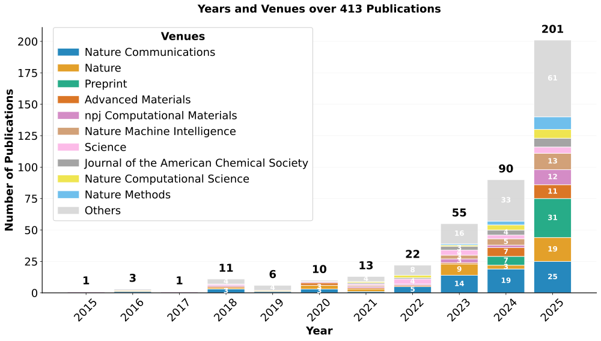

<h1>MatVerse AI4(M)S Paper Collection</h1>

---

This is a regularly updated paper collection about AI for science, with a specific focus on materials science, associated with the MatVerse paper.

## 📈 Publication Timeline

---

## 📚 Journal Index

This section provides a quick overview of papers organized by publication venue for easy navigation.

### ACS Applied Materials & Interfaces (1 papers)

- [48. Machine Learning-Assisted Synthesis of Two-Dimensional Materials](#48-machine-learning-assisted-synthesis-of-two-dimensional-materials) *(January 11, 2023)*

### Acta Materialia (5 papers)

- [200. Generalizable descriptors for automatic titanium alloys design by learning from texts via large language model](#200-generalizable-descriptors-for-automatic-titanium-alloys-design-by-learning-from-texts-via-large-language-model) *(September 01, 2025)*
- [174. A novel training-free approach to efficiently extracting material microstructures via visual large model](#174-a-novel-training-free-approach-to-efficiently-extracting-material-microstructures-via-visual-large-model) *(May 15, 2025)*
- [156. Developing novel low-density high-entropy superalloys with high strength and superior creep resistance guided by automated machine learning](#156-developing-novel-low-density-high-entropy-superalloys-with-high-strength-and-superior-creep-resistance-guided-by-automated-machine-learning) *(February 15, 2025)*
- [143. Topological data analysis assisted machine learning for polar topological structures in oxide superlattices](#143-topological-data-analysis-assisted-machine-learning-for-polar-topological-structures-in-oxide-superlattices) *(January 01, 2025)*
- [108. Compositional design of multicomponent alloys using reinforcement learning](#108-compositional-design-of-multicomponent-alloys-using-reinforcement-learning) *(August 01, 2024)*

### Advanced Functional Materials (1 papers)

- [1. Interpretable Machine Learning Applications: A Promising Prospect of AI for Materials](#1-interpretable-machine-learning-applications-a-promising-prospect-of-ai-for-materials) *(Unknown)*

### Advanced Materials (20 papers)

- [185. Self-Evolving Discovery of Carrier Biomaterials with Ultra-Low Nonspecific Protein Adsorption for Single Cell Analysis](#185-self-evolving-discovery-of-carrier-biomaterials-with-ultra-low-nonspecific-protein-adsorption-for-single-cell-analysis) *(July 02, 2025)*
- [142. AI-Driven Defect Engineering for Advanced Thermoelectric Materials](#142-ai-driven-defect-engineering-for-advanced-thermoelectric-materials) *(2025)*
- [141. Machine Learning in Polymer Research](#141-machine-learning-in-polymer-research) *(2025)*
- [140. SciAgents: Automating Scientific Discovery Through Bioinspired Multi-Agent Intelligent Graph Reasoning](#140-sciagents-automating-scientific-discovery-through-bioinspired-multi-agent-intelligent-graph-reasoning) *(2025)*
- [136. Artificial Intelligence and Multiscale Modeling for Sustainable Biopolymers and Bioinspired Materials](#136-artificial-intelligence-and-multiscale-modeling-for-sustainable-biopolymers-and-bioinspired-materials) *(2025)*
- [135. Synthesis Strategies for High Entropy Nanoparticles](#135-synthesis-strategies-for-high-entropy-nanoparticles) *(2025)*
- [134. Empowering Generalist Material Intelligence with Large Language Models](#134-empowering-generalist-material-intelligence-with-large-language-models) *(2025)*
- [133. Biomimetic Intelligent Thermal Management Materials: From Nature-Inspired Design to Machine-Learning-Driven Discovery](#133-biomimetic-intelligent-thermal-management-materials-from-nature-inspired-design-to-machine-learning-driven-discovery) *(2025)*
- [132. Artificial Intelligence-Driven Approaches in Semiconductor Research](#132-artificial-intelligence-driven-approaches-in-semiconductor-research) *(2025)*
- [131. Machine Learning in Solid-State Hydrogen Storage Materials: Challenges and Perspectives](#131-machine-learning-in-solid-state-hydrogen-storage-materials-challenges-and-perspectives) *(2025)*
- [122. A Machine Learning Study on High Thermal Conductivity Assisted to Discover Chalcogenides with Balanced Infrared Nonlinear Optical Performance](#122-a-machine-learning-study-on-high-thermal-conductivity-assisted-to-discover-chalcogenides-with-balanced-infrared-nonlinear-optical-performance) *(November 06, 2024)*
- [118. MatGPT: A Vane of Materials Informatics from Past, Present, to Future](#118-matgpt-a-vane-of-materials-informatics-from-past-present-to-future) *(October 09, 2024)*
- [98. Closed-Loop Multi-Objective Optimization for Cu–Sb–S Photo-Electrocatalytic Materials’ Discovery](#98-closed-loop-multi-objective-optimization-for-cu–sb–s-photo-electrocatalytic-materials’-discovery) *(June 04, 2024)*
- [93. High-Entropy Photothermal Materials](#93-high-entropy-photothermal-materials) *(June 2024)*
- [91. Large-Language-Model-Based AI Agent for Organic Semiconductor Device Research](#91-large-language-model-based-ai-agent-for-organic-semiconductor-device-research) *(May 30, 2024)*
- [79. Expanding the Horizons of Machine Learning in Nanomaterials to Chiral Nanostructures](#79-expanding-the-horizons-of-machine-learning-in-nanomaterials-to-chiral-nanostructures) *(January 19, 2024)*
- [77. Data-Driven Design for Metamaterials and Multiscale Systems: A Review](#77-data-driven-design-for-metamaterials-and-multiscale-systems-a-review) *(2024)*
- [26. Deep-Learning-Enabled Fast Optical Identification and Characterization of 2D Materials](#26-deep-learning-enabled-fast-optical-identification-and-characterization-of-2d-materials) *(June 09, 2020)*
- [25. Artificial Chemist: An Autonomous Quantum Dot Synthesis Bot](#25-artificial-chemist-an-autonomous-quantum-dot-synthesis-bot) *(June 04, 2020)*
- [6. Accelerated Discovery of Large Electrostrains in BaTiO3-Based Piezoelectrics Using Active Learning](#6-accelerated-discovery-of-large-electrostrains-in-batio3-based-piezoelectrics-using-active-learning) *(January 08, 2018)*

### Advanced Science (3 papers)

- [175. Data-Driven Design of Mechanically Hard Soft Magnetic High-Entropy Alloys](#175-data-driven-design-of-mechanically-hard-soft-magnetic-high-entropy-alloys) *(May 22, 2025)*
- [74. Physics-Informed Inverse Design of Programmable Metasurfaces](#74-physics-informed-inverse-design-of-programmable-metasurfaces) *(2024)*
- [20. Data-Driven Materials Science: Status, Challenges, and Perspectives](#20-data-driven-materials-science-status-challenges-and-perspectives) *(September 01, 2019)*

### Advances in Neural Information Processing Systems (1 papers)

- [129. Poseidon: Efficient Foundation Models for PDEs](#129-poseidon-efficient-foundation-models-for-pdes) *(December 16, 2024)*

### Angewandte Chemie (1 papers)

- [152. Exploration of Chemical Space Through Automated Reasoning](#152-exploration-of-chemical-space-through-automated-reasoning) *(February 03, 2025)*

### Chemical Science (1 papers)

- [194. SAGERank: inductive learning of protein–protein interaction from antibody–antigen recognition](#194-sagerank-inductive-learning-of-protein–protein-interaction-from-antibody–antigen-recognition) *(August 12, 2025)*

### Communications Materials (1 papers)

- [130. Data extraction from polymer literature using large language models](#130-data-extraction-from-polymer-literature-using-large-language-models) *(December 19, 2024)*

### Communications Physics (1 papers)

- [166. Towards AI-driven autonomous growth of 2D materials based on a graphene case study](#166-towards-ai-driven-autonomous-growth-of-2d-materials-based-on-a-graphene-case-study) *(April 25, 2025)*

### Computational Materials Science (1 papers)

- [170. Large language model-driven database for thermoelectric materials](#170-large-language-model-driven-database-for-thermoelectric-materials) *(May 01, 2025)*

### Journal of the American Chemical Society (12 papers)

- [188. Artificial Intelligence Paradigms for Next-Generation Metal–Organic Framework Research](#188-artificial-intelligence-paradigms-for-next-generation-metal–organic-framework-research) *(July 09, 2025)*
- [186. Natural-Language-Interfaced Robotic Synthesis for AI-Copilot-Assisted Exploration of Inorganic Materials](#186-natural-language-interfaced-robotic-synthesis-for-ai-copilot-assisted-exploration-of-inorganic-materials) *(July 02, 2025)*
- [163. A Multiagent-Driven Robotic AI Chemist Enabling Autonomous Chemical Research On Demand](#163-a-multiagent-driven-robotic-ai-chemist-enabling-autonomous-chemical-research-on-demand) *(April 16, 2025)*
- [154. Harnessing Large Language Models to Collect and Analyze Metal–Organic Framework Property Data Set](#154-harnessing-large-language-models-to-collect-and-analyze-metal–organic-framework-property-data-set) *(February 05, 2025)*
- [123. Crystal Structure Determination from Powder Diffraction Patterns with Generative Machine Learning](#123-crystal-structure-determination-from-powder-diffraction-patterns-with-generative-machine-learning) *(November 06, 2024)*
- [120. Efficient Exploratory Synthesis of Quaternary Cesium Chlorides Guided by In Silico Predictions](#120-efficient-exploratory-synthesis-of-quaternary-cesium-chlorides-guided-by-in-silico-predictions) *(October 30, 2024)*
- [107. Accelerating computational materials discovery with artificial intelligence and cloud high-performance computing: from large-scale screening to experimental validation](#107-accelerating-computational-materials-discovery-with-artificial-intelligence-and-cloud-high-performance-computing-from-large-scale-screening-to-experimental-validation) *(July 24, 2024)*
- [106. Large Language Models for Inorganic Synthesis Predictions](#106-large-language-models-for-inorganic-synthesis-predictions) *(July 24, 2024)*
- [86. Crystal Structure Assignment for Unknown Compounds from X-ray Diffraction Patterns with Deep Learning](#86-crystal-structure-assignment-for-unknown-compounds-from-x-ray-diffraction-patterns-with-deep-learning) *(March 27, 2024)*
- [67. In Pursuit of the Exceptional: Research Directions for Machine Learning in Chemical and Materials Science](#67-in-pursuit-of-the-exceptional-research-directions-for-machine-learning-in-chemical-and-materials-science) *(October 11, 2023)*
- [63. ChatGPT Chemistry Assistant for Text Mining and the Prediction of MOF Synthesis](#63-chatgpt-chemistry-assistant-for-text-mining-and-the-prediction-of-mof-synthesis) *(August 16, 2023)*
- [36. Machine Learning Driven Synthesis of Few-Layered WTe2 with Geometrical Control](#36-machine-learning-driven-synthesis-of-few-layered-wte2-with-geometrical-control) *(November 03, 2021)*

### Matter (8 papers)

- [204. Machine learning in X-ray diffraction for materials discovery and characterization](#204-machine-learning-in-x-ray-diffraction-for-materials-discovery-and-characterization) *(September 03, 2025)*
- [177. A data-driven platform for automated characterization of polymer electrolytes](#177-a-data-driven-platform-for-automated-characterization-of-polymer-electrolytes) *(June 04, 2025)*
- [160. Physics-informed, dual-objective optimization of high-entropy-alloy nanozymes by a robotic AI chemist](#160-physics-informed-dual-objective-optimization-of-high-entropy-alloy-nanozymes-by-a-robotic-ai-chemist) *(April 02, 2025)*
- [155. ORGANA: A robotic assistant for automated chemistry experimentation and characterization](#155-organa-a-robotic-assistant-for-automated-chemistry-experimentation-and-characterization) *(February 05, 2025)*
- [145. Transforming the synthesis of carbon nanotubes with machine learning models and automation](#145-transforming-the-synthesis-of-carbon-nanotubes-with-machine-learning-models-and-automation) *(January 08, 2025)*
- [115. ChemOS 2.0: An orchestration architecture for chemical self-driving laboratories](#115-chemos-20-an-orchestration-architecture-for-chemical-self-driving-laboratories) *(September 04, 2024)*
- [105. Autonomous chemistry: Navigating self-driving labs in chemical and material sciences](#105-autonomous-chemistry-navigating-self-driving-labs-in-chemical-and-material-sciences) *(July 03, 2024)*
- [54. A database of ultrastable MOFs reassembled from stable fragments with machine learning models](#54-a-database-of-ultrastable-mofs-reassembled-from-stable-fragments-with-machine-learning-models) *(May 03, 2023)*

### Nature (28 papers)

- [205. Supervised learning in DNA neural networks](#205-supervised-learning-in-dna-neural-networks) *(September 03, 2025)*
- [201. Electron flow matching for generative reaction mechanism prediction](#201-electron-flow-matching-for-generative-reaction-mechanism-prediction) *(September 2025)*
- [199. One-shot design of functional protein binders with BindCraft](#199-one-shot-design-of-functional-protein-binders-with-bindcraft) *(August 27, 2025)*
- [193. Data-driven de novo design of super-adhesive hydrogels](#193-data-driven-de-novo-design-of-super-adhesive-hydrogels) *(August 2025)*
- [189. The Virtual Lab of AI agents designs new SARS-CoV-2 nanobodies](#189-the-virtual-lab-of-ai-agents-designs-new-sars-cov-2-nanobodies) *(July 29, 2025)*
- [182. Machine-learning design of ductile FeNiCoAlTa alloys with high strength](#182-machine-learning-design-of-ductile-fenicoalta-alloys-with-high-strength) *(July 2025)*
- [181. Ultrabroadband and band-selective thermal meta-emitters by machine learning](#181-ultrabroadband-and-band-selective-thermal-meta-emitters-by-machine-learning) *(July 2025)*
- [171. End-to-end data-driven weather prediction](#171-end-to-end-data-driven-weather-prediction) *(May 2025)*
- [159. Towards multimodal foundation models in molecular cell biology](#159-towards-multimodal-foundation-models-in-molecular-cell-biology) *(April 2025)*
- [157. A generative model for inorganic materials design](#157-a-generative-model-for-inorganic-materials-design) *(March 2025)*
- [138. Computational microscopy with coherent diffractive imaging and ptychography](#138-computational-microscopy-with-coherent-diffractive-imaging-and-ptychography) *(January 2025)*
- [137. Probabilistic weather forecasting with machine learning](#137-probabilistic-weather-forecasting-with-machine-learning) *(January 2025)*
- [121. Autonomous mobile robots for exploratory synthetic chemistry](#121-autonomous-mobile-robots-for-exploratory-synthetic-chemistry) *(November 2024)*
- [96. Accurate structure prediction of biomolecular interactions with AlphaFold 3](#96-accurate-structure-prediction-of-biomolecular-interactions-with-alphafold-3) *(June 2024)*
- [71. Autonomous chemical research with large language models](#71-autonomous-chemical-research-with-large-language-models) *(December 2023)*
- [70. Scaling deep learning for materials discovery](#70-scaling-deep-learning-for-materials-discovery) *(December 2023)*
- [69. An autonomous laboratory for the accelerated synthesis of novel materials](#69-an-autonomous-laboratory-for-the-accelerated-synthesis-of-novel-materials) *(December 2023)*
- [64. Learning heterogeneous reaction kinetics from X-ray videos pixel by pixel](#64-learning-heterogeneous-reaction-kinetics-from-x-ray-videos-pixel-by-pixel) *(September 2023)*
- [59. Scientific discovery in the age of artificial intelligence](#59-scientific-discovery-in-the-age-of-artificial-intelligence) *(August 2023)*
- [57. Skilful nowcasting of extreme precipitation with NowcastNet](#57-skilful-nowcasting-of-extreme-precipitation-with-nowcastnet) *(July 2023)*
- [53. High-throughput printing of combinatorial materials from aerosols](#53-high-throughput-printing-of-combinatorial-materials-from-aerosols) *(May 2023)*
- [34. Highly accurate protein structure prediction with AlphaFold](#34-highly-accurate-protein-structure-prediction-with-alphafold) *(August 2021)*
- [27. A mobile robotic chemist](#27-a-mobile-robotic-chemist) *(July 2020)*
- [23. Accelerated discovery of CO2 electrocatalysts using active machine learning](#23-accelerated-discovery-of-co2-electrocatalysts-using-active-machine-learning) *(May 2020)*
- [22. Improved protein structure prediction using potentials from deep learning](#22-improved-protein-structure-prediction-using-potentials-from-deep-learning) *(January 2020)*
- [19. Unsupervised word embeddings capture latent knowledge from materials science literature](#19-unsupervised-word-embeddings-capture-latent-knowledge-from-materials-science-literature) *(July 2019)*
- [10. Machine learning for molecular and materials science](#10-machine-learning-for-molecular-and-materials-science) *(July 2018)*
- [3. Machine-learning-assisted materials discovery using failed experiments](#3-machine-learning-assisted-materials-discovery-using-failed-experiments) *(May 2016)*

### Nature Biomedical Engineering (2 papers)

- [203. A generalizable pathology foundation model using a unified knowledge distillation pretraining framework](#203-a-generalizable-pathology-foundation-model-using-a-unified-knowledge-distillation-pretraining-framework) *(September 02, 2025)*
- [190. Accelerating primer design for amplicon sequencing using large language model-powered agents](#190-accelerating-primer-design-for-amplicon-sequencing-using-large-language-model-powered-agents) *(July 30, 2025)*

### Nature Chemical Engineering (3 papers)

- [169. Automated processing and transfer of two-dimensional materials with robotics](#169-automated-processing-and-transfer-of-two-dimensional-materials-with-robotics) *(May 2025)*
- [168. Self-driving nanoparticle synthesis](#168-self-driving-nanoparticle-synthesis) *(May 2025)*
- [75. Self-driving laboratories to autonomously navigate the protein fitness landscape](#75-self-driving-laboratories-to-autonomously-navigate-the-protein-fitness-landscape) *(January 2024)*

### Nature Communications (39 papers)

- [196. An automated framework for exploring and learning potential-energy surfaces](#196-an-automated-framework-for-exploring-and-learning-potential-energy-surfaces) *(August 18, 2025)*
- [183. A generalized platform for artificial intelligence-powered autonomous enzyme engineering](#183-a-generalized-platform-for-artificial-intelligence-powered-autonomous-enzyme-engineering) *(July 01, 2025)*
- [176. IvoryOS: an interoperable web interface for orchestrating Python-based self-driving laboratories](#176-ivoryos-an-interoperable-web-interface-for-orchestrating-python-based-self-driving-laboratories) *(June 04, 2025)*
- [173. Exploration of crystal chemical space using text-guided generative artificial intelligence](#173-exploration-of-crystal-chemical-space-using-text-guided-generative-artificial-intelligence) *(May 12, 2025)*
- [172. Using GNN property predictors as molecule generators](#172-using-gnn-property-predictors-as-molecule-generators) *(May 08, 2025)*
- [165. Science acceleration and accessibility with self-driving labs](#165-science-acceleration-and-accessibility-with-self-driving-labs) *(April 24, 2025)*
- [164. Harnessing database-supported high-throughput screening for the design of stable interlayers in halide-based all-solid-state batteries](#164-harnessing-database-supported-high-throughput-screening-for-the-design-of-stable-interlayers-in-halide-based-all-solid-state-batteries) *(April 17, 2025)*
- [147. A guidance to intelligent metamaterials and metamaterials intelligence](#147-a-guidance-to-intelligent-metamaterials-and-metamaterials-intelligence) *(January 29, 2025)*
- [146. Integrating artificial intelligence with mechanistic epidemiological modeling: a scoping review of opportunities and challenges](#146-integrating-artificial-intelligence-with-mechanistic-epidemiological-modeling-a-scoping-review-of-opportunities-and-challenges) *(January 10, 2025)*
- [124. An automatic end-to-end chemical synthesis development platform powered by large language models](#124-an-automatic-end-to-end-chemical-synthesis-development-platform-powered-by-large-language-models) *(November 23, 2024)*
- [116. Scalable crystal structure relaxation using an iteration-free deep generative model with uncertainty quantification](#116-scalable-crystal-structure-relaxation-using-an-iteration-free-deep-generative-model-with-uncertainty-quantification) *(September 17, 2024)*
- [113. Fine-tuning protein language models boosts predictions across diverse tasks](#113-fine-tuning-protein-language-models-boosts-predictions-across-diverse-tasks) *(August 28, 2024)*
- [112. Machine learning enables the discovery of 2D Invar and anti-Invar monolayers](#112-machine-learning-enables-the-discovery-of-2d-invar-and-anti-invar-monolayers) *(August 14, 2024)*
- [111. Accurate prediction of protein function using statistics-informed graph networks](#111-accurate-prediction-of-protein-function-using-statistics-informed-graph-networks) *(August 04, 2024)*
- [110. Accelerated discovery of perovskite solid solutions through automated materials synthesis and characterization](#110-accelerated-discovery-of-perovskite-solid-solutions-through-automated-materials-synthesis-and-characterization) *(August 02, 2024)*
- [102. From bulk effective mass to 2D carrier mobility accurate prediction via adversarial transfer learning](#102-from-bulk-effective-mass-to-2d-carrier-mobility-accurate-prediction-via-adversarial-transfer-learning) *(June 25, 2024)*
- [100. Generative learning facilitated discovery of high-entropy ceramic dielectrics for capacitive energy storage](#100-generative-learning-facilitated-discovery-of-high-entropy-ceramic-dielectrics-for-capacitive-energy-storage) *(June 10, 2024)*
- [99. Machine learning-guided realization of full-color high-quantum-yield carbon quantum dots](#99-machine-learning-guided-realization-of-full-color-high-quantum-yield-carbon-quantum-dots) *(June 06, 2024)*
- [97. ChatMOF: an artificial intelligence system for predicting and generating metal-organic frameworks using large language models](#97-chatmof-an-artificial-intelligence-system-for-predicting-and-generating-metal-organic-frameworks-using-large-language-models) *(June 03, 2024)*
- [92. Diffusion-based deep learning method for augmenting ultrastructural imaging and volume electron microscopy](#92-diffusion-based-deep-learning-method-for-augmenting-ultrastructural-imaging-and-volume-electron-microscopy) *(June 01, 2024)*
- [90. Physics-informed neural network for lithium-ion battery degradation stable modeling and prognosis](#90-physics-informed-neural-network-for-lithium-ion-battery-degradation-stable-modeling-and-prognosis) *(May 21, 2024)*
- [82. Extracting accurate materials data from research papers with conversational language models and prompt engineering](#82-extracting-accurate-materials-data-from-research-papers-with-conversational-language-models-and-prompt-engineering) *(February 21, 2024)*
- [81. Structured information extraction from scientific text with large language models](#81-structured-information-extraction-from-scientific-text-with-large-language-models) *(February 15, 2024)*
- [78. Universal machine learning aided synthesis approach of two-dimensional perovskites in a typical laboratory](#78-universal-machine-learning-aided-synthesis-approach-of-two-dimensional-perovskites-in-a-typical-laboratory) *(January 02, 2024)*
- [68. Machine learning-enabled constrained multi-objective design of architected materials](#68-machine-learning-enabled-constrained-multi-objective-design-of-architected-materials) *(October 19, 2023)*
- [65. Accelerated discovery of multi-elemental reverse water-gas shift catalysts using extrapolative machine learning approach](#65-accelerated-discovery-of-multi-elemental-reverse-water-gas-shift-catalysts-using-extrapolative-machine-learning-approach) *(September 21, 2023)*
- [61. Applied machine learning as a driver for polymeric biomaterials design](#61-applied-machine-learning-as-a-driver-for-polymeric-biomaterials-design) *(August 10, 2023)*
- [60. Machine-learning-assisted material discovery of oxygen-rich highly porous carbon active materials for aqueous supercapacitors](#60-machine-learning-assisted-material-discovery-of-oxygen-rich-highly-porous-carbon-active-materials-for-aqueous-supercapacitors) *(August 01, 2023)*
- [56. Using a physics-informed neural network and fault zone acoustic monitoring to predict lab earthquakes](#56-using-a-physics-informed-neural-network-and-fault-zone-acoustic-monitoring-to-predict-lab-earthquakes) *(June 21, 2023)*
- [37. Data-driven modeling and prediction of non-linearizable dynamics via spectral submanifolds](#37-data-driven-modeling-and-prediction-of-non-linearizable-dynamics-via-spectral-submanifolds) *(February 15, 2022)*
- [31. Democratising deep learning for microscopy with ZeroCostDL4Mic](#31-democratising-deep-learning-for-microscopy-with-zerocostdl4mic) *(April 15, 2021)*
- [30. On-the-fly closed-loop materials discovery via Bayesian active learning](#30-on-the-fly-closed-loop-materials-discovery-via-bayesian-active-learning) *(November 24, 2020)*
- [29. Identifying domains of applicability of machine learning models for materials science](#29-identifying-domains-of-applicability-of-machine-learning-models-for-materials-science) *(September 04, 2020)*
- [28. Simple descriptor derived from symbolic regression accelerating the discovery of new perovskite catalysts](#28-simple-descriptor-derived-from-symbolic-regression-accelerating-the-discovery-of-new-perovskite-catalysts) *(July 14, 2020)*
- [17. Capturing chemical intuition in synthesis of metal-organic frameworks](#17-capturing-chemical-intuition-in-synthesis-of-metal-organic-frameworks) *(February 01, 2019)*
- [14. Deep neural networks for accurate predictions of crystal stability](#14-deep-neural-networks-for-accurate-predictions-of-crystal-stability) *(September 18, 2018)*
- [13. Accelerated discovery of stable lead-free hybrid organic-inorganic perovskites via machine learning](#13-accelerated-discovery-of-stable-lead-free-hybrid-organic-inorganic-perovskites-via-machine-learning) *(August 24, 2018)*
- [11. Insightful classification of crystal structures using deep learning](#11-insightful-classification-of-crystal-structures-using-deep-learning) *(July 17, 2018)*
- [2. Accelerated search for materials with targeted properties by adaptive design](#2-accelerated-search-for-materials-with-targeted-properties-by-adaptive-design) *(April 15, 2016)*

### Nature Computational Science (9 papers)

- [198. Digital Twin for Chemical Science: a case study on water interactions on the Ag(111) surface](#198-digital-twin-for-chemical-science-a-case-study-on-water-interactions-on-the-ag111-surface) *(August 27, 2025)*
- [179. Rethinking chemical research in the age of large language models](#179-rethinking-chemical-research-in-the-age-of-large-language-models) *(June 24, 2025)*
- [150. Balancing autonomy and expertise in autonomous synthesis laboratories](#150-balancing-autonomy-and-expertise-in-autonomous-synthesis-laboratories) *(February 2025)*
- [104. Promising directions of machine learning for partial differential equations](#104-promising-directions-of-machine-learning-for-partial-differential-equations) *(July 2024)*
- [87. Designing semiconductor materials and devices in the post-Moore era by tackling computational challenges with data-driven strategies](#87-designing-semiconductor-materials-and-devices-in-the-post-moore-era-by-tackling-computational-challenges-with-data-driven-strategies) *(May 2024)*
- [85. Digital twins in mechanical and aerospace engineering](#85-digital-twins-in-mechanical-and-aerospace-engineering) *(March 2024)*
- [84. Digital twins in medicine](#84-digital-twins-in-medicine) *(March 2024)*
- [49. Accelerating the design of compositionally complex materials via physics-informed artificial intelligence](#49-accelerating-the-design-of-compositionally-complex-materials-via-physics-informed-artificial-intelligence) *(March 2023)*
- [40. Enhancing computational fluid dynamics with machine learning](#40-enhancing-computational-fluid-dynamics-with-machine-learning) *(June 2022)*

### Nature Energy (1 papers)

- [192. An actor–critic algorithm to maximize the power delivered from direct methanol fuel cells](#192-an-actor–critic-algorithm-to-maximize-the-power-delivered-from-direct-methanol-fuel-cells) *(August 2025)*

### Nature Machine Intelligence (9 papers)

- [208. Towards agentic science for advancing scientific discovery](#208-towards-agentic-science-for-advancing-scientific-discovery) *(September 10, 2025)*
- [184. Enabling large language models for real-world materials discovery](#184-enabling-large-language-models-for-real-world-materials-discovery) *(July 2025)*
- [180. Large language models to accelerate organic chemistry synthesis](#180-large-language-models-to-accelerate-organic-chemistry-synthesis) *(July 2025)*
- [148. Battery lifetime prediction across diverse ageing conditions with inter-cell deep learning](#148-battery-lifetime-prediction-across-diverse-ageing-conditions-with-inter-cell-deep-learning) *(February 2025)*
- [127. Learning spatiotemporal dynamics with a pretrained generative model](#127-learning-spatiotemporal-dynamics-with-a-pretrained-generative-model) *(December 2024)*
- [117. Machine learning for data-centric epidemic forecasting](#117-machine-learning-for-data-centric-epidemic-forecasting) *(October 2024)*
- [94. Machine learning-aided generative molecular design](#94-machine-learning-aided-generative-molecular-design) *(June 2024)*
- [58. Encoding physics to learn reaction–diffusion processes](#58-encoding-physics-to-learn-reaction–diffusion-processes) *(July 2023)*
- [50. A multi-modal pre-training transformer for universal transfer learning in metal–organic frameworks](#50-a-multi-modal-pre-training-transformer-for-universal-transfer-learning-in-metal–organic-frameworks) *(March 2023)*

### Nature Materials (6 papers)

- [187. Accelerated data-driven materials science with the Materials Project](#187-accelerated-data-driven-materials-science-with-the-materials-project) *(July 03, 2025)*
- [167. Ab initio structure solutions from nanocrystalline powder diffraction data via diffusion models](#167-ab-initio-structure-solutions-from-nanocrystalline-powder-diffraction-data-via-diffusion-models) *(April 28, 2025)*
- [103. Prediction of DNA origami shape using graph neural network](#103-prediction-of-dna-origami-shape-using-graph-neural-network) *(July 2024)*
- [76. Active learning guides discovery of a champion four-metal perovskite oxide for oxygen evolution electrocatalysis](#76-active-learning-guides-discovery-of-a-champion-four-metal-perovskite-oxide-for-oxygen-evolution-electrocatalysis) *(January 2024)*
- [46. A data-science approach to predict the heat capacity of nanoporous materials](#46-a-data-science-approach-to-predict-the-heat-capacity-of-nanoporous-materials) *(December 2022)*
- [4. Design of efficient molecular organic light-emitting diodes by a high-throughput virtual screening and experimental approach](#4-design-of-efficient-molecular-organic-light-emitting-diodes-by-a-high-throughput-virtual-screening-and-experimental-approach) *(October 2016)*

### Nature Methods (1 papers)

- [109. OpenFold: retraining AlphaFold2 yields new insights into its learning mechanisms and capacity for generalization](#109-openfold-retraining-alphafold2-yields-new-insights-into-its-learning-mechanisms-and-capacity-for-generalization) *(August 2024)*

### Nature Nanotechnology (2 papers)

- [95. Machine intelligence-accelerated discovery of all-natural plastic substitutes](#95-machine-intelligence-accelerated-discovery-of-all-natural-plastic-substitutes) *(June 2024)*
- [7. Two-dimensional materials from high-throughput computational exfoliation of experimentally known compounds](#7-two-dimensional-materials-from-high-throughput-computational-exfoliation-of-experimentally-known-compounds) *(March 2018)*

### Nature Physics (1 papers)

- [43. Imaging and computing with disorder](#43-imaging-and-computing-with-disorder) *(September 2022)*

### Nature Reviews Chemistry (2 papers)

- [202. Developing machine learning for heterogeneous catalysis with experimental and computational data](#202-developing-machine-learning-for-heterogeneous-catalysis-with-experimental-and-computational-data) *(September 2025)*
- [197. Steering towards safe self-driving laboratories](#197-steering-towards-safe-self-driving-laboratories) *(August 18, 2025)*

### Nature Reviews Materials (4 papers)

- [206. High-throughput platforms for machine learning-guided lipid nanoparticle design](#206-high-throughput-platforms-for-machine-learning-guided-lipid-nanoparticle-design) *(September 08, 2025)*
- [128. Multifunctional high-entropy materials](#128-multifunctional-high-entropy-materials) *(December 2024)*
- [126. Towards the holistic design of alloys with large language models](#126-towards-the-holistic-design-of-alloys-with-large-language-models) *(December 2024)*
- [33. Nanoparticle synthesis assisted by machine learning](#33-nanoparticle-synthesis-assisted-by-machine-learning) *(August 2021)*

### Nature Reviews Methods Primers (1 papers)

- [66. Finite-difference time-domain methods](#66-finite-difference-time-domain-methods) *(October 05, 2023)*

### Nature Reviews Physics (5 papers)

- [144. Machine learning for the physics of climate](#144-machine-learning-for-the-physics-of-climate) *(January 2025)*
- [114. AI-driven research in pure mathematics and theoretical physics](#114-ai-driven-research-in-pure-mathematics-and-theoretical-physics) *(September 2024)*
- [47. On scientific understanding with artificial intelligence](#47-on-scientific-understanding-with-artificial-intelligence) *(December 2022)*
- [41. Machine learning in the search for new fundamental physics](#41-machine-learning-in-the-search-for-new-fundamental-physics) *(June 2022)*
- [32. Physics-informed machine learning](#32-physics-informed-machine-learning) *(June 2021)*

### Nature Synthesis (6 papers)

- [207. Molecular-dynamics-simulation-guided directed evolution of flavoenzymes for atroposelective desaturation](#207-molecular-dynamics-simulation-guided-directed-evolution-of-flavoenzymes-for-atroposelective-desaturation) *(September 10, 2025)*
- [125. Synthesis of high-entropy materials](#125-synthesis-of-high-entropy-materials) *(December 2024)*
- [89. Robotic synthesis decoded through phase diagram mastery](#89-robotic-synthesis-decoded-through-phase-diagram-mastery) *(May 2024)*
- [88. Navigating phase diagram complexity to guide robotic inorganic materials synthesis](#88-navigating-phase-diagram-complexity-to-guide-robotic-inorganic-materials-synthesis) *(May 2024)*
- [83. Automated synthesis of oxygen-producing catalysts from Martian meteorites by a robotic AI chemist](#83-automated-synthesis-of-oxygen-producing-catalysts-from-martian-meteorites-by-a-robotic-ai-chemist) *(March 2024)*
- [55. The rise of self-driving labs in chemical and materials sciences](#55-the-rise-of-self-driving-labs-in-chemical-and-materials-sciences) *(June 2023)*

### Neuron (1 papers)

- [15. Molecular Dynamics Simulation for All](#15-molecular-dynamics-simulation-for-all) *(September 19, 2018)*

### Proceedings of the National Academy of Sciences (2 papers)

- [153. Automating the practice of science: Opportunities, challenges, and implications](#153-automating-the-practice-of-science-opportunities-challenges-and-implications) *(February 04, 2025)*
- [101. Deep learning probability flows and entropy production rates in active matter](#101-deep-learning-probability-flows-and-entropy-production-rates-in-active-matter) *(June 18, 2024)*

### Review of Materials Research (2 papers)

- [149. Knowledge-guided large language model for material science](#149-knowledge-guided-large-language-model-for-material-science) *(February 01, 2025)*
- [139. AI4Materials: Transforming the landscape of materials science and enigneering](#139-ai4materials-transforming-the-landscape-of-materials-science-and-enigneering) *(January 01, 2025)*

### Reviews of Modern Physics (1 papers)

- [21. Machine learning and the physical sciences](#21-machine-learning-and-the-physical-sciences) *(December 06, 2019)*

### Science (9 papers)

- [80. Automated self-optimization, intensification, and scale-up of photocatalysis in flow](#80-automated-self-optimization-intensification-and-scale-up-of-photocatalysis-in-flow) *(January 26, 2024)*
- [73. Learning skillful medium-range global weather forecasting](#73-learning-skillful-medium-range-global-weather-forecasting) *(December 22, 2023)*
- [51. Evolutionary-scale prediction of atomic-level protein structure with a language model](#51-evolutionary-scale-prediction-of-atomic-level-protein-structure-with-a-language-model) *(March 17, 2023)*
- [45. The endless search for better alloys](#45-the-endless-search-for-better-alloys) *(October 07, 2022)*
- [44. Machine learning–enabled high-entropy alloy discovery](#44-machine-learning–enabled-high-entropy-alloy-discovery) *(October 07, 2022)*
- [42. Deep-learning seismology](#42-deep-learning-seismology) *(August 12, 2022)*
- [39. High-entropy nanoparticles: Synthesis-structure-property relationships and data-driven discovery](#39-high-entropy-nanoparticles-synthesis-structure-property-relationships-and-data-driven-discovery) *(April 08, 2022)*
- [35. Accurate prediction of protein structures and interactions using a three-track neural network](#35-accurate-prediction-of-protein-structures-and-interactions-using-a-three-track-neural-network) *(August 20, 2021)*
- [12. Inverse molecular design using machine learning: Generative models for matter engineering](#12-inverse-molecular-design-using-machine-learning-generative-models-for-matter-engineering) *(July 27, 2018)*

### Science Advances (6 papers)

- [195. Accelerated design of gold nanoparticles with enhanced plasmonic performance](#195-accelerated-design-of-gold-nanoparticles-with-enhanced-plasmonic-performance) *(August 15, 2025)*
- [162. Leveraging data mining, active learning, and domain adaptation for efficient discovery of advanced oxygen evolution electrocatalysts](#162-leveraging-data-mining-active-learning-and-domain-adaptation-for-efficient-discovery-of-advanced-oxygen-evolution-electrocatalysts) *(April 04, 2025)*
- [161. A high-throughput experimentation platform for data-driven discovery in electrochemistry](#161-a-high-throughput-experimentation-platform-for-data-driven-discovery-in-electrochemistry) *(April 04, 2025)*
- [62. Enhancing corrosion-resistant alloy design through natural language processing and deep learning](#62-enhancing-corrosion-resistant-alloy-design-through-natural-language-processing-and-deep-learning) *(August 11, 2023)*
- [24. Self-driving laboratory for accelerated discovery of thin-film materials](#24-self-driving-laboratory-for-accelerated-discovery-of-thin-film-materials) *(May 13, 2020)*
- [8. Accelerated discovery of metallic glasses through iteration of machine learning and high-throughput experiments](#8-accelerated-discovery-of-metallic-glasses-through-iteration-of-machine-learning-and-high-throughput-experiments) *(April 13, 2018)*

### Science Robotics (2 papers)

- [119. Transforming science labs into automated factories of discovery](#119-transforming-science-labs-into-automated-factories-of-discovery) *(October 23, 2024)*
- [9. ChemOS: Orchestrating autonomous experimentation](#9-chemos-orchestrating-autonomous-experimentation) *(June 20, 2018)*

### Scientific Data (1 papers)

- [18. 2DMatPedia, an open computational database of two-dimensional materials from top-down and bottom-up approaches](#18-2dmatpedia-an-open-computational-database-of-two-dimensional-materials-from-top-down-and-bottom-up-approaches) *(June 12, 2019)*

### Scientific Reports (2 papers)

- [191. Deep learning for property prediction of natural fiber polymer composites](#191-deep-learning-for-property-prediction-of-natural-fiber-polymer-composites) *(July 30, 2025)*
- [72. Data-driven analysis and prediction of stable phases for high-entropy alloy design](#72-data-driven-analysis-and-prediction-of-stable-phases-for-high-entropy-alloy-design) *(December 18, 2023)*

### Unknown Journal (1 papers)

- [151. From text to insight: large language models for chemical data extraction](#151-from-text-to-insight-large-language-models-for-chemical-data-extraction) *(February 03, 2025)*

### npj Computational Materials (6 papers)

- [178. Agent-based multimodal information extraction for nanomaterials](#178-agent-based-multimodal-information-extraction-for-nanomaterials) *(June 23, 2025)*
- [158. Applications of natural language processing and large language models in materials discovery](#158-applications-of-natural-language-processing-and-large-language-models-in-materials-discovery) *(March 24, 2025)*
- [52. A general-purpose material property data extraction pipeline from large polymer corpora using natural language processing](#52-a-general-purpose-material-property-data-extraction-pipeline-from-large-polymer-corpora-using-natural-language-processing) *(April 05, 2023)*
- [38. Distributed representations of atoms and materials for machine learning](#38-distributed-representations-of-atoms-and-materials-for-machine-learning) *(March 18, 2022)*
- [16. Active learning for accelerated design of layered materials](#16-active-learning-for-accelerated-design-of-layered-materials) *(December 10, 2018)*
- [5. Virtual screening of inorganic materials synthesis parameters with deep learning](#5-virtual-screening-of-inorganic-materials-synthesis-parameters-with-deep-learning) *(December 01, 2017)*

---

## 📑 Papers (Chronological Order)

## 208. Towards agentic science for advancing scientific discovery

**Authors:** Hongliang Xin, John R. Kitchin, Heather J. Kulik

**Venue:** Nature Machine Intelligence

**Publication Date:** September 10, 2025

**Pages:** 1-3

**DOI:** 10.1038/s42256-025-01110-x

**Abstract:**
Artificial intelligence is transforming scientific discovery through (semi-)autonomous agents capable of reasoning, planning, and interacting with digital and physical environments. This Comment explores the foundations and frontiers of agentic science, outlining its emerging directions, current limitations, and the pathways for responsible integration into scientific practice.

**Tags:** None

---

## 207. Molecular-dynamics-simulation-guided directed evolution of flavoenzymes for atroposelective desaturation

**Authors:** Hong-Ning Yin, Zhao Chen, Xiang Zhao, Zihan Liu, Feng Yu, Sanduo Zheng, Niu Huang, Zhen Liu

**Venue:** Nature Synthesis

**Publication Date:** September 10, 2025

**Pages:** 1-9

**DOI:** 10.1038/s44160-025-00882-9

**Abstract:**
Molecular-dynamics-simulation-guided evolution of flavoenzymes produces efficient catalysts for non-C2-symmetric biaryl synthesis with excellent atroposelectivity, offering promise for natural product synthesis and pharmaceutical applications.

**Tags:** None

---

## 206. High-throughput platforms for machine learning-guided lipid nanoparticle design

**Authors:** Andrew R. Hanna, David A. Issadore, Michael J. Mitchell

**Venue:** Nature Reviews Materials

**Publication Date:** September 08, 2025

**Pages:** 1-15

**DOI:** 10.1038/s41578-025-00831-0

**Abstract:**
Discovering lipid nanoparticles for unmet clinical needs relies heavily on the screening of unique formulations incorporating distinct lipids and nucleic acid cargos. This Perspective highlights how automation and parallelization have accelerated the rate of lipid nanoparticle discovery and discusses how coupling these advances with machine learning enable the predictive design of new therapeutic candidates.

**Tags:** None

---

## 205. Supervised learning in DNA neural networks

**Authors:** Kevin M. Cherry, Lulu Qian

**Venue:** Nature

**Publication Date:** September 03, 2025

**Pages:** 1-9

**DOI:** 10.1038/s41586-025-09479-w

**Abstract:**
Learning enables biological organisms to begin life simple yet develop immensely diverse and complex behaviours. Understanding learning principles in engineered molecular systems could enable us to endow non-living physical systems with similar capabilities. Inspired by how the brain processes information, the principles of neural computation have been developed over the past 80 years1, forming the foundation of modern machine learning. More than four decades ago, connections between neural computation and physical systems were established2. More recently, synthetic molecular systems, including nucleic acid and protein circuits, have been investigated for their abilities to implement neural computation3–7. However, in these systems, learning of molecular parameters such as concentrations and reaction rates was performed in silico to generate desired input–output functions. Here we show that DNA molecules can be programmed to autonomously carry out supervised learning in vitro, with the system learning to perform pattern classification from molecular examples of inputs and desired responses. We demonstrate a DNA neural network trained to classify three different sets of 100-bit patterns, integrating training data directly into memories of molecular concentrations and using these memories to process subsequent test data. Our work suggests that molecular circuits can learn tasks more complex than simple adaptive behaviours. This opens the door to molecular machines capable of embedded learning and decision-making in a wide range of physical systems, from biomedicine to soft materials.

**Tags:** DNA computing, Synthetic biology

---

## 204. Machine learning in X-ray diffraction for materials discovery and characterization

**Authors:** Connor Davel, Nazanin Bassiri-Gharb, Juan-Pablo Correa-Baena

**Venue:** Matter

**Publication Date:** September 03, 2025

**Volume & Issue:** Volume 8, Issue 9

**DOI:** 10.1016/j.matt.2025.102272

**Abstract:**
No abstract available

**Tags:** autonomous materials characterization, combinatorial characterization, machine learning, X-ray diffraction

---

## 203. A generalizable pathology foundation model using a unified knowledge distillation pretraining framework

**Authors:** Jiabo Ma, Zhengrui Guo, Fengtao Zhou, Yihui Wang, Yingxue Xu, Jinbang Li, Fang Yan, Yu Cai, Zhengjie Zhu, Cheng Jin, Yi Lin, Xinrui Jiang, Chenglong Zhao, Danyi Li, Anjia Han, Zhenhui Li, Ronald Cheong Kin Chan, Jiguang Wang, Peng Fei, Kwang-Ting Cheng, Shaoting Zhang, Li Liang, Hao Chen

**Venue:** Nature Biomedical Engineering

**Publication Date:** September 02, 2025

**Pages:** 1-20

**DOI:** 10.1038/s41551-025-01488-4

**Abstract:**
Generalizable Pathology Foundation Model (GPFM) consolidates expertise from a variety of existing models for use in a broad spectrum of computational pathology tasks.

**Tags:** None

---

## 202. Developing machine learning for heterogeneous catalysis with experimental and computational data

**Authors:** Carlota Bozal-Ginesta, Sergio Pablo-García, Changhyeok Choi, Albert Tarancón, Alán Aspuru-Guzik

**Venue:** Nature Reviews Chemistry

**Publication Date:** September 2025

**Volume & Issue:** Volume 9, Issue 9

**Pages:** 601-616

**DOI:** 10.1038/s41570-025-00740-4

**Abstract:**
Machine learning aids heterogeneous catalysis research by linking performance to physicochemical controllable properties. This Review discusses experimental and computational high-throughput and machine learning approaches, comparing them by modelling method, features, dataset size, accuracy and reaction type.

**Tags:** None

---

## 201. Electron flow matching for generative reaction mechanism prediction

**Authors:** Joonyoung F. Joung, Mun Hong Fong, Nicholas Casetti, Jordan P. Liles, Ne S. Dassanayake, Connor W. Coley

**Venue:** Nature

**Publication Date:** September 2025

**Volume & Issue:** Volume 645, Issue 8079

**Pages:** 115-123

**DOI:** 10.1038/s41586-025-09426-9

**Abstract:**
A new tool based on generative machine learning called FlowER uses flow matching to model reactions as the redistribution of electrons between reactants and products, enabling the enforcement of mass conservation in reaction prediction.

**Tags:** None

---

## 200. Generalizable descriptors for automatic titanium alloys design by learning from texts via large language model

**Authors:** Ping Wang, Yuan Jiang, Weijie Liao, Rong Wang, Minjie Lai, Hongchao Kou, Xiubing Liang, Jinshan Li, Turab Lookman, Ruihao Yuan

**Venue:** Acta Materialia

**Publication Date:** September 01, 2025

**Volume & Issue:** Volume 296

**Pages:** 121275

**DOI:** 10.1016/j.actamat.2025.121275

**Abstract:**
Descriptors are essential prerequisites for the success of machine learning-based materials design. However, the automatic construction of generalizable descriptors for various properties, together with their integration with design criteria, remains a long-standing challenge. Here, we overcome this obstacle by devising a framework that integrates large language model, domain theory constraints ([Mo]eq and d-electron theory), and multi-objective global optimization. This framework fuses structured (tabular composition/processing) and unstructured (texts) data to obtain enriched descriptors and facilitate materials design. Using titanium alloys as model case, we first automatically achieve descriptors that generalize well across a variety of properties for optimized prediction models. With which a design pipeline is proposed, several alloys with high promise for enhanced competing properties are identified from a vast chemical and processing space, and their reliability is validated via experimental synthesis. It is revealed that the enriched descriptors, learned from ∼ 50,000 texts without apparent physics, capture expertise related to phase stability, alloying rules for specific properties, and more. Our proposed approach can be applied to the design of other materials where descriptors are currently inadequate and structured data availability is limited.

**Tags:** Descriptors, Large language model, Natural language processing, Titanium alloy

---

## 199. One-shot design of functional protein binders with BindCraft

**Authors:** Martin Pacesa, Lennart Nickel, Christian Schellhaas, Joseph Schmidt, Ekaterina Pyatova, Lucas Kissling, Patrick Barendse, Jagrity Choudhury, Srajan Kapoor, Ana Alcaraz-Serna, Yehlin Cho, Kourosh H. Ghamary, Laura Vinué, Brahm J. Yachnin, Andrew M. Wollacott, Stephen Buckley, Adrie H. Westphal, Simon Lindhoud, Sandrine Georgeon, Casper A. Goverde, Georgios N. Hatzopoulos, Pierre Gönczy, Yannick D. Muller, Gerald Schwank, Daan C. Swarts, Alex J. Vecchio, Bernard L. Schneider, Sergey Ovchinnikov, Bruno E. Correia

**Venue:** Nature

**Publication Date:** August 27, 2025

**Pages:** 1-10

**DOI:** 10.1038/s41586-025-09429-6

**Abstract:**
Protein–protein interactions are at the core of all key biological processes. However, the complexity of the structural features that determine protein–protein interactions makes their design challenging. Here we present BindCraft, an open-source and automated pipeline for de novo protein binder design with experimental success rates of 10–100%. BindCraft leverages the weights of AlphaFold2 (ref. 1) to generate binders with nanomolar affinity without the need for high-throughput screening or experimental optimization, even in the absence of known binding sites. We successfully designed binders against a diverse set of challenging targets, including cell-surface receptors, common allergens, de novo designed proteins and multi-domain nucleases, such as CRISPR–Cas9. We showcase the functional and therapeutic potential of designed binders by reducing IgE binding to birch allergen in patient-derived samples, modulating Cas9 gene editing activity and reducing the cytotoxicity of a foodborne bacterial enterotoxin. Last, we use cell-surface-receptor-specific binders to redirect adeno-associated virus capsids for targeted gene delivery. This work represents a significant advancement towards a ‘one design-one binder’ approach in computational design, with immense potential in therapeutics, diagnostics and biotechnology.

**Tags:** Biochemistry, Protein design

---

## 198. Digital Twin for Chemical Science: a case study on water interactions on the Ag(111) surface

**Authors:** Jin Qian, Asmita Jana, Siddarth Menon, Andrew E. Bogdan, Rebecca Hamlyn, Johannes Mahl, Ethan J. Crumlin

**Venue:** Nature Computational Science

**Publication Date:** August 27, 2025

**Pages:** 1-8

**DOI:** 10.1038/s43588-025-00857-y

**Abstract:**
Directly visualizing chemical trajectories offers insights into catalysis, gas-phase reactions and photoinduced dynamics. Tracking the transformation of chemical species is best achieved by coupling theory and experiment. Here we developed Digital Twin for Chemical Science (DTCS) v.01, which integrates theory, experiment and their bidirectional feedback loops into a unified platform for chemical characterization. DTCS addresses a core question: given a set of experimental conditions, what is the expected outcome and why? It consists of a forward solver that takes a chemical reaction network and predicts spectra under experimental conditions, and an inverse solver that infers kinetics from measured spectra. We applied DTCS to ambient-pressure X-ray photoelectron spectroscopy measurements of the Ag–H2O interface as an example. This approach enables real-time knowledge extraction and guides experiments until a stopping condition is met based on accuracy and degeneracy. As a step toward autonomous chemical characterization, DTCS provides mechanistic knowledge in a verified, standardized manner.

**Tags:** Chemistry, Energy and society, Materials science

---

## 197. Steering towards safe self-driving laboratories

**Authors:** Shi Xuan Leong, Caleb E. Griesbach, Rui Zhang, Kourosh Darvish, Yuchi Zhao, Abhijoy Mandal, Yunheng Zou, Han Hao, Varinia Bernales, Alán Aspuru-Guzik

**Venue:** Nature Reviews Chemistry

**Publication Date:** August 18, 2025

**Pages:** 1-16

**DOI:** 10.1038/s41570-025-00747-x

**Abstract:**
Self-driving laboratories promise accelerated discovery. As the scope of chemical processes and level of autonomy in these laboratories expand, a comprehensive safety framework is essential. We discuss here the safety development trajectory of SDLs, identifying opportunities for innovation to shape this rapidly evolving landscape.

**Tags:** None

---

## 196. An automated framework for exploring and learning potential-energy surfaces

**Authors:** Yuanbin Liu, Joe D. Morrow, Christina Ertural, Natascia L. Fragapane, John L. A. Gardner, Aakash A. Naik, Yuxing Zhou, Janine George, Volker L. Deringer

**Venue:** Nature Communications

**Publication Date:** August 18, 2025

**Volume & Issue:** Volume 16, Issue 1

**Pages:** 7666

**DOI:** 10.1038/s41467-025-62510-6

**Abstract:**
Machine learning has become ubiquitous in materials modelling and now routinely enables large-scale atomistic simulations with quantum-mechanical accuracy. However, developing machine-learned interatomic potentials requires high-quality training data, and the manual generation and curation of such data can be a major bottleneck. Here, we introduce an automated framework for the exploration and fitting of potential-energy surfaces, implemented in an openly available software package that we call autoplex (‘automatic potential-landscape explorer’). We discuss design choices, particularly the interoperability with existing software architectures, and the ability for the end user to easily use the computational workflows provided. We show wide-ranging capability demonstrations: for the titanium–oxygen system, SiO2, crystalline and liquid water, as well as phase-change memory materials. More generally, our study illustrates how automation can speed up atomistic machine learning in computational materials science.

**Tags:** Atomistic models, Computational chemistry, Computational methods

---

## 195. Accelerated design of gold nanoparticles with enhanced plasmonic performance

**Authors:** José Luis Montaño-Priede, Anish Rao, Ana Sánchez-Iglesias, Marek Grzelczak

**Venue:** Science Advances

**Publication Date:** August 15, 2025

**Volume & Issue:** Volume 11, Issue 33

**Pages:** eadx2299

**DOI:** 10.1126/sciadv.adx2299

**Abstract:**
Finding the optimal dimensions of metal nanoparticles to maximize their plasmonic performance in targeted applications is a complex and time-consuming process that typically requires a trial-and-error approach. Here, we propose a universal pipeline that integrates Bayesian optimization with electrodynamics simulations to find dimensions of gold bipyramids with superior plasmonic performance in photothermal efficiency, enhancement of Raman scattering and photoluminescence, strong coupling between plasmon and exciton, and aggregation-induced color difference. Our workflow is a straightforward tool for plasmonic nanoparticle design, setting their optimal dimensions for targeted applications.

**Tags:** None

---

## 194. SAGERank: inductive learning of protein–protein interaction from antibody–antigen recognition

**Authors:** Chuance Sun, Xiangyi Li, Honglin Xu, Yike Tang, Ganggang Bai, Yanjing Wang, Buyong Ma

**Venue:** Chemical Science

**Publication Date:** August 12, 2025

**DOI:** 10.1039/D5SC03707G

**Abstract:**
Predicting Antibody–Antigen (Ab–Ag) docking and structure-based design represent significant long-term and therapeutically important challenges in computational biology. We present SAGERank, a general, configurable deep learning framework for antibody design using Graph Sample and Aggregate Networks. SAGERank successfully predicted the majority of epitopes in a cancer target dataset. In nanobody–antigen structure prediction, SAGERank, coupled with a protein dynamics structure prediction algorithm, slightly outperforms Alphafold3. Most importantly, our study demonstrates the real potential of inductive deep learning to overcome the small dataset problem in molecular science. The SAGERank models trained for antibody–antigen docking can be used to examine general protein–protein interaction tasks, such as T Cell Receptor-peptide-Major Histocompatibility Complex (TCR-pMHC) recognition, classification of biological versus crystal interfaces, and prediction of ternary complexes of molecular glues. In the cases of ranking docking decoys and identifying biological interfaces, SAGERank is competitive with or outperforms state-of-the-art methods.

**Tags:** None

---

## 193. Data-driven de novo design of super-adhesive hydrogels

**Authors:** Hongguang Liao, Sheng Hu, Hu Yang, Lei Wang, Shinya Tanaka, Ichigaku Takigawa, Wei Li, Hailong Fan, Jian Ping Gong

**Venue:** Nature

**Publication Date:** August 2025

**Volume & Issue:** Volume 644, Issue 8075

**Pages:** 89-95

**DOI:** 10.1038/s41586-025-09269-4

**Abstract:**
Data-driven methodologies have transformed the discovery and prediction of hard materials with well-defined atomic structures by leveraging standardized datasets, enabling accurate property predictions and facilitating efficient exploration of design spaces1–3. However, their application to soft materials remains challenging because of complex, multiscale structure–property relationships4–6. Here we present a data-driven approach that integrates data mining, experimentation and machine learning to design high-performance adhesive hydrogels from scratch, tailored for demanding underwater environments. By leveraging protein databases, we developed a descriptor strategy to statistically replicate protein sequence patterns in polymer strands by ideal random copolymerization, enabling targeted hydrogel design and dataset construction. Using machine learning, we optimized hydrogel formulations from an initial dataset of 180 bioinspired hydrogels, achieving remarkable improvements in adhesive strength, with a maximum value exceeding 1 MPa. These super-adhesive hydrogels hold immense potential across diverse applications, from biomedical engineering to deep-sea exploration, marking a notable advancement in data-driven innovation for soft materials.

**Tags:** Cheminformatics, Gels and hydrogels

---

## 192. An actor–critic algorithm to maximize the power delivered from direct methanol fuel cells

**Authors:** Hongbin Xu, Yang Jeong Park, Zhichu Ren, Daniel J. Zheng, Davide Menga, Haojun Jia, Chenru Duan, Guanzhou Zhu, Yuriy Román-Leshkov, Yang Shao-Horn, Ju Li

**Venue:** Nature Energy

**Publication Date:** August 2025

**Volume & Issue:** Volume 10, Issue 8

**Pages:** 951-961

**DOI:** 10.1038/s41560-025-01804-x

**Abstract:**
Direct methanol fuel cells offer high energy densities but face challenges including catalyst degradation and surface fouling, which reduce performance over time. Here the authors introduce a control system inspired by reinforcement learning to optimize the power output and mitigate degradation of direct methanol fuel cells by dynamically adjusting the voltage.

**Tags:** None

---

## 191. Deep learning for property prediction of natural fiber polymer composites

**Authors:** Ivan P. Malashin, Dmitry Martysyuk, Vladimir Nelyub, Aleksei Borodulin, Andrei Gantimurov, Vadim Tynchenko

**Venue:** Scientific Reports

**Publication Date:** July 30, 2025

**Volume & Issue:** Volume 15, Issue 1

**Pages:** 27837

**DOI:** 10.1038/s41598-025-10841-1

**Abstract:**
The increasing availability of diverse experimental and computational data has accelerated the application of deep learning (DL) techniques for predicting polymer properties. A literature review was conducted to show recent advances in DL applied to this field. For example, Li et al. (2023) achieved an $$R^2>0.96$$for predicting stiffness tensors of carbon fiber composites using a hybrid CNN–MLP model trained on microstructure images and two-point statistics. Aligning with this approach, Xue et al. (2023) compared DNN performance with genetic programming and minimax probability machine regression in predicting the lateral confinement coefficient for CFRP-wrapped RC columns, showing competitive predictive capability. These studies demonstrate that specialized architectures, including hybrid CNN–MLP models, feedforward ANNs, graph convolutional networks, and DNNs, provide high accuracy in predicting mechanical, thermal, and chemical properties of polymer composites and biodegradable plastics. Among these, DNNs have consistently shown superior performance in capturing complex nonlinear relationships within heterogeneous datasets, highlighting their suitability for materials characterization and optimization tasks. Building on these insights, this study investigates the effects of four natural fibers (flax, cotton, sisal, hemp) with densities around 1.48–1.54 g/cm$$^3$$, incorporated at 30 wt.% into three polymer matrices (PLA, PP, epoxy resin) with varying surface treatments (untreated, alkaline, silane). Samples were prepared via extrusion and injection molding (or casting for epoxy) under controlled processing conditions. Mechanical properties (tensile strength, modulus, elongation at break, impact toughness) were measured per ASTM standards, and density was determined by Archimedes’ method. Using 180 experimental samples, augmented up to 1500 using bootstrap technique, several regression models–linear, random forest, gradient boosting, DNNs–were developed to predict mechanical behavior. Best DNN model architecture (four hidden layers (128–64–32–16 neurons), ReLU activation, 20% dropout, a batch size of 64, and the AdamW optimizer with a learning rate of $$10^{-3}$$) obtained through hyperparameter optimization using Optuna, delivered the best performance (R$$^2$$up to 0.89) and MAE reductions of 9–12% compared to gradient boosting, driven by the DNN’s ability to capture nonlinear synergies between fiber-matrix interactions, surface treatments, and processing parameters while aligning architectural complexity with multiscale material behavior.

**Tags:** Mechanical engineering, Mechanical properties, Scientific data

---

## 190. Accelerating primer design for amplicon sequencing using large language model-powered agents

**Authors:** Yi Wang, Yuejie Hou, Lin Yang, Shisen Li, Weiting Tang, Hui Tang, Qiushun He, Siyuan Lin, Yanyan Zhang, Xingyu Li, Shiwen Chen, Yusheng Huang, Lingsong Kong, Huijun Zhang, Duncan Yu, Feng Mu, Huanming Yang, Jian Wang, Nattiya Hirankarn, Meng Yang

**Venue:** Nature Biomedical Engineering

**Publication Date:** July 30, 2025

**Pages:** 1-16

**DOI:** 10.1038/s41551-025-01455-z

**Abstract:**
The PrimeGen framework is a multi-agent large language model system used to navigate intricate primer design workflows for amplicon sequencing.

**Tags:** None

---

## 189. The Virtual Lab of AI agents designs new SARS-CoV-2 nanobodies

**Authors:** Kyle Swanson, Wesley Wu, Nash L. Bulaong, John E. Pak, James Zou

**Venue:** Nature

**Publication Date:** July 29, 2025

**Pages:** 1-8

**DOI:** 10.1038/s41586-025-09442-9

**Abstract:**
Human collaboration with a team of artificial intelligence (AI) agents powered by large language models was used to efficiently design a complex interdisciplinary research project leading to the design of novel nanobodies against SARS-CoV-2 spike protein.

**Tags:** None

---

## 188. Artificial Intelligence Paradigms for Next-Generation Metal–Organic Framework Research

**Authors:** Aydin Ozcan, François-Xavier Coudert, Sven M. J. Rogge, Greta Heydenrych, Dong Fan, Antonios P. Sarikas, Seda Keskin, Guillaume Maurin, George E. Froudakis, Stefan Wuttke, Ilknur Erucar

**Venue:** Journal of the American Chemical Society

**Publication Date:** July 09, 2025

**Volume & Issue:** Volume 147, Issue 27

**Pages:** 23367-23380

**DOI:** 10.1021/jacs.5c08214

**Abstract:**
After the development of the famous “Transformer” network architecture and the meteoric rise of artificial intelligence (AI)-powered chatbots, large language models (LLMs) have become an indispensable part of our daily activities. In this rapidly evolving era, “all we need is attention” as Google’s famous transformer paper’s title [Vaswani et al., Adv. Neural Inf. Process. Syst. 2017, 30] implies: We need to focus on and give “attention” to what we have at hand, then consider what we can do further. What can LLMs offer for immediate short-term adaptation? Currently, the most common applications in metal–organic framework (MOF) research include automating literature reviews and data extraction to accelerate the material discovery process. In this perspective, we discuss the latest developments in machine-learning and deep-learning research on MOF materials and reflect on how their utilization has evolved within the LLM domain from this standpoint. We finally explore future benefits to accelerate and automate materials development research.

**Tags:** None

---

## 187. Accelerated data-driven materials science with the Materials Project

**Authors:** Matthew K. Horton, Patrick Huck, Ruo Xi Yang, Jason M. Munro, Shyam Dwaraknath, Alex M. Ganose, Ryan S. Kingsbury, Mingjian Wen, Jimmy X. Shen, Tyler S. Mathis, Aaron D. Kaplan, Karlo Berket, Janosh Riebesell, Janine George, Andrew S. Rosen, Evan W. C. Spotte-Smith, Matthew J. McDermott, Orion A. Cohen, Alex Dunn, Matthew C. Kuner, Gian-Marco Rignanese, Guido Petretto, David Waroquiers, Sinead M. Griffin, Jeffrey B. Neaton, Daryl C. Chrzan, Mark Asta, Geoffroy Hautier, Shreyas Cholia, Gerbrand Ceder, Shyue Ping Ong, Anubhav Jain, Kristin A. Persson

**Venue:** Nature Materials

**Publication Date:** July 03, 2025

**Pages:** 1-11

**DOI:** 10.1038/s41563-025-02272-0

**Abstract:**
Materials design and informatics have become increasingly prominent over the past several decades. Using the Materials Project as an example, this Perspective discusses how properties are calculated and curated, how this knowledge can be used for materials discovery, and the challenges in modelling complex material systems or managing software architecture.

**Tags:** None

---

## 186. Natural-Language-Interfaced Robotic Synthesis for AI-Copilot-Assisted Exploration of Inorganic Materials

**Authors:** Lin Huang, Chao Zhang, Yun Fu, Yibin Jiang, Enyu He, Ming-Qiang Qi, Ming-Hao Du, Xiang-Jian Kong, Jun Cheng, Leroy Cronin, Cheng Wang

**Venue:** Journal of the American Chemical Society

**Publication Date:** July 02, 2025

**Volume & Issue:** Volume 147, Issue 26

**Pages:** 23014-23025

**DOI:** 10.1021/jacs.5c05916

**Abstract:**
The automation of chemical synthesis presents opportunities to enhance experimental reproducibility and accelerate discovery. Traditional closed-loop approaches, while effective in specific domains, are often constrained by rigid workflows and the requirement for specialized expertise. Here, we introduce a chemical robotic explorer integrated with an artificial intelligence (AI) copilot to enable a more flexible and adaptive synthesis, simplifying the process from inspiration to experimentation. This modular platform uses a large language model (LLM) to map natural language synthetic descriptions to executable unit operations, including temperature control, stirring, liquid and solid handling, filtration, etc. By integrating AI-driven literature searches, real-time experimental design, conversational human–AI interaction, and feedback-based optimization, we demonstrate the capabilities of AI in successfully synthesizing 13 compounds across four distinct classes of inorganic materials: coordination complexes, metal–organic frameworks, nanoparticles, and polyoxometalates. Notably, this approach enabled the discovery of a previously unreported family of Mn–W polyoxometalate clusters, showing the potential of AI-enhanced robotics as a generalizable and adaptable platform for material innovation.

**Tags:** None

---

## 185. Self-Evolving Discovery of Carrier Biomaterials with Ultra-Low Nonspecific Protein Adsorption for Single Cell Analysis

**Authors:** Songtao Hu, Wenhui Lu, Xijia Ding, Yingying Xue, Congcong Liu, Tian Xie, Yinjun Deng, Haoran Li, Zhuocheng Gong, Yanming Xia, Peishen He, Lingliao Zeng, Zhong Wang, Jian Jin, Zhi Luo, Xi Shi, Zhike Peng, Tao Xu, Xiaobao Cao

**Venue:** Advanced Materials

**Publication Date:** July 02, 2025

**Volume & Issue:** Volume n/a, Issue n/a

**Pages:** 2506243

**DOI:** 10.1002/adma.202506243

**Abstract:**
Carrier biomaterials used in single-cell analysis face a bottleneck in protein detection sensitivity, primarily attributed to elevated false positives caused by nonspecific protein adsorption. Toward carrier biomaterials with ultra-low nonspecific protein adsorption, a self-evolving discovery is developed to address the challenge of high-dimensional parameter spaces. Automation across nine self-developed or modified workstations is integrated to achieve a “can-do” capability, and develop a synergy-enhanced Bayesian optimization algorithm as the artificial intelligence brain to enable a “can-think” capability for small-data problems inherent to time-consuming biological experiments, thereby establishing a self-evolving discovery for carrier biomaterials. Through this approach, carrier biomaterials with an ultra-low nonspecific protein adsorption index of 0.2537 are successfully discovered, representing an over 80% decrease, while achieving a 10 000-fold reduction in experiment workload. Furthermore, the discovered biomaterials are fabricated into microfluidic-used carriers for protein-analysis applications, showing a 9-fold enhancement in detection sensitivity compared to conventional carriers. This is the very demonstration of a self-evolving discovery for carrier biomaterials, paving the way for advancements in single-cell protein analysis and further its integration with genomics and transcriptomics.

**Tags:** artificial intelligence, automated experiments, biomaterials, single-cell analysis

---

## 184. Enabling large language models for real-world materials discovery

**Authors:** Santiago Miret, N. M. Anoop Krishnan

**Venue:** Nature Machine Intelligence

**Publication Date:** July 2025

**Volume & Issue:** Volume 7, Issue 7

**Pages:** 991-998

**DOI:** 10.1038/s42256-025-01058-y

**Abstract:**
Miret and Krishnan discuss the promise of large language models (LLMs) to revolutionize materials discovery via automated processing of complex, interconnected, multimodal materials data. They also consider critical limitations and research opportunities needed to unblock LLMs for breakthroughs in materials science.

**Tags:** None

---

## 183. A generalized platform for artificial intelligence-powered autonomous enzyme engineering

**Authors:** Nilmani Singh, Stephan Lane, Tianhao Yu, Jingxia Lu, Adrianna Ramos, Haiyang Cui, Huimin Zhao

**Venue:** Nature Communications

**Publication Date:** July 01, 2025

**Volume & Issue:** Volume 16, Issue 1

**Pages:** 5648

**DOI:** 10.1038/s41467-025-61209-y

**Abstract:**
Proteins are the molecular machines of life with numerous applications in energy, health, and sustainability. However, engineering proteins with desired functions for practical applications remains slow, expensive, and specialist-dependent. Here we report a generally applicable platform for autonomous enzyme engineering that integrates machine learning and large language models with biofoundry automation to eliminate the need for human intervention, judgement, and domain expertise. Requiring only an input protein sequence and a quantifiable way to measure fitness, this automated platform can be applied to engineer a wide array of proteins. As a proof of concept, we engineer Arabidopsis thaliana halide methyltransferase (AtHMT) for a 90-fold improvement in substrate preference and 16-fold improvement in ethyltransferase activity, along with developing a Yersinia mollaretii phytase (YmPhytase) variant with 26-fold improvement in activity at neutral pH. This is accomplished in four rounds over 4 weeks, while requiring construction and characterization of fewer than 500 variants for each enzyme. This platform for autonomous experimentation paves the way for rapid advancements across diverse industries, from medicine and biotechnology to renewable energy and sustainable chemistry.

**Tags:** Biocatalysis, Machine learning, Protein design, Synthetic biology

---

## 182. Machine-learning design of ductile FeNiCoAlTa alloys with high strength

**Authors:** Yasir Sohail, Chongle Zhang, Dezhen Xue, Jinyu Zhang, Dongdong Zhang, Shaohua Gao, Yang Yang, Xiaoxuan Fan, Hang Zhang, Gang Liu, Jun Sun, En Ma

**Venue:** Nature

**Publication Date:** July 2025

**Volume & Issue:** Volume 643, Issue 8070

**Pages:** 119-124

**DOI:** 10.1038/s41586-025-09160-2

**Abstract:**
The pursuit of strong yet ductile alloys has been ongoing for centuries. However, for all alloys developed thus far, including recent high-entropy alloys, those possessing good tensile ductility rarely approach 2-GPa yield strength at room temperature. The few that do are mostly ultra-strong steels1–3; however, their stress–strain curves exhibit plateaus and serrations because their tensile flow suffers from plastic instability (such as Lüders strains)1–4, and the elongation is pseudo-uniform at best. Here we report that a group of carefully engineered multi-principal-element alloys, with a composition of Fe35Ni29Co21Al12Ta3 designed by means of domain knowledge-informed machine learning, can be processed to reach an unprecedented range of simultaneously high strength and ductility. An example of this synergy delivers 1.8-GPa yield strength combined with 25% truly uniform elongation. We achieved strengthening by pushing microstructural heterogeneities to the extreme through unusually large volume fractions of not only coherent L12 nanoprecipitates but also incoherent B2 microparticles. The latter, being multicomponent with a reduced chemical ordering energy, is a deformable phase that accumulates dislocations inside to help sustain a high strain hardening rate that prolongs uniform elongation.

**Tags:** Materials science, Metals and alloys

---

## 181. Ultrabroadband and band-selective thermal meta-emitters by machine learning

**Authors:** Chengyu Xiao, Mengqi Liu, Kan Yao, Yifan Zhang, Mengqi Zhang, Max Yan, Ya Sun, Xianghui Liu, Xuanyu Cui, Tongxiang Fan, Changying Zhao, Wansu Hua, Yinqiao Ying, Yuebing Zheng, Di Zhang, Cheng-Wei Qiu, Han Zhou

**Venue:** Nature

**Publication Date:** July 2025

**Volume & Issue:** Volume 643, Issue 8070

**Pages:** 80-88

**DOI:** 10.1038/s41586-025-09102-y

**Abstract:**
An unconventional&nbsp;machine learning-based inverse design framework enables the generation of ultrabroadband and band-selective thermal meta-emitters with complex 3D architectures and diverse material compositions.

**Tags:** None

---

## 180. Large language models to accelerate organic chemistry synthesis

**Authors:** Yu Zhang, Yang Han, Shuai Chen, Ruijie Yu, Xin Zhao, Xianbin Liu, Kaipeng Zeng, Mengdi Yu, Jidong Tian, Feng Zhu, Xiaokang Yang, Yaohui Jin, Yanyan Xu

**Venue:** Nature Machine Intelligence

**Publication Date:** July 2025

**Volume & Issue:** Volume 7, Issue 7

**Pages:** 1010-1022

**DOI:** 10.1038/s42256-025-01066-y

**Abstract:**
Large language models (LLMs) can be useful tools for science, but they often lack expert understanding of complex domains that they were not trained on. Zhang and colleagues fine-tuned a LLaMA-2-7b-based LLM with questions on organic chemistry reactions.

**Tags:** None

---

## 179. Rethinking chemical research in the age of large language models

**Authors:** Robert MacKnight, Daniil A. Boiko, Jose Emilio Regio, Liliana C. Gallegos, Théo A. Neukomm, Gabe Gomes

**Venue:** Nature Computational Science

**Publication Date:** June 24, 2025

**Pages:** 1-12

**DOI:** 10.1038/s43588-025-00811-y

**Abstract:**
This Perspective highlights the potential integrations of large language models (LLMs) in chemical research and provides guidance on the effective use of LLMs as research partners, noting the ethical and performance-based challenges that must be addressed moving forward.

**Tags:** None

---

## 178. Agent-based multimodal information extraction for nanomaterials

**Authors:** R. Odobesku, K. Romanova, S. Mirzaeva, O. Zagorulko, R. Sim, R. Khakimullin, J. Razlivina, A. Dmitrenko, V. Vinogradov

**Venue:** npj Computational Materials

**Publication Date:** June 23, 2025

**Volume & Issue:** Volume 11, Issue 1

**Pages:** 194

**DOI:** 10.1038/s41524-025-01674-7

**Abstract:**
Automating structured data extraction from scientific literature is a critical challenge with broad implications across domains. We introduce nanoMINER, a multi-agent system combining large language models and multimodal analysis to extract essential information from scientific research articles on nanomaterials. This system processes documents end-to-end, utilizing tools such as YOLO for visual data extraction and GPT-4o for linking textual and visual information. At its core, the ReAct agent orchestrates specialized agents to ensure comprehensive data extraction. We demonstrate the efficacy of the system by automating the assembly of nanomaterial and nanozyme datasets previously manually curated by domain experts. NanoMINER achieves high precision in extracting nanomaterial properties like chemical formulas, crystal systems, and surface characteristics. For nanozymes, we obtain near-perfect precision (0.98) for kinetic parameters and essential features such as Cmin and Cmax. To benchmark the system performance, we also compare nanoMINER to several baseline LLMs, including the most recent multimodal GPT-4.1, and show consistently higher extraction precision and recall. Our approach is extensible to other domains of materials science and fields like biomedicine, advancing data-driven research methodologies and automated knowledge extraction.

**Tags:** Heterogeneous catalysis, Nanoscale materials

---

## 177. A data-driven platform for automated characterization of polymer electrolytes

**Authors:** Michael A. Stolberg, Jeffrey Lopez, Sawyer D. Cawthern, Abraham Herzog-Arbeitman, Ha-Kyung Kwon, Daniel Schweigert, Abraham Anapolosky, Brian D. Storey, Jeremiah A. Johnson, Yang Shao-Horn

**Venue:** Matter

**Publication Date:** June 04, 2025

**Volume & Issue:** Volume 8, Issue 6

**DOI:** 10.1016/j.matt.2025.102129

**Abstract:**
No abstract available

**Tags:** data-driven materials, high-throughput, ionic conductivity, MAP 2: Benchmark, polymer electrolyte

---

## 176. IvoryOS: an interoperable web interface for orchestrating Python-based self-driving laboratories

**Authors:** Wenyu Zhang, Lucy Hao, Veronica Lai, Ryan Corkery, Jacob Jessiman, Jiayu Zhang, Junliang Liu, Yusuke Sato, Maria Politi, Matthew E. Reish, Rebekah Greenwood, Noah Depner, Jiyoon Min, Rama El-khawaldeh, Paloma Prieto, Ekaterina Trushina, Jason E. Hein

**Venue:** Nature Communications

**Publication Date:** June 04, 2025

**Volume & Issue:** Volume 16, Issue 1

**Pages:** 5182

**DOI:** 10.1038/s41467-025-60514-w

**Abstract:**
Self-driving laboratories (SDLs), powered by robotics, automation and artificial intelligence, accelerate scientific discoveries through autonomous experimentation. However, their adoption and transferability are limited by the lack of standardized software across diverse SDLs. In this work, we introduce IvoryOS – an open-source orchestrator that automatically generates web interfaces for Python-based SDLs. It ensures interoperability by dynamically updating the user interfaces with the plugged components and their functionalities. The interfaces enable users to directly control SDLs and design workflows through a drag-and-drop user interface. Additionally, the workflow manager provides no-code configuration for iterative execution, supporting both human-in-the-loop and closed-loop experimentation. We demonstrate the integration of IvoryOS with six SDLs across two institutes, showcasing its adaptability and utility across platforms at various development stages. The plug-and-play and low-code feature of IvoryOS addresses the rapidly evolving demands of SDL development and significantly lowers the barrier to entry for building and managing SDLs.

**Tags:** Automation, Cheminformatics

---

## 175. Data-Driven Design of Mechanically Hard Soft Magnetic High-Entropy Alloys

**Authors:** Mian Dai, Yixuan Zhang, Xiaoqing Li, Stephan Schönecker, Liuliu Han, Ruiwen Xie, Chen Shen, Hongbin Zhang

**Venue:** Advanced Science

**Publication Date:** May 22, 2025

**Volume & Issue:** Volume 12, Issue 19

**Pages:** 2500867

**DOI:** 10.1002/advs.202500867

**Abstract:**
The design and optimization of mechanically hard soft magnetic materials, which combine high hardness with magnetically soft properties, represent a critical frontier in materials science for advanced technological applications. To address this challenge, a data-driven framework is presented for exploring the vast compositional space of high-entropy alloys (HEAs) and identifying candidates optimized for multifunctionality. The study employs a comprehensive dataset of 1 842 628 density functional theory calculations, comprising 45 886 quaternary and 414 771 quinary equimolar HEAs derived from 42 elements. Using ensemble learning, predictive models are integrated to capture the relationships between composition, crystal structure, mechanical, and magnetic properties. This framework offers a robust pathway for accelerating the discovery of next-generation alloys with high hardness and magnetic softness, highlighting the transformative impact of data-driven strategies in material design.

**Tags:** density functional theory, high-entropy alloys, high-throughput calculations, machine learning, mechanically hard soft magnets

---

## 174. A novel training-free approach to efficiently extracting material microstructures via visual large model

**Authors:** Changtai Li, Xu Han, Chao Yao, Yu Guo, Zixin Li, Lei Jiang, Wei Liu, Haiyou Huang, Huadong Fu, Xiaojuan Ban

**Venue:** Acta Materialia

**Publication Date:** May 15, 2025

**Volume & Issue:** Volume 290

**Pages:** 120962

**DOI:** 10.1016/j.actamat.2025.120962

**Abstract:**
The precise quantitative description of material microstructures is essential for deeply exploring the relationship between material composition and property. This significant understanding efficiently enables composition design, process optimization, and property enhancement. Traditionally, the analysis of material microstructures has relied heavily on professional expertise. Even with machine /deep learning (ML/DL)-based analysis methods, substantial expert annotation is required for training, and the trained models often suffer from weak generalizability and poor recognition of new images. This study proposed MatSAM (Materials Segment Anything Model), a novel training-free approach for efficient material microstructure extraction based on the Segment Anything Model (SAM), a type of visual large model (VLM). Integrating region marking and microscopy-adapted points, an automated point-based prompt strategy was developed to achieve accurate and efficient material microstructure recognition. Without any manual annotations, MatSAM precisely identified 11 kinds of metallic material microstructures obtained through various characterization methods. Compared to optimal conventional rule-based methods that do not involve a learning process (non-ML/DL), MatSAM achieved an average relative improvement of 35.4 % in metrics combining the adjusted Rand index (ARI) and Intersection over Union (IoU), outperforming the original SAM by an average of 13.9 %. On four public microstructure segmentation datasets, the IoU of MatSAM showed an average improvement of 7.5 % over corresponding specialist deep models requiring annotations. Meanwhile, MatSAM satisfied the generalization capability of a single model for various microstructures, including grain boundaries, phases, and defects. This approach significantly reduces the labor and computational costs of quantitatively characterizing material microstructures, further accelerating the development of advanced materials.

**Tags:** Deep learning, Image recognition, Material microstructure, Visual large model

---

## 173. Exploration of crystal chemical space using text-guided generative artificial intelligence

**Authors:** Hyunsoo Park, Anthony Onwuli, Aron Walsh

**Venue:** Nature Communications

**Publication Date:** May 12, 2025

**Volume & Issue:** Volume 16, Issue 1

**Pages:** 4379

**DOI:** 10.1038/s41467-025-59636-y

**Abstract:**
The vastness of chemical space presents a long-standing challenge for the exploration of new compounds with pre-determined properties. In materials science, crystal structure prediction has become a mature tool for mapping from composition to structure based on global optimisation techniques. Generative artificial intelligence now offers the means to efficiently navigate larger regions of crystal chemical space informed by structure-property datasets of materials. Here, we introduce a model, named Chemeleon, designed to generate chemical compositions and crystal structures by learning from both textual descriptions and three-dimensional structural data. The model employs denoising diffusion techniques for compound generation using textual inputs aligned with structural data via cross-modal contrastive learning. The potential of this approach is demonstrated for multi-component compound generation, including the Zn-Ti-O ternary space, and the prediction of stable phases in the Li-P-S-Cl quaternary space of relevance to solid-state batteries.

**Tags:** Atomistic models, Computational chemistry

---

## 172. Using GNN property predictors as molecule generators

**Authors:** Félix Therrien, Edward H. Sargent, Oleksandr Voznyy

**Venue:** Nature Communications

**Publication Date:** May 08, 2025

**Volume & Issue:** Volume 16, Issue 1

**Pages:** 4301

**DOI:** 10.1038/s41467-025-59439-1

**Abstract:**
Graph neural networks (GNNs) have emerged as powerful tools to accurately predict materials and molecular properties in computational and automated discovery pipelines. In this article, we exploit the invertible nature of these neural networks to directly generate molecular structures with desired electronic properties. Starting from a random graph or an existing molecule, we perform a gradient ascent while holding the GNN weights fixed in order to optimize its input, the molecular graph, towards the target property. Valence rules are enforced strictly through a judicious graph construction. The method relies entirely on the property predictor; no additional training is required on molecular structures. We demonstrate the application of this method by generating molecules with specific energy gaps verified with density functional theory (DFT) and with specific octanol-water partition coefficients (logP). Our approach hits target properties with rates comparable to or better than state-of-the-art generative models while consistently generating more diverse molecules. Moreover, while validating our framework we created a dataset of 1617 new molecules and their corresponding DFT-calculated properties that could serve as an out-of-distribution test set for QM9-trained models.

**Tags:** Cheminformatics, Computational science

---

## 171. End-to-end data-driven weather prediction

**Authors:** Anna Allen, Stratis Markou, Will Tebbutt, James Requeima, Wessel P. Bruinsma, Tom R. Andersson, Michael Herzog, Nicholas D. Lane, Matthew Chantry, J. Scott Hosking, Richard E. Turner

**Venue:** Nature

**Publication Date:** May 2025

**Volume & Issue:** Volume 641, Issue 8065

**Pages:** 1172-1179

**DOI:** 10.1038/s41586-025-08897-0

**Abstract:**
Weather prediction is critical for a range of human activities, including transportation, agriculture and industry, as well as for the safety of the general public. Machine learning transforms numerical weather prediction (NWP) by replacing the numerical solver with neural networks, improving the speed and accuracy of the forecasting component of the prediction pipeline1–6. However, current models rely on numerical systems at initialization and to produce local forecasts, thereby limiting their achievable gains. Here we show that a single machine learning model can replace the entire NWP pipeline. Aardvark Weather, an end-to-end data-driven weather prediction system, ingests observations and produces global gridded forecasts and local station forecasts. The global forecasts outperform an operational NWP baseline for several variables and lead times. The local station forecasts are skilful for up to ten days of lead time, competing with a post-processed global NWP baseline and a state-of-the-art end-to-end forecasting system with input from human forecasters. End-to-end tuning further improves the accuracy of local forecasts. Our results show that skilful forecasting is possible without relying on NWP at deployment time, which will enable the realization of the full speed and accuracy benefits of data-driven models. We believe that Aardvark Weather will be the starting point for a new generation of end-to-end models that will reduce computational costs by orders of magnitude and enable the rapid, affordable creation of customized models for a range of end users.

**Tags:** Atmospheric science, Computer science, Environmental sciences, Natural hazards

---

## 170. Large language model-driven database for thermoelectric materials

**Authors:** Suman Itani, Yibo Zhang, Jiadong Zang

**Venue:** Computational Materials Science

**Publication Date:** May 01, 2025

**Volume & Issue:** Volume 253

**Pages:** 113855

**DOI:** 10.1016/j.commatsci.2025.113855

**Abstract:**
Thermoelectric materials have the ability to convert waste heat into electricity, offering a valuable solution for energy harvesting. However, their widespread use is hindered by low conversion efficiency, the reliance on expensive rare earth elements, and the environmental and regulatory concerns associated with lead-based materials. A fast and cost-effective way to identify highly efficient thermoelectric materials is through data-driven methods. These approaches rely on robust and comprehensive datasets to train models. Although there are several databases on thermoelectric materials, there is still a need to collect and integrate experimental data from peer-reviewed research articles to capture diverse compositions and properties of materials. Here we developed a comprehensive database of 7,123 thermoelectric compounds, containing key information such as chemical composition, structural detail, seebeck coefficient, electrical and thermal conductivity, power factor, and figure of merit (ZT). We used the GPTArticleExtractor workflow, powered by large language models (LLM), to extract and curate data automatically from the scientific literature published in Elsevier journals. This process enabled the creation of a structured database that addresses the challenges of manual data collection. The open access database could stimulate data-driven research and advance thermoelectric material analysis and discovery.

**Tags:** Database, Large language model, Thermoelectric materials

---

## 169. Automated processing and transfer of two-dimensional materials with robotics

**Authors:** Yixuan Zhao, Junhao Liao, Saiyu Bu, Zhaoning Hu, Jingyi Hu, Qi Lu, Mingpeng Shang, Bingbing Guo, Ge Chen, Qian Zhao, Kaicheng Jia, Guorui Wang, Ethan Errington, Qin Xie, Yanfeng Zhang, Miao Guo, Boyang Mao, Li Lin, Zhongfan Liu

**Venue:** Nature Chemical Engineering

**Publication Date:** May 2025

**Volume & Issue:** Volume 2, Issue 5

**Pages:** 296-308

**DOI:** 10.1038/s44286-025-00227-5

**Abstract:**
Robust, high-throughput processing of two-dimensional materials produced by chemical vapor deposition requires a reliable and scalable technique to transfer the materials to a target substrate. An automated system for transferring chemical-vapor-deposited two-dimensional materials using robotics is developed, demonstrating high production capability with uniformity and repeatability of the transferred materials.

**Tags:** None

---

## 168. Self-driving nanoparticle synthesis

**Authors:** Tong Zhao, Yan Zeng

**Venue:** Nature Chemical Engineering

**Publication Date:** May 2025

**Volume & Issue:** Volume 2, Issue 5

**Pages:** 290-291

**DOI:** 10.1038/s44286-025-00225-7

**Abstract:**
The multidimensional chemical parameter space for nanoparticle synthesis is too extensive for traditional exploration, but integrating robotic automation, microfluidics and machine learning can accelerate discovery and improve synthesis controllability.

**Tags:** None

---

## 167. Ab initio structure solutions from nanocrystalline powder diffraction data via diffusion models

**Authors:** Gabe Guo, Tristan Luca Saidi, Maxwell W. Terban, Michele Valsecchi, Simon J. L. Billinge, Hod Lipson

**Venue:** Nature Materials

**Publication Date:** April 28, 2025

**Pages:** 1-9

**DOI:** 10.1038/s41563-025-02220-y

**Abstract:**
A machine learning model that can solve nanocrystalline structures from highly degraded PXRD patterns is presented. It is shown to be successful on simulated crystals as small as 10 Å, and is robust to noisy patterns from real-world experiments.

**Tags:** None

---

## 166. Towards AI-driven autonomous growth of 2D materials based on a graphene case study

**Authors:** Leonardo Sabattini, Annalisa Coriolano, Corneel Casert, Stiven Forti, Edward S. Barnard, Fabio Beltram, Massimiliano Pontil, Stephen Whitelam, Camilla Coletti, Antonio Rossi

**Venue:** Communications Physics

**Publication Date:** April 25, 2025

**Volume & Issue:** Volume 8, Issue 1

**Pages:** 180

**DOI:** 10.1038/s42005-025-02086-1

**Abstract:**
The scalable synthesis of two-dimensional (2D) materials remains a key challenge for their integration into solid-state technology. While exfoliation techniques have driven much of the scientific progress, they are impractical for large-scale applications. Advances in artificial intelligence (AI) now offer new strategies for materials synthesis. This study explores the use of an artificial neural network (ANN) trained via evolutionary methods to optimize graphene growth. The ANN autonomously refines a time-dependent synthesis protocol without prior knowledge of effective recipes. The evaluation is based on Raman spectroscopy, where outcomes resembling monolayer graphene receive higher scores. This feedback mechanism enables iterative improvements in synthesis conditions, progressively enhancing sample quality. By integrating AI-driven optimization into material synthesis, this work contributes to the development of scalable approaches for 2D materials, demonstrating the potential of machine learning in guiding experimental processes.

**Tags:** Condensed-matter physics, Synthesis of graphene

---

## 165. Science acceleration and accessibility with self-driving labs

**Authors:** Richard B. Canty, Jeffrey A. Bennett, Keith A. Brown, Tonio Buonassisi, Sergei V. Kalinin, John R. Kitchin, Benji Maruyama, Robert G. Moore, Joshua Schrier, Martin Seifrid, Shijing Sun, Tejs Vegge, Milad Abolhasani

**Venue:** Nature Communications

**Publication Date:** April 24, 2025

**Volume & Issue:** Volume 16, Issue 1

**Pages:** 3856

**DOI:** 10.1038/s41467-025-59231-1

**Abstract:**
In the evolving landscape of scientific research, the complexity of global challenges demands innovative approaches to experimental planning and execution. Self-Driving Laboratories (SDLs) automate experimental tasks in chemical and materials sciences and the design and selection of experiments to optimize research processes and reduce material usage. This perspective explores improving access to SDLs via centralized facilities and distributed networks. We discuss the technical and collaborative challenges in realizing SDLs’ potential to enhance human–machine and human–human collaboration, ultimately fostering a more inclusive research community and facilitating previously untenable research projects.

**Tags:** Education, Research management, Techniques and instrumentation

---

## 164. Harnessing database-supported high-throughput screening for the design of stable interlayers in halide-based all-solid-state batteries

**Authors:** Longyun Shen, Zilong Wang, Shengjun Xu, Ho Mei Law, Yanguang Zhou, Francesco Ciucci

**Venue:** Nature Communications

**Publication Date:** April 17, 2025

**Volume & Issue:** Volume 16, Issue 1

**Pages:** 3687

**DOI:** 10.1038/s41467-025-58522-x

**Abstract:**
All-solid-state Li metal batteries (ASSLMBs) promise superior safety and energy density compared to conventional Li-ion batteries. However, their widespread adoption is hindered by detrimental interfacial reactions between solid-state electrolytes (SSEs) and the Li negative electrode, compromising long-term cycling stability. The challenges in directly observing these interfaces impede a comprehensive understanding of reaction mechanisms, necessitating first-principle simulations for designing novel interlayer materials. To overcome these limitations, we develop a database-supported high-throughput screening (DSHTS) framework for identifying stable interlayer materials compatible with both Li and SSEs. Using Li3InCl6 as a model SSE, we identify Li3OCl as a potential interlayer material. Experimental validation demonstrates significantly improved electrochemical performance in both symmetric- and full-cell configurations. A Li|Li3OCl|Li3InCl6|LiCoO2 cell exhibits an initial discharge capacity of 154.4 mAh/g (1.09 mA/cm2, 2.5–4.2 V vs. Li/Li+, 303 K) with 76.36% capacity retention after 1000 cycles. Notably, a cell with a conventional In-Li6PS5Cl interlayer delivers only 132.4 mAh/g and fails after 760 cycles. An additional interlayer-containing battery with Li(Ni0.8Co0.1Mn0.1)O2 as the positive electrode achieves an initial discharge capacity of 151.3 mAh/g (3.84 mA/cm2, 2.5–4.2 V vs. Li/Li+, 303 K), maintaining stable operation over 1650 cycles. The results demonstrate the promise of the DSHTS framework for identifying interlayer materials.

**Tags:** Batteries

---

## 163. A Multiagent-Driven Robotic AI Chemist Enabling Autonomous Chemical Research On Demand

**Authors:** Tao Song, Man Luo, Xiaolong Zhang, Linjiang Chen, Yan Huang, Jiaqi Cao, Qing Zhu, Daobin Liu, Baicheng Zhang, Gang Zou, Guoqing Zhang, Fei Zhang, Weiwei Shang, Yao Fu, Jun Jiang, Yi Luo

**Venue:** Journal of the American Chemical Society

**Publication Date:** April 16, 2025

**Volume & Issue:** Volume 147, Issue 15

**Pages:** 12534-12545

**DOI:** 10.1021/jacs.4c17738

**Abstract:**
The successful integration of large language models (LLMs) into laboratory workflows has demonstrated robust capabilities in natural language processing, autonomous task execution, and collaborative problem-solving. This offers an exciting opportunity to realize the dream of autonomous chemical research on demand. Here, we report a robotic AI chemist powered by a hierarchical multiagent system, ChemAgents, based on an on-board Llama-3.1-70B LLM, capable of executing complex, multistep experiments with minimal human intervention. It operates through a Task Manager agent that interacts with human researchers and coordinates four role-specific agents─Literature Reader, Experiment Designer, Computation Performer, and Robot Operator─each leveraging one of four foundational resources: a comprehensive Literature Database, an extensive Protocol Library, a versatile Model Library, and a state-of-the-art Automated Lab. We demonstrate its versatility and efficacy through six experimental tasks of varying complexity, ranging from straightforward synthesis and characterization to more complex exploration and screening of experimental parameters, culminating in the discovery and optimization of functional materials. Additionally, we introduce a seventh task, where ChemAgents is deployed in a new robotic chemistry lab environment to autonomously perform photocatalytic organic reactions, highlighting ChemAgents’s scalability and adaptability. Our multiagent-driven robotic AI chemist showcases the potential of on-demand autonomous chemical research to accelerate discovery and democratize access to advanced experimental capabilities across academic disciplines and industries.

**Tags:** None

---

## 162. Leveraging data mining, active learning, and domain adaptation for efficient discovery of advanced oxygen evolution electrocatalysts

**Authors:** Rui Ding, Jianguo Liu, Kang Hua, Xuebin Wang, Xiaoben Zhang, Minhua Shao, Yuxin Chen, Junhong Chen

**Venue:** Science Advances

**Publication Date:** April 04, 2025

**Volume & Issue:** Volume 11, Issue 14

**Pages:** eadr9038

**DOI:** 10.1126/sciadv.adr9038

**Abstract:**
Developing advanced catalysts for acidic oxygen evolution reaction (OER) is crucial for sustainable hydrogen production. This study presents a multistage machine learning (ML) approach to streamline the discovery and optimization of complex multimetallic catalysts. Our method integrates data mining, active learning, and domain adaptation throughout the materials discovery process. Unlike traditional trial-and-error methods, this approach systematically narrows the exploration space using domain knowledge with minimized reliance on subjective intuition. Then, the active learning module efficiently refines element composition and synthesis conditions through iterative experimental feedback. The process culminated in the discovery of a promising Ru-Mn-Ca-Pr oxide catalyst. Our workflow also enhances theoretical simulations with domain adaptation strategy, providing deeper mechanistic insights aligned with experimental findings. By leveraging diverse data sources and multiple ML strategies, we demonstrate an efficient pathway for electrocatalyst discovery and optimization. This comprehensive, data-driven approach represents a paradigm shift and potentially benchmark in electrocatalysts research.

**Tags:** None

---

## 161. A high-throughput experimentation platform for data-driven discovery in electrochemistry

**Authors:** Dian-Zhao Lin, Kai-Jui Pan, Yuyin Li, Lingyu Zhang, Krish N. Jayarapu, Tianchen Li, Jasmine Vy Tran, William A. Goddard, Zhengtang Luo, Yayuan Liu

**Venue:** Science Advances

**Publication Date:** April 04, 2025

**Volume & Issue:** Volume 11, Issue 14

**Pages:** eadu4391

**DOI:** 10.1126/sciadv.adu4391

**Abstract:**
Automating electrochemical analyses combined with artificial intelligence is poised to accelerate discoveries in renewable energy sciences and technologies. This study presents an automated high-throughput electrochemical characterization (AHTech) platform as a cost-effective and versatile tool for rapidly assessing liquid analytes. The Python-controlled platform combines a liquid handling robot, potentiostat, and customizable microelectrode bundles for diverse, reproducible electrochemical measurements in microtiter plates, minimizing chemical consumption and manual effort. To showcase the capability of AHTech, we screened a library of 180 small molecules as electrolyte additives for aqueous zinc metal batteries, generating data for training machine learning models to predict Coulombic efficiencies. Key molecular features governing additive performance were elucidated using Shapley Additive exPlanations and Spearman’s correlation, pinpointing high-performance candidates like cis-4-hydroxy-d-proline, which achieved an average Coulombic efficiency of 99.52% over 200 cycles. The workflow established herein is highly adaptable, offering a powerful framework for accelerating the exploration and optimization of extensive chemical spaces across diverse energy storage and conversion fields.

**Tags:** None

---

## 160. Physics-informed, dual-objective optimization of high-entropy-alloy nanozymes by a robotic AI chemist

**Authors:** Man Luo, Zikai Xie, Huirong Li, Baicheng Zhang, Jiaqi Cao, Yan Huang, Hang Qu, Qing Zhu, Linjiang Chen, Jun Jiang, Yi Luo

**Venue:** Matter

**Publication Date:** April 02, 2025

**Volume & Issue:** Volume 8, Issue 4

**DOI:** 10.1016/j.matt.2025.102009

**Abstract:**
No abstract available

**Tags:** autonomous chemistry, high-entropy alloys, large language model, MAP 2: Benchmark, multi-objective optimization, nanozymes, robotic chemist

---

## 159. Towards multimodal foundation models in molecular cell biology

**Authors:** Haotian Cui, Alejandro Tejada-Lapuerta, Maria Brbić, Julio Saez-Rodriguez, Simona Cristea, Hani Goodarzi, Mohammad Lotfollahi, Fabian J. Theis, Bo Wang

**Venue:** Nature

**Publication Date:** April 2025

**Volume & Issue:** Volume 640, Issue 8059

**Pages:** 623-633

**DOI:** 10.1038/s41586-025-08710-y

**Abstract:**
The development of multimodal foundation models, pretrained on diverse omics datasets, to unravel the intricate complexities of molecular cell biology is envisioned.

**Tags:** None

---

## 158. Applications of natural language processing and large language models in materials discovery

**Authors:** Xue Jiang, Weiren Wang, Shaohan Tian, Hao Wang, Turab Lookman, Yanjing Su

**Venue:** npj Computational Materials

**Publication Date:** March 24, 2025

**Volume & Issue:** Volume 11, Issue 1

**Pages:** 79

**DOI:** 10.1038/s41524-025-01554-0

**Abstract:**
The transformative impact of artificial intelligence (AI) technologies on materials science has revolutionized the study of materials problems. By leveraging well-characterized datasets derived from the scientific literature, AI-powered tools such as Natural Language Processing (NLP) have opened new avenues to accelerate materials research. The advances in NLP techniques and the development of large language models (LLMs) facilitate the efficient extraction and utilization of information. This review explores the application of NLP tools in materials science, focusing on automatic data extraction, materials discovery, and autonomous research. We also discuss the challenges and opportunities associated with utilizing LLMs and outline the prospects and advancements that will propel the field forward.

**Tags:** Techniques and instrumentation, Theory and computation

---

## 157. A generative model for inorganic materials design

**Authors:** Claudio Zeni, Robert Pinsler, Daniel Zügner, Andrew Fowler, Matthew Horton, Xiang Fu, Zilong Wang, Aliaksandra Shysheya, Jonathan Crabbé, Shoko Ueda, Roberto Sordillo, Lixin Sun, Jake Smith, Bichlien Nguyen, Hannes Schulz, Sarah Lewis, Chin-Wei Huang, Ziheng Lu, Yichi Zhou, Han Yang, Hongxia Hao, Jielan Li, Chunlei Yang, Wenjie Li, Ryota Tomioka, Tian Xie

**Venue:** Nature

**Publication Date:** March 2025

**Volume & Issue:** Volume 639, Issue 8055

**Pages:** 624-632

**DOI:** 10.1038/s41586-025-08628-5

**Abstract:**
The design of functional materials with desired properties is essential in driving technological advances in areas such as energy storage, catalysis and carbon capture1–3. Generative models accelerate materials design by directly generating new materials given desired property constraints, but current methods have a low success rate in proposing stable crystals or can satisfy only a limited set of property constraints4–11. Here we present MatterGen, a model that generates stable, diverse inorganic materials across the periodic table and can further be fine-tuned to steer the generation towards a broad range of property constraints. Compared with previous generative models4,12, structures produced by MatterGen are more than twice as likely to be new and stable, and more than ten times closer to the local energy minimum. After fine-tuning, MatterGen successfully generates stable, new materials with desired chemistry, symmetry and mechanical, electronic and magnetic properties. As a proof of concept, we synthesize one of the generated structures and measure its property value to be within 20% of our target. We believe that the quality of generated materials and the breadth of abilities of MatterGen represent an important advancement towards creating a foundational generative model for materials design.

**Tags:** Computer science, Theory and computation

---

## 156. Developing novel low-density high-entropy superalloys with high strength and superior creep resistance guided by automated machine learning

**Authors:** Yancheng Li, Jingyu Pang, Zhen Li, Qing Wang, Zhenhua Wang, Jinlin Li, Hongwei Zhang, Zengbao Jiao, Chuang Dong, Peter K. Liaw

**Venue:** Acta Materialia

**Publication Date:** February 15, 2025

**Volume & Issue:** Volume 285

**Pages:** 120656

**DOI:** 10.1016/j.actamat.2024.120656

**Abstract:**
Design of novel superalloys with low density, high strength, and great microstructural stability is a big challenge. This work used an automated machine learning (ML) model to explore high-entropy superalloys (HESAs) with coherent γ' nanoprecipitates in the FCC-γ matrix. The database samples were firstly preprocessed via the domain-knowledge before ML. Both autogluon and genetic algorithm methods were applied to establish the relationship between the alloy composition and yield strength and to deal with the optimization problem in ML. Thus, the ML model cannot only predict the strength with a high accuracy (R2 > 95 %), but also design compositions efficiently with desired property in multi-component systems. Novel HESAs with targeted strengths and densities were predicted by ML and then validated by a series of experiments. It is found that the experimental results are well consistent with the predicted properties, as evidenced by the fact that the designed Ni-5.82Fe-15.34Co-2.53Al-2.99Ti-2.90Nb-15.97Cr-2.50Mo (wt.%) HESA has a yield strength of 1346 MPa at room temperature and 1061 MPa at 1023 K and a density of 7.98 g/cm3. Moreover, it exhibits superior creep resistance with a rupture lifetime of 149 h under 480 MPa at 1023 K, outperforming most conventional wrought superalloys. Additionally, the coarsening rate of γ' nanoprecipitates in these alloys is extremely slow at 1023 K, showing a prominent microstructural stability. The strengthening and deformation mechanisms were further discussed. This framework provides a new pathway to realize the property-oriented composition design for high-performance complex alloys via ML.

**Tags:** Deformation mechanisms, High-entropy superalloys, Machine learning, Mechanical mechanisms, γ/γ' microstructural stability

---

## 155. ORGANA: A robotic assistant for automated chemistry experimentation and characterization

**Authors:** Kourosh Darvish, Marta Skreta, Yuchi Zhao, Naruki Yoshikawa, Sagnik Som, Miroslav Bogdanovic, Yang Cao, Han Hao, Haoping Xu, Alán Aspuru-Guzik, Animesh Garg, Florian Shkurti

**Venue:** Matter

**Publication Date:** February 05, 2025

**Volume & Issue:** Volume 8, Issue 2

**Pages:** 101897

**DOI:** 10.1016/j.matt.2024.10.015

**Abstract:**
Chemistry experiments can be resource- and labor-intensive, often requiring manual tasks like polishing electrodes in electrochemistry. Traditional lab automation infrastructure faces challenges adapting to new experiments. To address this, we introduce ORGANA, an assistive robotic system that automates diverse chemistry experiments using decision-making and perception tools. It makes decisions with chemists in the loop to control robots and lab devices. ORGANA interacts with chemists using large language models (LLMs) to derive experiment goals, handle disambiguation, and provide experiment logs. ORGANA plans and executes complex tasks with visual feedback while supporting scheduling and parallel task execution. We demonstrate ORGANA’s capabilities in solubility, pH measurement, recrystallization, and electrochemistry experiments. In electrochemistry, it executes a 19-step plan in parallel to characterize quinone derivatives for flow batteries. Our user study shows ORGANA reduces frustration and physical demand by over 50%, with users saving an average of 80.3% of their time when using it.

**Tags:** assistive robotics, automatic report generation, computer vision, electrochemistry, large language models, self-driving labs, task and motion planning with scheduling

---

## 154. Harnessing Large Language Models to Collect and Analyze Metal–Organic Framework Property Data Set

**Authors:** Yeonghun Kang, Wonseok Lee, Taeun Bae, Seunghee Han, Huiwon Jang, Jihan Kim

**Venue:** Journal of the American Chemical Society

**Publication Date:** February 05, 2025

**Volume & Issue:** Volume 147, Issue 5

**Pages:** 3943-3958

**DOI:** 10.1021/jacs.4c11085

**Abstract:**
This research focused on the efficient collection of experimental metal–organic framework (MOF) data from scientific literature to address the challenges of accessing hard-to-find data and improving the quality of information available for machine learning studies in materials science. Utilizing a chain of advanced large language models (LLMs), we developed a systematic approach to extract and organize MOF data into a structured format. Our methodology successfully compiled information from more than 40,000 research articles, creating a comprehensive and ready-to-use data set. Specifically, data regarding MOF synthesis conditions and properties were extracted from both tables and text and then analyzed. Subsequently, we utilized the curated database to analyze the relationships between synthesis conditions, properties, and structure. Through machine learning, we identified the existence of a gap between simulation data and experimental data, and further analysis revealed the factors contributing to this discrepancy. Additionally, we leveraged the extracted synthesis condition data to develop a synthesis condition recommender system. This system suggests optimal synthesis conditions based on the provided precursors, offering a practical tool to refine synthesis strategies. This underscores the importance of experimental datasets in advancing MOF research.

**Tags:** None

---

## 153. Automating the practice of science: Opportunities, challenges, and implications

**Authors:** Sebastian Musslick, Laura K. Bartlett, Suyog H. Chandramouli, Marina Dubova, Fernand Gobet, Thomas L. Griffiths, Jessica Hullman, Ross D. King, J. Nathan Kutz, Christopher G. Lucas, Suhas Mahesh, Franco Pestilli, Sabina J. Sloman, William R. Holmes

**Venue:** Proceedings of the National Academy of Sciences

**Publication Date:** February 04, 2025

**Volume & Issue:** Volume 122, Issue 5

**Pages:** e2401238121

**DOI:** 10.1073/pnas.2401238121

**Abstract:**
Automation transformed various aspects of our human civilization, revolutionizing industries and streamlining processes. In the domain of scientific inquiry, automated approaches emerged as powerful tools, holding promise for accelerating discovery, enhancing reproducibility, and overcoming the traditional impediments to scientific progress. This article evaluates the scope of automation within scientific practice and assesses recent approaches. Furthermore, it discusses different perspectives to the following questions: where do the greatest opportunities lie for automation in scientific practice?; What are the current bottlenecks of automating scientific practice?; and What are significant ethical and practical consequences of automating scientific practice? By discussing the motivations behind automated science, analyzing the hurdles encountered, and examining its implications, this article invites researchers, policymakers, and stakeholders to navigate the rapidly evolving frontier of automated scientific practice.

**Tags:** None

---

## 152. Exploration of Chemical Space Through Automated Reasoning

**Authors:** Judith Clymo, Christopher M. Collins, Katie Atkinson, Matthew S. Dyer, Michael W. Gaultois, Vladimir V. Gusev, Matthew J. Rosseinsky, Sven Schewe

**Venue:** Angewandte Chemie

**Publication Date:** February 03, 2025

**Volume & Issue:** Volume 137, Issue 6

**Pages:** e202417657

**DOI:** 10.1002/ange.202417657

**Abstract:**
The vast size of composition space poses a significant challenge for materials chemistry: exhaustive enumeration of potentially interesting compositions is typically infeasible, hindering assessment of important criteria ranging from novelty and stability to cost and performance. We report a tool, Comgen, for the efficient exploration of composition space, which makes use of logical methods from computer science used for proving theorems. We demonstrate how these techniques, which have not previously been applied to materials discovery, can enable reasoning about scientific domain knowledge provided by human experts. Comgen accepts a variety of user-specified criteria, converts these into an abstract form, and utilises a powerful automated reasoning algorithm to identify compositions that satisfy these user requirements, or prove that the requirements cannot be simultaneously satisfied. In contrast to machine learning techniques, explicitly reasoning about domain knowledge, rather than making inferences from data, ensures that Comgen's outputs are fully interpretable and provably correct. Users interact with Comgen through a high-level Python interface. We illustrate use of the tool with several case studies focused on the search for new ionic conductors. Further, we demonstrate the integration of Comgen into an end-to-end automated workflow to propose and evaluate candidate compositions quantitatively, prior to experimental investigation. This highlights the potential of automated formal reasoning in materials chemistry.

**Tags:** Artificial intelligence, automated reasoning, explainable models, materials chemistry, materials discovery

---

## 151. From text to insight: large language models for chemical data extraction

**Authors:** Mara Schilling-Wilhelmi, Martiño Ríos-García, Sherjeel Shabih, María Victoria Gil, Santiago Miret, Christoph T. Koch, José A. Márquez, Kevin Maik Jablonka

**Venue:** Unknown

**Publication Date:** February 03, 2025

**DOI:** 10.1039/D4CS00913D

**Abstract:**
No abstract available

**Tags:** None

---

## 150. Balancing autonomy and expertise in autonomous synthesis laboratories

**Authors:** Xiaozhao Liu, Bin Ouyang, Yan Zeng

**Venue:** Nature Computational Science

**Publication Date:** February 2025

**Volume & Issue:** Volume 5, Issue 2

**Pages:** 92-94

**DOI:** 10.1038/s43588-025-00769-x

**Abstract:**
Autonomous synthesis laboratories promise to streamline the plan–make–measure–analyze iteration loop. Here, we comment on the barriers in the field, the promise of a human on-the-loop approach, and strategies for optimizing accessibility, accuracy, and efficiency of autonomous laboratories.

**Tags:** None

---

## 149. Knowledge-guided large language model for material science

**Authors:** Guanjie Wang, Jingjing Hu, Jian Zhou, Sen Liu, Qingjiang Li, Zhimei Sun

**Venue:** Review of Materials Research

**Publication Date:** February 01, 2025

**Volume & Issue:** Volume 1, Issue 2

**Pages:** 100007

**DOI:** 10.1016/j.revmat.2025.100007

**Abstract:**
With ChatGPT starting a storm of transformative applications worldwide, the advent of large language models (LLMs) has revolutionized the paradigm of scientific research, shifting from data-driven methods to AI-driven science. While LLMs have demonstrated significant promise in many fields of science, the development of material knowledge-guided, domain-specific LLMs remains challenges. In this review, the key milestones of LLMs are discussed, and guidelines for building LLMs are provided, including determining objectives, designing model architectures, data curation, and establishing training and evaluation frameworks. Furthermore, methodologies for creating domain-specific models through fine-tuning, retrieval-augmented generation, prompt engineering, and AI agents are explored. Additionally, the applications of LLMs in materials science are investigated, ranging from structured information extraction and property prediction to autonomous laboratories and robotics. Finally, challenges such as resource demands, dataset quality, benchmarking, hallucination mitigation, and AI safety are reported alongside emerging opportunities, positioning LLMs as a pivotal tool in advancing materials discovery and innovation.

**Tags:** AI agent, AI for science, Autonomous laboratory, Large language model, Materials science

---

## 148. Battery lifetime prediction across diverse ageing conditions with inter-cell deep learning

**Authors:** Han Zhang, Yuqi Li, Shun Zheng, Ziheng Lu, Xiaofan Gui, Wei Xu, Jiang Bian

**Venue:** Nature Machine Intelligence

**Publication Date:** February 2025

**Volume & Issue:** Volume 7, Issue 2

**Pages:** 270-277

**DOI:** 10.1038/s42256-024-00972-x

**Abstract:**
Accurately predicting battery lifetime in early cycles holds tremendous value in real-world applications. However, this task poses significant challenges due to diverse factors influencing complex battery capacity degradation, such as cycling protocols, ambient temperatures and electrode materials. Moreover, cycling under specific conditions is both resource-intensive and time-consuming. Existing predictive models, primarily developed and validated within a restricted set of ageing conditions, thus raise doubts regarding their extensive applicability. Here we introduce BatLiNet, a deep learning framework tailored to predict battery lifetime reliably across a variety of ageing conditions. The distinctive design is integrating an inter-cell learning mechanism to predict the lifetime differences between two battery cells. This mechanism, when combined with conventional single-cell learning, enhances the stability of lifetime predictions for a target cell under varied ageing conditions. Our experimental results, derived from a broad spectrum of ageing conditions, demonstrate BatLiNet’s superior accuracy and robustness compared to existing models. BatLiNet also exhibits transferring capabilities across different battery chemistries, benefitting scenarios with limited resources. We expect this study could promote exploration of cross-cell insights and facilitate battery research across comprehensive ageing factors.

**Tags:** Batteries, Computer science

---

## 147. A guidance to intelligent metamaterials and metamaterials intelligence

**Authors:** Chao Qian, Ido Kaminer, Hongsheng Chen

**Venue:** Nature Communications

**Publication Date:** January 29, 2025

**Volume & Issue:** Volume 16, Issue 1

**Pages:** 1154

**DOI:** 10.1038/s41467-025-56122-3

**Abstract:**
The bidirectional interactions between metamaterials and artificial intelligence have recently attracted immense interest to motivate scientists to revisit respective communities, giving rise to the proliferation of intelligent metamaterials and metamaterials intelligence. Owning to the strong nonlinear fitting and generalization ability, artificial intelligence is poised to serve as a materials-savvy surrogate electromagnetic simulator and a high-speed computing nucleus that drives numerous self-driving metamaterial applications, such as invisibility cloak, imaging, detection, and wireless communication. In turn, metamaterials create a versatile electromagnetic manipulator for wave-based analogue computing to be complementary with conventional electronic computing. In this Review, we stand from a unified perspective to review the recent advancements in these two nascent fields. For intelligent metamaterials, we discuss how artificial intelligence, exemplified by deep learning, streamline the photonic design, foster independent working manner, and unearth latent physics. For metamaterials intelligence, we particularly unfold three canonical categories, i.e., wave-based neural network, mathematical operation, and logic operation, all of which directly execute computation, detection, and inference task in physical space. Finally, future challenges and perspectives are pinpointed, including data curation, knowledge migration, and imminent practice-oriented issues, with a great vision of ushering in the free management of entire electromagnetic space.

**Tags:** Materials for optics, Optical materials and structures

---

## 146. Integrating artificial intelligence with mechanistic epidemiological modeling: a scoping review of opportunities and challenges

**Authors:** Yang Ye, Abhishek Pandey, Carolyn Bawden, Dewan Md Sumsuzzman, Rimpi Rajput, Affan Shoukat, Burton H. Singer, Seyed M. Moghadas, Alison P. Galvani

**Venue:** Nature Communications

**Publication Date:** January 10, 2025

**Volume & Issue:** Volume 16, Issue 1

**Pages:** 581

**DOI:** 10.1038/s41467-024-55461-x

**Abstract:**
Integrating prior epidemiological knowledge embedded within mechanistic models with the data-mining capabilities of artificial intelligence (AI) offers transformative potential for epidemiological modeling. While the fusion of AI and traditional mechanistic approaches is rapidly advancing, efforts remain fragmented. This scoping review provides a comprehensive overview of emerging integrated models applied across the spectrum of infectious diseases. Through systematic search strategies, we identified 245 eligible studies from 15,460 records. Our review highlights the practical value of integrated models, including advances in disease forecasting, model parameterization, and calibration. However, key research gaps remain. These include the need for better incorporation of realistic decision-making considerations, expanded exploration of diverse datasets, and further investigation into biological and socio-behavioral mechanisms. Addressing these gaps will unlock the synergistic potential of AI and mechanistic modeling to enhance understanding of disease dynamics and support more effective public health planning and response.

**Tags:** Computational models, Epidemiology, Infectious diseases

---

## 145. Transforming the synthesis of carbon nanotubes with machine learning models and automation

**Authors:** Yue Li, Shurui Wang, Zhou Lv, Zhaoji Wang, Yunbiao Zhao, Ying Xie, Yang Xu, Liu Qian, Yaodong Yang, Ziqiang Zhao, Jin Zhang

**Venue:** Matter

**Publication Date:** January 08, 2025

**Volume & Issue:** Volume 8, Issue 1

**DOI:** 10.1016/j.matt.2024.11.007

**Abstract:**
No abstract available

**Tags:** artificial intelligence, carbon nanotubes, catalyst design, controlled synthesis, experimental automation, machine learning, MAP 5: Improvement

---

## 144. Machine learning for the physics of climate

**Authors:** Annalisa Bracco, Julien Brajard, Henk A. Dijkstra, Pedram Hassanzadeh, Christian Lessig, Claire Monteleoni

**Venue:** Nature Reviews Physics

**Publication Date:** January 2025

**Volume & Issue:** Volume 7, Issue 1

**Pages:** 6-20

**DOI:** 10.1038/s42254-024-00776-3

**Abstract:**
Artificial intelligence techniques, specifically machine learning, are being increasingly applied to climate physics owing to the growing availability of big data and increasing computational power. This Review focuses on key results obtained with machine learning in reconstruction, sub-grid-scale parameterization, and weather or climate prediction.

**Tags:** None

---

## 143. Topological data analysis assisted machine learning for polar topological structures in oxide superlattices

**Authors:** Guanshihan Du, Linming Zhou, Yuhui Huang, Yongjun Wu, Zijian Hong

**Venue:** Acta Materialia

**Publication Date:** January 01, 2025

**Volume & Issue:** Volume 282

**Pages:** 120467

**DOI:** 10.1016/j.actamat.2024.120467

**Abstract:**
Ferroelectric topological phases and phase transitions have been extensively investigated recently due to the rich physical insights and potential applications in next-generation electronic devices. However, precisely predicting the topological phase transitions under different internal and external conditions in polar oxide superlattice systems is challenging due to the complex energy competitions and highly nonlinear kinetics involved. Herein, we adopted a state-of-the-art mathematical concept called “persistent homology” from topological data analysis to extract the essential topological features for the polarization data in various topological structures. By implementing the persistent image as the descriptor, support vector regression (SVR) based convolutional neural network (CNN) models are developed for the automated and high precision classification and regression of topological states based on high-dimensional phase-field simulation data of the PTO/STO superlattice. Using this method, we can automatically construct the strain and electric field phase diagrams in seconds with high throughput phase-field data. We hope to spur further interest in the integration of state-of-the-art mathematical tools, machine learning algorithms, and condensed matter physics for predictions of topological phase transitions.

**Tags:** Machine learning, Persistent homology, Polar topological structures, Topological data analysis

---

## 142. AI-Driven Defect Engineering for Advanced Thermoelectric Materials

**Authors:** Chu-Liang Fu, Mouyang Cheng, Nguyen Tuan Hung, Eunbi Rha, Zhantao Chen, Ryotaro Okabe, Denisse Córdova Carrizales, Manasi Mandal, Yongqiang Cheng, Mingda Li

**Venue:** Advanced Materials

**Publication Date:** 2025

**Volume & Issue:** Volume 37, Issue 35

**Pages:** 2505642

**DOI:** 10.1002/adma.202505642

**Abstract:**
Thermoelectric materials offer a promising pathway to directly convert waste heat to electricity. However, achieving high performance remains challenging due to intrinsic trade-offs between electrical conductivity, the Seebeck coefficient, and thermal conductivity, which are further complicated by the presence of defects. This review explores how artificial intelligence (AI) and machine learning (ML) are transforming thermoelectric materials design. Advanced ML approaches including deep neural networks, graph-based models, and transformer architectures, integrated with high-throughput simulations and growing databases, effectively capture structure-property relationships in a complex multiscale defect space and overcome the “curse of dimensionality”. This review discusses AI-enhanced defect engineering strategies such as composition optimization, entropy and dislocation engineering, and grain boundary design, along with emerging inverse design techniques for generating materials with targeted properties. Finally, it outlines future opportunities in novel physics mechanisms and sustainability, highlighting the critical role of AI in accelerating the discovery of thermoelectric materials.

**Tags:** artificial intelligence, defect engineering, machine learning, thermoelectrics

---

## 141. Machine Learning in Polymer Research

**Authors:** Wei Ge, Ramindu De Silva, Yanan Fan, Scott A. Sisson, Martina H. Stenzel

**Venue:** Advanced Materials

**Publication Date:** 2025

**Volume & Issue:** Volume 37, Issue 11

**Pages:** 2413695

**DOI:** 10.1002/adma.202413695

**Abstract:**
Machine learning is increasingly being applied in polymer chemistry to link chemical structures to macroscopic properties of polymers and to identify chemical patterns in the polymer structures that help improve specific properties. To facilitate this, a chemical dataset needs to be translated into machine readable descriptors. However, limited and inadequately curated datasets, broad molecular weight distributions, and irregular polymer configurations pose significant challenges. Most off the shelf mathematical models often need refinement for specific applications. Addressing these challenges demand a close collaboration between chemists and mathematicians as chemists must formulate research questions in mathematical terms while mathematicians are required to refine models for specific applications. This review unites both disciplines to address dataset curation hurdles and highlight advances in polymer synthesis and modeling that enhance data availability. It then surveys ML approaches used to predict solid-state properties, solution behavior, composite performance, and emerging applications such as drug delivery and the polymer–biology interface. A perspective of the field is concluded and the importance of FAIR (findability, accessibility, interoperability, and reusability) data and the integration of polymer theory and data are discussed, and the thoughts on the machine–human interface are shared.

**Tags:** chemical descriptors, FAIR data, machine learning, polymers

---

## 140. SciAgents: Automating Scientific Discovery Through Bioinspired Multi-Agent Intelligent Graph Reasoning

**Authors:** Alireza Ghafarollahi, Markus J. Buehler

**Venue:** Advanced Materials

**Publication Date:** 2025

**Volume & Issue:** Volume 37, Issue 22

**Pages:** 2413523

**DOI:** 10.1002/adma.202413523

**Abstract:**
A key challenge in artificial intelligence (AI) is the creation of systems capable of autonomously advancing scientific understanding by exploring novel domains, identifying complex patterns, and uncovering previously unseen connections in vast scientific data. In this work, SciAgents, an approach that leverages three core concepts is presented: (1) large-scale ontological knowledge graphs to organize and interconnect diverse scientific concepts, (2) a suite of large language models (LLMs) and data retrieval tools, and (3) multi-agent systems with in-situ learning capabilities. Applied to biologically inspired materials, SciAgents reveals hidden interdisciplinary relationships that were previously considered unrelated, achieving a scale, precision, and exploratory power that surpasses human research methods. The framework autonomously generates and refines research hypotheses, elucidating underlying mechanisms, design principles, and unexpected material properties. By integrating these capabilities in a modular fashion, the system yields material discoveries, critiques and improves existing hypotheses, retrieves up-to-date data about existing research, and highlights strengths and limitations. This is achieved by harnessing a “swarm of intelligence” similar to biological systems, providing new avenues for discovery. How this model accelerates the development of advanced materials by unlocking Nature's design principles, resulting in a new biocomposite with enhanced mechanical properties and improved sustainability through energy-efficient production is shown.

**Tags:** bio-inspired materials, biological design, knowledge graph, large language model, materials design, multi-agent system, natural language processing, scientific AI

---

## 139. AI4Materials: Transforming the landscape of materials science and enigneering

**Authors:** Xue Jiang, Dezhen Xue, Yang Bai, William Yi Wang, Jianjun Liu, Mingli Yang, Yanjing Su

**Venue:** Review of Materials Research

**Publication Date:** January 01, 2025

**Volume & Issue:** Volume 1, Issue 1

**Pages:** 100010

**DOI:** 10.1016/j.revmat.2025.100010

**Abstract:**
New materials, crucial for economic and technological progress, are prioritized globally with strategies to accelerate their advancement through big data and AI. AI for Materials (AI4Mater) serves as an overall framework for integrating AI into Materials Science and Engineering, which is structured around three main elements: materials data infrastructure, AI4Mater techniques, and applications. This article reviews the development procedure and recent innovations in materials data infrastructure, machine learning in materials, autonomous experiment, intelligent computation, and intelligent manufacture. These efforts aim to foster open access to AI resources and enhance the collective advancement of materials science, ultimately accelerating breakthroughs and elevating the engineering application of new materials in a sustainable manner.

**Tags:** Autonomous experiment, Intelligent computation, Intelligent manufacture, Machine learning, Materials data infrastructure

---

## 138. Computational microscopy with coherent diffractive imaging and ptychography

**Authors:** Jianwei Miao

**Venue:** Nature

**Publication Date:** January 2025

**Volume & Issue:** Volume 637, Issue 8045

**Pages:** 281-295

**DOI:** 10.1038/s41586-024-08278-z

**Abstract:**
This review highlights transformative advancements in&nbsp;computational microscopy, encompassing coherent diffractive imaging and ptychography,&nbsp;which unify microscopy and crystallography to achieve unparalleled resolution, precision, and large fields of view, enabling diverse applications and driving breakthroughs across multidisciplinary sciences.

**Tags:** None

---

## 137. Probabilistic weather forecasting with machine learning

**Authors:** Ilan Price, Alvaro Sanchez-Gonzalez, Ferran Alet, Tom R. Andersson, Andrew El-Kadi, Dominic Masters, Timo Ewalds, Jacklynn Stott, Shakir Mohamed, Peter Battaglia, Remi Lam, Matthew Willson

**Venue:** Nature

**Publication Date:** January 2025

**Volume & Issue:** Volume 637, Issue 8044

**Pages:** 84-90

**DOI:** 10.1038/s41586-024-08252-9

**Abstract:**
Weather forecasts are fundamentally uncertain, so predicting the range of probable weather scenarios is crucial for important decisions, from warning the public about hazardous weather to planning renewable energy use. Traditionally, weather forecasts have been based on numerical weather prediction (NWP)1, which relies on physics-based simulations of the atmosphere. Recent advances in machine learning (ML)-based weather prediction (MLWP) have produced ML-based models with less forecast error than single NWP simulations2,3. However, these advances have focused primarily on single, deterministic forecasts that fail to represent uncertainty and estimate risk. Overall, MLWP has remained less accurate and reliable than state-of-the-art NWP ensemble forecasts. Here we introduce GenCast, a probabilistic weather model with greater skill and speed than the top operational medium-range weather forecast in the world, ENS, the ensemble forecast of the European Centre for Medium-Range Weather Forecasts4. GenCast is an ML weather prediction method, trained on decades of reanalysis data. GenCast generates an ensemble of stochastic 15-day global forecasts, at 12-h steps and 0.25° latitude–longitude resolution, for more than 80 surface and atmospheric variables, in 8 min. It has greater skill than ENS on 97.2% of 1,320 targets we evaluated and better predicts extreme weather, tropical cyclone tracks and wind power production. This work helps open the next chapter in operational weather forecasting, in which crucial weather-dependent decisions are made more accurately and efficiently.

**Tags:** Atmospheric dynamics, Computer science, Natural hazards

---

## 136. Artificial Intelligence and Multiscale Modeling for Sustainable Biopolymers and Bioinspired Materials

**Authors:** Xing Quan Wang, Zeqing Jin, Dharneedar Ravichandran, Grace X. Gu

**Venue:** Advanced Materials

**Publication Date:** 2025

**Volume & Issue:** Volume 37, Issue 22

**Pages:** 2416901

**DOI:** 10.1002/adma.202416901

**Abstract:**
Biopolymers and bioinspired materials contribute to the construction of intricate hierarchical structures that exhibit advanced properties. The remarkable toughness and damage tolerance of such multilevel materials are conferred through the hierarchical assembly of their multiscale (i.e., atomistic to macroscale) components and architectures. Here, the functionality and mechanisms of biopolymers and bio-inspired materials at multilength scales are explored and summarized, focusing on biopolymer nanofibril configurations, biocompatible synthetic biopolymers, and bio-inspired composites. Their modeling methods with theoretical basis at multiple lengths and time scales are reviewed for biopolymer applications. Additionally, the exploration of artificial intelligence-powered methodologies is emphasized to realize improvements in these biopolymers from functionality, biodegradability, and sustainability to their characterization, fabrication process, and superior designs. Ultimately, a promising future for these versatile materials in the manufacturing of advanced materials across wider applications and greater lifecycle impacts is foreseen.

**Tags:** artificial intelligence, bioinspired materials, biopolymer, computational mechanics, machine learning, multiscale modeling

---

## 135. Synthesis Strategies for High Entropy Nanoparticles

**Authors:** Linlin Yang, Ren He, Jiali Chai, Xueqiang Qi, Qian Xue, Xiaoyu Bi, Jing Yu, Zixu Sun, Lu Xia, Kaiwen Wang, Nilotpal Kapuria, Junshan Li, Ahmad Ostovari Moghaddam, Andreu Cabot

**Venue:** Advanced Materials

**Publication Date:** 2025

**Volume & Issue:** Volume 37, Issue 1

**Pages:** 2412337

**DOI:** 10.1002/adma.202412337

**Abstract:**
Nanoparticles (NPs) of high entropy materials (HEMs) have attracted significant attention due to their versatility and wide range of applications. HEM NPs can be synthesized by fragmenting bulk HEMs or disintegrating and recrystallizing them. Alternatively, directly producing HEMs in NP form from atomic/ionic/molecular precursors presents a significant challenge. A widely adopted strategy involves thermodynamically driving HEM NP formation by leveraging the entropic contribution but incorporating strategies to limit NP growth at the elevated temperatures used for maximizing entropy. A second approach is to kinetically drive HEM NP formation by promoting rapid reactions of homogeneous reactant mixtures or using highly diluted precursor dissolutions. Additionally, experimental evidence suggests that enthalpy plays a significant role in driving HEM NP formation processes at moderate temperatures, with the high energy cost of generating additional surfaces and interfaces at the nanoscale stabilizing the HEM phase. This review critically assesses the various synthesis strategies developed for HEM NP preparation, highlighting key illustrative examples and offering insights into the underlying formation mechanisms. Such insights are critical for fine-tuning experimental conditions to achieve specific outcomes, ultimately enabling the effective synthesis of optimized generations of these advanced materials for both current and emerging applications across various scientific and technological fields.

**Tags:** high entropy alloy, high entropy materials, nanocrystals, nanoparticles

---

## 134. Empowering Generalist Material Intelligence with Large Language Models

**Authors:** Wenhao Yuan, Guangyao Chen, Zhilong Wang, Fengqi You

**Venue:** Advanced Materials

**Publication Date:** 2025

**Volume & Issue:** Volume 37, Issue 32

**Pages:** 2502771

**DOI:** 10.1002/adma.202502771

**Abstract:**
Large language models (LLMs) are steering the development of generalist materials intelligence (GMI), a unified framework integrating conceptual reasoning, computational modeling, and experimental validation. Central to this framework is the agent-in-the-loop paradigm, where LLM-based agents function as dynamic orchestrators, synthesizing multimodal knowledge, specialized models, and experimental robotics to enable fully autonomous discovery. Drawing from a comprehensive review of LLMs’ transformative impact across representative applications in materials science, including data extraction, property prediction, structure generation, synthesis planning, and self-driven labs, this study underscores how LLMs are revolutionizing traditional tasks, catalyzing the agent-in-the-loop paradigm, and bridging the ontology-concept-computation-experiment continuum. Then the unique challenges of scaling up LLM adoption are discussed, particularly those arising from the misalignment of foundation LLMs with materials-specific knowledge, emphasizing the need to enhance adaptability, efficiency, sustainability, interpretability, and trustworthiness in the pursuit of GMI. Nonetheless, it is important to recognize that LLMs are not universally efficient. Their substantial resource demands and inconsistent performance call for careful deployment based on demonstrated task suitability. To address these realities, actionable strategies and a progressive roadmap for equitably and democratically implementing materials-aware LLMs in real-world practices are proposed.

**Tags:** autonomous agents, generative artificial intelligence, large language models, material intelligence

---

## 133. Biomimetic Intelligent Thermal Management Materials: From Nature-Inspired Design to Machine-Learning-Driven Discovery

**Authors:** Heng Zhang, Qingxia He, Fei Zhang, Yanshuai Duan, Mengmeng Qin, Wei Feng

**Venue:** Advanced Materials

**Publication Date:** 2025

**Volume & Issue:** Volume 37, Issue 30

**Pages:** 2503140

**DOI:** 10.1002/adma.202503140

**Abstract:**
The development of biomimetic intelligent thermal management materials (BITMs) is essential for tackling thermal management challenges in electronics and aerospace applications. These materials possess not only exceptional thermal conductivity but also environmental compatibility. However, developing such materials necessitates overcoming intricate challenges, such as precise control over the material structure and optimization of the material's properties and stability. This review comprehensively overviews the research progress of BITMs, emphasizing the synergy between biomimetic design principles and artificial-intelligence-driven methodologies to enhance their performance. The unique nature-inspired structures are explored and valuable insights are provided into adaptive thermal management strategies, which can be further enhanced through data analytics and machine learning (ML). This review offers insights into overcoming design challenges and outlines future prospects for advanced BITMs by integrating ML and biomimetic design principles.

**Tags:** artificial intelligence, biomimetic, machine learning, thermal conductivity, thermal management materials

---

## 132. Artificial Intelligence-Driven Approaches in Semiconductor Research

**Authors:** Yiqiang Zheng, Hao Xu, Zhexin Li, Linlin Li, Yongchao Yu, Pengfei Jiang, Yanmeng Shi, Jing Zhang, Yuqing Huang, Qing Luo, Zheng Lou, Lili Wang

**Venue:** Advanced Materials

**Publication Date:** 2025

**Volume & Issue:** Volume 37, Issue 35

**Pages:** 2504378

**DOI:** 10.1002/adma.202504378

**Abstract:**
To address the persistent challenges of scaling and power consumption in integrated circuits and chips, recent research has focused on exploring novel semiconductor materials beyond silicon and designing new device architectures. The vastness of the material and parameter space poses significant challenges in terms of cost and efficiency for traditional experimental and computational methods. The rise of artificial intelligence (AI) offers a highly promising avenue for accelerating semiconductor technology development. AI-driven methods demonstrate significant advantages in analyzing and interpreting large datasets, potentially freeing researchers to focus on more creative endeavors. This review provides a detailed and timely overview of how AI-driven approaches are assisting researchers across the entire semiconductor research pipeline, encompassing materials discovery, semiconductor screening, synthesis, characterization, and device performance optimization, highlighting how their integration facilitates a holistic understanding of the entire processing-structure-property-performance (PSPP) relationship. Remain challenges related to dataset quality, model generalizability, and autonomous experimentation, as well as the under-application of AI to critical needs are discussed in the semiconductor field, such as wafer-scale growth of high-quality, single-crystal semiconductor thin films beyond silicon. Addressing these challenges requires collaborative efforts from researchers across various organizations and disciplines, and represents a key focus for future research.

**Tags:** artificial intelligence, autonomous laboratory, high-throughput, machine learning, semiconductors

---

## 131. Machine Learning in Solid-State Hydrogen Storage Materials: Challenges and Perspectives

**Authors:** Panpan Zhou, Qianwen Zhou, Xuezhang Xiao, Xiulin Fan, Yongjin Zou, Lixian Sun, Jinghua Jiang, Dan Song, Lixin Chen

**Venue:** Advanced Materials

**Publication Date:** 2025

**Volume & Issue:** Volume 37, Issue 6

**Pages:** 2413430

**DOI:** 10.1002/adma.202413430

**Abstract:**
Machine learning (ML) has emerged as a pioneering tool in advancing the research application of high-performance solid-state hydrogen storage materials (HSMs). This review summarizes the state-of-the-art research of ML in resolving crucial issues such as low hydrogen storage capacity and unfavorable de-/hydrogenation cycling conditions. First, the datasets, feature descriptors, and prevalent ML models tailored for HSMs are described. Specific examples include the successful application of ML in titanium-based, rare-earth-based, solid solution, magnesium-based, and complex HSMs, showcasing its role in exploiting composition–structure–property relationships and designing novel HSMs for specific applications. One of the representative ML works is the single-phase Ti-based HSM with superior cost-effective and comprehensive properties, tailored to fuel cell hydrogen feeding system at ambient temperature and pressure through high-throughput composition-performance scanning. More importantly, this review also identifies and critically analyzes the key challenges faced by ML in this domain, including poor data quality and availability, and the balance between model interpretability and accuracy, together with feasible countermeasures suggested to ameliorate these problems. In summary, this work outlines a roadmap for enhancing ML's utilization in solid-state hydrogen storage research, promoting more efficient and sustainable energy storage solutions.

**Tags:** high-throughput material design, hydrogen storage materials, machine learning, mechanism mining

---

## 130. Data extraction from polymer literature using large language models

**Authors:** Sonakshi Gupta, Akhlak Mahmood, Pranav Shetty, Aishat Adeboye, Rampi Ramprasad

**Venue:** Communications Materials

**Publication Date:** December 19, 2024

**Volume & Issue:** Volume 5, Issue 1

**Pages:** 269

**DOI:** 10.1038/s43246-024-00708-9

**Abstract:**
Automated data extraction from materials science literature at scale using artificial intelligence and natural language processing techniques is critical to advance materials discovery. However, this process for large spans of text continues to be a challenge due to the specific nature and styles of scientific manuscripts. In this study, we present a framework to automatically extract polymer-property data from full-text journal articles using commercially available (GPT-3.5) and open-source (LlaMa 2) large language models (LLM), in tandem with the named entity recognition (NER)-based MaterialsBERT model. Leveraging a corpus of ~ 2.4 million full text articles, our method successfully identified and processed around 681,000 polymer-related articles, resulting in the extraction of over one million records corresponding to 24 properties of over 106,000 unique polymers. We additionally conducted an extensive evaluation of the performance and associated costs of the LLMs used for data extraction, compared to the NER model. We suggest methodologies to optimize costs, provide insights on effective inference via in-context few-shots learning, and illuminate gaps and opportunities for future studies utilizing LLMs for natural language processing in polymer science. The extracted polymer-property data has been made publicly available for the wider scientific community via the Polymer Scholar website.

**Tags:** Databases, Polymers

---

## 129. Poseidon: Efficient Foundation Models for PDEs

**Authors:** Maximilian Herde, Bogdan Raonić, Tobias Rohner, Roger Käppeli, Roberto Molinaro, Emmanuel de Bézenac, Siddhartha Mishra

**Venue:** Advances in Neural Information Processing Systems

**Publication Date:** December 16, 2024

**Volume & Issue:** Volume 37

**Pages:** 72525-72624

**Abstract:**
No abstract available

**Tags:** None

---

## 128. Multifunctional high-entropy materials

**Authors:** Liuliu Han, Shuya Zhu, Ziyuan Rao, Christina Scheu, Dirk Ponge, Alfred Ludwig, Hongbin Zhang, Oliver Gutfleisch, Horst Hahn, Zhiming Li, Dierk Raabe

**Venue:** Nature Reviews Materials

**Publication Date:** December 2024

**Volume & Issue:** Volume 9, Issue 12

**Pages:** 846-865

**DOI:** 10.1038/s41578-024-00720-y

**Abstract:**
Entropy-related phase stabilization can allow compositionally complex solid solutions of multiple principal elements. The massive mixing approach was originally introduced for metals and has recently been extended to ionic, semiconductor, polymer and low-dimensional materials. Multielement mixing can leverage new types of random, weakly ordered clustering and precipitation states in bulk materials as well as at interfaces and dislocations. The many possible atomic configurations offer opportunities to discover and exploit new functionalities, as well as to create new local symmetry features, ordering phenomena and interstitial configurations. This opens up a huge chemical and structural space in which uncharted phase states, defect chemistries, mechanisms and properties, some previously thought to be mutually exclusive, can be reconciled in one material. Earlier research concentrated on mechanical properties such as strength, toughness, fatigue and ductility. This Review shifts the focus towards multifunctional property profiles, including electronic, electrochemical, mechanical, magnetic, catalytic, hydrogen-related, Invar and caloric characteristics. Disruptive design opportunities lie in combining several of these features, rendering high-entropy materials multifunctional without sacrificing their unique mechanical properties.

**Tags:** Materials for energy and catalysis, Metals and alloys

---

## 127. Learning spatiotemporal dynamics with a pretrained generative model

**Authors:** Zeyu Li, Wang Han, Yue Zhang, Qingfei Fu, Jingxuan Li, Lizi Qin, Ruoyu Dong, Hao Sun, Yue Deng, Lijun Yang

**Venue:** Nature Machine Intelligence

**Publication Date:** December 2024

**Volume & Issue:** Volume 6, Issue 12

**Pages:** 1566-1579

**DOI:** 10.1038/s42256-024-00938-z

**Abstract:**
Reconstructing and predicting spatiotemporal dynamics from sparse sensor data is challenging, especially with limited sensors. Li et al. address this by using self-supervised pretraining of a generative model, improving accuracy and generalization.

**Tags:** None

---

## 126. Towards the holistic design of alloys with large language models

**Authors:** Zongrui Pei, Junqi Yin, Jörg Neugebauer, Anubhav Jain

**Venue:** Nature Reviews Materials

**Publication Date:** December 2024

**Volume & Issue:** Volume 9, Issue 12

**Pages:** 840-841

**DOI:** 10.1038/s41578-024-00726-6

**Abstract:**
Large language models are very effective at solving general tasks, but can also be useful in materials design and extracting and using information from the scientific literature and unstructured corpora. In the domain of alloy design and manufacturing, they can expedite the materials design process and enable the inclusion of holistic criteria.

**Tags:** Metals and alloys, Theory and computation

---

## 125. Synthesis of high-entropy materials

**Authors:** Yifan Sun, Sheng Dai

**Venue:** Nature Synthesis

**Publication Date:** December 2024

**Volume & Issue:** Volume 3, Issue 12

**Pages:** 1457-1470

**DOI:** 10.1038/s44160-024-00690-7

**Abstract:**
The emergence of high-entropy materials affords opportunities to harmonize precision and disorder for materials design. This Review highlights the synthesis principles and strategies towards controllable and predictive fabrication of high-entropy materials with complex chemical compositions, engineered microstructures and tailored atomic configurations.

**Tags:** None

---

## 124. An automatic end-to-end chemical synthesis development platform powered by large language models

**Authors:** Yixiang Ruan, Chenyin Lu, Ning Xu, Yuchen He, Yixin Chen, Jian Zhang, Jun Xuan, Jianzhang Pan, Qun Fang, Hanyu Gao, Xiaodong Shen, Ning Ye, Qiang Zhang, Yiming Mo

**Venue:** Nature Communications

**Publication Date:** November 23, 2024

**Volume & Issue:** Volume 15, Issue 1

**Pages:** 10160

**DOI:** 10.1038/s41467-024-54457-x

**Abstract:**
The rapid emergence of large language model (LLM) technology presents promising opportunities to facilitate the development of synthetic reactions. In this work, we leveraged the power of GPT-4 to build an LLM-based reaction development framework (LLM-RDF) to handle fundamental tasks involved throughout the chemical synthesis development. LLM-RDF comprises six specialized LLM-based agents, including Literature Scouter, Experiment Designer, Hardware Executor, Spectrum Analyzer, Separation Instructor, and Result Interpreter, which are pre-prompted to accomplish the designated tasks. A web application with LLM-RDF as the backend was built to allow chemist users to interact with automated experimental platforms and analyze results via natural language, thus, eliminating the need for coding skills and ensuring accessibility for all chemists. We demonstrated the capabilities of LLM-RDF in guiding the end-to-end synthesis development process for the copper/TEMPO catalyzed aerobic alcohol oxidation to aldehyde reaction, including literature search and information extraction, substrate scope and condition screening, reaction kinetics study, reaction condition optimization, reaction scale-up and product purification. Furthermore, LLM-RDF’s broader applicability and versability was validated on various synthesis tasks of three distinct reactions (SNAr reaction, photoredox C-C cross-coupling reaction, and heterogeneous photoelectrochemical reaction).

**Tags:** Automation, Chemical engineering, Process chemistry

---

## 123. Crystal Structure Determination from Powder Diffraction Patterns with Generative Machine Learning

**Authors:** Eric A. Riesel, Tsach Mackey, Hamed Nilforoshan, Minkai Xu, Catherine K. Badding, Alison B. Altman, Jure Leskovec, Danna E. Freedman

**Venue:** Journal of the American Chemical Society

**Publication Date:** November 06, 2024

**Volume & Issue:** Volume 146, Issue 44

**Pages:** 30340-30348

**DOI:** 10.1021/jacs.4c10244

**Abstract:**
Powder X-ray diffraction (PXRD) is a cornerstone technique in materials characterization. However, complete structure determination from PXRD patterns alone remains time-consuming and is often intractable, especially for novel materials. Current machine learning (ML) approaches to PXRD analysis predict only a subset of the total information that comprises a crystal structure. We developed a pioneering generative ML model designed to solve crystal structures from real-world experimental PXRD data. In addition to strong performance on simulated diffraction patterns, we demonstrate full structure solutions over a large set of experimental diffraction patterns. Benchmarking our model, we predicted the structure for 134 experimental patterns from the RRUFF database and thousands of simulated patterns from the Materials Project on which our model achieves state-of-the-art 42 and 67% match rate, respectively. Further, we applied our model to determine the unreported structures of materials such as NaCu2P2, Ca2MnTeO6, ZrGe6Ni6, LuOF, and HoNdV2O8 from the Powder Diffraction File database. We extended this methodology to new materials created in our lab at high pressure with previously unsolved structures and found the new binary compounds Rh3Bi, RuBi2, and KBi3. We expect that our model will open avenues toward materials discovery under conditions which preclude single crystal growth and toward automated materials discovery pipelines, opening the door to new domains of chemistry.

**Tags:** None

---

## 122. A Machine Learning Study on High Thermal Conductivity Assisted to Discover Chalcogenides with Balanced Infrared Nonlinear Optical Performance

**Authors:** Qingchen Wu, Lei Kang, Zheshuai Lin

**Venue:** Advanced Materials

**Publication Date:** November 06, 2024

**Volume & Issue:** Volume 36, Issue 6

**Pages:** 2309675

**DOI:** 10.1002/adma.202309675

**Abstract:**
Exploration of novel nonlinear optical (NLO) chalcogenides with high laser-induced damage thresholds (LIDT) is critical for mid-infrared (mid-IR) solid-state laser applications. High lattice thermal conductivity (κL) is crucial to increasing LIDT yet often neglected in the search for NLO crystals due to lack of accurate κL data. A machine learning (ML) approach to predict κL for over 6000 chalcogenides is hereby proposed. Combining ML-generated κL data and first-principles calculation, a high-throughput screening route is initiated, and ten new potential mid-IR NLO chalcogenides with optimal bandgap, NLO coefficients, and thermal conductivity are discovered, in which Li2SiS3 and AlZnGaS4 are highlighted. Big-data analysis on structural chemistry proves that the chalcogenides having dense and simple lattice structures with low anisotropy, light atoms, and strong covalent bonds are likely to possess higher κL. The four-coordinated motifs in which central cations show the bond valence sum of +2 to +3 and are from IIIA, IVA, VA, and IIB groups, such as those in diamond-like defect-chalcopyrite chalcogenides, are preferred to fulfill the desired structural chemistry conditions for balanced NLO and thermal properties. This work provides not only an efficient strategy but also interpretable research directions in the search for NLO crystals with high thermal conductivity.

**Tags:** balanced infrared nonlinear optical performance, high-throughput screening, machine learning, nonlinear optical chalcogenides, thermal conductivity

---

## 121. Autonomous mobile robots for exploratory synthetic chemistry

**Authors:** Tianwei Dai, Sriram Vijayakrishnan, Filip T. Szczypiński, Jean-François Ayme, Ehsan Simaei, Thomas Fellowes, Rob Clowes, Lyubomir Kotopanov, Caitlin E. Shields, Zhengxue Zhou, John W. Ward, Andrew I. Cooper

**Venue:** Nature

**Publication Date:** November 2024

**Volume & Issue:** Volume 635, Issue 8040

**Pages:** 890-897

**DOI:** 10.1038/s41586-024-08173-7

**Abstract:**
Autonomous laboratories can accelerate discoveries in chemical synthesis, but this requires automated measurements coupled with reliable decision-making1,2. Most autonomous laboratories involve bespoke automated equipment3–6, and reaction outcomes are often assessed using a single, hard-wired characterization technique7. Any decision-making algorithms8 must then operate using this narrow range of characterization data9,10. By contrast, manual experiments tend to draw on a wider range of instruments to characterize reaction products, and decisions are rarely taken based on one measurement alone. Here we show that a synthesis laboratory can be integrated into an autonomous laboratory by using mobile robots11–13 that operate equipment and make decisions in a human-like way. Our modular workflow combines mobile robots, an automated synthesis platform, a liquid chromatography–mass spectrometer and a benchtop nuclear magnetic resonance spectrometer. This allows robots to share existing laboratory equipment with human researchers without monopolizing it or requiring extensive redesign. A heuristic decision-maker processes the orthogonal measurement data, selecting successful reactions to take forward and automatically checking the reproducibility of any screening hits. We exemplify this approach in the three areas of structural diversification chemistry, supramolecular host–guest chemistry and photochemical synthesis. This strategy is particularly suited to exploratory chemistry that can yield multiple potential products, as for supramolecular assemblies, where we also extend the method to an autonomous function assay by evaluating host–guest binding properties.

**Tags:** Chemical synthesis, Supramolecular chemistry

---

## 120. Efficient Exploratory Synthesis of Quaternary Cesium Chlorides Guided by In Silico Predictions

**Authors:** Akira Miura, Muratahan Aykol, Shumma Kozaki, Chikako Moriyoshi, Shintaro Kobayashi, Shogo Kawaguchi, Chul-Ho Lee, Yongming Wang, Amil Merchant, Simon Batzner, Hiroshi Kageyama, Kiyoharu Tadanaga, Pushmeet Kohli, Ekin Dogus Cubuk

**Venue:** Journal of the American Chemical Society

**Publication Date:** October 30, 2024

**Volume & Issue:** Volume 146, Issue 43

**Pages:** 29637-29644

**DOI:** 10.1021/jacs.4c10294

**Abstract:**
Exploratory synthesis of solids is essential for the advancement of materials science but is also highly time- and resource-intensive. Here, we demonstrate an efficient strategy to explore solid-state synthesis of quaternary cesium chlorides in the search space of CsnAIBCl6 (n = 2 or 3, A = Li, Na or K, and B = d or p-block metal), where the target compositions are selected from a pool of candidates based on computationally predicted stabilities and availability of viable precursor powders. Synthesizability of the targets is assessed by observing the evolution of starting phases upon heating under in situ synchrotron X-ray diffraction. Laboratory synthesis is attempted for promising targets, and resulting materials are characterized by powder X-ray and neutron diffraction and subsequent Rietveld refinement. We focus on how computational predictions can be bridged to experimental characterizations in exploratory synthesis and report on successful and failed synthesis attempts for compounds of type Cs2AIBIIICl6, revealing underexplored variants including new polymorphs of Cs2LiCrCl6 and Cs2LiRuCl6, and a new compound Cs2LiIrCl6.

**Tags:** None

---

## 119. Transforming science labs into automated factories of discovery

**Authors:** Angelos Angelopoulos, James F. Cahoon, Ron Alterovitz

**Venue:** Science Robotics

**Publication Date:** October 23, 2024

**Volume & Issue:** Volume 9, Issue 95

**Pages:** eadm6991

**DOI:** 10.1126/scirobotics.adm6991

**Abstract:**
Laboratories in chemistry, biochemistry, and materials science are at the leading edge of technology, discovering molecules and materials to unlock capabilities in energy, catalysis, biotechnology, sustainability, electronics, and more. Yet, most modern laboratories resemble factories from generations past, with a large reliance on humans manually performing synthesis and characterization tasks. Robotics and automation can enable scientific experiments to be conducted faster, more safely, more accurately, and with greater reproducibility, allowing scientists to tackle large societal problems in domains such as health and energy on a shorter timescale. We define five levels of laboratory automation, from laboratory assistance to full automation. We also introduce robotics research challenges that arise when increasing levels of automation and when increasing the generality of tasks within the laboratory. Robots are poised to transform science labs into automated factories of discovery that accelerate scientific progress.

**Tags:** None

---

## 118. MatGPT: A Vane of Materials Informatics from Past, Present, to Future

**Authors:** Zhilong Wang, An Chen, Kehao Tao, Yanqiang Han, Jinjin Li

**Venue:** Advanced Materials

**Publication Date:** October 09, 2024

**Volume & Issue:** Volume 36, Issue 6

**Pages:** 2306733

**DOI:** 10.1002/adma.202306733

**Abstract:**
Combining materials science, artificial intelligence (AI), physical chemistry, and other disciplines, materials informatics is continuously accelerating the vigorous development of new materials. The emergence of “GPT (Generative Pre-trained Transformer) AI” shows that the scientific research field has entered the era of intelligent civilization with “data” as the basic factor and “algorithm + computing power” as the core productivity. The continuous innovation of AI will impact the cognitive laws and scientific methods, and reconstruct the knowledge and wisdom system. This leads to think more about materials informatics. Here, a comprehensive discussion of AI models and materials infrastructures is provided, and the advances in the discovery and design of new materials are reviewed. With the rise of new research paradigms triggered by “AI for Science”, the vane of materials informatics: “MatGPT”, is proposed and the technical path planning from the aspects of data, descriptors, generative models, pretraining models, directed design models, collaborative training, experimental robots, as well as the efforts and preparations needed to develop a new generation of materials informatics, is carried out. Finally, the challenges and constraints faced by materials informatics are discussed, in order to achieve a more digital, intelligent, and automated construction of materials informatics with the joint efforts of more interdisciplinary scientists.

**Tags:** AI for Science, artificial intelligence, materials informatics, materials science

---

## 117. Machine learning for data-centric epidemic forecasting

**Authors:** Alexander Rodríguez, Harshavardhan Kamarthi, Pulak Agarwal, Javen Ho, Mira Patel, Suchet Sapre, B. Aditya Prakash

**Venue:** Nature Machine Intelligence

**Publication Date:** October 2024

**Volume & Issue:** Volume 6, Issue 10

**Pages:** 1122-1131

**DOI:** 10.1038/s42256-024-00895-7

**Abstract:**
Forecasting epidemic progression is a complex task influenced by various factors, including human behaviour, pathogen dynamics and environmental conditions. Rodríguez, Kamarthi and colleagues provide a review of machine learning methods for epidemic forecasting from a data-centric computational perspective.

**Tags:** None

---

## 116. Scalable crystal structure relaxation using an iteration-free deep generative model with uncertainty quantification

**Authors:** Ziduo Yang, Yi-Ming Zhao, Xian Wang, Xiaoqing Liu, Xiuying Zhang, Yifan Li, Qiujie Lv, Calvin Yu-Chian Chen, Lei Shen

**Venue:** Nature Communications

**Publication Date:** September 17, 2024

**Volume & Issue:** Volume 15, Issue 1

**Pages:** 8148

**DOI:** 10.1038/s41467-024-52378-3

**Abstract:**
In computational molecular and materials science, determining equilibrium structures is the crucial first step for accurate subsequent property calculations. However, the recent discovery of millions of new crystals and super large twisted structures has challenged traditional computational methods, both ab initio and machine-learning-based, due to their computationally intensive iterative processes. To address these scalability issues, here we introduce DeepRelax, a deep generative model capable of performing geometric crystal structure relaxation rapidly and without iterations. DeepRelax learns the equilibrium structural distribution, enabling it to predict relaxed structures directly from their unrelaxed ones. The ability to perform structural relaxation at the millisecond level per structure, combined with the scalability of parallel processing, makes DeepRelax particularly useful for large-scale virtual screening. We demonstrate DeepRelax’s reliability and robustness by applying it to five diverse databases, including oxides, Materials Project, two-dimensional materials, van der Waals crystals, and crystals with point defects. DeepRelax consistently shows high accuracy and efficiency, validated by density functional theory calculations. Finally, we enhance its trustworthiness by integrating uncertainty quantification. This work significantly accelerates computational workflows, offering a robust and trustworthy machine-learning method for material discovery and advancing the application of AI for science.

**Tags:** Computational science, Method development, Structure of solids and liquids, Theory and computation

---

## 115. ChemOS 2.0: An orchestration architecture for chemical self-driving laboratories

**Authors:** Malcolm Sim, Mohammad Ghazi Vakili, Felix Strieth-Kalthoff, Han Hao, Riley J. Hickman, Santiago Miret, Sergio Pablo-García, Alán Aspuru-Guzik

**Venue:** Matter

**Publication Date:** September 04, 2024

**Volume & Issue:** Volume 7, Issue 9

**Pages:** 2959-2977

**DOI:** 10.1016/j.matt.2024.04.022

**Abstract:**
No abstract available

**Tags:** automation, MAP 4: Demonstrate, materials discovery, orchestration, self-driving laboratories

---

## 114. AI-driven research in pure mathematics and theoretical physics

**Authors:** Yang-Hui He

**Venue:** Nature Reviews Physics

**Publication Date:** September 2024

**Volume & Issue:** Volume 6, Issue 9

**Pages:** 546-553

**DOI:** 10.1038/s42254-024-00740-1

**Abstract:**
Advances in artificial-intelligence-assisted mathematical investigations suggest that human–machine collaboration will be an integral part of future theoretical research.

**Tags:** None

---

## 113. Fine-tuning protein language models boosts predictions across diverse tasks

**Authors:** Robert Schmirler, Michael Heinzinger, Burkhard Rost

**Venue:** Nature Communications

**Publication Date:** August 28, 2024

**Volume & Issue:** Volume 15, Issue 1

**Pages:** 7407

**DOI:** 10.1038/s41467-024-51844-2

**Abstract:**
Prediction methods inputting embeddings from protein language models have reached or even surpassed state-of-the-art performance on many protein prediction tasks. In natural language processing fine-tuning large language models has become the de facto standard. In contrast, most protein language model-based protein predictions do not back-propagate to the language model. Here, we compare the fine-tuning of three state-of-the-art models (ESM2, ProtT5, Ankh) on eight different tasks. Two results stand out. Firstly, task-specific supervised fine-tuning almost always improves downstream predictions. Secondly, parameter-efficient fine-tuning can reach similar improvements consuming substantially fewer resources at up to 4.5-fold acceleration of training over fine-tuning full models. Our results suggest to always try fine-tuning, in particular for problems with small datasets, such as for fitness landscape predictions of a single protein. For ease of adaptability, we provide easy-to-use notebooks to fine-tune all models used during this work for per-protein (pooling) and per-residue prediction tasks.

**Tags:** Computational models, Machine learning, Protein function predictions

---

## 112. Machine learning enables the discovery of 2D Invar and anti-Invar monolayers

**Authors:** Shun Tian, Ke Zhou, Wanjian Yin, Yilun Liu

**Venue:** Nature Communications

**Publication Date:** August 14, 2024

**Volume & Issue:** Volume 15, Issue 1

**Pages:** 6977

**DOI:** 10.1038/s41467-024-51379-6

**Abstract:**
Materials demonstrating positive thermal expansion (PTE) or negative thermal expansion (NTE) are quite common, whereas those exhibiting zero thermal expansion (ZTE) are notably scarce. In this work, we identify the mechanical descriptors, namely in-plane tensile stiffness and out-of-plane bending stiffness, that can effectively classify PTE and NTE 2D crystals. By utilizing high throughput calculations and the state-of-the-art symbolic regression method, these descriptors aid in the discovery of ZTE or 2D Invar monolayers with the linear thermal expansion coefficient (LTEC) within ±2 × 10−6 K−1 in the middle range of temperatures. Additionally, the descriptors assist the discovery of large PTE and NTE 2D monolayers with the LTEC larger than ±15 × 10−6 K−1, which are so-called 2D anti-Invar monolayers. Advancing our understanding of materials with exceptionally low or high thermal expansion is of substantial scientific and technological interest, particularly in the development of next-generation electronics at the nanometer or even Ångstrom scale.

**Tags:** Structure of solids and liquids, Two-dimensional materials

---

## 111. Accurate prediction of protein function using statistics-informed graph networks

**Authors:** Yaan J. Jang, Qi-Qi Qin, Si-Yu Huang, Arun T. John Peter, Xue-Ming Ding, Benoît Kornmann

**Venue:** Nature Communications

**Publication Date:** August 04, 2024

**Volume & Issue:** Volume 15, Issue 1

**Pages:** 6601

**DOI:** 10.1038/s41467-024-50955-0

**Abstract:**
Understanding protein function is pivotal in comprehending the intricate mechanisms that underlie many crucial biological activities, with far-reaching implications in the fields of medicine, biotechnology, and drug development. However, more than 200 million proteins remain uncharacterized, and computational efforts heavily rely on protein structural information to predict annotations of varying quality. Here, we present a method that utilizes statistics-informed graph networks to predict protein functions solely from its sequence. Our method inherently characterizes evolutionary signatures, allowing for a quantitative assessment of the significance of residues that carry out specific functions. PhiGnet not only demonstrates superior performance compared to alternative approaches but also narrows the sequence-function gap, even in the absence of structural information. Our findings indicate that applying deep learning to evolutionary data can highlight functional sites at the residue level, providing valuable support for interpreting both existing properties and new functionalities of proteins in research and biomedicine.

**Tags:** Bioinformatics, Computational models, Machine learning, Protein function predictions, Protein sequencing

---

## 110. Accelerated discovery of perovskite solid solutions through automated materials synthesis and characterization

**Authors:** Mojan Omidvar, Hangfeng Zhang, Achintha Avin Ihalage, Theo Graves Saunders, Henry Giddens, Michael Forrester, Sajad Haq, Yang Hao

**Venue:** Nature Communications

**Publication Date:** August 02, 2024

**Volume & Issue:** Volume 15, Issue 1

**Pages:** 6554

**DOI:** 10.1038/s41467-024-50884-y

**Abstract:**
Accelerating perovskite solid solution discovery and sustainable synthesis is crucial for addressing challenges in wireless communication and biosensors. However, the vast array of chemical compositions and their dependence on factors such as crystal structure, and sintering temperature require time-consuming manual processes. To overcome these constraints, we introduce an automated materials discovery approach encompassing machine learning (ML) assisted material screening, robotic synthesis, and high-throughput characterization. Our proposed platform for rapid sintering and dielectric analysis streamlines the characterization of perovskites and the discovery of disordered materials. The setup has been successfully validated, demonstrating processing materials within minutes, in stark contrast to conventional procedures that can take hours or days. Following setup validation with established samples, we showcase synthesizing single-phase solid solutions within the barium family, such as (BaxSr1-x)CeO3, identified through ML-guided chemistry.

**Tags:** Characterization and analytical techniques, Design, Electronic devices, synthesis and processing

---

## 109. OpenFold: retraining AlphaFold2 yields new insights into its learning mechanisms and capacity for generalization

**Authors:** Gustaf Ahdritz, Nazim Bouatta, Christina Floristean, Sachin Kadyan, Qinghui Xia, William Gerecke, Timothy J. O’Donnell, Daniel Berenberg, Ian Fisk, Niccolò Zanichelli, Bo Zhang, Arkadiusz Nowaczynski, Bei Wang, Marta M. Stepniewska-Dziubinska, Shang Zhang, Adegoke Ojewole, Murat Efe Guney, Stella Biderman, Andrew M. Watkins, Stephen Ra, Pablo Ribalta Lorenzo, Lucas Nivon, Brian Weitzner, Yih-En Andrew Ban, Shiyang Chen, Minjia Zhang, Conglong Li, Shuaiwen Leon Song, Yuxiong He, Peter K. Sorger, Emad Mostaque, Zhao Zhang, Richard Bonneau, Mohammed AlQuraishi

**Venue:** Nature Methods

**Publication Date:** August 2024

**Volume & Issue:** Volume 21, Issue 8

**Pages:** 1514-1524

**DOI:** 10.1038/s41592-024-02272-z

**Abstract:**
OpenFold is a trainable open-source implementation of AlphaFold2. It is fast and memory efficient, and the code and training data are available under a permissive license.

**Tags:** None

---

## 108. Compositional design of multicomponent alloys using reinforcement learning

**Authors:** Yuehui Xian, Pengfei Dang, Yuan Tian, Xue Jiang, Yumei Zhou, Xiangdong Ding, Jun Sun, Turab Lookman, Dezhen Xue

**Venue:** Acta Materialia

**Publication Date:** August 01, 2024

**Volume & Issue:** Volume 274

**Pages:** 120017

**DOI:** 10.1016/j.actamat.2024.120017

**Abstract:**
The design of alloys has typically involved adaptive experimental synthesis and characterization guided by machine learning models fitted to available data. A bottleneck for sequential design, be it for self-driven or manual synthesis, by Bayesian Global Optimization (BGO) for example, is that the search space becomes intractable as the number of alloy elements and its compositions exceed a threshold. Here we investigate how reinforcement learning (RL) performs in the compositional design of alloys within a closed loop with manual synthesis and characterization. We demonstrate this strategy by designing a phase change multicomponent alloy (Ti27.2Ni47Hf13.8Zr12) with the highest transformation enthalpy (ΔH) -37.1 J/g (-39.0 J/g with further calibration) within the TiNi-based family of alloys from a space of over 2 × 108 candidates, although the initial training is only on a compact dataset of 112 alloys. We show how the training efficiency is increased by employing acquisition functions containing uncertainties, such as expected improvement (EI), as the reward itself. Existing alloy data is often limited, however, if the agent is pretrained on experimental results prior to the training process, it can access regions of higher reward values more frequently. In addition, the experimental feedback enables the agent to gradually explore new regions with higher rewards, compositionally different from the initial dataset. Our approach directly applies to processing conditions where the actions would be performed in a given order. We also compare RL performance to BGO and the genetic algorithm on several test functions to gain insight on their relative strengths in materials design.

**Tags:** Compositional design, Multicomponent alloys, Phase change materials, Reinforcement learning, Transformational enthalpy

---

## 107. Accelerating computational materials discovery with artificial intelligence and cloud high-performance computing: from large-scale screening to experimental validation

**Authors:** Chi Chen, Dan Thien Nguyen, Shannon J. Lee, Nathan A. Baker, Ajay S. Karakoti, Linda Lauw, Craig Owen, Karl T. Mueller, Brian A. Bilodeau, Vijayakumar Murugesan, Matthias Troyer

**Venue:** Journal of the American Chemical Society

**Publication Date:** July 24, 2024

**Volume & Issue:** Volume 146, Issue 29

**Pages:** 20009-20018

**DOI:** 10.1021/jacs.4c03849

**Abstract:**
High-throughput computational materials discovery has promised significant acceleration of the design and discovery of new materials for many years. Despite a surge in interest and activity, the constraints imposed by large-scale computational resources present a significant bottleneck. Furthermore, examples of large-scale computational discovery carried through experimental validation remain scarce, especially for materials with product applicability. Here we demonstrate how this vision became reality by first combining state-of-the-art artificial intelligence (AI) models and traditional physics-based models on cloud high-performance computing (HPC) resources to quickly navigate through more than 32 million candidates and predict around half a million potentially stable materials. By focusing on solid-state electrolytes for battery applications, our discovery pipeline further identified 18 promising candidates with new compositions and rediscovered a decade's worth of collective knowledge in the field as a byproduct. By employing around one thousand virtual machines (VMs) in the cloud, this process took less than 80 hours. We then synthesized and experimentally characterized the structures and conductivities of our top candidates, the Na$_x$Li$_{3-x}$YCl$_6$ ($0 < x < 3$) series, demonstrating the potential of these compounds to serve as solid electrolytes. Additional candidate materials that are currently under experimental investigation could offer more examples of the computational discovery of new phases of Li- and Na-conducting solid electrolytes. We believe that this unprecedented approach of synergistically integrating AI models and cloud HPC not only accelerates materials discovery but also showcases the potency of AI-guided experimentation in unlocking transformative scientific breakthroughs with real-world applications.

**Tags:** Condensed Matter - Materials Science, Physics - Computational Physics

---

## 106. Large Language Models for Inorganic Synthesis Predictions

**Authors:** Seongmin Kim, Yousung Jung, Joshua Schrier

**Venue:** Journal of the American Chemical Society

**Publication Date:** July 24, 2024

**Volume & Issue:** Volume 146, Issue 29

**Pages:** 19654-19659

**DOI:** 10.1021/jacs.4c05840

**Abstract:**
We evaluate the effectiveness of pretrained and fine-tuned large language models (LLMs) for predicting the synthesizability of inorganic compounds and the selection of precursors needed to perform inorganic synthesis. The predictions of fine-tuned LLMs are comparable to─and sometimes better than─recent bespoke machine learning models for these tasks but require only minimal user expertise, cost, and time to develop. Therefore, this strategy can serve both as an effective and strong baseline for future machine learning studies of various chemical applications and as a practical tool for experimental chemists.

**Tags:** None

---

## 105. Autonomous chemistry: Navigating self-driving labs in chemical and material sciences

**Authors:** Oliver Bayley, Elia Savino, Aidan Slattery, Timothy Noël

**Venue:** Matter

**Publication Date:** July 03, 2024

**Volume & Issue:** Volume 7, Issue 7

**Pages:** 2382-2398

**DOI:** 10.1016/j.matt.2024.06.003

**Abstract:**
No abstract available

**Tags:** AI, automation, machine learning, robotic synthesis, SDL, self-driving labs

---

## 104. Promising directions of machine learning for partial differential equations

**Authors:** Steven L. Brunton, J. Nathan Kutz

**Venue:** Nature Computational Science

**Publication Date:** July 2024

**Volume & Issue:** Volume 4, Issue 7

**Pages:** 483-494

**DOI:** 10.1038/s43588-024-00643-2

**Abstract:**
Machine learning has enabled major advances in the field of partial differential equations. This Review discusses some of these efforts and other ongoing challenges and opportunities for development.

**Tags:** None

---

## 103. Prediction of DNA origami shape using graph neural network

**Authors:** Chien Truong-Quoc, Jae Young Lee, Kyung Soo Kim, Do-Nyun Kim

**Venue:** Nature Materials

**Publication Date:** July 2024

**Volume & Issue:** Volume 23, Issue 7

**Pages:** 984-992

**DOI:** 10.1038/s41563-024-01846-8

**Abstract:**
Limited datasets hinder the accurate prediction of DNA origami structures. A data-driven and physics-informed approach for model training is presented using a graph neural network to facilitate the rapid virtual prototyping of DNA-based nanostructures.

**Tags:** None

---

## 102. From bulk effective mass to 2D carrier mobility accurate prediction via adversarial transfer learning

**Authors:** Xinyu Chen, Shuaihua Lu, Qian Chen, Qionghua Zhou, Jinlan Wang

**Venue:** Nature Communications

**Publication Date:** June 25, 2024

**Volume & Issue:** Volume 15, Issue 1

**Pages:** 5391

**DOI:** 10.1038/s41467-024-49686-z

**Abstract:**
Data scarcity is one of the critical bottlenecks to utilizing machine learning in material discovery. Transfer learning can use existing big data to assist property prediction on small data sets, but the premise is that there must be a strong correlation between large and small data sets. To extend its applicability in scenarios with different properties and materials, here we develop a hybrid framework combining adversarial transfer learning and expert knowledge, which enables the direct prediction of carrier mobility of two-dimensional (2D) materials using the knowledge learned from bulk effective mass. Specifically, adversarial training ensures that only common knowledge between bulk and 2D materials is extracted while expert knowledge is incorporated to further improve the prediction accuracy and generalizability. Successfully, 2D carrier mobilities are predicted with the accuracy over 90% from only crystal structure, and 21 2D semiconductors with carrier mobilities far exceeding silicon and suitable bandgap are successfully screened out. This work enables transfer learning in simultaneous cross-property and cross-material scenarios, providing an effective tool to predict intricate material properties with limited data.

**Tags:** Computational methods, Two-dimensional materials

---

## 101. Deep learning probability flows and entropy production rates in active matter

**Authors:** Nicholas M. Boffi, Eric Vanden-Eijnden

**Venue:** Proceedings of the National Academy of Sciences

**Publication Date:** June 18, 2024

**Volume & Issue:** Volume 121, Issue 25

**Pages:** e2318106121

**DOI:** 10.1073/pnas.2318106121

**Abstract:**
Active matter systems, from self-propelled colloids to motile bacteria, are characterized by the conversion of free energy into useful work at the microscopic scale. They involve physics beyond the reach of equilibrium statistical mechanics, and a persistent challenge has been to understand the nature of their nonequilibrium states. The entropy production rate and the probability current provide quantitative ways to do so by measuring the breakdown of time-reversal symmetry. Yet, their efficient computation has remained elusive, as they depend on the system’s unknown and high-dimensional probability density. Here, building upon recent advances in generative modeling, we develop a deep learning framework to estimate the score of this density. We show that the score, together with the microscopic equations of motion, gives access to the entropy production rate, the probability current, and their decomposition into local contributions from individual particles. To represent the score, we introduce a spatially local transformer network architecture that learns high-order interactions between particles while respecting their underlying permutation symmetry. We demonstrate the broad utility and scalability of the method by applying it to several high-dimensional systems of active particles undergoing motility-induced phase separation (MIPS). We show that a single network trained on a system of 4,096 particles at one packing fraction can generalize to other regions of the phase diagram, including to systems with as many as 32,768 particles. We use this observation to quantify the spatial structure of the departure from equilibrium in MIPS as a function of the number of particles and the packing fraction.

**Tags:** None

---

## 100. Generative learning facilitated discovery of high-entropy ceramic dielectrics for capacitive energy storage

**Authors:** Wei Li, Zhong-Hui Shen, Run-Lin Liu, Xiao-Xiao Chen, Meng-Fan Guo, Jin-Ming Guo, Hua Hao, Yang Shen, Han-Xing Liu, Long-Qing Chen, Ce-Wen Nan

**Venue:** Nature Communications

**Publication Date:** June 10, 2024

**Volume & Issue:** Volume 15, Issue 1

**Pages:** 4940

**DOI:** 10.1038/s41467-024-49170-8

**Abstract:**
Dielectric capacitors offer great potential for advanced electronics due to their high power densities, but their energy density still needs to be further improved. High-entropy strategy has emerged as an effective method for improving energy storage performance, however, discovering new high-entropy systems within a high-dimensional composition space is a daunting challenge for traditional trial-and-error experiments. Here, based on phase-field simulations and limited experimental data, we propose a generative learning approach to accelerate the discovery of high-entropy dielectrics in a practically infinite exploration space of over 1011 combinations. By encoding-decoding latent space regularities to facilitate data sampling and forward inference, we employ inverse design to screen out the most promising combinations via a ranking strategy. Through only 5 sets of targeted experiments, we successfully obtain a Bi(Mg0.5Ti0.5)O3-based high-entropy dielectric film with a significantly improved energy density of 156 J cm−3 at an electric field of 5104 kV cm−1, surpassing the pristine film by more than eight-fold. This work introduces an effective and innovative avenue for designing high-entropy dielectrics with drastically reduced experimental cycles, which could be also extended to expedite the design of other multicomponent material systems with desired properties.

**Tags:** Energy storage, Ferroelectrics and multiferroics

---

## 99. Machine learning-guided realization of full-color high-quantum-yield carbon quantum dots

**Authors:** Huazhang Guo, Yuhao Lu, Zhendong Lei, Hong Bao, Mingwan Zhang, Zeming Wang, Cuntai Guan, Bijun Tang, Zheng Liu, Liang Wang

**Venue:** Nature Communications

**Publication Date:** June 06, 2024

**Volume & Issue:** Volume 15, Issue 1

**Pages:** 4843

**DOI:** 10.1038/s41467-024-49172-6

**Abstract:**
Carbon quantum dots (CQDs) have versatile applications in luminescence, whereas identifying optimal synthesis conditions has been challenging due to numerous synthesis parameters and multiple desired outcomes, creating an enormous search space. In this study, we present a novel multi-objective optimization strategy utilizing a machine learning (ML) algorithm to intelligently guide the hydrothermal synthesis of CQDs. Our closed-loop approach learns from limited and sparse data, greatly reducing the research cycle and surpassing traditional trial-and-error methods. Moreover, it also reveals the intricate links between synthesis parameters and target properties and unifies the objective function to optimize multiple desired properties like full-color photoluminescence (PL) wavelength and high PL quantum yields (PLQY). With only 63 experiments, we achieve the synthesis of full-color fluorescent CQDs with high PLQY exceeding 60% across all colors. Our study represents a significant advancement in ML-guided CQDs synthesis, setting the stage for developing new materials with multiple desired properties.

**Tags:** Computational methods, Materials chemistry, Quantum dots, Theoretical chemistry

---

## 98. Closed-Loop Multi-Objective Optimization for Cu–Sb–S Photo-Electrocatalytic Materials’ Discovery

**Authors:** Yang Bai, Zi Hui Jonathan Khoo, Riko I Made, Huiqing Xie, Carina Yi Jing Lim, Albertus Denny Handoko, Vijila Chellappan, Jianwei Jayce Cheng, Fengxia Wei, Yee-Fun Lim, Kedar Hippalgaonkar

**Venue:** Advanced Materials

**Publication Date:** June 04, 2024

**Volume & Issue:** Volume 36, Issue 2

**Pages:** 2304269

**DOI:** 10.1002/adma.202304269

**Abstract:**
Copper antimony sulfides are regarded as promising catalysts for photo-electrochemical water splitting because of their earth abundance and broad light absorption. The unique photoactivity of copper antimony sulfides is dependent on their various crystalline structures and atomic compositions. Here, a closed-loop workflow is built, which explores Cu–Sb–S compositional space to optimize its photo-electrocatalytic hydrogen evolution from water, by integrating a high-throughput robotic platform, characterization techniques, and machine learning (ML) optimization workflow. The multi-objective optimization model discovers optimum experimental conditions after only nine cycles of integrated experiments–machine learning loop. Photocurrent testing at 0 V versus reversible hydrogen electrode (RHE) confirms the expected correlation between the materials’ properties and photocurrent. An optimum photocurrent of −186 µA cm−2 is observed on Cu–Sb–S in the ratio of 9:45:46 in the form of single-layer coating on F-doped SnO2 (FTO) glass with a corresponding bandgap of 1.85 eV and 63.2% Cu1+/Cu species content. The targeted intelligent search reveals a nonobvious CuSbS composition that exhibits 2.3 times greater activity than baseline results from random sampling.

**Tags:** high-throughput experiments, machine learning, photo-electrochemical water splitting

---

## 97. ChatMOF: an artificial intelligence system for predicting and generating metal-organic frameworks using large language models

**Authors:** Yeonghun Kang, Jihan Kim

**Venue:** Nature Communications

**Publication Date:** June 03, 2024

**Volume & Issue:** Volume 15, Issue 1

**Pages:** 4705

**DOI:** 10.1038/s41467-024-48998-4

**Abstract:**
ChatMOF is an artificial intelligence (AI) system that is built to predict and generate metal-organic frameworks (MOFs). By leveraging a large-scale language model (GPT-4, GPT-3.5-turbo, and GPT-3.5-turbo-16k), ChatMOF extracts key details from textual inputs and delivers appropriate responses, thus eliminating the necessity for rigid and formal structured queries. The system is comprised of three core components (i.e., an agent, a toolkit, and an evaluator) and it forms a robust pipeline that manages a variety of tasks, including data retrieval, property prediction, and structure generations. ChatMOF shows high accuracy rates of 96.9% for searching, 95.7% for predicting, and 87.5% for generating tasks with GPT-4. Additionally, it successfully creates materials with user-desired properties from natural language. The study further explores the merits and constraints of utilizing large language models (LLMs) in combination with database and machine learning in material sciences and showcases its transformative potential for future advancements.

**Tags:** Computational methods, Metal–organic frameworks, Structure prediction

---

## 96. Accurate structure prediction of biomolecular interactions with AlphaFold 3

**Authors:** Josh Abramson, Jonas Adler, Jack Dunger, Richard Evans, Tim Green, Alexander Pritzel, Olaf Ronneberger, Lindsay Willmore, Andrew J. Ballard, Joshua Bambrick, Sebastian W. Bodenstein, David A. Evans, Chia-Chun Hung, Michael O’Neill, David Reiman, Kathryn Tunyasuvunakool, Zachary Wu, Akvilė Žemgulytė, Eirini Arvaniti, Charles Beattie, Ottavia Bertolli, Alex Bridgland, Alexey Cherepanov, Miles Congreve, Alexander I. Cowen-Rivers, Andrew Cowie, Michael Figurnov, Fabian B. Fuchs, Hannah Gladman, Rishub Jain, Yousuf A. Khan, Caroline M. R. Low, Kuba Perlin, Anna Potapenko, Pascal Savy, Sukhdeep Singh, Adrian Stecula, Ashok Thillaisundaram, Catherine Tong, Sergei Yakneen, Ellen D. Zhong, Michal Zielinski, Augustin Žídek, Victor Bapst, Pushmeet Kohli, Max Jaderberg, Demis Hassabis, John M. Jumper

**Venue:** Nature

**Publication Date:** June 2024

**Volume & Issue:** Volume 630, Issue 8016

**Pages:** 493-500

**DOI:** 10.1038/s41586-024-07487-w

**Abstract:**
The introduction of AlphaFold 21 has spurred a revolution in modelling the structure of proteins and their interactions, enabling a huge range of applications in protein modelling and design2–6. Here we describe our AlphaFold 3 model with a substantially updated diffusion-based architecture that is capable of predicting the joint structure of complexes including proteins, nucleic acids, small molecules, ions and modified residues. The new AlphaFold model demonstrates substantially improved accuracy over many previous specialized tools: far greater accuracy for protein–ligand interactions compared with state-of-the-art docking tools, much higher accuracy for protein–nucleic acid interactions compared with nucleic-acid-specific predictors and substantially higher antibody–antigen prediction accuracy compared with AlphaFold-Multimer v.2.37,8. Together, these results show that high-accuracy modelling across biomolecular space is possible within a single unified deep-learning framework.

**Tags:** Drug discovery, Machine learning, Protein structure predictions, Structural biology

---

## 95. Machine intelligence-accelerated discovery of all-natural plastic substitutes

**Authors:** Tianle Chen, Zhenqian Pang, Shuaiming He, Yang Li, Snehi Shrestha, Joshua M. Little, Haochen Yang, Tsai-Chun Chung, Jiayue Sun, Hayden Christopher Whitley, I.-Chi Lee, Taylor J. Woehl, Teng Li, Liangbing Hu, Po-Yen Chen

**Venue:** Nature Nanotechnology

**Publication Date:** June 2024

**Volume & Issue:** Volume 19, Issue 6

**Pages:** 782-791

**DOI:** 10.1038/s41565-024-01635-z

**Abstract:**
One possible solution against the accumulation of petrochemical plastics in natural environments is to develop biodegradable plastic substitutes using natural components. However, discovering all-natural alternatives that meet specific properties, such as optical transparency, fire retardancy and mechanical resilience, which have made petrochemical plastics successful, remains challenging. Current approaches still rely on iterative optimization experiments. Here we show an integrated workflow that combines robotics and machine learning to accelerate the discovery of all-natural plastic substitutes with programmable optical, thermal and mechanical properties. First, an automated pipetting robot is commanded to prepare 286 nanocomposite films with various properties to train a support-vector machine classifier. Next, through 14 active learning loops with data augmentation, 135 all-natural nanocomposites are fabricated stagewise, establishing an artificial neural network prediction model. We demonstrate that the prediction model can conduct a two-way design task: (1) predicting the physicochemical properties of an all-natural nanocomposite from its composition and (2) automating the inverse design of biodegradable plastic substitutes that fulfils various user-specific requirements. By harnessing the model’s prediction capabilities, we prepare several all-natural substitutes, that could replace non-biodegradable counterparts as exhibiting analogous properties. Our methodology integrates robot-assisted experiments, machine intelligence and simulation tools to accelerate the discovery and design of eco-friendly plastic substitutes starting from building blocks taken from the generally-recognized-as-safe database.

**Tags:** Composites, Design, synthesis and processing

---

## 94. Machine learning-aided generative molecular design

**Authors:** Yuanqi Du, Arian R. Jamasb, Jeff Guo, Tianfan Fu, Charles Harris, Yingheng Wang, Chenru Duan, Pietro Liò, Philippe Schwaller, Tom L. Blundell

**Venue:** Nature Machine Intelligence

**Publication Date:** June 2024

**Volume & Issue:** Volume 6, Issue 6

**Pages:** 589-604

**DOI:** 10.1038/s42256-024-00843-5

**Abstract:**
Data-driven generative methods have the potential to greatly facilitate molecular design tasks for drug design.

**Tags:** None

---

## 93. High-Entropy Photothermal Materials

**Authors:** Cheng-Yu He, Yang Li, Zhuo-Hao Zhou, Bao-Hua Liu, Xiang-Hu Gao

**Venue:** Advanced Materials

**Publication Date:** June 2024

**Volume & Issue:** Volume 36, Issue 24

**Pages:** 2400920

**DOI:** 10.1002/adma.202400920

**Abstract:**
Abstract High-entropy (HE) materials, celebrated for their extraordinary chemical and physical properties, have garnered increasing attention for their broad applications across diverse disciplines. The expansive compositional range of these materials allows for nuanced tuning of their properties and innovative structural designs. Recent advances have been centered on their versatile photothermal conversion capabilities, effective across the full solar spectrum (300?2500 nm). The HE effect, coupled with hysteresis diffusion, imparts these materials with desirable thermal and chemical stability. These attributes position HE materials as a revolutionary alternative to traditional photothermal materials, signifying a transformative shift in photothermal technology. This review delivers a comprehensive summary of the current state of knowledge regarding HE photothermal materials, emphasizing the intricate relationship between their compositions, structures, light-absorbing mechanisms, and optical properties. Furthermore, the review outlines the notable advances in HE photothermal materials, emphasizing their contributions to areas, such as solar water evaporation, personal thermal management, solar thermoelectric generation, catalysis, and biomedical applications. The review culminates in presenting a roadmap that outlines prospective directions for future research in this burgeoning field, and also outlines fruitful ways to develop advanced HE photothermal materials and to expand their promising applications.

**Tags:** bandgap, high-entropy materials, photothermal applications, photothermal conversion, stability

---

## 92. Diffusion-based deep learning method for augmenting ultrastructural imaging and volume electron microscopy

**Authors:** Chixiang Lu, Kai Chen, Heng Qiu, Xiaojun Chen, Gu Chen, Xiaojuan Qi, Haibo Jiang

**Venue:** Nature Communications

**Publication Date:** June 01, 2024

**Volume & Issue:** Volume 15, Issue 1

**Pages:** 4677

**DOI:** 10.1038/s41467-024-49125-z

**Abstract:**
Electron microscopy (EM) revolutionized the way to visualize cellular ultrastructure. Volume EM (vEM) has further broadened its three-dimensional nanoscale imaging capacity. However, intrinsic trade-offs between imaging speed and quality of EM restrict the attainable imaging area and volume. Isotropic imaging with vEM for large biological volumes remains unachievable. Here, we developed EMDiffuse, a suite of algorithms designed to enhance EM and vEM capabilities, leveraging the cutting-edge image generation diffusion model. EMDiffuse generates realistic predictions with high resolution ultrastructural details and exhibits robust transferability by taking only one pair of images of 3 megapixels to fine-tune in denoising and super-resolution tasks. EMDiffuse also demonstrated proficiency in the isotropic vEM reconstruction task, generating isotropic volume even in the absence of isotropic training data. We demonstrated the robustness of EMDiffuse by generating isotropic volumes from seven public datasets obtained from different vEM techniques and instruments. The generated isotropic volume enables accurate three-dimensional nanoscale ultrastructure analysis. EMDiffuse also features self-assessment functionalities on predictions’ reliability. We envision EMDiffuse to pave the way for investigations of the intricate subcellular nanoscale ultrastructure within large volumes of biological systems.

**Tags:** Imaging, Microscopy, Software

---

## 91. Large-Language-Model-Based AI Agent for Organic Semiconductor Device Research

**Authors:** Qian Zhang, Yongxu Hu, Jiaxin Yan, Hengyue Zhang, Xinyi Xie, Jie Zhu, Huchao Li, Xinxin Niu, Liqiang Li, Yajing Sun, Wenping Hu

**Venue:** Advanced Materials

**Publication Date:** May 30, 2024

**Volume & Issue:** Volume 36, Issue 32

**Pages:** 2405163

**DOI:** 10.1002/adma.202405163

**Abstract:**
Large language models (LLMs) have attracted widespread attention recently, however, their application in specialized scientific fields still requires deep adaptation. Here, an artificial intelligence (AI) agent for organic field-effect transistors (OFETs) is designed by integrating the generative pre-trained transformer 4 (GPT-4) model with well-trained machine learning (ML) algorithms. It can efficiently extract the experimental parameters of OFETs from scientific literature and reshape them into a structured database, achieving precision and recall rates both exceeding 92%. Combined with well-trained ML models, this AI agent can further provide targeted guidance and suggestions for device design. With prompt engineering and human-in-loop strategies, the agent extracts sufficient information of 709 OFETs from 277 research articles across different publishers and gathers them into a standardized database containing more than 10 000 device parameters. Using this database, a ML model based on Extreme Gradient Boosting is trained for device performance judgment. Combined with the interpretation of the high-precision model, the agent has provided a feasible optimization scheme that has tripled the charge transport properties of 2,6-diphenyldithieno[3,2-b:2′,3′-d]thiophene OFETs. This work is an effective practice of LLMs in the field of organic optoelectronic devices and expands the research paradigm of organic optoelectronic materials and devices.

**Tags:** accelerated design, large language models, machine learning, organic field-effect transistors

---

## 90. Physics-informed neural network for lithium-ion battery degradation stable modeling and prognosis

**Authors:** Fujin Wang, Zhi Zhai, Zhibin Zhao, Yi Di, Xuefeng Chen

**Venue:** Nature Communications

**Publication Date:** May 21, 2024

**Volume & Issue:** Volume 15, Issue 1

**Pages:** 4332

**DOI:** 10.1038/s41467-024-48779-z

**Abstract:**
Accurate state-of-health (SOH) estimation is critical for reliable and safe operation of lithium-ion batteries. However, reliable and stable battery SOH estimation remains challenging due to diverse battery types and operating conditions. In this paper, we propose a physics-informed neural network (PINN) for accurate and stable estimation of battery SOH. Specifically, we model the attributes that affect the battery degradation from the perspective of empirical degradation and state space equations, and utilize neural networks to capture battery degradation dynamics. A general feature extraction method is designed to extract statistical features from a short period of data before the battery is fully charged, enabling our method applicable to different battery types and charge/discharge protocols. Additionally, we generate a comprehensive dataset consisting of 55 lithium-nickel-cobalt-manganese-oxide (NCM) batteries. Combined with three other datasets from different manufacturers, we use a total of 387 batteries with 310,705 samples to validate our method. The mean absolute percentage error (MAPE) is 0.87%. Our proposed PINN has demonstrated remarkable performance in regular experiments, small sample experiments, and transfer experiments when compared to alternative neural networks. This study highlights the promise of physics-informed machine learning for battery degradation modeling and SOH estimation.

**Tags:** Batteries

---

## 89. Robotic synthesis decoded through phase diagram mastery

**Authors:** Jeffrey A. Bennett, Milad Abolhasani

**Venue:** Nature Synthesis

**Publication Date:** May 2024

**Volume & Issue:** Volume 3, Issue 5

**Pages:** 565-567

**DOI:** 10.1038/s44160-024-00500-0

**Abstract:**
Selection principles for precursors are decoded from phase diagrams and applied to the synthesis of inorganic oxide materials.

**Tags:** None

---

## 88. Navigating phase diagram complexity to guide robotic inorganic materials synthesis

**Authors:** Jiadong Chen, Samuel R. Cross, Lincoln J. Miara, Jeong-Ju Cho, Yan Wang, Wenhao Sun

**Venue:** Nature Synthesis

**Publication Date:** May 2024

**Volume & Issue:** Volume 3, Issue 5

**Pages:** 606-614

**DOI:** 10.1038/s44160-024-00502-y

**Abstract:**
Efficient synthesis recipes are needed to streamline the manufacturing of complex materials and to accelerate the realization of theoretically predicted materials. Often, the solid-state synthesis of multicomponent oxides is impeded by undesired by-product phases, which can kinetically trap reactions in an incomplete non-equilibrium state. Here we report a thermodynamic strategy to navigate high-dimensional phase diagrams in search of precursors that circumvent low-energy, competing by-products, while maximizing the reaction energy to drive fast phase transformation kinetics. Using a robotic inorganic materials synthesis laboratory, we perform a large-scale experimental validation of our precursor selection principles. For a set of 35 target quaternary oxides, with chemistries representative of intercalation battery cathodes and solid-state electrolytes, our robot performs 224 reactions spanning 27 elements with 28 unique precursors, operated by 1 human experimentalist. Our predicted precursors frequently yield target materials with higher phase purity than traditional precursors. Robotic laboratories offer an exciting platform for data-driven experimental synthesis science, from which we can develop fundamental insights to guide both human and robotic chemists.

**Tags:** Computational methods, Design, synthesis and processing

---

## 87. Designing semiconductor materials and devices in the post-Moore era by tackling computational challenges with data-driven strategies

**Authors:** Jiahao Xie, Yansong Zhou, Muhammad Faizan, Zewei Li, Tianshu Li, Yuhao Fu, Xinjiang Wang, Lijun Zhang

**Venue:** Nature Computational Science

**Publication Date:** May 2024

**Volume & Issue:** Volume 4, Issue 5

**Pages:** 322-333

**DOI:** 10.1038/s43588-024-00632-5

**Abstract:**
Discovering improved semiconductor materials is essential for optimal device fabrication. In this Perspective, data-driven computational frameworks for semiconductor discovery and device development are discussed, including the challenges and opportunities moving forward.

**Tags:** None

---

## 86. Crystal Structure Assignment for Unknown Compounds from X-ray Diffraction Patterns with Deep Learning

**Authors:** Litao Chen, Bingxu Wang, Wentao Zhang, Shisheng Zheng, Zhefeng Chen, Mingzheng Zhang, Cheng Dong, Feng Pan, Shunning Li

**Venue:** Journal of the American Chemical Society

**Publication Date:** March 27, 2024

**Volume & Issue:** Volume 146, Issue 12

**Pages:** 8098-8109

**DOI:** 10.1021/jacs.3c11852

**Abstract:**
Determining the structures of previously unseen compounds from experimental characterizations is a crucial part of materials science. It requires a step of searching for the structure type that conforms to the lattice of the unknown compound, which enables the pattern matching process for characterization data, such as X-ray diffraction (XRD) patterns. However, this procedure typically places a high demand on domain expertise, thus creating an obstacle for computer-driven automation. Here, we address this challenge by leveraging a deep-learning model composed of a union of convolutional residual neural networks. The accuracy of the model is demonstrated on a dataset of over 60,000 different compounds for 100 structure types, and additional categories can be integrated without the need to retrain the existing networks. We also unravel the operation of the deep-learning black box and highlight the way in which the resemblance between the unknown compound and a structure type is quantified based on both local and global characteristics in XRD patterns. This computational tool opens new avenues for automating structure analysis on materials unearthed in high-throughput experimentation.

**Tags:** None

---

## 85. Digital twins in mechanical and aerospace engineering

**Authors:** Alberto Ferrari, Karen Willcox

**Venue:** Nature Computational Science

**Publication Date:** March 2024

**Volume & Issue:** Volume 4, Issue 3

**Pages:** 178-183

**DOI:** 10.1038/s43588-024-00613-8

**Abstract:**
Digital twins bring value to mechanical and aerospace systems by speeding up development, reducing risk, predicting issues and reducing sustainment costs. Realizing these benefits at scale requires a structured and intentional approach to digital twin conception, design, development, operation and sustainment. To bring maximal value, a digital twin does not need to be an exquisite virtual replica but instead must be envisioned to be fit for purpose, where the determination of fitness depends on the capability needs and the cost–benefit trade-offs.

**Tags:** Aerospace engineering, Applied mathematics, Computational science, Mechanical engineering

---

## 84. Digital twins in medicine

**Authors:** R. Laubenbacher, B. Mehrad, I. Shmulevich, N. Trayanova

**Venue:** Nature Computational Science

**Publication Date:** March 2024

**Volume & Issue:** Volume 4, Issue 3

**Pages:** 184-191

**DOI:** 10.1038/s43588-024-00607-6

**Abstract:**
The digital twin concept, while initially formulated and developed in industry and engineering, has compelling potential applications in medicine. There are, however, major challenges that need to be overcome to fully embrace digital twin technology in the medical context.

**Tags:** None

---

## 83. Automated synthesis of oxygen-producing catalysts from Martian meteorites by a robotic AI chemist

**Authors:** Qing Zhu, Yan Huang, Donglai Zhou, Luyuan Zhao, Lulu Guo, Ruyu Yang, Zixu Sun, Man Luo, Fei Zhang, Hengyu Xiao, Xinsheng Tang, Xuchun Zhang, Tao Song, Xiang Li, Baochen Chong, Junyi Zhou, Yihan Zhang, Baicheng Zhang, Jiaqi Cao, Guozhen Zhang, Song Wang, Guilin Ye, Wanjun Zhang, Haitao Zhao, Shuang Cong, Huirong Li, Li-Li Ling, Zhe Zhang, Weiwei Shang, Jun Jiang, Yi Luo

**Venue:** Nature Synthesis

**Publication Date:** March 2024

**Volume & Issue:** Volume 3, Issue 3

**Pages:** 319-328

**DOI:** 10.1038/s44160-023-00424-1

**Abstract:**
Sustained Mars exploration requires in situ synthesis of vital chemicals such as oxygen. Now a data-driven platform for synthesizing oxygen-producing electrocatalysts from Martian meteorites using robotics and artificial intelligence is developed, allowing automated screening of the optimal catalyst formula. This approach demonstrates materials discovery under challenging circumstances and without human intervention.

**Tags:** None

---

## 82. Extracting accurate materials data from research papers with conversational language models and prompt engineering

**Authors:** Maciej P. Polak, Dane Morgan

**Venue:** Nature Communications

**Publication Date:** February 21, 2024

**Volume & Issue:** Volume 15, Issue 1

**Pages:** 1569

**DOI:** 10.1038/s41467-024-45914-8

**Abstract:**
There has been a growing effort to replace manual extraction of data from research papers with automated data extraction based on natural language processing, language models, and recently, large language models (LLMs). Although these methods enable efficient extraction of data from large sets of research papers, they require a significant amount of up-front effort, expertise, and coding. In this work, we propose the ChatExtract method that can fully automate very accurate data extraction with minimal initial effort and background, using an advanced conversational LLM. ChatExtract consists of a set of engineered prompts applied to a conversational LLM that both identify sentences with data, extract that data, and assure the data’s correctness through a series of follow-up questions. These follow-up questions largely overcome known issues with LLMs providing factually inaccurate responses. ChatExtract can be applied with any conversational LLMs and yields very high quality data extraction. In tests on materials data, we find precision and recall both close to 90% from the best conversational LLMs, like GPT-4. We demonstrate that the exceptional performance is enabled by the information retention in a conversational model combined with purposeful redundancy and introducing uncertainty through follow-up prompts. These results suggest that approaches similar to ChatExtract, due to their simplicity, transferability, and accuracy are likely to become powerful tools for data extraction in the near future. Finally, databases for critical cooling rates of metallic glasses and yield strengths of high entropy alloys are developed using ChatExtract.

**Tags:** Databases, Theory and computation

---

## 81. Structured information extraction from scientific text with large language models

**Authors:** John Dagdelen, Alexander Dunn, Sanghoon Lee, Nicholas Walker, Andrew S. Rosen, Gerbrand Ceder, Kristin A. Persson, Anubhav Jain

**Venue:** Nature Communications

**Publication Date:** February 15, 2024

**Volume & Issue:** Volume 15, Issue 1

**Pages:** 1418

**DOI:** 10.1038/s41467-024-45563-x

**Abstract:**
Extracting structured knowledge from scientific text remains a challenging task for machine learning models. Here, we present a simple approach to joint named entity recognition and relation extraction and demonstrate how pretrained large language models (GPT-3, Llama-2) can be fine-tuned to extract useful records of complex scientific knowledge. We test three representative tasks in materials chemistry: linking dopants and host materials, cataloging metal-organic frameworks, and general composition/phase/morphology/application information extraction. Records are extracted from single sentences or entire paragraphs, and the output can be returned as simple English sentences or a more structured format such as a list of JSON objects. This approach represents a simple, accessible, and highly flexible route to obtaining large databases of structured specialized scientific knowledge extracted from research papers.

**Tags:** Databases, Materials science, Scientific data, Theory and computation

---

## 80. Automated self-optimization, intensification, and scale-up of photocatalysis in flow

**Authors:** Aidan Slattery, Zhenghui Wen, Pauline Tenblad, Jesús Sanjosé-Orduna, Diego Pintossi, Tim den Hartog, Timothy Noël

**Venue:** Science

**Publication Date:** January 26, 2024

**Volume & Issue:** Volume 383, Issue 6681

**Pages:** eadj1817

**DOI:** 10.1126/science.adj1817

**Abstract:**
The optimization, intensification, and scale-up of photochemical processes constitute a particular challenge in a manufacturing environment geared primarily toward thermal chemistry. In this work, we present a versatile flow-based robotic platform to address these challenges through the integration of readily available hardware and custom software. Our open-source platform combines a liquid handler, syringe pumps, a tunable continuous-flow photoreactor, inexpensive Internet of Things devices, and an in-line benchtop nuclear magnetic resonance spectrometer to enable automated, data-rich optimization with a closed-loop Bayesian optimization strategy. A user-friendly graphical interface allows chemists without programming or machine learning expertise to easily monitor, analyze, and improve photocatalytic reactions with respect to both continuous and discrete variables. The system's effectiveness was demonstrated by increasing overall reaction yields and improving space-time yields compared with those of previously reported processes.

**Tags:** None

---

## 79. Expanding the Horizons of Machine Learning in Nanomaterials to Chiral Nanostructures

**Authors:** Vera Kuznetsova, Áine Coogan, Dmitry Botov, Yulia Gromova, Elena V. Ushakova, Yurii K. Gun'ko

**Venue:** Advanced Materials

**Publication Date:** January 19, 2024

**Volume & Issue:** Volume 36, Issue 18

**Pages:** 2308912

**DOI:** 10.1002/adma.202308912

**Abstract:**
Machine learning holds significant research potential in the field of nanotechnology, enabling nanomaterial structure and property predictions, facilitating materials design and discovery, and reducing the need for time-consuming and labor-intensive experiments and simulations. In contrast to their achiral counterparts, the application of machine learning for chiral nanomaterials is still in its infancy, with a limited number of publications to date. This is despite the great potential of machine learning to advance the development of new sustainable chiral materials with high values of optical activity, circularly polarized luminescence, and enantioselectivity, as well as for the analysis of structural chirality by electron microscopy. In this review, an analysis of machine learning methods used for studying achiral nanomaterials is provided, subsequently offering guidance on adapting and extending this work to chiral nanomaterials. An overview of chiral nanomaterials within the framework of synthesis–structure–property–application relationships is presented and insights on how to leverage machine learning for the study of these highly complex relationships are provided. Some key recent publications are reviewed and discussed on the application of machine learning for chiral nanomaterials. Finally, the review captures the key achievements, ongoing challenges, and the prospective outlook for this very important research field.

**Tags:** artificial intelligence, chirality, machine learning, nanomaterials, nanoparticles

---

## 78. Universal machine learning aided synthesis approach of two-dimensional perovskites in a typical laboratory

**Authors:** Yilei Wu, Chang-Feng Wang, Ming-Gang Ju, Qiangqiang Jia, Qionghua Zhou, Shuaihua Lu, Xinying Gao, Yi Zhang, Jinlan Wang

**Venue:** Nature Communications

**Publication Date:** January 02, 2024

**Volume & Issue:** Volume 15, Issue 1

**Pages:** 138

**DOI:** 10.1038/s41467-023-44236-5

**Abstract:**
The past decade has witnessed the significant efforts in novel material discovery in the use of data-driven techniques, in particular, machine learning (ML). However, since it needs to consider the precursors, experimental conditions, and availability of reactants, material synthesis is generally much more complex than property and structure prediction, and very few computational predictions are experimentally realized. To solve these challenges, a universal framework that integrates high-throughput experiments, a priori knowledge of chemistry, and ML techniques such as subgroup discovery and support vector machine is proposed to guide the experimental synthesis of materials, which is capable of disclosing structure-property relationship hidden in high-throughput experiments and rapidly screening out materials with high synthesis feasibility from vast chemical space. Through application of our approach to challenging and consequential synthesis problem of 2D silver/bismuth organic-inorganic hybrid perovskites, we have increased the success rate of the synthesis feasibility by a factor of four relative to traditional approaches. This study provides a practical route for solving multidimensional chemical acceleration problems with small dataset from typical laboratory with limited experimental resources available.

**Tags:** Energy, Materials for energy and catalysis

---

## 77. Data-Driven Design for Metamaterials and Multiscale Systems: A Review

**Authors:** Doksoo Lee, Wei (Wayne) Chen, Liwei Wang, Yu-Chin Chan, Wei Chen

**Venue:** Advanced Materials

**Publication Date:** 2024

**Volume & Issue:** Volume 36, Issue 8

**Pages:** 2305254

**DOI:** 10.1002/adma.202305254

**Abstract:**
Metamaterials are artificial materials designed to exhibit effective material parameters that go beyond those found in nature. Composed of unit cells with rich designability that are assembled into multiscale systems, they hold great promise for realizing next-generation devices with exceptional, often exotic, functionalities. However, the vast design space and intricate structure–property relationships pose significant challenges in their design. A compelling paradigm that could bring the full potential of metamaterials to fruition is emerging: data-driven design. This review provides a holistic overview of this rapidly evolving field, emphasizing the general methodology instead of specific domains and deployment contexts. Existing research is organized into data-driven modules, encompassing data acquisition, machine learning-based unit cell design, and data-driven multiscale optimization. The approaches are further categorized within each module based on shared principles, analyze and compare strengths and applicability, explore connections between different modules, and identify open research questions and opportunities.

**Tags:** data-driven design, machine learning, metamaterial, multiscale design, topology optimization

---

## 76. Active learning guides discovery of a champion four-metal perovskite oxide for oxygen evolution electrocatalysis

**Authors:** Junseok Moon, Wiktor Beker, Marta Siek, Jiheon Kim, Hyeon Seok Lee, Taeghwan Hyeon, Bartosz A. Grzybowski

**Venue:** Nature Materials

**Publication Date:** January 2024

**Volume & Issue:** Volume 23, Issue 1

**Pages:** 108-115

**DOI:** 10.1038/s41563-023-01707-w

**Abstract:**
Multi-metal and perovskite oxides are attractive as oxygen evolution electrocatalysts, and thus far the most promising candidates have emerged from experimental methodologies. Active-learning models supplemented by structural-characterization data and closed-loop experimentation can now identify a perovskite oxide with outstanding performance.

**Tags:** None

---

## 75. Self-driving laboratories to autonomously navigate the protein fitness landscape

**Authors:** Jacob T. Rapp, Bennett J. Bremer, Philip A. Romero

**Venue:** Nature Chemical Engineering

**Publication Date:** January 2024

**Volume & Issue:** Volume 1, Issue 1

**Pages:** 97-107

**DOI:** 10.1038/s44286-023-00002-4

**Abstract:**
Protein engineering has nearly limitless applications across chemistry, energy and medicine, but creating new proteins with improved or novel functions remains slow, labor-intensive and inefficient. Here we present the Self-driving Autonomous Machines for Protein Landscape Exploration (SAMPLE) platform for fully autonomous protein engineering. SAMPLE is driven by an intelligent agent that learns protein sequence–function relationships, designs new proteins and sends designs to a fully automated robotic system that experimentally tests the designed proteins and provides feedback to improve the agent’s understanding of the system. We deploy four SAMPLE agents with the goal of engineering glycoside hydrolase enzymes with enhanced thermal tolerance. Despite showing individual differences in their search behavior, all four agents quickly converge on thermostable enzymes. Self-driving laboratories automate and accelerate the scientific discovery process and hold great potential for the fields of protein engineering and synthetic biology.

**Tags:** Biotechnology, Protein design

---

## 74. Physics-Informed Inverse Design of Programmable Metasurfaces

**Authors:** Yucheng Xu, Jia-Qi Yang, Kebin Fan, Sheng Wang, Jingbo Wu, Caihong Zhang, De-Chuan Zhan, Willie J. Padilla, Biaobing Jin, Jian Chen, Peiheng Wu

**Venue:** Advanced Science

**Publication Date:** 2024

**Volume & Issue:** Volume 11, Issue 41

**Pages:** 2406878

**DOI:** 10.1002/advs.202406878

**Abstract:**
Emerging reconfigurable metasurfaces offer various possibilities for programmatically manipulating electromagnetic waves across spatial, spectral, and temporal domains, showcasing great potential for enhancing terahertz applications. However, they are hindered by limited tunability, particularly evident in relatively small phase tuning over 270°, due to the design constraints with time-intensive forward design methodologies. Here, a multi-bit programmable metasurface is demonstrated capable of terahertz beam steering facilitated by a developed physics-informed inverse design (PIID) approach. Through integrating a modified coupled mode theory (MCMT) into residual neural networks, the PIID algorithm not only significantly increases the design accuracy compared to conventional neural networks but also elucidates the intricate physical relations between the geometry and the modes. Without decreasing the reflection intensity, the method achieves the enhanced phase tuning as large as 300°. Additionally, the inverse-designed programmable beam steering metasurface is experimentally validated, which is adaptable across 1-bit, 2-bit, and tri-state coding schemes, yielding a deflection angle up to 68° and broadened steering coverage. The demonstration provides a promising pathway for rapidly exploring advanced metasurface devices, with potentially great impact on communication and imaging technologies.

**Tags:** beam steering, deep learning, inverse design, programmable metasurfaces

---

## 73. Learning skillful medium-range global weather forecasting

**Authors:** Remi Lam, Alvaro Sanchez-Gonzalez, Matthew Willson, Peter Wirnsberger, Meire Fortunato, Ferran Alet, Suman Ravuri, Timo Ewalds, Zach Eaton-Rosen, Weihua Hu, Alexander Merose, Stephan Hoyer, George Holland, Oriol Vinyals, Jacklynn Stott, Alexander Pritzel, Shakir Mohamed, Peter Battaglia

**Venue:** Science

**Publication Date:** December 22, 2023

**Volume & Issue:** Volume 382, Issue 6677

**Pages:** 1416-1421

**DOI:** 10.1126/science.adi2336

**Abstract:**
Global medium-range weather forecasting is critical to decision-making across many social and economic domains. Traditional numerical weather prediction uses increased compute resources to improve forecast accuracy but does not directly use historical weather data to improve the underlying model. Here, we introduce GraphCast, a machine learning–based method trained directly from reanalysis data. It predicts hundreds of weather variables for the next 10 days at 0.25° resolution globally in under 1 minute. GraphCast significantly outperforms the most accurate operational deterministic systems on 90% of 1380 verification targets, and its forecasts support better severe event prediction, including tropical cyclone tracking, atmospheric rivers, and extreme temperatures. GraphCast is a key advance in accurate and efficient weather forecasting and helps realize the promise of machine learning for modeling complex dynamical systems.

**Tags:** None

---

## 72. Data-driven analysis and prediction of stable phases for high-entropy alloy design

**Authors:** Iman Peivaste, Ericmoore Jossou, Ahmed A. Tiamiyu

**Venue:** Scientific Reports

**Publication Date:** December 18, 2023

**Volume & Issue:** Volume 13, Issue 1

**Pages:** 22556

**DOI:** 10.1038/s41598-023-50044-0

**Abstract:**
High-entropy alloys (HEAs) represent a promising class of materials with exceptional structural and functional properties. However, their design and optimization pose challenges due to the large composition-phase space coupled with the complex and diverse nature of the phase formation dynamics. In this study, a data-driven approach that utilizes machine learning (ML) techniques to predict HEA phases and their composition-dependent phases is proposed. By employing a comprehensive dataset comprising 5692 experimental records encompassing 50 elements and 11 phase categories, we compare the performance of various ML models. Our analysis identifies the most influential features for accurate phase prediction. Furthermore, the class imbalance is addressed by employing data augmentation methods, raising the number of records to 1500 in each category, and ensuring a balanced representation of phase categories. The results show that XGBoost and Random Forest consistently outperform the other models, achieving 86% accuracy in predicting all phases. Additionally, this work provides an extensive analysis of HEA phase formers, showing the contributions of elements and features to the presence of specific phases. We also examine the impact of including different phases on ML model accuracy and feature significance. Notably, the findings underscore the need for ML model selection based on specific applications and desired predictions, as feature importance varies across models and phases. This study significantly advances the understanding of HEA phase formation, enabling targeted alloy design and fostering progress in the field of materials science.

**Tags:** Computational methods, Materials science

---

## 71. Autonomous chemical research with large language models

**Authors:** Daniil A. Boiko, Robert MacKnight, Ben Kline, Gabe Gomes

**Venue:** Nature

**Publication Date:** December 2023

**Volume & Issue:** Volume 624, Issue 7992

**Pages:** 570-578

**DOI:** 10.1038/s41586-023-06792-0

**Abstract:**
Transformer-based large language models are making significant strides in various fields, such as natural language processing1–5, biology6,7, chemistry8–10 and computer programming11,12. Here, we show the development and capabilities of Coscientist, an artificial intelligence system driven by GPT-4 that autonomously designs, plans and performs complex experiments by incorporating large language models empowered by tools such as internet and documentation search, code execution and experimental automation. Coscientist showcases its potential for accelerating research across six diverse tasks, including the successful reaction optimization of palladium-catalysed cross-couplings, while exhibiting advanced capabilities for (semi-)autonomous experimental design and execution. Our findings demonstrate the versatility, efficacy and explainability of artificial intelligence systems like Coscientist in advancing research.

**Tags:** Chemistry, Computer science

---

## 70. Scaling deep learning for materials discovery

**Authors:** Amil Merchant, Simon Batzner, Samuel S. Schoenholz, Muratahan Aykol, Gowoon Cheon, Ekin Dogus Cubuk

**Venue:** Nature

**Publication Date:** December 2023

**Volume & Issue:** Volume 624, Issue 7990

**Pages:** 80-85

**DOI:** 10.1038/s41586-023-06735-9

**Abstract:**
Novel functional materials enable fundamental breakthroughs across technological applications from clean energy to information processing1–11. From microchips to batteries and photovoltaics, discovery of inorganic crystals has been bottlenecked by expensive trial-and-error approaches. Concurrently, deep-learning models for language, vision and biology have showcased emergent predictive capabilities with increasing data and computation12–14. Here we show that graph networks trained at scale can reach unprecedented levels of generalization, improving the efficiency of materials discovery by an order of magnitude. Building on 48,000 stable crystals identified in continuing studies15–17, improved efficiency enables the discovery of 2.2 million structures below the current convex hull, many of which escaped previous human chemical intuition. Our work represents an order-of-magnitude expansion in stable materials known to humanity. Stable discoveries that are on the final convex hull will be made available to screen for technological applications, as we demonstrate for layered materials and solid-electrolyte candidates. Of the stable structures, 736 have already been independently experimentally realized. The scale and diversity of hundreds of millions of first-principles calculations also unlock modelling capabilities for downstream applications, leading in particular to highly accurate and robust learned interatomic potentials that can be used in condensed-phase molecular-dynamics simulations and high-fidelity zero-shot prediction of ionic conductivity.

**Tags:** Computer science, Scaling laws

---

## 69. An autonomous laboratory for the accelerated synthesis of novel materials

**Authors:** Nathan J. Szymanski, Bernardus Rendy, Yuxing Fei, Rishi E. Kumar, Tanjin He, David Milsted, Matthew J. McDermott, Max Gallant, Ekin Dogus Cubuk, Amil Merchant, Haegyeom Kim, Anubhav Jain, Christopher J. Bartel, Kristin Persson, Yan Zeng, Gerbrand Ceder

**Venue:** Nature

**Publication Date:** December 2023

**Volume & Issue:** Volume 624, Issue 7990

**Pages:** 86-91

**DOI:** 10.1038/s41586-023-06734-w

**Abstract:**
To close the gap between the rates of computational screening and experimental realization of novel materials1,2, we introduce the A-Lab, an autonomous laboratory for the solid-state synthesis of inorganic powders. This platform uses computations, historical data from the literature, machine learning (ML) and active learning to plan and interpret the outcomes of experiments performed using robotics. Over 17 days of continuous operation, the A-Lab realized 41 novel compounds from a set of 58 targets including a variety of oxides and phosphates that were identified using large-scale ab initio phase-stability data from the Materials Project and Google DeepMind. Synthesis recipes were proposed by natural-language models trained on the literature and optimized using an active-learning approach grounded in thermodynamics. Analysis of the failed syntheses provides direct and actionable suggestions to improve current techniques for materials screening and synthesis design. The high success rate demonstrates the effectiveness of artificial-intelligence-driven platforms for autonomous materials discovery and motivates further integration of computations, historical knowledge and robotics.

**Tags:** Characterization and analytical techniques, Computational methods, Design, synthesis and processing

---

## 68. Machine learning-enabled constrained multi-objective design of architected materials

**Authors:** Bo Peng, Ye Wei, Yu Qin, Jiabao Dai, Yue Li, Aobo Liu, Yun Tian, Liuliu Han, Yufeng Zheng, Peng Wen

**Venue:** Nature Communications

**Publication Date:** October 19, 2023

**Volume & Issue:** Volume 14, Issue 1

**Pages:** 6630

**DOI:** 10.1038/s41467-023-42415-y

**Abstract:**
Architected materials that consist of multiple subelements arranged in particular orders can demonstrate a much broader range of properties than their constituent materials. However, the rational design of these materials generally relies on experts’ prior knowledge and requires painstaking effort. Here, we present a data-efficient method for the high-dimensional multi-property optimization of 3D-printed architected materials utilizing a machine learning (ML) cycle consisting of the finite element method (FEM) and 3D neural networks. Specifically, we apply our method to orthopedic implant design. Compared to uniform designs, our experience-free method designs microscale heterogeneous architectures with a biocompatible elastic modulus and higher strength. Furthermore, inspired by the knowledge learned from the neural networks, we develop machine-human synergy, adapting the ML-designed architecture to fix a macroscale, irregularly shaped animal bone defect. Such adaptation exhibits 20% higher experimental load-bearing capacity than the uniform design. Thus, our method provides a data-efficient paradigm for the fast and intelligent design of architected materials with tailored mechanical, physical, and chemical properties.

**Tags:** Bioinspired materials, Biomedical engineering

---

## 67. In Pursuit of the Exceptional: Research Directions for Machine Learning in Chemical and Materials Science

**Authors:** Joshua Schrier, Alexander J. Norquist, Tonio Buonassisi, Jakoah Brgoch

**Venue:** Journal of the American Chemical Society

**Publication Date:** October 11, 2023

**Volume & Issue:** Volume 145, Issue 40

**Pages:** 21699-21716

**DOI:** 10.1021/jacs.3c04783

**Abstract:**
Exceptional molecules and materials with one or more extraordinary properties are both technologically valuable and fundamentally interesting, because they often involve new physical phenomena or new compositions that defy expectations. Historically, exceptionality has been achieved through serendipity, but recently, machine learning (ML) and automated experimentation have been widely proposed to accelerate target identification and synthesis planning. In this Perspective, we argue that the data-driven methods commonly used today are well-suited for optimization but not for the realization of new exceptional materials or molecules. Finding such outliers should be possible using ML, but only by shifting away from using traditional ML approaches that tweak the composition, crystal structure, or reaction pathway. We highlight case studies of high-Tc oxide superconductors and superhard materials to demonstrate the challenges of ML-guided discovery and discuss the limitations of automation for this task. We then provide six recommendations for the development of ML methods capable of exceptional materials discovery: (i) Avoid the tyranny of the middle and focus on extrema; (ii) When data are limited, qualitative predictions that provide direction are more valuable than interpolative accuracy; (iii) Sample what can be made and how to make it and defer optimization; (iv) Create room (and look) for the unexpected while pursuing your goal; (v) Try to fill-in-the-blanks of input and output space; (vi) Do not confuse human understanding with model interpretability. We conclude with a description of how these recommendations can be integrated into automated discovery workflows, which should enable the discovery of exceptional molecules and materials.

**Tags:** None

---

## 66. Finite-difference time-domain methods

**Authors:** F. L. Teixeira, C. Sarris, Y. Zhang, D.-Y. Na, J.-P. Berenger, Y. Su, M. Okoniewski, W. C. Chew, V. Backman, J. J. Simpson

**Venue:** Nature Reviews Methods Primers

**Publication Date:** October 05, 2023

**Volume & Issue:** Volume 3, Issue 1

**Pages:** 1-19

**DOI:** 10.1038/s43586-023-00257-4

**Abstract:**
Time-domain solutions to Maxwell’s equations can be computed using the finite-difference time-domain (FDTD) method. This Primer explores how FDTD can be used to study electromagnetic fields in complex media, including a summary of FDTD models, extensions, outputs and applications across the electromagnetic spectrum.

**Tags:** None

---

## 65. Accelerated discovery of multi-elemental reverse water-gas shift catalysts using extrapolative machine learning approach

**Authors:** Gang Wang, Shinya Mine, Duotian Chen, Yuan Jing, Kah Wei Ting, Taichi Yamaguchi, Motoshi Takao, Zen Maeno, Ichigaku Takigawa, Koichi Matsushita, Ken-ichi Shimizu, Takashi Toyao

**Venue:** Nature Communications

**Publication Date:** September 21, 2023

**Volume & Issue:** Volume 14, Issue 1

**Pages:** 5861

**DOI:** 10.1038/s41467-023-41341-3

**Abstract:**
Designing novel catalysts is key to solving many energy and environmental challenges. Despite the promise that data science approaches, including machine learning (ML), can accelerate the development of catalysts, truly novel catalysts have rarely been discovered through ML approaches because of one of its most common limitations and criticisms—the assumed inability to extrapolate and identify extraordinary materials. Herein, we demonstrate an extrapolative ML approach to develop new multi-elemental reverse water-gas shift catalysts. Using 45 catalysts as the initial data points and performing 44 cycles of the closed loop discovery system (ML prediction + experiment), we experimentally tested a total of 300 catalysts and identified more than 100 catalysts with superior activity compared to those of the previously reported high-performance catalysts. The composition of the optimal catalyst discovered was Pt(3)/Rb(1)-Ba(1)-Mo(0.6)-Nb(0.2)/TiO2. Notably, niobium (Nb) was not included in the original dataset, and the catalyst composition identified was not predictable even by human experts.

**Tags:** Computational methods, Heterogeneous catalysis, Materials for energy and catalysis

---

## 64. Learning heterogeneous reaction kinetics from X-ray videos pixel by pixel

**Authors:** Hongbo Zhao, Haitao Dean Deng, Alexander E. Cohen, Jongwoo Lim, Yiyang Li, Dimitrios Fraggedakis, Benben Jiang, Brian D. Storey, William C. Chueh, Richard D. Braatz, Martin Z. Bazant

**Venue:** Nature

**Publication Date:** September 2023

**Volume & Issue:** Volume 621, Issue 7978

**Pages:** 289-294

**DOI:** 10.1038/s41586-023-06393-x

**Abstract:**
Reaction rates at spatially heterogeneous, unstable interfaces are notoriously difficult to quantify, yet are essential in engineering many chemical systems, such as batteries1 and electrocatalysts2. Experimental characterizations of such materials by operando microscopy produce rich image datasets3–6, but data-driven methods to learn physics from these images are still lacking because of the complex coupling of reaction kinetics, surface chemistry and phase separation7. Here we show that heterogeneous reaction kinetics can be learned from in situ scanning transmission X-ray microscopy (STXM) images of carbon-coated lithium iron phosphate (LFP) nanoparticles. Combining a large dataset of STXM images with a thermodynamically consistent electrochemical phase-field model, partial differential equation (PDE)-constrained optimization and uncertainty quantification, we extract the free-energy landscape and reaction kinetics and verify their consistency with theoretical models. We also simultaneously learn the spatial heterogeneity of the reaction rate, which closely matches the carbon-coating thickness profiles obtained through Auger electron microscopy (AEM). Across 180,000 image pixels, the mean discrepancy with the learned model is remarkably small (<7%) and comparable with experimental noise. Our results open the possibility of learning nonequilibrium material properties beyond the reach of traditional experimental methods and offer a new non-destructive technique for characterizing and optimizing heterogeneous reactive surfaces.

**Tags:** Applied mathematics, Energy modelling, Theory and computation

---

## 63. ChatGPT Chemistry Assistant for Text Mining and the Prediction of MOF Synthesis

**Authors:** Zhiling Zheng, Oufan Zhang, Christian Borgs, Jennifer T. Chayes, Omar M. Yaghi

**Venue:** Journal of the American Chemical Society

**Publication Date:** August 16, 2023

**Volume & Issue:** Volume 145, Issue 32

**Pages:** 18048-18062

**DOI:** 10.1021/jacs.3c05819

**Abstract:**
We use prompt engineering to guide ChatGPT in the automation of text mining of metal–organic framework (MOF) synthesis conditions from diverse formats and styles of the scientific literature. This effectively mitigates ChatGPT’s tendency to hallucinate information, an issue that previously made the use of large language models (LLMs) in scientific fields challenging. Our approach involves the development of a workflow implementing three different processes for text mining, programmed by ChatGPT itself. All of them enable parsing, searching, filtering, classification, summarization, and data unification with different trade-offs among labor, speed, and accuracy. We deploy this system to extract 26 257 distinct synthesis parameters pertaining to approximately 800 MOFs sourced from peer-reviewed research articles. This process incorporates our ChemPrompt Engineering strategy to instruct ChatGPT in text mining, resulting in impressive precision, recall, and F1 scores of 90–99%. Furthermore, with the data set built by text mining, we constructed a machine-learning model with over 87% accuracy in predicting MOF experimental crystallization outcomes and preliminarily identifying important factors in MOF crystallization. We also developed a reliable data-grounded MOF chatbot to answer questions about chemical reactions and synthesis procedures. Given that the process of using ChatGPT reliably mines and tabulates diverse MOF synthesis information in a unified format while using only narrative language requiring no coding expertise, we anticipate that our ChatGPT Chemistry Assistant will be very useful across various other chemistry subdisciplines.

**Tags:** None

---

## 62. Enhancing corrosion-resistant alloy design through natural language processing and deep learning

**Authors:** Kasturi Narasimha Sasidhar, Nima Hamidi Siboni, Jaber Rezaei Mianroodi, Michael Rohwerder, Jörg Neugebauer, Dierk Raabe

**Venue:** Science Advances

**Publication Date:** August 11, 2023

**Volume & Issue:** Volume 9, Issue 32

**Pages:** eadg7992

**DOI:** 10.1126/sciadv.adg7992

**Abstract:**
We propose strategies that couple natural language processing with deep learning to enhance machine capability for corrosion-resistant alloy design. First, accuracy of machine learning models for materials datasets is often limited by their inability to incorporate textual data. Manual extraction of numerical parameters from descriptions of alloy processing or experimental methodology inevitably leads to a reduction in information density. To overcome this, we have developed a fully automated natural language processing approach to transform textual data into a form compatible for feeding into a deep neural network. This approach has resulted in a pitting potential prediction accuracy substantially beyond state of the art. Second, we have implemented a deep learning model with a transformed-input feature space, consisting of a set of elemental physical/chemical property–based numerical descriptors of alloys replacing alloy compositions. This helped identification of those descriptors that are most critical toward enhancing their pitting potential. In particular, configurational entropy, atomic packing efficiency, local electronegativity differences, and atomic radii differences proved to be the most critical.

**Tags:** None

---

## 61. Applied machine learning as a driver for polymeric biomaterials design

**Authors:** Samantha M. McDonald, Emily K. Augustine, Quinn Lanners, Cynthia Rudin, L. Catherine Brinson, Matthew L. Becker

**Venue:** Nature Communications

**Publication Date:** August 10, 2023

**Volume & Issue:** Volume 14, Issue 1

**Pages:** 4838

**DOI:** 10.1038/s41467-023-40459-8

**Abstract:**
Polymers are ubiquitous to almost every aspect of modern society and their use in medical products is similarly pervasive. Despite this, the diversity in commercial polymers used in medicine is stunningly low. Considerable time and resources have been extended over the years towards the development of new polymeric biomaterials which address unmet needs left by the current generation of medical-grade polymers. Machine learning (ML) presents an unprecedented opportunity in this field to bypass the need for trial-and-error synthesis, thus reducing the time and resources invested into new discoveries critical for advancing medical treatments. Current efforts pioneering applied ML in polymer design have employed combinatorial and high throughput experimental design to address data availability concerns. However, the lack of available and standardized characterization of parameters relevant to medicine, including degradation time and biocompatibility, represents a nearly insurmountable obstacle to ML-aided design of biomaterials. Herein, we identify a gap at the intersection of applied ML and biomedical polymer design, highlight current works at this junction more broadly and provide an outlook on challenges and future directions.

**Tags:** Biomaterials, Biomedical engineering, Biomedical materials, Computer science, Polymer synthesis

---

## 60. Machine-learning-assisted material discovery of oxygen-rich highly porous carbon active materials for aqueous supercapacitors

**Authors:** Tao Wang, Runtong Pan, Murillo L. Martins, Jinlei Cui, Zhennan Huang, Bishnu P. Thapaliya, Chi-Linh Do-Thanh, Musen Zhou, Juntian Fan, Zhenzhen Yang, Miaofang Chi, Takeshi Kobayashi, Jianzhong Wu, Eugene Mamontov, Sheng Dai

**Venue:** Nature Communications

**Publication Date:** August 01, 2023

**Volume & Issue:** Volume 14, Issue 1

**Pages:** 4607

**DOI:** 10.1038/s41467-023-40282-1

**Abstract:**
Porous carbons are the active materials of choice for supercapacitor applications because of their power capability, long-term cycle stability, and wide operating temperatures. However, the development of carbon active materials with improved physicochemical and electrochemical properties is generally carried out via time-consuming and cost-ineffective experimental processes. In this regard, machine-learning technology provides a data-driven approach to examine previously reported research works to find the critical features for developing ideal carbon materials for supercapacitors. Here, we report the design of a machine-learning-derived activation strategy that uses sodium amide and cross-linked polymer precursors to synthesize highly porous carbons (i.e., with specific surface areas > 4000 m2/g). Tuning the pore size and oxygen content of the carbonaceous materials, we report a highly porous carbon-base electrode with 0.7 mg/cm2 of electrode mass loading that exhibits a high specific capacitance of 610 F/g in 1 M H2SO4. This result approaches the specific capacitance of a porous carbon electrode predicted by the machine learning approach. We also investigate the charge storage mechanism and electrolyte transport properties via step potential electrochemical spectroscopy and quasielastic neutron scattering measurements.

**Tags:** Porous materials, Synthetic chemistry methodology

---

## 59. Scientific discovery in the age of artificial intelligence

**Authors:** Hanchen Wang, Tianfan Fu, Yuanqi Du, Wenhao Gao, Kexin Huang, Ziming Liu, Payal Chandak, Shengchao Liu, Peter Van Katwyk, Andreea Deac, Anima Anandkumar, Karianne Bergen, Carla P. Gomes, Shirley Ho, Pushmeet Kohli, Joan Lasenby, Jure Leskovec, Tie-Yan Liu, Arjun Manrai, Debora Marks, Bharath Ramsundar, Le Song, Jimeng Sun, Jian Tang, Petar Veličković, Max Welling, Linfeng Zhang, Connor W. Coley, Yoshua Bengio, Marinka Zitnik

**Venue:** Nature

**Publication Date:** August 2023

**Volume & Issue:** Volume 620, Issue 7972

**Pages:** 47-60

**DOI:** 10.1038/s41586-023-06221-2

**Abstract:**
The advances in artificial intelligence over the past decade are examined, with a discussion on how artificial intelligence systems can aid the scientific process and the central issues that remain despite advances.

**Tags:** None

---

## 58. Encoding physics to learn reaction–diffusion processes

**Authors:** Chengping Rao, Pu Ren, Qi Wang, Oral Buyukozturk, Hao Sun, Yang Liu

**Venue:** Nature Machine Intelligence

**Publication Date:** July 2023

**Volume & Issue:** Volume 5, Issue 7

**Pages:** 765-779

**DOI:** 10.1038/s42256-023-00685-7

**Abstract:**
Reaction–diffusion processes, which can be found in many fundamental spatiotemporal dynamical phenomena in chemistry, biology, geology, physics and ecology, can be modelled by partial differential equations (PDEs). Physics-informed deep learning approaches can accelerate the discovery of PDEs and Rao et al. improve interpretability and generalizability by strong encoding of the underlying physics structure in the neural network.

**Tags:** None

---

## 57. Skilful nowcasting of extreme precipitation with NowcastNet

**Authors:** Yuchen Zhang, Mingsheng Long, Kaiyuan Chen, Lanxiang Xing, Ronghua Jin, Michael I. Jordan, Jianmin Wang

**Venue:** Nature

**Publication Date:** July 2023

**Volume & Issue:** Volume 619, Issue 7970

**Pages:** 526-532

**DOI:** 10.1038/s41586-023-06184-4

**Abstract:**
Extreme precipitation is a considerable contributor to meteorological disasters and there is a great need to mitigate its socioeconomic effects through skilful nowcasting that has high resolution, long lead times and local details1–3. Current methods are subject to blur, dissipation, intensity or location errors, with physics-based numerical methods struggling to capture pivotal chaotic dynamics such as convective initiation4 and data-driven learning methods failing to obey intrinsic physical laws such as advective conservation5. We present NowcastNet, a nonlinear nowcasting model for extreme precipitation that unifies physical-evolution schemes and conditional-learning methods into a neural-network framework with end-to-end forecast error optimization. On the basis of radar observations from the USA and China, our model produces physically plausible precipitation nowcasts with sharp multiscale patterns over regions of 2,048 km × 2,048 km and with lead times of up to 3 h. In a systematic evaluation by 62 professional meteorologists from across China, our model ranks first in 71% of cases against the leading methods. NowcastNet provides skilful forecasts at light-to-heavy rain rates, particularly for extreme-precipitation events accompanied by advective or convective processes that were previously considered intractable.

**Tags:** Atmospheric science, Computational science, Computer science

---

## 56. Using a physics-informed neural network and fault zone acoustic monitoring to predict lab earthquakes

**Authors:** Prabhav Borate, Jacques Rivière, Chris Marone, Ankur Mali, Daniel Kifer, Parisa Shokouhi

**Venue:** Nature Communications

**Publication Date:** June 21, 2023

**Volume & Issue:** Volume 14, Issue 1

**Pages:** 3693

**DOI:** 10.1038/s41467-023-39377-6

**Abstract:**
Predicting failure in solids has broad applications including earthquake prediction which remains an unattainable goal. However, recent machine learning work shows that laboratory earthquakes can be predicted using micro-failure events and temporal evolution of fault zone elastic properties. Remarkably, these results come from purely data-driven models trained with large datasets. Such data are equivalent to centuries of fault motion rendering application to tectonic faulting unclear. In addition, the underlying physics of such predictions is poorly understood. Here, we address scalability using a novel Physics-Informed Neural Network (PINN). Our model encodes fault physics in the deep learning loss function using time-lapse ultrasonic data. PINN models outperform data-driven models and significantly improve transfer learning for small training datasets and conditions outside those used in training. Our work suggests that PINN offers a promising path for machine learning-based failure prediction and, ultimately for improving our understanding of earthquake physics and prediction.

**Tags:** Geophysics, Physics

---

## 55. The rise of self-driving labs in chemical and materials sciences

**Authors:** Milad Abolhasani, Eugenia Kumacheva

**Venue:** Nature Synthesis

**Publication Date:** June 2023

**Volume & Issue:** Volume 2, Issue 6

**Pages:** 483-492

**DOI:** 10.1038/s44160-022-00231-0

**Abstract:**
Accelerating the discovery of new molecules and materials, as well as developing green and sustainable ways to synthesize them, will help to address global challenges in energy, sustainability and healthcare. The recent growth of data science and automated experimentation techniques has resulted in the advent of self-driving labs (SDLs) via the integration of machine learning, lab automation and robotics. An SDL is a machine-learning-assisted modular experimental platform that iteratively operates a series of experiments selected by the machine learning algorithm to achieve a user-defined objective. These intelligent robotic assistants help researchers to accelerate the pace of fundamental and applied research through rapid exploration of the chemical space. In this Review, we introduce SDLs and provide a roadmap for their implementation by non-expert scientists. We present the status quo of successful SDL implementations in the field and discuss their current limitations and future opportunities to accelerate finding solutions for societal needs.

**Tags:** Design, synthesis and processing, Synthetic chemistry methodology, Techniques and instrumentation

---

## 54. A database of ultrastable MOFs reassembled from stable fragments with machine learning models

**Authors:** Aditya Nandy, Shuwen Yue, Changhwan Oh, Chenru Duan, Gianmarco G. Terrones, Yongchul G. Chung, Heather J. Kulik

**Venue:** Matter

**Publication Date:** May 03, 2023

**Volume & Issue:** Volume 6, Issue 5

**Pages:** 1585-1603

**DOI:** 10.1016/j.matt.2023.03.009

**Abstract:**
High-throughput screening of hypothetical metal-organic framework (MOF) databases can uncover new materials, but their stability in real-world applications is often unknown. We leverage community knowledge and machine learning (ML) models to identify MOFs that are thermally stable and stable upon activation. We separate these MOFs into their building blocks and recombine them to make a new hypothetical MOF database of over 50,000 structures with orders of magnitude more (1) connectivity nets and (2) inorganic building blocks than were present in prior databases. This database shows a 10-fold enrichment of ultrastable MOF structures that are stable upon activation and more than 1 standard deviation more thermally stable than the average experimentally characterized MOF. For nearly 10,000 ultrastable MOFs, we compute elastic moduli to confirm that these materials have good mechanical stability, and we report methane deliverable capacities. We identify privileged metal nodes in ultrastable MOFs that optimize gas storage and mechanical stability simultaneously.

**Tags:** computational materials design, elastic modulus, machine learning, materials discovery, metal-organic framework, methane deliverable, MOF, shear modulus, stability

---

## 53. High-throughput printing of combinatorial materials from aerosols

**Authors:** Minxiang Zeng, Yipu Du, Qiang Jiang, Nicholas Kempf, Chen Wei, Miles V. Bimrose, A. N. M. Tanvir, Hengrui Xu, Jiahao Chen, Dylan J. Kirsch, Joshua Martin, Brian C. Wyatt, Tatsunori Hayashi, Mortaza Saeidi-Javash, Hirotaka Sakaue, Babak Anasori, Lihua Jin, Michael D. McMurtrey, Yanliang Zhang

**Venue:** Nature

**Publication Date:** May 2023

**Volume & Issue:** Volume 617, Issue 7960

**Pages:** 292-298

**DOI:** 10.1038/s41586-023-05898-9

**Abstract:**
The development of new materials and their compositional and microstructural optimization are essential in regard to next-generation technologies such as clean energy and environmental sustainability. However, materials discovery and optimization have been a frustratingly slow process. The Edisonian trial-and-error process is time consuming and resource inefficient, particularly when contrasted with vast materials design spaces1. Whereas traditional combinatorial deposition methods can generate material libraries2,3, these suffer from limited material options and inability to leverage major breakthroughs in nanomaterial synthesis. Here we report a high-throughput combinatorial printing method capable of fabricating materials with compositional gradients at microscale spatial resolution. In situ mixing and printing in the aerosol phase allows instantaneous tuning of the mixing ratio of a broad range of materials on the fly, which is an important feature unobtainable in conventional multimaterials printing using feedstocks in liquid–liquid or solid–solid phases4–6. We demonstrate a variety of high-throughput printing strategies and applications in combinatorial doping, functional grading and chemical reaction, enabling materials exploration of doped chalcogenides and compositionally graded materials with gradient properties. The ability to combine the top-down design freedom of additive manufacturing with bottom-up control over local material compositions promises the development of compositionally complex materials inaccessible via conventional manufacturing approaches.

**Tags:** Materials science, Mechanical engineering

---

## 52. A general-purpose material property data extraction pipeline from large polymer corpora using natural language processing

**Authors:** Pranav Shetty, Arunkumar Chitteth Rajan, Chris Kuenneth, Sonakshi Gupta, Lakshmi Prerana Panchumarti, Lauren Holm, Chao Zhang, Rampi Ramprasad

**Venue:** npj Computational Materials

**Publication Date:** April 05, 2023

**Volume & Issue:** Volume 9, Issue 1

**Pages:** 52

**DOI:** 10.1038/s41524-023-01003-w

**Abstract:**
The ever-increasing number of materials science articles makes it hard to infer chemistry-structure-property relations from literature. We used natural language processing methods to automatically extract material property data from the abstracts of polymer literature. As a component of our pipeline, we trained MaterialsBERT, a language model, using 2.4 million materials science abstracts, which outperforms other baseline models in three out of five named entity recognition datasets. Using this pipeline, we obtained ~300,000 material property records from ~130,000 abstracts in 60 hours. The extracted data was analyzed for a diverse range of applications such as fuel cells, supercapacitors, and polymer solar cells to recover non-trivial insights. The data extracted through our pipeline is made available at polymerscholar.orgwhich can be used to locate material property data recorded in abstracts. This work demonstrates the feasibility of an automatic pipeline that starts from published literature and ends with extracted material property information.

**Tags:** Computational methods, Polymers

---

## 51. Evolutionary-scale prediction of atomic-level protein structure with a language model

**Authors:** Zeming Lin, Halil Akin, Roshan Rao, Brian Hie, Zhongkai Zhu, Wenting Lu, Nikita Smetanin, Robert Verkuil, Ori Kabeli, Yaniv Shmueli, Allan dos Santos Costa, Maryam Fazel-Zarandi, Tom Sercu, Salvatore Candido, Alexander Rives

**Venue:** Science

**Publication Date:** March 17, 2023

**Volume & Issue:** Volume 379, Issue 6637

**Pages:** 1123-1130

**DOI:** 10.1126/science.ade2574

**Abstract:**
Recent advances in machine learning have leveraged evolutionary information in multiple sequence alignments to predict protein structure. We demonstrate direct inference of full atomic-level protein structure from primary sequence using a large language model. As language models of protein sequences are scaled up to 15 billion parameters, an atomic-resolution picture of protein structure emerges in the learned representations. This results in an order-of-magnitude acceleration of high-resolution structure prediction, which enables large-scale structural characterization of metagenomic proteins. We apply this capability to construct the ESM Metagenomic Atlas by predicting structures for >617 million metagenomic protein sequences, including >225 million that are predicted with high confidence, which gives a view into the vast breadth and diversity of natural proteins.

**Tags:** None

---

## 50. A multi-modal pre-training transformer for universal transfer learning in metal–organic frameworks

**Authors:** Yeonghun Kang, Hyunsoo Park, Berend Smit, Jihan Kim

**Venue:** Nature Machine Intelligence

**Publication Date:** March 2023

**Volume & Issue:** Volume 5, Issue 3

**Pages:** 309-318

**DOI:** 10.1038/s42256-023-00628-2

**Abstract:**
Metal–organic frameworks are of high interest for a range of energy and environmental applications due to their stable gas storage properties. A new machine learning approach based on a pre-trained multi-modal transformer can be fine-tuned with small datasets to predict structure-property relationships and design new metal-organic frameworks for a range of specific tasks.

**Tags:** None

---

## 49. Accelerating the design of compositionally complex materials via physics-informed artificial intelligence

**Authors:** Dierk Raabe, Jaber Rezaei Mianroodi, Jörg Neugebauer

**Venue:** Nature Computational Science

**Publication Date:** March 2023

**Volume & Issue:** Volume 3, Issue 3

**Pages:** 198-209

**DOI:** 10.1038/s43588-023-00412-7

**Abstract:**
Machine learning models have been widely applied to boost the computational efficiency of searching vast chemical space of compositionally complex materials. This Perspective summarizes the recent developments and proposes future opportunities, such as the physics-informed machine learning models.

**Tags:** None

---

## 48. Machine Learning-Assisted Synthesis of Two-Dimensional Materials

**Authors:** Mingying Lu, Haining Ji, Yong Zhao, Yongxing Chen, Jundong Tao, Yangyong Ou, Yi Wang, Yan Huang, Junlong Wang, Guolin Hao

**Venue:** ACS Applied Materials & Interfaces

**Publication Date:** January 11, 2023

**Volume & Issue:** Volume 15, Issue 1

**Pages:** 1871-1878

**DOI:** 10.1021/acsami.2c18167

**Abstract:**
Two-dimensional (2D) materials have intriguing physical and chemical properties, which exhibit promising applications in the fields of electronics, optoelectronics, as well as energy storage. However, the controllable synthesis of 2D materials is highly desirable but remains challenging. Machine learning (ML) facilitates the development of insights and discoveries from a large amount of data in a short time for the materials synthesis, which can significantly reduce the computational costs and shorten the development cycles. Based on this, taking the 2D material MoS2 as an example, the parameters of successfully synthesized materials by chemical vapor deposition (CVD) were explored through four ML algorithms: XGBoost, Support Vector Machine (SVM), Naïve Bayes (NB), and Multilayer Perceptron (MLP). Recall, specificity, accuracy, and other metrics were used to assess the performance of these four models. By comparison, XGBoost was the best performing model among all the models, with an average prediction accuracy of over 88% and a high area under the receiver operating characteristic (AUROC) reaching 0.91. And these findings showed that the reaction temperature (T) had a crucial influence on the growth of MoS2. Furthermore, the importance of the features in the growth mechanism of MoS2 was optimized, such as the reaction temperature (T), Ar gas flow rate (Rf), reaction time (t), and so on. The results demonstrated that ML assisted materials preparation can significantly minimize the time spent on exploration and trial-and-error, which provided perspectives in the preparation of 2D materials.

**Tags:** None

---

## 47. On scientific understanding with artificial intelligence

**Authors:** Mario Krenn, Robert Pollice, Si Yue Guo, Matteo Aldeghi, Alba Cervera-Lierta, Pascal Friederich, Gabriel dos Passos Gomes, Florian Häse, Adrian Jinich, AkshatKumar Nigam, Zhenpeng Yao, Alán Aspuru-Guzik

**Venue:** Nature Reviews Physics

**Publication Date:** December 2022

**Volume & Issue:** Volume 4, Issue 12

**Pages:** 761-769

**DOI:** 10.1038/s42254-022-00518-3

**Abstract:**
Scientific understanding is one of the main aims of science. This Perspective discusses how advanced computational systems, and artificial intelligence in particular, can contribute to driving scientific understanding.

**Tags:** None

---

## 46. A data-science approach to predict the heat capacity of nanoporous materials

**Authors:** Seyed Mohamad Moosavi, Balázs Álmos Novotny, Daniele Ongari, Elias Moubarak, Mehrdad Asgari, Özge Kadioglu, Charithea Charalambous, Andres Ortega-Guerrero, Amir H. Farmahini, Lev Sarkisov, Susana Garcia, Frank Noé, Berend Smit

**Venue:** Nature Materials

**Publication Date:** December 2022

**Volume & Issue:** Volume 21, Issue 12

**Pages:** 1419-1425

**DOI:** 10.1038/s41563-022-01374-3

**Abstract:**
The heat capacity of a material is a fundamental property of great practical importance. For example, in a carbon capture process, the heat required to regenerate a solid sorbent is directly related to the heat capacity of the material. However, for most materials suitable for carbon capture applications, the heat capacity is not known, and thus the standard procedure is to assume the same value for all materials. In this work, we developed a machine learning approach, trained on density functional theory simulations, to accurately predict the heat capacity of these materials, that is, zeolites, metal–organic frameworks and covalent–organic frameworks. The accuracy of our prediction is confirmed with experimental data. Finally, for a temperature swing adsorption process that captures carbon from the flue gas of a coal-fired power plant, we show that for some materials, the heat requirement is reduced by as much as a factor of two using the correct heat capacity.

**Tags:** Chemical engineering, Materials chemistry, Metal–organic frameworks, Theory and computation

---

## 45. The endless search for better alloys

**Authors:** Qing-Miao Hu, Rui Yang

**Venue:** Science

**Publication Date:** October 07, 2022

**Volume & Issue:** Volume 378, Issue 6615

**Pages:** 26-27

**DOI:** 10.1126/science.ade5503

**Abstract:**
No abstract available

**Tags:** None

---

## 44. Machine learning–enabled high-entropy alloy discovery

**Authors:** Ziyuan Rao, Po-Yen Tung, Ruiwen Xie, Ye Wei, Hongbin Zhang, Alberto Ferrari, T.P.C. Klaver, Fritz Körmann, Prithiv Thoudden Sukumar, Alisson Kwiatkowski da Silva, Yao Chen, Zhiming Li, Dirk Ponge, Jörg Neugebauer, Oliver Gutfleisch, Stefan Bauer, Dierk Raabe

**Venue:** Science

**Publication Date:** October 07, 2022

**Volume & Issue:** Volume 378, Issue 6615

**Pages:** 78-85

**DOI:** 10.1126/science.abo4940

**Abstract:**
High-entropy alloys are solid solutions of multiple principal elements that are capable of reaching composition and property regimes inaccessible for dilute materials. Discovering those with valuable properties, however, too often relies on serendipity, because thermodynamic alloy design rules alone often fail in high-dimensional composition spaces. We propose an active learning strategy to accelerate the design of high-entropy Invar alloys in a practically infinite compositional space based on very sparse data. Our approach works as a closed-loop, integrating machine learning with density-functional theory, thermodynamic calculations, and experiments. After processing and characterizing 17 new alloys out of millions of possible compositions, we identified two high-entropy Invar alloys with extremely low thermal expansion coefficients around 2 × 10−6 per degree kelvin at 300 kelvin. We believe this to be a suitable pathway for the fast and automated discovery of high-entropy alloys with optimal thermal, magnetic, and electrical properties.

**Tags:** None

---

## 43. Imaging and computing with disorder

**Authors:** Sylvain Gigan

**Venue:** Nature Physics

**Publication Date:** September 2022

**Volume & Issue:** Volume 18, Issue 9

**Pages:** 980-985

**DOI:** 10.1038/s41567-022-01681-1

**Abstract:**
Multiple scattering of light in complex and disordered media scrambles optical information. This Perspective showcases how this often detrimental physical mixing can be exploited to extract and process information for optical imaging and computing.

**Tags:** None

---

## 42. Deep-learning seismology

**Authors:** S. Mostafa Mousavi, Gregory C. Beroza

**Venue:** Science

**Publication Date:** August 12, 2022

**Volume & Issue:** Volume 377, Issue 6607

**Pages:** eabm4470

**DOI:** 10.1126/science.abm4470

**Abstract:**
Seismic waves from earthquakes and other sources are used to infer the structure and properties of Earth’s interior. The availability of large-scale seismic datasets and the suitability of deep-learning techniques for seismic data processing have pushed deep learning to the forefront of fundamental, long-standing research investigations in seismology. However, some aspects of applying deep learning to seismology are likely to prove instructive for the geosciences, and perhaps other research areas more broadly. Deep learning is a powerful approach, but there are subtleties and nuances in its application. We present a systematic overview of trends, challenges, and opportunities in applications of deep-learning methods in seismology.

**Tags:** None

---

## 41. Machine learning in the search for new fundamental physics

**Authors:** Georgia Karagiorgi, Gregor Kasieczka, Scott Kravitz, Benjamin Nachman, David Shih

**Venue:** Nature Reviews Physics

**Publication Date:** June 2022

**Volume & Issue:** Volume 4, Issue 6

**Pages:** 399-412

**DOI:** 10.1038/s42254-022-00455-1

**Abstract:**
Owing to the growing volumes of data from high-energy physics experiments, modern deep learning methods are playing an increasingly important role in all aspects of data taking and analysis. This Review provides an overview of key developments, with a focus on the search for physics beyond the standard model.

**Tags:** None

---

## 40. Enhancing computational fluid dynamics with machine learning

**Authors:** Ricardo Vinuesa, Steven L. Brunton

**Venue:** Nature Computational Science

**Publication Date:** June 2022

**Volume & Issue:** Volume 2, Issue 6

**Pages:** 358-366

**DOI:** 10.1038/s43588-022-00264-7

**Abstract:**
Machine learning has been used to accelerate the simulation of fluid dynamics. However, despite the recent developments in this field, there are still challenges to be addressed by the community, a fact that creates research opportunities.

**Tags:** None

---

## 39. High-entropy nanoparticles: Synthesis-structure-property relationships and data-driven discovery

**Authors:** Yonggang Yao, Qi Dong, Alexandra Brozena, Jian Luo, Jianwei Miao, Miaofang Chi, Chao Wang, Ioannis G. Kevrekidis, Zhiyong Jason Ren, Jeffrey Greeley, Guofeng Wang, Abraham Anapolsky, Liangbing Hu

**Venue:** Science

**Publication Date:** April 08, 2022

**Volume & Issue:** Volume 376, Issue 6589

**Pages:** eabn3103

**DOI:** 10.1126/science.abn3103

**Abstract:**
High-entropy nanoparticles have become a rapidly growing area of research in recent years. Because of their multielemental compositions and unique high-entropy mixing states (i.e., solid-solution) that can lead to tunable activity and enhanced stability, these nanoparticles have received notable attention for catalyst design and exploration. However, this strong potential is also accompanied by grand challenges originating from their vast compositional space and complex atomic structure, which hinder comprehensive exploration and fundamental understanding. Through a multidisciplinary view of synthesis, characterization, catalytic applications, high-throughput screening, and data-driven materials discovery, this review is dedicated to discussing the important progress of high-entropy nanoparticles and unveiling the critical needs for their future development for catalysis, energy, and sustainability applications.

**Tags:** None

---

## 38. Distributed representations of atoms and materials for machine learning

**Authors:** Luis M. Antunes, Ricardo Grau-Crespo, Keith T. Butler

**Venue:** npj Computational Materials

**Publication Date:** March 18, 2022

**Volume & Issue:** Volume 8, Issue 1

**Pages:** 44

**DOI:** 10.1038/s41524-022-00729-3

**Abstract:**
The use of machine learning is becoming increasingly common in computational materials science. To build effective models of the chemistry of materials, useful machine-based representations of atoms and their compounds are required. We derive distributed representations of compounds from their chemical formulas only, via pooling operations of distributed representations of atoms. These compound representations are evaluated on ten different tasks, such as the prediction of formation energy and band gap, and are found to be competitive with existing benchmarks that make use of structure, and even superior in cases where only composition is available. Finally, we introduce an approach for learning distributed representations of atoms, named SkipAtom, which makes use of the growing information in materials structure databases.

**Tags:** Atomistic models, Computational methods

---

## 37. Data-driven modeling and prediction of non-linearizable dynamics via spectral submanifolds

**Authors:** Mattia Cenedese, Joar Axås, Bastian Bäuerlein, Kerstin Avila, George Haller

**Venue:** Nature Communications

**Publication Date:** February 15, 2022

**Volume & Issue:** Volume 13, Issue 1

**Pages:** 872

**DOI:** 10.1038/s41467-022-28518-y

**Abstract:**
We develop a methodology to construct low-dimensional predictive models from data sets representing essentially nonlinear (or non-linearizable) dynamical systems with a hyperbolic linear part that are subject to external forcing with finitely many frequencies. Our data-driven, sparse, nonlinear models are obtained as extended normal forms of the reduced dynamics on low-dimensional, attracting spectral submanifolds (SSMs) of the dynamical system. We illustrate the power of data-driven SSM reduction on high-dimensional numerical data sets and experimental measurements involving beam oscillations, vortex shedding and sloshing in a water tank. We find that SSM reduction trained on unforced data also predicts nonlinear response accurately under additional external forcing.

**Tags:** Mechanical engineering, Scientific data

---

## 36. Machine Learning Driven Synthesis of Few-Layered WTe2 with Geometrical Control

**Authors:** Manzhang Xu, Bijun Tang, Yuhao Lu, Chao Zhu, Qianbo Lu, Chao Zhu, Lu Zheng, Jingyu Zhang, Nannan Han, Weidong Fang, Yuxi Guo, Jun Di, Pin Song, Yongmin He, Lixing Kang, Zhiyong Zhang, Wu Zhao, Cuntai Guan, Xuewen Wang, Zheng Liu

**Venue:** Journal of the American Chemical Society

**Publication Date:** November 03, 2021

**Volume & Issue:** Volume 143, Issue 43

**Pages:** 18103-18113

**DOI:** 10.1021/jacs.1c06786

**Abstract:**
Reducing the lateral scale of two-dimensional (2D) materials to one-dimensional (1D) has attracted substantial research interest not only to achieve competitive electronic applications but also for the exploration of fundamental physical properties. Controllable synthesis of high-quality 1D nanoribbons (NRs) is thus highly desirable and essential for further study. Here, we report the implementation of supervised machine learning (ML) for the chemical vapor deposition (CVD) synthesis of high-quality quasi-1D few-layered WTe2 NRs. Feature importance analysis indicates that H2 gas flow rate has a profound influence on the formation of WTe2, and the source ratio governs the sample morphology. Notably, the growth mechanism of 1T′ few-layered WTe2 NRs is further proposed, which provides new insights for the growth of intriguing 2D and 1D tellurides and may inspire the growth strategies for other 1D nanostructures. Our findings suggest the effectiveness and capability of ML in guiding the synthesis of 1D nanostructures, opening up new opportunities for intelligent materials development.

**Tags:** None

---

## 35. Accurate prediction of protein structures and interactions using a three-track neural network

**Authors:** Minkyung Baek, Frank DiMaio, Ivan Anishchenko, Justas Dauparas, Sergey Ovchinnikov, Gyu Rie Lee, Jue Wang, Qian Cong, Lisa N. Kinch, R. Dustin Schaeffer, Claudia Millán, Hahnbeom Park, Carson Adams, Caleb R. Glassman, Andy DeGiovanni, Jose H. Pereira, Andria V. Rodrigues, Alberdina A. van Dijk, Ana C. Ebrecht, Diederik J. Opperman, Theo Sagmeister, Christoph Buhlheller, Tea Pavkov-Keller, Manoj K. Rathinaswamy, Udit Dalwadi, Calvin K. Yip, John E. Burke, K. Christopher Garcia, Nick V. Grishin, Paul D. Adams, Randy J. Read, David Baker

**Venue:** Science

**Publication Date:** August 20, 2021

**Volume & Issue:** Volume 373, Issue 6557

**Pages:** 871-876

**DOI:** 10.1126/science.abj8754

**Abstract:**
DeepMind presented notably accurate predictions at the recent 14th Critical Assessment of Structure Prediction (CASP14) conference. We explored network architectures that incorporate related ideas and obtained the best performance with a three-track network in which information at the one-dimensional (1D) sequence level, the 2D distance map level, and the 3D coordinate level is successively transformed and integrated. The three-track network produces structure predictions with accuracies approaching those of DeepMind in CASP14, enables the rapid solution of challenging x-ray crystallography and cryo–electron microscopy structure modeling problems, and provides insights into the functions of proteins of currently unknown structure. The network also enables rapid generation of accurate protein-protein complex models from sequence information alone, short-circuiting traditional approaches that require modeling of individual subunits followed by docking. We make the method available to the scientific community to speed biological research.

**Tags:** None

---

## 34. Highly accurate protein structure prediction with AlphaFold

**Authors:** John Jumper, Richard Evans, Alexander Pritzel, Tim Green, Michael Figurnov, Olaf Ronneberger, Kathryn Tunyasuvunakool, Russ Bates, Augustin Žídek, Anna Potapenko, Alex Bridgland, Clemens Meyer, Simon A. A. Kohl, Andrew J. Ballard, Andrew Cowie, Bernardino Romera-Paredes, Stanislav Nikolov, Rishub Jain, Jonas Adler, Trevor Back, Stig Petersen, David Reiman, Ellen Clancy, Michal Zielinski, Martin Steinegger, Michalina Pacholska, Tamas Berghammer, Sebastian Bodenstein, David Silver, Oriol Vinyals, Andrew W. Senior, Koray Kavukcuoglu, Pushmeet Kohli, Demis Hassabis

**Venue:** Nature

**Publication Date:** August 2021

**Volume & Issue:** Volume 596, Issue 7873

**Pages:** 583-589

**DOI:** 10.1038/s41586-021-03819-2

**Abstract:**
Proteins are essential to life, and understanding their structure can facilitate a mechanistic understanding of their function. Through an enormous experimental effort1–4, the structures of around 100,000 unique proteins have been determined5, but this represents a small fraction of the billions of known protein sequences6,7. Structural coverage is bottlenecked by the months to years of painstaking effort required to determine a single protein structure. Accurate computational approaches are needed to address this gap and to enable large-scale structural bioinformatics. Predicting the three-dimensional structure that a protein will adopt based solely on its amino acid sequence—the structure prediction component of the ‘protein folding problem’8—has been an important open research problem for more than 50 years9. Despite recent progress10–14, existing methods fall far short of atomic accuracy, especially when no homologous structure is available. Here we provide the first computational method that can regularly predict protein structures with atomic accuracy even in cases in which no similar structure is known. We validated an entirely redesigned version of our neural network-based model, AlphaFold, in the challenging 14th Critical Assessment of protein Structure Prediction (CASP14)15, demonstrating accuracy competitive with experimental structures in a majority of cases and greatly outperforming other methods. Underpinning the latest version of AlphaFold is a novel machine learning approach that incorporates physical and biological knowledge about protein structure, leveraging multi-sequence alignments, into the design of the deep learning algorithm.

**Tags:** Computational biophysics, Machine learning, Protein structure predictions, Structural biology

---

## 33. Nanoparticle synthesis assisted by machine learning

**Authors:** Huachen Tao, Tianyi Wu, Matteo Aldeghi, Tony C. Wu, Alán Aspuru-Guzik, Eugenia Kumacheva

**Venue:** Nature Reviews Materials

**Publication Date:** August 2021

**Volume & Issue:** Volume 6, Issue 8

**Pages:** 701-716

**DOI:** 10.1038/s41578-021-00337-5

**Abstract:**
Machine learning can be applied for the controlled synthesis of nanoparticles with precise properties. This Review discusses different machine learning approaches for the synthesis of semiconductor, metal, carbon-based and polymeric nanoparticles, and highlights key approaches for the collection of large datasets.

**Tags:** None

---

## 32. Physics-informed machine learning

**Authors:** George Em Karniadakis, Ioannis G. Kevrekidis, Lu Lu, Paris Perdikaris, Sifan Wang, Liu Yang

**Venue:** Nature Reviews Physics

**Publication Date:** June 2021

**Volume & Issue:** Volume 3, Issue 6

**Pages:** 422-440

**DOI:** 10.1038/s42254-021-00314-5

**Abstract:**
The rapidly developing field of physics-informed learning integrates data and mathematical models seamlessly, enabling accurate inference of realistic and high-dimensional multiphysics problems. This Review discusses the methodology and provides diverse examples and an outlook for further developments.

**Tags:** None

---

## 31. Democratising deep learning for microscopy with ZeroCostDL4Mic

**Authors:** Lucas von Chamier, Romain F. Laine, Johanna Jukkala, Christoph Spahn, Daniel Krentzel, Elias Nehme, Martina Lerche, Sara Hernández-Pérez, Pieta K. Mattila, Eleni Karinou, Séamus Holden, Ahmet Can Solak, Alexander Krull, Tim-Oliver Buchholz, Martin L. Jones, Loïc A. Royer, Christophe Leterrier, Yoav Shechtman, Florian Jug, Mike Heilemann, Guillaume Jacquemet, Ricardo Henriques

**Venue:** Nature Communications

**Publication Date:** April 15, 2021

**Volume & Issue:** Volume 12, Issue 1

**Pages:** 2276

**DOI:** 10.1038/s41467-021-22518-0

**Abstract:**
Deep Learning (DL) methods are powerful analytical tools for microscopy and can outperform conventional image processing pipelines. Despite the enthusiasm and innovations fuelled by DL technology, the need to access powerful and compatible resources to train DL networks leads to an accessibility barrier that novice users often find difficult to overcome. Here, we present ZeroCostDL4Mic, an entry-level platform simplifying DL access by leveraging the free, cloud-based computational resources of Google Colab. ZeroCostDL4Mic allows researchers with no coding expertise to train and apply key DL networks to perform tasks including segmentation (using U-Net and StarDist), object detection (using YOLOv2), denoising (using CARE and Noise2Void), super-resolution microscopy (using Deep-STORM), and image-to-image translation (using Label-free prediction - fnet, pix2pix and CycleGAN). Importantly, we provide suitable quantitative tools for each network to evaluate model performance, allowing model optimisation. We demonstrate the application of the platform to study multiple biological processes.

**Tags:** Cellular imaging, Image processing, Machine learning

---

## 30. On-the-fly closed-loop materials discovery via Bayesian active learning

**Authors:** A. Gilad Kusne, Heshan Yu, Changming Wu, Huairuo Zhang, Jason Hattrick-Simpers, Brian DeCost, Suchismita Sarker, Corey Oses, Cormac Toher, Stefano Curtarolo, Albert V. Davydov, Ritesh Agarwal, Leonid A. Bendersky, Mo Li, Apurva Mehta, Ichiro Takeuchi

**Venue:** Nature Communications

**Publication Date:** November 24, 2020

**Volume & Issue:** Volume 11, Issue 1

**Pages:** 5966

**DOI:** 10.1038/s41467-020-19597-w

**Abstract:**
Active learning—the field of machine learning (ML) dedicated to optimal experiment design—has played a part in science as far back as the 18th century when Laplace used it to guide his discovery of celestial mechanics. In this work, we focus a closed-loop, active learning-driven autonomous system on another major challenge, the discovery of advanced materials against the exceedingly complex synthesis-processes-structure-property landscape. We demonstrate an autonomous materials discovery methodology for functional inorganic compounds which allow scientists to fail smarter, learn faster, and spend less resources in their studies, while simultaneously improving trust in scientific results and machine learning tools. This robot science enables science-over-the-network, reducing the economic impact of scientists being physically separated from their labs. The real-time closed-loop, autonomous system for materials exploration and optimization (CAMEO) is implemented at the synchrotron beamline to accelerate the interconnected tasks of phase mapping and property optimization, with each cycle taking seconds to minutes. We also demonstrate an embodiment of human-machine interaction, where human-in-the-loop is called to play a contributing role within each cycle. This work has resulted in the discovery of a novel epitaxial nanocomposite phase-change memory material.

**Tags:** Characterization and analytical techniques, Information storage

---

## 29. Identifying domains of applicability of machine learning models for materials science

**Authors:** Christopher Sutton, Mario Boley, Luca M. Ghiringhelli, Matthias Rupp, Jilles Vreeken, Matthias Scheffler

**Venue:** Nature Communications

**Publication Date:** September 04, 2020

**Volume & Issue:** Volume 11, Issue 1

**Pages:** 4428

**DOI:** 10.1038/s41467-020-17112-9

**Abstract:**
Although machine learning (ML) models promise to substantially accelerate the discovery of novel materials, their performance is often still insufficient to draw reliable conclusions. Improved ML models are therefore actively researched, but their design is currently guided mainly by monitoring the average model test error. This can render different models indistinguishable although their performance differs substantially across materials, or it can make a model appear generally insufficient while it actually works well in specific sub-domains. Here, we present a method, based on subgroup discovery, for detecting domains of applicability (DA) of models within a materials class. The utility of this approach is demonstrated by analyzing three state-of-the-art ML models for predicting the formation energy of transparent conducting oxides. We find that, despite having a mutually indistinguishable and unsatisfactory average error, the models have DAs with distinctive features and notably improved performance.

**Tags:** Computational methods, Computer science, Structure prediction

---

## 28. Simple descriptor derived from symbolic regression accelerating the discovery of new perovskite catalysts

**Authors:** Baicheng Weng, Zhilong Song, Rilong Zhu, Qingyu Yan, Qingde Sun, Corey G. Grice, Yanfa Yan, Wan-Jian Yin

**Venue:** Nature Communications

**Publication Date:** July 14, 2020

**Volume & Issue:** Volume 11, Issue 1

**Pages:** 3513

**DOI:** 10.1038/s41467-020-17263-9

**Abstract:**
Symbolic regression (SR) is an approach of interpretable machine learning for building mathematical formulas that best fit certain datasets. In this work, SR is used to guide the design of new oxide perovskite catalysts with improved oxygen evolution reaction (OER) activities. A simple descriptor, μ/t, where μ and t are the octahedral and tolerance factors, respectively, is identified, which accelerates the discovery of a series of new oxide perovskite catalysts with improved OER activity. We successfully synthesise five new oxide perovskites and characterise their OER activities. Remarkably, four of them, Cs0.4La0.6Mn0.25Co0.75O3, Cs0.3La0.7NiO3, SrNi0.75Co0.25O3, and Sr0.25Ba0.75NiO3, are among the oxide perovskite catalysts with the highest intrinsic activities. Our results demonstrate the potential of SR for accelerating the data-driven design and discovery of new materials with improved properties.

**Tags:** Computational methods, Electrocatalysis

---

## 27. A mobile robotic chemist

**Authors:** Benjamin Burger, Phillip M. Maffettone, Vladimir V. Gusev, Catherine M. Aitchison, Yang Bai, Xiaoyan Wang, Xiaobo Li, Ben M. Alston, Buyi Li, Rob Clowes, Nicola Rankin, Brandon Harris, Reiner Sebastian Sprick, Andrew I. Cooper

**Venue:** Nature

**Publication Date:** July 2020

**Volume & Issue:** Volume 583, Issue 7815

**Pages:** 237-241

**DOI:** 10.1038/s41586-020-2442-2

**Abstract:**
A mobile robot autonomously operates analytical instruments in a wet chemistry laboratory, performing a photocatalyst optimization task much faster than a human would be able to.

**Tags:** None

---

## 26. Deep-Learning-Enabled Fast Optical Identification and Characterization of 2D Materials

**Authors:** Bingnan Han, Yuxuan Lin, Yafang Yang, Nannan Mao, Wenyue Li, Haozhe Wang, Kenji Yasuda, Xirui Wang, Valla Fatemi, Lin Zhou, Joel I.-Jan Wang, Qiong Ma, Yuan Cao, Daniel Rodan-Legrain, Ya-Qing Bie, Efrén Navarro-Moratalla, Dahlia Klein, David MacNeill, Sanfeng Wu, Hikari Kitadai, Xi Ling, Pablo Jarillo-Herrero, Jing Kong, Jihao Yin, Tomás Palacios

**Venue:** Advanced Materials

**Publication Date:** June 09, 2020

**Volume & Issue:** Volume 32, Issue 29

**Pages:** 2000953

**DOI:** 10.1002/adma.202000953

**Abstract:**
Advanced microscopy and/or spectroscopy tools play indispensable roles in nanoscience and nanotechnology research, as they provide rich information about material processes and properties. However, the interpretation of imaging data heavily relies on the “intuition” of experienced researchers. As a result, many of the deep graphical features obtained through these tools are often unused because of difficulties in processing the data and finding the correlations. Such challenges can be well addressed by deep learning. In this work, the optical characterization of 2D materials is used as a case study, and a neural-network-based algorithm is demonstrated for the material and thickness identification of 2D materials with high prediction accuracy and real-time processing capability. Further analysis shows that the trained network can extract deep graphical features such as contrast, color, edges, shapes, flake sizes, and their distributions, based on which an ensemble approach is developed to predict the most relevant physical properties of 2D materials. Finally, a transfer learning technique is applied to adapt the pretrained network to other optical identification applications. This artificial-intelligence-based material characterization approach is a powerful tool that would speed up the preparation, initial characterization of 2D materials and other nanomaterials, and potentially accelerate new material discoveries.

**Tags:** 2D materials, deep learning, machine learning, material characterization, optical microscopy

---

## 25. Artificial Chemist: An Autonomous Quantum Dot Synthesis Bot

**Authors:** Robert W. Epps, Michael S. Bowen, Amanda A. Volk, Kameel Abdel-Latif, Suyong Han, Kristofer G. Reyes, Aram Amassian, Milad Abolhasani

**Venue:** Advanced Materials

**Publication Date:** June 04, 2020

**Volume & Issue:** Volume 32, Issue 30

**Pages:** 2001626

**DOI:** 10.1002/adma.202001626

**Abstract:**
The optimal synthesis of advanced nanomaterials with numerous reaction parameters, stages, and routes, poses one of the most complex challenges of modern colloidal science, and current strategies often fail to meet the demands of these combinatorially large systems. In response, an Artificial Chemist is presented: the integration of machine-learning-based experiment selection and high-efficiency autonomous flow chemistry. With the self-driving Artificial Chemist, made-to-measure inorganic perovskite quantum dots (QDs) in flow are autonomously synthesized, and their quantum yield and composition polydispersity at target bandgaps, spanning 1.9 to 2.9 eV, are simultaneously tuned. Utilizing the Artificial Chemist, eleven precision-tailored QD synthesis compositions are obtained without any prior knowledge, within 30 h, using less than 210 mL of total starting QD solutions, and without user selection of experiments. Using the knowledge generated from these studies, the Artificial Chemist is pre-trained to use a new batch of precursors and further accelerate the synthetic path discovery of QD compositions, by at least twofold. The knowledge-transfer strategy further enhances the optoelectronic properties of the in-flow synthesized QDs (within the same resources as the no-prior-knowledge experiments) and mitigates the issues of batch-to-batch precursor variability, resulting in QDs averaging within 1 meV from their target peak emission energy.

**Tags:** autonomous synthesis, machine learning, microfluidics, perovskites, quantum dots

---

## 24. Self-driving laboratory for accelerated discovery of thin-film materials

**Authors:** B. P. MacLeod, F. G. L. Parlane, T. D. Morrissey, F. Häse, L. M. Roch, K. E. Dettelbach, R. Moreira, L. P. E. Yunker, M. B. Rooney, J. R. Deeth, V. Lai, G. J. Ng, H. Situ, R. H. Zhang, M. S. Elliott, T. H. Haley, D. J. Dvorak, A. Aspuru-Guzik, J. E. Hein, C. P. Berlinguette

**Venue:** Science Advances

**Publication Date:** May 13, 2020

**Volume & Issue:** Volume 6, Issue 20

**Pages:** eaaz8867

**DOI:** 10.1126/sciadv.aaz8867

**Abstract:**
Discovering and optimizing commercially viable materials for clean energy applications typically takes more than a decade. Self-driving laboratories that iteratively design, execute, and learn from materials science experiments in a fully autonomous loop present an opportunity to accelerate this research process. We report here a modular robotic platform driven by a model-based optimization algorithm capable of autonomously optimizing the optical and electronic properties of thin-film materials by modifying the film composition and processing conditions. We demonstrate the power of this platform by using it to maximize the hole mobility of organic hole transport materials commonly used in perovskite solar cells and consumer electronics. This demonstration highlights the possibilities of using autonomous laboratories to discover organic and inorganic materials relevant to materials sciences and clean energy technologies.

**Tags:** None

---

## 23. Accelerated discovery of CO2 electrocatalysts using active machine learning

**Authors:** Miao Zhong, Kevin Tran, Yimeng Min, Chuanhao Wang, Ziyun Wang, Cao-Thang Dinh, Phil De Luna, Zongqian Yu, Armin Sedighian Rasouli, Peter Brodersen, Song Sun, Oleksandr Voznyy, Chih-Shan Tan, Mikhail Askerka, Fanglin Che, Min Liu, Ali Seifitokaldani, Yuanjie Pang, Shen-Chuan Lo, Alexander Ip, Zachary Ulissi, Edward H. Sargent

**Venue:** Nature

**Publication Date:** May 2020

**Volume & Issue:** Volume 581, Issue 7807

**Pages:** 178-183

**DOI:** 10.1038/s41586-020-2242-8

**Abstract:**
Machine learning predicts Cu-Al electrocatalysts provide better efficiency and productivity than copper when using intermittent renewable electricity to convert carbon dioxide to useful chemicals and fuels.

**Tags:** None

---

## 22. Improved protein structure prediction using potentials from deep learning

**Authors:** Andrew W. Senior, Richard Evans, John Jumper, James Kirkpatrick, Laurent Sifre, Tim Green, Chongli Qin, Augustin Žídek, Alexander W. R. Nelson, Alex Bridgland, Hugo Penedones, Stig Petersen, Karen Simonyan, Steve Crossan, Pushmeet Kohli, David T. Jones, David Silver, Koray Kavukcuoglu, Demis Hassabis

**Venue:** Nature

**Publication Date:** January 2020

**Volume & Issue:** Volume 577, Issue 7792

**Pages:** 706-710

**DOI:** 10.1038/s41586-019-1923-7

**Abstract:**
AlphaFold predicts the distances between pairs of residues, is used to construct potentials of mean force that accurately describe the shape of a protein and can be optimized with gradient descent to predict protein structures.

**Tags:** None

---

## 21. Machine learning and the physical sciences

**Authors:** Giuseppe Carleo, Ignacio Cirac, Kyle Cranmer, Laurent Daudet, Maria Schuld, Naftali Tishby, Leslie Vogt-Maranto, Lenka Zdeborová

**Venue:** Reviews of Modern Physics

**Publication Date:** December 06, 2019

**Volume & Issue:** Volume 91, Issue 4

**Pages:** 045002

**DOI:** 10.1103/RevModPhys.91.045002

**Abstract:**
Machine learning encompasses a broad range of algorithms and modeling tools used for a vast array of data processing tasks, which has entered most scientific disciplines in recent years. We review in a selective way the recent research on the interface between machine learning and physical sciences. This includes conceptual developments in machine learning (ML) motivated by physical insights, applications of machine learning techniques to several domains in physics, and cross-fertilization between the two fields. After giving basic notion of machine learning methods and principles, we describe examples of how statistical physics is used to understand methods in ML. We then move to describe applications of ML methods in particle physics and cosmology, quantum many body physics, quantum computing, and chemical and material physics. We also highlight research and development into novel computing architectures aimed at accelerating ML. In each of the sections we describe recent successes as well as domain-specific methodology and challenges.

**Tags:** Astrophysics - Cosmology and Nongalactic Astrophysics, Condensed Matter - Disordered Systems and Neural Networks, High Energy Physics - Theory, Physics - Computational Physics, Quantum Physics

---

## 20. Data-Driven Materials Science: Status, Challenges, and Perspectives

**Authors:** Lauri Himanen, Amber Geurts, Adam Stuart Foster, Patrick Rinke

**Venue:** Advanced Science

**Publication Date:** September 01, 2019

**Volume & Issue:** Volume 6, Issue 21

**Pages:** 1900808

**DOI:** 10.1002/advs.201900808

**Abstract:**
Data-driven science is heralded as a new paradigm in materials science. In this field, data is the new resource, and knowledge is extracted from materials datasets that are too big or complex for traditional human reasoning—typically with the intent to discover new or improved materials or materials phenomena. Multiple factors, including the open science movement, national funding, and progress in information technology, have fueled its development. Such related tools as materials databases, machine learning, and high-throughput methods are now established as parts of the materials research toolset. However, there are a variety of challenges that impede progress in data-driven materials science: data veracity, integration of experimental and computational data, data longevity, standardization, and the gap between industrial interests and academic efforts. In this perspective article, the historical development and current state of data-driven materials science, building from the early evolution of open science to the rapid expansion of materials data infrastructures are discussed. Key successes and challenges so far are also reviewed, providing a perspective on the future development of the field.

**Tags:** artificial intelligence, data science, databases, machine learning, materials, materials science, open innovation, open science

---

## 19. Unsupervised word embeddings capture latent knowledge from materials science literature

**Authors:** Vahe Tshitoyan, John Dagdelen, Leigh Weston, Alexander Dunn, Ziqin Rong, Olga Kononova, Kristin A. Persson, Gerbrand Ceder, Anubhav Jain

**Venue:** Nature

**Publication Date:** July 2019

**Volume & Issue:** Volume 571, Issue 7763

**Pages:** 95-98

**DOI:** 10.1038/s41586-019-1335-8

**Abstract:**
Natural language processing algorithms applied to three million materials science abstracts uncover relationships between words, material compositions and properties, and predict potential new thermoelectric materials.

**Tags:** None

---

## 18. 2DMatPedia, an open computational database of two-dimensional materials from top-down and bottom-up approaches

**Authors:** Jun Zhou, Lei Shen, Miguel Dias Costa, Kristin A. Persson, Shyue Ping Ong, Patrick Huck, Yunhao Lu, Xiaoyang Ma, Yiming Chen, Hanmei Tang, Yuan Ping Feng

**Venue:** Scientific Data

**Publication Date:** June 12, 2019

**Volume & Issue:** Volume 6, Issue 1

**Pages:** 86

**DOI:** 10.1038/s41597-019-0097-3

**Abstract:**
Two-dimensional (2D) materials have been a hot research topic in the last decade, due to novel fundamental physics in the reduced dimension and appealing applications. Systematic discovery of functional 2D materials has been the focus of many studies. Here, we present a large dataset of 2D materials, with more than 6,000 monolayer structures, obtained from both top-down and bottom-up discovery procedures. First, we screened all bulk materials in the database of Materials Project for layered structures by a topology-based algorithm and theoretically exfoliated them into monolayers. Then, we generated new 2D materials by chemical substitution of elements in known 2D materials by others from the same group in the periodic table. The structural, electronic and energetic properties of these 2D materials are consistently calculated, to provide a starting point for further material screening, data mining, data analysis and artificial intelligence applications. We present the details of computational methodology, data record and technical validation of our publicly available data (http://www.2dmatpedia.org/).

**Tags:** Electronic properties and materials, Theory and computation

---

## 17. Capturing chemical intuition in synthesis of metal-organic frameworks

**Authors:** Seyed Mohamad Moosavi, Arunraj Chidambaram, Leopold Talirz, Maciej Haranczyk, Kyriakos C. Stylianou, Berend Smit

**Venue:** Nature Communications

**Publication Date:** February 01, 2019

**Volume & Issue:** Volume 10, Issue 1

**Pages:** 539

**DOI:** 10.1038/s41467-019-08483-9

**Abstract:**
We report a methodology using machine learning to capture chemical intuition from a set of (partially) failed attempts to synthesize a metal-organic framework. We define chemical intuition as the collection of unwritten guidelines used by synthetic chemists to find the right synthesis conditions. As (partially) failed experiments usually remain unreported, we have reconstructed a typical track of failed experiments in a successful search for finding the optimal synthesis conditions that yields HKUST-1 with the highest surface area reported to date. We illustrate the importance of quantifying this chemical intuition for the synthesis of novel materials.

**Tags:** Chemical synthesis, Cheminformatics, Energy, Metal–organic frameworks

---

## 16. Active learning for accelerated design of layered materials

**Authors:** Lindsay Bassman Oftelie, Pankaj Rajak, Rajiv K. Kalia, Aiichiro Nakano, Fei Sha, Jifeng Sun, David J. Singh, Muratahan Aykol, Patrick Huck, Kristin Persson, Priya Vashishta

**Venue:** npj Computational Materials

**Publication Date:** December 10, 2018

**Volume & Issue:** Volume 4, Issue 1

**Pages:** 74

**DOI:** 10.1038/s41524-018-0129-0

**Abstract:**
Hetero-structures made from vertically stacked monolayers of transition metal dichalcogenides hold great potential for optoelectronic and thermoelectric devices. Discovery of the optimal layered material for specific applications necessitates the estimation of key material properties, such as electronic band structure and thermal transport coefficients. However, screening of material properties via brute force ab initio calculations of the entire material structure space exceeds the limits of current computing resources. Moreover, the functional dependence of material properties on the structures is often complicated, making simplistic statistical procedures for prediction difficult to employ without large amounts of data collection. Here, we present a Gaussian process regression model, which predicts material properties of an input hetero-structure, as well as an active learning model based on Bayesian optimization, which can efficiently discover the optimal hetero-structure using a minimal number of ab initio calculations. The electronic band gap, conduction/valence band dispersions, and thermoelectric performance are used as representative material properties for prediction and optimization. The Materials Project platform is used for electronic structure computation, while the BoltzTraP code is used to compute thermoelectric properties. Bayesian optimization is shown to significantly reduce the computational cost of discovering the optimal structure when compared with finding an optimal structure by building a regression model to predict material properties. The models can be used for predictions with respect to any material property and our software, including data preparation code based on the Python Materials Genomics (PyMatGen) library as well as python-based machine learning code, is available open source.

**Tags:** Chemical engineering, Computational methods

---

## 15. Molecular Dynamics Simulation for All

**Authors:** Scott A. Hollingsworth, Ron O. Dror

**Venue:** Neuron

**Publication Date:** September 19, 2018

**Volume & Issue:** Volume 99, Issue 6

**Pages:** 1129-1143

**DOI:** 10.1016/j.neuron.2018.08.011

**Abstract:**
No abstract available

**Tags:** allostery, biomolecular simulation, conformational change, drug design, drug discovery, experimental design, MD simulations, protein, structural biology

---

## 14. Deep neural networks for accurate predictions of crystal stability

**Authors:** Weike Ye, Chi Chen, Zhenbin Wang, Iek-Heng Chu, Shyue Ping Ong

**Venue:** Nature Communications

**Publication Date:** September 18, 2018

**Volume & Issue:** Volume 9, Issue 1

**Pages:** 3800

**DOI:** 10.1038/s41467-018-06322-x

**Abstract:**
Predicting the stability of crystals is one of the central problems in materials science. Today, density functional theory (DFT) calculations remain comparatively expensive and scale poorly with system size. Here we show that deep neural networks utilizing just two descriptors—the Pauling electronegativity and ionic radii—can predict the DFT formation energies of C3A2D3O12 garnets and ABO3 perovskites with low mean absolute errors (MAEs) of 7–10 meV atom−1 and 20–34 meV atom−1, respectively, well within the limits of DFT accuracy. Further extension to mixed garnets and perovskites with little loss in accuracy can be achieved using a binary encoding scheme, addressing a critical gap in the extension of machine-learning models from fixed stoichiometry crystals to infinite universe of mixed-species crystals. Finally, we demonstrate the potential of these models to rapidly transverse vast chemical spaces to accurately identify stable compositions, accelerating the discovery of novel materials with potentially superior properties.

**Tags:** Density functional theory, Structural properties, Theory and computation

---

## 13. Accelerated discovery of stable lead-free hybrid organic-inorganic perovskites via machine learning

**Authors:** Shuaihua Lu, Qionghua Zhou, Yixin Ouyang, Yilv Guo, Qiang Li, Jinlan Wang

**Venue:** Nature Communications

**Publication Date:** August 24, 2018

**Volume & Issue:** Volume 9, Issue 1

**Pages:** 3405

**DOI:** 10.1038/s41467-018-05761-w

**Abstract:**
Rapidly discovering functional materials remains an open challenge because the traditional trial-and-error methods are usually inefficient especially when thousands of candidates are treated. Here, we develop a target-driven method to predict undiscovered hybrid organic-inorganic perovskites (HOIPs) for photovoltaics. This strategy, combining machine learning techniques and density functional theory calculations, aims to quickly screen the HOIPs based on bandgap and solve the problems of toxicity and poor environmental stability in HOIPs. Successfully, six orthorhombic lead-free HOIPs with proper bandgap for solar cells and room temperature thermal stability are screened out from 5158 unexplored HOIPs and two of them stand out with direct bandgaps in the visible region and excellent environmental stability. Essentially, a close structure-property relationship mapping the HOIPs bandgap is established. Our method can achieve high accuracy in a flash and be applicable to a broad class of functional material design.

**Tags:** Computational methods, Solar cells

---

## 12. Inverse molecular design using machine learning: Generative models for matter engineering

**Authors:** Benjamin Sanchez-Lengeling, Alán Aspuru-Guzik

**Venue:** Science

**Publication Date:** July 27, 2018

**Volume & Issue:** Volume 361, Issue 6400

**Pages:** 360-365

**DOI:** 10.1126/science.aat2663

**Abstract:**
The discovery of new materials can bring enormous societal and technological progress. In this context, exploring completely the large space of potential materials is computationally intractable. Here, we review methods for achieving inverse design, which aims to discover tailored materials from the starting point of a particular desired functionality. Recent advances from the rapidly growing field of artificial intelligence, mostly from the subfield of machine learning, have resulted in a fertile exchange of ideas, where approaches to inverse molecular design are being proposed and employed at a rapid pace. Among these, deep generative models have been applied to numerous classes of materials: rational design of prospective drugs, synthetic routes to organic compounds, and optimization of photovoltaics and redox flow batteries, as well as a variety of other solid-state materials.

**Tags:** None

---

## 11. Insightful classification of crystal structures using deep learning

**Authors:** Angelo Ziletti, Devinder Kumar, Matthias Scheffler, Luca M. Ghiringhelli

**Venue:** Nature Communications

**Publication Date:** July 17, 2018

**Volume & Issue:** Volume 9, Issue 1

**Pages:** 2775

**DOI:** 10.1038/s41467-018-05169-6

**Abstract:**
Computational methods that automatically extract knowledge from data are critical for enabling data-driven materials science. A reliable identification of lattice symmetry is a crucial first step for materials characterization and analytics. Current methods require a user-specified threshold, and are unable to detect average symmetries for defective structures. Here, we propose a machine learning-based approach to automatically classify structures by crystal symmetry. First, we represent crystals by calculating a diffraction image, then construct a deep learning neural network model for classification. Our approach is able to correctly classify a dataset comprising more than 100,000 simulated crystal structures, including heavily defective ones. The internal operations of the neural network are unraveled through attentive response maps, demonstrating that it uses the same landmarks a materials scientist would use, although never explicitly instructed to do so. Our study paves the way for crystal structure recognition of—possibly noisy and incomplete—three-dimensional structural data in big-data materials science.

**Tags:** Applied mathematics, Structural materials, Theory and computation

---

## 10. Machine learning for molecular and materials science

**Authors:** Keith T. Butler, Daniel W. Davies, Hugh Cartwright, Olexandr Isayev, Aron Walsh

**Venue:** Nature

**Publication Date:** July 2018

**Volume & Issue:** Volume 559, Issue 7715

**Pages:** 547-555

**DOI:** 10.1038/s41586-018-0337-2

**Abstract:**
Recent progress in machine learning in the chemical sciences and future directions in this field are discussed.

**Tags:** None

---

## 9. ChemOS: Orchestrating autonomous experimentation

**Authors:** Loïc M. Roch, Florian Häse, Christoph Kreisbeck, Teresa Tamayo-Mendoza, Lars P. E. Yunker, Jason E. Hein, Alán Aspuru-Guzik

**Venue:** Science Robotics

**Publication Date:** June 20, 2018

**Volume & Issue:** Volume 3, Issue 19

**Pages:** eaat5559

**DOI:** 10.1126/scirobotics.aat5559

**Abstract:**
ChemOS aims to catalyze the expansion of autonomous laboratories and to disrupt the conventional approach to experimentation.

**Tags:** None

---

## 8. Accelerated discovery of metallic glasses through iteration of machine learning and high-throughput experiments

**Authors:** Fang Ren, Logan Ward, Travis Williams, Kevin J. Laws, Christopher Wolverton, Jason Hattrick-Simpers, Apurva Mehta

**Venue:** Science Advances

**Publication Date:** April 13, 2018

**Volume & Issue:** Volume 4, Issue 4

**Pages:** eaaq1566

**DOI:** 10.1126/sciadv.aaq1566

**Abstract:**
With more than a hundred elements in the periodic table, a large number of potential new materials exist to address the technological and societal challenges we face today; however, without some guidance, searching through this vast combinatorial space is frustratingly slow and expensive, especially for materials strongly influenced by processing. We train a machine learning (ML) model on previously reported observations, parameters from physiochemical theories, and make it synthesis method–dependent to guide high-throughput (HiTp) experiments to find a new system of metallic glasses in the Co-V-Zr ternary. Experimental observations are in good agreement with the predictions of the model, but there are quantitative discrepancies in the precise compositions predicted. We use these discrepancies to retrain the ML model. The refined model has significantly improved accuracy not only for the Co-V-Zr system but also across all other available validation data. We then use the refined model to guide the discovery of metallic glasses in two additional previously unreported ternaries. Although our approach of iterative use of ML and HiTp experiments has guided us to rapid discovery of three new glass-forming systems, it has also provided us with a quantitatively accurate, synthesis method–sensitive predictor for metallic glasses that improves performance with use and thus promises to greatly accelerate discovery of many new metallic glasses. We believe that this discovery paradigm is applicable to a wider range of materials and should prove equally powerful for other materials and properties that are synthesis path–dependent and that current physiochemical theories find challenging to predict.

**Tags:** None

---

## 7. Two-dimensional materials from high-throughput computational exfoliation of experimentally known compounds

**Authors:** Nicolas Mounet, Marco Gibertini, Philippe Schwaller, Davide Campi, Andrius Merkys, Antimo Marrazzo, Thibault Sohier, Ivano Eligio Castelli, Andrea Cepellotti, Giovanni Pizzi, Nicola Marzari

**Venue:** Nature Nanotechnology

**Publication Date:** March 2018

**Volume & Issue:** Volume 13, Issue 3

**Pages:** 246-252

**DOI:** 10.1038/s41565-017-0035-5

**Abstract:**
The largest available database of potentially exfoliable 2D materials has been obtained via high-throughput calculations using van der Waals density functional theory.

**Tags:** None

---

## 6. Accelerated Discovery of Large Electrostrains in BaTiO3-Based Piezoelectrics Using Active Learning

**Authors:** Ruihao Yuan, Zhen Liu, Prasanna V. Balachandran, Deqing Xue, Yumei Zhou, Xiangdong Ding, Jun Sun, Dezhen Xue, Turab Lookman

**Venue:** Advanced Materials

**Publication Date:** January 08, 2018

**Volume & Issue:** Volume 30, Issue 7

**Pages:** 1702884

**DOI:** 10.1002/adma.201702884

**Abstract:**
A key challenge in guiding experiments toward materials with desired properties is to effectively navigate the vast search space comprising the chemistry and structure of allowed compounds. Here, it is shown how the use of machine learning coupled to optimization methods can accelerate the discovery of new Pb-free BaTiO3 (BTO-) based piezoelectrics with large electrostrains. By experimentally comparing several design strategies, it is shown that the approach balancing the trade-off between exploration (using uncertainties) and exploitation (using only model predictions) gives the optimal criterion leading to the synthesis of the piezoelectric (Ba0.84Ca0.16)(Ti0.90Zr0.07Sn0.03)O3 with the largest electrostrain of 0.23% in the BTO family. Using Landau theory and insights from density functional theory, it is uncovered that the observed large electrostrain is due to the presence of Sn, which allows for the ease of switching of tetragonal domains under an electric field.

**Tags:** active learning, electrostrain, machine learning, optimal experimental design, piezoelectric

---

## 5. Virtual screening of inorganic materials synthesis parameters with deep learning

**Authors:** Edward Kim, Kevin Huang, Stefanie Jegelka, Elsa Olivetti

**Venue:** npj Computational Materials

**Publication Date:** December 01, 2017

**Volume & Issue:** Volume 3, Issue 1

**Pages:** 53

**DOI:** 10.1038/s41524-017-0055-6

**Abstract:**
Virtual materials screening approaches have proliferated in the past decade, driven by rapid advances in first-principles computational techniques, and machine-learning algorithms. By comparison, computationally driven materials synthesis screening is still in its infancy, and is mired by the challenges of data sparsity and data scarcity: Synthesis routes exist in a sparse, high-dimensional parameter space that is difficult to optimize over directly, and, for some materials of interest, only scarce volumes of literature-reported syntheses are available. In this article, we present a framework for suggesting quantitative synthesis parameters and potential driving factors for synthesis outcomes. We use a variational autoencoder to compress sparse synthesis representations into a lower dimensional space, which is found to improve the performance of machine-learning tasks. To realize this screening framework even in cases where there are few literature data, we devise a novel data augmentation methodology that incorporates literature synthesis data from related materials systems. We apply this variational autoencoder framework to generate potential SrTiO3 synthesis parameter sets, propose driving factors for brookite TiO2 formation, and identify correlations between alkali-ion intercalation and MnO2 polymorph selection.

**Tags:** Computational methods, Design, Materials science, synthesis and processing

---

## 4. Design of efficient molecular organic light-emitting diodes by a high-throughput virtual screening and experimental approach

**Authors:** Rafael Gómez-Bombarelli, Jorge Aguilera-Iparraguirre, Timothy D. Hirzel, David Duvenaud, Dougal Maclaurin, Martin A. Blood-Forsythe, Hyun Sik Chae, Markus Einzinger, Dong-Gwang Ha, Tony Wu, Georgios Markopoulos, Soonok Jeon, Hosuk Kang, Hiroshi Miyazaki, Masaki Numata, Sunghan Kim, Wenliang Huang, Seong Ik Hong, Marc Baldo, Ryan P. Adams, Alán Aspuru-Guzik

**Venue:** Nature Materials

**Publication Date:** October 2016

**Volume & Issue:** Volume 15, Issue 10

**Pages:** 1120-1127

**DOI:** 10.1038/nmat4717

**Abstract:**
A high-throughput virtual screening approach is used to select molecules with efficient, thermally activated delayed fluorescence. The good performance of several selected emitters in organic LED applications has also been confirmed experimentally.

**Tags:** None

---

## 3. Machine-learning-assisted materials discovery using failed experiments

**Authors:** Paul Raccuglia, Katherine C. Elbert, Philip D. F. Adler, Casey Falk, Malia B. Wenny, Aurelio Mollo, Matthias Zeller, Sorelle A. Friedler, Joshua Schrier, Alexander J. Norquist

**Venue:** Nature

**Publication Date:** May 2016

**Volume & Issue:** Volume 533, Issue 7601

**Pages:** 73-76

**DOI:** 10.1038/nature17439

**Abstract:**
Failed chemical reactions are rarely reported, even though they could still provide information about the bounds on the reaction conditions needed for product formation; here data from such reactions are used to train a machine-learning algorithm, which is subsequently able to predict reaction outcomes with greater accuracy than human intuition.

**Tags:** Computer science, Solid-state chemistry, Theory and computation

---

## 2. Accelerated search for materials with targeted properties by adaptive design

**Authors:** Dezhen Xue, Prasanna V. Balachandran, John Hogden, James Theiler, Deqing Xue, Turab Lookman

**Venue:** Nature Communications

**Publication Date:** April 15, 2016

**Volume & Issue:** Volume 7, Issue 1

**Pages:** 11241

**DOI:** 10.1038/ncomms11241

**Abstract:**
Finding new materials with targeted properties has traditionally been guided by intuition, and trial and error. With increasing chemical complexity, the combinatorial possibilities are too large for an Edisonian approach to be practical. Here we show how an adaptive design strategy, tightly coupled with experiments, can accelerate the discovery process by sequentially identifying the next experiments or calculations, to effectively navigate the complex search space. Our strategy uses inference and global optimization to balance the trade-off between exploitation and exploration of the search space. We demonstrate this by finding very low thermal hysteresis (ΔT) NiTi-based shape memory alloys, with Ti50.0Ni46.7Cu0.8Fe2.3Pd0.2 possessing the smallest ΔT (1.84 K). We synthesize and characterize 36 predicted compositions (9 feedback loops) from a potential space of ∼800,000 compositions. Of these, 14 had smaller ΔT than any of the 22 in the original data set.

**Tags:** Condensed-matter physics, Metals and alloys

---

## 1. Interpretable Machine Learning Applications: A Promising Prospect of AI for Materials

**Authors:** Xue Jiang, Huadong Fu, Yang Bai, Lei Jiang, Hongtao Zhang, Weiren Wang, Peiwen Yun, Jingjin He, Dezhen Xue, Turab Lookman, Yanjing Su, Jianxin Xie

**Venue:** Advanced Functional Materials

**Publication Date:** Unknown

**Volume & Issue:** Volume n/a, Issue n/a

**Pages:** 2507734

**DOI:** 10.1002/adfm.202507734

**Abstract:**
In recent years, data-driven machine learning has significantly advanced the design of new materials and transformed the research and development landscape. However, its heavy reliance on data and the “black-box” nature of its model-mapping mechanisms have hindered its application in materials science research. Integrating material knowledge with machine learning to enhance model generalization and prediction accuracy remains an important objective. Such integration can deepen the understanding of material mechanisms by screening physical and chemical features to uncover explicit intrinsic relationships. Thus, it promotes the advancement of materials science, representing a promising avenue for artificial intelligence (AI) applications in this field. In this review, the algorithms, functionalities, and applications in materials underlying interpretable machine learning approaches are summarized and analyzed. The impact of composition and microstructure on material properties is explored and mathematical expressions for intrinsic relationships of materials are developed. In addition, recent advancements in data- and knowledge-driven strategies for new material discovery, key property enhancement, multi-objective design trade-offs, and optimizing the entire preparation and processing workflow are reviewed. Finally, the future prospects and challenges associated with applying AI in materials science and its broader implications for the field are discussed.

**Tags:** AI for materials, data- and knowledge-driven approaches, interpretable machine learning

---

**Total Papers:** 208

**Generation Time:** 2025-09-15 20:35:11